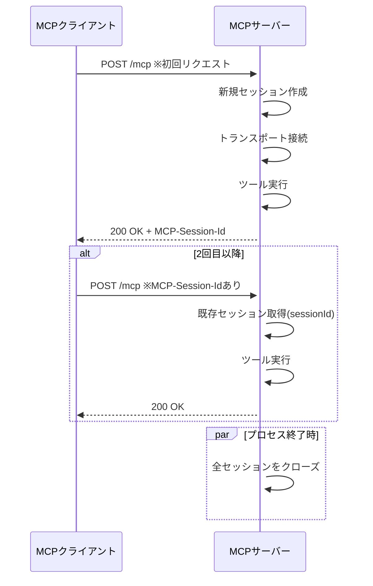

## はじめに

本ページは「AIエージェントとシステムをつなぐMCP入門」の続編です。  
今回は、StreamableHTTPで通信するMCPサーバーのステートフル実装について説明します。  

ステートフル構成は、同じ利用者の連続操作を同一セッションとして扱いたい場合に有効です。  
たとえば「ツールの呼び出し結果を次の呼び出しに引き継ぐ」「セッション単位で一時状態を保持する」「接続中の文脈を維持する」といった用途で使います。  

本記事では、ステートレス実装との違いに焦点を当て、ステートフル構成で押さえるポイントを整理します。  
掲載コードは[こちら](https://github.com/ubata-mamezou/developer-site-article-examples/tree/main/mcp-server_http)で公開しています。

:::info: シリーズ目次
**連載：AIエージェントとシステムをつなぐMCP入門**
* [イントロダクション](/blogs/2026/04/24/mcp-impl_introduction/)
* [stdio実装編](/blogs/2026/05/08/mcp-impl_stdio/)
* [StreamableHTTPステートレス実装編](/blogs/2026/05/22/mcp-impl_http_stateless/)
* **StreamableHTTPステートフル実装編（本ページ）**
:::

## 今回使用するライブラリなど

* npm@11.11.1
* node@22.22.0
* typescript@6.0.3
* @modelcontextprotocol/sdk@1.29.0
* zod@4.3.6

## ステートレスとの違い

まず、実装方針の差を先に整理します。

|観点|ステートレス|ステートフル|
|---|---|---|
|サーバーおよびトランスポートのライフサイクル|リクエストごとに生成・破棄|セッションごとの接続コンテキストとして生成し再利用|
|セッションID|基本は使わない|`sessionIdGenerator`で各トランスポートに紐づくIDを決定して管理|
|接続処理|リクエストごと|セッション初回リクエスト時に1回|
|終了処理|レスポンス後|SIGINTなどですべてのセッションをまとめて|

:::info: サーバー、トランスポート、セッションの関係
「1つのサーバーが、1つのトランスポートを使って、複数のセッションを管理する」形を想像しているとセッション管理の実装に困惑します。  

今回使用したバージョンでは`McpServer`が同時に接続できる`transport`は1つで、`StreamableHTTPServerTransport`も単一の`sessionId`しか保持できません。
そのため、今回のサンプルはセッションごとにサーバーとトランスポートを管理する形を採っています。
:::

:::column: SIGINTとは
`SIGINT`は「割り込みシグナル」です。  
ターミナルで`Ctrl + C`を押したときにプロセスへ通知され、Node.jsでは`process.on("SIGINT", ...)`で終了前処理を実装できます。  
今回は、サーバーで保持していた接続や状態の破棄に利用しています。
:::

## サーバーの実装

簡単にMCPサーバーを実装してステートレスとの差分を説明します。  
コードの全体は[こちら](https://github.com/ubata-mamezou/developer-site-article-examples/blob/main/mcp-server_http/src/index.stateful.ts)をご覧ください。  



### 差分1: セッションコンテキストを保持する

ステートレスでは、リクエスト単位で都度生成していました。  
ステートフルでは、セッションIDをキーにして接続コンテキストを保持します。  
ここでの`SessionContext`は「MCPサーバープロセスそのもの」ではなく、SDKの接続モデルに合わせたセッション単位の実装コンテキストです。  

```ts
type SessionContext = {
	server: McpServer;
	transport: StreamableHTTPServerTransport;
};

const sessions = new Map<string, SessionContext>();
```

:::info: 実運用で状態を管理する場合
今回は簡潔さを優先してメモリで状態を管理しています。  
実際に運用する場合は、メモリリーク防止や分散環境下の運用を考えるとNoSQLなどの外部ストアを使うことを検討したほうが安全です。
:::


### 差分2: リクエストをセッション単位で振り分ける

既存セッションIDがあれば対応するコンテキストを使い、なければ新しいセッションコンテキストを作成します。

* `sessionIdGenerator`
名称から勘違いしてしまいがちですが、汎用的な採番戦略ではありません。  
これはトランスポートに紐づくセッションIDを初期化時に決めるためのコールバックです。  

* `MCP-Session-Id`
初回のリクエストで振り出され、クライアントが受け取ります。  
2回目以降のリクエストでは、`MCP-Session-Id`ヘッダーとして付与して再利用します。  

```ts
async function createSessionContext() {
  const transport = new StreamableHTTPServerTransport({
    sessionIdGenerator: () => randomUUID(),
  });
  const server = createServer(() => transport.sessionId);
  await server.connect(refineTransport(server, transport));
  return { server, transport };
}

app.post("/mcp", async (req, res) => {
	const sessionId = req.headers["mcp-session-id"] as string | undefined;
	let context: SessionContext | undefined;

	if (sessionId) {
		context = sessions.get(sessionId);
	} else {
		context = await createSessionContext();
	}

	await context.transport.handleRequest(req, res, req.body);

	// initialize 後に transport 自身へ設定された sessionId をキーに保持する。
	const issuedSessionId = context.transport.sessionId;
	if (issuedSessionId) {
		sessions.set(issuedSessionId, context);
	}
});
```

### 差分3: プロセス終了時に全セッションをまとめてクローズする

セッションごとにサーバーとトランスポートを保持しているため、終了時にすべてのセッションを明示的にクローズします。

```ts
process.on("SIGINT", async () => {
	for (const context of sessions.values()) {
		await context.transport.close();
		await context.server.close();
	}
	process.exit(0);
});
```
:::info: 実運用におけるセッションの終了処理
今回のサンプルは、プロセス終了時に全セッションをまとめてクローズする形にしています。  
実運用では、一定期間操作がないセッションを自動的に破棄したり、クライアントが明示的にセッションを終了できる仕組みを用意することも重要です。
:::

## セッション管理を確認

セッションごとに値を保持する`counter`ツールを追加実装して、セッションごとに値が保持されていることを確認します。  
確認には複数セッションで操作が必要なので、MCP InspectorとPostmanを併用します。  
* MCP Inspectorの実行結果

* Postmanの実行結果

MCP Inspectorから3回、Postmanから2回ツールを実行した結果です。  
図で確認できる通り、それぞれ別のセッションIDが振り出され、セッションごとにcounterでインクリメントする値が管理されていることが確認できました。

:::info: PostmanでMCPを追加する場所  
ひさしぶりにPostmanを使い、MCPのCollection追加に迷ったので場所を掲載しておきます。

:::

## セッションが切り替わることを確認

MCPサーバーを再起動し、セッションが切り替わることを確認します。


先ほどとは異なるセッションIDが割り振られ、countが1に戻っていることが確認できました。

## まとめ

* ステートフルは、同一セッション内で、リクエストをまたいだ状態を保持できます。
* 一方、ステートフルにしたことで、終了時のクローズやセッション管理など運用面の責務が増えます。ツールの呼び出しに順序を求めるような場合はステートフルにしたいところですが、単純さを優先するならステートレスにするというのが現実的な判断になると思います。
