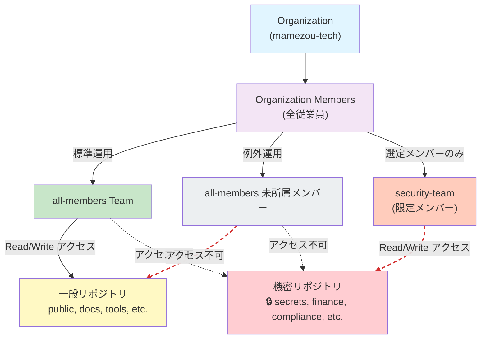

## はじめに

GitHub Organization を運用していると、セキュリティと利便性のバランスを取る必要があります。先日、「機密性の高いデータを保持するリポジトリを作りたいので、オーガニゼーションの Basic Permission を `write` から `no permission` に変更してほしい」という相談を受けました。

この要望は妥当ですが、そのまま実装すると新規リポジトリ作成のたびにメンバーのアクセス権を個別設定しなければならず、管理者の負担が大幅に増えてしまいます。

本記事では、Enterprise プランではなく Teams プランの制限下で実装できるアクセス権管理戦略をご紹介します。

## 問題の整理

### 環境の制約
大前提として以下があります。

- GitHub Enterprise ではなく Team プラン
- Team ベースのアクセス制御は可能だが、細かい設定に限界がある

### 元々の課題

- Basic Permission が write に設定されている
- 機密性の高いリポジトリに対して、デフォルトでアクセス権が与えられてしまう
- これを防ぐため、Basic Permission を no permission にしたい

### その先の課題

- Basic Permission を no permission に変更すると、全ての新規リポジトリでメンバーのアクセス設定が必要
- 新規メンバー追加時にも、リポジトリごとのアクセス設定が必要
- 管理作業が爆発的に増加する

## 今回の解決策
GitHub のことは GitHub Copilot に聞こうということで、Web 版の Copilot くんに相談し、オーガニゼーション内のチームによるセキュリティ境界を構築することにしました。

### アクセス権管理の全体像

以下に構築したアクセス権管理の全体像を示します。



この構成では、`all-members` への所属がアクセス可否を決めるセキュリティ境界となり、未所属の Organization メンバーは一般リポジトリ・機密リポジトリのいずれにもアクセスできません。

### 基本戦略：「ホワイトリスト方式」への転換

以下の方針でアクセス権を整理します。

**1. 全メンバーが所属する統合チームの作成**

`all-members` という全メンバーが所属するチームを作成します。このチームには、ほぼ全員がアクセスすべき一般的なリポジトリへのアクセス権を付与します。

利点：
- 新規メンバー追加時は、このチームに追加するだけで大多数のリポジトリにアクセス可能
- リポジトリ作成後のデフォルトアクセス設定が不要

**2. 機密リポジトリの隔離**

機密性の高いリポジトリ（例：構成情報、個人情報、営業秘密など）は、`all-members` チームからは見えないようにします。

その代わり、必要なメンバーのみで構成した別チーム（例：`security-team`、`finance-team`）を作成し、そのチームにのみアクセス権を付与します。

**3. リポジトリごとの権限設定**

```
リポジトリA（一般向け）
  └─ all-members チーム: read
  
リポジトリB（一般向け）
  └─ all-members チーム: write
  
リポジトリC（機密：セキュリティ）
  └─ security-team チーム: write
  └─ 特定ユーザー: admin

リポジトリD（機密：財務）
  └─ finance-team チーム: write
  └─ 特定ユーザー: admin
```

## 実装手順

### Step1: all-members チームの作成
1. Organization Settings → Teams
2. 「Create a team」から `all-members` チームを作成
3. 新規メンバー追加時に画面から本チームを選択して追加

### Step2: リポジトリアクセス権の設定
1. リポジトリの Settings → Collaborators and teams
2. `all-members` チームを追加し、適切な権限（Read/Write）を設定

### Step3: 機密リポジトリの個別設定
1. 機密リポジトリは `all-members` チームを追加しない
2. 専用チーム（例：`security-team`）を作成し追加
3. または、特定ユーザーのみを直接追加

## 自動化でリポジトリへのチーム追加を効率化

前述の戦略を実装する際、課題となるのは **既存・新規リポジトリへの `all-members` チームの追加を漏れなく行うこと** です。GitHub Actions を使ってこのプロセスを自動化できます。

### 実装の課題

- 新規リポジトリ作成後、`all-members` チームの追加を忘れることがある
- 既存リポジトリ数が多い場合、手動で一括追加するのは手間
- リポジトリ管理者により追加漏れが生じる可能性

### 自動化の仕組み

GitHub API と GitHub CLI を使用し、以下の処理を自動実行します。

**スクリプト例**

```bash
#!/bin/bash
set -e

ORG="mamezou-tech"
TEAM="all-members"
DRY_RUN=${DRY_RUN:-false}

if [ "$DRY_RUN" = "true" ]; then
  echo "🔍 DRY RUN MODE - No actual changes will be made"
fi

# 除外リポジトリの設定（機密リポジトリなど）
EXCLUDE_REPOS=(
  "secret-repo-1"
  "confidential-data"
)

# Organization のリポジトリ一覧を取得
repos=$(gh api --paginate /orgs/$ORG/repos --jq '.[].name')

success_count=0
skip_count=0
fail_count=0

for repo in $repos; do
  # 除外リポジトリをスキップ
  if [[ " ${EXCLUDE_REPOS[@]} " =~ " ${repo} " ]]; then
    echo "⊘ Skipping: $repo (excluded)"
    ((skip_count++)) || true
    continue
  fi

  echo "Adding $TEAM to $ORG/$repo..."

  if [ "$DRY_RUN" = "true" ]; then
    echo "✓ (dry-run)"
    ((success_count++)) || true
  else
    if gh api --method PUT \
      /orgs/$ORG/teams/$TEAM/repos/$ORG/$repo \
      -f permission=push \
      --silent; then
      echo "✓"
      ((success_count++)) || true
    else
      echo "✗ Failed"
      ((fail_count++))
    fi
  fi
done

echo ""
echo "================================"
echo "Repository Sync Summary:"
echo "  Success: $success_count"
echo "  Skipped: $skip_count"
echo "  Failed:  $fail_count"
echo "================================"
```

**スクリプトのポイント**

- `EXCLUDE_REPOS`: 除外リポジトリを明示的に管理（機密リポジトリはここに列挙）
- `permission=push`: 書き込み権限を付与（`permission=pull` なら読み込み権限のみ）
- `DRY_RUN`: true 時はシミュレーション実行
- API 呼び出しで一括処理し、人手を削減

:::info
最初 `permission=push` のところを Copilot くんが `write` にしていて、実行時にハマりました。GitHub API Copilot くんでも間違えるほど対称性がない部分があるので注意が必要です。
:::

### GitHub Actions ワークフロー

```yaml
name: Sync all-members Team

on:
  workflow_dispatch:
  schedule:
    - cron: '0 2 1 * *'  # 毎月1日 2:00 UTC に実行
  pull_request:
    paths:
      - '.github/workflows/sync-all-members-team.yml'
      - 'scripts/sync-all-members-repos.sh'

jobs:
  sync-team: 
    runs-on: ubuntu-latest
    
    steps:
      - name: Checkout
        uses: actions/checkout@v6
      
      - name: Add all-members team to repositories
        run: bash scripts/sync-all-members-repos.sh
        env:
          GH_TOKEN: ${{ secrets.ORG_MEMBER_PAT }}
          DRY_RUN: ${{ github.event_name == 'pull_request' }}
```

**ワークフロー構成のポイント**

- `workflow_dispatch`: 手動実行で即座に同期漏れをチェック可能
- `schedule`: 定期実行（例：毎月1日）で同期漏れを自動検出
- `pull_request`: スクリプト更新時に自動テスト実行
- `DRY_RUN`: PR では true で変更をシミュレーション

**必要なシークレット設定**

- `ORG_MEMBER_PAT`: Organization リポジトリ管理権限を持つ Personal Access Token
- スコープ: `admin:org`, `repo` など

### 運用のコツ

✅ スクリプト更新時は PR から自動実行で確認してからマージ
✅ 除外リポジトリは明示的にコメント付きで管理
✅ 定期実行により同期漏れを定期的に検出・修正
✅ 手動実行（workflow_dispatch）でオンデマンド同期も可能
✅ 新規リポジトリ作成直後の手動実行で即座にチーム追加可能

## 疎通確認
うまく構築できているはずですが、アクセス制御が意図どおり機能しているかを確認するため、Organization メンバー(非限定メンバー)に実際に機密リポジトリのリンクを開いてもらい、挙動を確認しました。

:::column:Slack の会話
👦 kondoh 16:16
ちょっとお願いがあるんですが、このリポジトリを開いたらどうなるか教えてください。  
https://github.com/mamezou-tech/[private-repo-for-restricted-team]
👧 nakamura 16:27  
404になります。
👦　kondoh 16:28  
ありがとうございます！機密性の高いリポジトリなので、404で大丈夫です。💯
:::

## ポイントと注意点
今回の構成には、以下のメリットと注意点があります。

### メリット

✅ Basic Permission を変更せずにセキュリティを向上
✅ 新規メンバー追加時の作業が最小限で済む
✅ ほとんどのリポジトリへのアクセスが自動的に付与される
✅ GitHub Enterprise に比べて低コスト

### デメリット・注意事項

⚠️ 機密リポジトリの管理は手動作業
⚠️ チーム構成の変更時にも対応が必要
⚠️ 定期的なアクセス権の監査が必要

## さいごに

GitHub Organization のアクセス権管理は、セキュリティと運用性のバランスが重要です。Enterprise プランがなくても、チーム機能を活用することで、ある程度の制御は可能です。

重要なのは、「全員がアクセスすべきリポジトリ」と「限定的にアクセスすべきリポジトリ」を明確に分類することです。この分類が甘いと、セキュリティリスクが発生したり、逆に運用が複雑になったりしますので注意が必要です。
