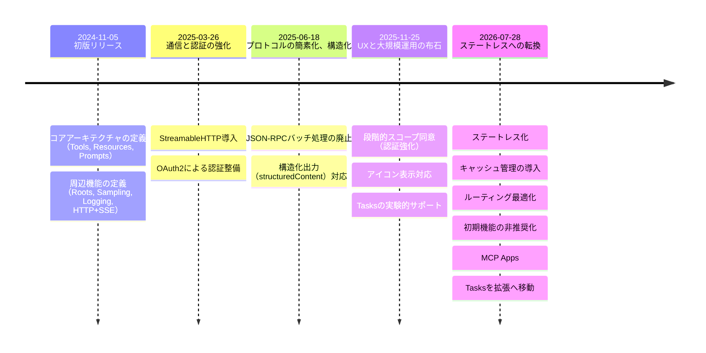
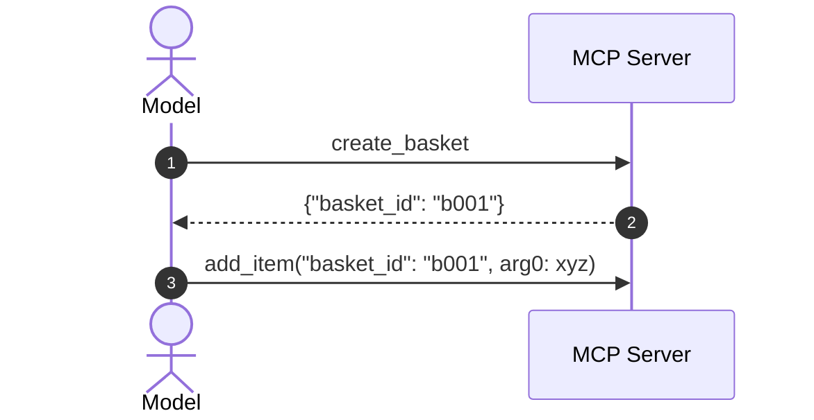
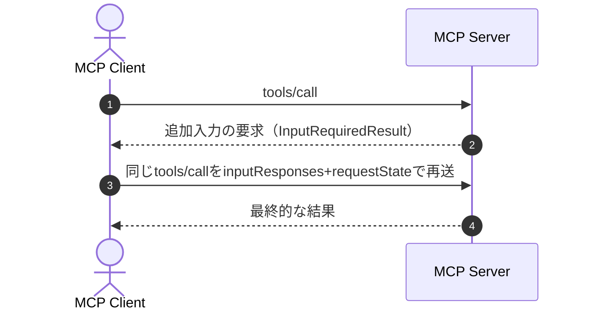

## はじめに

Model Context Protocol (MCP) は、2024年11月の初版リリース以来、AIモデルと外部データ・機能を接続する標準プロトコルとして急速に進化してきました。  
今回の2026-07-28 Release Candidate（以下、RC）は、単なる機能追加ではなく、プロトコルの実運用前提を大きく変える改訂です。

とくに注目すべきは、プロトコル層のステートレス化です。  
セッション管理を外し、ロードバランシング・再試行・観測性・キャッシュ運用をHTTP標準に近い形へ寄せることで、エンタープライズ環境でも扱いやすい構成へ移行しようとしています。  

本ページでは、この改訂内容を仕様差分と実装視点で、RCの要点、仕様の変遷、具体的な変更点という流れで説明します。  

公式ブログ: [The 2026-07-28 MCP Specification Release Candidate](https://blog.modelcontextprotocol.io/posts/2026-07-28-release-candidate/)

## RCの要点

今回のRCは「機能追加」より、「実運用前提の再設計」が主眼になります。  
とくに、プロトコル層セッションを廃止してステートレスにシフトすることで、ロードバランシング、再試行、観測性、キャッシュ運用がHTTP標準の作法に近づきました。  
さらに、Extensions（MCP Apps/Tasks）、認可強化、非推奨ライフサイクルが同時に導入され、仕様の進化プロセスも整備されています。  

* 最大のBreaking Changeは、プロトコル層セッションを廃止し、**ステートレスファースト**へ移行
* Streamable HTTPは、**自己完結リクエスト+必須ヘッダー**へ移行
* サーバー起点の入力要求は、SSE維持型から **InputRequiredResult+再送** のマルチラウンドトリップへ移行
* Dynamic Client RegistrationはClient ID Metadata Documentsへの移行が推奨される
* MCP AppsとTasksは、Extensionとして正式化
* 入出力スキーマがJSONスキーマ（2020-12）に準拠

## MCP仕様の変遷


* 2026-05-21: RC確定
* 2026-07-28: 最終仕様の公開予定
* 非推奨確定～最低12カ月以内: 非推奨機能の削除禁止期間

## 仕様変更の詳細

今回予定されている仕様変更は下記の通りです。  
🚨はBreaking Changeを示します。  

1. プロトコルのステートレス化: `initialize`/セッション依存を廃止し、自己完結リクエストへ移行
   * 🚨 リクエストモデルの変更: 必須ヘッダーと`_meta`を毎リクエストで送信
   * 🚨 レスポンスモデルの変更: `resultType`が必須化
   * 🚨 ハンドシェイクとセッションの廃止: `initialize`, `initialized`, `Mcp-Session-Id`を廃止
   * ステートレスプロトコルにおけるステートフルアプリケーション: Explicit Handle方式で状態を引き回す
   * 🚨 サーバーからクライアントへのリクエストを再構築: `input_required`, `requestState`を用いた再送モデルへ
   * 🚨 ルーティング（必須HTTPヘッダーによるトラフィック制御）: ボディ解析なしでルーティング可能にし、検証を厳格化
   * キャッシング機構の導入: `ttlMs`, `cacheScope`で鮮度と共有可否を明示
   * 観測性（W3C Trace Contextの伝搬を標準化）: `traceparent`などで分散トレース相関を標準化
   * 🚨 変更通知の再編: `subscriptions/listen`中心に再編し、旧購読APIを整理
2. MCP Apps: サーバーレンダリングUIを公式Extensionとして扱う
3. 🚨 Tasks APIをエクステンションへ移行: コア実験機能からExtensionへ再設計
4. 認可の強化: OAuth2.0/OIDC運用に寄せた要件を強化
5. 🚨 機能の非推奨化: Roots、Sampling、LoggingをDeprecated化
6. 入出力スキーマがJSONスキーマ（2020-12）に準拠: 表現力を拡張し、バリデーション要件を明確化
7. ガバナンスの変更: Lifecycle、Extensions TrackおよびConformance連動を明文化

### 1. プロトコルのステートレス化

これまではStreamable HTTP通信において、まず`initialize`リクエストでセッションを確立し、以降のリクエストには`Mcp-Session-Id`ヘッダーを付与する必要がありました。  
2026-07-28では**この接続確立フロー全体がプロトコル層から除去されます。**

#### リクエストモデルの変更

リクエストモデルに以下の変更が入ります。
* リクエストごとに`_meta`へプロトコルバージョンや機能宣言（`capabilities`）を内包します。
* ヘッダーおよび`_meta`で指定したプロトコルバージョンが一致していること。不一致の場合は`HeaderMismatchError`（`-32020`）で拒否されます。
* 要求したバージョン自体がサーバー非対応の場合は`UnsupportedProtocolVersionError`（`-32022`）が返されます。

* **2025-11-25仕様**
    ```json: 初回
    {
    "jsonrpc":"2.0","id":1,"method":"initialize",
    "params":{
        "protocolVersion":"2025-11-25",
        "capabilities":{},
        "clientInfo":{"name":"sample-client","version":"1.0.0"}
    }
    }
    ```
    ```json: 2回目以降
    Mcp-Session-Id: 1a2b3c4d-5e6f-7g8h
    {
    "jsonrpc": "2.0","id": 2,"method": "tools/call",
    "params": {
        "name": "get_user",
        "arguments":{"user_id":"u123"}
    }
    }
    ```

* **2026-07-28仕様**
    ```json
    MCP-Protocol-Version: 2026-07-28
    Mcp-Method: tools/call
    Mcp-Name: get_user

    {
    "jsonrpc": "2.0","id": 1,"method": "tools/call",
    "params": {
        "name": "get_user",
        "arguments": { "user_id": "u123" },
        "_meta": {
        "io.modelcontextprotocol/protocolVersion":"2026-07-28",
        "io.modelcontextprotocol/clientInfo":{"name":"sample-client","version":"1.0.0"},
        "io.modelcontextprotocol/clientCapabilities":{}
        }
    }
    }
    ```

#### レスポンスモデルの変更

レスポンスモデルに以下の変更が入ります。
* `resultType`が必須化（取りうる値: `complete`, `input_required`）

    ```json
    {
    "resultType": "input_required",
    "inputRequests": {
        "confirm": {
        "type": "elicitation",
        "message": "3ファイルを削除しますか？",
        "schema": { "type": "boolean" }
        }
    },
    "requestState": "1a2b3c4d5e6f7g8h9i0j..."
    }
    ```

#### ハンドシェイクとセッションの廃止

通信の開始と維持に使用していたセッション管理が変更されます。  
これにより、スティッキールーティングやセッション管理が不要になるため、水平スケーリングが容易になります。  

| 項目 | 2025-11-25 | 2026-07-28 |
|---|---|---|
| `initialize`, `initialized` ハンドシェイク | 必須 | 廃止([SEP-2575](https://github.com/modelcontextprotocol/modelcontextprotocol/pull/2575)) |
| `Mcp-Session-Id`ヘッダー | 2回目以降のリクエストに必須 | 廃止（[SEP-2567](https://github.com/modelcontextprotocol/modelcontextprotocol/pull/2567)） |
| プロトコルバージョン、クライアント情報 | 初期化時に1回交換 | リクエストごとに`_meta`に含める |
| サーバーケーパビリティの取得 | 初期化レスポンスで受け取る | 新設の `server/discover` メソッドで都度取得 |

* **2025-11-25仕様**
    ```mermaid
    sequenceDiagram
    actor c as MCP Client
    participant s as MCP Server

    c->>+s: initialize（セッション確立）
    s-->>-c: 
    c->>+s: tools/call(<br>Mcp-Session-Id, <br>name: get_user)
    s-->>-c:
    ```

* **2026-07-28仕様**
    ```mermaid
    sequenceDiagram
    actor c as MCP Client
    participant s as MCP Server

    c->>+s: tools/call(<br>MCP-Protocol-Version: 2026-07-28, <br>Mcp-Method: tools/call, <br>Mcp-Name: get_user)
    s-->>-c:
    ```

#### ステートレスプロトコルにおけるステートフルアプリケーション

プロトコルがステートレスになっても、アプリケーションが状態を持つことはできます。  

ステートレス化に伴い、状態管理の責任はトランスポート層からアプリケーション層（モデルとの対話）へと移動します。  
セッションへ依存する替わりに、サーバーは明示的なハンドルをツールの戻り値として発行して、次回のツール呼び出し時に引き渡す設計が推奨されます。
これにより、状態がモデルの推論コンテキストに統合され、より柔軟な推論制御が可能になります。


* 2のレスポンス: `basket_id`や`context_token`のような明示的なハンドル（Explicit Handle）をツールの戻り値として発行する必要があります。

#### サーバーからクライアントへのリクエストを再構築

サーバーが処理中にクライアントへ追加入力を求めるエリシエーションは、接続を維持する替わりに`InputRequiredResult`を返却し、それを再度リクエストで投げ直す仕組みに再設計されます。


* サーバーからの入力要求は「アクティブなクライアント要求の処理中」に限定されます。「突然のプロンプト」は禁止され、すべてのエリシテーションはユーザーが開始したアクションに紐付く必要があります。
* 2のレスポンス
    ```json
    {
    "resultType": "input_required",
    "inputRequests": {
        "confirm": {
        "type": "elicitation",
        "message": "3ファイルを削除しますか？",
        "schema": { "type": "boolean" }
        }
    },
    "requestState": "1a2b3c4d5e6f7g8h9i0j..."
    }
    ```
    * `InputRequiredResult`には`requestState`が必要。

**関連SEP**
* マルチラウンドトリップ: [SEP-2322 Multi Round-Trip Requests](https://github.com/modelcontextprotocol/modelcontextprotocol/pull/2322)
* サーバー発の入力要求の制約: [SEP-2260 Server-initiated requests constraints](https://github.com/modelcontextprotocol/modelcontextprotocol/pull/2260)

#### ルーティング（必須HTTPヘッダーによるトラフィック制御）

Streamable HTTPで下記の3ヘッダーが必須になります。  
これにより、ロードバランサー、ゲートウェイ、レートリミットがリクエストボディを解析（DPI）せずルーティングできるようになります。  
ヘッダーとボディの内容が一致しない場合、サーバーはリクエストを拒否します。

| ヘッダー | 概要 | 用途|
|---|---|---|
| `MCP-Protocol-Version` | プロトコルバージョン（例: 2026-07-28）|バージョン整合性の検証|
| `Mcp-Method` | JSONメソッド名（例: `tools/call`）|メソッド単位のルーティング、レート制限|
| `Mcp-Name` | ツール名やリソース名（例: `search`）|ツールおよびリソース単位のルーティング|

**関連SEP**
* ルーティングヘッダー: [SEP-2243](https://github.com/modelcontextprotocol/modelcontextprotocol/pull/2243)

#### キャッシング機構の導入

リスト応答（tools/listなど）にキャッシュ機構が導入されます。  
これにより、MCPクライアントはレスポンスの有効期間（ttlMs）とスコープ（cacheScope）を認知できます。  
リストの変更を知る場合、これまではSSEストリームを維持して検知するのが唯一の手段でしたが、これに代替する手段として活用できます。  
* ttlMs: ミリ秒単位の有効期間。
* cacheScope: public（共有可）またはprivate（個別ユーザー限定）。

**関連SEP**
* キャッシュ機構: [SEP-2549](https://github.com/modelcontextprotocol/modelcontextprotocol/pull/2549)

#### 観測性（W3C Trace Contextの伝搬を標準化）

分散トレーシングをサポートするため、`_meta`フィールドにW3C Trace Context（`traceparent`, `tracestate`, `baggage`）の伝播が標準化されました。  
これにより、OpenTelemetry互換のバックエンドで、ホストからサーバー、さらにその先のバックエンドまでを一貫したスパンツリーとして可視化できます。

**関連SEP**
* 観測性: [SEP-414](https://github.com/modelcontextprotocol/modelcontextprotocol/pull/414)

#### 変更通知の再編

変更通知もステートレス化に合わせて再編されています。  
これまでの「接続やセッションに連なる通知」から、明示的なリクエストに紐づく通知へ再編されます。  

**主な変更点**
* 変更通知は`subscriptions/listen`のレスポンスストリームで受信する形に統一されます。
* 旧来の購読API（`resources/subscribe`, `resources/unsubscribe`）は整理されます。
* 旧来のGETベースのSSE受信および再開機構（`Last-Event-ID`）は対象外です。
* `notifications/progress`および`notifications/message`は、`subscriptions/listen`ではなく「そのリクエスト自身のレスポンスストリーム」に流れます。
* クライアント実装は「変更通知ストリーム」と「個別リクエストの進捗通知」を分離して扱う必要があります。
* 接続断の復旧時は、過去ストリーム再開ではなく、必要なリクエストを再送する設計が前提になります。

### 2. MCP Apps

サーバーがHTML UIテンプレートを提供し、クライアントがサンドボックス化されたiframe内で描画する機能です。  
データの可視化や複雑なフォーム入力を可能にします。  
UI内のアクションはすべてJSON-RPCプロトコルを通じて伝達されるため、監査ログや同意フローの対象として統合管理が可能です。  

**特徴**
* 単なるテキスト応答ではなく、MCPサーバー主導のUI体験を組み込める
* ツール定義時にUIテンプレートを宣言する設計が必要
* セキュリティレビュー対象が「ツール実装 + UIテンプレート」に広がる

**関連SEP**
* MCP Apps: [SEP-1865](https://github.com/modelcontextprotocol/modelcontextprotocol/pull/1865)

### 3. Tasks APIをエクステンションへ移行

2025-11-25でコア機能として実験的に導入されたTasksが**エクステンションとして再設計されます。**  
2025-11-25のTasks APIを実装している場合は、移行が必要です。

| 項目 | 2025-11-25 | 2026-07-28 |
|---|---|---|
| 位置づけ | コア機能（実験的） | エクステンション（正式） |
| タスク作成 | クライアント主導 | サーバー主導（`tools/call`へのレスポンスとして返す） |
| タスク取得 | `tasks/result`（ブロッキング） | `tasks/get`（ポーリング） |
| タスク入力 | `tools/call`の再送で対応 | `tasks/update`で入力応答を送信 |
| タスクキャンセル | `tasks/cancel` | `tasks/cancel` |
| `tasks/list` | あり | 廃止（セッションなしでは安全なスコープを設定できないため） |

**関連SEP**
* Tasks API: [SEP-2663](https://github.com/modelcontextprotocol/modelcontextprotocol/pull/2663)

### 4. 認可の強化

認可仕様がOAuth2.0+OIDC(OpenID Connect)の実運用に即した形で強化されます。  
とくに（[RFC9207](https://www.rfc-editor.org/info/rfc9207/)）[iss](https://github.com/modelcontextprotocol/modelcontextprotocol/pull/2468)は、MCPの多サーバー接続構成で起きやすいmix-up系リスクへの対策として重要です。

* Authorization Responseの`iss`検証
  * 認可レスポンス（Authorization Response）に含まれる`iss`パラメーターの検証が、MCPクライアント側で必須になります。  
  * これにより、1つのクライアントが複数のサーバーと接続するMCP特有の構成において発生しやすい「ミックスアップ攻撃（認可コードを悪意あるサーバーにだまし取られる攻撃）」を低コストで対策できます。
* 動的クライアント登録（Dynamic Client Registration）時の`application_type`宣言
  * 動的クライアント登録する際、クライアントは適切なapplication_typeを宣言することが必須になります。
  * これにより、認可サーバーがデスクトップやCLIを誤ってWebアプリと判定し、セキュリティ上の理由からlocalhostのリダイレクトURIを拒否してしまうような、実装上の競合を回避します。
* クライアント資格情報（Credentials）の認可サーバー（issuer）の紐づけ強化
  * クライアント資格情報は、それを発行した認可サーバーに厳密に紐づけされなければなりません。他の認可サーバーへの使い回しは禁止され、リソースサーバーの認可サーバーが変更された場合は再登録を義務付けています。
* リフレッシュトークンを要求する方法の明文化
* ステップアップにおけるスコープ蓄積動作の定義
  * 権限の累積によって段階的に権限付与する動作（e.g. 最初にread権限を付与し、次いでwrite権限を追加。累積する形で権限を構成する）
* `.well-known` discovery suffixの定義

**関連SEP**
* Authorization Responseの`iss`検証: [SEP-2468](https://github.com/modelcontextprotocol/modelcontextprotocol/pull/2468)
* Dynamic Client Registrationの`application_type`宣言: [SEP-837](https://github.com/modelcontextprotocol/modelcontextprotocol/pull/837)
* クライアント資格情報のissuer紐づけ: [SEP-2352](https://github.com/modelcontextprotocol/modelcontextprotocol/pull/2352)
* リフレッシュトークン要求: [SEP-2207](https://github.com/modelcontextprotocol/modelcontextprotocol/pull/2207)
* ステップアップのスコープ蓄積: [SEP-2350](https://github.com/modelcontextprotocol/modelcontextprotocol/pull/2350)
* `.well-known` discovery suffix: [SEP-2351](https://github.com/modelcontextprotocol/modelcontextprotocol/pull/2351)

### 5. 機能の非推奨化

3機能が非推奨（Deprecated）になります。  
非推奨から削除までは12カ月間の猶予があるため、その間に移行が必要です。

|廃止機能|理由|推奨される移行先|
|---|---|---|
|Roots|ステートフルな設計と不整合|ツールの入力パラメーター(inputSchema) 、リソースURI|
|Sampling|責任境界の明確化|クライアント側の制御、プロバイダーAPI直接連携|
|Logging|業界標準の観測性ツール推奨|stdio: stderr, 構造化ログ: OpenTelemetry(W3C Trace Context)|

**関連SEP**
* 機能の非推奨化: [SEP-2577](https://github.com/modelcontextprotocol/modelcontextprotocol/pull/2577)

### 6. 入出力スキーマがJSONスキーマ（2020-12）に準拠

ツールの入出力スキーマ（`inputSchema`, `outputSchema`）がJSON Schema（2020-12）に対応しました。
これにより、`oneOf`, `anyOf`, `allOf`および`$ref`による高度なスキーマ定義が可能になり、ツールの型安全性が向上します。

出力スキーマはオブジェクトだけでなく任意のJSON値を使用できます。  

また、リソース未検出のエラーコードがMCPカスタム（-32002）から、JSON-RPC標準（-32602: 無効なパラメーター）に変更されます。

**関連SEP**
* JSON Schema 2020-12: [SEP-2106](https://github.com/modelcontextprotocol/modelcontextprotocol/pull/2106)
* リソース未検出エラーコード変更: [SEP-2164](https://github.com/modelcontextprotocol/modelcontextprotocol/pull/2164)

### 7. ガバナンスの変更

今後は同規模の破壊的変更を常態化しないための仕組みも同時に導入されています。

* 機能ライフサイクル（Feature Lifecycle）（Active/Deprecated/Removed）
  * 全機能にActive、DeprecatedおよびRemovedの状態を定義し、DeprecatedからRemovedまで最低12カ月の猶予を義務化します。
  * これにより、将来改訂での破壊的変更が予測可能になります。
* Extensions Trackの正式化
  * 新機能はまず拡張として提案および検証し、成熟したもののみコアへ取り込む運用に整理されました。
  * 公式拡張は独立リポジトリ（`ext-*`）で管理され、コア仕様と独立して進化できます。
* SEPとConformance Suiteの連動強化
  * 標準化トラックのSEPは、対応シナリオがConformance Suiteに入るまでFinalに到達できません。
  * 仕様策定と実装検証の乖離を抑え、SDK実装の相互運用性を高めます。

**関連SEP**
* Feature Lifecycle: [SEP-2596](https://github.com/modelcontextprotocol/modelcontextprotocol/pull/2596)
* Extensions Track: [SEP-2133](https://github.com/modelcontextprotocol/modelcontextprotocol/pull/2133)
* Conformance Suite連動: [SEP-2484](https://github.com/modelcontextprotocol/modelcontextprotocol/pull/2484)
* SDK tier system: [SEP-1777](https://github.com/modelcontextprotocol/modelcontextprotocol/pull/1777)

## 実装者向けアクション

実装者向けに、確認したい項目を簡単に整理します。  

* プロトコルのステートレス化: トランスポート層の移行
   * `initialize`, `initialized`前提コードの棚卸し
   * `Mcp-Session-Id`依存コードの洗い出し
   * リクエストヘッダーに`Mcp-Method`, `Mcp-Name`, `MCP-Protocol-Version`を設定
   * `_meta`に必須キー（`protocolVersion`, `clientInfo`, `clientCapabilities`）をリクエストごとに設定
   * HTTPヘッダーと`_meta`の一致検証失敗（`-32020`）および非対応バージョン（`-32022`）をハンドリング
   * `server/discover`呼び出しを実装し、対応バージョンとcapabilitiesを事前確認
   * レスポンスに`resultType`を設定
   * 変更通知の受信設計を`subscriptions/listen`前提へ移行
* 認可の強化: 認可運用の見直し
   * Authorizationの`iss`検証対応を確認
   * Dynamic Client Registrationの移行方針を整理
   * トレースコンテキストの伝播確認とログ収集設計を見直す
* 拡張機能と非推奨機能の整理
   * MCP Appsの導入有無を判断
   * Tasks APIの旧API利用箇所を抽出
   * Roots, Sampling, Loggingの移行計画を策定
   * エラーコードの変更: `-32002`から`-32602`
* SDKの更新
   * 各言語のTier 1 SDKを最新版にアップデートし、ステートレス実装へ移行する

## まとめ

今回の改訂は、単なる仕様の更新ではなく、MCPを「ステートレスなHTTP基盤上で運用するプロトコル」へ再設計するものです。  
ステートレス化によるスケーラビリティ、W3C Trace Contextなどによる運用ガバナンス強化は、エンタープライズ導入における技術的障壁を下げる効果が期待できます。  
