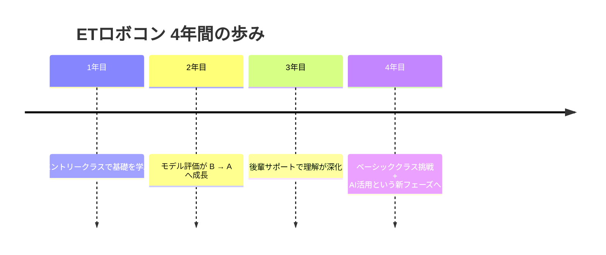

## はじめに

私が4年間取り組んできた **ETロボコンの活動の軌跡** を紹介します。  
昨年度はベーシッククラス（当時の名称：プライマリークラス）に挑戦し、AI活用を取り入れた新しい開発スタイルにも踏み込みました。  
これまでの経験がどのように積み重なり、昨年度の成果につながったのかをまとめています。  
最後までお付き合いいただければ幸いです。

## 4年間の活動をひとことで紹介すると

**「設計（UML）→ 実装 → 実機制御 → チーム運営 → AI活用」**  
と、毎年新しい挑戦を積み重ねてきました。

- **1年目**：エントリークラスで基礎を学ぶ  
- **2年目**：モデル評価がB→Aへ成長  
- **3年目**：後輩サポートで理解が深化  
- **4年目**：ベーシッククラス挑戦＋AI活用という新フェーズへ  

この4年間で、技術面もチーム面も大きく成長できたと感じています。

---

## 1. 参加のきっかけ：ロボットが動く"あの瞬間"をもう一度

私がETロボコンに参加し始めた理由は、高専時代のロボコン経験にあります。  
試行錯誤して作ったロボットが初めて思い通りに動いた瞬間の高揚感。  
「技術で仲間と何かを成し遂げる楽しさ」を、社会人になっても味わいたいと思い、参加しました。

## 2. ETロボコンとは：ソフトウェア重視の"教育型ロボコン"

ETロボコンは、**組込みソフトウェア技術の教育を目的としたロボットコンテスト**です。  
一般的なロボコンがハードウェアの工夫や機構設計を競うのに対し、ETロボコンは  
**「ソフトウェア設計（UML）と走行結果の両方を評価する」**  
という点が大きな特徴です。

詳しくはETロボコン公式サイトをご覧ください。

@[og](https://www.etrobo.jp/)

:::info
ETロボコンは2002年から開催されており、2026年で25年目を迎える長寿コンテストです。組込み技術者育成への貢献が評価され、**経済産業大臣賞を受賞**した実績もあります。
:::

### ETロボコンの目的

- 組込みソフトウェア技術者の育成  
- 分析・設計・制御モデリングを含む **PBL（Project-Based Learning）** の実践  
- 初心者からベテランまでが学び合える教育の場の提供  

### 全国規模の大会構成

ETロボコンは全国12地区で地区大会が開催され、  
上位チームは全国大会（チャンピオンシップ大会）へ進出します。

### レベルに合わせて選べる3つのクラス

- **エントリークラス（シミュレータ部門）**  
  初心者向け。シミュレーターで参加でき、設計と実装のつながりを学べる。

- **ベーシッククラス（フィジカル部門）**  
  旧プライマリークラス  
  初級〜中級者向け。モデル表現力やチーム開発を学ぶ。

- **アプライドクラス（フィジカル部門）**  
  旧アドバンスドクラス  
  実務経験者・上級者向け。制御技術やAIなど高度な要素を取り入れ、システム全体を可視化しながら開発を学ぶ。

### ソフトウェアで勝負するロボコン

ハードウェアは共通の市販キットを使用し、  
**「設計（モデルシート）＋走行結果」** の総合成績で評価されます。

モデルシートの信頼性・一貫性・表現力が重要で、  
走行タイムや難所クリアによるボーナスタイムと合わせて順位が決まります。

### 技術教育イベントが充実

- 技術教育（オンライン／オフライン）  
- モデリングワークショップ  
- 試走会  
- 地区大会での交流会  
- チャンピオンシップ大会での成果発表  

企業・学生・教育者が同じテーマで議論できる貴重な場となっています。

### 参加者数と実績

- 全国12地区で大会を開催  
- **累計 4,095チーム / 22,700名が参加**（公式発表）  

教育効果の高さから、企業研修や大学の授業にも広く活用されています。

### 大会との関わり

豆蔵は大会に参加するだけでなく、地区ゴールドスポンサーとして大会を支援しており、  
技術教育への取り組みを企業として積極的に行っています。

## 3. これまでの参加年ごとの振り返り

### 1年目：エントリークラス挑戦（＋アドバンスドクラスサポート）

初参加で手探り状態ながら、モデル作成と走行調整に取り組みました。  
アドバンスドクラスのサポートも経験し、上位クラスのレベルの高さを実感しました。

### 2年目：モデル評価がB → Aへ成長

モデリングに重点を置いて取り組んだ結果、評価がBからAへ向上。  
設計の重要性を強く感じた年でした。

### 3年目：後輩サポートで理解がさらに深まる

自分がA評価を受けたモデルをベースに、後輩へ「どうすればモデルが良くなるか」を伝える立場に。  
教えることで自分の理解も深まり、チーム全体の底上げにつながりました。

## 4. 昨年度（4年目）の取り組み：ベーシッククラス挑戦と"AI活用"という新しい武器

昨年度は大きな転換点でした。  
エントリークラスから一歩進み、**ベーシッククラスに挑戦**。  
さらに今年度は、**AIを積極的に活用した開発スタイル**にも踏み込みました。

### モデルのレベルアップ

複雑な制御に対応するため、状態遷移やクラス構造の精度を高め、設計段階での思考が大幅に深化しました。

### AIを活用したモデルのブラッシュアップ

AIを"設計レビューの相棒"として活用し、

- モデル改善案の生成  
- 抜け漏れチェック  
- UML表現の最適化  

など、設計品質の向上に役立てました。

### 実機を使ったロボット制御の習得

センサー値の取得、PID制御、ライン追従など、実機ならではの学びが多く、組込み制御の理解が深まりました。

### AIを用いたコーディング

コード生成やリファクタリングの提案など、AIを活用した開発スタイルにも挑戦しました。

### 結果

モデルは **シルバーモデル(2位)** を獲得。  
走行は課題が残ったものの、技術的な挑戦の幅は過去最大で、次年度につながる大きな経験となりました。

## 5. 今後の展望：UML × 実機 × 制御 × AI の4本柱をさらに深化

今年度は昨年度の経験を踏まえ、  
**UMLによる設計力、実機制御、制御技術、そしてAI活用**  
という4本柱をさらに強化していく予定です。

その取り組みの一環として、さらなるモデル作成のレベルアップを目標に  
**アプライドクラスへ挑戦** しています。  
昨年度は走行に課題が残りましたが、今年度はコース環境を整備し、  
**制御技術の底上げにも本格的に取り組んでいます。**

AI活用については、

- モデル改善  
- コード生成  
- 設計レビュー  

など、開発プロセス全体を支える重要な技術として位置づけています。

---

## 最後に

ETロボコンは、モデリング、コーディング、実機調整、AI活用など、幅広い技術を実践的に学べる場です。  
ロボットが動く瞬間のワクワクと、技術が積み重なっていく手応えを、これからも大切にしていきたいと思います。
