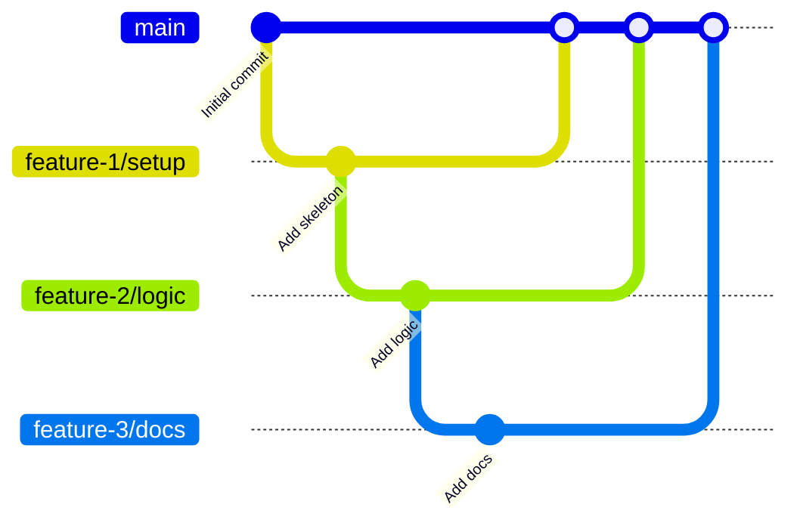

## はじめに
先月、GitHub のスタック PRs (Stacked pull requests) がパブリックプレビューになりました。

@[og](https://github.blog/changelog/2026-07-30-stacked-pull-requests-are-now-in-public-preview/)

これまでも PR のブランチからブランチを生やして、PR スタックさせることは可能でした。小さい PR をスタックすることで、1つの PR は小さくレビューしやすくなりますが、スタックのメンテナンスにコストがかかります。
スタック PRs でどこまで効率がアップするのか、見ていきたいと思います。

## 概念
PR を作るとき、ある修正 A を前提に 修正 B を入れたいケースで、未マージの A ブランチから B ブランチを作成して作業するということはよくあります。

- 1つ目の PR は base を main へ
- 2つ目以降は、直前の PR ブランチを base にする



小さい PR をスタックさせることで、1つ1つの PR の規模が小さくなり、レビューも楽になるというメリットがあります。しかし、PR をスタックさせると、PR 説明にベースブランチを書いたり、中間のスタックで発生した変更を上位のスタックのブランチにリベースして反映するという作業が頻発します。
スタック PRs は「特定のブランチを起点にした一連の PR スタック」に纏わる煩雑な作業を大幅に削減してくれます。

## 検証環境とドキュメント
本記事では、以下のバージョンで試しています。

- GitHub CLI (gh): 2.98.0
- gh-stack プラグイン: 0.1.0

GitHub CLI をインストールし、`gh auth login` は済ませておきましょう。以下のコマンドでスタック PRs のプラグインがインストールされます。

```shell
gh extension install github/gh-stack
```

公式ドキュメントの概要説明とクイックスタートは以下のページです。

@[og](https://docs.github.com/en/pull-requests/get-started/about-stacked-prs)
@[og](https://docs.github.com/en/pull-requests/get-started/stacked-prs-quickstart)

スタック PR のコマンドリファレンスは以下のページにあります。

@[og](https://docs.github.com/en/pull-requests/reference/stacked-prs-cli-commands)


## サンプルのリポジトリ構成
簡単なリポジトリを作って検証していきます。

main ブランチには README.md だけを置きました。この時点でリモートに push してしまって OK です。

```shell
.
└── README.md
```

feature/01-setup ブランチ。ソースコードやドキュメントを追加しました。

```shell
.
├── README.md
├── docs
│   └── notes.md
└── src
    └── hello.py
```

feature/02-add-logic ブランチ。ドキュメントとソースコードを追加しています。

```shell
├── README.md
├── docs
│   ├── notes.md
│   └── stacked-pr.md
└── src
    ├── calculator.py
    └── hello.py
```

feature/03-add-docs ブランチ。ドキュメントを追加しています。

```shell
.
├── README.md
├── docs
│   ├── notes.md
│   ├── stacked-pr.md
│   └── usage.md
└── src
    ├── calculator.py
    └── hello.py
```


## スタックの初期化

以下を実行して、3 本のブランチを 1 つのスタックとして初期化しました。

```shell
$ gh stack init --base main feature/01-setup feature/02-add-logic feature/03-add-docs
```
スタックが作成されました。
```
? Enable git rerere to remember conflict resolutions? (Y/n) 
✓ Adopted 3 branches: main ← feature/01-setup ← feature/02-add-logic ← feature/03-add-docs
  You're on feature/03-add-docs (top of stack).

What's next:
  • see the full stack:                          gh stack view
  • move between branches:                       gh stack switch
  • link these PRs into a Stack on GitHub:       gh stack submit
```

ローカルのブランチ関係は main を起点にした 3 段のスタックとして認識されました。

スタックを確認します。

```shell
gh stack view
```
スタックを構成する各ブランチと変更内容が一覧できます。
```
▶ feature/03-add-docs (current)  +61 -12
│  ▾ 2 files changed
│    README.md  +58 -12
│    docs/usage.md  +3 -0
│  ▸ 2 commits
│
├ feature/02-add-logic  +6 -0
│  ▸ 2 files changed
│  ▸ 1 commit
│
├ feature/01-setup  +4 -0
│  ▸ 2 files changed
│  ▸ 1 commit
│
└ main
```

:::info
この例では、3つのブランチを init で一括追加しましたが、単独のブランチを追加する場合は、`gh stack add` でブランチをスタックに追加可能です。ただし、これはブランチ作成とスタックへの追加を同時にやるコマンドです。既存のブランチを追加する方法は現時点では提供されてないようです。

```shell
gh stack add <branch>
```
:::

:::info
今回、まだ GitHub のリポジトリを作っていなかったので、作成後に以下のコマンドで、origin を設定しました。初回は、スタックの土台になる `main` ブランチを先に push しておくのがポイントです。既存のリポジトリからクローンしている場合は不要です。

```shell
git remote add origin https://github.com/kondoumh/stacked-pr-demo.git
```
:::

`gh stack submit` を使って、リモートにスタックの情報を反映していきます。TUI 画面が開いて各 PR の title と description を編集できます。あわせて ready for Review と Draft のどちらの状態で作成するのかも選べます。


スタックの最上位を選択すると、画面右下に `SUBMIT 3 PRs` というボタンが表示されます。


このボタンは、マウスでクリック可能です。クリックするとリモートリポジトリに対して反映が開始されます。

```shell
gh stack submit
Checking stack state...
Pushing to origin...
✓ Created PR #5 for feature/01-setup
✓ Created PR #6 for feature/02-add-logic
✓ Created PR #7 for feature/03-add-docs
✓ Stack created on GitHub with 3 PRs (stack #8)
✓ Pushed and synced 3 branches
```

Web UI で確認すると、3つのブランチとそれに対応する PR が作られていることが分かります。


:::info
PR が #5 から始まっていますが、これは一度スタックが不整合になってやり直したからです。
stack のクリーンアップは以下のように unstack で可能です。
```shell
# ローカル
gh stack unstack --local
# origin 側
gh stack unstack
```
:::

スタックの2番目の PR の画面です。マージの UI が通常の PR と異なり、スタック構造が表示されています。


## ブランチのリベース
PR をスタックして作業しているときよくあるのが、途中のブランチに変更を入れ、上位のブランチをリベースするという作業です。スタック内のブランチで作業してリベースを試してみましょう。

feature/02-add-logic で calculator.py にロジックを追加しました。(既存の add に multiply を追加)

```diff
@@ -1,2 +1,5 @@
 def add(a: int, b: int) -> int:
     return a + b
+
+def multiply(a: int, b: int) -> int:
+    return a * b
```

```shell
git status
On branch feature/02-add-logic
Changes to be committed:
  (use "git restore --staged <file>..." to unstage)
        modified:   src/calculator.py
```

コミットします。

```shell
git commit -m 'add logic to calculator.py'
```

スタックの上位である feature/03-add-docs にはこの変更がまだ反映されていません。従来ですと、feature/03-add-docs をチェックアウトし、git コマンドでリベースする必要がありました。スタック PRs の場合、作業したブランチの上位スタックに変更を反映させるには、以下のようにするだけです。

```shell
gh stack rebase --upstack
```

feature/02-add-logic の内容が、リベースの連鎖により波及していきます。

```shell
✓ Fetched latest main from origin
✓ Trunk main is already up to date
Stack detected: (main) <- feature/01-setup <- feature/02-add-logic <- feature/03-add-docs
Rebasing branches in order, starting from feature/02-add-logic to feature/03-add-docs
✓ Rebased feature/02-add-logic onto feature/01-setup
✓ Rebased feature/03-add-docs onto feature/02-add-logic
All upstack branches from feature/02-add-logic rebased locally with main (c137e85)
To push up your changes, run `gh stack push`
```

feature/03-add-docs をチェックアウトして git log を見ると、先ほどの calculator.py の変更コミットの上に、変更がリベースされているのが分かります。

```shell
commit 8279783de1fb932c4754b59cb01ad69cf7f7c3da (HEAD -> feature/03-add-docs)
Author: Copilot <copilot@example.com>
Date:   Sun Aug 23 12:51:14 2026 +0900

    Add workflow

commit 3b0f02f3523811819e0eaffda2c28f6443f8ff28
Author: Copilot <copilot@example.com>
Date:   Wed Aug 5 23:00:29 2026 +0900

    Document stacked PR workflow

commit 177241ca3fdd9c99462dc90b40f1072600e8fd3f (feature/02-add-logic)
Author: Copilot <copilot@example.com>
Date:   Sun Aug 23 15:45:01 2026 +0900

    add logic to calculator.py # 計算ロジック追加のコミット
```

:::info:
--upstack オプションをつけなければ、main からすべてのブランチに必要なリベースをやってくれます。

```shell
gh stack rebase
```

また、波及の途中でコンフリクトが発生すると処理が一時停止します。対象のファイルを修正して git add した後、gh stack rebase --continue を打てば再開できます。gh stack rebase --abort でスタック全体を元の状態に巻き戻せます。
:::

リベースを含む変更をリモートに反映するには、`gh stack push` を実行します。

```shell
$ gh stack push
Pushing 3 branches to origin...
✓ Pushed 3 branches
Run `gh stack view` to see your stack of PRs
```

PR にもちゃんと反映されています。


## スタック PRs のマージ

スタックのマージは、任意の階層で可能です。2番目のスタックの PR 画面でマージボタンを押してみます。


スタックの順にマージされました。


最上位のスタックの PR 画面です。自動的にベースブランチが main に切り替わっていました。


:::info
main への切り替えは少しラグがあるようです。マージ済みのブランチのままマージボタンが押せる状態でした。試してはいませんが、万が一マージしてしまっても、revert して、ベースブランチを手動で main にすれば OK だと思います。
事故らないためには、マージ後にヘッドブランチを自動削除する（Automatically delete head branches）」を有効にしておいた方がいいでしょう。
:::

## マージキューとの組み合わせ
今回試せていませんが、マージキューと組み合わせると、マージ作業自体からも解放されます。スタック PR（main ← PR1 ← PR2 ← PR3）で一番怖い事故は、順序の逆転や依存関係が壊れることです。

- マージキューなし： 「まず PR1 が承認されてマージされたか確認して、次に PR2 の CI が通るのを待ってからマージボタンを押して…」と、人間が順番を見張る必要があります。
- マージキューあり： 承認された PR をキューに放り込んでおけば、システム側が依存関係の順序を守って、自動的に検証・マージを順番に処理してくれます。

これにより、「途中の PR で main が壊れるリスク」を完全にゼロにできます。
開発体験としては、レビュー完了＝即「手放し」ができ、レビューアから Approve をもらったら、「とりあえずキューに追加して自分は次のタスクに行く」というムーブが可能になります。

:::info
かなり前ですが、マージキューの紹介記事もあります。

@[og](/blogs/2023/02/15/github-pr-merge-queue/)
:::

## さいごに
AI がコードを書いてくれることにより、PR 作成は爆速になり、1つの PR に含まれるファイルも多くなっています。人のレビューが滞留してしまうという現象があちこちの現場で起きていると思います。

PR が巨大になる理由として、開発者の心理的な側面もあります。あるタスクをやっていると、タスクに関係ない変更も入れちゃったりしがちです。スタックさせることは可能ですが、スタックに纏わる作業が面倒なので、まとめて作ってしまうためです。

スタック PRs が使える環境であれば、「あ、この修正は元の PR のスコープ超えてるな。」と思ったら `gh stack add ` で新しいブランチをスタックに積めばいいのです。

システムがスタックの管理を肩代わりすることで、「小さく作って、小さくレビューしてもらう」というベストプラクティスを自然に維持できるようになります。

人力によるスタック PR と 公式スタック PRs の違いをまとめておきます。

| 比較項目 | 従来の手動スタック (main ← PR1 ← PR2) | 公式 Stacked PR サポート |
|:---|:---|:---|
| スタックの可視化 | 説明欄に手動で「#100 に依存」などと書く必要があった | PR 画面上でスタックの全体像・前後関係が UI として表示される |
| 親 PR マージ時の挙動 | 親がマージされた後、子のベースブランチを手動で main に向け直す必要があった | 親 PR がマージされると、子 PR のベースブランチが自動的に更新される |
| 親 PR 修正時の追従 | 親 PR にレビュー指摘でコミット追加や rebase が入ると、子 PR での rebase --onto が地獄 | スタック内の変更伝搬や差分管理がGitHub 上の導線で扱いやすくサポートされる |
| レビューアの負担 | 「どこからどこまでがこの PR 自体の差分か」を見失いやすい | スタックの文脈を保ったまま、PR ごとの純粋な差分だけに集中してレビューできる |

GA になって、いろんな現場に普及するのが待ち遠しい機能ですね。
