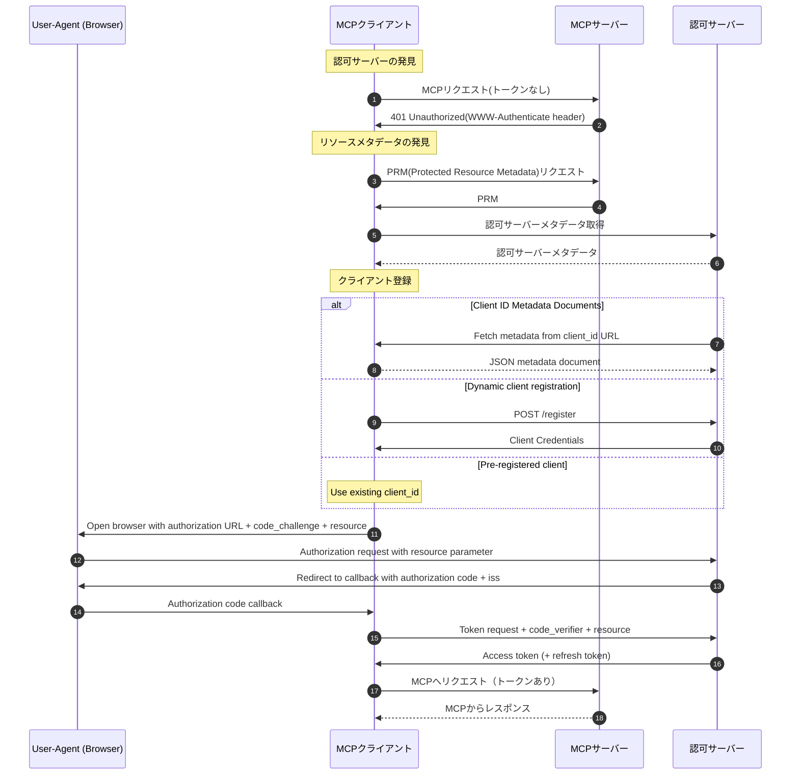

## はじめに

本ページは「AIエージェントとシステムをつなぐMCP入門」の続編です。  
今回は、認証/認可について説明します。  

MCP仕様では認可機能は任意扱いですが、MCPを実運用する場合は必須機能と言えます。  
本記事では、以下の内容を扱います。
* Streamable HTTPにおけるMCPの認証・認可の流れ
* PRMと認可サーバーの発見
* Keycloakとトークンイントロスペクションを使ったMCPサーバー側の検証

本記事で掲載しているコードは[こちら](https://github.com/ubata-mamezou/developer-site-article-examples/tree/main/mcp-auth)で公開しています。

:::info: シリーズ目次
**連載：AIエージェントとシステムをつなぐMCP入門**
* [イントロダクション](/blogs/2026/04/24/mcp-impl_introduction/)
* [stdio実装編](/blogs/2026/05/08/mcp-impl_stdio/)
* [StreamableHTTPステートレス実装編](/blogs/2026/05/22/mcp-impl_http_stateless/)
* [StreamableHTTPステートフル実装編](/blogs/2026/06/05/mcp-impl_http_stateful/)
* [プロンプト編](/blogs/2026/06/19/mcp-impl_prompt/)
* [リソース編](/blogs/2026/07/03/mcp-impl_resource/)
* **認証/認可編（本ページ）**
:::

## 今回使用するライブラリなど

* npm@12.0.2
* node@26.6.0
* @modelcontextprotocol/express@2.0.0
* @modelcontextprotocol/node@2.0.0
* @modelcontextprotocol/server@2.0.0
* typescript@7.0.2
* zod@4.4.3
* Keycloak 26.3.4
* Docker compose

:::check: 今回使用するライブラリについて
@modelcontextprotocolのv2がリリースされたので、本記事からはv2を使用します。  
併せてNodeおよびTypeScriptも最新のものを使用します。  

**MCPモジュールについて**  
v1では`@modelcontextprotocol/sdk`を使用していました。 
v2でモジュールが分割されたため、`@modelcontextprotocol/server, express, node`を使用します。
:::

## MCP仕様：認証/認可

### トランスポート別の認証アプローチ

トランスポート（通信方式）により、認証の実装指針が異なります。

**StreamableHTTP**

認可は任意（OPTIONAL）となっていますが、実装する場合はMCPの認可仕様に準拠しなければなりません。

**stdio（標準入出力）**

MCP仕様で定義されている認証仕様の対象外です。  
認証情報（APIキーなど）はサブプロセス起動時に実行環境から直接取得して利用する形になります。  

**その他**

そのプロトコルで確立されたベストプラクティスに準拠します。

### 準拠規格

セキュリティと相互運用性を確保しつつ簡素化を図るため、以下の標準規格のサブセットが採用されています。

* OAuth 2.1 (IETF Draft)
* OAuth 2.0 Bearer Token Usage (RFC 6750)
* OAuth 2.0 Authorization Server Metadata (RFC 8414)
* OAuth 2.0 Dynamic Client Registration Protocol (RFC 7591)
* Resource Indicators for OAuth 2.0 (RFC 8707)
* OAuth 2.0 Protected Resource Metadata (RFC 9728)
* OAuth Client ID Metadata Documents (CIMD)

### ロール

以下のロールが定義されています。

* MCPサーバー（OAuth 2.1リソースサーバー）: アクセストークンを受け入れ、保護されたリソースへのリクエストに応答する。
* MCPクライアント（OAuth 2.1クライアント）: リソース所有者に代わって保護されたリソースへリクエストを行う。
* 認可サーバー: ユーザーと対話し、アクセストークンを発行する。MCPサーバーと同一でも、独立した形で構成してもよい。

### 認証フロー

MCPの公式ドキュメントに掲載されている「Authorization Flow Steps」を一部和訳して転載。  

:::check
MCP仕様では、クライアントがPRMと認可サーバーメタデータを取得し、PKCEを利用した認可コードフロー（Authorization Code Flow）でトークンを取得します。

今回の検証コードでは主にリソースサーバーとしての動作検証を目的とし、クライアント側のブラウザ認証フローは省略しています。  
1. Keycloakで事前に取得したアクセストークンを使い、MCPサーバーがBearerトークンを受け取る。
2. Keycloakの`Introspection endpoint`でトークンの有効性、Audience、Scopeを検証する。
:::



### 認可サーバーの発見

MCPクライアントは、以下の手順で認可サーバーの場所と機能を特定する。

1. リソースメタデータの発見（RFC 9728）

   クライアントは`401 Unauthorized`レスポンスを受け取った際、`resource_metadata`（リソースメタデータ）を取得しなければなりません。  

    **優先順位**  
    1. `WWW-Authenticate`ヘッダーの`resource_metadata`パラメーターに示されたURL
    2. MCPサーバーエンドポイント配下のWell-Known URI（e.g. `/.well-known/oauth-protected-resource/path/to/mcp`）
    3. ドメインルートのWell-Known URI（e.g. `/.well-known/oauth-protected-resource`）

2. 認可サーバーメタデータの取得（RFC 8414）

   クライアントは、リソースメタデータから得られたIssuer（発行者）URLの形式に応じて認可サーバーのエンドポイントを特定します。  
  
   **優先順位**  
   * パスコンポーネントがある場合（例：/tenant1）
     1. OAuth 2.0方式（e.g. `/.well-known/oauth-authorization-server/tenant1`）
     2. OIDC方式パス挿入（e.g. `/.well-known/openid-configuration/tenant1`）
     3. OIDC方式パス付与（e.g. `tenant1/.well-known/openid-configuration`）
   * パスコンポーネントがない場合
     1. OAuth 2.0方式（e.g. `/.well-known/oauth-authorization-server`）
     2. OIDC方式（e.g. `/.well-known/openid-configuration`）

   **厳格な検証ルール**  
   * メタデータドキュメント内のissuer値は、Well-Known URLの構築に使用した発行者識別子と完全に一致しなければならない。
   * 不一致の場合は、クライアントはそのメタデータを使用不可とする。

:::check: 
検証コードでは、「パスコンポーネントあり」の「OAuth 2.0方式」を使用しています。
:::

### クライアント登録

認証フローを開始する前に、クライアントはクライアントIDを取得する必要があります。

**登録メカニズムと優先順位**  

  1. 事前登録（Pre-registration）: クライアントとサーバー間に既存の関係がある場合、静的な認証情報を使用する。
  2. Client ID Metadata Documents (CIMD): クライアントとサーバー間に事前関係がない場合、HTTPS URLをクライアントIDとして使用する。
  3. 動的クライアント登録 (Dynamic Client Registration): CIMD未対応サーバーとの後方互換性のために維持されていますが非推奨なので、基本的に選択しない。
  4. ユーザー入力: 他の手段がない場合、ユーザーに情報を入力させる。

:::check
検証コードでは、Keycloakに事前登録した静的な認証情報を使用しています。（Pre-registrationに相当）
:::

## 検証コードの解説

### 検証コード仕様

下記のような検証コードを使って説明します。  
Keycloakに依存する処理は、keycloak.tsに集約する形で構成しています。

| 項目 | 内容 |備考|
|---|---|---|
| トランスポート | Streamable HTTP（Stateless） |
| 認可サーバー | Keycloak |8081ポートで公開|
| MCPエンドポイント | `POST /mcp`|Bearer認証必須 |
| トークン検証 | トークンイントロスペクション（Keycloakの`Introspection endpoint`） |
| 認証エラー | `401 Unauthorized` + `WWW-Authenticate` |トークン無効または期待するAudienceと不一致の場合にスローします|
| 認可エラー | `403 Forbidden` + `WWW-Authenticate` |トークンは有効でも、スコープが不足している場合にスローします|
| PRM | `GET /.well-known/oauth-protected-resource/mcp` |

* 今回の検証ではやらないこと
  * ブラウザの認可画面
  * PKCEパラメーターの生成
  * 認可コードを受け取るcallback
  * 認可コードからトークンへの交換
  * CIMD
  * Dynamic Client Registration

### Keycloakの設定

Docker composeで起動する際、同梱しているRealm設定を使って自動生成しています。  
これにより、後述する動作検証に必要なRealmはすべて設定された状態でKeycloakが起動されます。

* realm: `mcp-demo`
* Client Scope:
  * `mcp:tools`: aud=`http://localhost:3000/mcp`
  * `mcp:no-scope`: aud=`http://localhost:3000/mcp`
  * `mcp:diff-audience`: aud=`http://localhost:3000/mcp-diff`
* Client
  * Introspection用: `mcp-server`
  * 正常系トークン取得用: `mcp-demo-client`（`mcp:tools`を付与）
  * Scope不足検証用: `mcp-demo-no-scope-client`（`mcp:no-scope`を付与）
  * Audienceなし検証用: `mcp-demo-no-audience-client`
  * Audience不一致検証用: `mcp-demo-diff-audience-client`（`mcp:diff-audience`を付与）

:::info
* Audience: どのリソースサーバー向けのトークンか
* Scope: リソースサーバーで何を実行できるか
:::

### PRMの公開

MCPクライアントが認可サーバーを発見するためのPRMの公開。公開は`mcpAuthMetadataRouter`が担います。  
クライアントが認証なしでMCPエンドポイントへアクセスした場合、`WWW-Authenticate`ヘッダーにもPRMのURLが含まれます。クライアントはそのURLからPRMを取得し、認可サーバーの場所を知ることができます。

```ts
app.use(
  mcpAuthMetadataRouter({
    oauthMetadata,
    resourceServerUrl: mcpServerUrl,
    scopesSupported: [REQUIRED_SCOPE],
    resourceName: "MCP Auth Streamable HTTP",
  }),
);
```

**PRM例**
```json
{
  "resource": "http://localhost:3000/mcp",
  "authorization_servers": ["http://localhost:8081/realms/mcp-demo"],
  "scopes_supported": ["mcp:tools"],
  "resource_name": "MCP Auth Streamable HTTP"
}
```
* `resource`: 保護対象であるMCPサーバーの識別子
* `authorization_servers`: 認可サーバーのIssuer URL
* `scopes_supported`: MCPサーバーが利用するScopeの候補
* `resource_name`: リソースの表示名

### Bearer認証ミドルウェア

MCPエンドポイントの前段でBearer認証しています。  
`requireBearerAuth`は、MCPエンドポイント開始前に実行されるミドルウェアです。  
`authMiddleware`でエラーが検出された場合は、そこで処理を中断するため、以降の処理は実行されません。  

```ts: index.ts
const authMiddleware = requireBearerAuth({
  // ※1
  verifier: tokenVerifier,
  // ※2
  requiredScopes: [REQUIRED_SCOPE],
  resourceMetadataUrl: getOAuthProtectedResourceMetadataUrl(mcpServerUrl),
});

//omit

app.post(MCP_PATH, authMiddleware, async (req, res) => {
  const server = createServer(); // authMiddlewareでエラーが発生した場合、ここは実行されません
  // omit
```
* ※1: トークン検証（詳細な検証内容は後述します）
* ※2: スコープ検証
  * トークンが指定されたスコープを持っているか検証します。
  * トークンが持つスコープと、requiredScopesに設定したスコープを`requireBearerAuth`が比較します。

### Keycloak Introspectionによるトークン検証

MCPサーバーが受け取ったアクセストークンは、Keycloakの`Introspection endpoint`で検証しています。  
ここで重要なのは、HTTP 200だけではトークンが有効だと判断できない点です。  

```ts: keycloak.ts
export function createTokenVerifier(mcpServerUrl: URL): OAuthTokenVerifier {
  return {
    verifyAccessToken: async (token) => {
      // Keycloakのイントロスペクションでトークン検証　※1
      const params = new URLSearchParams({token, client_id: OAUTH_CLIENT_ID});
      if (OAUTH_CLIENT_SECRET) params.set("client_secret", OAUTH_CLIENT_SECRET);
      const response = await fetch(KEYCLOAK_INTROSPECTION_ENDPOINT, {
        method: "POST",
        headers: { "Content-Type": "application/x-www-form-urlencoded" },
        body: params.toString(),
      });

      // 200 以外を返した場合　※2
      if (!response.ok) {
        const text = await response.text().catch(() => "");
        throw new OAuthError(OAuthErrorCode.InvalidToken, `Invalid or expired token: ${text}`);
      }

      // omit

      // トークンが無効または期限切れの場合　※3
      if (!data.active) throw new OAuthError(OAuthErrorCode.InvalidToken, "Inactive token");
```
* ※1
  * token: 検証対象のトークン
  * `OAUTH_CLIENT_ID`, `OAUTH_CLIENT_SECRET`: MCPクライアントの情報ではなく、MCPサーバーがKeycloakにIntrospectionを依頼するための認証情報
* ※2, 3
  * 200以外が返された場合は、無効または期限切れとみなして`InvalidToken`を返します。
  * 200が返されても`active`が`false`の場合、トークンが無効なため、同様に`InvalidToken`を返します。

## Audienceの検証

トークンに設定されている`aud`は「トークンが、どのリソースサーバー向けに発行されたか」を表します。  
トークンが有効でも、別のリソース向けに発行されたトークンを受け入れないようにAudienceを検証しています。

```ts: keycloak.ts
      // Audience (aud) クレームの検証
      if (OAUTH_STRICT) { // OAUTH_STRICTを有効にしている場合、検証を実行します
        // ※1
        if (!data.aud) throw new OAuthError(OAuthErrorCode.InvalidToken, "Resource indicator (aud) missing");
        const audiences = Array.isArray(data.aud) ? data.aud : [data.aud];
        const allowed = audiences.some((audience) =>
          checkResourceAllowed({ requestedResource: audience, configuredResource: mcpServerUrl }),
        );
        // ※2
        if (!allowed) throw new OAuthError(OAuthErrorCode.InvalidToken, `Expected audience compatible with ${mcpServerUrl}, got: ${audiences.join(",")}`);
      }
```
* ※1
  * audが存在しない場合は、リソースインジケーターが欠落している旨を返します
* ※2
  * audが許可されているものと一致しない場合は、期待するAudienceと一致しない旨を返します

## 検証コードを使った動作検証

1. 基本フロー（認可フローの流れを検証します）
   1. Authorizationヘッダー未設定でリクエスト（MCP Inspector）
   2. Authorizationヘッダー未設定でリクエスト（curl）
   3. PRM(Protected Resource Metadata)リクエスト
   4. 有効なトークンを使って正常アクセス
2. 例外フロー
   1. Authorizationヘッダーに形式違いの値を設定してリクエスト
   2. Authorizationヘッダーに無効なトークンを設定してリクエスト
   3. スコープ不足のクライアントでリクエスト
   4. Audience不足のクライアントでリクエスト
   5. 異なるAudienceが設定されているクライアントでリクエスト

### 1. Authorizationヘッダー未設定でリクエスト（MCP Inspector）

Authorizationヘッダー未設定の状態で、MCP InspectorからMCPサーバーへ接続します。

**UI上のポップアップメッセージ**
```txt
OAuth Authorization Failed
Policy 'Allowed Client Scopes' rejected request to client-registration service. Details: Not Permitted to use specified clientScope
```

**コンソールに出力されるログ**
```sh
Error from MCP server: StreamableHTTPError: Streamable HTTP error: Error POSTing to endpoint: {"error":"invalid_token","error_description":"Missing Authorization header"}
    at StreamableHTTPClientTransport.send (file:///xxx/node_modules/@modelcontextprotocol/sdk/dist/esm/client/streamableHttp.js:364:23)
    at process.processTicksAndRejections (node:internal/process/task_queues:104:5) {
  code: 401
}
```

レスポンスヘッダーが確認できなかったので、curlで再検証。


### 2. Authorizationヘッダー未設定でリクエスト（curlで再検証）

先ほどと同じくAuthorizationヘッダー未設定の状態で、curlを使って`tools/list`を呼び出します。

```sh
curl -i -X POST http://localhost:3000/mcp \
  -H "Accept: application/json, text/event-stream" \
  -H "Content-Type: application/json" \
  -d '{"jsonrpc":"2.0","id":1,"method":"tools/list","params":{}}'

HTTP/1.1 401 Unauthorized
WWW-Authenticate: Bearer error="invalid_token", error_description="Missing Authorization header", scope="mcp:tools", resource_metadata="http://localhost:3000/.well-known/oauth-protected-resource/mcp"
```

**結果**

* HTTPステータスとして`401 Unauthorized`が返されました。
* `error`には、「トークン無効」と示されています。
* `error_description`には、「Authorizationヘッダーが見つからない」と示されています。
* `resource_metadata`には、PRMエンドポイントのURLが設定されています。

### 3. PRM(Protected Resource Metadata)の確認

`resource_metadata`に設定されていたURLにアクセスし、認証に必要なメタデータを確認します。

```sh
curl -s http://localhost:3000/.well-known/oauth-protected-resource/mcp

{
  "resource":"http://localhost:3000/mcp",
  "authorization_servers":["http://localhost:8081/realms/mcp-demo"],
  "scopes_supported":["mcp:tools"],
  "resource_name":"MCP Auth Streamable HTTP"
}
```

**MCP Inspectorの場合**


**結果**

PRMが返されました。
* resource: 保護対象リソースを識別するURL
* authorization_servers: 認可サーバーのIssuer URL
* scopes_supported: 利用可能な認可スコープ

### 4. 有効なトークンを使って正常アクセス

認証して有効なトークンを取得してから、`tools/list`を呼び出します。

1. トークン取得

Keycloakからアクセストークンを取得します。

```sh
curl -s -X POST http://localhost:8081/realms/mcp-demo/protocol/openid-connect/token \
-H "Content-Type: application/x-www-form-urlencoded" \
-d "grant_type=client_credentials" \
-d "client_id=mcp-demo-client" \
-d "client_secret=mcp-demo-client-secret"

{
  "access_token":"<valid_token>",
  "expires_in":300,
  "refresh_expires_in":0,
  "token_type":"Bearer",
  "not-before-policy":0,
  "scope":"mcp:tools"
}
```

2. MCPサーバーへアクセス

Keycloakから取得した`access_token`を使って、MCPへアクセスします。

```sh
curl -s -X POST http://localhost:3000/mcp \
  -H "Accept: application/json, text/event-stream" \
  -H "Authorization: Bearer <valid_token>" \
  -H "Content-Type: application/json" \
  -d '{"jsonrpc":"2.0","id":1,"method":"tools/list","params":{}}'

event: message
data: {"result":{"tools":[{"name":"sum_numbers","title":"sum_numbers","description":"Sum two numbers","inputSchema":{"type":"object","$schema":"https://json-schema.org/draft/2020-12/schema","properties":{"a":{"type":"number","description":"first number"},"b":{"type":"number","description":"second number"}},"required":["a","b"]},"outputSchema":{"$schema":"https://json-schema.org/draft/2020-12/schema","type":"object","properties":{"result":{"type":"number","description":"sum result"}},"required":["result"],"additionalProperties":false}},{"name":"get_server_policy","title":"get_server_policy","description":"Return simple authorization policy for demo","inputSchema":{"type":"object","properties":{}},"outputSchema":{"$schema":"https://json-schema.org/draft/2020-12/schema","type":"object","properties":{"resource":{"type":"string","description":"resource server url"},"requiredScope":{"type":"string","description":"required scope"}},"required":["resource","requiredScope"],"additionalProperties":false}}]},"jsonrpc":"2.0","id":1}
```

**結果**

正常にアクセスでき、`tools/list`の結果が確認できました。

:::info
このレスポンスには`2026-07-28 RC`で対応したJSONスキーマ（2020-12）の`$schema`も含まれています。  
RCの変更内容については、[MCP 2026-07-28 RC解説](/blogs/2026/07/10/mcp-spec-2026-07-28-rc/)で説明しています。
:::

**MCP Inspectorで接続した場合**  


### 5.1. Authorizationヘッダーに形式違いの値を設定してリクエスト

Authorizationヘッダーに「形式不正のトークン（`Bearer `から始まらない値）」を設定してリクエストしてきたケースを想定した例外処理の確認。

```sh
curl -i -X POST http://localhost:3000/mcp \
  -H "Accept: application/json, text/event-stream" \
  -H "Content-Type: application/json" \
  -H "Authorization: bad_format_token" \
  -d '{"jsonrpc":"2.0","id":1,"method":"tools/list","params":{}}'

HTTP/1.1 401 Unauthorized
WWW-Authenticate: Bearer error="invalid_token", error_description="Invalid Authorization header format, expected 'Bearer TOKEN'", scope="mcp:tools", resource_metadata="http://localhost:3000/.well-known/oauth-protected-resource/mcp"

{
  "error":"invalid_token",
  "error_description":"Invalid Authorization header format, expected 'Bearer TOKEN'"
}
```

**結果**

* HTTPステータスとして`401 Unauthorized`が返されました。
* `error_description`には、「無効な形式である」と示されています。

### 5.2. Authorizationヘッダーに無効なトークンを設定してリクエスト

Authorizationヘッダーに形式は正しいが「存在しないトークン」を指定してリクエストしてきたケースを想定した例外処理の確認。

```sh
curl -i -X POST http://localhost:3000/mcp \
  -H "Accept: application/json, text/event-stream" \
  -H "Content-Type: application/json" \
  -H "Authorization: Bearer unknown_token" \
  -d '{"jsonrpc":"2.0","id":1,"method":"tools/list","params":{}}'

HTTP/1.1 401 Unauthorized
WWW-Authenticate: Bearer error="invalid_token", error_description="Inactive token", scope="mcp:tools", resource_metadata="http://localhost:3000/.well-known/oauth-protected-resource/mcp"

{
  "error":"invalid_token",
  "error_description":"Inactive token"
}
```

**結果**

* HTTPステータスとして`401 Unauthorized`が返されました。
* `error_description`には、「トークンが無効である」と示されています。

### 5.3. スコープ不足のクライアントでリクエスト

「権限不足のトークン（必要なクライアントスコープが設定されていないクライアントで認証）」を使ってリクエストしていたケースを想定した例外処理の確認。  

1. トークン取得
```sh
curl -s -X POST http://localhost:8081/realms/mcp-demo/protocol/openid-connect/token \
  -H "Content-Type: application/x-www-form-urlencoded" \
  -d "grant_type=client_credentials" \
  -d "client_id=mcp-demo-no-scope-client" \
  -d "client_secret=mcp-demo-no-scope-client-secret"

{"access_token":"<valid_token>","expires_in":300,"refresh_expires_in":0,"token_type":"Bearer","not-before-policy":0,"scope":"mcp:no-scope"}
```

2. MCPサーバーへアクセス
```sh
curl -i -X POST http://localhost:3000/mcp \
  -H "Accept: application/json, text/event-stream" \
  -H "Authorization: Bearer <valid_token>" \
  -H "Content-Type: application/json" \
  -d '{"jsonrpc":"2.0","id":1,"method":"tools/list","params":{}}'

HTTP/1.1 403 Forbidden
WWW-Authenticate: Bearer error="insufficient_scope", error_description="Insufficient scope", scope="mcp:tools", resource_metadata="http://localhost:3000/.well-known/oauth-protected-resource/mcp"

{"error":"insufficient_scope","error_description":"Insufficient scope"}
```

**結果**

* HTTPステータスとして`403 Forbidden`が返されました。
* `error`には、「スコープ不足」と示されています。
* `error_description`には、「スコープ不足」と示されています。

### 5.4. Audience設定なしのクライアントでリクエスト

「期待するAudienceが設定されてないトークン（必要なAudienceが設定されていないクライアントで認証）」を使ってリクエストしてきたケースを想定した例外処理の確認。  

1. トークン取得
```sh
curl -s -X POST http://localhost:8081/realms/mcp-demo/protocol/openid-connect/token \
  -H "Content-Type: application/x-www-form-urlencoded" \
  -d "grant_type=client_credentials" \
  -d "client_id=mcp-demo-no-audience-client" \
  -d "client_secret=mcp-demo-no-audience-client-secret"
{"access_token":"<valid_token>","expires_in":300,"refresh_expires_in":0,"token_type":"Bearer","not-before-policy":0,"scope":""}
```

2. MCPサーバーへアクセス
```sh
curl -i -X POST http://localhost:3000/mcp \
  -H "Accept: application/json, text/event-stream" \
  -H "Authorization: Bearer <valid_token>" \
  -H "Content-Type: application/json" \
  -d '{"jsonrpc":"2.0","id":1,"method":"tools/list","params":{}}'

HTTP/1.1 401 Unauthorized
WWW-Authenticate: Bearer error="invalid_token", error_description="Resource indicator (aud) missing", scope="mcp:tools", resource_metadata="http://localhost:3000/.well-known/oauth-protected-resource/mcp"

{"error":"invalid_token","error_description":"Resource indicator (aud) missing"}
```

**結果**

* HTTPステータスとして`401 Unauthorized`が返されました。
* `error_description`には、「リソースインジケーターが見つからない」旨が示されています。

### 5.5. 異なるAudienceが設定されているクライアントでリクエスト

「別リソース向けのトークン（期待されるAudienceとは異なる値を設定したクライアントで認証）」を使ってリクエストしてきたケースを想定した例外処理の確認。  

1. トークン取得
```sh
curl -s -X POST http://localhost:8081/realms/mcp-demo/protocol/openid-connect/token \
  -H "Content-Type: application/x-www-form-urlencoded" \
  -d "grant_type=client_credentials" \
  -d "client_id=mcp-demo-diff-audience-client" \
  -d "client_secret=mcp-demo-diff-audience-client-secret"
{"access_token":"<valid_token>","expires_in":300,"refresh_expires_in":0,"token_type":"Bearer","not-before-policy":0,"scope":"mcp:diff-audience"}
```

2. MCPサーバーへアクセス
```sh
curl -i -X POST http://localhost:3000/mcp \
  -H "Accept: application/json, text/event-stream" \
  -H "Authorization: Bearer <valid_token>" \
  -H "Content-Type: application/json" \
  -d '{"jsonrpc":"2.0","id":1,"method":"tools/list","params":{}}'

HTTP/1.1 401 Unauthorized
WWW-Authenticate: Bearer error="invalid_token", error_description="Expected audience compatible with http://localhost:3000/mcp, got: http://localhost:3000/mcp-diff", scope="mcp:tools", resource_metadata="http://localhost:3000/.well-known/oauth-protected-resource/mcp"

{"error":"invalid_token","error_description":"Expected audience compatible with http://localhost:3000/mcp, got: http://localhost:3000/mcp-diff"}
```

**結果**

* HTTPステータスとして`401 Unauthorized`が返されました。
* `error_description`には、「期待しているAudienceが異なる」旨が示されています。

## まとめ

Streamable HTTPでは、MCP仕様に基づく認証・認可の仕組みを利用できます。  

MCPクライアントは、`401`レスポンスの`WWW-Authenticate`ヘッダーやPRMから認可サーバーを発見し、アクセストークンを取得します。  
MCPサーバーは、受け取ったBearerトークンを検証し、保護対象リソースへのアクセスを許可または拒否します。  
  
今回の検証コードでは、Keycloakとトークンイントロスペクションを使い、MCPサーバー側の認証・認可処理を確認しました。   
Authorizationヘッダーの未設定や形式不正、無効なトークン、Audienceの不備を401として拒否し、Scope不足を403として拒否できることも確認しました。

実際にMCPサーバーを公開する際は、利用者やクライアントごとに必要なScopeを定義し、保護するリソースに応じたAudienceを検証することが重要です。
