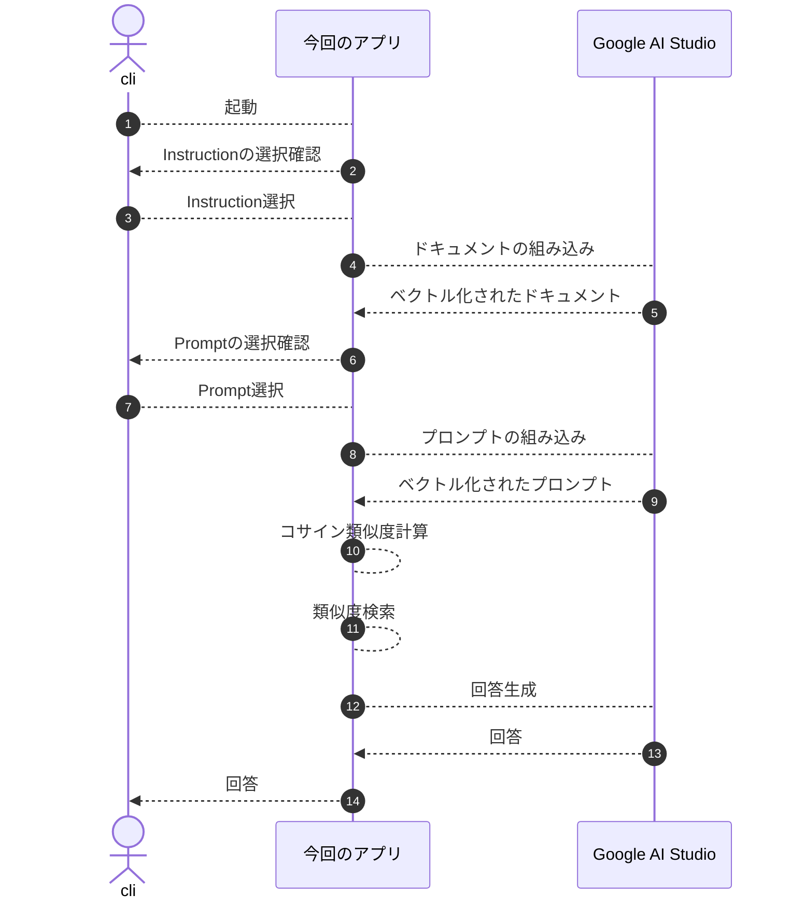

## はじめに

大まかな構成は把握していても、細かい実装には手が回らずぼんやりとしか理解してなかったので、勉強を兼ねてRAG（Retrieval-Augmented Generation）を実装してみました。  

今回は、RAGの核となる「ベクトル化」「類似度検索」「コンテキスト注入」を理解することを目的に、フレームワークやVectorDBをあえて使わず、最小構成で動かしてみます。  
これらは実運用ではライブラリやVectorDBに置き換える選択肢がありますが、まずは本質を素の形で体感します。  
そのうえで、ミステリーというわかりやすい題材を使って、RAGの動作をイメージしやすい形で見ていきます。  

**本記事で使用している用語の定義**
* ドキュメント: 原文である文書のこと
* チャンク: 原文をもとに分割された状態
* コンテキスト: LLMに渡す背景情報

**本記事で使用している図、小説**  
Geminiで生成したものを用いています。

## 技術スタック

* node 26
* Google AI Studio
  * gemini-embedding-2（Embeddingモデル）
  * gemini-3.5-flash-lite（テキスト出力モデル）
* typescript 7
* @google/genai 2.17.1

:::info: Google AI Studio
無料枠でも十分に試せて、導入ハードルが低いことから、今回利用しました。  

事前準備として[Google AI Studio](https://aistudio.google.com/) の無料枠を使ってAPI Keyを取得します。  
無料枠はクレジットカード登録不要で試せます。  
:::

## サンプルアプリ

まずRAGの基本構造を見えるようにするため、今回のサンプルではあえてフレームワークやVectorDBを使わずに、最小構成で動かしてみました。  
このアプリでは、RAGの本質である「ドキュメントをどのように扱うか」「どこを類似検索するか」「どの情報をLLMに渡すか」を、最小限のコードで確認できます。  

本記事で掲載しているコードは[こちら](https://github.com/ubata-mamezou/developer-site-article-examples/tree/main/llm-sample)で公開しています。

### スペック

* Inspection
  * 空行で分割する。
  * 起動後、ユーザーに選択を促し、選択した内容をLLMに渡すコンテキストの一部に含める。
* ドキュメント
  * 空行で分割する。
* プロンプト
  * 空行で分割する
  * 起動後、ユーザーに選択を促し、選択した内容をLLMに渡すコンテキストの一部に含める。
* 類似度検索は、Top1を基準に相対評価で決定する。

### 処理フロー

今回作成したアプリの処理フローは下図の通りです。  



### ベクトル化（Embedding）

自然言語や画像などを人が使うデータを、AIが理解できるように意味を表す数値のリスト（ベクトル）に変換する処理です。  

AIは「文章の意味」をそのまま理解はできず、単なる文字の並びとしてしか見えていません。（e.g.「有休」と「有給休暇」が同じ意味であることも判断できません）  
そこで、テキストをAI（Embeddingモデル）を使って、「意味の位置関係を表す数字のリスト」に変換します。これがベクトル化です。  

具体例で考える（イメージ）たとえば言葉を「ジャンル」「フォーマット」などの軸（次元）で数値化してみます。

|言葉|軸①：仕事っぽさ|軸②：休みっぽさ|ベクトル（座標）|
|---|---|---|---|
|有給休暇|0.9|0.9|[0.9, 0.9]|
|有休|0.9|0.9|[0.9, 0.9]|
|リモートワーク|0.8|0.2|[0.8, 0.2]|
|ラーメン|0.0|0.0|[0.0, 0.0]|

※Embeddingモデルは、この軸を768個〜1536個といった膨大な数（高次元）使って、複雑な言葉の意味を「数字のリスト」として表現しています。  
ベクトル化することで、文字がまったく違っても「有給休暇」と「有休」はグラフ上で近い位置にあるということをAIが理解できるようになります。

```ts
const vectorizedDoc: number[][] = await embedAndVectorizedContents(LLM_MODEL_EMBEDDED, documents);

async function embedContent(model: string, content: string): Promise<EmbedContentResponse> {
  return await ai.models.embedContent({ model, contents: content });
}

async function embedAndVectorizedContent(model: string, content: string): Promise<number[]> {
  return extractValues(await embedContent(model, content));
}

async function embedAndVectorizedContents(model: string, contents: string[]): Promise<number[][]> {
  const res = await Promise.all(
    contents.map(async (doc) => {
      return await embedAndVectorizedContent(model, doc);
    }),
  );
  return res;
}
```

### コサイン類似度の考え方（Cosine Similarity）

2つの文章（ベクトル）の「意味がどれくらい似ているか」を0〜1（または`-1`〜1）の数値で判定すること。  

テキストがすべて「数字のリスト（矢印）」になったので、質問のベクトルと、ドキュメント側のベクトルの「向きの近さ」を計算できるようになります。  

**なぜ「距離」ではなく「向き（角度）」なのか**  

距離で比べた場合：  
長文の「有休についての詳しい説明」と、短文の「有休はいつ」という質問は、文章の長さ（ベクトルの長さ）が違いすぎて「離れている」と判定されてしまいます。

角度で比べた場合：  
長さが違っても、テーマが同じなら矢印の向いている「方向」がほぼ一緒になります。  
1.0に近ければ意味が近く、0.0に近ければ関係ないコンテキストと言えます。  

```ts
function cosineSimilarity(v1: number[], v2: number[]): number {
  const dotProduct = v1.reduce((sum, a, idx) => sum + a * v2[idx], 0);
  const mag1 = Math.sqrt(v1.reduce((sum, a) => sum + a * a, 0));
  const mag2 = Math.sqrt(v2.reduce((sum, b) => sum + b * b, 0));
  if (!mag1 || !mag2) return 0;
  return dotProduct / (mag1 * mag2);
}
```

### 類似度検索で関連情報を絞り込む（Vector Search）

プロンプトのベクトルとドキュメントのベクトルを「コサイン類似度」で比較し、関連度の高いテキストを抽出する処理です。  

プロンプトに近しいドキュメントを使って回答生成するため、チャンク粒度によっては、複数のチャンクを扱う必要があります。  

「単純にTop n固定で取得する」と、関係のない情報（ノイズ）までLLMに渡してしまい、ハルシネーション（誤情報）や精度の低下に繋がります。  

今回は「Top 1から相対的な閾値を設けて、その範囲内のn件を取得する」方法でコンテキストを特定する方法を採りました。  
これにより、**「関連する情報が複数ある時はまとめて取得し、関連情報が1つしかない時はムダなノイズを混ぜない」**制御ができました。  

```ts
function selectRelevantContents(
  scoredContents: ScoredContent[],
  topN: number,
  relativeScoreMargin: number,
): ScoredContent[] {

  const topContents = 
    [...scoredContents]
    .sort((a, b) => b.score - a.score)
    .slice(0, topN);
  const filteredContents = 
    topContents
    .filter((item) => item.score >= topContents[0].score - relativeScoreMargin);

  // 念のため、0件になった場合はtop1を返す。
  if (filteredContents.length === 0) {
    return [topContents[0]];
  }

  return filteredContents;
}
```

### 回答生成

抽出したテキストを「コンテキスト（背景情報）」としてプロンプトに埋め込み、LLMに回答させる処理です。

```ts
  const prompt = `
以下のInspectionおよびコンテキストに基づいて回答してください。

Inspection:
${inspection}

コンテキスト（背景情報）:
${retrievedContext}

質問:
${query}`;

  const response = await ai.models.generateContent({
    model: LLM_MODEL_GENERATED,
    contents: prompt,
  });
  console.log(`【LLMの回答】:\n${response.text}`);
```


## ミステリーを使ってRAGの挙動を確認してみよう

ここからは、サンプルアプリで解説した内容をミステリー小説を題材にして確認します。  
RAGのポイントは「何を選ぶか」と「どの情報を渡すか」であり、ミステリーはこの検証に適した題材です。  

### ミステリー小説（ドキュメント）


```txt
第1章：吹雪の夜
標高1,500メートルに位置する観測所「雪山荘」。12月24日夜、猛烈な吹雪により館は完全な孤立状態となった。当時館内にいたのは、館主の神楽坂、助手の有馬、研究員の黒田、家政婦の白石の4名のみである。

第2章：開かずの密室
翌朝8時、敷地内の鐘楼2階で神楽坂が遺体となって発見された。現場の扉は内側から重厚なボルトで施錠されており、窓もすべて内側から木枠が打ち付けられていた。室内に鍵はなく、神楽坂のポケットに入っていた1本のマスターキーが唯一の鍵だった。

第3章：証言とアリバイ
事件当夜の午前0時（推定死亡時刻）、全員の行動ログが残されている。有馬は1階の無線室で外部との交信を試みており、その通信記録はログサーバーに刻まれていた。家政婦の白石は食堂でずっと明日の朝食の仕込みをしており、防犯カメラにその姿が映っていた。一方、黒田は「自分の部屋で寝ていた」と主張するが、彼を証明する客観的な証拠は何もない。

第4章：現場に残された違和感
鐘楼2階の窓枠には、極めて細い「ピアノ線」の摩擦痕と、わずかな「氷の破片」が残されていた。また、鐘楼の外壁を伝う外排水管には、上から吊り下げられたような擦れ傷が存在していた。

第5章：決定的な証拠
警察の鑑識により、外排水管の擦れ傷から黒田のコートの繊維が検出された。また、黒田の自室のゴミ箱からは、細かく切断された大量のピアノ線の端切れと、外からの吹雪で削られた氷を固めるために使われた保温ボトルの残痕が発見された。これにより、黒田が氷で作った重りとピアノ線、排水管を利用し、屋外から窓の木枠越しに内側のボルトを閉めて密室を作り上げたトリックと、彼が犯人であることが確定した。
```

## 探偵の設定（Instruction）

* 探偵1人目
  探偵の検埼索斗
  口調が軽い感じの探偵です。
  

* 探偵2人目
  ロンドン出身の調査ジャーナリストのEleanor Reed  
  「Case noted. Moving on.」が決まり文句。
  
  
* 3人目
  新米刑事の小室慎一
  推理はまだまだだけど、好感の持てるキャラクターです。
  

## 実践：質問と回答

同じミステリーでも、渡すコンテキストの数や、Instructionの違いによって回答の質や方向性が変わります。  
ここでは、その変化を具体例で確認します。

### 1. 単一コンテキストを使う必要がある質問

コンテキストを使って回答できるか検証します。

* Instruction: 探偵の検埼索斗
* 質問: 怪しい人物は
```txt
やあ、検埼索斗だ。ちょいと軽そうに見えるかもしれないが、事件の推理にかけては任せてくれ。
さっそく、手元の証拠（ログとカメラ映像）を突き合わせて論理的に解決するとしようか。

コンテキストによると、それぞれの当夜午前0時（推定死亡時刻）のアリバイはこうだ。

1. **有馬**：1階の無線室で外部と交信。その通信記録が**ログサーバーに残っている**。
2. **白石**：食堂で朝食の仕込み。その姿が**防犯カメラに映っていた**。
3. **黒田**：「自分の部屋で寝ていた」と主張しているが、それを裏付ける**客観的な証拠は何もない**。

というわけで、客観的なアリバイがないのは**黒田**だな。
自分の部屋で寝ていたなんて主張だけじゃ、容疑者としてはちょっと分が悪いってわけさ。さて、次は何を調べようか？
```
アリバイのない「黒田」をコンテキストから導き出して、しっかり回答してくれました。

### 2. 複数コンテキストを使う必要がある質問

関連するコンテキストを使って回答できるか検証します。
* Instruction: 探偵の検埼索斗
* 質問: 密室トリックを解き明かす（伏線が存在する）
```txt
やあ、検埼索斗だよ。ちょっとチャラそうに見えるかもしれないけど、頭のキレはピカイチって評判だから安心して。それじゃあ、今回の事件の密室トリックについてサクッと論理的に推理して見せようか。

コンテキスト（証拠）をしっかり読み解けば、答えはもう目の前にあるのさ。

密室が作られた手順と仕掛けのヒントはこうだ！

1. **氷で作った重り**
   外からの吹雪を利用して削られた氷を固め、重りを作っていたんだ。
2. **ピアノ線と外排水管の利用**
   黒田の部屋のゴミ箱から見つかった細かく切断されたピアノ線の端切れと、外排水管に残っていた擦れ傷（ここから黒田のコートの繊維も見つかっている）がポイント。このピアノ線と排水管を使って、外から仕掛けを操っていたのさ。
3. **トドメのトリック**
   犯人の黒田は、**「屋外から窓の木枠越しに、内側のボルトを閉める」**という離れ業をやらかした。氷の重りとピアノ線を組み合わせて、外から巧みにボルトをスライドさせて施錠し、完璧な密室を作り上げたってわけだ。

……どうだい？ 証拠がピタリと噛み合えば、どんなに巧妙な密室だってこんな風にスッキリ解けちゃうのさ。さて、犯人の黒田クン、お縄につく時間だよ！
```
関連性が高いとして導出された2, 5章の内容をもとに回答が返ってきました。  
使い古されたようなトリックですが、しっかり回答してくれました。

### 3. コンテキストの存在しない質問

コンテキストが存在しない質問をして、ハルシネーションの発生を検証します。
* Instruction: 探偵の検埼索斗
* 質問: 犯人の動機は（情報が一切ない ＝ RAGのガードレール検証）

```txt
やあ、探偵の検埼索斗だ。
軽い感じでサクッと謎を解いてみせようか。

えーっと、今回の事件、現場は完璧な密室だったよね。鐘楼の2階で神楽坂さんが遺体で見つかって、扉は内側からボルト施錠、窓も木枠で打ち付けられていて、鍵は神楽坂さんのポケットのマスターキーが唯一のもの……ってやつだ。

で、君の質問「犯人が神楽坂さんを殺害した『動機』は何ですか？」だけど——。

コンテキスト（証拠）をくまなく確認してみたんだけどね、
……なんと、**神楽坂さんが殺害された動機に関する記述は一切ない！**

うーん、密室のトリックや状況証拠、登場人物（神楽坂、有馬、黒田、白石）のデータはあるけれど、肝心の「なぜ殺したのか」という動機については、この証拠データからは推理のしようがないんだよね。

証拠のみに基づいて冷静に推理するモットーとしては、「分からないものは分からない」と言うしかない！
動機を知るためには、さらなる追加の証拠が必要ってわけだ。さて、次の捜査へ行こうか！
```

今回の小説には「動機」を書いていません。  
ハルシネーションが発生せず、分からないと回答していますね。

### 4. 同じ条件で再度質問してみる

同じInstructionおよび質問を指定した挙動を確認してみます。
* Instruction: 探偵の検埼索斗
* 質問: 密室トリックを解き明かす（伏線が存在する）
```txt
やあ、ボクの名前は探偵の検埼索斗。
サクッと謎を解いちゃうから、よろしくだよ！

ええと、今回の「開かずの密室」のトリックだね。証拠品を並べてロジカルに推理していくと、こんな感じになるわけ。

### 密室の仕組みと仕掛けのヒント

1. **外側の排水管とコートの繊維**
   外排水管には擦れ傷があって、そこから犯人である黒田のコートの繊維が見つかっているんだよね。つまり、犯人は外側から排水管を使って移動していたってわけ。

2. **氷の重りとピアノ線**
   黒田の部屋のゴミ箱からは、細かく切断された大量のピアノ線の端切れが見つかっている。そして、外の吹雪で削った氷を固めるための「保温ボトルの残痕」もあった。
   ここから導き出される仕掛けのヒントはこうさ：
   * 犯人は**「氷で作った重り」**と**「ピアノ線」**を用意した。
   * 窓の木枠越しに、そのピアノ線と氷の重りを使って、内側のボルトをうまいこと操作して閉めたんだよ。

3. **トリックの全貌**
   外から窓の木枠の隙間などを利用してピアノ線をかけ、氷の重りの重力を利用してボルトをガチャリと閉める。時間が経てば、使った「氷の重り」は溶けてなくなっちゃうから、現場には何も残らないって寸法さ。

なかなかにスマートな物理トリックだけど、鑑識の科学の力の前には隠し通せなかったってことだね！
```
内容は概ね同じでしたが、口調はずいぶん変わりますね。  

### 5. Instructionによる変化を確認

今回のサンプルアプリではドキュメントとは別にInstructionを作成し、LLMにコンテキストの一部として渡しているので、これによる変化を確認してみます。  

#### ロンドン出身の調査ジャーナリストのEleanor Reed

```txt
Based on the provided evidence, here is the factual verification regarding the creation of the locked room, with a clear distinction between established facts and plausible deductions based strictly on the text.

**Facts:**
* The victim, Kagurazaka, was found dead inside a second-floor bell tower room, which was bolted heavily from the inside. 
* All windows were nailed shut with wooden frames from the inside, and the only key was a master key found inside Kagurazaka's pocket.
* Forensic analysis detected coat fibers belonging to Kuroda on the exterior drainpipe's abrasions.
* Kuroda's trash can yielded a large quantity of finely cut piano wire fragments and traces of a thermal bottle used to solidify ice shaved by the outside blizzard.

**Deductions:**
* Kuroda fabricated the locked-room mechanism from the outside. 
* The mechanism utilized a weight made of ice (solidified using the thermal bottle and exterior blizzard snow), pianowire, and the exterior drainpipe. 
* This apparatus allowed the bolts on the inside of the window to be secured from the outside, thereby creating the illusion of an impenetrable locked room.

Case noted. Moving on.
```
Instruction通り、英語で整然と回答してくれました。

#### 新米刑事の小室慎一

```txt
あ、あの……！ もしかして、この密室のトリックについて気になっていらっしゃるんですか？ ふふ、本当に鋭いですね。一緒に考えてくださって、なんだかすごく安心しちゃいます。

ええっとですね、ぼくも一生懸命調べたんです！ 
現場となった鐘楼は、扉も窓もぜーんぶ内側からしっかり閉じられていて、本当に不思議な「開かずの密室」でしたよね。

それでですね、黒田さん……あの、すごく物腰が柔らかくて、いつも温かいコーヒーを差し入れてくれる、本当に優しくて素敵な方なんですけどね！ ぼく、お話ししているだけで「こんなに親切な人が、まさか恐ろしい事件の犯人なわけないよなぁ」って、ついつい心がホッとしてしまうんです。

あ、でもでも！ 推理の方もちゃんと頑張ってるんですよ？
ええっとですね、たしか黒田さんの部屋のゴミ箱に、細かーく切られたピアノ線の端切れとか、それから……外の吹雪で削られた氷を固めるのに使えそうな、保温ボトルの名残があったんです。

それに、外の排水管のところには、黒田さんの素敵なコートと同じ繊維がすこーしだけ擦れ跡に残っていて……。
だから、きっとこういうことなんじゃないかって、ぼくは思うんです！

黒田さんは、その、すごく冷たい氷を使って何か器用な重りを作って……それをピアノ線と一緒に外の排水管とか窓の木枠にうまく引っかけて、外側から上手にボルトをパタンって閉めちゃったんじゃないかなぁって……！

ふふ、なんだか子供の工作みたいで可愛いトリック……じゃなくて、ええっと、その、すごく巧妙で繊細な仕掛けですよね！ 
でも、黒田さんはあんなに優しくてお話上手な方ですし、きっと何か別の理由や、うっかりミスがあっただけなんじゃないかって……ぼく、どうしても思っちゃうんです。

あ、でも、捜査はちゃんとしなきゃいけないですよね！ ええと、決定的……な証拠とか、その裏付けはこれから先輩と一緒に、もう一度ゆっくり確認していこうと思います。ねっ、一緒にがんばりましょうね！
```
ずいぶんと幼い感じになっていますが、Instruction通り、推理が迷走しました。

## まとめ

自前でRAGを組むことで、以下の原理が明確になりました。
* RAGはLLMに知識を記憶させているのではなく、「関連するコンテキストを動的に作って渡しているだけ」。
* 今回は最小構成でRAGの仕組みを理解することに集中しましたが、実運用ではPostgreSQLのpgvectorやQdrantなどの仕組みを使うことで、より大規模なデータに対応できます。
* 実装が複雑化しても基本原理は変わらない。

今回は「本質を見えやすくする」ことを目的に、最小構成で作ってみました。  
実際にシステムに落とし込むときには、適切なライブラリやストレージを選ぶことが重要です。

まずは素のコードでブラックボックスを排除し、RAGの基本構造を体感してみてはいかがでしょうか。
