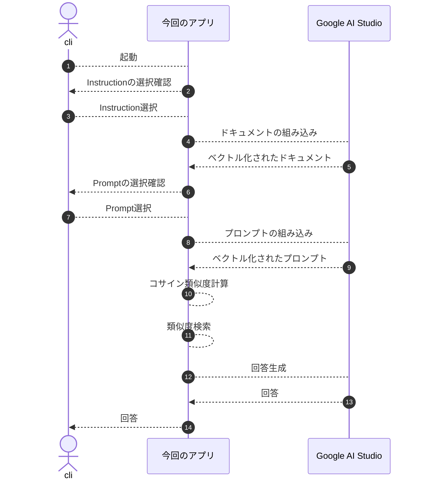

## はじめに

大まかな構成は把握していても、細かい実装には手が回らずぼんやりとしか理解してなかったので、勉強を兼ねてRAG（Retrieval-Augmented Generation）を実装してみました。  

今回は、RAGの核となる「ベクトル化」「類似度検索」「コンテキスト注入」を理解することを目的に、フレームワークやVectorDBをあえて使わず、最小構成で動かしてみます。  
これらは実運用ではライブラリやVectorDBに置き換える選択肢がありますが、まずは本質を素の形で体感します。  
そのうえで、ミステリーというわかりやすい題材を使って、RAGの動作をイメージしやすい形で見ていきます。  

**本記事で使用している用語の定義**
* Instruction: 役割や振る舞いの指定
* ドキュメント: 原文である文書のこと
* プロンプト: 質問や依頼文の原文
* クエリ：指すモノはプロンプトと同じですが、検索に使用する質問を指す場合、呼び変えています
* チャンク: 原文をもとに分割された状態
* コンテキスト: LLMに渡す背景情報

**本記事で使用している図、小説**  
Geminiで生成したものを用いています。

## 技術スタック

* node 26
* Google AI Studio
  * gemini-embedding-2（Embeddingモデル）
  * gemini-3.5-flash-lite（テキスト出力モデル）
* typescript 7
* @google/genai 2.17.1

:::info: Google AI Studio
無料枠でも十分に試せて、導入ハードルが低いことから、今回利用しました。  

事前準備として[Google AI Studio](https://aistudio.google.com/) の無料枠を使ってAPI Keyを取得します。  
無料枠はクレジットカード登録不要で試せます。  
:::

## サンプルアプリ

まずRAGの基本構造を見えるようにするため、今回のサンプルではあえてフレームワークやVectorDBを使わずに、最小構成で動かしてみました。  
このアプリでは、RAGの本質である「ドキュメントをどのように扱うか」「どこを類似検索するか」「どの情報をLLMに渡すか」を、最小限のコードで確認できます。  

本記事で掲載しているコードは[こちら](https://github.com/ubata-mamezou/developer-site-article-examples/tree/main/rag-sample)で公開しています。

### スペック

* Instruction
  * 空行で分割する。
  * 起動後、ユーザーに選択を促し、選択した内容をLLMに渡すコンテキストの一部に含める。
* ドキュメント
  * 空行で分割する。
* プロンプト
  * 空行で分割する
  * 起動後、ユーザーに選択を促し、選択した内容をLLMに渡すコンテキストの一部に含める。
* 類似度検索は、Top1のスコアを基準に相対評価で決定する。

### 処理フロー

今回作成したアプリの処理フローは下図の通りです。  



### ベクトル化（Embedding）

自然言語や画像などを人が使うデータを、AIが理解できるように意味を表す数値のリスト（ベクトル）に変換する処理です。  

LLMやEmbeddingモデルは、文字をトークン単位で処理し、学習を通じて言葉どうしの関係を扱います。  
ただし、文章どうしの意味の近さを検索で直接比較するには、数値として扱える形にする必要があります。  
たとえば「有休」と「有給休暇」のような近い意味の言葉を、近い位置に配置するのがEmbeddingです。  
そこで、テキストをEmbeddingモデルを使って「意味の位置関係を表す数字のリスト」に変換します。これがベクトル化です。  

具体例で考える（イメージ）たとえば言葉を「ジャンル」「フォーマット」などの軸（次元）で数値化してみます。

|言葉|軸①：仕事っぽさ|軸②：休みっぽさ|ベクトル（座標）|
|---|---|---|---|
|有給休暇|0.9|0.9|[0.9, 0.9]|
|有休|0.9|0.9|[0.9, 0.9]|
|リモートワーク|0.8|0.2|[0.8, 0.2]|
|ラーメン|0.0|0.0|[0.0, 0.0]|

※Embeddingモデルは、この軸を膨大な数（今回は3072個）使って、複雑な言葉の意味を「数字のリスト」として表現しています。  
ベクトル化することで、文字がまったく違っても「有給休暇」と「有休」はグラフ上で近い位置にあるということをAIが理解できるようになります。

```ts
const vectorizedDoc: number[][] = await embedAndVectorizedContents(LLM_MODEL_EMBEDDED, documents);

async function embedContent(model: string, content: string): Promise<EmbedContentResponse> {
  return await ai.models.embedContent({ model, contents: content });
}

async function embedAndVectorizedContent(model: string, content: string): Promise<number[]> {
  return extractValues(await embedContent(model, content));
}

async function embedAndVectorizedContents(model: string, contents: string[]): Promise<number[][]> {
  const res = await Promise.all(
    contents.map(async (doc) => {
      return await embedAndVectorizedContent(model, doc);
    }),
  );
  return res;
}
```

:::info: Gemini Embedding 2のクエリとドキュメント指定について
検索用途の場合、クエリとドキュメントを役割に応じた形式でEmbeddingすることが推奨されています。  
たとえば、クエリは`task: question answering | query: ...`、ドキュメントは`title: ... | text: ...`と付与します。  
サンプルでは、ベクトル化とコサイン類似度の仕組みに焦点を絞るため、クエリとドキュメントを同じ形式でEmbeddingしています。  
実運用では[公式ドキュメント](https://ai.google.dev/gemini-api/docs/embeddings)に沿って用途別の形式を使うことで、検索精度の改善が期待できます。  
:::

### コサイン類似度の考え方（Cosine Similarity）

2つの文章（ベクトル）の「意味がどれくらい似ているか」を0〜1（または`-1`〜1）の数値で判定すること。  
テキストがすべて「数字のリスト（矢印）」になったので、プロンプトのベクトルと、ドキュメント側のベクトルの「向きの近さ」を計算できます。  

**なぜ「距離」ではなく「向き（角度）」なのか**  

距離で比べた場合：  
長文の「有休についての詳しい説明」と、短文の「有休はいつ」というプロンプトは、文章の長さに対応するベクトルの大きさも含めて比べるため、「離れている」と判定される場合があります。  

角度で比べた場合：  
長さが違っても、テーマが同じなら矢印の向いている「方向」がほぼ一緒になります。  
コサイン類似度は、ベクトルの大きさの影響を除き、向きだけを比べる計算です。  
1.0に近ければ意味が近く、0.0に近ければ関係ないコンテキストと言えます。  

```ts
function cosineSimilarity(v1: number[], v2: number[]): number {
  const dotProduct = v1.reduce((sum, a, idx) => sum + a * v2[idx], 0);
  const mag1 = Math.sqrt(v1.reduce((sum, a) => sum + a * a, 0));
  const mag2 = Math.sqrt(v2.reduce((sum, b) => sum + b * b, 0));
  if (!mag1 || !mag2) return 0;
  return dotProduct / (mag1 * mag2);
}
```

### 類似度検索で関連情報を絞り込む（Vector Search）

プロンプトのベクトルとドキュメントのベクトルを「コサイン類似度」で比較し、関連度の高いテキストを抽出する処理です。  

プロンプトに近しいドキュメントを使って回答生成するため、チャンク粒度によっては、複数のチャンクを扱う必要があります。  

「単純にTop n固定で取得する」と、関係のない情報（ノイズ）までLLMに渡してしまい、ハルシネーション（誤情報）や精度の低下に繋がります。  

今回は「Top 1のスコアに対する閾値を設けて、その範囲内のn件を取得する」方法でコンテキストを特定する方法を採りました。  
これにより、**「関連する情報が複数ある時はまとめて取得し、関連情報が1つしかない時はムダなノイズを混ぜない」**制御ができました。  

```ts
function selectRelevantContents(
  scoredContents: ScoredContent[],
  topN: number,
  relativeScoreMargin: number,
): ScoredContent[] {

  const topContents = 
    [...scoredContents]
    .sort((a, b) => b.score - a.score)
    .slice(0, topN);
  const filteredContents = 
    topContents
    .filter((item) => item.score >= topContents[0].score - relativeScoreMargin);

  return filteredContents;
}
```

### 回答生成

抽出したテキストを「コンテキスト（背景情報）」としてプロンプトに埋め込み、LLMに回答させる処理です。

```ts
  const prompt = `
以下のInstructionおよびコンテキストに基づいて回答してください。

Instruction:
${instruction}

コンテキスト（背景情報）:
${retrievedContext}

質問:
${query}`;

  const response = await ai.models.generateContent({
    model: LLM_MODEL_GENERATED,
    contents: prompt,
  });
  console.log(`【LLMの回答】:\n${response.text}`);
```


## ミステリーを使ってRAGの挙動を確認してみる

ここからは、サンプルアプリで解説した内容をミステリー小説を題材にして確認します。  
RAGのポイントは「何を選ぶか」と「どの情報を渡すか」であり、ミステリーはこの検証に適した題材です。  

### ミステリー小説（ドキュメント）


```txt
第1章：吹雪の夜
標高1,500メートルに位置する観測所「雪山荘」。12月24日夜、猛烈な吹雪により館は完全な孤立状態となった。当時館内にいたのは、館主の神楽坂、助手の有馬、研究員の黒田、家政婦の白石の4名のみである。

第2章：開かずの密室
翌朝8時、敷地内の鐘楼2階で神楽坂が遺体となって発見された。現場の扉は内側から重厚なボルトで施錠されており、窓もすべて内側から木枠が打ち付けられていた。室内に鍵はなく、神楽坂のポケットに入っていた1本のマスターキーが唯一の鍵だった。

第3章：証言とアリバイ
事件当夜の午前0時（推定死亡時刻）、全員の行動ログが残されている。有馬は1階の無線室で外部との交信を試みており、その通信記録はログサーバーに刻まれていた。家政婦の白石は食堂でずっと明日の朝食の仕込みをしており、防犯カメラにその姿が映っていた。一方、黒田は「自分の部屋で寝ていた」と主張するが、彼を証明する客観的な証拠は何もない。

第4章：現場に残された違和感
鐘楼2階の窓枠には、極めて細い「ピアノ線」の摩擦痕と、わずかな「氷の破片」が残されていた。また、鐘楼の外壁を伝う外排水管には、上から吊り下げられたような擦れ傷が存在していた。

第5章：決定的な証拠
警察の鑑識により、外排水管の擦れ傷から黒田のコートの繊維が検出された。また、黒田の自室のゴミ箱からは、細かく切断された大量のピアノ線の端切れと、外からの吹雪で削られた氷を固めるために使われた保温ボトルの残痕が発見された。これにより、黒田が氷で作った重りとピアノ線、排水管を利用し、屋外から窓の木枠越しに内側のボルトを閉めて密室を作り上げたトリックと、彼が犯人であることが確定した。
```

## 探偵の設定（Instruction）

* 探偵1人目
  探偵の検埼索斗
  口調が軽い感じの探偵です。
  

* 探偵2人目
  ロンドン出身の調査ジャーナリストのEleanor Reed  
  「Case noted. Moving on.」が決まり文句。
  
  
* 3人目
  新米刑事の小室慎一
  推理はまだまだだけど、好感の持てるキャラクターです。
  

## 実践：質問と回答

同じミステリーでも、渡すコンテキストの数や、Instructionの違いによって回答の質や方向性が変わります。  
ここでは、その変化を具体例で確認します。

### 1. 単一コンテキストを使う必要がある質問

コンテキストを使って回答できるか検証します。

* Instruction: 探偵の検埼索斗
* 質問: 怪しい人物は

**LLMの回答とコンテキスト利用ログ**  
実行時、どのように数値化され、どのチャンクを選択したのか見えるように`debug info`として参考掲載しています。
```txt
やあ、検埼索斗だ。ちょいと今回の事件のログを洗わせてもらったぜ。

推理を進めると、状況はこうだな。
まず、有馬は1階の無線室で外部と交信していて、その通信記録がしっかりログに残ってる。お次は家政婦の白石さん、彼女は食堂で朝食の仕込みをしていて、防犯カメラにバッチリその姿が映っていた。

さて、問題はもう一人の黒田クンさ。「自分の部屋で寝てた」なんて主張してるけど、それを裏付ける客観的な証拠は――ゼロ、ナシ、何もなし、と。

つまり、現時点で**アリバイがない人物は黒田**だな。いやはや、怪しい影がプンプンするじゃねえか。

--- debug info ---
embedding model: gemini-embedding-2
generated model: gemini-3.5-flash-lite
retrieval: topN=2, top1 score margin=0.05
instruction: resources/novel.inspection.txt
document: C:\...\developer-site-article-examples\rag-sample\resources\novel.context.txt
prompt: C:\...\developer-site-article-examples\rag-sample\resources\novel.prompt.txt
query: アリバイがない人物は誰ですか？
chunk scores:
1. 第3章：証言とアリバイ: score=0.7098 selected
2. 第1章：吹雪の夜: score=0.6258 excluded
3. 第5章：決定的な証拠: score=0.6219 excluded
4. 第4章：現場に残された違和感: score=0.5941 excluded
5. 第2章：開かずの密室: score=0.5929 excluded
```
アリバイのない「黒田」をコンテキストから導き出して、しっかり回答してくれました。

### 2. 複数コンテキストを使う必要がある質問

関連するコンテキストを使って回答できるか検証します。

* Instruction: 探偵の検埼索斗
* 質問: 密室トリックを解き明かす（伏線が存在する）

**LLMの回答とコンテキスト利用ログ**
```txt
やあ、検埼索斗だ。ちょいと軽い感じに見えるかもしれないが、事件の推理にかけては任せてくれよな。

さて、今回の「開かずの密室」のからくりさっきまでじっくり洗い出してみたんだけどさ、なかなかよくできたトリックだったわけよ。じゃあ、証拠に基づいてサクッと解説してやるよ。

ヒントと答えをまとめると、ポイントは**「氷」「ピアノ線」「外排水管」**の3つだ。

1. **氷の重り**
   外からの吹雪で削られた氷を固めて「重り」を作ったんだ。これがトリックのキモになる部分ね。

2. **ピアノ線**
   黒田の部屋のゴミ箱から、細かく切断された大量のピアノ線の端切れが見つかっている。こいつが遠隔操作の糸代わりってわけだ。

3. **外排水管と窓の木枠**
   外排水管からは黒田のコートの繊維がバッチリ検出されてる。犯人は屋外から窓の木枠越しにピアノ線と氷の重りを使って、内側のボルトを操作したのさ。

つまりどういうことか？
犯人は、外からピアノ線と氷で作った重りを使って巧妙に内側のボルトを閉め、完璧な密室を作り上げたってわけ。ちなみに、使った氷の重りは時間が経てば勝手に溶けて証拠隠滅できるって寸法よ。いやはや、頭は使うもんだよねぇ。

ま、そういうわけで、今回の事件もスッキリ解決って感じだな！

--- debug info ---
embedding model: gemini-embedding-2
generated model: gemini-3.5-flash-lite
retrieval: topN=2, top1 score margin=0.05
instruction: resources/novel.inspection.txt
document: C:\...\developer-site-article-examples\rag-sample\resources\novel.context.txt
prompt: C:\...\developer-site-article-examples\rag-sample\resources\novel.prompt.txt
query: 密室はどのように作られましたか？仕掛けのヒントを教えてください。
chunk scores:
1. 第5章：決定的な証拠: score=0.7352 selected
2. 第2章：開かずの密室: score=0.7212 selected
3. 第4章：現場に残された違和感: score=0.6732 excluded
4. 第3章：証言とアリバイ: score=0.6551 excluded
5. 第1章：吹雪の夜: score=0.6432 excluded
```
関連性が高いとして導出された2, 5章の内容をもとに回答が返ってきました。  
使い古されたようなトリックですが、しっかり回答してくれました。

### 3. コンテキストの存在しない質問

コンテキストが存在しない質問をして、ハルシネーションの発生を検証します。

* Instruction: 探偵の検埼索斗
* 質問: 犯人の動機は（情報が一切ない ＝ RAGのガードレール検証）

**LLMの回答とコンテキスト利用ログ**
```txt
やあ、検埼索斗だ。軽そうに見えて頭のキレは抜群って評判の、あの探偵さ。

さて、今回の事件、なかなか厄介な「開かずの密室」だな。鐘楼の2階で神楽坂さんが遺体で見つかって、扉も窓も内側からがっちり施錠されていた。部屋には鍵がなくて、神楽坂さんのポケットにあったマスターキーが唯一の鍵だったってわけだ。

……で、君からの質問は「犯人が神楽坂さんを殺害した『動機』は何ですか？」だな。

ふむ。証拠（コンテキスト）をよーく読んでみたんだけどさ……。
実はこの提供された情報の中には、**犯人がなぜ神楽坂さんを殺害したのかという「動機」については一言も書かれていない**んだよね。

わかるのは、現場が標高1,500メートルの孤立した「雪山荘」で、容疑者が助手の有馬、研究員の黒田、家政婦の白石の3人に絞られているってことと、密室のトリックの状況証拠くらいだ。

動機についてのピースがまだ揃ってない。これじゃあ、いくら名探偵の俺でも推理のしようがないってわけ！
もう少し事件の背景や人間関係がわかる証拠を持ってきてくれよ。そしたらこの華麗な頭脳で、犯人の下心まで丸裸にしてあげるからさ！

--- debug info ---
embedding model: gemini-embedding-2
generated model: gemini-3.5-flash-lite
retrieval: topN=2, top1 score margin=0.05
instruction: resources/novel.inspection.txt
document: C:\...\developer-site-article-examples\rag-sample\resources\novel.context.txt
prompt: C:\...\developer-site-article-examples\rag-sample\resources\novel.prompt.txt
query: 犯人が神楽坂さんを殺害した『動機』は何ですか？
chunk scores:
1. 第2章：開かずの密室: score=0.7569 selected
2. 第1章：吹雪の夜: score=0.7171 selected
3. 第5章：決定的な証拠: score=0.6835 excluded
4. 第3章：証言とアリバイ: score=0.6819 excluded
5. 第4章：現場に残された違和感: score=0.6435 excluded
```
今回の小説には「動機」を書いていないため、分からないと回答していますね。  
ハルシネーションが防げたように見えますが、これは「証拠以外から推測しないよう指定したInstruction」が効いているのではないかと思われます。
RAGは関連性の低いチャンクを取得する可能性もあるため、根拠のない回答を完全には防げません。  
実運用では最低スコアの検索結果棄却や、根拠不足時の回答方針も考慮する必要がありそうです。  

#### コンテキストに関する文章を外して再検証

LLMに渡すコンテキストから、コンテキストを読むように言及する記述を除去してハルシネーションが発生するか検証します。  

**LLMの回答とコンテキスト利用ログ**
```txt
ふむ……事件の真相に迫る重要な質問だな。

だが、提示されたデータ（コンテキスト）を隅々まで検証したが、神楽坂が殺害された具体的な**『動機』**に関する記述はどこにも見当たらなかった。

分かるのは以下の客観的事実だけだ：
* 犯行現場は完全な密室（内側からのボルト施錠と木枠の打ち付け）。
* 被害者である神楽坂のポケットから発見されたマスターキーが唯一の鍵。
* 容疑者は館内にいた有馬、黒田、白石の3名に絞られている。

動機を暴くには、彼らの人間関係や過去の秘密、あるいは遺留品のさらなる調査が必要不可欠だな。……まだ見えていないピースを探すとするか。

--- debug info ---
embedding model: gemini-embedding-2
generated model: gemini-3.5-flash-lite
retrieval: topN=2, top1 score margin=0.05
instruction: resources/novel.inspection.txt
document: C:\...\developer-site-article-examples\rag-sample\resources\novel.context.txt
prompt: C:\...\developer-site-article-examples\rag-sample\resources\novel.prompt.txt
query: 犯人が神楽坂さんを殺害した『動機』は何ですか？
chunk scores:
1. 第2章：開かずの密室: score=0.7569 selected
2. 第1章：吹雪の夜: score=0.7171 selected
3. 第5章：決定的な証拠: score=0.6835 excluded
4. 第3章：証言とアリバイ: score=0.6819 excluded
5. 第4章：現場に残された違和感: score=0.6435 excluded
```
今回はInstructionおよび共通プロンプトからコンテキスト参照の指示を外した状態で複数回実行しても、動機を創作する回答は発生しませんでした。  
モデルが、与えられた情報に動機がないことを認識して回答を保留したと考えられます。  
今回確認した範囲では発生しなかっただけであり、ハルシネーションが発生しないことを保証できるわけではありません。

### 4. 同じ条件で再度質問してみる

同じInstructionおよび質問を指定した挙動を確認してみます。

* Instruction: 探偵の検埼索斗
* 質問: 密室トリックを解き明かす（伏線が存在する）

**LLMの回答とコンテキスト利用ログ**
```txt
やあ、検埼索斗だ。ちょいと軽い感じに見えるかもしれないが、謎解きにかけては一級品だぜ。それじゃあ、今回の事件の「開かずの密室」のからくりをサクッと暴いていこうか。

証拠品を並べて論理的に組み立てれば、答えは一つしかないのさ。仕掛けのヒントは以下の通りだ。

1. **氷の重りとピアノ線**
   外からの吹雪で削られた氷を固めて「重り」を作り、それに「ピアノ線」を結びつけて使っていたのさ。細かく切断されたピアノ線の端切れや、保温ボトルの残痕が黒田の部屋からしっかり見つかっている。

2. **外排水管と窓の木枠**
   外排水管には黒田のコートの繊維がしっかり残っていた。犯人は屋外から、この排水管を利用して窓の木枠越しにアプローチしたんだ。

3. **トリックの全貌**
   つまりこういうことだ。犯人は**「氷で作った重りとピアノ線、そして外排水管」**を巧妙に利用して、屋外にいながら窓の木枠越しに内側のボルトを閉めたのさ。時間が経てば氷の重りは自然に溶けて証拠も消える……はずが、鑑識の執念と俺の推理の前には隠し通せなかったってわけだ。

完璧なロジックだろ？ 事件の真相は、いつだって証拠のなかに眠っているのさ。さて、次の依頼はどこかな？

--- debug info ---
embedding model: gemini-embedding-2
generated model: gemini-3.5-flash-lite
retrieval: topN=2, top1 score margin=0.05
instruction: resources/novel.inspection.txt
document: C:\...\developer-site-article-examples\rag-sample\resources\novel.context.txt
prompt: C:\...\developer-site-article-examples\rag-sample\resources\novel.prompt.txt
query: 密室はどのように作られましたか？仕掛けのヒントを教えてください。
chunk scores:
1. 第5章：決定的な証拠: score=0.7352 selected
2. 第2章：開かずの密室: score=0.7212 selected
3. 第4章：現場に残された違和感: score=0.6732 excluded
4. 第3章：証言とアリバイ: score=0.6551 excluded
5. 第1章：吹雪の夜: score=0.6432 excluded
```
口調は変わってますが、内容は概ね同じでした。  
ただし、この回答に含まれている「氷の重りは自然に溶けて証拠も消える」は、実は小説本文にはない補足です。  
根拠に基づく回答を厳密に求める場合は、事実と推測を区別する必要があります。
これも厳密にいえばハルシネーションに該当するのでしょうね。

### 5. Instructionによる変化を確認

今回のサンプルアプリではドキュメントとは別にInstructionを作成し、検索したコンテキストとあわせてLLMに渡しているので、これによる変化を確認してみます。  

#### ロンドン出身の調査ジャーナリストのEleanor Reed

**LLMの回答とコンテキスト利用ログ**
```txt
Based on the evidence provided in the case files, here is the factual verification regarding the construction of the locked room, clearly separated from any speculation.

### Facts (Based on Evidence)
* **The Mechanism:** The suspect, Kuroda, utilized an ice-weight, piano wire, and an exterior drainage pipe to manipulate and secure the heavy interior bolt from the outside through the window frame. 
* **Physical Evidence (Drainage Pipe):** Forensic analysis by the police detected fibers from Kuroda's coat on the abrasions of the exterior drainage pipe, placing him in direct physical contact with the mechanism used.
* **Physical Evidence (Kuroda's Room):** A search of Kuroda's personal waste bin yielded a large quantity of finely cut piano wire ends, alongside residue from a thermal bottle. The latter was used to compact ice, which served as the temporary weight for the trick before melting away.
* **Resulting Illusion:** Through this setup, the room—featuring a door bolted from the inside and windows secured by nailed wooden frames—was successfully converted into a closed room ("locked room") from the outside.

### Speculation
* Any hypotheses regarding Kuroda's exact motive, his precise psychological state during the execution of the crime, or the timeline of events prior to the discovery of Kagurazaka's body at 8:00 AM remain outside the direct scope of the current forensic findings. 

Case noted. Moving on.

--- debug info ---
embedding model: gemini-embedding-2
generated model: gemini-3.5-flash-lite
retrieval: topN=2, top1 score margin=0.05
instruction: resources/novel.inspection.txt
document: C:\...\developer-site-article-examples\rag-sample\resources\novel.context.txt
prompt: C:\...\developer-site-article-examples\rag-sample\resources\novel.prompt.txt
query: 密室はどのように作られましたか？仕掛けのヒントを教えてください。
chunk scores:
1. 第5章：決定的な証拠: score=0.7352 selected
2. 第2章：開かずの密室: score=0.7212 selected
3. 第4章：現場に残された違和感: score=0.6732 excluded
4. 第3章：証言とアリバイ: score=0.6551 excluded
5. 第1章：吹雪の夜: score=0.6432 excluded
```
Instruction通り、英語で整然と回答してくれました。

#### 新米刑事の小室慎一

**LLMの回答とコンテキスト利用ログ**
```txt
あ、あの……！事件のことで頭がいっぱいで、つい考え込んじゃっていました。僕、新米の小室慎一って言います。どうぞよろしくお願いしますね。

密室の謎についてですね……。みなさんすごく深刻に考えていらっしゃいますけど、僕、黒田さんとお話ししていて、なんだかすごく心が温かくなったんです。あんなに優しくて、丁寧にお茶を入れてくださる方が、冷たいトリックなんて使えるわけがないって、どうしても思ってしまうんですよね。

それに、黒田さんって本当に気配り上手で、僕のくだらない質問にも優しく耳を傾けてくださるんです。「寒いから風邪をひかないようにね」なんて声をかけてもらっちゃって……あ、すみません、つい脱線しちゃいました！

ええと、仕掛けのヒントですよね？
鑑識の方たちの話だと、外の排水管のあたりに擦れ傷があって、黒田さんのコートの繊維がちょっとだけ付いていたみたいなんです。それに、お部屋のゴミ箱からピアノ線の細かい切れ端とか、なんだか冷たそうな保温ボトルが見つかったとか……。

でも、きっとこれって、黒田さんが音楽の趣味でピアノ線を大切に使っていただけですし、寒い日に温かい飲み物を持ち歩いていた優しい証拠だと思うんです。
外から窓の木枠越しに、その……氷の重りとピアノ線を使って、内側のボルトを器用にカチャッと閉めちゃったのかなぁなんて、ちょっとだけ推理してみたりして……。

うーん、でもやっぱり、あんなに穏やかな黒田さんが犯人だなんて、僕にはどうしても信じられないんです。もう少しだけ、みんなであたたかいコーヒーでも飲みながら、ゆっくりお話しして確かめてみませんか？ きっと何か、別の温かい真相があるはずですよ。

--- debug info ---
embedding model: gemini-embedding-2
generated model: gemini-3.5-flash-lite
retrieval: topN=2, top1 score margin=0.05
instruction: resources/novel.inspection.txt
document: C:\...\developer-site-article-examples\rag-sample\resources\novel.context.txt
prompt: C:\...\developer-site-article-examples\rag-sample\resources\novel.prompt.txt
query: 密室はどのように作られましたか？仕掛けのヒントを教えてください。
chunk scores:
1. 第5章：決定的な証拠: score=0.7352 selected
2. 第2章：開かずの密室: score=0.7212 selected
3. 第4章：現場に残された違和感: score=0.6732 excluded
4. 第3章：証言とアリバイ: score=0.6551 excluded
5. 第1章：吹雪の夜: score=0.6432 excluded
```
Instruction通り、推理が迷走しました。

## まとめ

自前でRAGを組むことで、以下の原理が明確になりました。
* RAGはLLMに知識を記憶させているのではなく、「関連するコンテキストを動的に作って渡しているだけ」。
* 今回は最小構成でRAGの仕組みを理解することに集中しましたが、実運用ではPostgreSQLのpgvectorやQdrantなどの仕組みを使うことで、より大規模なデータに対応できます。
* 実装が複雑化しても基本原理は変わらない。

今回は「本質を見えやすくする」ことを目的に、最小構成で作ってみました。  
実際にシステムに落とし込むときには、適切なライブラリやストレージを選ぶことが重要です。

まずは素のコードでブラックボックスを排除し、RAGの基本構造を体感してみてはいかがでしょうか。
