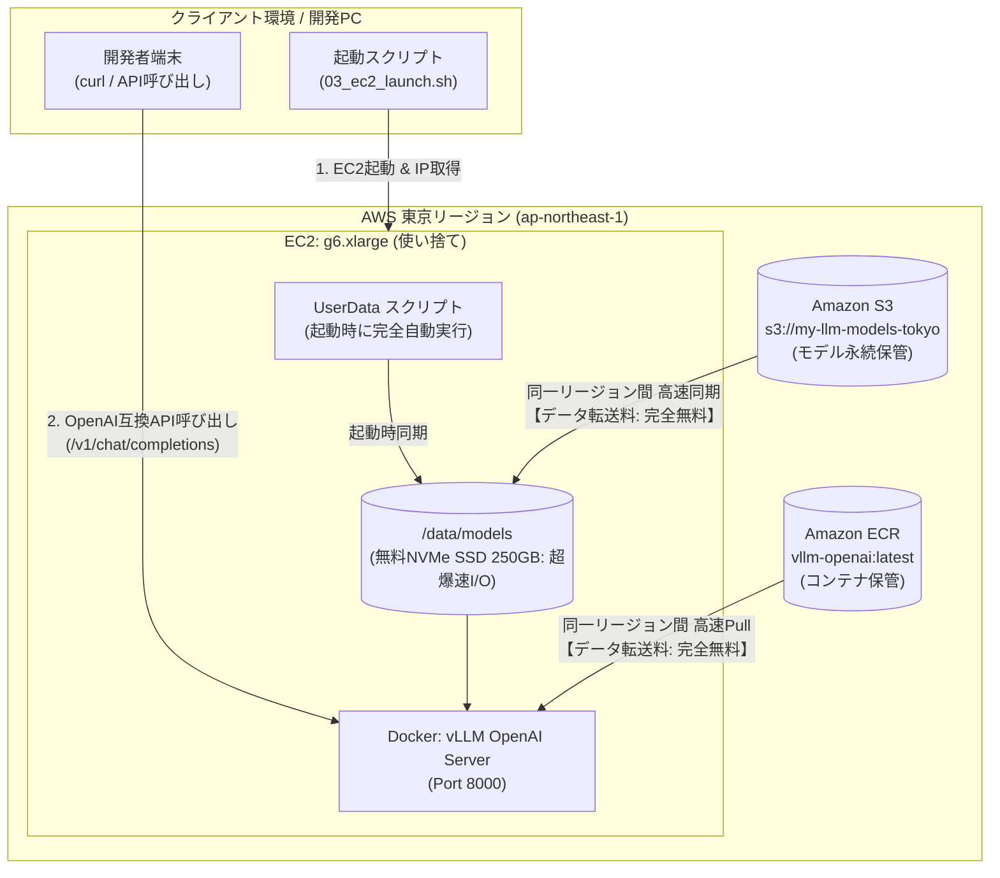

## はじめに

オープンソースLLMが急速に進化する中、「機密情報や社内コードも気にせず扱える、自分専用のローカルLLM環境が欲しいな」と思い立ちました。

ただ、いざ本格的に手元（オンプレミス）で動かそうとすると、大容量VRAMを積んだGPU搭載PCが必要になり、**調達するのに数十万円もの初期費用（イニシャルコスト）** がかかってしまいます。「まずは効果があるか試してみたい」という検証段階で、いきなり高額なハードウェア購入稟議を通すのはハードルが高いものです。
だからこそ、初期投資ゼロ・使った時間分だけ（数十円〜数百円単位）ですぐに始められ、不要になればいつでも撤退できる **「スモールスタート」というクラウド最大の利点** を活かしたいと考えました。

「クラウド上で手軽にLLMを動かすにはどうすればいいか……」と思いを巡らせていたとき、マネジメントコンソールから手動でGPUインスタンスを立ち上げてセットアップする方法も考えました。
しかし、インフラエンジニアとして実用的な開発環境を模索する中で、どうしても大事にしたい想いが湧いてきました。

**「これから登場する様々なオープンソースモデルを、気兼ねなくどんどん試せる環境にしたい！」**

次々と新しいモデルがリリースされる昨今、モデルを入れ替えたり検証したりするたびに手動でセットアップを繰り返すのは大変ですし、使っていない期間に大容量ストレージ（EBS）の維持費（月額1,500円強）が発生し続けるのも避けたいところです。
また、「使い終わったら手動で停止・削除しよう」と思っていても、うっかり停止を忘れて思わぬ課金が発生してしまうリスクも防ぎたいところです。

そこで今回は、これから様々なモデルを快適に試していくための土台として、**「起動の全自動化（UserData）」** と **「使わない時間の固定費ほぼゼロ化（S3モデル保管 ＆ EBS即時破棄）」** を両立したエフェメラル（使い捨て）推論基盤を構築しました。

### 今回構築したアーキテクチャのゴール

1. **Linux (Ubuntu 22.04 Deep Learning AMI) × UserData による完全無人セットアップ**
2. **モデルデータはS3、コンテナイメージはECRに退避させ、起動時に同一リージョン間（転送料無料）で高速同期・Pull**
3. **高スループット推論エンジン「vLLM」をDockerコンテナで自動起動**
4. **検証後はインスタンスごと即座に「終了（Terminate）」してEBSを破棄！ 停止時の保持コストほぼゼロ運用**

この構成を作っておけば、モデルの差し替えもS3のパスを変えるだけで済み、いつでもコマンド一発で最新のオープンソースLLMを安全・最安で試し放題になります。
クラウド認定全冠エンジニアの視点から、コストと自動化を追求した構築手順を詳しくご紹介します！

---

## 全体アーキテクチャとエフェメラル設計

今回の全体構成は以下のようになっています。



### この構成のポイント

* **完全エフェメラル（使い捨て）なEC2運用**:
  重たいモデル本体（約15GB）はAmazon S3に、vLLMコンテナイメージはAmazon ECRに永続化しておきます。EC2起動時にUserData経由でS3・ECRからローカルにサッと引き出し、検証が終わったらEC2を躊躇なく　**Terminate（終了）**　します。ルートボリュームも自動破棄されるため、高価なEBSの放置課金を完全に排除できます。
* **無料付属のローカルNVMe SSD（インスタンスストア 250GB）をフル活用**:
  `g6.xlarge` には追加費用 0 円（無料）で **250GB のローカル NVMe SSD（インスタンスストア）** が最初から付属しています。一般的にインスタンスストアは「停止や終了でデータが揮発（消滅）する」ため敬遠されがちですが、本構成は **「重みはS3、コンテナはECRに永続化し、EC2は使い捨てる」** という設計のため、揮発性が一切デメリットになりません。PCIe 直結の爆速 I/O（1,000〜2,000MB/s超）をフル活用してモデルのGPUロード時間を十数秒レベルに短縮しつつ、ルートEBS容量を 100GB $\rightarrow$ **40GB**（※DLAMIのスナップショット制約上の最小サイズ）へ大幅スリム化できます。
* **停止時の維持コストは「ほぼゼロ（月額約145円）」＆ダウンロード転送量は完全無料**:
  「S3やECRに置くとしても、保管料や転送料金がかさむのでは？」と心配になるかもしれませんが、実質的なコストはほぼ無視できるレベルです（※1ドル=165円換算）：
  * **S3 Standard保管料**: 15GB × $0.025/GB = **月額 約$0.38（約 62 円 / 月）**
  * **ECR保管料**: 圧縮コンテナイメージ 約5GB × $0.10/GB = **月額 約$0.50（約 83 円 / 月）**
  * **合計保管コスト**: **月額 約$0.88（約 145 円 / 月）**
  * **データ転送料（S3 / ECR $\rightarrow$ EC2）**: 同一リージョン（東京）間転送のため **完全無料（0 円）**
  * **EBS保持との比較**: もし同じ100GBのEBSボリューム（gp3）を停止状態で保持し続けると **月額 約$9.6（約 1,584 円 / 月）** が溶け続けます。S3とECRに逃がすことで **約91%のコスト削減** になり、使わない月の維持費もわずか約145円に抑えられます。
* **Docker Hub ではなく Amazon ECR を使う理由**:
  vLLM の公式イメージは Docker Hub（`vllm/vllm-openai:latest`）でも配布されていますが、インターネット経由でのダウンロードとなるため、回線混雑や Docker Hub の匿名レートリミット（Pull 回数制限）に遭遇するリスクがあります。同一リージョンの ECR に配置することで、AWS 内部の超高速バックボーン経由で安定して爆速 Pull が可能になります。
* **vLLM の採用**:
  PagedAttention技術により、高スループットかつ省メモリで大規模モデルを扱える推論エンジン「vLLM」をDockerで起動します。標準でOpenAI互換API（ポート8000）を公開してくれるため、既存の様々なAIツールやスクリプトからそのまま利用可能です。

---

## 事前準備・前提条件

本手順を進めるにあたり、ローカル端末側に以下のツールがセットアップされていることを前提とします。

1. **AWS CLI**: S3バケットの作成やEC2の起動に使用します。適切な権限（S3・EC2へのアクセス権）を持つIAMユーザー/ロールで `aws configure` を済ませておいてください。
2. **Hugging Face CLI (`huggingface-cli`)**: モデルのダウンロードに使用します。Python環境で以下を実行してインストールします。
   ```bash
   pip install -U "huggingface_hub[cli]"
   ```
   ※なお、Llama系やGemma系などの利用規約への同意が必要なゲーテッドモデル、あるいはレート制限を回避して安定ダウンロードしたい場合は、事前に `huggingface-cli login` を実行して Hugging Face のアクセストークンを設定しておきましょう。
3. **jq**: スクリプト内でJSON解析を行うため、インストール（`sudo apt install jq` や `brew install jq` 等）しておくと便利です。
4. **【最重要】AWS Service Quotas（GPUインスタンスの割り当て上限緩和）**:  
   AWSの初期アカウントや多くの環境では、GPUインスタンス（G系・P系）の起動可能数（vCPU数）が **デフォルトで「0」** に設定されています。この制限を解除しないと、EC2起動時に `VcpuLimitExceeded` エラーが発生して起動に失敗します。
   * **対象クォータ名**: `Running On-Demand G and VT instances`（オンデマンド G および VT インスタンスの実行）
   * **申請場所**: AWSマネジメントコンソール → 「Service Quotas」 → 「Amazon Elastic Compute Cloud (Amazon EC2)」
   * **必要vCPU数**: `g6.xlarge` は 1台あたり **4 vCPU** を消費します。
   * **⚠️ リージョンごとに申請が必要**: クォータはリージョン単位で独立して管理されています。東京リージョンで制限解除してもオレゴンやバージニアには反映されませんので、必ずインスタンスを立ち上げるリージョン（今回は東京: `ap-northeast-1`）を選択した状態で申請してください。
   * **💡 利用実績による割り当て制限**: アカウントにGPUインスタンスの利用実績がまだない場合、申請時に「8」や「16」などを希望しても、まずは **「4」のみが承認・割り当てられる** のが通例です（1台動かす分には4で十分です）。
   * **⏱️ 解除通知までの所要時間**: AWS公式には「数日かかる場合がある」と案内されていますが、**筆者の実際の検証環境では、申請からおよそ3〜4時間ほどで解除完了（承認）の通知メールが届きました**。とはいえ即時反映ではないため、検証を思い立ったら真っ先に申請を出しておくことを強くおすすめします！

---

## 環境構築ステップ

それでは、実際に環境を作っていきましょう。構築に必要な資材はすべてスクリプト化してあります。

### 共通設定パラメータ（環境変数一覧）

本手順で利用するスクリプト群（`01_sync_assets.sh`, `02_ec2_userdata.sh`, `03_ec2_launch.sh`, `04_ec2_terminate.sh`）は、環境変数を通じて柔軟に挙動をカスタマイズできるように設計されています。

必要に応じて、事前にターミナルで `export` して指定するか、スクリプト先頭のデフォルト値を編集してください。

| 環境変数名 | デフォルト値 | 必須/任意 | 説明・設定例 |
| :--- | :--- | :--- | :--- |
| `AWS_REGION` | `ap-northeast-1` | 任意 | デプロイ先のAWSリージョン（東京: `ap-northeast-1`, オレゴン: `us-west-2` など） |
| `S3_BUCKET_NAME` | `my-llm-models-tokyo` | **要変更** | モデル重みを保管するS3バケット名（※全世界で一意の名前を指定してください） |
| `HF_MODEL_ID` | `Qwen/Qwen2.5-Coder-7B-Instruct` | 任意 | Hugging Face上のモデル識別子（試したいオープンソースモデルを指定可能） |
| `SERVED_MODEL_NAME` | `Qwen/Qwen2.5-Coder-7B-Instruct` | 任意 | OpenAI互換APIで外部（クライアント）に公開・要求するモデル名 |
| `DOCKER_IMAGE` | `vllm/vllm-openai:latest` | 任意 | 使用するvLLMイメージ（ECRのURI、またはDocker Hubのイメージ名） |
| `INSTANCE_TYPE` | `g6.xlarge` | 任意 | GPUインスタンスタイプ（`g6.xlarge`: NVIDIA L4 24GB VRAM ＋ 250GB NVMe付属） |
| `EBS_SIZE_GB` | `40` | 任意 | ルートEBSサイズ（GB）。モデルやDockerはNVMeに置くため、DLAMI最小スナップショットサイズの40GBで十分 |
| `IAM_ROLE_NAME` | `EC2-S3-ECR-ReadOnly-Profile` | 任意 | EC2にアタッチするIAMプロファイル名（未作成時はスクリプトが自動生成） |
| `SECURITY_GROUP_IDS` | *(未指定時は自動作成)* | 任意 | 適用するセキュリティグループID（空の場合はポート8000/22を開放したSGを自動生成） |
| `KEY_NAME` | *(未指定)* | 任意 | SSH接続用のキーペア名（SSHトンネルやOS内デバッグを行う場合に指定） |
| `MAX_MODEL_LEN` | `4096` | 任意 | vLLMの最大コンテキストトークン長（長文を扱う場合は `8192` 等に調整） |
| `GPU_MEMORY_UTILIZATION` | `0.85` | 任意 | vLLMが事前確保するGPUメモリ（VRAM）の割合（0.85〜0.90を推奨） |

:::check
**💡 最短で始める場合の設定例**
S3バケット名だけご自身の一意な名前に設定すれば、その他のパラメータはすべてデフォルト値のまますぐに起動可能です。
```bash
export AWS_REGION="ap-northeast-1"
# アカウントIDを付与して一意なバケット名にする例
export S3_BUCKET_NAME="my-llm-models-$(aws sts get-caller-identity --query Account --output text)-tokyo"
```
:::

### Step 1: S3へのモデル配置 ＆ ECRへのコンテナイメージ登録

まずはアセットの母艦となる S3 バケットと Amazon ECR リポジトリを東京リージョンに用意し、モデル重みとコンテナイメージを登録しておきます。今回はコーディング特化型として高い実績と定評を誇る定番オープンソースモデル [Qwen/Qwen2.5-Coder-7B-Instruct](https://huggingface.co/Qwen) を例に進めます（※好みのモデルを選びたい方は [Hugging Face Models一覧](https://huggingface.co/models) から探してみてください）。

:::check
**💡 本構成（g6.xlarge / 24GB VRAM）で動かせるモデルの選定基準**

「Qwen以外のオープンソースモデルを試したい場合、どう選べばいいか？」の目安をまとめました。

1. **パラメータ規模の目安（VRAM 24GB の制約）**:
   * **7B〜9B クラス（bfloat16 / fp16）**: **最もおすすめ（スイートスポット）**。重み（約14〜18GB）を展開してもKVキャッシュに約4〜8GB残り、4K〜8Kトークンを余裕で処理できます（例: `Qwen/Qwen2.5-Coder-7B-Instruct`, `meta-llama/Llama-3.1-8B-Instruct`, `google/gemma-2-9b-it`, `google/gemma-4-E4B-it`）。
   * **14B クラス**: 無量子化（bfloat16: 約28GB）では24GBに収まりませんが、**AWQ / GPTQ / FP8 などの量子化版（約8〜10GB）** を選べば24GB VRAMで快適に動作します（例: `Qwen/Qwen2.5-14B-Instruct-AWQ`）。
   * **32B クラス**: AWQ（4bit: 約17GB）で動作可能ですが、KVキャッシュの残余が少なくなるため長文処理にはコンテキスト制限が必要です。
2. **アーキテクチャ（GQAモデルを推奨）**:
   * **GQA（Grouped Query Attention）** を採用したモデル（Qwen 2.5系、Llama 3.1系、Gemma 2系など）はKVキャッシュのメモリ消費が極めて小さいため、長文や高スループット推論に最適です。初代Gemma 7BのようなMHA（Multi-Head Attention）モデルはKVキャッシュを大量消費するためコンテキスト長を控えめにする必要があります。
3. **モデル種別（必ず「Instruct / Chat」を選ぶ）**:
   * チャットAPIやClaude Code等のエージェントから呼び出すには、指示追従・対話用チューニングが施された **`-Instruct`、`-it`、`-Chat`** が付いたモデルを指定してください（無印のベースモデルは文章の続きを補完するだけになるため対話できません）。
4. **Hugging Face Gatedモデルの注意点**:
   * Llama系やGemma系など利用規約への同意が必要なモデルは、事前にHugging Face上で承認（Acknowledge license）を行い、初回S3同期時に `HF_TOKEN` が必要になります（S3格納後はEC2側でのトークン管理は不要です）。
:::

以下のスクリプト（`01_sync_assets.sh`）を実行します。

```bash
#!/bin/bash
set -euo pipefail

AWS_REGION="ap-northeast-1"
AWS_ACCOUNT_ID=$(aws sts get-caller-identity --query Account --output text)
S3_BUCKET_NAME="my-llm-models-tokyo"
MODEL_ID="Qwen/Qwen2.5-Coder-7B-Instruct"
LOCAL_MODEL_DIR="/tmp/models/${MODEL_ID}"
ECR_REPO_NAME="vllm-openai"
ECR_IMAGE="${AWS_ACCOUNT_ID}.dkr.ecr.${AWS_REGION}.amazonaws.com/${ECR_REPO_NAME}:latest"

# 1. 東京リージョンにS3バケットを作成
if ! aws s3api head-bucket --bucket "${S3_BUCKET_NAME}" 2>/dev/null; then
    aws s3api create-bucket \
        --bucket "${S3_BUCKET_NAME}" \
        --region "${AWS_REGION}" \
        --create-bucket-configuration LocationConstraint="${AWS_REGION}"
fi

# 2. Hugging FaceからモデルをダウンロードしてS3へ同期
mkdir -p "${LOCAL_MODEL_DIR}"
huggingface-cli download "${MODEL_ID}" --local-dir "${LOCAL_MODEL_DIR}" --local-dir-use-symlinks False

aws s3 sync "${LOCAL_MODEL_DIR}" "s3://${S3_BUCKET_NAME}/models/${MODEL_ID}" \
    --region "${AWS_REGION}" \
    --no-progress

# 3. Amazon ECR リポジトリの作成とコンテナイメージの登録
if ! aws ecr describe-repositories --repository-names "${ECR_REPO_NAME}" --region "${AWS_REGION}" 2>/dev/null; then
    aws ecr create-repository \
        --repository-name "${ECR_REPO_NAME}" \
        --region "${AWS_REGION}" \
        --image-scanning-configuration scanOnPush=true
fi

# ECRへのDockerログイン
aws ecr get-login-password --region "${AWS_REGION}" | \
    docker login --username AWS --password-stdin "${AWS_ACCOUNT_ID}.dkr.ecr.${AWS_REGION}.amazonaws.com"

# vLLM公式イメージをPullしてECRへPush
docker pull vllm/vllm-openai:latest
docker tag vllm/vllm-openai:latest "${ECR_IMAGE}"
docker push "${ECR_IMAGE}"
```

この事前準備は初回に1度だけ行えばOKです。モデル重みとコンテナイメージをAWS内に揃えておくことで、以降はEC2を何回作り直しても、同一リージョン内のS3とECRから爆速で引き出すことができます。

---

### Step 2: UserDataによる自動セットアップスクリプト

推論用EC2インスタンスの起動時に自動実行させるシェルスクリプト（`02_ec2_userdata.sh`）です。

#### インスタンス起動の基本仕様
* **AMI**: **Deep Learning OSS Nvidia Driver AMI GPU PyTorch 2.x (Ubuntu 22.04)**
  * ※AWS公式のDeep Learning AMIを使用することで、NVIDIAドライバやDocker、NVIDIA Container Toolkitがセットアップ済みの状態でスタートできます。
* **インスタンスタイプ**: **`g6.xlarge`** (NVIDIA L4 GPU / 24GB VRAM)
  * ※元記事で検証されていた手軽な `g4dn.xlarge`（T4 / 16GB）も素晴らしい選択肢ですが、今回は長文コンテキストを扱うコーディングエージェント用途を見据え、大容量24GB VRAMを備えた現行世代の `g6.xlarge` を採用します。後述の通り、長文コンテキストを扱う用途では24GBのVRAMが大きなアドバンテージになります。
* **IAMロール**: S3バケットに対する読み取り権限（`s3:GetObject`, `s3:ListBucket`）および **Amazon ECR に対する読み取り権限（`AmazonEC2ContainerRegistryReadOnly`）** を付与したインスタンスプロファイルをアタッチします。
* **ストレージ (EBS ＆ NVMe SSD)**:
  * **ルートボリューム (EBS)**: **40GB (gp3)**。「終了時に削除 (Delete on Termination)」を `True` に設定。使用するDeep Learning AMIのルートスナップショットサイズが40GBのため、これが指定可能な最小サイズとなります。モデルやDocker本体はNVMeに逃がすため、OSと基本ツールのみを配置する最小限の40GBで十分です。
  * **モデル ＆ Docker/containerd配置先 (ローカル NVMe SSD)**: `g6.xlarge` に最初から**無料（追加料金0円）で付属する 250GB のローカル NVMe SSD（インスタンスストア）** を活用。モデル重み（約15GB）だけでなく、Docker および containerd の保存領域（`/var/lib/docker` および `/var/lib/containerd`: 約15GB超）も NVMe 上にバインドマウントすることで、40GB EBS の枯渇（`write ...: no space left on device`）を完全に防ぎつつコンテナの Pull & レイヤー展開を爆速化します。
* **シャットダウン時の動作**: `--instance-initiated-shutdown-behavior terminate` を指定。OS内部からシャットダウンが実行された際に、単なる停止（Stop）ではなく **自動的にインスタンスを「終了（Terminate）」してEBSごと全破棄** するように設定します。

#### UserData の中身 (`02_ec2_userdata.sh`)
```bash
#!/bin/bash
set -euo pipefail

# ==============================================================================
# 02_ec2_userdata.sh
# EC2起動時に実行されるUserDataスクリプト
#
# 前提:
#   - AMI: Ubuntu 22.04 Deep Learning AMI (NVIDIA Driver & Docker導入済み)
#   - インスタンスタイプ: g6.xlarge (NVIDIA L4 GPU: 24GB VRAM, 250GB NVMe SSD付属)
#   - IAMロール: S3(ReadOnly/FullAccess) 及び ECR(ReadOnly) 権限アタッチ済み
# ==============================================================================

LOG_FILE="/var/log/userdata-vllm.log"
exec > >(tee -a "${LOG_FILE}") 2>&1
echo "=== [$(date '+%Y-%m-%d %H:%M:%S')] UserData 実行開始 ==="

# 設定パラメータ
AWS_REGION="${AWS_REGION:-ap-northeast-1}"
S3_BUCKET_NAME="${S3_BUCKET_NAME:-my-llm-models-tokyo}"
HF_MODEL_ID="${HF_MODEL_ID:-Qwen/Qwen2.5-Coder-7B-Instruct}"
SERVED_MODEL_NAME="${SERVED_MODEL_NAME:-Qwen/Qwen2.5-Coder-7B-Instruct}"
VLLM_PORT="8000"
GPU_MEMORY_UTILIZATION="0.85"
MAX_MODEL_LEN="4096"
DOCKER_IMAGE="${DOCKER_IMAGE:-vllm/vllm-openai:latest}"

echo "取得モデル(HF) : ${HF_MODEL_ID}"
echo "公開モデル名   : ${SERVED_MODEL_NAME}"
echo "S3バケット     : s3://${S3_BUCKET_NAME}"

# 1. ローカル NVMe インスタンスストア（250GB）の検出と活用
# ※ AWS Deep Learning AMI (DLAMI) は、起動時にローカルNVMeを自動で /opt/dlami/nvme にマウントしてくれます
NVME_DIR="/opt/dlami/nvme"
if mountpoint -q "${NVME_DIR}" || [ -d "${NVME_DIR}" ]; then
    echo "DLAMI既定の NVMe マウント (${NVME_DIR}) を検出しました。モデル＆Docker領域として活用します..."
    mkdir -p "${NVME_DIR}/models" "${NVME_DIR}/docker"
    mkdir -p /data
    ln -sfn "${NVME_DIR}/models" /data/models
else
    # DLAMI以外のAMIや未マウント時のフォールバック処理
    NVME_DEV=$(lsblk -d -n -o NAME,SIZE | grep -E '250G|232G' | head -n1 | awk '{print $1}')
    if [ -n "${NVME_DEV}" ]; then
        echo "ローカル NVMe SSD (/dev/${NVME_DEV}) を検出しました。/data にマウントします..."
        mkfs.ext4 -F "/dev/${NVME_DEV}" || true
        mkdir -p /data
        mount -o noatime "/dev/${NVME_DEV}" /data || true
    else
        mkdir -p /data
    fi
    mkdir -p /data/models /data/docker
    NVME_DIR="/data"
fi

LOCAL_MODEL_ROOT="/data/models"
LOCAL_MODEL_DIR="${LOCAL_MODEL_ROOT}/${HF_MODEL_ID}"
mkdir -p "${LOCAL_MODEL_DIR}"
chmod 777 "${LOCAL_MODEL_ROOT}"

# 2. Docker & containerd のデータ領域を NVMe に配置し、EBS枯渇防止＆レイヤー展開を爆速化
# ※ Docker 24+ および containerd は /var/lib/containerd にスナップショットを展開するため、
#   両方を 250GB NVMe SSD にバインドマウントして 40GB EBS のディスク満杯 (no space left on device) を完全に防止します
echo "Docker/containerd を停止して NVMe 領域へのバインドマウントを設定します..."
systemctl stop docker containerd || true

mkdir -p "${NVME_DIR}/docker" "${NVME_DIR}/containerd"
mkdir -p /var/lib/docker /var/lib/containerd

# 既存データがあれば移行
cp -a /var/lib/docker/* "${NVME_DIR}/docker/" 2>/dev/null || true
cp -a /var/lib/containerd/* "${NVME_DIR}/containerd/" 2>/dev/null || true

mount --bind "${NVME_DIR}/docker" /var/lib/docker
mount --bind "${NVME_DIR}/containerd" /var/lib/containerd

if ! grep -q "/var/lib/docker" /etc/fstab; then
    echo "${NVME_DIR}/docker /var/lib/docker none defaults,bind 0 0" >> /etc/fstab
fi
if ! grep -q "/var/lib/containerd" /etc/fstab; then
    echo "${NVME_DIR}/containerd /var/lib/containerd none defaults,bind 0 0" >> /etc/fstab
fi

mkdir -p /etc/docker
cat <<EOF > /etc/docker/daemon.json
{
  "data-root": "/var/lib/docker"
}
EOF

systemctl daemon-reload
systemctl start containerd
systemctl start docker

# 3. モデルデータの準備 (S3にあれば高速同期、無ければEC2上でHugging Faceから直接取得してS3へバックアップ)
echo "=== [$(date '+%Y-%m-%d %H:%M:%S')] モデルデータの準備確認... ==="
S3_SRC="s3://${S3_BUCKET_NAME}/models/${HF_MODEL_ID}"
echo "S3ターゲット: ${S3_SRC}/ (リージョン: ${AWS_REGION})"
aws configure set default.s3.max_concurrent_requests 20

# IAMクレデンシャルとS3疎通の待機 (起動直後はメタデータサービスからのSTSトークン反映に数秒かかる場合がある)
echo "IAM認証およびS3バケット接続を確認中..."
for i in {1..15}; do
    if aws s3 ls "s3://${S3_BUCKET_NAME}" --region "${AWS_REGION}" >/dev/null 2>&1; then
        echo "S3バケットへの接続を確認しました。"
        break
    fi
    echo "S3接続/IAM認証待機中 ($i/15)..."
    sleep 2
done

HAS_S3_MODEL=false
echo "S3上のモデル存在チェックを実行中: aws s3 ls ${S3_SRC}/ --region ${AWS_REGION}"
S3_CHECK=$(aws s3 ls "${S3_SRC}/" --region "${AWS_REGION}" 2>&1 || true)
echo "S3チェック結果:"
echo "${S3_CHECK}"

if echo "${S3_CHECK}" | grep -E '(\.safetensors|\.bin|\.json)' >/dev/null; then
    HAS_S3_MODEL=true
fi

if [ "${HAS_S3_MODEL}" = "true" ]; then
    echo "=== [$(date '+%Y-%m-%d %H:%M:%S')] S3上にモデルを発見しました。S3から高速同期します... ==="
    aws s3 sync "${S3_SRC}" "${LOCAL_MODEL_DIR}" \
        --region "${AWS_REGION}" \
        --no-progress
else
    echo "=== [$(date '+%Y-%m-%d %H:%M:%S')] S3上にモデルがありません。EC2上で直接Hugging Faceから高速取得します... ==="
    python3 -m pip install -U "huggingface_hub[cli]" || pip3 install -U "huggingface_hub[cli]" || true
    
    echo "Hugging Face ('${HF_MODEL_ID}') からモデルを直接ダウンロード中..."
    python3 -c "
import sys
from huggingface_hub import snapshot_download
try:
    snapshot_download(repo_id='${HF_MODEL_ID}', local_dir='${LOCAL_MODEL_DIR}', local_dir_use_symlinks=False)
    print('Hugging Faceからのダウンロードに成功しました。')
except Exception as e:
    print(f'ダウンロードエラー: {e}', file=sys.stderr)
    sys.exit(1)
"
    echo "ダウンロード完了。容量:"
    du -sh "${LOCAL_MODEL_DIR}"
fi

echo "モデル準備完了。ローカル容量確認:"
du -sh "${LOCAL_MODEL_DIR}"

# 4. vLLMコンテナの起動
echo "=== [$(date '+%Y-%m-%d %H:%M:%S')] vLLMコンテナ起動 ==="
CONTAINER_NAME="vllm-server"

# ECR イメージの場合はログイン認証を実行
if [[ "${DOCKER_IMAGE}" == *".dkr.ecr."* ]]; then
    echo "ECR イメージを検出しました。ログイン認証を実行中..."
    ECR_REGISTRY=$(echo "${DOCKER_IMAGE}" | cut -d'/' -f1)
    aws ecr get-login-password --region "${AWS_REGION}" | docker login --username AWS --password-stdin "${ECR_REGISTRY}" || true
fi

# 既存コンテナがあれば停止・削除
if docker ps -a --format '{{.Names}}' | grep -q "^${CONTAINER_NAME}$"; then
    echo "既存の ${CONTAINER_NAME} を停止・削除します..."
    docker rm -f "${CONTAINER_NAME}"
fi

docker run -d \
    --name "${CONTAINER_NAME}" \
    --restart unless-stopped \
    --gpus all \
    --ipc=host \
    -p "${VLLM_PORT}:8000" \
    -v "${LOCAL_MODEL_ROOT}:/models" \
    "${DOCKER_IMAGE}" \
    --model "/models/${HF_MODEL_ID}" \
    --served-model-name "${SERVED_MODEL_NAME}" \
    --gpu-memory-utilization "${GPU_MEMORY_UTILIZATION}" \
    --max-model-len "${MAX_MODEL_LEN}" \
    --trust-remote-code

# 5. ヘルスチェック (起動待機)
echo "vLLM サーバーの起動ヘルスチェックを開始します (ポート ${VLLM_PORT})..."
MAX_RETRIES=120 # 初回起動・CUDAグラフ構築に余裕を持たせる (最大10分)
RETRY_COUNT=0

while [ ${RETRY_COUNT} -lt ${MAX_RETRIES} ]; do
    if curl -s "http://127.0.0.1:${VLLM_PORT}/health" > /dev/null 2>&1; then
        echo "=== [$(date '+%Y-%m-%d %H:%M:%S')] vLLMサーバーが正常に起動しました！ ==="
        break
    fi
    echo "起動待機中... (${RETRY_COUNT}/${MAX_RETRIES})"
    sleep 5
    RETRY_COUNT=$((RETRY_COUNT + 1))
done

if [ ${RETRY_COUNT} -eq ${MAX_RETRIES} ]; then
    echo "警告: vLLMヘルスチェックがタイムアウトしました。'docker logs ${CONTAINER_NAME}' を確認してください。"
else
    # 起動成功時: HFから直接ダウンロードしていた場合は、裏でS3へ自動バックアップ (I/O優先度を下げて推論を阻害しない)
    if [ "${HAS_S3_MODEL}" = "false" ]; then
        echo "=== [$(date '+%Y-%m-%d %H:%M:%S')] 起動完了を確認。次回以降の高速同期のため、裏でS3へバックアップを開始します ==="
        (
            if ! aws s3 ls "s3://${S3_BUCKET_NAME}" --region "${AWS_REGION}" 2>/dev/null; then
                if [ "${AWS_REGION}" = "us-east-1" ]; then
                    aws s3api create-bucket --bucket "${S3_BUCKET_NAME}" 2>/dev/null || true
                else
                    aws s3api create-bucket --bucket "${S3_BUCKET_NAME}" --region "${AWS_REGION}" --create-bucket-configuration LocationConstraint="${AWS_REGION}" 2>/dev/null || true
                fi
            fi
            ionice -c 3 aws s3 sync "${LOCAL_MODEL_DIR}" "${S3_SRC}" --region "${AWS_REGION}" --no-progress 2>/dev/null || \
            aws s3 sync "${LOCAL_MODEL_DIR}" "${S3_SRC}" --region "${AWS_REGION}" --no-progress 2>/dev/null || true
            echo "[$(date '+%Y-%m-%d %H:%M:%S')] S3モデルバックアップ完了！次回からはS3から超高速同期されます。"
        ) > /var/log/s3-backup.log 2>&1 &
    fi
fi

# 6. 1時間アイドル時の自動シャットダウン（自爆Terminate）デーモン起動
echo "=== アイドル自動終了デーモンを設定・起動します ==="
cat <<'EOF' > /usr/local/bin/auto-idle-shutdown.sh
#!/bin/bash
IDLE_LIMIT_SEC=3600  # 1時間 (3600秒)
IDLE_COUNT=0
CHECK_INTERVAL=300   # 5分おきにチェック

while true; do
    sleep "${CHECK_INTERVAL}"
    
    # 直近5分間のvLLMへの推論リクエスト数をログからカウント
    REQ_COUNT=$(docker logs --since 5m vllm-server 2>&1 | grep -c "POST /v1" || true)
    
    if [ "${REQ_COUNT}" -eq 0 ]; then
        IDLE_COUNT=$((IDLE_COUNT + CHECK_INTERVAL))
        echo "[$(date '+%Y-%m-%d %H:%M:%S')] アイドル継続中: ${IDLE_COUNT}s / ${IDLE_LIMIT_SEC}s"
        
        if [ "${IDLE_COUNT}" -ge "${IDLE_LIMIT_SEC}" ]; then
            echo "[$(date '+%Y-%m-%d %H:%M:%S')] 1時間アイドル状態が継続したため、自動終了(Terminate)を実行します。"
            shutdown -h now
            exit 0
        fi
    else
        IDLE_COUNT=0  # リクエストがあったらタイマーリセット
    fi
done
EOF

chmod +x /usr/local/bin/auto-idle-shutdown.sh
nohup /usr/local/bin/auto-idle-shutdown.sh > /var/log/auto-idle-shutdown.log 2>&1 &
echo "=== [$(date '+%Y-%m-%d %H:%M:%S')] UserData 全処理完了 (自動アイドル監視稼働中) ==="
```

:::check
**💡 インフラ極限チューニング：なぜEBSを100GB盛るより「無料のNVMe」を使うべきなのか？**

AWS の GPU インスタンス（`g6.xlarge` や `g4dn.xlarge` など）のスペック表をよく見ると、ストレージ欄に **「1 x 250 NVMe SSD」** と記載されています。これはインスタンスに物理直結されたローカル SSD（インスタンスストア）で、**インスタンス料金に含まれており追加課金は一切かかりません（0円）**。

| 比較項目 | EBS (gp3 40〜100GB) | ローカル NVMe SSD (250GB) |
| :--- | :--- | :--- |
| **追加費用** | 従量課金対象 | **完全無料（0 円 / インスタンス付属）** |
| **読み書き帯域** | ネットワーク経由（基本 **125 MB/s**） | **1,000 〜 2,000 MB/s 超（PCIe直結物理SSD）** |
| **15GBモデルのGPU読込時間** | **約 15 分**（ディスクI/O競合で長時間の待機） | **1 分未満（圧倒的爆速！）** |
| **データの永続性** | 保持可能 | インスタンス停止・終了で消滅（揮発性） |

実機検証でも、**EBS上にモデルを置いていたときはGPUへの重みロードだけで約15分も待たされていたのが、ローカルNVMe SSDに逃がしたことで「1分未満」へと劇的に短縮**されました！

通常のシステム構築では「サーバーを停止するとデータが消えてしまう」という揮発性が弱点になりますが、**「アセットは S3/ECR に永続化し、EC2 は使い捨てる」** というエフェメラル設計を採ることで、**「揮発性のデメリットはゼロ、NVMe の圧倒的 I/O 速度と EBS 削減のメリットだけを総取り」** できるようになります！

さらに嬉しいことに、今回使用している **AWS 公式の Deep Learning AMI (Ubuntu 22.04) は、起動時にローカル NVMe を自動検出して `/opt/dlami/nvme` に自動マウント** してくれる親切設計になっています。
手動でパーティション作成をする必要すらなく、モデル重みだけでなく **Docker/containerd の保存領域もこの NVMe に向ける** ことで、大容量 Docker イメージによる EBS 圧迫を完全回避し、コンテナのレイヤー展開速度も劇的に高速化されます。
:::

:::check
**💡 寝落ち・停止忘れ対策！「1時間アイドルで自動自爆（Terminate）」する安全装置**

「検証に夢中になって作業していたら、深夜になってそのままベッドで寝落ちしてしまった……」  
「使い終わったのに破棄コマンドを叩くのを忘れて丸一日放置してしまった……」

GPUインスタンスを触るエンジニアなら誰もが一度は経験する恐怖のシナリオです。オンデマンドのGPUインスタンスは1時間あたり約200円、一晩（8時間）放置するだけで約1,600円が吹き飛びます。

そこで本構成では、UserDataの末尾で **「直近1時間（3600秒）推論リクエストが来なかったら自動でOSをシャットダウン（`shutdown -h now`）する監視デーモン」** をバックグラウンド起動しています。  
さらに、EC2起動オプションに `--instance-initiated-shutdown-behavior terminate` を付与しているため、OSシャットダウンと同時に **EC2インスタンスが自動的にTerminate（完全終了）され、EBSボリュームも根こそぎ道連れ破棄** されます！

高価なCloudWatchアラームやLambdaを外側に組まなくても、インスタンス単体の自己防衛ロジック（自爆装置）として月額追加コストゼロで完全なセーフティネットが機能します。
:::

---

### Step 3: ワンコマンド起動スクリプト (`03_ec2_launch.sh`)

マネジメントコンソールで毎回ポチポチ起動するのも大変なので、CLIから1発で呼び出せるスクリプト（`03_ec2_launch.sh`）を用意しました。

```bash
#!/bin/bash
set -euo pipefail

SCRIPT_DIR="$(cd "$(dirname "${BASH_SOURCE[0]}")" && pwd)"
USER_DATA_FILE="${SCRIPT_DIR}/02_ec2_userdata.sh"
INSTANCE_STATE_FILE="${SCRIPT_DIR}/../.current_instance_id"

AWS_REGION="${AWS_REGION:-ap-northeast-1}"
INSTANCE_TYPE="${INSTANCE_TYPE:-g6.xlarge}" # NVIDIA L4 GPU (24GB VRAM)
IAM_ROLE_NAME="${IAM_ROLE_NAME:-EC2-S3-ECR-ReadOnly-Profile}"
EBS_SIZE_GB="${EBS_SIZE_GB:-40}" # DLAMIスナップショット制約（40GB以上）の最小値。モデルやDockerはNVMeに配置するため40GBで十分

# 1. 最新の Deep Learning OSS Nvidia Driver AMI を自動検索
echo "Ubuntu 22.04 Deep Learning AMI を自動検索中..."
AMI_ID=$(aws ec2 describe-images \
    --region "${AWS_REGION}" \
    --owners amazon \
    --filters "Name=name,Values=Deep Learning OSS Nvidia Driver AMI GPU PyTorch * (Ubuntu 22.04)*" "Name=state,Values=available" \
    --query 'sort_by(Images, &CreationDate)[-1].ImageId' \
    --output text)

# 2. セキュリティグループの自動確認・作成 (ポート8000, 22)
DEFAULT_VPC=$(aws ec2 describe-vpcs --region "${AWS_REGION}" --filters "Name=isDefault,Values=true" --query "Vpcs[0].VpcId" --output text)
EXISTING_SG=$(aws ec2 describe-security-groups --region "${AWS_REGION}" --filters "Name=vpc-id,Values=${DEFAULT_VPC}" "Name=group-name,Values=vllm-sg" --query "SecurityGroups[0].GroupId" --output text 2>/dev/null || echo "")

if [ -n "${EXISTING_SG}" ] && [ "${EXISTING_SG}" != "None" ]; then
    SG_ID="${EXISTING_SG}"
else
    SG_ID=$(aws ec2 create-security-group --region "${AWS_REGION}" --group-name "vllm-sg" --description "SG for vLLM API" --vpc-id "${DEFAULT_VPC}" --query "GroupId" --output text)
    aws ec2 authorize-security-group-ingress --region "${AWS_REGION}" --group-id "${SG_ID}" --protocol tcp --port 8000 --cidr "0.0.0.0/0"
    aws ec2 authorize-security-group-ingress --region "${AWS_REGION}" --group-id "${SG_ID}" --protocol tcp --port 22 --cidr "0.0.0.0/0"
fi

# 3. IAM インスタンスプロファイルの作成 (S3 & ECR 読み取り権限)
if ! aws iam get-instance-profile --instance-profile-name "${IAM_ROLE_NAME}" >/dev/null 2>&1; then
    aws iam create-role --role-name "${IAM_ROLE_NAME}-Role" \
        --assume-role-policy-document '{"Version":"2012-10-17","Statement":[{"Effect":"Allow","Principal":{"Service":"ec2.amazonaws.com"},"Action":"sts:AssumeRole"}]}'
    aws iam attach-role-policy --role-name "${IAM_ROLE_NAME}-Role" --policy-arn arn:aws:iam::aws:policy/AmazonS3ReadOnlyAccess
    aws iam attach-role-policy --role-name "${IAM_ROLE_NAME}-Role" --policy-arn arn:aws:iam::aws:policy/AmazonEC2ContainerRegistryReadOnly
    aws iam create-instance-profile --instance-profile-name "${IAM_ROLE_NAME}"
    aws iam add-role-to-instance-profile --instance-profile-name "${IAM_ROLE_NAME}" --role-name "${IAM_ROLE_NAME}-Role"
    sleep 5 # IAM伝播待機
fi

# 4. UserData を Base64 エンコードしてインスタンス起動
USERDATA_BASE64=$(base64 -w 0 "${USER_DATA_FILE}" 2>/dev/null || base64 "${USER_DATA_FILE}" | tr -d '\r\n')

INSTANCE_ID=$(aws ec2 run-instances \
    --region "${AWS_REGION}" \
    --image-id "${AMI_ID}" \
    --instance-type "${INSTANCE_TYPE}" \
    --iam-instance-profile "Name=${IAM_ROLE_NAME}" \
    --security-group-ids "${SG_ID}" \
    --user-data "${USERDATA_BASE64}" \
    --block-device-mappings "[{\"DeviceName\":\"/dev/sda1\",\"Ebs\":{\"VolumeSize\":${EBS_SIZE_GB},\"VolumeType\":\"gp3\",\"DeleteOnTermination\":true}}]" \
    --instance-initiated-shutdown-behavior terminate \
    --tag-specifications "ResourceType=instance,Tags=[{Key=Name,Value=vllm-server-temp}]" \
    --query 'Instances[0].InstanceId' \
    --output text)

echo "インスタンス起動開始: ${INSTANCE_ID}"
echo "${INSTANCE_ID}" > "${INSTANCE_STATE_FILE}"

# 5. 起動完了とパブリックIP取得待機
aws ec2 wait instance-running --region "${AWS_REGION}" --instance-ids "${INSTANCE_ID}"
PUBLIC_IP=$(aws ec2 describe-instances --region "${AWS_REGION}" --instance-ids "${INSTANCE_ID}" --query 'Reservations[0].Instances[0].PublicIpAddress' --output text)

echo "インスタンス起動完了: IP = ${PUBLIC_IP}"
echo "vLLM の起動ヘルスチェック待機中 (通常7〜10分程度)..."

# 6. /health が 200 OK を返すまでポーリング
while ! curl -s "http://${PUBLIC_IP}:8000/health" > /dev/null 2>&1; do
    echo -n "."
    sleep 5
done
echo ""
echo "🎉 vLLMサーバーの準備が完了しました！ (http://${PUBLIC_IP}:8000)"
```

このスクリプトを実行するだけで：
1. 最新の Deep Learning AMI を自動検索
2. ポート8000と22を開放したセキュリティグループを自動構成
3. S3およびECRの読み取り権限を持ったIAMインスタンスプロファイルを自動紐付け
4. `DeleteOnTermination: true` および `--instance-initiated-shutdown-behavior terminate` を指定して使い捨てEC2を起動
5. インスタンスの起動とパブリックIP取得後、`http://<PUBLIC_IP>:8000/health` が 200 OK を返すまでポーリング待機（S3からのモデル同期やECRからの大容量イメージPull・解凍を含め、**通常7〜10分程度で自動起動**）
6. 起動したインスタンスIDを次回破棄用に `.current_instance_id` に自動保存

:::check
**⏱️ 起動所要時間（約7〜10分）のリアルな内訳**

「コマンドを叩いてから使えるようになるまでどれくらい待つか？」は実運用で気になるポイントです。実際の検証環境での内訳は以下の通りです：

1. **EC2インスタンス初期化 ＆ NVMeバインドマウント**: 約30秒〜1分
2. **ECRからのvLLMイメージPull ＆ レイヤー展開**: **約4〜6分**  
   （※CUDAやPyTorchを含むvLLMコンテナイメージは展開時16GB以上の大容量となるため、ここが最も時間を要します）
3. **S3からのモデル重み（約15GB）高速同期**: 約1〜2分（同一リージョン間）
4. **vLLMコンテナ起動 ＆ GPUへの重みロード・CUDAグラフ構築**: 約1〜2分  
   （※EBS上にモデルを配置していた際はGPUへの重みロードだけで約15分かかっていましたが、NVMe化により1分未満へと劇的に高速化されています）

手動でGUIやSSHに入って何十コマンドも叩いてセットアップするのに比べれば、**「コマンド1発叩いて席を立ち、コーヒーを淹れて一息ついて戻ってくる頃（約7〜10分後）には自分専用のGPU推論環境が完成している」** という体験は非常に快適です！
:::

コンソールに「準備完了！」と表示されたら、もうvLLMサーバーは即座に利用可能です！

---

## 動作確認：OpenAI互換APIを叩いてみる

ターミナルから `curl` でリクエストを送ってみましょう。
Windows（PowerShell / Git Bash）やMac/Linuxを問わずクォート破損トラブルを防ぐため、JSONファイルを作成して `-d @req.json` 形式で渡すのが最も確実です。

```bash
PUBLIC_IP="<起動したEC2のパブリックIP>"

# 1. リクエストボディのJSONを作成
cat <<'EOF' > req.json
{
  "model": "Qwen/Qwen2.5-Coder-7B-Instruct",
  "messages": [
    {"role": "user", "content": "AWSの東京リージョンでGPUインスタンスをエフェメラルに運用するメリットを3行で教えてください。"}
  ]
}
EOF

# 2. vLLMのOpenAI互換エンドポイントへリクエスト
curl http://${PUBLIC_IP}:8000/v1/chat/completions \
  -H "Content-Type: application/json" \
  -d @req.json
```

:::info
**Windows環境でのTips**: `-d '{ ... }'` のようにコマンドライン引数へ直接インラインでJSONを記述すると、Windows（PowerShell、コマンドプロンプト、Git Bash）の引数エスケープ処理によりダブルクォートが剥がれ、`{"detail":"There was an error parsing the body"}` というJSONパースエラーが発生しやすくなります。上記のようにファイル（`-d @req.json`）経由で渡すことで、どのOS環境でも安全に実行できます。
:::

**実行結果（レスポンス例）:**
```json
{
  "id": "chatcmpl-a662010ed226ea08",
  "object": "chat.completion",
  "created": 1789410574,
  "model": "Qwen/Qwen2.5-Coder-7B-Instruct",
  "choices": [
    {
      "index": 0,
      "message": {
        "role": "assistant",
        "content": "1. コスト効率: エフェメラルなGPUインスタンスは、使用時間が短い場合や一時的な作業に適しているため、費用がかからない時間帯を利用できます。\n2. スケーラビリティ: 必要に応じて簡単にインスタンスを増減させることができます。\n3. 安全性: 使用後すぐにインスタンスが削除され、データ漏洩などのリスクが軽減されます。"
      },
      "finish_reason": "stop"
    }
  ],
  "usage": {
    "prompt_tokens": 58,
    "total_tokens": 163,
    "completion_tokens": 105
  }
}
```

見事に自前のGPUサーバーから高速に応答が返ってきました！
標準的なOpenAI互換エンドポイントなので、Pythonの `openai` ライブラリや各種GUIクライアント（Open WebUI等）からもそのまま繋ぐことができます。

:::alert
**⚠️ セキュリティに関する重要な注意点：通信の平文（HTTP）とセキュア化**

今回の検証構成では、手軽に動作確認を行うために **ポート8000のHTTP（平文）** で直接リクエストを送っています。
しかし、インターネット経由で平文通信を行うと、送受信するプロンプトやモデルの回答が途中の経路で盗聴・改ざんされるリスクがあります。

本番環境や機密性の高いコード・データを扱う場合は、必ず以下のいずれかの方法で **通信をセキュア化** してください。

1. **SSHポートフォワード（最も手軽でおすすめ）**:
   EC2のセキュリティグループでポート8000をインターネットに開放せず、SSH（ポート22）のみを許可します。ローカル端末から以下のコマンドでトンネルを掘ることで、暗号化されたSSH通信経由で `http://localhost:8000` として安全にアクセスできます。
   ```bash
   ssh -i <your-key.pem> -N -L 8000:localhost:8000 ubuntu@<EC2のパブリックIP>
   ```
2. **リバースプロキシによるSSL/TLS化（HTTPS）**:
   EC2内に Nginx や Caddy などのリバースプロキシを配置し、Let's Encrypt 等の証明書を適用してHTTPS通信（ポート443）を終端させます。または、AWSの Application Load Balancer (ALB) と AWS Certificate Manager (ACM) を手前に配置するのもクラウドネイティブな王道構成です。
3. **プライベートネットワーク（VPN / Tailscale）の活用**:
   AWS Client VPN や Tailscale、WireGuard などを導入し、パブリックIPを経由せずプライベートIPアドレス空間内で通信を完結させます。
:::

---

## 検証が終わったら即座に完全破棄！（寝落ちしても安心の二重防御）

作業が終わったら、 **インスタンスを「停止（Stop）」ではなく「終了（Terminate）」** します。

用意した破棄スクリプト（`04_ec2_terminate.sh`）を実行するだけです。

```bash
#!/bin/bash
set -euo pipefail

SCRIPT_DIR="$(cd "$(dirname "${BASH_SOURCE[0]}")" && pwd)"
INSTANCE_STATE_FILE="${SCRIPT_DIR}/../.current_instance_id"
AWS_REGION="${AWS_REGION:-ap-northeast-1}"

INSTANCE_ID="${1:-}"
if [ -z "${INSTANCE_ID}" ] && [ -f "${INSTANCE_STATE_FILE}" ]; then
    INSTANCE_ID=$(cat "${INSTANCE_STATE_FILE}" | tr -d '[:space:]')
fi

if [ -z "${INSTANCE_ID}" ]; then
    echo "エラー: 終了対象のインスタンスIDが指定されていません。"
    exit 1
fi

echo "=== EC2インスタンスの完全終了 (Terminate) ==="
echo "対象インスタンスID: ${INSTANCE_ID}"
echo "※ EBSボリューム(DeleteOnTermination=true)も連動して完全破棄されます。"

aws ec2 terminate-instances \
    --region "${AWS_REGION}" \
    --instance-ids "${INSTANCE_ID}" \
    --output table

echo "インスタンスの終了完了を待機中..."
aws ec2 wait instance-terminated \
    --region "${AWS_REGION}" \
    --instance-ids "${INSTANCE_ID}"

rm -f "${INSTANCE_STATE_FILE}"

echo "=========================================================="
echo " インスタンスおよびEBSボリュームの完全破棄が完了しました！"
echo " これ以降、本インスタンスに関するコンピュート/EBS課金は一切発生しません。"
echo "=========================================================="
```

実行はワンコマンドです：

```bash
./scripts/04_ec2_terminate.sh
```

EBSボリュームの「Delete on Termination」が有効になっているため、インスタンス終了と同時に100GBのEBSストレージも綺麗サッパリ消滅します。
**「これで高価なEBS放置課金はゼロ！停止中の維持費も月額わずか百数十円の保管料のみ！」という圧倒的な安心感** を得ることができます。

### もし破棄スクリプトの実行を忘れて寝落ちしてしまったら？
ご安心ください。先ほど UserData に仕込んだ **「アイドル自動終了デーモン」** が控えています。  
最後のAPIリクエストから1時間推論リクエストが途絶えると、インスタンス自身が自動で `shutdown -h now` を実行。そして `--instance-initiated-shutdown-behavior terminate` が設定されているため、そのまま自動でインスタンス終了（Terminate）＆EBS道連れ破棄されます！

「手動での即時破棄」と「1時間アイドルの自動自爆」という **二重の安全装置** があるため、深夜の検証でも安心して眠りにつくことができます。

また触りたくなったら？  
S3にモデルは保管されているので、`./scripts/03_ec2_launch.sh` を叩けば、数分後には全く同じ環境が蘇ります。これぞまさにクラウドの醍醐味です。

---

## ハマりポイントと対策

### 1. IAMロールの付け忘れ・ポリシー不足
UserData内で `aws s3 sync` や `aws ecr get-login-password` を実行するため、EC2にアタッチするIAMロールには以下2つのポリシーが必須です：
* S3バケットへの読み取り権限（`s3:GetObject` および `s3:ListBucket`、または `AmazonS3ReadOnlyAccess`）
* ECRリポジトリからのイメージPull権限（`AmazonEC2ContainerRegistryReadOnly`）

ロールやポリシーが付いていないと、UserDataの実行ログ（`/var/log/userdata-vllm.log`）に `AccessDenied` が出力され、モデルやコンテナイメージの取得で起動が止まってしまいます。

### 2. リージョンの不一致によるデータ転送料課金
S3バケットとEC2のリージョンが異なっていると（例: S3が `us-east-1` でEC2が `ap-northeast-1`）、モデルダウンロード時に**インターネット経由のリージョン間データ転送料（数GB〜数十GB分）がしっかり課金**されてしまいます。必ず両者を同じリージョン（今回は東京 `ap-northeast-1`）に揃えましょう。同一リージョン内であれば転送料は **0円** です。

### 3. vLLM起動時のVRAMメモリ確保設定 (`--gpu-memory-utilization`)
vLLMはデフォルトでGPUメモリ（VRAM）の90%〜95%を一気に事前確保しようとします。
モデルの重みサイズに対してコンテキスト長（`--max-model-len`）を大きく取りすぎると、KVキャッシュの領域が足りずにOut Of Memory (OOM) でコンテナがクラッシュすることがあります。
VRAM 24GBのインスタンスで動かす場合、`--gpu-memory-utilization 0.90`、`--max-model-len 8192` あたりから調整を始めるのがおすすめです。

### 4. GPUインスタンスの起動エラー (`VcpuLimitExceeded`)
起動スクリプトを実行した際に以下のようなエラーが出た場合、アカウントのGPUインスタンス割り当て上限（vCPU上限が0）に達しています。
```text
An error occurred (VcpuLimitExceeded) when calling the RunInstances operation: 
You have requested more vCPU capacity than your current vCPU limit of 0 allows for the instance bucket that the specified instance type belongs to...
```
事前準備の項目に記載した通り、AWSマネジメントコンソールの **Service Quotas** から `Running On-Demand G and VT instances` の上限緩和申請（4 vCPU以上）を行ってください。

---

## まとめ

今回は、日々の開発や技術検証でオープンソースLLMを快適に使い倒すための土台として、**「Linux × UserData × vLLM × S3 ＆ ECR」による完全自動・エフェメラルなLLM検証環境**を構築しました。

* **環境構築の完全自動化**: UserDataにより、起動からvLLMのコンテナ稼働までを完全自動化。
* **停止時の維持費「ほぼゼロ」の実現**: モデルをS3、コンテナイメージをECRに逃がすことで、EC2を完全使い捨て（Terminate）可能にし、高価なEBSの放置コストを完全に排除（停止中の維持費は月額わずか約145円の保管料のみ）。
* **寝落ち・停止忘れ対策の自動自爆機能**: 1時間推論リクエストがないとOSが自律シャットダウンし、EC2とEBSを自動Terminate。高価なGPUの課金爆発を徹底防御。
* **OpenAI互換のエンドポイント**: ポート8000で標準APIが立ち上がるため、あらゆるクライアントから接続可能。

「クラウドのGPUを使ってみたいけれど、コストや環境維持が心配……」という方は、ぜひこの「持たない贅沢」なエフェメラル構成を試してみてください！
