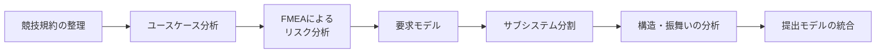

## はじめに

前回の記事では、私がETロボコンに取り組んできた4年間の歩みと、昨年度のベーシッククラスでAIを「設計レビューの相棒」として活用し、シルバーモデルを獲得したことを紹介しました。

@[og](https://developer.mamezou-tech.com/blogs/2026/07/29/et-robocon-001/)

その記事の最後で、今年度はモデル作成のさらなるレベルアップを目指して **アプライドクラス** に挑戦していると書きました。本記事はその続編です。

昨年度は、主に人が作成したモデルをAIにレビューさせ、改善案の検討や抜け漏れの確認に利用していました。今年度はレビューだけでなく、要求候補の洗い出しや図の初期案の作成など、**モデルを作る工程そのもの** にもAIの利用範囲を広げました。

前回は、AIを開発の「新しい武器」として紹介しました。レビューで手応えがあったからこそ、任せる範囲を広げればモデル作成もかなり楽になると考えていました。実際、何もない状態から案を出すところまでは速くなりました。ところが、その案を提出できるモデルへ整理する段階では、要求と実現方法の切り分けや、図同士の整合確認、修正差分の確認に想像以上の時間がかかりました。

この記事では、ETロボコン2026のモデル作成を振り返りながら、**AIで案を作ることは速くなったのに、なぜ完成までは楽にならなかったのか** を、実際に陥った3つの落とし穴から紹介します。前回がAI活用の手応えを伝える記事だったとすれば、今回はAIを使う範囲を広げたことで見えてきた、別の難しさの記録です。

## 1. 今年度の挑戦：アプライドクラスでのモデル作成

2026年度のアプライドクラス地区大会では、**ETラリー** がモデル審査の対象となっています。  
ETラリーは、コース上に配置された赤、青、黄のゲートを、決められた順番で通過する課題です。

:::info
ETロボコンについて初めて知る方は、[ETロボコン公式サイト](https://www.etrobo.jp/)をご覧ください。2026年のフィジカル部門の競技内容は、[公式の競技ルール解説動画](https://www.youtube.com/watch?v=Sa_zXKC643A)でも紹介されています。
:::

私たちは、次の3枚で提出モデルを構成しました。

- アブストラクトページ
- 要求モデル
- システム分析モデル

モデル作成は、次の流れで進めました。

AIは、主に次の作業で利用しました。

- 競技規約の整理
- 要求候補の洗い出し
- 図の初期案の作成
- UML／SysML表現や抜け漏れの確認
- 説明文の推敲

何もない状態から最初の案を作るまでの時間は短くなりました。ただし、その案を提出できるモデルとしてまとめるまでには、想定以上の調整が必要でした。

## 2. AIでモデルを作って分かった3つの落とし穴

AIに任せる範囲を広げたことで、特に困ったのは次の3つです。

1. 要求候補を増やすほど、要求と設計が混ざる
2. 修正を重ねるほど完成から遠ざかる
3. 担当ごとに作った図が、うまくつながらない

いずれも、AIが出す案の質そのものよりも、その案を人が整理し、統合する段階で表面化した問題でした。

### 落とし穴1：要求候補を増やすほど、要求と設計が混ざる

最初に困ったのは、**要求候補を増やすほど、何を要求として残すべきか分かりにくくなったこと** です。

AIは、競技規約や検討中の情報を渡すと、そこから考えられる要求候補を短時間で広げてくれます。これは叩き台を作る場面では便利でした。一方で、出てくる候補には、規約に書かれた事実だけでなく、設計上の仮定、異常時の対策、具体的な実現方法まで混ざることがありました。

途中の要求整理を見返すと、例えば「目標座標まで進む」という要求の下に、次のような走行方式が並んでいました。

- ライントレース走行
- 床QR座標系走行
- IMU座標系走行

また、別の箇所では、ヒントカードの情報を取得する要求から、Base64のデコードやAES-128 ECBによる復号、4桁の復号キーの入力といった具体的な処理まで掘り下げていました。個々の内容は必要そうに見えますが、**「システムが満たすべき要求」なのか、「要求を実現するための設計上の選択」なのかが同じ階層に並んでいた** のです。

当時の検討メモにも、「手段が混じっている」「アルゴリズムは設計で選択するものではないか」「ここまで書くと詳細すぎないか」といった迷いが残っていました。AIに候補を増やしてもらうこと自体よりも、その後に人が分類し直す作業の方が難しかったと感じています。

最終版では、要求には原則として具体的な実現方式を含めず、実現方式は設計要素として分離しました。また、FMEAで抽出したリスク対策についても、対策そのものをそのまま書くのではなく、必要な要求を導出してから設計要素へつなげています。

なお、要求図を作っていた時点のAIとのやり取りをすべて履歴として残していたわけではありません。そのため、「この要求はAIが追加した」と一つずつ特定することはできません。ここで挙げているのは、**AIを使いながら作業した途中資料に、実際にどのような整理課題が残ったか** という観点での振り返りです。

この経験から、AIに要求候補を出してもらう前に、少なくとも次の区分を決めておく必要があると感じました。

- 規約やユースケースから導ける事実
- システムが満たすべき要求
- 設計上の仮定や実現方法
- リスクから追加した対策要求
- まだ採用を決めていないアイデア

単に「要求を挙げてください」と依頼するより、**候補ごとに種別と根拠を付けさせる** 方が、後で整理しやすくなります。

### 落とし穴2：修正を重ねるほど完成から遠ざかる

次に困ったのは、**修正を繰り返すうちに、かえって作業量が増えたこと** です。

実際には、「ここが気になるので修正して」とAIに頼み、出てきた結果を見て「何か違うな」と感じ、さらに修正を依頼する、というやり取りを何度も繰り返しました。最初の指示が曖昧なまま修正を始めてしまい、直したい箇所以外の記述まで変わることもありました。

すると、変更された部分だけでなく、その変更によって新しい不整合が生まれていないかも確認しなければなりません。修正するたびに確認範囲が広がり、完成へ近づいているのか分からなくなることもありました。

メンバーによっては、数日間の作業で1か月分の利用上限に達するほど、AIとのやり取りが膨らみました。文章や図の案を出す時間は短くなりましたが、その後の差分確認には時間がかかりました。

そこで、後半の作業では次の点を意識しました。

- 1回の依頼で変更する範囲と、変更しない箇所を明示する
- モデル全体ではなく、差分だけを出力させる
- チームで参照する最新版を一つに決める
- 修正を続ける前に、一度人が方向性を判断する

AIに何度も修正させることより、**何が気になっていて、どう直したいのかを人が先に整理すること** の方が重要でした。

### 落とし穴3：担当ごとに作った図が、うまくつながらない

今回のモデルは、複数のメンバーで図を分担して作成しました。それぞれの担当者がAIを利用したことで、個々の図は早く作成できました。

ところが、完成した図を組み合わせてみると、次のような違いが見つかりました。

- 同じ概念に異なる名前が使われている
- 要求図とシステム分析図で責務の粒度が異なる
- 関連の向きやステレオタイプが統一されていない
- 個々の図は妥当でも、図をまたぐと関係を追えない

AIは担当者から与えられた文脈に合わせて、それぞれ異なる「もっともらしい案」を生成します。そのため、担当者ごとの解釈の違いが、そのまま図へ反映されやすくなりました。根本にあるのは分担作業の共通ルールと統合方法の問題ですが、AIがその差を広げやすいことは意識しておく必要があります。

次回は、モデル全体で使う用語と命名規則、上位工程で決めた要求やサブシステムのID、UML／SysMLの記法を先に共有したいと考えています。担当者がAIへ依頼するときにも、同じ用語とモデリング方針を渡す必要があります。また、最後にまとめて統合するのではなく、途中で図を持ち寄って確認する時間も設けたいところです。

## 3. 落とし穴の背景にあった、人の側の課題

3つの落とし穴を振り返ると、すべてをAIの問題として片付けることはできません。むしろ、**人の側で曖昧だった部分を、AIがもっともらしく具体化したことで、整理すべき量が増えた** と考えた方が近そうです。

### 対象システムの境界を決め切れていなかった

競技全体からETラリーだけを切り出す際、どこまでを今回の分析対象に含めるかを十分に決め切れていませんでした。

途中資料では、例えば復号キーについて、「走行体が受信すること」まで要求に含めるのか、スターターやPC、無線通信デバイスとの境界をどこに置くのか、といった検討が残っていました。こうした境界が曖昧な状態で要求を展開すると、対象外かもしれない処理まで詳細化されていきます。

また、正常時の走行要求だけでなく、QRを読み取れなかった場合の復帰、目標未到達時のタイムアウト、順序外のゲートを通過した場合の再走行なども同じ要求ツリーの中で検討していました。異常系を考えること自体は必要ですが、正常系、リスク対策、設計案が同時に増えると、どの観点で要求を分解しているのかが分かりにくくなります。

AIが問題を作ったというより、**対象範囲や分類軸を決める前に候補を広げたため、人がまだ決めていない部分まで具体化された** ことが問題でした。

### 検討の終了条件を決めていなかった

FMEAや要求図の粒度調整に時間をかけすぎた結果、システム分析モデルや提出モデルの説明文を作成する時間が不足しました。

AIを使うと、「このケースもありそう」「この対策も必要そう」と案を簡単に増やせます。そのため、「もう少し良くできそう」と検討を続けやすくなります。しかし、モデル審査では限られた紙面と時間の中で、何を伝えるかを決める必要があります。

今回の反省は、AIの出力精度だけではありません。**どこまで検討すれば完了なのかという終了条件を、人が先に持てていなかったこと** も大きかったと考えています。

## 4. それでもAIが役立った場面

ここまで落とし穴を挙げてきましたが、AIを使わない方がよかったとは考えていません。実際に、AIが効果的だった場面も多くありました。

- モデルの叩き台を短時間で作る
- 複数の表現案を比較する
- 自分たちが見落としていた観点を洗い出す
- UML／SysMLの表現や矛盾を確認する
- 説明文を読みやすく整える

特に、何もない状態から最初の案を作る場面では役立ちました。一方で、何をモデル化するか、どこまでを対象にするか、どの案を採用するかは、人が決める必要があります。AIは案を出すところでは役立ちますが、チームが何を実現したいのかまで判断してくれるわけではありません。

## 5. 次に同じ作業をするなら

今回の反省を踏まえ、次回は次のように進めたいと考えています。

1. **モデルの目的と対象範囲を、人が先に決める**
2. **AIの出力を「事実・要求・仮定・実現方法・提案」に分ける**
3. **要求候補には、根拠と採否を残す**
4. **上位工程で決めた用語とIDをチームで共有する**
5. **モデル全体の再生成ではなく、差分修正を基本にする**
6. **途中案と判断理由を残し、後から変更経緯を追えるようにする**
7. **最終的な整合性と採否は、人が判断する**

今回、途中資料はいくつか残っていたものの、AIとのやり取りや要求が追加された経緯をすべて追える状態ではありませんでした。次回は、完成モデルだけでなく、「なぜ追加したか」「なぜ削ったか」も簡単に残しておきたいと考えています。そうすれば、AIの出力を評価しやすくなるだけでなく、複数人でモデルを統合するときの判断材料にもなります。

また、AIへ次の修正を頼む前に、本当に直す必要があるのか、どうなれば修正完了なのかを一度人が考えます。プロンプトの工夫だけではなく、誰が何を決めるのか、どのファイルを最新版として扱うのか、どの状態をレビュー対象とするのかをチーム内でそろえることも必要です。

## 6. 東海地区大会に向けて

モデルはすでに提出し、現在は10月3日の東海地区大会に向けて実機走行の準備に軸足を移しています。

今後は、モデル上で検討したリスク対策が実際の走行でも機能するのかを確認していきます。走行ログを使った状態遷移の確認や、ゲート誤認識時のリカバリ、モデルと実装の対応関係も重点的に見直す予定です。

今回一番強く感じたのは、AIで「考え始めるまで」は速くなっても、**「何を要求とし、何を設計に回し、どこで検討を終えるか」を決めるところまでは、自動的に速くならない** ということでした。

AIは、曖昧な部分を埋めながら案を広げるのは得意です。しかし、モデルでは、その曖昧さを残してよいのか、どこで境界を引くのかを決める必要があります。次回は、AIに案を増やしてもらうこと以上に、**分類する、捨てる、終わらせる** という人側の判断を意識して使いたいと思います。
