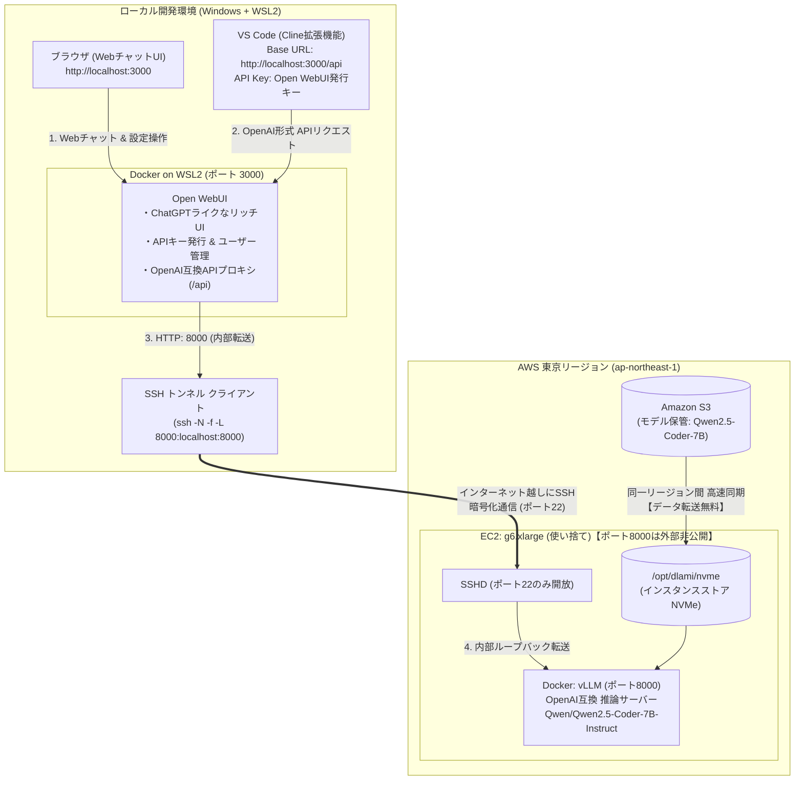

## はじめに

前回の記事（[AWS×UserDataでvLLMを自動起動！停止時コストほぼゼロのローカルLLM環境](/blogs/2026/09/16/vllm_autolaunch/)）では、AWSのUserDataとS3を活用してvLLMを全自動起動し、使い終わったらTerminate（終了）することで停止中のEBS維持コストをほぼゼロにするエフェメラルなLLM推論環境を作りました。

コマンド一発でGPUインスタンスが立ち上がり、手軽に自前の推論APIを呼び出せるようになった次のステップとして、「これを日々の開発ワークフローにどう組み込むか」という実用化の検討に入りました。

VS Code上で自律的にコード編集やテスト実行を行うAIコーディングエージェント「**Cline**」の頭脳として自前GPUを活用できれば、商用APIの従量課金やレートリミットを気にせず、完全定額（インスタンス稼働分のみ）でエージェントを動かし放題にできます。

ただし、いきなりエージェントにすべてを任せる前に、まずはブラウザ上でモデルの推論速度や日本語の応答品質を手軽に対話検証したいところです。

そこで今回は、現在オープンソースの世界で最も活発に開発されているフロントエンド **「Open WebUI」**（GitHub Star 6万超）を採用しました。Open WebUIは美しいチャット画面を提供するだけでなく、自身がOpenAI互換のAPIゲートウェイとして機能するため、**「ブラウザでの対話検証」と「VS Code連携」を一挙両得で実現**できます。

本記事では、手元のローカルPC（**Windows WSL2 + docker**）上で Open WebUI を動かし、AWS上のGPUインスタンスで稼働する定番オープンソースモデル [Qwen/Qwen2.5-Coder-7B-Instruct](https://huggingface.co/Qwen/Qwen2.5-Coder-7B-Instruct) へ **SSHポートフォワード** 経由でセキュアに直結。トークンフリーな自律コーディング環境を実現する手順とノウハウをご紹介します！

---

## なぜ「Open WebUI」を採用するのか？

自前の推論基盤とクライアントの間に **Open WebUI** を挟むことには、開発体験において大きなメリットがあります。


```mermaid
flowchart TD
    subgraph LocalPC ["ローカル開発環境 (Windows + WSL2)"]
        Browser["ブラウザ (WebチャットUI)<br>http://localhost:3000"]
        Cline["VS Code (Cline拡張機能)<br>Base URL: http://localhost:3000/api<br>API Key: Open WebUI発行キー"]
        
        subgraph DockerEnv ["Docker on WSL2 (ポート 3000)"]
            OpenWebUI["Open WebUI<br>・ChatGPTライクなリッチUI<br>・APIキー発行 & ユーザー管理<br>・OpenAI互換APIプロキシ (/api)"]
        end
        
        SSHTunnel["SSH トンネル クライアント<br>(ssh -N -f -L 8000:localhost:8000)"]
        
        Browser -->|1. Webチャット & 設定操作| OpenWebUI
        Cline -->|2. OpenAI形式 APIリクエスト| OpenWebUI
        OpenWebUI -->|"3. HTTP: 8000 (内部転送)"| SSHTunnel
    end

    subgraph AWS ["AWS 東京リージョン (ap-northeast-1)"]
        subgraph EC2Env ["EC2: g6.xlarge (使い捨て)【ポート8000は外部非公開】"]
            SSHD["SSHD (ポート22のみ開放)"]
            vLLM["Docker: vLLM (ポート8000)<br>OpenAI互換 推論サーバー<br>Qwen/Qwen2.5-Coder-7B-Instruct"]
            LocalStorage[("/opt/dlami/nvme<br>(インスタンスストア NVMe)")]
            
            SSHD -->|4. 内部ループバック転送| vLLM
            LocalStorage --> vLLM
        end

        S3[("Amazon S3<br>(モデル保管: Qwen2.5-Coder-7B)")]
        S3 -->|同一リージョン間 高速同期<br>【データ転送無料】| LocalStorage
    end

    SSHTunnel == インターネット越しにSSH暗号化通信 (ポート22) ==> SSHD
```

### 1. 「Webチャット」と「VS Code連携」の一石二鳥
Open WebUIは、ブラウザからChatGPT / Claudeと同等の洗練されたWeb UIを提供してくれます。
* コーディングエージェントに大きなタスクを任せる前に、**「このモデルは日本語の指示にどう答えるか？」「関数のプロトタイプはどう作るか？」をブラウザ上で手軽に対話・検証**できます。
* 会話履歴の保存、プロンプトテンプレート管理、Markdownコードハイライトなど、日常的なLLMフロントエンドとしても非常に便利です。

### 2. OpenAI互換APIプロキシ（`/api`）の標準搭載
Open WebUIは単なる画面表示ツールにとどまりません。自身が **OpenAI互換のAPIゲートウェイ** として振る舞う機能を備えています。
* 設定画面から独自の **APIキー** を発行可能。
* 外部ツール（Clineなど）から `http://localhost:3000/api` を叩くだけで、Open WebUIが認証・ログ記録を行いつつ、背後のvLLMへリクエストを安全にルーティングしてくれます。

### 3. SSHポートフォワードによる「接続先URLの完全固定化」と安全性
使い捨て運用のEC2は起動ごとに動的パブリックIPが変わります。
* EC2側のセキュリティグループでは **ポート8000を外部公開せず、SSH（ポート22）のみ開放**。
* ローカルPC（WSL2）から `ssh -N -f -L 8000:localhost:8000` で暗号化トンネルを確立。
* Open WebUIはホストネットワーク経由で常にローカルの `http://127.0.0.1:8000/v1` に接続。
* **Cline側の接続先も常に `http://localhost:3000/api` で固定**できます。EC2を何度再起動・破棄してもエディタやブラウザの設定変更は不要です。

---

## なぜエージェントに「Cline」を選ぶのか？

vLLMと組み合わせるAIコーディング拡張機能として **Cline** を選定した理由は明確です：

1. **OpenAI互換APIのネイティブサポート**:
   特定のプロバイダ専用ツールとは異なり、Clineは公式に「OpenAI Compatible」プロバイダに対応しています。独自スキーマの変換に悩まされることなく、標準的な `/v1/chat/completions` エンドポイントへ極めてスムーズに接続できます。
2. **VS Codeエディタとの一体感と自律実行力**:
   サイドバーのチャットから指示を出すだけで、ファイルツリーの走査、コード差分（Diff）の提示・適用、統合ターミナルでのビルドやテスト実行までをエディタ内で完結して自律実行してくれます。
3. **Plan / Act モードによる確実なタスク遂行**:
   設計・方針決定を行う「Planモード」と、実際のファイル編集・コマンド実行を行う「Actモード」をシームレスに行き来でき、オープンソースモデル（7B〜32Bクラス）でも脱線せずに着実なコーディングを進められます。

---

## 環境構築ステップ

### Step 1: WSL2 + Docker で Open WebUI を起動

まずは手元のWSL2環境で「Open WebUI」を起動します。
公式のDockerコンテナイメージが提供されているため、Docker Composeまたは `docker run` コマンド一発で立ち上がります。

#### 方法A: Docker Compose で起動（推奨）

```yaml
# docker-compose.open-webui.yml
services:
  open-webui:
    image: ghcr.io/open-webui/open-webui:main
    container_name: open-webui
    restart: always
    network_mode: host
    environment:
      # ポート3000で待ち受け
      - PORT=3000
      # SSHトンネル（localhost:8000）をOpenAI互換バックエンドとして指定
      - OPENAI_API_BASE_URL=http://127.0.0.1:8000/v1
      - OPENAI_API_KEY=none
    volumes:
      - open-webui-data:/app/backend/data

volumes:
  open-webui-data:
```

```bash
docker compose -f docker-compose.open-webui.yml up -d
```

#### 方法B: `docker run` コマンドで起動

```bash
docker run -d --net=host \
  -v open-webui-data:/app/backend/data \
  -e PORT=3000 \
  -e OPENAI_API_BASE_URL=http://127.0.0.1:8000/v1 \
  -e OPENAI_API_KEY=none \
  --name open-webui \
  --restart always \
  ghcr.io/open-webui/open-webui:main
```

:::info
**💡 なぜホストネットワーク（`network_mode: host` / `--net=host`）を使うのか？**  
WSL2環境でSSHポートフォワード（`ssh -L 8000:localhost:8000`）を実行すると、SSHプロセスはホストのループバックアドレス（`127.0.0.1:8000`）のみで待ち受けます。  
Dockerの通常のブリッジネットワーク（`-p 3000:8080`）でコンテナを動かすと、`host.docker.internal` 経由のアクセスはDocker仮想NIC（`docker0`）から入ってくるため、`127.0.0.1` にしかバインドしていないSSHトンネルにパケットが届かず接続エラー（Connection refused）になってしまいます。  
ホストネットワークを使用することで、コンテナがWSL2ホストと同一のネットワーク空間（`127.0.0.1`）を共有するため、余計な設定を気にせず `http://127.0.0.1:8000/v1` で確実に直結できます。
:::

起動後、ブラウザで `http://localhost:3000` を開きます。  
※ 初回アクセス時に管理者アカウント（名前・メール・パスワード）の作成画面が表示されます。手元のローカル環境ですので、お好みの情報でサインアップしてください。  
※ 本記事の画面キャプチャでは、サインイン後に左下のユーザーアイコン $\rightarrow$ **「設定（Settings）」 $\rightarrow$ 「全般（General）」 $\rightarrow$ 「言語（Language）」** で表示言語を **「日本語」** に設定しています（英語UIのままでも問題なく利用可能です）。

---

### Step 2: EC2起動 ＆ 暗号化SSHトンネルを自動確立

EC2インスタンスの自動構築と接続は、以下の2つのスクリプトで行います：

1. **`02_ec2_userdata.sh`**: EC2の起動時に自動実行され、S3からモデルを同期し、ツール呼び出し（Tool Calling）を有効化したvLLMコンテナを起動するUserDataスクリプト
2. **`02_ec2_launch_and_tunnel.sh`**: ローカルPCからEC2インスタンスを起動し、上記UserDataを流し込んで暗号化SSHトンネルを自動確立するスクリプト

#### 1. EC2内部の自動構築スクリプト（`02_ec2_userdata.sh`）

まずは、EC2起動時にサーバー内部で実行されるUserDataスクリプトです。第1回のスクリプトをベースに、自律型コーディングエージェント（Cline）やOpen WebUIからのツール呼び出し（Tool Calling）に対応するため、**vLLMの起動引数に `--enable-auto-tool-choice` および `--tool-call-parser hermes` を追加**しています。

<details><summary>02_ec2_userdata.sh（クリックで展開）</summary>

```bash
#!/bin/bash
set -euo pipefail

# ==============================================================================
# 02_ec2_userdata.sh
# EC2起動時に実行されるUserDataスクリプト
#
# 前提:
#   - AMI: Ubuntu 22.04 Deep Learning AMI (NVIDIA Driver & Docker導入済み)
#   - インスタンスタイプ: g6.xlarge (NVIDIA L4 GPU: 24GB VRAM, 250GB NVMe SSD付属)
#   - IAMロール: S3(ReadOnly/FullAccess) 及び ECR(ReadOnly) 権限アタッチ済み
# ==============================================================================

LOG_FILE="/var/log/userdata-vllm.log"
exec > >(tee -a "${LOG_FILE}") 2>&1
echo "=== [$(date '+%Y-%m-%d %H:%M:%S')] UserData 実行開始 ==="

# 設定パラメータ
AWS_REGION="${AWS_REGION:-ap-northeast-1}"
S3_BUCKET_NAME="${S3_BUCKET_NAME:-my-llm-models-tokyo}"
HF_MODEL_ID="${HF_MODEL_ID:-Qwen/Qwen2.5-Coder-7B-Instruct}"
SERVED_MODEL_NAME="${SERVED_MODEL_NAME:-Qwen/Qwen2.5-Coder-7B-Instruct}"
VLLM_PORT="8000"
GPU_MEMORY_UTILIZATION="0.90"
MAX_MODEL_LEN="16384"
DOCKER_IMAGE="${DOCKER_IMAGE:-vllm/vllm-openai:latest}"

echo "取得モデル(HF) : ${HF_MODEL_ID}"
echo "公開モデル名   : ${SERVED_MODEL_NAME}"
echo "S3バケット     : s3://${S3_BUCKET_NAME}"

# 1. ローカル NVMe インスタンスストア（250GB）の検出と活用
# ※ AWS Deep Learning AMI (DLAMI) は、起動時にローカルNVMeを自動で /opt/dlami/nvme にマウントしてくれます
NVME_DIR="/opt/dlami/nvme"
if mountpoint -q "${NVME_DIR}" || [ -d "${NVME_DIR}" ]; then
    echo "DLAMI既定の NVMe マウント (${NVME_DIR}) を検出しました。モデル＆Docker領域として活用します..."
    mkdir -p "${NVME_DIR}/models" "${NVME_DIR}/docker"
    mkdir -p /data
    ln -sfn "${NVME_DIR}/models" /data/models
else
    # DLAMI以外のAMIや未マウント時のフォールバック処理
    NVME_DEV=$(lsblk -d -n -o NAME,SIZE | grep -E '250G|232G' | head -n1 | awk '{print $1}')
    if [ -n "${NVME_DEV}" ]; then
        echo "ローカル NVMe SSD (/dev/${NVME_DEV}) を検出しました。/data にマウントします..."
        mkfs.ext4 -F "/dev/${NVME_DEV}" || true
        mkdir -p /data
        mount -o noatime "/dev/${NVME_DEV}" /data || true
    else
        mkdir -p /data
    fi
    mkdir -p /data/models /data/docker
    NVME_DIR="/data"
fi

LOCAL_MODEL_ROOT="/data/models"
LOCAL_MODEL_DIR="${LOCAL_MODEL_ROOT}/${HF_MODEL_ID}"
mkdir -p "${LOCAL_MODEL_DIR}"
chmod 777 "${LOCAL_MODEL_ROOT}"

# 2. Docker & containerd のデータ領域を NVMe に配置し、EBS枯渇防止＆レイヤー展開を爆速化
# ※ Docker 24+ および containerd は /var/lib/containerd にスナップショットを展開するため、
#   両方を 250GB NVMe SSD にバインドマウントして 40GB EBS のディスク満杯 (no space left on device) を完全に防止します
echo "Docker/containerd を停止して NVMe 領域へのバインドマウントを設定します..."
systemctl stop docker containerd || true

mkdir -p "${NVME_DIR}/docker" "${NVME_DIR}/containerd"
mkdir -p /var/lib/docker /var/lib/containerd

# 既存データがあれば移行
cp -a /var/lib/docker/* "${NVME_DIR}/docker/" 2>/dev/null || true
cp -a /var/lib/containerd/* "${NVME_DIR}/containerd/" 2>/dev/null || true

mount --bind "${NVME_DIR}/docker" /var/lib/docker
mount --bind "${NVME_DIR}/containerd" /var/lib/containerd

if ! grep -q "/var/lib/docker" /etc/fstab; then
    echo "${NVME_DIR}/docker /var/lib/docker none defaults,bind 0 0" >> /etc/fstab
fi
if ! grep -q "/var/lib/containerd" /etc/fstab; then
    echo "${NVME_DIR}/containerd /var/lib/containerd none defaults,bind 0 0" >> /etc/fstab
fi

mkdir -p /etc/docker
cat <<EOF > /etc/docker/daemon.json
{
  "data-root": "/var/lib/docker"
}
EOF

systemctl daemon-reload
systemctl start containerd
systemctl start docker

# 3. モデルデータの準備 (S3にあれば高速同期、無ければEC2上でHugging Faceから直接取得してS3へバックアップ)
echo "=== [$(date '+%Y-%m-%d %H:%M:%S')] モデルデータの準備確認... ==="
S3_SRC="s3://${S3_BUCKET_NAME}/models/${HF_MODEL_ID}"
echo "S3ターゲット: ${S3_SRC}/ (リージョン: ${AWS_REGION})"
aws configure set default.s3.max_concurrent_requests 20

# IAMクレデンシャルとS3疎通の待機 (起動直後はメタデータサービスからのSTSトークン反映に数秒かかる場合がある)
echo "IAM認証およびS3バケット接続を確認中..."
for i in {1..15}; do
    if aws s3 ls "s3://${S3_BUCKET_NAME}" --region "${AWS_REGION}" >/dev/null 2>&1; then
        echo "S3バケットへの接続を確認しました。"
        break
    fi
    echo "S3接続/IAM認証待機中 ($i/15)..."
    sleep 2
done

HAS_S3_MODEL=false
echo "S3上のモデル存在チェックを実行中: aws s3 ls ${S3_SRC}/ --region ${AWS_REGION}"
S3_CHECK=$(aws s3 ls "${S3_SRC}/" --region "${AWS_REGION}" 2>&1 || true)
echo "S3チェック結果:"
echo "${S3_CHECK}"

if echo "${S3_CHECK}" | grep -E '(\.safetensors|\.bin|\.json)' >/dev/null; then
    HAS_S3_MODEL=true
fi

if [ "${HAS_S3_MODEL}" = "true" ]; then
    echo "=== [$(date '+%Y-%m-%d %H:%M:%S')] S3上にモデルを発見しました。S3から高速同期します... ==="
    aws s3 sync "${S3_SRC}" "${LOCAL_MODEL_DIR}" \
        --region "${AWS_REGION}" \
        --no-progress
else
    echo "=== [$(date '+%Y-%m-%d %H:%M:%S')] S3上にモデルがありません。EC2上で直接Hugging Faceから高速取得します... ==="
    python3 -m pip install -U "huggingface_hub[cli]" || pip3 install -U "huggingface_hub[cli]" || true
    
    echo "Hugging Face ('${HF_MODEL_ID}') からモデルを直接ダウンロード中..."
    python3 -c "
import sys
from huggingface_hub import snapshot_download
try:
    snapshot_download(repo_id='${HF_MODEL_ID}', local_dir='${LOCAL_MODEL_DIR}', local_dir_use_symlinks=False)
    print('Hugging Faceからのダウンロードに成功しました。')
except Exception as e:
    print(f'ダウンロードエラー: {e}', file=sys.stderr)
    sys.exit(1)
"
    echo "ダウンロード完了。容量:"
    du -sh "${LOCAL_MODEL_DIR}"
fi

echo "モデル準備完了。ローカル容量確認:"
du -sh "${LOCAL_MODEL_DIR}"

# 4. vLLMコンテナの起動
echo "=== [$(date '+%Y-%m-%d %H:%M:%S')] vLLMコンテナ起動 ==="
CONTAINER_NAME="vllm-server"

# ECR イメージの場合はログイン認証を実行
if [[ "${DOCKER_IMAGE}" == *".dkr.ecr."* ]]; then
    echo "ECR イメージを検出しました。ログイン認証を実行中..."
    ECR_REGISTRY=$(echo "${DOCKER_IMAGE}" | cut -d'/' -f1)
    aws ecr get-login-password --region "${AWS_REGION}" | docker login --username AWS --password-stdin "${ECR_REGISTRY}" || true
fi

# 既存コンテナがあれば停止・削除
if docker ps -a --format '{{.Names}}' | grep -q "^${CONTAINER_NAME}$"; then
    echo "既存の ${CONTAINER_NAME} を停止・削除します..."
    docker rm -f "${CONTAINER_NAME}"
fi

docker run -d \
    --name "${CONTAINER_NAME}" \
    --restart unless-stopped \
    --gpus all \
    --ipc=host \
    -p "${VLLM_PORT}:8000" \
    -v "${LOCAL_MODEL_ROOT}:/models" \
    "${DOCKER_IMAGE}" \
    --model "/models/${HF_MODEL_ID}" \
    --served-model-name "${SERVED_MODEL_NAME}" \
    --gpu-memory-utilization "${GPU_MEMORY_UTILIZATION}" \
    --max-model-len "${MAX_MODEL_LEN}" \
    --trust-remote-code \
    --enable-auto-tool-choice \
    --tool-call-parser hermes

# 5. ヘルスチェック (起動待機)
echo "vLLM サーバーの起動ヘルスチェックを開始します (ポート ${VLLM_PORT})..."
MAX_RETRIES=120 # 初回起動・CUDAグラフ構築に余裕を持たせる (最大10分)
RETRY_COUNT=0

while [ ${RETRY_COUNT} -lt ${MAX_RETRIES} ]; do
    if curl -s "http://127.0.0.1:${VLLM_PORT}/health" > /dev/null 2>&1; then
        echo "=== [$(date '+%Y-%m-%d %H:%M:%S')] vLLMサーバーが正常に起動しました！ ==="
        break
    fi
    echo "起動待機中... (${RETRY_COUNT}/${MAX_RETRIES})"
    sleep 5
    RETRY_COUNT=$((RETRY_COUNT + 1))
done

if [ ${RETRY_COUNT} -eq ${MAX_RETRIES} ]; then
    echo "警告: vLLMヘルスチェックがタイムアウトしました。'docker logs ${CONTAINER_NAME}' を確認してください。"
else
    # 起動成功時: HFから直接ダウンロードしていた場合は、裏でS3へ自動バックアップ (I/O優先度を下げて推論を阻害しない)
    if [ "${HAS_S3_MODEL}" = "false" ]; then
        echo "=== [$(date '+%Y-%m-%d %H:%M:%S')] 起動完了を確認。次回以降の高速同期のため、裏でS3へバックアップを開始します ==="
        (
            if ! aws s3 ls "s3://${S3_BUCKET_NAME}" --region "${AWS_REGION}" 2>/dev/null; then
                if [ "${AWS_REGION}" = "us-east-1" ]; then
                    aws s3api create-bucket --bucket "${S3_BUCKET_NAME}" 2>/dev/null || true
                else
                    aws s3api create-bucket --bucket "${S3_BUCKET_NAME}" --region "${AWS_REGION}" --create-bucket-configuration LocationConstraint="${AWS_REGION}" 2>/dev/null || true
                fi
            fi
            ionice -c 3 aws s3 sync "${LOCAL_MODEL_DIR}" "${S3_SRC}" --region "${AWS_REGION}" --no-progress 2>/dev/null || \
            aws s3 sync "${LOCAL_MODEL_DIR}" "${S3_SRC}" --region "${AWS_REGION}" --no-progress 2>/dev/null || true
            echo "[$(date '+%Y-%m-%d %H:%M:%S')] S3モデルバックアップ完了！次回からはS3から超高速同期されます。"
        ) > /var/log/s3-backup.log 2>&1 &
    fi
fi

# 6. 1時間アイドル時の自動シャットダウン（自爆Terminate）デーモン起動
echo "=== アイドル自動終了デーモンを設定・起動します ==="
cat <<'EOF' > /usr/local/bin/auto-idle-shutdown.sh
#!/bin/bash
IDLE_LIMIT_SEC=3600  # 1時間 (3600秒)
IDLE_COUNT=0
CHECK_INTERVAL=300   # 5分おきにチェック

while true; do
    sleep "${CHECK_INTERVAL}"
    
    # 直近5分間のvLLMへの推論リクエスト数をログからカウント
    REQ_COUNT=$(docker logs --since 5m vllm-server 2>&1 | grep -c "POST /v1" || true)
    
    if [ "${REQ_COUNT}" -eq 0 ]; then
        IDLE_COUNT=$((IDLE_COUNT + CHECK_INTERVAL))
        echo "[$(date '+%Y-%m-%d %H:%M:%S')] アイドル継続中: ${IDLE_COUNT}s / ${IDLE_LIMIT_SEC}s"
        
        if [ "${IDLE_COUNT}" -ge "${IDLE_LIMIT_SEC}" ]; then
            echo "[$(date '+%Y-%m-%d %H:%M:%S')] 1時間アイドル状態が継続したため、自動終了(Terminate)を実行します。"
            shutdown -h now
            exit 0
        fi
    else
        IDLE_COUNT=0  # リクエストがあったらタイマーリセット
    fi
done
EOF

chmod +x /usr/local/bin/auto-idle-shutdown.sh
nohup /usr/local/bin/auto-idle-shutdown.sh > /var/log/auto-idle-shutdown.log 2>&1 &
echo "=== [$(date '+%Y-%m-%d %H:%M:%S')] UserData 全処理完了 (自動アイドル監視稼働中) ==="
```

</details>

#### 2. EC2起動 ＆ 暗号化SSHトンネル自動確立スクリプト（`02_ec2_launch_and_tunnel.sh`）

続いて、ローカルPCから上記UserDataを渡してEC2を起動し、SSHトンネルをバックグラウンドで自動開通させるスクリプトです。

<details><summary>02_ec2_launch_and_tunnel.sh（クリックで展開）</summary>

```bash
#!/bin/bash
set -euo pipefail

# ==============================================================================
# 02_ec2_launch_and_tunnel.sh
# EC2 GPUインスタンスを起動し、SSHポートフォワードで安全にvLLMをローカル(8000)に接続するスクリプト
#
# 特徴:
#   - EC2のポート8000をインターネットに一切公開せず、ポート22(SSH)のみで運用
#   - ローカルPCでSSHトンネル(-L 8000:localhost:8000)を自動確立
#   - Open WebUI はローカル(http://127.0.0.1:8000/v1)を向くだけなので設定固定！
# ==============================================================================

SCRIPT_DIR="$(cd "$(dirname "${BASH_SOURCE[0]}")" && pwd)"
USER_DATA_FILE="${USER_DATA_FILE:-${SCRIPT_DIR}/02_ec2_userdata.sh}"
INSTANCE_STATE_FILE="${SCRIPT_DIR}/.current_instance_id"
TUNNEL_PID_FILE="${SCRIPT_DIR}/.current_ssh_tunnel_pid"

# --- AWS 設定 ---
AWS_REGION="${AWS_REGION:-ap-northeast-1}"
INSTANCE_TYPE="${INSTANCE_TYPE:-g6.xlarge}" # NVIDIA L4 GPU (24GB VRAM)
AMI_ID="${AMI_ID:-}"
IAM_ROLE_NAME="${IAM_ROLE_NAME:-EC2-S3-ReadOnly-Profile}"
SECURITY_GROUP_IDS="${SECURITY_GROUP_IDS:-}"
SUBNET_ID="${SUBNET_ID:-}"
KEY_NAME="${KEY_NAME:-my-vllm-models-hackathon-2026}"
KEY_PATH="${KEY_PATH:-${HOME}/.ssh/${KEY_NAME}.pem}"
EBS_SIZE_GB="${EBS_SIZE_GB:-40}"

# --- モデル & UserData 設定 ---
S3_BUCKET_NAME="${S3_BUCKET_NAME:-my-vllm-models-hackathon-2026-$(aws sts get-caller-identity --query Account --output text)-ap-northeast-1-an}"
HF_MODEL_ID="${HF_MODEL_ID:-Qwen/Qwen2.5-Coder-7B-Instruct}"
SERVED_MODEL_NAME="${SERVED_MODEL_NAME:-Qwen/Qwen2.5-Coder-7B-Instruct}"
MAX_MODEL_LEN="${MAX_MODEL_LEN:-16384}"
GPU_MEMORY_UTILIZATION="${GPU_MEMORY_UTILIZATION:-0.90}"
DOCKER_IMAGE="${DOCKER_IMAGE:-vllm/vllm-openai:latest}"

echo "=== 1. 設定確認 ==="
if [ ! -f "${USER_DATA_FILE}" ]; then
    echo "エラー: UserDataスクリプトが見つかりません: ${USER_DATA_FILE}"
    echo "第1回の 02_ec2_userdata.sh を配置するか、環境変数 USER_DATA_FILE を指定してください。"
    exit 1
fi

echo "使用するSSH秘密鍵: ${KEY_PATH}"

# 一時UserDataスクリプトを生成して環境変数を注入
TEMP_USERDATA=$(mktemp)
trap 'rm -f "${TEMP_USERDATA}"' EXIT

sed -e "s|^AWS_REGION=.*|AWS_REGION=\"${AWS_REGION}\"|" \
    -e "s|^S3_BUCKET_NAME=.*|S3_BUCKET_NAME=\"${S3_BUCKET_NAME}\"|" \
    -e "s|^HF_MODEL_ID=.*|HF_MODEL_ID=\"${HF_MODEL_ID}\"|" \
    -e "s|^SERVED_MODEL_NAME=.*|SERVED_MODEL_NAME=\"${SERVED_MODEL_NAME}\"|" \
    -e "s|^MAX_MODEL_LEN=.*|MAX_MODEL_LEN=\"${MAX_MODEL_LEN}\"|" \
    -e "s|^GPU_MEMORY_UTILIZATION=.*|GPU_MEMORY_UTILIZATION=\"${GPU_MEMORY_UTILIZATION}\"|" \
    -e "s|^DOCKER_IMAGE=.*|DOCKER_IMAGE=\"${DOCKER_IMAGE}\"|" \
    "${USER_DATA_FILE}" > "${TEMP_USERDATA}"

if [ -z "${AMI_ID}" ]; then
    echo "Ubuntu 22.04 Deep Learning AMI を自動検索中..."
    AMI_ID=$(aws ec2 describe-images \
        --region "${AWS_REGION}" \
        --owners amazon \
        --filters "Name=name,Values=Deep Learning OSS Nvidia Driver AMI GPU PyTorch * (Ubuntu 22.04)*" "Name=state,Values=available" \
        --query 'sort_by(Images, &CreationDate)[-1].ImageId' \
        --output text)
    echo "使用AMI ID: ${AMI_ID}"
fi

# SSH専用セキュリティグループの自動取得または作成
if [ -z "${SECURITY_GROUP_IDS}" ]; then
    SG_NAME="vllm-ssh-tunnel-sg"
    SG_ID=$(aws ec2 describe-security-groups \
        --region "${AWS_REGION}" \
        --filters "Name=group-name,Values=${SG_NAME}" \
        --query 'SecurityGroups[0].GroupId' --output text 2>/dev/null || true)
    
    if [ -z "${SG_ID}" ] || [ "${SG_ID}" = "None" ]; then
        echo "SSH専用セキュリティグループ (${SG_NAME}) を作成します..."
        DEFAULT_VPC=$(aws ec2 describe-vpcs --region "${AWS_REGION}" --filters "Name=isDefault,Values=true" --query 'Vpcs[0].VpcId' --output text)
        SG_ID=$(aws ec2 create-security-group \
            --region "${AWS_REGION}" \
            --group-name "${SG_NAME}" \
            --description "Allow SSH port 22 only for vLLM tunnel" \
            --vpc-id "${DEFAULT_VPC}" \
            --query 'GroupId' --output text)
        aws ec2 authorize-security-group-ingress \
            --region "${AWS_REGION}" --group-id "${SG_ID}" \
            --protocol tcp --port 22 --cidr "0.0.0.0/0"
    fi
    SECURITY_GROUP_IDS="${SG_ID}"
fi

# --- 2. EC2 インスタンス起動 ---
echo "=== 2. EC2インスタンス起動 (使い捨てエフェメラル仕様) ==="
INSTANCE_ID=$(aws ec2 run-instances \
    --region "${AWS_REGION}" \
    --image-id "${AMI_ID}" \
    --instance-type "${INSTANCE_TYPE}" \
    --key-name "${KEY_NAME}" \
    --iam-instance-profile "Name=${IAM_ROLE_NAME}" \
    --security-group-ids ${SECURITY_GROUP_IDS} \
    --instance-initiated-shutdown-behavior terminate \
    --block-device-mappings "[{\"DeviceName\":\"/dev/sda1\",\"Ebs\":{\"VolumeSize\":${EBS_SIZE_GB},\"VolumeType\":\"gp3\",\"DeleteOnTermination\":true}}]" \
    --user-data "file://${TEMP_USERDATA}" \
    --tag-specifications "ResourceType=instance,Tags=[{Key=Name,Value=vllm-openwebui-server}]" \
    --query 'Instances[0].InstanceId' \
    --output text)

echo "インスタンス起動リクエスト完了: ${INSTANCE_ID}"
echo "${INSTANCE_ID}" > "${INSTANCE_STATE_FILE}"

echo "インスタンスの起動完了を待機中..."
aws ec2 wait instance-running --region "${AWS_REGION}" --instance-ids "${INSTANCE_ID}"

PUBLIC_IP=$(aws ec2 describe-instances \
    --region "${AWS_REGION}" \
    --instance-ids "${INSTANCE_ID}" \
    --query 'Reservations[0].Instances[0].PublicIpAddress' \
    --output text)
echo "パブリックIP   : ${PUBLIC_IP}"

# --- 3. SSHポートフォワード接続 (暗号化トンネル確立) ---
echo "=== 3. SSHポートフォワード接続 (暗号化トンネル確立) ==="
while ! nc -z -w 3 "${PUBLIC_IP}" 22 2>/dev/null; do
    sleep 3
done
echo "EC2 SSHD応答確認！"

if [ -f "${TUNNEL_PID_FILE}" ]; then
    OLD_PID=$(cat "${TUNNEL_PID_FILE}" | tr -d '[:space:]')
    kill -9 "${OLD_PID}" 2>/dev/null || true
    rm -f "${TUNNEL_PID_FILE}"
fi

ssh -i "${KEY_PATH}" \
    -o StrictHostKeyChecking=no \
    -o UserKnownHostsFile=/dev/null \
    -o ServerAliveInterval=15 \
    -o ServerAliveCountMax=3 \
    -N -f -L 8000:localhost:8000 \
    "ubuntu@${PUBLIC_IP}"

TUNNEL_PID=$(pgrep -f "ssh.*-L 8000:localhost:8000.*ubuntu@${PUBLIC_IP}" | head -n1 || true)
if [ -n "${TUNNEL_PID}" ]; then
    echo "${TUNNEL_PID}" > "${TUNNEL_PID_FILE}"
fi
echo "SSHトンネル確立完了！ (PID: ${TUNNEL_PID})"

# --- 4. vLLMサーバーの初期化＆ヘルスチェック待機 ---
echo "=== 4. vLLM サーバーの起動待機 (http://localhost:8000/health) ==="
while ! curl -s -m 3 "http://localhost:8000/health" > /dev/null 2>&1; do
    sleep 10
done

echo "=========================================================="
echo " 全工程が完了しました！"
echo " EC2 Instance ID: ${INSTANCE_ID}"
echo " SSH Tunnel     : localhost:8000 -> EC2:8000 (暗号化中)"
echo " Web UI URL     : http://localhost:3000"
echo "=========================================================="
```

</details>

```bash
# 実行コマンド
export KEY_NAME="my-vllm-models-hackathon-2026"
export IAM_ROLE_NAME="EC2-S3-FullAccess-Profile"

./02_ec2_launch_and_tunnel.sh
```

このスクリプトは以下の処理を全自動で実行します：
1. `aws ec2 run-instances` でGPUインスタンスを起動（`DeleteOnTermination: true` および `--instance-initiated-shutdown-behavior terminate` を明示）。
   * **セキュリティグループはポート22（SSH）のみ許可でOK**（ポート8000を外部開放する必要はありません）。
2. インスタンスの起動完了後、パブリックIPを取得。
3. インスタンスのSSHD応答を確認後、**バックグラウンドでSSHポートフォワードを自動確立**（`ssh -N -f -L 8000:localhost:8000 ubuntu@<PUBLIC_IP>`）。
4. ローカル経由（`http://localhost:8000/health`）で vLLM の起動完了を待機。

:::check
**⚠️ 第1回からの進化点：エージェント連携に向けた起動パラメータのチューニング**

第1回のUserData（シンプルなチャット検証用）から、本記事のUserData（`02_ec2_userdata.sh`）および起動スクリプトでは、Cline連携およびOpen WebUIでのツール利用を見据えて以下のパラメータを変更・追加しています。

1. **`MAX_MODEL_LEN=16384`（コンテキスト長を 4,096 から 16,384 へ拡張）**  
   通常のチャットAIと異なり、**Clineなどの自律コーディングエージェントは初回リクエスト時に「システムプロンプト」「ツール定義」「プロジェクトの環境情報」などを一括送信するため、プロンプトだけで約4,000トークン近くを消費**します。vLLMデフォルト（4096）のままだと、数往復のコード修正で `400 BadRequest: maximum context length exceeded` エラーが発生するため、16k（16,384）に拡張しています。
2. **`GPU_MEMORY_UTILIZATION=0.90`（VRAM利用率を 0.85 から 0.90 へ引き上げ）**  
   コンテキスト長を16kへ拡張したことで、モデルの推論時に必要なKVキャッシュ（Key-Value Cache）のメモリフットプリントが増加します。g6.xlarge（NVIDIA L4 24GB VRAM）のメモリ空間を最大限に活かし、キャッシュ枯渇を防ぐために `0.90` へ引き上げています。
3. **`--enable-auto-tool-choice` & `--tool-call-parser hermes`（UserDataでのTool Calling / 関数呼び出しの有効化）**  
   Open WebUI や Cline は、モデルにファイル操作やターミナルコマンド、Web検索を実行させるためにツール呼び出し（Function Calling / `tool_choice: "auto"`）を発行します。UserData（`02_ec2_userdata.sh`）内の `docker run` 引数にこれらを追加しないと `"auto" tool choice requires --enable-auto-tool-choice and --tool-call-parser to be set` というエラーが発生します。Qwen2.5モデルは Hermes 形式のツール呼び出しプロンプトをサポートしているため、パーサーに `hermes` を指定して有効化しています。
:::

:::info
**💡 コラム：コンテキスト長はさらに拡張できる？（32k設定とFP8 KVキャッシュ）**

「16kでも十分だが、巨大なコードベースを読み込ませるために 32k や 64k まで拡張できないか？」と思われるかもしれません。結論から言うと、**さらに拡張することは十分可能**です！

* **個人利用なら `MAX_MODEL_LEN=32768`（32k）が今すぐ利用可能**:  
  Qwen2.5-Coder-7B は GQA（Grouped Query Attention）を採用しており、KVキャッシュのメモリフットプリントが非常に小さく、32k トークンでも 1 リクエストあたり約 1.9 GB に収まります。L4 GPU（24GB VRAM）のモデルロード後の空き（約 6.6 GB）であれば、個人〜2人利用なら `MAX_MODEL_LEN=32768` でも安定して動作します。本記事で 16k を標準としたのは、後半で述べる「3〜5人のチームで相乗りした際のメモリ枯渇（Preemption）を防ぐ安全マージン」のためです。
* **さらに伸ばす裏ワザ（FP8 KVキャッシュ）**:  
  `g6.xlarge` の NVIDIA L4 GPU は **FP8 演算** にネイティブ対応しています。vLLM 起動引数に `--kv-cache-dtype fp8` を追加するだけで、**KVキャッシュの消費メモリを半減（約 28 KB / token）** できます。これを使えば 32k や 64k でも複数人の並行アクセスに耐えられます。
* **注意点（トレードオフ）**:  
  コンテキスト長を伸ばしすぎると、初速（TTFT: Time To First Token / 最初の1文字が出るまでの待ち時間）が長くなるほか、7Bモデルではプロンプト中央部の指示を読み落としやすくなる（Lost in the Middle現象）傾向があります。実用上のレスポンス速度と精度のバランスとしては 16k〜32k 付近が最も快適です。
:::

```bash
# スクリプト実行ログのイメージ
=== 1. 設定確認 ===
使用するSSH秘密鍵: /home/user/.ssh/my-key.pem
=== 2. EC2インスタンス起動 (使い捨てエフェメラル仕様) ===
インスタンス起動リクエスト完了: i-0123456789abcdef0
インスタンス起動完了！
パブリックIP   : 54.xxx.xxx.xxx
=== 3. SSHポートフォワード接続 (暗号化トンネル確立) ===
EC2 SSHD応答確認！
SSHトンネル確立完了！ (PID: 12345)
ローカルの http://localhost:8000 が安全にEC2内部のvLLMへ転送されます。
=== 4. vLLM サーバーの起動待機 (http://localhost:8000/health) ===
...............................
vLLM サーバーが正常に応答しました！
==========================================================
 全工程が完了しました！
 SSH Tunnel     : localhost:8000 -> EC2:8000 (暗号化中)
 Web UI URL     : http://localhost:3000
==========================================================
```

画面に完了メッセージが表示された時点で、AWS上のvLLMとローカル環境が暗号化トンネルで直結されました！

---

### Step 3: ブラウザでチャット確認 ＆ APIキーの発行

#### 1. ブラウザからチャット動作確認
ブラウザで `http://localhost:3000` を開きます。  
上部のモデル選択プルダウンに **`Qwen/Qwen2.5-Coder-7B-Instruct`** が自動認識されていれば準備完了です！

```text
「こんにちは！自己紹介と、得意なプログラミング言語を教えてください。」
```

と入力してみましょう。GPUからスムーズに日本語のストリーミング応答が返ってくるはずです。まずはここで推論基盤の正常性を確認できます。


:::info
**💡 ブラウザチャット時のワンポイント（組み込みツールの解除）**  
もしチャット時にモデルが回答する代わりに `{"name": "ask_user", ...}` のようなJSON形式の引数を出力してしまう場合は、モデルに組み込みツールが紐付いています。  
左下のユーザーアイコンから **「設定（Settings）」** $\rightarrow$ **「モデル（Models）」**（またはワークスペースのモデル管理）を開き、対象モデル（`Qwen/Qwen2.5-Coder-7B-Instruct`）を「編集」で開いて、**組み込みツールにある「ユーザーに質問（Ask User）」のチェックを解除**して保存してください。  
これで余計なツール呼び出しを行わず、通常のテキストでスムーズに対話できるようになります（※Step 4で接続するCline連携時は、Cline側が独自のツール定義を適切に制御するため影響ありません）。


:::

#### 2. Cline接続用 APIキーの発行
ClineからOpen WebUIを経由してアクセスするためのAPIキーを発行します。

1. **管理者設定でAPIキーを有効化**:  
   左下のユーザーアイコンから **「管理者パネル（Admin Panel）」** $\rightarrow$ **「設定（Settings）」** $\rightarrow$ **「システム（System）」 $\rightarrow$ 「認証（Authentication）」** を開き、**「API キー（API Key）」** がONになっていることを確認します（※OFFの場合はONにして右下の「保存」をクリックします）。

   

2. **個人のAPIキーを発行**:  
   左下のユーザーアイコンから **「設定（Settings / プロフィール）」** $\rightarrow$ **「アカウント（Account）」** を開きます。
3. **「API キー」** セクションにある **「＋ 新しいシークレットキーを作成」**（またはキー作成アイコン）をクリックします。
4. 生成されたAPIキー文字列（※`sk-` 形式ではなく英数字の長いトークン文字列が表示されます）をコピーして控えておきます。

   

---

### Step 4: VS Code「Cline」の接続設定と実行

いよいよVS Codeから自前のvLLM環境へ接続します！

#### 1. Cline のインストール
VS Codeの拡張機能マーケットプレイスで **「Cline」** を検索してインストールします。

#### 2. プロバイダ設定
サイドバーの Cline アイコン（ロボット）をクリックし、上部の歯車アイコン（Settings）を開きます。  
以下の項目を設定します：

| 設定項目 | 入力値 | 備考 |
| :--- | :--- | :--- |
| **API Provider** | **`OpenAI Compatible`** | プルダウンから選択 |
| **Base URL** | **`http://localhost:3000/api`** | Open WebUIのエンドポイント（末尾の `/api` に注目）<br>※もし Cline からの接続時に 404 Not Found が返る場合は、Base URL を `http://localhost:3000/api/v1` に変更してお試しください。 |
| **OpenAI Compatible API Key** | 発行したAPIキー文字列 | Step 3で取得したOpen WebUIのキー |
| **Model ID** | **`Qwen/Qwen2.5-Coder-7B-Instruct`** | vLLMで提供しているモデル名 |
| **Context Window Size** | **`16384`** | vLLMの `max_model_len`（16k）に合わせる |
| **Max Output Tokens** | **`8192`** （または `4096`） | 1リクエストあたりの最大出力トークン数 |


:::check
**⚠️ トークン数設定の注意点（重要）**  
Clineの初期設定では最大出力トークン（`max_tokens`）が `32000` に設定されていることがあります。この値がバックエンド（vLLM）の最大コンテキスト長（`16384`）を超えていると、vLLMから以下のエラーが返されて接続に失敗します：  
`max_tokens=32000 cannot be greater than max_model_len=16384. Please request fewer output tokens.`  
必ず **「Context Window Size」を `16384`**、**「Max Output Tokens」を `8192`（または `4096`）** に設定してください（項目が表示されていない場合は、設定画面の「MODEL CONFIGURATION」や「Advanced Settings」を展開してください）。  
※もしStep 2のコラムを参考にvLLMを32k（32,768）で起動した場合は、それぞれ `32768` と `8192` に設定してください。
:::

入力後、設定画面下部の「Done」または「Save」をクリックします。

#### 3. 動作確認：自律コーディングを実行！

VS Codeで新規の空フォルダを開き、Clineのチャット入力欄に開発タスクを依頼してみましょう。

```text
空のプロジェクトから、PythonでシンプルなTODO管理CLIツールを作成してください。
- タスクの追加・一覧表示・完了機能を持たせる
- Python標準の unittest を使った単体テストコードを作成する
- ターミナルでテストを実行し、すべて成功することを確認する
```

送信すると、Clineが自律的にプロジェクト構成を考え、ファイル作成やコード記述を始めます。  
ローカル端末からOpen WebUIを経由し、暗号化SSHトンネルを通ってAWS上のGPUで稼働する `Qwen/Qwen2.5-Coder-7B-Instruct` から高速にトークンがストリーミングされ、VS Code上でファイル（`todo.py`, `test_todo.py` など）が順次作成・編集されていきます。  
さらにActモードであれば、統合ターミナルでテストコマンドを実行して動作確認まで自動で行ってくれます。


ブラウザのOpen WebUI管理画面の利用ログにもリクエストがしっかり記録されているのが確認できます。

---

## 実際に動かしてみた所感

実際に自前の `Qwen/Qwen2.5-Coder-7B-Instruct` バックエンドでClineを使ってみて感じたメリットは以下の通りです。

1. **従量課金を気にしない「心理的安全性」**:
   公式APIを使っていると、「長いログや巨大なソースコードを全部読ませたら何千トークン（何円）消費するだろうか……」と無意識にブレーキがかかりがちです。しかし自前GPUなら、**何十万トークン消費させようが課金はインスタンスの稼働時間分のみ**。気兼ねなく巨大なコードベースやテスト出力を丸ごと放り込めます。
2. **高速なレスポンス**:
   vLLMの最適化された推論エンジンのおかげで、東京リージョン間のレイテンシも含めて非常にレスポンスが良好です。
3. **完全なプライベート性＆セキュア通信**:
   コードやプロンプトがサードパーティのAPIプロバイダに送信されないだけでなく、EC2との間もSSHトンネルで強力に暗号化されているため、機密性の高い社内コードの検証にも安心です。

### 💡 チームでシェアできる？ 同時に何人くらい使えるのか

個人での利用はもちろん、現場のエンジニアとしては「チームメンバー数人で1台の推論サーバーをシェア（相乗り）して使えるか？」という点も気になるところです。

推論サーバー（`g6.xlarge`: NVIDIA L4 / 24GB VRAM）のスペックとClineの特性を踏まえると、実用的な人数の目安は以下の通りです。

| 利用形態 | 推奨人数 | 使用感・体感 |
| :--- | :---: | :--- |
| **快適（専有）** | **1 〜 2 人** | 待ち時間ほぼなし。60〜80 tokens/sec のストリーミング速度を十分活用可能。 |
| **実用的なチーム利用 (★推奨)** | **3 〜 5 人** | **実務で最もバランスが良い規模**。誰かのリクエストと多少被っても体感20〜30 tokens/secを維持し十分快適。 |
| **混雑（許容限界）** | **6 〜 8 人** | リクエストが重なると初速（TTFT: 最初の1文字が出るまで）に数秒の待ちが発生し始める。 |
| **厳しい（非推奨）** | **10 人以上** | キュー待ちや速度低下が頻発。VRAMキャッシュ溢れのリスクが高まる。 |

#### なぜ「3〜5人」がベストバランスなのか？
1. **KVキャッシュ（文脈メモリ）の容量**:
   VRAM 24GBのうち、モデル本体（約15GB）を除いた空きメモリ（約6.5〜7GB）が会話文脈のキャッシュ用プールになります。自律型エージェントはコード全体を大量に読むため、1リクエストあたり約300〜500MBを消費し、同時にメモリ保持できるアクティブな会話は物理的に12〜14本程度です。
2. **エンジニアの「思考時間」の存在**:
   エンジニアは常にキーボードを叩いてプロンプトを送り続けているわけではありません。「プロンプト送信 $\rightarrow$ **推論（15〜30秒）**」のあと、「生成コードの確認・ビルド・テスト $\rightarrow$ **思考（3〜5分間は推論ゼロ）**」というサイクルを挟みます。1人あたりの推論稼働率は実質10〜15%程度のため、**3〜5人規模のチームであればリクエストの衝突が自然と回避され、1台のGPUをストレスなくシェア可能**です。
   * コスト面で見ても、`g6.xlarge` のオンデマンド料金（約 $1.38/h ≒ **1時間あたり約 228 円** ※1ドル=165円換算）を3〜5人で割れば、**1人1時間あたり約 45 〜 75 円**。モデルを保管しているS3のストレージ費（月額 約 62 円）と合わせても、極めて高い費用対効果でチーム開発に導入できます。

---

## 検証終了時はワンコマンドで完全破棄

作業が終わったら、放置課金を防ぐためにインスタンスをTerminateします。

<details><summary>04_ec2_terminate.sh（クリックで展開）</summary>

```bash
#!/bin/bash
set -euo pipefail

# ==============================================================================
# 04_ec2_terminate.sh
# 検証終了時にEC2インスタンスを即座に完全破棄(Terminate)するスクリプト
#
# ポイント:
#   - EBSボリュームごと削除されるため、停止中のストレージ課金を完全にゼロにします。
# ==============================================================================

SCRIPT_DIR="$(cd "$(dirname "${BASH_SOURCE[0]}")" && pwd)"
INSTANCE_STATE_FILE="${SCRIPT_DIR}/.current_instance_id"
TUNNEL_PID_FILE="${SCRIPT_DIR}/.current_ssh_tunnel_pid"
AWS_REGION="${AWS_REGION:-ap-northeast-1}"

INSTANCE_ID="${1:-}"
if [ -z "${INSTANCE_ID}" ] && [ -f "${INSTANCE_STATE_FILE}" ]; then
    INSTANCE_ID=$(cat "${INSTANCE_STATE_FILE}" | tr -d '[:space:]')
fi

if [ -z "${INSTANCE_ID}" ]; then
    echo "エラー: 終了対象のインスタンスIDが指定されていません。"
    echo "使用例: ./04_ec2_terminate.sh <i-xxxxxxxxxxxxxxxxx>"
    exit 1
fi

echo "=== EC2インスタンスの完全終了 (Terminate) ==="
echo "対象インスタンスID: ${INSTANCE_ID}"
echo "リージョン        : ${AWS_REGION}"
echo ""
echo "※ EBSボリューム(DeleteOnTermination=true)も連動して完全削除されます。"

aws ec2 terminate-instances \
    --region "${AWS_REGION}" \
    --instance-ids "${INSTANCE_ID}" \
    --output table

echo "インスタンスの終了完了を待機中..."
aws ec2 wait instance-terminated \
    --region "${AWS_REGION}" \
    --instance-ids "${INSTANCE_ID}"

rm -f "${INSTANCE_STATE_FILE}"

# バックグラウンドのSSHトンネルプロセスを停止
if [ -f "${TUNNEL_PID_FILE}" ]; then
    TUNNEL_PID=$(cat "${TUNNEL_PID_FILE}" || true)
    if [ -n "${TUNNEL_PID}" ] && kill -0 "${TUNNEL_PID}" 2>/dev/null; then
        echo "SSHトンネルプロセス (PID: ${TUNNEL_PID}) を停止します..."
        kill "${TUNNEL_PID}" 2>/dev/null || true
    fi
    rm -f "${TUNNEL_PID_FILE}"
fi

echo "=========================================================="
echo " インスタンスおよびEBSボリュームの完全破棄が完了しました！"
echo " これ以降、本インスタンスに関する課金（コンピュート/EBS共に）は一切発生しません。"
echo "=========================================================="
```

</details>

```bash
# 実行コマンド
./04_ec2_terminate.sh
```

起動スクリプトが記録しておいたインスタンスIDとSSHトンネルのプロセスIDを自動で読み込み、**EC2・EBSボリュームの完全破棄と、ローカルのSSHトンネルプロセスの終了をワンコマンドでクリーンに完了**してくれます。

これで停止中のストレージ課金も1円たりとも発生しません。

:::check
**😴 筆者の実話：検証中に寝落ちしても、自動終了タイマーが動作してくれた話**

実は今回の検証中、夜間にモデルの応答速度やプロンプトの挙動を試している最中、うっかりPCを開いたまま寝落ちして朝を迎えてしまいました……。

朝起きて「GPUインスタンスを立ち上げっぱなしにしてしまったかも……」と焦りながらAWSマネジメントコンソールを確認したところ、UserDataに仕込んでおいた **「1時間アイドル自動終了デーモン」** が正常に動作しており、推論リクエストが途絶えてからちょうど1時間後にインスタンスが自動的にTerminate（破棄）されていました。

追加の課金は最小限（数十円程度）で済みました。  
エフェメラル設計とアイドル監視による自動終了の有り難みを、身をもって実感した体験でした。
:::

---

## まとめ

今回は、前回の記事で作成したvLLM自動起動環境から一歩進めて、**「Open WebUI によるリッチなWeb対話＆APIゲートウェイ機能」と「SSHポートフォワードによる安全な通信路確立」を組み合わせることで、VS Codeの自律型コーディングエージェント「Cline」のバックエンドを完全自前化**してみました。

* **Webチャットとコーディングエージェントの両立**: ブラウザから対話検証しつつ、発行したAPIキーでそのままVS Code（Cline）から自律コーディングを実行。
* **Open WebUIによる安心の保守性**: 世界中で支持される活発なコミュニティにより、セキュリティや新機能の追従も盤石。
* **SSHポートフォワードの一挙両得**: ポート8000をインターネットに晒さず暗号化しつつ、Base URLをローカル固定化することでIP変動問題も同時に解決。
* **トークンフリーな自律開発環境**: インスタンス稼働費用のみの定額感覚で、コーディングエージェントを気兼ねなく活用できる環境を構築。

手軽にGPUを起動し、使い終わったら破棄するエフェメラル運用だからこそ、モダンなフロントエンドとオープンソースモデルの組み合わせを低リスクで試すことができます。興味のある方はぜひ活用してみてください。
