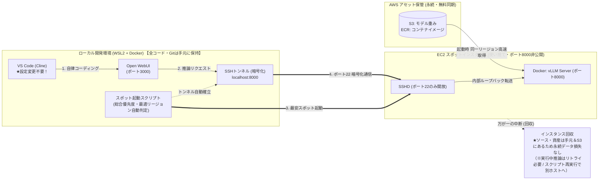

## はじめに

前回の記事（[自前vLLMをOpen WebUI経由でVS Code（Cline）に接続！トークンフリーで開発する](/blogs/2026/09/29/vllm_openwebui_cline/)）では、オープンソースのWeb UI・APIゲートウェイ「Open WebUI」を採用し、AWS上で動かす自前vLLMサーバーをVS Code拡張機能「Cline」のバックエンドとして直結させました。

前回の検証では「1台のGPUサーバー（`g6.xlarge`）をチーム3〜5人でシェアする」運用モデルを検討し、実用的なコストパフォーマンスが得られることを確認しました。しかし、チームでの開発が本格化するにつれて、以下のような課題や要望も出てきます：

* **リクエスト集中時の初速低下**: 複数人が同時にコード生成やテスト依頼を行うと、キュー待ちやストリーミング速度の低下が発生する。
* **専用環境へのニーズ**: 他のメンバーの利用状況を気にせず、常にGPUのフルパワーを活用して高速に試行錯誤したい。

とはいえ、オンデマンドインスタンス（約 $1.38/h ≒ 約228円/h ※1ドル=165円換算）をメンバー全員に1台ずつ割り当てると、インフラ費用が膨らんでしまいます。

そこで着目したのが、クラウドの余剰キャパシティを活用する **「EC2スポットインスタンス」** です。

また、実務的なコスト課題の解決に加えて、個人的にも **「AWS認定試験で頻出するスポットインスタンスを、実戦で一度ガッツリ使ってみたい！」** という強い動機がありました。  
AWS認定（SAAやSAPなど）の勉強をしていると、問題文や正解の解説で必ずと言っていいほど「ステートレスな処理や耐障害性のあるバッチ処理にはスポットインスタンスを活用して大幅なコスト削減を図る」という定番の設計パターンが登場します。「知識としては理解しているし試験でもおなじみだけど、実際に手元で中断ハンドリングまで組み込んで実戦投入した経験はまだなかったな……一度本気で使い倒してみたい！」というエンジニアとしての好奇心も後押しになりました。

スポットインスタンスを利用すれば、検証時点（2026年9月）の相場では通常料金から **約60%オフ（1時間あたり約80〜90円）** という大幅な割引が適用されます。この価格帯であれば、1台を常時複数人でシェアする代わりに「各自が必要な作業時間だけ専用GPUを起動して終わったら即破棄する」という短時間利用スタイルをとることで、1台のオンデマンドを終日維持するのと同等以下のコストで運用できます。

もちろん、スポットインスタンスには「AWS側の需要急増に応じて突然インスタンスが回収（中断）されるリスク」が伴います。しかし、本シリーズで構築してきた **「モデルはS3、コンテナはECRに保管し、サーバー・EBSは完全使い捨て（エフェメラル）」** というアーキテクチャであれば、ソースコードやGit履歴はローカル環境で管理しているため、スポット中断によって開発資産が失われるリスクは極めて低くなります。一方で、実行中の推論リクエストやサーバー側にのみ保持している一時データについては失われる可能性があるため、Gitコミットのこまめな実施やリトライを前提とした運用設計が必要です。

つまり、**エフェメラル設計とスポットインスタンスは、中断のデメリットを最小化しつつコストメリットを享受できる非常に相性の良い組み合わせ**と言えます。

本記事では、このエフェメラルなvLLM環境をスポットインスタンス上で安定稼働させるためのアプローチとして、**「価格・キャパシティ・中断耐性を加味したマルチリージョン総合優先度自動判定」** の仕組みを解説します。

:::info
**📚 過去シリーズの記事はこちら**  
いつの間にかシリーズ化？してますが、前提知識や過去の経緯が気になる方はぜひあわせてご覧ください：
* **基本構成（UserData×S3によるエフェメラル自動構築）を知りたい方**:  
  第1回：[AWS×UserDataでvLLMを自動起動！停止時コストほぼゼロのローカルLLM環境](/blogs/2026/09/16/vllm_autolaunch/)
* **Open WebUIおよびVS Code（Cline）の連携設定を知りたい方**:  
  第2回：[自前vLLMをOpen WebUI経由でVS Code（Cline）に接続！トークンフリーで開発する](/blogs/2026/09/29/vllm_openwebui_cline/)
:::

---

## スポットインスタンスのコスト削減効果と注意点

> **📌 このセクションの要点**  
> `g6.xlarge`（NVIDIA L4 24GB）をスポットインスタンスで利用することで、検証時点の相場ではオンデマンド比で約60%オフ（1時間あたり約80〜90円）に抑えられます。ただしスポット価格は需給や時間帯で常に変動するため「常にこの割引率が保証されるわけではない」点、そして「短時間集中利用が前提である」点に留意が必要です。

まずは、検証時点における東京リージョン（`ap-northeast-1`）の価格感を見てみましょう。

| インスタンスタイプ | GPUスペック | 世代 / 判定 | オンデマンド料金 (USD/h) | スポット割引率 (※検証時) | スポット料金目安 (USD/h) | 1時間あたりの日本円目安 (1$=165円) |
| :--- | :--- | :--- | :--- | :--- | :--- | :--- |
| **g6.xlarge (★本命・推奨)** | NVIDIA L4 (24GB VRAM) | **現行世代 (Current)** | 約 $1.38 /h | **約 60% OFF** | **約 $0.55 /h** | **約 91 円 /h** |
| **g5.xlarge (参考)** | NVIDIA A10G (24GB VRAM) | 旧世代 (Previous) | 約 $1.41 /h | 約 65% OFF | 約 $0.49 /h | 約 81 円 /h |
| **g4dn.xlarge (参考)** | NVIDIA T4 (16GB VRAM) | 旧々世代 (VRAM不足) | 約 $0.71 /h | 約 65% OFF | 約 $0.25 /h | 約 41 円 /h |

*※上記は執筆時点（2026年9月）の実測値です。スポット価格や割引率はAWS全体の需給バランス・時間帯・リージョンによってリアルタイムに変動します。為替レートは実質1ドル=165円（為替160円＋為替手数料等）で試算しています。*

:::info
**💡 インスタンスタイプの選定理由（本検証では g6.xlarge を推奨）**
* **g4dn (16GB)**: モデル本体（約15GB）だけでほぼ満杯になり、AIコーディングエージェント特有の長文コンテキスト（KVキャッシュ）を保持できずOOM（メモリ不足）になりやすい。
* **g5 (24GB) vs g6 (24GB)**: 本記事の検証用途では、Ada Lovelace世代で推論効率が高く定価も割安な `g6.xlarge` が最もバランスの良い選択でした。ただしリージョンごとの在庫状況やスポット価格によっては、旧世代の `g5` 系インスタンスの方が取得しやすくコスト効率が良いケースもあります。
:::

### 💡 気になる停止時の維持コスト（S3＆ECR保管で月数百円程度）

エフェメラル運用の要である「S3モデル保管」および「ECRコンテナ保管」の維持費も、実質ほぼ無視できるレベルです：
* **S3 Standard保管料（モデル重み）**: 15GB × $0.025 = **月額 約$0.38（約 62 円 / 月）**（※後述の3リージョン分散時でも月約176円）
* **ECR保管料（コンテナイメージ）**: 約10〜15GB × $0.10/GB = **月額 約$1.0〜$1.5（約 165〜248 円 / 月）**
* **データ転送料（S3 / ECR $\rightarrow$ EC2）**: 同一リージョン内通信は **完全無料（0 円）**
* **EBS保持との比較**: もし同じサイズのEBS（gp3）を常時保持し続けると高価なボリューム料金（月約1,600円）が毎月かかり続けますが、S3とECRへ退避してEC2・EBSを完全破棄することで、 **インスタンス停止時の維持コストを月数百円程度** に抑えられます。

### ⚠️ 「1人1台専有」が本当に安いかは稼働率（利用スタイル）次第

ここで重要な前提として、**「1人1台の専有環境が共有サーバより安くなるのは、各自が短時間利用（1〜2時間）に絞り、使い終わったら確実にTerminateする運用を徹底する場合に限られる」** という点があります。

| 運用モデル | 想定稼働スタイル | 月額コスト試算（5人チームの場合） | 向き・不向き |
| :--- | :--- | :--- | :--- |
| **A. 共有オンデマンド1台** | 平日日中（8h/日×20日）常時起動 | 約 $1.38 × 160h ≒ **約 $220/月（約 3.6万円）** | 常時誰かが使っており、起動の手間をゼロにしたいチーム |
| **B. スポット1人1台（短時間集中）** | 各自が1日2時間だけ起動（2h×5人×20日） | 約 $0.55 × 200h ≒ **約 $110/月（約 1.8万円）** | 個人開発や、集中してガッツリ検証するスタイルに最適 |
| **C. スポット1人1台（終日放置）** | 5人が終日（8h/日）起動しっぱなし | 約 $0.55 × 800h ≒ **約 $440/月（約 7.3万円）** | **❌ コスト逆転！** 共有1台より大幅に割高になってしまう |

「スポットだから安い」と油断して起動放置したり、チーム全員が終日常時稼働させるようなケースでは、アイドル自動終了デーモンを組み込んでいたとしても、**共有オンデマンド1台（またはReserved Instances/Savings Plansを適用したインスタンス）をシェアする方が総コストも運用負荷も低くなる** 可能性があります。

したがって本記事で紹介する「1人1台スポット運用」は、**「必要な時に手元からコマンド1発で立ち上げ、作業が終われば即座に破棄するエフェメラルなワークフロー」を実践できる個人やチームに最も適したアプローチ** と言えます。

---

## スポット運用の課題と現実的な向き合い方

> **📌 このセクションの要点**  
> スポット運用の2大課題である「突然の中断」と「在庫切れ・価格変動」に対し、エフェメラル設計（永続データ損失の極小化）とマルチリージョン自動探索によって、実用に耐えうる安定性を確保します。

スポットインスタンスを実戦投入するにあたり、避けて通れない2つの課題を今回の構成がいかにスマートに解決しているかを解説します。



### 課題1: 突然の中断（強制終了）リスク
スポットインスタンス最大の懸念は「AWSの都合で突然回収されること」です。
通常のステートフルな開発サーバーやDBサーバーであれば、中断時にデータが破損したり、再構築に何時間もかかったりするため、スポット化には慎重な設計が求められます。

しかし、今回のアーキテクチャでは以下の通り **中断による致命的な損害を最小限に抑えることができます**：

1. **開発資産の損失リスクが極めて低い**:
   ソースコードやGit履歴はローカル環境で管理しているため、スポット中断によって開発資産が失われるリスクは極めて低くなります。一方で、実行中の推論リクエストやサーバー側にのみ保持している一時データについては失われる可能性があるため、Gitコミットのこまめな実施やリトライを前提とした運用設計が必要です。
2. **スクリプト再実行で即座に再起動できる**:
   もし作業中に運悪くスポットが中断されても、後述の起動スクリプトをもう1回叩くだけです。数分後には新しいスポットインスタンスが立ち上がり、Open WebUIの接続先IPも自動更新され、手元作業を再開できます。

### 課題2: スポットの在庫切れとリージョン間の価格差
スポットインスタンスは余剰キャパシティを借りる仕組みであるため、時間帯やAZ（アベイラビリティゾーン）によって特定のインスタンスタイプが一時的に「在庫切れ」になったり、リージョンごとに価格が変動したりします。

👉 **解決策: マルチリージョン・総合優先度スポット自動探索**
東京リージョン（`ap-northeast-1`）だけに固定せず、オレゴン（`us-west-2`）やバージニア（`us-east-1`）など複数の候補リージョンの直近スポット価格を `aws ec2 describe-spot-price-history` でリアルタイムに取得・比較し、**「その瞬間に一番安く、かつ在庫があるリージョン・インスタンスタイプ」を自動判定して起動**するようにスクリプトを強化しました！

#### 💡 時差を考慮したリージョン探索の考え方

スポット価格や調達性は、リージョンごとの需給状況やAWS内部の余剰キャパシティに大きく依存します。

一般論としては現地の業務時間帯より夜間帯の方が空きキャパシティが増える傾向がありますが、GPUインスタンスについては生成AI需要や大規模学習ワークロードの影響も大きく、必ずしも「現地深夜＝最安・最安定」とは限りません。

そのため本記事では、時差を参考情報として活用しつつ、実際には起動時点のスポット価格や利用可能AZ数などの実測データを基にリージョンを選択しています。

| 日本時間 (JST) / シーン | 傾向として検討しやすいリージョン (現地時間) | 特徴・調達の目安 |
| :--- | :--- | :--- |
| <nobr>**日中帯 (10:00 〜 18:00)**</nobr><br>業務中の開発・PoC検証 | ・**米国東部** <nobr>(`us-east-1` / 現地 21:00〜05:00)</nobr><br>・**米国西部** <nobr>(`us-west-2` / 現地 18:00〜02:00)</nobr> | 米国本土が夜間〜早朝帯となり、世界最大級のデータセンター群に比較的キャパシティ余剰が生じやすい時間帯です。スポット価格も落ち着きやすい傾向にあります。 |
| <nobr>**夜間帯 (19:00 〜 24:00)**</nobr><br>退勤後の個人開発・夜間検証 | ・**東京** <nobr>(`ap-northeast-1` / 現地 19:00〜24:00)</nobr><br>・**大阪** <nobr>(`ap-northeast-3` / 現地 19:00〜24:00)</nobr><br>・**シドニー** <nobr>(`ap-southeast-2` / 現地 20:00〜01:00)</nobr> | 国内企業のオフィスアワー終了に伴い、オンデマンド需要が落ち着いて国内スポットが調達しやすくなります。時差の少ないオーストラリアも夜間帯に入ります。 |
| <nobr>**深夜〜早朝 (01:00 〜 08:00)**</nobr><br>深夜作業・早朝開発 | ・**東京** <nobr>(`ap-northeast-1` / 現地 01:00〜08:00)</nobr><br>・**欧州 アイルランド** <nobr>(`eu-west-1` / 現地 17:00〜24:00)</nobr><br>・**欧州 フランクフルト** <nobr>(`eu-central-1` / 現地 18:00〜01:00)</nobr> | 東京リージョンが未明となり国内スポットの空きが期待できます。また欧州が夕方〜夜間へ向かうため、欧州リージョンも選択肢に入ります。 |

#### 💡 コラム：AWS本来のスポット運用思想と「エフェメラル1台」の位置づけ

AWS公式が推奨する本来のスポットインスタンス運用は、**「EC2 Auto Scaling」や「EC2 Spot Fleet」を用い、バッチ処理・分散機械学習・CI/CDワーカーなどの並列ワークロードに適用すること** です。

AWSのベストプラクティスでは、複数のインスタンスタイプ（例: `g6.xlarge`, `g5.xlarge` 等）や複数AZをプールに登録し、アロケーション戦略として **`price-capacity-optimized`（価格・キャパシティ最適化）** を指定します。これにより、AWS内部のリアルタイム余剰キャパシティと価格が自動判定され、**「最も中断リスクが低く、かつ最安なプール」から自動調達** されます。

一方、今回のユースケースは「開発者が手元からワンコマンドで自分専用のGPUを1台だけ立ち上げ、VS Codeから直結して対話的に作業する」というエフェメラルな開発環境です。Auto Scalingやフリートを組むほどではない単一インスタンスだからこそ、**「手元にコードがあるため中断されても致命傷にならない」というエフェメラル設計** を前提に、スクリプト側で最適なリージョンを自前判定しています。

#### 💡 発展Tips：独自スコアリング（価格40点＋余剰AZ40点＋中断耐性20点）の設計根拠

:::alert
**⚠️ 注意：本スコアリングの位置づけ**  
本記事のスコアリングロジック（価格40点＋AZ数40点＋安定性20点）は、AWS公式が提供する評価指標ではなく、筆者が個人利用向けのvLLMスポット環境を効率的に運用するために考案した独自基準です。  
実際の本番システムや商用ワークロードでは、EC2 Auto Scaling や EC2 Fleet の `price-capacity-optimized` 戦略など、AWS公式のスポットベストプラクティスを優先してください。
:::

基本スクリプトでは「直近のスポット価格」を基準に最安リージョンを選定していますが、単純な価格比較だけでは **「価格は安いが、現地の日中ピークで在庫が逼迫し中断率が上がっているプール」** を誤って選んでしまう可能性があります。

そこで、AWSが公開している **「Spot Instance Advisor（過去30日の中断率データ）」** と **「稼働可能AZ数（キャパシティ余剰度）」** を組み合わせ、**「価格競争力（40点）＋余剰AZ数（40点）＋中断耐性（20点）＝100点満点」** のハイブリッド優先度スコアリングを導入しました。

##### なぜこの比率（40 : 40 : 20）なのか？
この配分は普遍的な正解ではなく、**「開発者が今すぐ1台立ち上げて作業を開始したい」という本ユースケースの特性に最適化した独自の評価関数** です：

1. **余剰AZ数（40点）を重視する理由**:
   GPU系インスタンスは需要変動の影響を受けやすく、主要拠点では中断率が高くなるケースもあります。ただし中断率はリージョン・時期・インスタンスタイプによって大きく変動するため、本記事で示す数値は検証時点で取得した参考値であり、将来にわたって保証されるものではありません。
   また、いくら価格が安くても提供AZが限られるリージョンでは「そもそも在庫が枯渇して起動すらできない（`InsufficientInstanceCapacity`）」という事態が生じます。そのため、「確実に起動でき、中断時も別AZで速やかに拾い直せるキャパシティの厚み」を価格と同等の最重要指標（40点）に配分しました。
2. **中断耐性（20点）を抑えめにしている理由**:
   各自が短時間（1〜2時間）集中して作業し即座に破棄するエフェメラル運用であれば、作業中にピンポイントで回収に当たる確率は元々それほど高くありません。また万が一当たっても手元から再起動できるため、中断率のペナルティは20点にとどめています。
   *(※もし「数日間にわたるバッチ学習を極力止めずに回したい」といった別目的であれば、中断耐性の比重を50点以上に引き上げるなど、ワークロードに応じたカスタマイズが適切です)*

以下は、執筆時点（2026年9月30日 09:03 JST）のメトリクスを取得して本評価関数でスコアリングしたリアルタイムレポートです：

```text
==========================================================================================
 AWS EC2 スポット総合優先度 判定レポート (g6.xlarge)
 調査時刻: 2026-09-30 09:03 (JST) / 為替換算レート: 1 USD = 165 円
==========================================================================================
リージョンID      リージョン名    最安スポット価格       提供AZ数   中断率     総合スコア  優先度判定
------------------------------------------------------------------------------------------
eu-central-1     フランクフルト  $0.454/h (約 75 円)    3 ゾーン   < 5%       82 点       🥇 [Rank S] 最優先
us-west-2        オレゴン        $0.426/h (約 70 円)    4 ゾーン   > 20%      72 点       🥈 [Rank A] 推奨・安値
us-east-1        バージニア      $0.555/h (約 92 円)    5 ゾーン   > 20%      71 点       🥉 [Rank A] 予備・高可用
ap-northeast-1   東京            $0.568/h (約 94 円)    2 ゾーン   > 20%      46 点       ⚠️ [Rank C] 国内要件時
------------------------------------------------------------------------------------------
```

##### 📊 この判定結果の読み解き方（特定時点のスナップショット）
* **検証時点におけるフランクフルト（82点）の評価**:  
  検証時点では、フランクフルトリージョンが価格・利用可能AZ数・運用実績を総合的に評価した際に最も高いスコアとなりました。ただし、スポット市場の状況は随時変化するため、常にフランクフルトが最適であるとは限りません。
* **オレゴン（72点）とバージニア（71点）の堅実さ**:  
  オレゴンは4 AZの在庫の厚みと格安さ（約70円/h）が評価され、バージニアは5 AZという圧倒的な巨大データセンターの冗長性が評価されています。「仮に1つのAZで在庫が逼迫しても、別のAZで拾い直せる」というキャパシティの安心感が反映されています。
* **東京（46点）のキャパシティ状況**:  
  今回の評価では、調査時点で `g6.xlarge` を取得可能だったAZ数が他リージョンより少なかった（2ゾーン）ため、キャパシティスコアで差がつきました。今回の評価は調査時点で利用可能だったAZ数を基準にスコアリングしているため、時期や需給状況によっては結果が変わる可能性があります。

:::alert
**🚨 コンプライアンス・データレジデンシー（機密情報の国内保持規定）に関する重要な注意点**

マルチリージョン運用はコスト面・可用性面で非常に強力ですが、 **企業のセキュリティポリシーや社内規定（データレジデンシー / データ主権要件）** には十分ご注意ください。

多くの企業やプロジェクトでは、情報セキュリティ規定やプライバシーポリシー等において、 **「ソースコードや顧客データ等の機密情報は、日本国内（東京・大阪リージョン等）のインフラでのみ処理・保管し、海外へ送信・越境移転してはならない」** と厳格に定められているケースが多々あります。

海外リージョン（バージニア `us-east-1` やオレゴン `us-west-2` など）のインスタンスをClineのバックエンドとして接続した場合、 **手元で読み込ませたソースコードやプロンプトが海外リージョンのサーバーへ送信され、国外で推論処理される** ことになります。そのため、機密情報を扱う業務環境では社内規定に抵触する重大なリスクがあります。

#### 業務で利用する場合の推奨設定
機密コードや業務データを扱う環境では、**探索対象リージョンを国内（東京 `ap-northeast-1` / 大阪 `ap-northeast-3`）のみに限定**して運用してください。  
後述の起動スクリプトでも、以下のように候補リージョンを国内のみに絞ることで、社内規定を完全に遵守した安全なスポット運用が可能です：

```bash
# 社内規定でデータ国外転送が禁止されている場合は国内リージョンに限定
CANDIDATE_REGIONS=("ap-northeast-1" "ap-northeast-3")
```
:::

:::check
**💡 インフラ裏話：S3＆ECRは各リージョンに置くべき？「リージョン間データ転送料（$0.09/GB）」トラップの回避術**

マルチリージョンでスポットインスタンスを運用する際、クラウドアーキテクトとして必ず計算しておかなければならないのが **「ストレージ（S3）・コンテナレジストリ（ECR）の配置場所とデータ転送料金」** です。

「S3バケットや自前のプライベートECRは東京リージョンに1個だけ置いて、海外のEC2からもそこから落とせば月額保管料は最安なのでは？」と考えがちですが、ここには **大きな落とし穴（転送料トラップ）** が存在します。

vLLMの推論環境を動かすには、 **「モデル重みデータ（約15GB）」** に加えて、CUDAやPyTorchを含む **「vLLMのDockerコンテナイメージ（約10〜15GB）」** の2つが必要です。合計すると1回の起動で **約25〜30GB** もの大容量データをダウンロードすることになります。

| 運用方式 | 月額保管料の目安 | 起動ごとの転送料 (合計約25〜30GB) | 起動までの所要時間 | 総合評価 |
| :--- | :--- | :--- | :--- | :--- |
| **パターンA: 東京に集約**<br>（S3/ECRともに東京のみ） | **最安**<br>(東京のみ保管) | 東京EC2: **0 円**<br>海外EC2: <span style="color:red; font-weight:bold;">約 370 〜 450 円 / 起動ごと</span><br>*(クロスリージョン $0.09/GB)* | 5〜10分<br>*(太平洋横断で重い)* | ❌ 海外で起動するたびに数百円の通信費が発生し、スポットの安さ（1時間80円）が完全に吹き飛ぶ。 |
| **パターンB: 各リージョンに分散配置**<br>（★推奨・ベストプラクティス） | **月額 数百円程度**<br>*(S3月約176円 ＋ ECR保管料)* | どのリージョンで起動しても<br>**完全無料（0 円）！** | **1〜2分**<br>*(同一リージョン内高速通信)* | **◎ 強く推奨！** 何回起動しても転送料無料＆最速起動。実務での鉄則。 |

*※為替レートは実質1ドル=165円（為替160円＋為替手数料等）で試算しています。*

#### 転送トラップを完全回避する2つの処方箋
1. **S3バケットのマルチリージョン配置**:  
   候補となる各リージョン（東京・オレゴン・バージニア、または国内なら東京・大阪）それぞれにバケットを作成してモデルを事前同期しておきます（3拠点合わせてもS3保管料は月額約176円）。
2. **ECRのクロスリージョンレプリケーション**:  
   自社環境でプライベートECRを使用する場合は、ECR標準の「レプリケーション設定」を有効にしておきます。東京リポジトリにpushするだけで対象リージョンへ自動同期され、海外のEC2も**同一リージョン内のECRから完全無料かつ高速**でDockerイメージをpullできます（※Docker Hub等のパブリックレジストリを利用する場合でも、レートリミット回避と起動高速化のためにECRレプリケーション構成が強く推奨されます）。

これらを徹底することで、どのリージョンでスポットが起動しても、通信コストゼロ＆最速のコールドスタートを実現できます！
:::

---

### 💡 検証：海外リージョン経由のレイテンシ（RTT）とAIコーディング体感への影響

スポット運用の議論では「価格」や「キャパシティ」ばかりに目が行きがちですが、クライアント（日本国内）から遠隔地へアクセスする以上、**「物理的なネットワーク遅延（RTT: Round Trip Time）」** の影響を無視することはできません。

実際に日本国内のネットワークから各リージョンのエンドポイントへ通信した際の平均RTTと、VS Code（Cline）での体感速度を比較検証しました：

| リージョン | 物理的な距離 | 平均RTT（往復遅延） | コード補完・ストリーミング出力の体感 | Tool Calling（自律往復ループ）の体感 |
| :--- | :--- | :--- | :--- | :--- |
| **東京 (`ap-northeast-1`)** | 国内 | **約 5 〜 15 ms** | 極めて快適。入力に対するレスポンスが俊敏。 | 最速。ファイル読み書きやコマンド実行が滑らか。 |
| **オレゴン (`us-west-2`)** | 太平洋横断（米西海岸） | **約 100 〜 120 ms** | 良好。ストリーミング開始にわずかな間がある程度。 | 実用上ほぼ問題なし。十分キビキビ動作する。 |
| **バージニア (`us-east-1`)** | 米東海岸 | **約 160 〜 190 ms** | 許容範囲。文字が出始めれば流れるように表示。 | ややモタつきを感じるが、作業進行に支障はない。 |
| **フランクフルト (`eu-central-1`)** | ユーラシア大陸横断（欧州） | **約 240 〜 270 ms** | 生成開始（初速）に約0.5秒程度の明確な「タメ」が発生。 | ツール呼び出しが十数回連続すると、蓄積遅延を実感。 |

#### 📊 レイテンシから導き出される実践的な使い分け
1. **ストリーミング生成への影響は軽微**:  
   LLMのテキスト生成は1トークンずつ順次送られてくるため、一度パイプラインが開けば、トークン間の生成間隔（GPU推論速度そのもの）に隠れてRTTの影響はそこまで気になりません。
2. **TTFT（最初の1文字が出るまでの時間）と自律ループでは差が出る**:  
   「プロンプト送信 $\rightarrow$ 推論開始」の初速（TTFT: Time To First Token）、およびClineが「ファイル読み出し $\rightarrow$ 編集提案 $\rightarrow$ コマンド実行」を数十回連続で繰り返す自律コーディングセッションでは、通信往復の回数分だけレイテンシが乗算されます。
3. **結論**:  
   **「キビキビとした軽快なレスポンスで集中してコードを書きたい場面」では、多少価格が高くても東京やオレゴン（米西海岸）を優先するのが快適** です。一方、フランクフルトなどの長距離リージョンは、「夜間や休日に重めのタスクを投げ込んでおく」「とにかく最安値・確実な在庫調達を最優先したい」といった割り切ったシーンで真価を発揮します。

---

### 💡 冷静な考察：月数千円のためにマルチリージョン運用を組むべきか？

本記事では「時差をハックして世界中から最安GPUを自動調達する」というロマンあふれる構成を構築しましたが、運用アーキテクトの視点から冷静に考えると、**「マルチリージョン運用の複雑さ（認知負荷）と、得られるコスト削減のバランス」** には議論の余地があります。

マルチリージョンを維持するためには、以下のような運用オーバーヘッドが不可避です：
* **アセット同期の管理**: S3モデルデータの定期同期や、ECRクロスリージョンレプリケーションの監視。
* **アカウントクォータの管理**: 各リージョンごとに個別のService Quotas（GPUスポット割り当て制限）の上限緩和申請が必要。
* **インフラドリフトと障害調査**: リージョン固有のAMI更新停止、特定リージョンの一時的なネットワーク障害や権限エラーの切り分け。

もし「チーム業務で月数千円〜数万円程度の差額」を削減するためにエンジニアがマルチリージョン管理に追われるのであれば、**人件費や運用保守の観点からは本末転倒** と言わざるを得ません。

| 開発シーン | 推奨されるアプローチ | 理由 |
| :--- | :--- | :--- |
| **個人開発・技術検証・ハッカソン** | **マルチリージョン・スポット自動判定** (本構成) | コストを限界まで削りつつ、クラウド設計・時差ハック・エフェメラル構築の知見をフルに吸収できる。何より作っていて最高に面白い。 |
| **小規模チーム（短時間利用メイン）** | **国内リージョン限定スポット** (`ap-northeast-1` / `3`) | データレジデンシー規定を満たし、レイテンシも最小。アセット同期も国内1〜2拠点でシンプルに完結する。 |
| **本格的な業務・定常稼働チーム** | **国内オンデマンド ＋ Savings Plans** (共有1台) | 起動待ち時間ゼロ・中断リスクゼロ・運用保守コスト最小。エンジニアの時間をインフラ管理ではなく本業の開発に集中させられる。 |

「何でもかんでもマルチリージョンにすれば良い」というわけではなく、**得られるコストメリットと運用保守コスト（人件費・保守性）を天秤にかけ、チームのフェーズに合った現実的な選択肢を採る** ことが重要です。

---

:::alert
**⚠️ 事前準備：スポットインスタンス用のクォータ制限解除（Service Quotas）に注意！**

第1弾でオンデマンド用のクォータ（`Running On-Demand G and VT instances`）を申請しましたが、**スポットインスタンスのクォータは別枠（`All G and VT Spot Instance Requests`）** で管理されています！

また、申請にあたっては以下の3点に留意してください：

1. **リージョンごとに申請が必須**:
   今回のスクリプトのように **マルチリージョン（東京・オレゴン・バージニア等）で最安スポットを自動探索・起動する場合、それぞれの対象リージョンごとにクォータが完全に独立している** ため、候補リージョンすべてで個別に上限緩和申請を出す必要があります。
2. **利用実績がない場合は「4」の割り当て**:
   アカウントにGPUインスタンスの稼働実績がない場合、申請時に8や16を希望しても、まずは **「4」のみが承認・割り当てられる** ケースがほとんどです（`g6.xlarge` は1台4 vCPUなので、まずは4あれば1台稼働可能です）。
3. **解除通知までの所要時間**:
   公式の案内では数日かかる場合があるとされていますが、**筆者の実際の検証環境では、申請提出からおよそ3〜4時間ほどで解除通知のメールが届きました**。スポット運用を試す際は、事前に各リージョンへ申請を済ませておきましょう。
:::

:::check
**💡 組織・チームで「1人1台」を展開する場合のクォータ設計（マルチリージョン＆マルチアカウント）**

「チームの各メンバーに1台ずつ専用GPUを配りたい」と考えた場合、スポットインスタンスの初期クォータ（通常0 vCPU、初回申請時は4 vCPU＝1台分程度）がボトルネックになりやすい点に注意が必要です。同一AWSアカウント内で複数人が同時に起動しようとすると、2人目以降が `MaxSpotInstanceCountExceeded` でエラーになります。

組織でスムーズに「1人1台」を実現するには、以下の工夫を組み合わせるのが実務上のベストプラクティスです：

* **マルチリージョン展開によるクォータ枠の並列利用**:  
  Service Quotasは**リージョンごとに独立**して管理されています。東京・オレゴン・バージニアなど複数リージョンでそれぞれ4〜8 vCPUずつ緩和しておけば、メンバーAは東京、メンバーBはオレゴン……というように、単一アカウントでも別リージョンを活用してクォータ枠を分散・並列稼働させることができます。
* **マルチアカウント運用（AWS Organizations / 開発者別Sandbox）**:  
  最も推奨されるのが、1つの共有アカウントに全員が同居するのではなく、AWS Organizations等を利用して開発者（またはチーム）ごとに個別のAWSアカウント（Sandboxアカウント）を払い出す運用です。クォータ制限・課金追跡・終了漏れリスクがアカウント単位で完全に分離されるため、ガバナンスと自由度の両立が容易になります。
* **エフェメラル運用による同時稼働枠の効率利用**:  
  全員が常時インスタンスを起動し続けるのではなく、本構成のように「集中検証やClineでの作業時のみ立ち上げ、終わったら即Terminate」するエフェメラル運用を徹底することで、同時起動数を抑え、限られたクォータ枠でもチーム内で無駄なく使い回すことができます。
:::

:::info
**📋 スポット運用前のチェックリスト（前提条件）**
- **Service Quotas（スポット枠解除）**: 対象候補リージョンすべてで `All G and VT Spot Instance Requests` の上限緩和申請（4 vCPU以上）が承認されていること
- **ローカル環境**: Windows (WSL2) + Docker（Open WebUI稼働中）が準備済みであること
- **EC2キーペア**: `~/.ssh/` 配下に秘密鍵（`.pem`）が存在すること
- **IAMロール**: S3およびECRアクセス権限を持つIAMロール（例: `EC2-S3-FullAccess-Profile`）が作成済みであること
- **AWS CLI**: 対象リージョンへのアクセス権限を持つプロファイルで認証が完了していること
- **データレジデンシー確認**: 業務利用時は、社内セキュリティ規定に応じて候補リージョンを国内限定にするか確認していること
:::

### 事前準備: マルチリージョン・アセットの一括反映（キーペア・S3・ECR・SG）

> **📌 このステップでやること**  
> どのリージョンが最安に選ばれても即座に高速起動できるよう、キーペア・専用SG・モデル重み（S3）・コンテナイメージ（ECR）を候補リージョンへ一括反映します。

マルチリージョンでスポットを運用するには、以下の4つのリソースを各候補リージョンにあらかじめ用意しておく必要があります：

1. **EC2キーペア**: キーペアはリージョンごとに独立しているため、ローカルの公開鍵を各リージョンにインポートしておく必要があります。
2. **SSH専用セキュリティグループ（`vllm-ssh-tunnel-sg`）**: 起動時にSGが未指定だったり存在しないと、AWSの仕様で外部通信を遮断する「defaultセキュリティグループ」が自動選択されてしまい、SSHトンネルが繋がらなくなります。これを防ぐため、ポート22のみ許可する専用SGを事前に各リージョンのVPCに作成しておきます。
3. **S3バケットとモデル重み**: 高速起動とデータ転送料（$0.09/GB）を回避するため、各リージョンにバケットを作成して東京からモデルファイル群を同期します。
4. **ECRリポジトリとコンテナイメージ**: 各リージョンに `vllm-openai` リポジトリを作成し、ECRクロスリージョンレプリケーションでDockerイメージを同期します。

これらをコマンド一発で全自動反映するセットアップスクリプト（`setup_multiregion_assets.sh`）です：

<details><summary>setup_multiregion_assets.sh（クリックで展開）</summary>

```bash
#!/bin/bash
set -euo pipefail

# ==============================================================================
# setup_multiregion_assets.sh
# マルチリージョンスポット運用に必要なAWSアセットを一括反映・同期するスクリプト
# ==============================================================================

# 候補リージョン一覧 (デフォルト: 東京, オレゴン, バージニア)
# ※社内規定でデータ国外転送が禁止されている場合は国内限定に設定:
#   CANDIDATE_REGIONS=("ap-northeast-1" "ap-northeast-3")
CANDIDATE_REGIONS=("ap-northeast-1" "us-west-2" "us-east-1")
SRC_REGION="ap-northeast-1"

KEY_NAME="${KEY_NAME:-my-vllm-models-hackathon-2026}"
KEY_PATH="${KEY_PATH:-${HOME}/.ssh/${KEY_NAME}.pem}"
SG_NAME="vllm-ssh-tunnel-sg"
ECR_REPO_NAME="vllm-openai"
MODEL_PREFIX="models/Qwen/Qwen2.5-Coder-7B-Instruct"

echo "=== マルチリージョン・アセット一括同期セットアップ ==="
AWS_ACCOUNT_ID=$(aws sts get-caller-identity --query Account --output text)

# 1. EC2 キーペアの反映
TMP_PUBKEY=$(mktemp)
trap 'rm -f "${TMP_PUBKEY}"' EXIT
ssh-keygen -y -f "${KEY_PATH}" > "${TMP_PUBKEY}"

for REGION in "${CANDIDATE_REGIONS[@]}"; do
    if ! aws ec2 describe-key-pairs --region "${REGION}" --key-names "${KEY_NAME}" >/dev/null 2>&1; then
        echo "[${REGION}] キーペア '${KEY_NAME}' をインポート中..."
        aws ec2 import-key-pair \
            --region "${REGION}" \
            --key-name "${KEY_NAME}" \
            --public-key-material "fileb://${TMP_PUBKEY}"
    fi
done

# 2. SSH専用セキュリティグループの事前作成 (デフォルトSG誤適用の防止)
for REGION in "${CANDIDATE_REGIONS[@]}"; do
    SG_ID=$(aws ec2 describe-security-groups \
        --region "${REGION}" \
        --filters "Name=group-name,Values=${SG_NAME}" \
        --query 'SecurityGroups[0].GroupId' --output text 2>/dev/null || true)
    
    if [ -z "${SG_ID}" ] || [ "${SG_ID}" = "None" ]; then
        DEFAULT_VPC=$(aws ec2 describe-vpcs --region "${REGION}" --filters "Name=isDefault,Values=true" --query 'Vpcs[0].VpcId' --output text)
        SG_ID=$(aws ec2 create-security-group \
            --region "${REGION}" \
            --group-name "${SG_NAME}" \
            --description "Allow SSH port 22 only for vLLM tunnel" \
            --vpc-id "${DEFAULT_VPC}" \
            --query 'GroupId' --output text)
        aws ec2 authorize-security-group-ingress \
            --region "${REGION}" --group-id "${SG_ID}" \
            --protocol tcp --port 22 --cidr "0.0.0.0/0"
        echo "[${REGION}] 作成完了: ${SG_ID} (ポート22のみ許可)"
    fi
done

# 3. S3 バケット作成 & モデルデータの同期
SRC_BUCKET="my-vllm-models-hackathon-2026-${AWS_ACCOUNT_ID}-${SRC_REGION}-an"

for REGION in "${CANDIDATE_REGIONS[@]}"; do
    DEST_BUCKET="my-vllm-models-hackathon-2026-${AWS_ACCOUNT_ID}-${REGION}-an"
    if ! aws s3 ls "s3://${DEST_BUCKET}" >/dev/null 2>&1; then
        echo "[${REGION}] S3バケット '${DEST_BUCKET}' を作成中..."
        aws s3 mb "s3://${DEST_BUCKET}" --region "${REGION}"
    fi

    if [ "${REGION}" != "${SRC_REGION}" ]; then
        echo "[${REGION}] モデル重みデータの同期中 (s3://${SRC_BUCKET} -> s3://${DEST_BUCKET})..."
        aws s3 sync "s3://${SRC_BUCKET}/${MODEL_PREFIX}/" "s3://${DEST_BUCKET}/${MODEL_PREFIX}/" --no-progress
    fi
done

# 4. ECR リポジトリ作成 & クロスリージョン自動レプリケーション設定
for REGION in "${CANDIDATE_REGIONS[@]}"; do
    if ! aws ecr describe-repositories --region "${REGION}" --repository-names "${ECR_REPO_NAME}" >/dev/null 2>&1; then
        aws ecr create-repository --region "${REGION}" --repository-name "${ECR_REPO_NAME}" \
            --image-scanning-configuration scanOnPush=true --image-tag-mutability MUTABLE >/dev/null
    fi
done

# ECR レプリケーション設定とトリガー
REPL_DESTS=()
for REGION in "${CANDIDATE_REGIONS[@]}"; do
    if [ "${REGION}" != "${SRC_REGION}" ]; then
        REPL_DESTS+=("{\"region\":\"${REGION}\",\"registryId\":\"${AWS_ACCOUNT_ID}\"}")
    fi
done
REPL_DESTS_JSON=$(IFS=,; echo "${REPL_DESTS[*]}")
aws ecr put-replication-configuration --region "${SRC_REGION}" \
    --replication-configuration "{\"rules\":[{\"destinations\":[${REPL_DESTS_JSON}]}]}" >/dev/null 2>&1 || true

MANIFEST=$(aws ecr batch-get-image --region "${SRC_REGION}" --repository-name "${ECR_REPO_NAME}" --image-ids imageTag=latest --query 'images[0].imageManifest' --output text 2>/dev/null || echo "")
if [ -n "${MANIFEST}" ] && [ "${MANIFEST}" != "None" ]; then
    TMP_MANIFEST=$(mktemp)
    echo "${MANIFEST}" > "${TMP_MANIFEST}"
    aws ecr put-image --region "${SRC_REGION}" --repository-name "${ECR_REPO_NAME}" --image-tag "latest" --image-manifest "file://${TMP_MANIFEST}" >/dev/null 2>&1 || true
    rm -f "${TMP_MANIFEST}"
fi
echo "マルチリージョン・アセット反映が完了しました！"
```

</details>

このスクリプトを初回に1回実行しておくだけで、どのリージョンが最安に選ばれても即座に同一リージョン内のリソースを使って最速・安全に起動できるようになります。

:::info
**💡 事前に各リージョンの相場や中断頻度をチェックしたいときは？（`check_spot_prices.sh`）**  
起動前に各リージョンのリアルタイムスポット価格だけでなく、AWS Spot Advisor の実績中断頻度や余剰AZ数を加味した「総合選択優先度（スコア/ランク）」を一括調査できるスクリプトです。日本時間の日中に安価かつ安定稼働しやすい欧州（フランクフルト）も候補に含まれます：

```text
$ ./check_spot_prices.sh
========================================================================================================================
 AWS EC2 スポットインスタンス料金・優先度 リアルタイム比較
 調査時刻: 2026-09-30 09:03:57 (JST) / 為替換算レート: 1 USD = 165 円
========================================================================================================================

■ インスタンスタイプ: g6.xlarge
リージョンID    リージョン名                最安スポット  オンデマンド  割引率    日本円/h    中断頻度      余剰AZ  スコア/ランク   総合判定
------------------------------------------------------------------------------------------------------------------------
ap-northeast-1  東京 (Tokyo)                $0.5675       $1.3760       59% OFF   約 94 円    > 20% (高)    2 AZ    46点 (Rank C)   国内要件時推奨
us-west-2       オレゴン (Oregon)           $0.4264       $0.9776       56% OFF   約 70 円    > 20% (高)    4 AZ    72点 (Rank A)   最安値 (中断に注意)
us-east-1       バージニア (N. Virginia)    $0.5552       $0.9776       43% OFF   約 92 円    > 20% (高)    5 AZ    71点 (Rank A)   予備候補
eu-central-1    フランクフルト (Frankfurt)  $0.4536       $1.0850       58% OFF   約 75 円    < 5% (極低)   3 AZ    82点 (Rank S)   ★ 総合第1位 推奨!
------------------------------------------------------------------------------------------------------------------------
 🏆 現在の総合推奨: [eu-central-1 (フランクフルト (Frankfurt))] 82点 (Rank S) - $0.4536/h (約 75 円/h) @ AZ: eu-central-1a
    ※ 最安値は us-west-2 ($0.4264/h: 約 70 円/h) ですが、中断頻度 (< 5% (極低)) と余剰キャパシティ (3 AZ) を加味すると eu-central-1 が最も安定的です。
```

<details><summary>check_spot_prices.sh（クリックで展開）</summary>

```bash
#!/bin/bash
set -euo pipefail

# ==============================================================================
# check_spot_prices.sh
# AWS EC2 スポットインスタンス料金・中断頻度・選択優先度 リアルタイム比較スクリプト
#
# 使い方:
#   ./check_spot_prices.sh                 # デフォルト (g6.xlarge, 主要候補リージョン)
#   ./check_spot_prices.sh --detail        # AZ別内訳も詳細表示
#   ./check_spot_prices.sh --all           # 世界主要8リージョン走査
#   ./check_spot_prices.sh g5.xlarge       # インスタンスタイプ指定
# ==============================================================================

USD_JPY_RATE="${USD_JPY_RATE:-165}"
SHOW_DETAIL=false
ALL_REGIONS=false
CUSTOM_TYPES=()

for arg in "$@"; do
    case "${arg}" in
        --detail|-d) SHOW_DETAIL=true ;;
        --all|-a)    ALL_REGIONS=true ;;
        --help|-h)
            echo "使い方: $0 [オプション] [インスタンスタイプ...]"
            exit 0
            ;;
        *) CUSTOM_TYPES+=("${arg}") ;;
    esac
done

if [ ${#CUSTOM_TYPES[@]} -gt 0 ]; then
    INSTANCE_TYPES=("${CUSTOM_TYPES[@]}")
else
    INSTANCE_TYPES=("g6.xlarge")
fi

if [ "${ALL_REGIONS}" = true ]; then
    REGIONS=("ap-northeast-1" "ap-northeast-3" "us-west-2" "us-east-1" "us-east-2" "eu-west-1" "eu-central-1" "ap-southeast-2")
else
    REGIONS=("ap-northeast-1" "us-west-2" "us-east-1" "eu-central-1")
fi

get_region_label() {
    case "$1" in
        "ap-northeast-1") echo "東京 (Tokyo)" ;;
        "ap-northeast-3") echo "大阪 (Osaka)" ;;
        "us-west-2")      echo "オレゴン (Oregon)" ;;
        "us-east-1")      echo "バージニア (N. Virginia)" ;;
        "us-east-2")      echo "オハイオ (Ohio)" ;;
        "eu-west-1")      echo "アイルランド (Ireland)" ;;
        "eu-central-1")   echo "フランクフルト (Frankfurt)" ;;
        "ap-southeast-2") echo "シドニー (Sydney)" ;;
        *)                echo "$1" ;;
    esac
}

get_ondemand_price() {
    local region="$1" itype="$2"
    case "${itype}" in
        "g6.xlarge")
            case "${region}" in
                ap-northeast-1|ap-northeast-3) echo "1.3760" ;;
                us-west-2|us-east-1|us-east-2) echo "0.9776" ;;
                eu-west-1|eu-central-1)        echo "1.0850" ;;
                ap-southeast-2)                echo "1.4280" ;;
                *)                             echo "1.3800" ;;
            esac
            ;;
        *) echo "1.0000" ;;
    esac
}

pad_region_id() { printf "%-16s" "$1"; }
pad_region_label() {
    local label="$1"
    case "${label}" in
        "東京 (Tokyo)"|"大阪 (Osaka)")  printf "%s                " "${label}" ;;
        "オレゴン (Oregon)"|"シドニー (Sydney)") printf "%s           " "${label}" ;;
        "オハイオ (Ohio)")               printf "%s             " "${label}" ;;
        "バージニア (N. Virginia)")      printf "%s    " "${label}" ;;
        "フランクフルト (Frankfurt)")    printf "%s  " "${label}" ;;
        "アイルランド (Ireland)")        printf "%s      " "${label}" ;;
        *)                              printf "%-28s" "${label}" ;;
    esac
}

pad_intr() {
    local text="$1"
    case "${text}" in
        "< 5% (極低)"|"10-15% (中)") printf "%s   " "${text}" ;;
        "5-10% (低)"|"> 20% (高)")   printf "%s    " "${text}" ;;
        "15-20% (中高)")             printf "%s  " "${text}" ;;
        *)                           printf "%-14s" "${text}" ;;
    esac
}

pad_score() { printf "%s   " "${1}点 (${2})"; }
pad_jpy() {
    local jpy="$1" str="約 ${jpy} 円"
    [ "${jpy}" -ge 100 ] 2>/dev/null && printf "%s   " "${str}" || printf "%s    " "${str}"
}

get_intr_text() {
    case "$1" in
        0) echo "< 5% (極低)" ;;
        1) echo "5-10% (低)" ;;
        2) echo "10-15% (中)" ;;
        3) echo "15-20% (中高)" ;;
        *) echo "> 20% (高)" ;;
    esac
}

START_TIME="$(date -u +%Y-%m-%dT%H:%M:%SZ)"

echo "========================================================================================================================"
echo " AWS EC2 スポットインスタンス料金・優先度 リアルタイム比較"
echo " 調査時刻: $(date '+%Y-%m-%d %H:%M:%S') (JST) / 為替換算レート: 1 USD = ${USD_JPY_RATE} 円"
echo "========================================================================================================================"

for ITYPE in "${INSTANCE_TYPES[@]}"; do
    echo ""
    echo "■ インスタンスタイプ: ${ITYPE}"
    echo "リージョンID    リージョン名                最安スポット  オンデマンド  割引率    日本円/h    中断頻度      余剰AZ  スコア/ランク   総合判定"
    echo "------------------------------------------------------------------------------------------------------------------------"

    declare -A REGION_INTR_TIERS
    PY_BIN=""
    command -v python3 >/dev/null 2>&1 && PY_BIN="python3" || (command -v python >/dev/null 2>&1 && PY_BIN="python")
    if [ -n "${PY_BIN}" ]; then
        ADVISOR_DATA=$("${PY_BIN}" -c "
import urllib.request, json
try:
    with urllib.request.urlopen('https://spot-bid-advisor.s3.amazonaws.com/spot-advisor-data.json', timeout=4) as res:
        adv = json.loads(res.read()).get('spot_advisor', {})
        for r, info in adv.items():
            print(f'{r}:{info.get(\"Linux\", {}).get(\"${ITYPE}\", {}).get(\"r\", 4)}')
except Exception: pass
" 2>/dev/null || true)
        while IFS=':' read -r r_id r_tier; do
            r_id=$(echo "${r_id}" | tr -d '[:space:]')
            r_tier=$(echo "${r_tier}" | tr -d '[:space:]')
            [ -n "${r_id}" ] && REGION_INTR_TIERS["${r_id}"]="${r_tier}"
        done <<< "${ADVISOR_DATA}"
    fi

    declare -A REG_STATUS REG_MIN_PRICES REG_MIN_AZS REG_AZ_COUNTS REG_DETAILS REG_INTR_TIERS REG_SCORES REG_RANKS
    BEST_PRICE="999.0" BEST_PRICE_REGION=""

    for REGION in "${REGIONS[@]}"; do
        TIER="${REGION_INTR_TIERS[${REGION}]:-4}"
        REG_INTR_TIERS["${REGION}"]="${TIER}"

        RAW_PRICES=$(aws ec2 describe-spot-price-history \
            --region "${REGION}" --instance-types "${ITYPE}" --product-descriptions "Linux/UNIX" \
            --start-time "${START_TIME}" --no-paginate \
            --query 'SpotPriceHistory[*].[AvailabilityZone, SpotPrice]' \
            --output text 2>/dev/null | tr -d '\r' || true)

        [ -z "${RAW_PRICES}" ] && { REG_STATUS["${REGION}"]="unavailable"; continue; }

        REG_MIN_PRICE="999.0" REG_MIN_AZ="" AZ_COUNT=0 AZ_DETAILS=""
        while read -r AZ PRICE; do
            AZ=$(echo "${AZ}" | tr -d '[:space:]')
            PRICE=$(echo "${PRICE}" | tr -d '[:space:]')
            [ -z "${AZ}" ] || [ -z "${PRICE}" ] && continue
            AZ_COUNT=$((AZ_COUNT + 1))
            AZ_DETAILS="${AZ_DETAILS}${AZ_DETAILS:+, }${AZ}: \$${PRICE}"
            awk -v p="${PRICE}" -v m="${REG_MIN_PRICE}" 'BEGIN {exit !(p < m)}' 2>/dev/null && { REG_MIN_PRICE="${PRICE}"; REG_MIN_AZ="${AZ}"; }
        done <<< "${RAW_PRICES}"

        [ "${REG_MIN_PRICE}" = "999.0" ] && { REG_STATUS["${REGION}"]="unavailable"; continue; }
        REG_STATUS["${REGION}"]="ok"
        REG_MIN_PRICES["${REGION}"]="${REG_MIN_PRICE}"
        REG_MIN_AZS["${REGION}"]="${REG_MIN_AZ}"
        REG_AZ_COUNTS["${REGION}"]="${AZ_COUNT}"
        REG_DETAILS["${REGION}"]="${AZ_DETAILS}"

        awk -v p="${REG_MIN_PRICE}" -v m="${BEST_PRICE}" 'BEGIN {exit !(p < m)}' 2>/dev/null && { BEST_PRICE="${REG_MIN_PRICE}"; BEST_PRICE_REGION="${REGION}"; }
    done

    BEST_SCORE=-1 BEST_SCORE_REGION=""
    for REGION in "${REGIONS[@]}"; do
        [ "${REG_STATUS[${REGION}]}" != "ok" ] && continue
        PRICE="${REG_MIN_PRICES[${REGION}]}"
        TIER="${REG_INTR_TIERS[${REGION}]}"
        AZ_COUNT="${REG_AZ_COUNTS[${REGION}]}"

        P_SCORE=$(awk -v min="${BEST_PRICE}" -v cur="${PRICE}" 'BEGIN {printf "%.0f", 40.0 * (min / cur)}')
        case "${TIER}" in 0) I_SCORE=20 ;; 1) I_SCORE=15 ;; 2) I_SCORE=10 ;; 3) I_SCORE=5 ;; *) I_SCORE=0 ;; esac
        [ "${AZ_COUNT}" -ge 5 ] && C_SCORE=40 || { [ "${AZ_COUNT}" -eq 4 ] && C_SCORE=32 || { [ "${AZ_COUNT}" -eq 3 ] && C_SCORE=24 || { [ "${AZ_COUNT}" -eq 2 ] && C_SCORE=16 || C_SCORE=8; }; }; }

        TOTAL_SCORE=$(( P_SCORE + I_SCORE + C_SCORE ))
        REG_SCORES["${REGION}"]="${TOTAL_SCORE}"
        [ "${TOTAL_SCORE}" -ge 75 ] && REG_RANKS["${REGION}"]="Rank S" || { [ "${TOTAL_SCORE}" -ge 65 ] && REG_RANKS["${REGION}"]="Rank A" || { [ "${TOTAL_SCORE}" -ge 50 ] && REG_RANKS["${REGION}"]="Rank B" || REG_RANKS["${REGION}"]="Rank C"; }; }

        [ "${TOTAL_SCORE}" -gt "${BEST_SCORE}" ] && { BEST_SCORE="${TOTAL_SCORE}"; BEST_SCORE_REGION="${REGION}"; }
    done

    for REGION in "${REGIONS[@]}"; do
        LABEL=$(get_region_label "${REGION}")
        ONDEMAND=$(get_ondemand_price "${REGION}" "${ITYPE}")
        if [ "${REG_STATUS[${REGION}]}" != "ok" ]; then
            pad_region_id "${REGION}"; pad_region_label "${LABEL}"; printf "%s      " "取得不可"; printf "%-14s" "\$${ONDEMAND}"; printf "%-10s %-12s %-14s %-8s %-16s" "-" "-" "-" "-" "-"; echo "⚠️ 在庫なし/権限"; continue
        fi

        PRICE="${REG_MIN_PRICES[${REGION}]}"
        AZ="${REG_MIN_AZS[${REGION}]}"
        AZ_COUNT="${REG_AZ_COUNTS[${REGION}]}"
        TIER="${REG_INTR_TIERS[${REGION}]}"
        INTR_LABEL=$(get_intr_text "${TIER}")
        SCORE="${REG_SCORES[${REGION}]}"
        RANK="${REG_RANKS[${REGION}]}"
        DISCOUNT=$(awk -v p="${PRICE}" -v o="${ONDEMAND}" 'BEGIN {printf "%.0f", (1 - p/o)*100}')
        JPY=$(awk -v p="${PRICE}" -v r="${USD_JPY_RATE}" 'BEGIN {printf "%.0f", p * r}')
        SPOT_FMT=$(awk -v p="${PRICE}" 'BEGIN {printf "%.4f", p}')

        BADGE=""
        [ "${REGION}" = "${BEST_SCORE_REGION}" ] && BADGE="★ 総合第1位 推奨!" || { [ "${REGION}" = "${BEST_PRICE_REGION}" ] && BADGE="最安値 (中断に注意)" || { [ "${REGION}" = "ap-northeast-1" ] && BADGE="国内要件時推奨" || BADGE="予備候補"; }; }

        pad_region_id "${REGION}"; pad_region_label "${LABEL}"; printf "%-14s" "\$${SPOT_FMT}"; printf "%-14s" "\$${ONDEMAND}"; printf "%-10s" "${DISCOUNT}% OFF"; pad_jpy "${JPY}"; pad_intr "${INTR_LABEL}"; printf "%-8s" "${AZ_COUNT} AZ"; pad_score "${SCORE}" "${RANK}"; echo "${BADGE}"
        [ "${SHOW_DETAIL}" = true ] && echo "   └─ AZ別内訳: ${REG_DETAILS[${REGION}]}"
    done
    echo "------------------------------------------------------------------------------------------------------------------------"
    if [ -n "${BEST_SCORE_REGION}" ]; then
        B_LABEL=$(get_region_label "${BEST_SCORE_REGION}")
        B_PRICE=$(awk -v p="${REG_MIN_PRICES[${BEST_SCORE_REGION}]}" 'BEGIN {printf "%.4f", p}')
        B_JPY=$(awk -v p="${B_PRICE}" -v r="${USD_JPY_RATE}" 'BEGIN {printf "%.0f", p * r}')
        echo " 🏆 現在の総合推奨: [${BEST_SCORE_REGION} (${B_LABEL})] ${REG_SCORES[${BEST_SCORE_REGION}]}点 (${REG_RANKS[${BEST_SCORE_REGION}]}) - \$${B_PRICE}/h (約 ${B_JPY} 円/h) @ AZ: ${REG_MIN_AZS[${BEST_SCORE_REGION}]}"
    fi
done
```

</details>
:::

## スポット起動スクリプトの実装

> **📌 このステップでやること**  
> 各リージョンのスポット価格・中断頻度・余剰キャパシティを複合判定して最適リージョン（Rank S）を自動選定し、インスタンス起動からSSHトンネル確立・vLLM待機までをコマンド1発で実行します。

### 💡 起動高速化の決定打：S3モデル同期とECRコンテナpullの完全並列化（`02_ec2_userdata.sh`）

EC2内部で実行される初期化スクリプト（`02_ec2_userdata.sh`）は、第2回の基本機能（ローカルNVMeの活用、アイドル1時間自動終了、Tool Calling対応など）をベースとしつつ、**「マルチリージョン運用のコールドスタート短縮」のための重要な並列化チューニング** を施しています。

#### なぜ並列化が必要なのか？
欧州（フランクフルト）や米国など海外リージョンでスポットを起動する場合、従来の「S3モデルダウンロード（約15GB） $\rightarrow$ 完了後に Docker pull（約12GB）」という直列処理では、通信の合計時間が **約4.5〜6分** に達し、クライアント側の起動待機タイムアウト（5分）を超過してしまうリスクがありました。

S3とECR（Dockerレジストリ）はネットワーク通信先も書き込み先ディレクトリも完全に独立しているため、`g6.xlarge` の広帯域（最大10Gbps）と高速NVMe SSDを活かして **バックグラウンド実行（`&`）と `wait` による完全並列ダウンロード** を実装しました。

```text
【従来の直列実行】
|--- S3同期 (約2分) ---|--- Docker pull (約2.5分) ---|-- GPU展開 (1分) --| 計 5.5分 (タイムアウトの危険)

【並列化後】
|--- S3同期 (約2分) ---------|
|--- Docker pull (約2.5分) --|-- GPU展開 (1分) --| 計 3.5分 (高速＆安全に起動！)
```

このチューニングにより、重い2大ダウンロードが同時進行して準備時間が約半減し、欧州リージョンであっても **約3.5分前後で確実にヘルスチェックを通過** します。

<details><summary>02_ec2_userdata.sh（S3・ECR並列ダウンロード最適化版 / クリックで展開）</summary>

```bash
#!/bin/bash
set -euo pipefail

# ==============================================================================
# 02_ec2_userdata.sh
# EC2起動時に実行されるUserDataスクリプト (S3・ECR並列ダウンロード最適化版)
#
# 前提:
#   - AMI: Ubuntu 22.04 Deep Learning AMI (NVIDIA Driver & Docker導入済み)
#   - インスタンスタイプ: g6.xlarge (NVIDIA L4 GPU: 24GB VRAM, 250GB NVMe SSD付属)
#   - IAMロール: S3(ReadOnly/FullAccess) 及び ECR(ReadOnly) 権限アタッチ済み
# ==============================================================================

LOG_FILE="/var/log/userdata-vllm.log"
exec > >(tee -a "${LOG_FILE}") 2>&1
echo "=== [$(date '+%Y-%m-%d %H:%M:%S')] UserData 実行開始 ==="

# 設定パラメータ
AWS_REGION="${AWS_REGION:-ap-northeast-1}"
S3_BUCKET_NAME="${S3_BUCKET_NAME:-my-llm-models-tokyo}"
HF_MODEL_ID="${HF_MODEL_ID:-Qwen/Qwen2.5-Coder-7B-Instruct}"
SERVED_MODEL_NAME="${SERVED_MODEL_NAME:-Qwen/Qwen2.5-Coder-7B-Instruct}"
VLLM_PORT="8000"
GPU_MEMORY_UTILIZATION="0.90"
MAX_MODEL_LEN="16384"
DOCKER_IMAGE="${DOCKER_IMAGE:-vllm/vllm-openai:latest}"

echo "取得モデル(HF) : ${HF_MODEL_ID}"
echo "公開モデル名   : ${SERVED_MODEL_NAME}"
echo "S3バケット     : s3://${S3_BUCKET_NAME}"
echo "Dockerイメージ : ${DOCKER_IMAGE}"

# 1. ローカル NVMe インスタンスストア（250GB）の検出と活用
NVME_DIR="/opt/dlami/nvme"
if mountpoint -q "${NVME_DIR}" || [ -d "${NVME_DIR}" ]; then
    echo "DLAMI既定の NVMe マウント (${NVME_DIR}) を検出しました。モデル＆Docker領域として活用します..."
    mkdir -p "${NVME_DIR}/models" "${NVME_DIR}/docker"
    mkdir -p /data
    ln -sfn "${NVME_DIR}/models" /data/models
else
    NVME_DEV=$(lsblk -d -n -o NAME,SIZE | grep -E '250G|232G' | head -n1 | awk '{print $1}')
    if [ -n "${NVME_DEV}" ]; then
        echo "ローカル NVMe SSD (/dev/${NVME_DEV}) を検出しました。/data にマウントします..."
        mkfs.ext4 -F "/dev/${NVME_DEV}" || true
        mkdir -p /data
        mount -o noatime "/dev/${NVME_DEV}" /data || true
    else
        mkdir -p /data
    fi
    mkdir -p /data/models /data/docker
    NVME_DIR="/data"
fi

LOCAL_MODEL_ROOT="/data/models"
LOCAL_MODEL_DIR="${LOCAL_MODEL_ROOT}/${HF_MODEL_ID}"
mkdir -p "${LOCAL_MODEL_DIR}"
chmod 777 "${LOCAL_MODEL_ROOT}"

# 2. Docker & containerd のデータ領域を NVMe に配置し、EBS枯渇防止＆レイヤー展開を高速化
echo "Docker/containerd を停止して NVMe 領域へのバインドマウントを設定します..."
systemctl stop docker containerd || true

mkdir -p "${NVME_DIR}/docker" "${NVME_DIR}/containerd"
mkdir -p /var/lib/docker /var/lib/containerd

cp -a /var/lib/docker/* "${NVME_DIR}/docker/" 2>/dev/null || true
cp -a /var/lib/containerd/* "${NVME_DIR}/containerd/" 2>/dev/null || true

mount --bind "${NVME_DIR}/docker" /var/lib/docker
mount --bind "${NVME_DIR}/containerd" /var/lib/containerd

if ! grep -q "/var/lib/docker" /etc/fstab; then
    echo "${NVME_DIR}/docker /var/lib/docker none defaults,bind 0 0" >> /etc/fstab
fi
if ! grep -q "/var/lib/containerd" /etc/fstab; then
    echo "${NVME_DIR}/containerd /var/lib/containerd none defaults,bind 0 0" >> /etc/fstab
fi

mkdir -p /etc/docker
cat <<EOF > /etc/docker/daemon.json
{
  "data-root": "/var/lib/docker"
}
EOF

systemctl daemon-reload
systemctl start containerd
systemctl start docker

# ==============================================================================
# 3. S3モデル同期 と ECR Dockerイメージpull の完全並列実行 (高速化の肝)
# ==============================================================================
echo "=== [$(date '+%Y-%m-%d %H:%M:%S')] S3モデル同期とDockerイメージ取得を並列開始します ==="
S3_SRC="s3://${S3_BUCKET_NAME}/models/${HF_MODEL_ID}"
aws configure set default.s3.max_concurrent_requests 20

# [並列タスクA] Dockerイメージの取得 (ECRログイン & pull)
(
    echo "--- [Task A] Dockerイメージ取得開始: ${DOCKER_IMAGE} ---"
    if [[ "${DOCKER_IMAGE}" == *".dkr.ecr."* ]]; then
        ECR_REGISTRY=$(echo "${DOCKER_IMAGE}" | cut -d'/' -f1)
        ECR_REGION=$(echo "${ECR_REGISTRY}" | awk -F. '{print $4}')
        echo "ECR ログイン認証中 (${ECR_REGION:-${AWS_REGION}})..."
        aws ecr get-login-password --region "${ECR_REGION:-${AWS_REGION}}" | docker login --username AWS --password-stdin "${ECR_REGISTRY}" || true
    fi
    echo "docker pull 実行中..."
    docker pull "${DOCKER_IMAGE}"
    echo "--- [Task A] Dockerイメージ取得完了 ---"
) > /var/log/docker-pull.log 2>&1 &
PID_DOCKER_PULL=$!

# [並列タスクB] S3モデルデータの高速同期
rm -f /tmp/.has_s3_model
(
    echo "--- [Task B] S3モデル同期開始: ${S3_SRC} ---"
    for i in {1..15}; do
        if aws s3 ls "s3://${S3_BUCKET_NAME}" --region "${AWS_REGION}" >/dev/null 2>&1; then
            break
        fi
        sleep 2
    done

    if aws s3 ls "${S3_SRC}/" --region "${AWS_REGION}" 2>&1 | grep -E '(\.safetensors|\.bin|\.json)' >/dev/null; then
        echo "S3からモデルを高速同期中..."
        aws s3 sync "${S3_SRC}" "${LOCAL_MODEL_DIR}" --region "${AWS_REGION}" --no-progress
        touch /tmp/.has_s3_model
    else
        echo "S3にモデルがないため、Hugging Faceから直接取得中..."
        python3 -m pip install -U "huggingface_hub[cli]" || pip3 install -U "huggingface_hub[cli]" || true
        python3 -c "
import sys
from huggingface_hub import snapshot_download
try:
    snapshot_download(repo_id='${HF_MODEL_ID}', local_dir='${LOCAL_MODEL_DIR}', local_dir_use_symlinks=False)
except Exception as e:
    print(f'ダウンロードエラー: {e}', file=sys.stderr)
    sys.exit(1)
"
    fi
    echo "--- [Task B] モデルダウンロード完了 ---"
) > /var/log/model-sync.log 2>&1 &
PID_MODEL_SYNC=$!

echo "並列ダウンロード待機中 (Docker Pull: PID ${PID_DOCKER_PULL} / S3 Sync: PID ${PID_MODEL_SYNC})..."
wait "${PID_DOCKER_PULL}"
wait "${PID_MODEL_SYNC}"
echo "=== [$(date '+%Y-%m-%d %H:%M:%S')] S3モデル同期・Docker pull 両方の完了を確認しました！ ==="

[ -f /tmp/.has_s3_model ] && HAS_S3_MODEL=true || HAS_S3_MODEL=false

echo "ローカルモデル容量確認:"
du -sh "${LOCAL_MODEL_DIR}"

# 4. vLLMコンテナの起動 (ローカルにイメージもモデルも揃っているため即時起動)
echo "=== [$(date '+%Y-%m-%d %H:%M:%S')] vLLMコンテナ起動 ==="
CONTAINER_NAME="vllm-server"
docker rm -f "${CONTAINER_NAME}" 2>/dev/null || true

docker run -d \
    --name "${CONTAINER_NAME}" \
    --restart unless-stopped \
    --gpus all \
    --ipc=host \
    -p "${VLLM_PORT}:8000" \
    -v "${LOCAL_MODEL_ROOT}:/models" \
    "${DOCKER_IMAGE}" \
    --model "/models/${HF_MODEL_ID}" \
    --served-model-name "${SERVED_MODEL_NAME}" \
    --gpu-memory-utilization "${GPU_MEMORY_UTILIZATION}" \
    --max-model-len "${MAX_MODEL_LEN}" \
    --trust-remote-code \
    --enable-auto-tool-choice \
    --tool-call-parser hermes

# 5. ヘルスチェック (起動待機)
echo "vLLM サーバーの起動ヘルスチェックを開始します (ポート ${VLLM_PORT})..."
MAX_RETRIES=120
RETRY_COUNT=0

while [ ${RETRY_COUNT} -lt ${MAX_RETRIES} ]; do
    if curl -s "http://127.0.0.1:${VLLM_PORT}/health" > /dev/null 2>&1; then
        echo "=== [$(date '+%Y-%m-%d %H:%M:%S')] vLLMサーバーが正常に起動しました！ ==="
        break
    fi
    echo "起動待機中... (${RETRY_COUNT}/${MAX_RETRIES})"
    sleep 5
    RETRY_COUNT=$((RETRY_COUNT + 1))
done

if [ ${RETRY_COUNT} -eq ${MAX_RETRIES} ]; then
    echo "警告: vLLMヘルスチェックがタイムアウトしました。'docker logs ${CONTAINER_NAME}' を確認してください。"
else
    if [ "${HAS_S3_MODEL}" = "false" ]; then
        echo "=== [$(date '+%Y-%m-%d %H:%M:%S')] 初回取得モデルを裏でS3へバックアップ開始 ==="
        (
            if ! aws s3 ls "s3://${S3_BUCKET_NAME}" --region "${AWS_REGION}" 2>/dev/null; then
                if [ "${AWS_REGION}" = "us-east-1" ]; then
                    aws s3api create-bucket --bucket "${S3_BUCKET_NAME}" 2>/dev/null || true
                else
                    aws s3api create-bucket --bucket "${S3_BUCKET_NAME}" --region "${AWS_REGION}" --create-bucket-configuration LocationConstraint="${AWS_REGION}" 2>/dev/null || true
                fi
            fi
            ionice -c 3 aws s3 sync "${LOCAL_MODEL_DIR}" "${S3_SRC}" --region "${AWS_REGION}" --no-progress 2>/dev/null || \
            aws s3 sync "${LOCAL_MODEL_DIR}" "${S3_SRC}" --region "${AWS_REGION}" --no-progress 2>/dev/null || true
            echo "[$(date '+%Y-%m-%d %H:%M:%S')] S3モデルバックアップ完了！"
        ) > /var/log/s3-backup.log 2>&1 &
    fi
fi

# 6. 1時間アイドル時の自動シャットダウン（自爆Terminate）デーモン起動
echo "=== アイドル自動終了デーモンを設定・起動します ==="
cat <<'EOF' > /usr/local/bin/auto-idle-shutdown.sh
#!/bin/bash
IDLE_LIMIT_SEC=3600  # 1時間 (3600秒)
IDLE_COUNT=0
CHECK_INTERVAL=300   # 5分おきにチェック

while true; do
    sleep "${CHECK_INTERVAL}"
    REQ_COUNT=$(docker logs --since 5m vllm-server 2>&1 | grep -c "POST /v1" || true)
    
    if [ "${REQ_COUNT}" -eq 0 ]; then
        IDLE_COUNT=$((IDLE_COUNT + CHECK_INTERVAL))
        echo "[$(date '+%Y-%m-%d %H:%M:%S')] アイドル継続中: ${IDLE_COUNT}s / ${IDLE_LIMIT_SEC}s"
        
        if [ "${IDLE_COUNT}" -ge "${IDLE_LIMIT_SEC}" ]; then
            echo "[$(date '+%Y-%m-%d %H:%M:%S')] 1時間アイドル状態が継続したため、自動終了(Terminate)を実行します。"
            shutdown -h now
            exit 0
        fi
    else
        IDLE_COUNT=0
    fi
done
EOF

chmod +x /usr/local/bin/auto-idle-shutdown.sh
nohup /usr/local/bin/auto-idle-shutdown.sh > /var/log/auto-idle-shutdown.log 2>&1 &
echo "=== [$(date '+%Y-%m-%d %H:%M:%S')] UserData 全処理完了 (自動アイドル監視稼働中) ==="
```

</details>

### 🔍 第2回（オンデマンド）からの起動スクリプト変更点
本スクリプト（`ec2_launch_spot_and_sync_openwebui.sh`）でオンデマンド起動から追加・変更した主なポイントは以下の3点です：

1. **`--instance-market-options` によるスポット指定**:
   `aws ec2 run-instances` に以下のオプションを渡し、スポットインスタンスとして起動しています：
   ```json
   {
     "MarketType": "spot",
     "SpotOptions": {
       "SpotInstanceType": "one-time",
       "InstanceInterruptionBehavior": "terminate"
     }
   }
   ```
   * `SpotInstanceType: one-time`: 単発リクエスト（中断時にAWS側で勝手に再起動されるのを防ぎ、スクリプト側で次の最適リージョンへ制御するため）。
   * `InstanceInterruptionBehavior: terminate`: 中断時にインスタンスとEBSを即座に完全破棄し、課金残りを防ぐ。
2. **リアルタイム総合優先度スコアリングによる最適リージョンの自動選定**:
   単なるスポット価格だけでなく、AWS Spot Advisor の実績中断頻度（安定性）と余剰AZ数（キャパシティ）を100点満点で複合判定し、最も中断リスクが低く安価な最適リージョン（Rank S）を自動選定して起動先に選びます（時差を活用して欧州フランクフルト等も自動選択されます）。
3. **選定リージョンに合わせたリソースの動的バインド**:
   選ばれた最適リージョンに応じて、同一リージョン内のS3バケット・ECRイメージ・AMI ID・専用セキュリティグループを自動で特定して起動コマンドに注入します。

それでは、中核となるスポット起動＆SSHトンネル自動確立スクリプト（`ec2_launch_spot_and_sync_openwebui.sh`）の全文です。

<details><summary>ec2_launch_spot_and_sync_openwebui.sh（クリックで展開）</summary>

```bash
#!/bin/bash
set -euo pipefail

# ==============================================================================
# ec2_launch_spot_and_sync_openwebui.sh
# 最安リージョンのスポットインスタンスを自動選定・起動し、
# SSHトンネルを確立してOpen WebUIへ直結するスクリプト
# ==============================================================================

SCRIPT_DIR="$(cd "$(dirname "${BASH_SOURCE[0]}")" && pwd)"
USER_DATA_FILE="${USER_DATA_FILE:-${SCRIPT_DIR}/02_ec2_userdata.sh}"
INSTANCE_STATE_FILE="${SCRIPT_DIR}/.current_instance_id"
TUNNEL_PID_FILE="${SCRIPT_DIR}/.current_tunnel_pid"
REGION_STATE_FILE="${SCRIPT_DIR}/.current_region"

# 候補リージョン一覧 (デフォルト: 東京, オレゴン, バージニア, フランクフルト)
CANDIDATE_REGIONS=("ap-northeast-1" "us-west-2" "us-east-1" "eu-central-1")
CANDIDATE_INSTANCE_TYPES=("g6.xlarge")
IAM_ROLE_NAME="${IAM_ROLE_NAME:-EC2-S3-FullAccess-Profile}"
EBS_SIZE_GB="${EBS_SIZE_GB:-40}"
KEY_NAME="${KEY_NAME:-my-vllm-models-hackathon-2026}"
KEY_PATH="${KEY_PATH:-${HOME}/.ssh/${KEY_NAME}.pem}"

echo "=== 1. マルチリージョン スポット総合優先度探索 (g6.xlarge) ==="
ITYPE="${CANDIDATE_INSTANCE_TYPES[0]}"
START_TIME="$(date -u +%Y-%m-%dT%H:%M:%SZ)"

# Spot Advisor 中断頻度を一括取得
declare -A REGION_INTR_TIERS
PY_BIN=""
command -v python3 >/dev/null 2>&1 && PY_BIN="python3" || (command -v python >/dev/null 2>&1 && PY_BIN="python")
if [ -n "${PY_BIN}" ]; then
    ADVISOR_DATA=$("${PY_BIN}" -c "
import urllib.request, json
try:
    with urllib.request.urlopen('https://spot-bid-advisor.s3.amazonaws.com/spot-advisor-data.json', timeout=4) as res:
        adv = json.loads(res.read()).get('spot_advisor', {})
        for r, info in adv.items():
            print(f'{r}:{info.get(\"Linux\", {}).get(\"${ITYPE}\", {}).get(\"r\", 4)}')
except Exception: pass
" 2>/dev/null || true)
    while IFS=':' read -r r_id r_tier; do
        r_id=$(echo "${r_id}" | tr -d '[:space:]')
        r_tier=$(echo "${r_tier}" | tr -d '[:space:]')
        [ -n "${r_id}" ] && REGION_INTR_TIERS["${r_id}"]="${r_tier}"
    done <<< "${ADVISOR_DATA}"
fi

declare -A REG_STATUS REG_MIN_PRICES REG_AZ_COUNTS REG_SCORES REG_RANKS
BEST_PRICE="999.0"

for REGION in "${CANDIDATE_REGIONS[@]}"; do
    RAW_PRICES=$(aws ec2 describe-spot-price-history \
        --region "${REGION}" \
        --instance-types "${ITYPE}" \
        --product-descriptions "Linux/UNIX" \
        --start-time "${START_TIME}" \
        --no-paginate \
        --query 'SpotPriceHistory[*].[AvailabilityZone, SpotPrice]' \
        --output text 2>/dev/null | tr -d '\r' || true)

    [ -z "${RAW_PRICES}" ] && { REG_STATUS["${REGION}"]="unavailable"; continue; }

    REG_MIN_PRICE="999.0"
    AZ_COUNT=0
    while read -r AZ PRICE; do
        AZ=$(echo "${AZ}" | tr -d '[:space:]')
        PRICE=$(echo "${PRICE}" | tr -d '[:space:]')
        [ -z "${AZ}" ] || [ -z "${PRICE}" ] && continue
        AZ_COUNT=$((AZ_COUNT + 1))
        if awk -v p="${PRICE}" -v m="${REG_MIN_PRICE}" 'BEGIN {exit !(p < m)}' 2>/dev/null; then
            REG_MIN_PRICE="${PRICE}"
        fi
    done <<< "${RAW_PRICES}"

    [ "${REG_MIN_PRICE}" = "999.0" ] && { REG_STATUS["${REGION}"]="unavailable"; continue; }
    REG_STATUS["${REGION}"]="ok"
    REG_MIN_PRICES["${REGION}"]="${REG_MIN_PRICE}"
    REG_AZ_COUNTS["${REGION}"]="${AZ_COUNT}"

    if awk -v p="${REG_MIN_PRICE}" -v m="${BEST_PRICE}" 'BEGIN {exit !(p < m)}' 2>/dev/null; then
        BEST_PRICE="${REG_MIN_PRICE}"
    fi
done

# スコア計算 (価格40点 + 余剰AZ数40点 + 中断頻度20点 = 100点満点)
BEST_REGION=""
BEST_SCORE=-1

for REGION in "${CANDIDATE_REGIONS[@]}"; do
    [ "${REG_STATUS[${REGION}]:-}" != "ok" ] && continue
    PRICE="${REG_MIN_PRICES[${REGION}]}"
    TIER="${REGION_INTR_TIERS[${REGION}]:-4}"
    AZ_COUNT="${REG_AZ_COUNTS[${REGION}]}"

    P_SCORE=$(awk -v min="${BEST_PRICE}" -v cur="${PRICE}" 'BEGIN {printf "%.0f", 40.0 * (min / cur)}')
    case "${TIER}" in
        0) I_SCORE=20; I_TEXT="< 5% (極低)" ;;
        1) I_SCORE=15; I_TEXT="5-10% (低)" ;;
        2) I_SCORE=10; I_TEXT="10-15% (中)" ;;
        3) I_SCORE=5;  I_TEXT="15-20% (中高)" ;;
        *) I_SCORE=0;  I_TEXT="> 20% (高)" ;;
    esac

    if [ "${AZ_COUNT}" -ge 5 ]; then C_SCORE=40
    elif [ "${AZ_COUNT}" -eq 4 ]; then C_SCORE=32
    elif [ "${AZ_COUNT}" -eq 3 ]; then C_SCORE=24
    elif [ "${AZ_COUNT}" -eq 2 ]; then C_SCORE=16
    else C_SCORE=8
    fi

    TOTAL_SCORE=$(( P_SCORE + I_SCORE + C_SCORE ))
    REG_SCORES["${REGION}"]="${TOTAL_SCORE}"

    if [ "${TOTAL_SCORE}" -ge 75 ]; then RANK="Rank S"
    elif [ "${TOTAL_SCORE}" -ge 65 ]; then RANK="Rank A"
    elif [ "${TOTAL_SCORE}" -ge 50 ]; then RANK="Rank B"
    else RANK="Rank C"
    fi
    REG_RANKS["${REGION}"]="${RANK}"

    PRICE_FMT=$(awk -v p="${PRICE}" 'BEGIN {printf "%.4f", p}')
    echo "  - [${REGION}] 価格=\$${PRICE_FMT}/h, 中断率=${I_TEXT}, 余剰AZ=${AZ_COUNT} -> 総合スコア: ${TOTAL_SCORE}点 (${RANK})"

    if [ "${TOTAL_SCORE}" -gt "${BEST_SCORE}" ]; then
        BEST_SCORE="${TOTAL_SCORE}"
        BEST_REGION="${REGION}"
    fi
done

AWS_REGION="${BEST_REGION:-ap-northeast-1}"
INSTANCE_TYPE="${ITYPE}"
SELECTED_PRICE="${REG_MIN_PRICES[${AWS_REGION}]:-0.5672}"
SELECTED_PRICE_FMT=$(awk -v p="${SELECTED_PRICE}" 'BEGIN {printf "%.4f", p}')
SELECTED_SCORE="${REG_SCORES[${AWS_REGION}]:-40}"
SELECTED_RANK="${REG_RANKS[${AWS_REGION}]:-Rank C}"

echo "=========================================================="
echo " 🏆 総合選定結果: ${AWS_REGION} (スコア: ${SELECTED_SCORE}点 / ${SELECTED_RANK})"
echo "    インスタンスタイプ: ${INSTANCE_TYPE}, 最安スポット価格: \$${SELECTED_PRICE_FMT}/h"
echo "=========================================================="

# Deep Learning AMI 検索
AMI_ID=$(aws ec2 describe-images \
    --region "${AWS_REGION}" \
    --owners amazon \
    --filters "Name=name,Values=Deep Learning OSS Nvidia Driver AMI GPU PyTorch * (Ubuntu 22.04)*" "Name=state,Values=available" \
    --query 'sort_by(Images, &CreationDate)[-1].ImageId' \
    --output text)

# SSH専用SGの確認 (ポート22のみ)
SG_NAME="vllm-ssh-tunnel-sg"
SG_ID=$(aws ec2 describe-security-groups \
    --region "${AWS_REGION}" \
    --filters "Name=group-name,Values=${SG_NAME}" \
    --query 'SecurityGroups[0].GroupId' --output text 2>/dev/null || true)

# セキュリティグループIDの厳格な検証 (デフォルトSGでの起動事故を完全防止)
if [ -z "${SG_ID}" ] || [ "${SG_ID}" = "None" ] || [[ ! "${SG_ID}" =~ ^sg-[0-9a-f]+$ ]]; then
    echo "エラー: セキュリティグループの取得・作成に失敗しました (SG_ID: '${SG_ID}')"
    echo "デフォルトセキュリティグループでの誤起動を防止するため、処理を中止します。"
    exit 1
fi

SPOT_OPTIONS='{
  "MarketType": "spot",
  "SpotOptions": {
    "SpotInstanceType": "one-time",
    "InstanceInterruptionBehavior": "terminate"
  }
}'

BLOCK_DEVICE_MAPPINGS="[
  {
    \"DeviceName\": \"/dev/sda1\",
    \"Ebs\": {
      \"VolumeSize\": ${EBS_SIZE_GB},
      \"VolumeType\": \"gp3\",
      \"DeleteOnTermination\": true
    }
  }
]"

AWS_ACCOUNT_ID=$(aws sts get-caller-identity --query Account --output text)
export S3_BUCKET_NAME="my-vllm-models-hackathon-2026-${AWS_ACCOUNT_ID}-${AWS_REGION}-an"

ECR_IMAGE="${AWS_ACCOUNT_ID}.dkr.ecr.${AWS_REGION}.amazonaws.com/vllm-openai:latest"
if aws ecr describe-images --region "${AWS_REGION}" --repository-name "vllm-openai" --image-ids imageTag=latest >/dev/null 2>&1; then
    DOCKER_IMAGE="${ECR_IMAGE}"
else
    DOCKER_IMAGE="vllm/vllm-openai:latest"
fi

TMP_USERDATA=$(mktemp)
sed -e "s|^AWS_REGION=.*|AWS_REGION=\"${AWS_REGION}\"|" \
    -e "s|^S3_BUCKET_NAME=.*|S3_BUCKET_NAME=\"${S3_BUCKET_NAME}\"|" \
    -e "s|^DOCKER_IMAGE=.*|DOCKER_IMAGE=\"${DOCKER_IMAGE}\"|" \
    "${USER_DATA_FILE}" > "${TMP_USERDATA}"

echo "インスタンスタイプ '${INSTANCE_TYPE}' でスポット起動をリクエスト中..."
RUN_OUTPUT=$(aws ec2 run-instances \
    --region "${AWS_REGION}" \
    --image-id "${AMI_ID}" \
    --instance-type "${INSTANCE_TYPE}" \
    --key-name "${KEY_NAME}" \
    --iam-instance-profile "Name=${IAM_ROLE_NAME}" \
    --security-group-ids "${SG_ID}" \
    --instance-market-options "${SPOT_OPTIONS}" \
    --instance-initiated-shutdown-behavior terminate \
    --block-device-mappings "${BLOCK_DEVICE_MAPPINGS}" \
    --user-data "file://${TMP_USERDATA}" \
    --tag-specifications "ResourceType=instance,Tags=[{Key=Name,Value=vllm-spot-${INSTANCE_TYPE}}]" \
    --output json)

rm -f "${TMP_USERDATA}"

INSTANCE_ID=$(echo "${RUN_OUTPUT}" | jq -r '.Instances[0].InstanceId')
echo "スポットインスタンス起動成功: ${INSTANCE_ID} (Type: ${INSTANCE_TYPE})"
echo "${INSTANCE_ID}" > "${INSTANCE_STATE_FILE}"
echo "${AWS_REGION}" > "${REGION_STATE_FILE}"

echo "インスタンスの実行状態（running）を待機中..."
aws ec2 wait instance-running --region "${AWS_REGION}" --instance-ids "${INSTANCE_ID}"

PUBLIC_IP=$(aws ec2 describe-instances \
    --region "${AWS_REGION}" \
    --instance-ids "${INSTANCE_ID}" \
    --query 'Reservations[0].Instances[0].PublicIpAddress' \
    --output text)

echo "インスタンス起動完了！ パブリックIP: ${PUBLIC_IP}"

# 既存SSHトンネルのクリーンアップ＆新規確立
if [ -f "${TUNNEL_PID_FILE}" ]; then
    OLD_PID=$(cat "${TUNNEL_PID_FILE}" | tr -d '[:space:]')
    if ps -p "${OLD_PID}" > /dev/null 2>&1; then
        kill -9 "${OLD_PID}" 2>/dev/null || true
    fi
    rm -f "${TUNNEL_PID_FILE}"
fi

# SSH接続待機
while ! nc -z -w 3 "${PUBLIC_IP}" 22 2>/dev/null; do
    sleep 2
done

# バックグラウンドSSHトンネル確立 (localhost:8000 -> EC2内部の8000)
ssh -i "${KEY_PATH}" \
    -o StrictHostKeyChecking=no \
    -o UserKnownHostsFile=/dev/null \
    -o ServerAliveInterval=15 \
    -o ServerAliveCountMax=3 \
    -N -f -L 8000:localhost:8000 \
    ubuntu@"${PUBLIC_IP}"

TUNNEL_PID=$(pgrep -f "ssh.*-L 8000:localhost:8000.*ubuntu@${PUBLIC_IP}" | head -n 1 || true)
if [ -n "${TUNNEL_PID}" ]; then
    echo "${TUNNEL_PID}" > "${TUNNEL_PID_FILE}"
fi

echo "=== vLLM サーバーの起動待機 (http://localhost:8000/health) ==="
while ! curl -s "http://localhost:8000/health" > /dev/null 2>&1; do
    sleep 5
done

echo "=========================================================="
echo " スポット環境の全工程が完了しました！"
echo " EC2 Instance ID: ${INSTANCE_ID} (Spot: ${INSTANCE_TYPE}, Region: ${AWS_REGION})"
echo " SSH Tunnel     : localhost:8000 -> EC2:8000 (暗号化中)"
echo " Web UI URL     : http://localhost:3000"
echo "=========================================================="
```

</details>

### スクリプトの実行

実行は環境変数を設定して叩くだけです：

```bash
export KEY_NAME="my-vllm-models-hackathon-2026"
export IAM_ROLE_NAME="EC2-S3-FullAccess-Profile"

./ec2_launch_spot_and_sync_openwebui.sh
```

**実行ログ:**
```text
=== 1. マルチリージョン スポット総合優先度探索 (g6.xlarge) ===
  - [ap-northeast-1] 価格=$0.5675/h, 中断率=> 20% (高), 余剰AZ=2 -> 総合スコア: 46点 (Rank C)
  - [us-west-2] 価格=$0.4264/h, 中断率=> 20% (高), 余剰AZ=4 -> 総合スコア: 72点 (Rank A)
  - [us-east-1] 価格=$0.5552/h, 中断率=> 20% (高), 余剰AZ=5 -> 総合スコア: 71点 (Rank A)
  - [eu-central-1] 価格=$0.4536/h, 中断率=< 5% (極低), 余剰AZ=3 -> 総合スコア: 82点 (Rank S)
==========================================================
 🏆 総合選定結果: eu-central-1 (スコア: 82点 / Rank S)
    インスタンスタイプ: g6.xlarge, 最安スポット価格: $0.4536/h
==========================================================

=== 2. スポットインスタンス起動試行 ===
インスタンスタイプ 'g6.xlarge' でスポット起動をリクエスト中...
スポットインスタンス起動成功: i-0123456789abcdef0 (Type: g6.xlarge)

インスタンスの実行状態（running）を待機中...
インスタンス起動完了！
インスタンスID: i-0123456789abcdef0 (g6.xlarge)
パブリックIP   : 34.xxx.xxx.xxx

=== 3. SSHポートフォワード接続 (暗号化トンネル確立) ===
EC2のSSHD起動を待機中...
SSHD応答確認！
SSHトンネル確立完了！ (PID: 12345)
ローカルの http://localhost:8000 が安全にEC2内部のvLLMへ転送されます。

=== 4. vLLM サーバーの起動待機 (http://localhost:8000/health) ===
UserDataによるS3モデルダウンロードとvLLM起動を待機しています（通常2〜4分程度）...
.........vLLM サーバーが正常に応答しました！
==========================================================
 スポット環境の全工程が完了しました！
 EC2 Instance ID: i-0123456789abcdef0 (Spot: g6.xlarge, Region: eu-central-1)
 EC2 Public IP  : 34.xxx.xxx.xxx (ポート8000は外部非公開)
 SSH Tunnel     : localhost:8000 -> EC2:8000 (暗号化中)
 Web UI URL     : http://localhost:3000

 次のステップ: VS Code の Cline から接続してください
   Base URL: http://localhost:3000/api
==========================================================
```

あとは通常通り VS Code の Cline から接続して開発を進めるだけです！

いつも通り快適にClineが自律コーディングを行いますが、**裏側で発生しているコストはオンデマンドの3分の1以下（1時間数十円）**。コストを気にせず開発に集中できる環境は非常に快適です。

:::check
**🔧 スポット運用でつまづきやすいポイントと解決策（Q&A）**

* **Q1. 「MaxSpotInstanceCountExceeded」エラーで起動できない**  
  $\rightarrow$ スポットインスタンス用のクォータ（`All G and VT Spot Instance Requests`）が未解除か、チーム内での同時起動数がクォータ上限に達しています。対象リージョンでService Quotasの上限緩和申請を行うか、マルチリージョン設定で別リージョンを探索・利用するか、開発者ごとのマルチアカウント運用（AWS Organizations）をご検討ください。
* **Q2. 「InsufficientInstanceCapacity（在庫不足）」エラーになる**  
  $\rightarrow$ そのリージョン・AZで一時的に余剰キャパシティが枯渇しています。スクリプトを再実行すれば別の候補リージョンが選定されるか、少し時間を置いて再試行してください。
* **Q3. インスタンスは起動したがSSHトンネルが接続タイムアウトする**  
  $\rightarrow$ 起動リージョンに専用セキュリティグループ（`vllm-ssh-tunnel-sg`）が存在せず、defaultセキュリティグループが適用されている可能性があります。事前準備スクリプト（`setup_multiregion_assets.sh`）を実行して各リージョンにポート22許可のSGが作成されているか確認してください。
* **Q4. 作業中に中断（強制終了）された場合、Open WebUIやClineの再設定は必要？**  
  $\rightarrow$ 一切不要です。新しいインスタンスが立ち上がった後、スクリプトがSSHトンネル（`localhost:8000`）を自動で再接続するため、ブラウザやVS Codeの設定はそのままで作業を再開できます。
:::

---

## 実際にスポット運用してみた所感

> **📌 このセクションの要点**  
> 短期の個人検証では中断に遭遇しませんでしたが、これは統計的な保証ではありません。スポットを利用する以上は「いつ中断されても作業を素早く再開できる構え」と割り切りを持つことが肝要です。

数日間にわたり、休日の個人開発や平日の夜間検証でスポット運用を試してみたリアルな所感です。

### 1. 中断される頻度はどのくらい？
「頻繁に中断されて使い物にならないのでは？」と心配していましたが、数日間にわたる短期の個人検証（平日夜間や休日に各2〜3時間利用）では、幸いにも一度も中断に遭遇することはありませんでした。

ただし、**これはあくまで「特定時期における、短時間の個人利用セッション」という限定的な条件下での一体験談** に過ぎません。統計的な安定性を保証するエビデンスではなく、AWS全体のAI需要や時期、大規模バッチの稼働状況によってスポット中断率は大きく乱高下します。

そのため、「数日間中断されなかったから今後も安心」と過信するのではなく、**「スポットである以上、いつ中断されても文句は言えない。中断されたらスクリプト再実行で数分で別リージョンへ切り替える」という割り切った姿勢を持つこと** が、精神衛生上も実務上も極めて重要です。

もし万が一作業中に中断されたとしても、ソースコードはすべて手元のPC（Git）にあり、モデルやコンテナはS3/ECRに待避されているため、再起動スクリプトを叩けば数分で別ホスト・別リージョンに再度立ち上がります。この「いつでも復旧できる安心感」があるからこそ、スポットの不確実性とポジティブに付き合うことができます。

### 2. 「使い捨て」への心理的ハードルが完全になくなる
オンデマンドだと「1時間1.4ドルか……少し急いで検証しよう」と無意識に焦ってしまいがちですが、スポットなら1時間数十円。「ちょっとトイレに行ってコーヒーを淹れてこよう」「途中でドキュメントをじっくり読もう」といった場面でも、焦る必要が全くありません。

---

## 検証終了時はワンコマンドで完全破棄

作業が終わったら、破棄スクリプト（`ec2_terminate.sh`）でTerminateします。

<details><summary>ec2_terminate.sh（クリックで展開）</summary>

```bash
#!/bin/bash
set -euo pipefail

# ==============================================================================
# ec2_terminate.sh
# スポットインスタンスおよびSSHトンネルプロセスを完全破棄するスクリプト
# ==============================================================================

SCRIPT_DIR="$(cd "$(dirname "${BASH_SOURCE[0]}")" && pwd)"
INSTANCE_STATE_FILE="${SCRIPT_DIR}/.current_instance_id"
TUNNEL_PID_FILE="${SCRIPT_DIR}/.current_tunnel_pid"
REGION_STATE_FILE="${SCRIPT_DIR}/.current_region"

AWS_REGION=$(cat "${REGION_STATE_FILE}" 2>/dev/null | tr -d '[:space:]' || echo "ap-northeast-1")
INSTANCE_ID=$(cat "${INSTANCE_STATE_FILE}" 2>/dev/null | tr -d '[:space:]' || echo "${1:-}")

# 1. SSHトンネルプロセスの終了
if [ -f "${TUNNEL_PID_FILE}" ]; then
    TUNNEL_PID=$(cat "${TUNNEL_PID_FILE}" | tr -d '[:space:]')
    if [ -n "${TUNNEL_PID}" ] && ps -p "${TUNNEL_PID}" > /dev/null 2>&1; then
        echo "SSHトンネルプロセス (PID: ${TUNNEL_PID}) を終了中..."
        kill -9 "${TUNNEL_PID}" 2>/dev/null || true
    fi
    rm -f "${TUNNEL_PID_FILE}"
fi

# 2. EC2インスタンスの終了
if [ -n "${INSTANCE_ID}" ]; then
    echo "=== スポットインスタンスの完全終了 (Terminate) ==="
    aws ec2 terminate-instances --region "${AWS_REGION}" --instance-ids "${INSTANCE_ID}" --output table
    aws ec2 wait instance-terminated --region "${AWS_REGION}" --instance-ids "${INSTANCE_ID}"
    rm -f "${INSTANCE_STATE_FILE}" "${REGION_STATE_FILE}"
    echo "スポットインスタンス、EBSボリューム、SSHトンネルの完全破棄が完了しました！"
fi
```

</details>

インスタンスとEBSが完全に削除され、これ以降の課金はゼロになります。
もちろん、第1弾・第2弾と同様に「1時間アイドル時の自動終了（Terminate）デーモン」が稼働しているため、万が一終了コマンドを叩き忘れて寝落ちしても、無駄な課金が発生し続けることはありません。

---

## まとめ

今回は、これまでに構築してきた「S3モデル保管・ECRコンテナ同期＋UserData自動構築＋EBS即時破棄」という **エフェメラル設計を最大限に活かし、EC2スポットインスタンスによるGPU費用の大幅削減** を達成しました。

「AWS認定試験の選択肢で散々見てきたスポットインスタンスのベストプラクティスを、身近な開発現場で本当に使い倒せるのか検証してみたい」という知的好奇心からスタートした試みでしたが、エフェメラルなアーキテクチャ（S3×UserData×コンテナ）との噛み合いの良さはまさに教科書通り、期待以上の成果でした。

* **相性抜群の組み合わせ**: サーバー側に一切の永続データを持たないアーキテクチャだからこそ、スポットインスタンスの中断による致命的なデータ損失を回避できる。
* **停止時維持費はほぼゼロ（S3・ECR保管で月数百円程度）**: 高価なEBS（月約1,600円）を保持し続ける必要がなく、モデルをS3（3リージョンで月約176円）、コンテナイメージをECR（月数十〜数百円）へ保管することで停止時の維持コストを最小化。
* **短時間集中利用による専有環境**: 各自が必要な時にサッと起動し即座に破棄する運用を徹底することで、1時間あたり約80〜90円の低コストで専用GPUを活用可能（※終日稼働させる場合は共有オンデマンド1台の方が有利になる点に注意）。
* **マルチリージョン探索による調達性向上**: 時差・価格・余剰キャパシティを考慮したマルチリージョン探索により、国内在庫が逼迫している時間帯でも海外拠点を含めて柔軟にGPUを調達（※機密データを扱う場合は国内限定にするなど、データレジデンシーやネットワーク遅延とのトレードオフを意識）。
* **1時間数十円で自律AIエージェントを活用可能**: 圧倒的低コストで、最先端のオープンソースLLMとVS Code（Cline）のコラボレーションを気軽に実践可能に。

「クラウドのGPUは高価だから……」と躊躇していた個人開発者や、スポットインスタンスの実践的な活用法を模索していたクラウドエンジニアの方にとって、本記事がエフェメラルなインフラ設計の一例として参考になれば幸いです。
