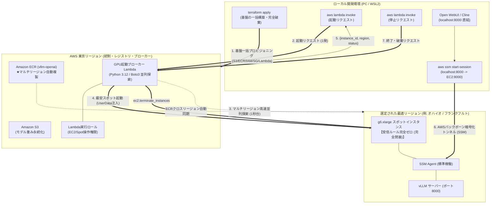

## はじめに

前回の記事（[EC2スポットインスタンス×vLLMでGPUコストを大幅削減する](/blogs/2026/10/02/vllm_spot_instance/)）では、時差やキャパシティ、中断耐性を加味した「マルチリージョン総合優先度自動選定」を導入し、`g6.xlarge`（NVIDIA L4 24GB）を1時間あたり約80〜90円という格安価格でスポット調達する仕組みを構築しました。

手元のPCからスクリプトを実行するだけで、その瞬間に世界で最も安く安定したリージョンを選び出し、1人1台専用のGPUを立ち上げられる環境は非常に快適でした。

しかし、この仕組みを日々の開発で使い込んでいくうちに、クラウドアーキテクトとしていくつか **「実用上の地味なストレス」** や **「セキュリティ上の改善ポイント」** が見えてきました：

1. **手元端末での探索オーバーヘッド**:  
   手元のシェルスクリプトから各リージョンのスポット価格や中断頻度を順次問い合わせていたため、起動前のリージョン探索だけで十数秒の待ち時間が発生していた。
2. **在庫切れ（キャパシティ不足）時の手動リトライ負荷**:  
   最安リージョンで一時的なスポット在庫不足（`InsufficientInstanceCapacity`）が発生すると起動が失敗してしまい、別の候補リージョンを手動で探して再実行する手間が生じていた。
3. **SSH秘密鍵（.pem）の管理コスト**:  
   各リージョンでEC2を立ち上げるためにキーペアを作成し、ローカルの `~/.ssh/` に秘密鍵を安全に保持・管理し続ける必要があった（誤って紛失したりパーミッションがずれると接続不能になる）。
4. **ポート22（SSH）の外部公開リスク**:  
   SSHトンネルを確立するために、各リージョンでセキュリティグループのインバウンドポート22を外部（`0.0.0.0/0` または自宅IP）に開放せざるを得ず、ブルートフォース攻撃やセキュリティポリシー上の懸念が残っていた。
5. **マルチリージョン展開の基盤管理コスト**:  
   S3バケット、ECRリポジトリ、各リージョンのセキュリティグループやIAM権限を手動や場当たり的なスクリプトで維持するのが煩雑になっていた。

これらの課題を解消するため、本記事では **AWS Lambda**、**AWS Systems Manager (SSM) セッションマネージャー**、**Terraform** を組み合わせ、ポート開放やSSH鍵の管理を不要にした「サーバーレスGPU起動ブローカー」を構築します。

手元の端末から探索や起動のロジックを切り離してLambdaへ集約することで、在庫切れ時の自動フォールバックや高速な並列探索を実現しつつ、SSMポートフォワーディングによってインバウンドポートを開放しない安全な推論環境を整えます。また、マルチリージョンに必要な基盤リソースはすべてTerraformでコード化し、環境の再現性とクリーンアップを容易にしています。

:::info
**📚 過去シリーズの記事はこちら**  
* **第1回**: [AWS×UserDataでvLLMを自動起動！停止時コストほぼゼロのローカルLLM環境](/blogs/2026/09/16/vllm_autolaunch/)
* **第2回**: [自前vLLMをOpen WebUI経由でVS Code（Cline）に接続！トークンフリーで開発する](/blogs/2026/09/29/vllm_openwebui_cline/)
* **第3回**: [EC2スポットインスタンス×vLLMでGPUコストを大幅削減する](/blogs/2026/10/02/vllm_spot_instance/)
:::

---

## サーバーレスGPUブローカーのアーキテクチャ

> **📌 このセクションの要点**  
> 手元の重いBashスクリプトを「東京のLambda関数」に完全移管。手元からは `aws lambda invoke` を1回叩くだけで、Lambdaが全リージョンを並列探索（1秒台）してスポットを即時起動します。通信は「SSMポートフォワーディング」でインバウンド0件の完全閉塞トンネルを確立。さらに、S3・ECR・IAM・SG・Lambdaといった常時基盤はすべて **Terraform** で宣言的に一括プロビジョニング＆クリーンアップできるように設計しました。

今回の新アーキテクチャの全体像は以下の通りです：



### 🌟 アーキテクチャの比較とメリット（進化ポイント）

| 比較項目 | 第3回までの構成（手元Bashスクリプト） | **今回の新構成（Lambda ＋ SSM ＋ Terraform）** |
| :--- | :--- | :--- |
| **インフラ管理 (IaC)** | シェルスクリプトによる個別リソース作成 | **TerraformでS3・ECR・IAM・SG・Lambdaを一括宣言** |
| **コンテナレジストリ** | リージョンごとに手動pushが必要 | **ECRクロスリージョンレプリケーションで自動同期** |
| **セキュリティグループ** | 各リージョンでポート22（SSH）を開放 | **インバウンドルール0件**（受信ポート開放なし） |
| **SSH認証・鍵管理** | `~/.ssh/xxx.pem` の保持・パーミッション管理 | **SSH秘密鍵は一切不要！** AWS IAM認証だけで安全に直結 |
| **リージョン探索速度** | 手元から順次API呼び出し（十数秒） | **Lambda内部のマルチスレッド並列処理でわずか1秒台** |
| **手元クライアント環境** | 400行を超える巨大Bashスクリプト | **わずか十数行のラッパースクリプト（invoke $\rightarrow$ ssm）** |
| **パブリックIPv4費用** | パブリックIP必須（月約600円/台の維持費） | **プライベート起動可能**（IPv4課金を完全回避可能） |

---

## 1. Lambda関数（GPU起動ブローカー）の実装

> **📌 このステップでやること**  
> 外部ライブラリを追加せず、Lambda標準の Python 3.12 と `boto3` のみで軽量に動作する起動ブローカーを作成します。マルチスレッド（`concurrent.futures`）によって、東京・オレゴン・バージニア・オハイオ・フランクフルトの価格とキャパシティを1秒で並列評価します。

### 💡 Lambdaハンドラーコード（`handler.py`）

コードのポイントは以下の3点です：
1. **外部依存ゼロ**: 追加レイヤーや `pip install` が不要なため、デプロイ用zipはわずか数KBで済み、コールドスタートも極めて高速（数百ms）です。
2. **インバウンド完全閉塞セキュリティグループの自動生成**:  
   起動先リージョンに `vllm-ssm-isolated-sg` という「インバウンドルールが1件も存在しない（受信完全拒否）」セキュリティグループを自動作成・アタッチします。
3. **一括破棄（Terminate）機能**:  
   `action: "terminate"` を送るだけで、全候補リージョンから稼働中の `vllm-spot-server` を並列検索し、一括で破棄（Terminate）します。

<details><summary>handler.py（クリックで展開）</summary>

```python
"""
vLLM GPU Spot Broker Lambda
マルチリージョンのスポット探索、最適リージョン選定、Spot起動、Terminateを統括するサーバーレスブローカー
"""

import json
import logging
import urllib.request
import os
import concurrent.futures
import boto3
from botocore.config import Config

logger = logging.getLogger()
logger.setLevel(logging.INFO)

# 候補リージョンとインスタンスタイプ (環境変数があれば優先)
env_regions = os.environ.get("TARGET_REGIONS")
CANDIDATE_REGIONS = [r.strip() for r in env_regions.split(",") if r.strip()] if env_regions else ["ap-northeast-1", "eu-central-1", "us-east-2", "us-east-1", "us-west-2"]
INSTANCE_TYPE = os.environ.get("INSTANCE_TYPE", "g6.xlarge")
IAM_ROLE_NAME = os.environ.get("INSTANCE_PROFILE_NAME", "VllmServerSSMProfile")  # SSMCore + S3 + ECR 権限を持つインスタンスプロファイル
TAG_SERVER_NAME = os.environ.get("TAG_SERVER_NAME", "vllm-spot-server")
S3_BUCKET_NAME = os.environ.get("S3_BUCKET_NAME", "my-vllm-models-hackathon-2026-{account_id}-{region}-an")
ECR_REPOSITORY_NAME = os.environ.get("ECR_REPOSITORY_NAME", "vllm-openai")

# リージョン別 AMI ID キャッシュ (Ubuntu 22.04 Deep Learning AMI)
AMI_MAPPING = {
    "ap-northeast-1": "ami-0152728adca68ed36",
    "eu-central-1": "ami-0efde0090dab8cacf",
    "us-east-2": "ami-032b37e4db407994d",
    "us-east-1": "ami-012ba162b9cd2729c",
    "us-west-2": "ami-0ca70308d230e8a6e",
}

# 共通 UserData テンプレート (S3・ECR並列ダウンロード + SSM対応版)
USERDATA_TEMPLATE = """#!/bin/bash
set -euo pipefail
LOG_FILE="/var/log/userdata-vllm.log"
exec > >(tee -a "${LOG_FILE}") 2>&1
echo "=== [$(date '+%Y-%m-%d %H:%M:%S')] UserData 実行開始 (SSM完全閉塞版) ==="

AWS_REGION="__AWS_REGION__"
S3_BUCKET_NAME="__S3_BUCKET_NAME__"
HF_MODEL_ID="Qwen/Qwen2.5-Coder-7B-Instruct"
SERVED_MODEL_NAME="Qwen/Qwen2.5-Coder-7B-Instruct"
VLLM_PORT="8000"
GPU_MEMORY_UTILIZATION="0.90"
MAX_MODEL_LEN="16384"
DOCKER_IMAGE="__DOCKER_IMAGE__"

# 1. ローカル NVMe インスタンスストア（250GB）の検出と活用
NVME_DIR="/opt/dlami/nvme"
if mountpoint -q "${NVME_DIR}" || [ -d "${NVME_DIR}" ]; then
    echo "DLAMI既定の NVMe マウント (${NVME_DIR}) を活用します..."
    mkdir -p "${NVME_DIR}/models" "${NVME_DIR}/docker"
    mkdir -p /data
    ln -sfn "${NVME_DIR}/models" /data/models
else
    NVME_DEV=$(lsblk -d -n -o NAME,SIZE | grep -E '250G|232G' | head -n1 | awk '{print $1}')
    if [ -n "${NVME_DEV}" ]; then
        mkfs.ext4 -F "/dev/${NVME_DEV}" || true
        mkdir -p /data
        mount -o noatime "/dev/${NVME_DEV}" /data || true
    else
        mkdir -p /data
    fi
    mkdir -p /data/models /data/docker
    NVME_DIR="/data"
fi

LOCAL_MODEL_ROOT="/data/models"
LOCAL_MODEL_DIR="${LOCAL_MODEL_ROOT}/${HF_MODEL_ID}"
mkdir -p "${LOCAL_MODEL_DIR}"
chmod 777 "${LOCAL_MODEL_ROOT}"

# 2. Docker データ領域を NVMe に配置
systemctl stop docker containerd || true
mkdir -p "${NVME_DIR}/docker" "${NVME_DIR}/containerd"
mkdir -p /var/lib/docker /var/lib/containerd
cp -a /var/lib/docker/* "${NVME_DIR}/docker/" 2>/dev/null || true
cp -a /var/lib/containerd/* "${NVME_DIR}/containerd/" 2>/dev/null || true
mount --bind "${NVME_DIR}/docker" /var/lib/docker
mount --bind "${NVME_DIR}/containerd" /var/lib/containerd
systemctl daemon-reload
systemctl start containerd
systemctl start docker

# 3. S3モデル同期 と Docker pull の並列実行
S3_SRC="s3://${S3_BUCKET_NAME}/models/${HF_MODEL_ID}"
aws configure set default.s3.max_concurrent_requests 20

(
    echo "--- [Task A] Dockerイメージ取得: ${DOCKER_IMAGE} ---"
    if [[ "${DOCKER_IMAGE}" == *".dkr.ecr."* ]]; then
        ECR_REGISTRY=$(echo "${DOCKER_IMAGE}" | cut -d'/' -f1)
        ECR_REGION=$(echo "${ECR_REGISTRY}" | awk -F. '{print $4}')
        aws ecr get-login-password --region "${ECR_REGION:-${AWS_REGION}}" | docker login --username AWS --password-stdin "${ECR_REGISTRY}" || true
    fi
    docker pull "${DOCKER_IMAGE}"
) > /var/log/docker-pull.log 2>&1 &
PID_DOCKER=$!

(
    echo "--- [Task B] S3モデル高速同期 ---"
    aws s3 sync "${S3_SRC}" "${LOCAL_MODEL_DIR}" --region "${AWS_REGION}" --no-progress
) > /var/log/model-sync.log 2>&1 &
PID_S3=$!

wait "${PID_DOCKER}"
wait "${PID_S3}"
echo "=== 並列ダウンロード完了！ ==="

# 4. vLLMコンテナ起動
docker run -d \
    --name "vllm-server" \
    --restart unless-stopped \
    --gpus all \
    --ipc=host \
    -p "${VLLM_PORT}:8000" \
    -v "${LOCAL_MODEL_ROOT}:/models" \
    "${DOCKER_IMAGE}" \
    --model "/models/${HF_MODEL_ID}" \
    --served-model-name "${SERVED_MODEL_NAME}" \
    --gpu-memory-utilization "${GPU_MEMORY_UTILIZATION}" \
    --max-model-len "${MAX_MODEL_LEN}" \
    --trust-remote-code \
    --enable-auto-tool-choice \
    --tool-call-parser hermes

# 5. アイドル1時間自動終了デーモン
cat <<'EOF_IDLE' > /usr/local/bin/auto-idle-shutdown.sh
#!/bin/bash
IDLE_LIMIT=3600
IDLE_COUNT=0
while true; do
    sleep 300
    REQ=$(docker logs --since 5m vllm-server 2>&1 | grep -c "POST /v1" || true)
    if [ "${REQ}" -eq 0 ]; then
        IDLE_COUNT=$((IDLE_COUNT + 300))
        [ "${IDLE_COUNT}" -ge "${IDLE_LIMIT}" ] && { shutdown -h now; exit 0; }
    else
        IDLE_COUNT=0
    fi
done
EOF_IDLE
chmod +x /usr/local/bin/auto-idle-shutdown.sh
nohup /usr/local/bin/auto-idle-shutdown.sh > /dev/null 2>&1 &
echo "=== UserData 完了 (SSM待機中) ==="
"""


def get_spot_advisor_data():
    """Spot Advisor から中断頻度ランクを取得"""
    url = "https://spot-bid-advisor.s3.amazonaws.com/spot-advisor-data.json"
    tiers = {}
    try:
        req = urllib.request.Request(url, headers={"User-Agent": "Lambda-Broker"})
        with urllib.request.urlopen(req, timeout=3) as res:
            adv = json.loads(res.read().decode("utf-8")).get("spot_advisor", {})
            for r, info in adv.items():
                tier = info.get("Linux", {}).get(INSTANCE_TYPE, {}).get("r", 4)
                tiers[r] = tier
    except Exception as e:
        logger.warning(f"Spot Advisor 取得失敗: {e}")
    return tiers


def query_region_metrics(region, advisor_tiers):
    """単一リージョンのスポット価格・AZ数を取得"""
    boto_cfg = Config(connect_timeout=2, read_timeout=3, retries={"max_attempts": 1})
    ec2 = boto3.client("ec2", region_name=region, config=boto_cfg)
    try:
        res = ec2.describe_spot_price_history(
            InstanceTypes=[INSTANCE_TYPE],
            ProductDescriptions=["Linux/UNIX"],
            MaxResults=10,
        )
        prices = res.get("SpotPriceHistory", [])
        if not prices:
            return None

        min_price = min(float(p["SpotPrice"]) for p in prices)
        azs = set(p["AvailabilityZone"] for p in prices)
        az_count = len(azs)
        tier = advisor_tiers.get(region, 4)

        return {
            "region": region,
            "min_price": min_price,
            "az_count": az_count,
            "tier": tier,
        }
    except Exception as e:
        logger.error(f"Error querying {region}: {e}")
        return None


def select_best_region():
    """全候補リージョンを並列評価して最適リージョンを算出"""
    advisor_tiers = get_spot_advisor_data()
    metrics = []

    with concurrent.futures.ThreadPoolExecutor(max_workers=len(CANDIDATE_REGIONS)) as executor:
        futures = {executor.submit(query_region_metrics, r, advisor_tiers): r for r in CANDIDATE_REGIONS}
        for future in concurrent.futures.as_completed(futures):
            res = future.result()
            if res:
                metrics.append(res)

    if not metrics:
        raise RuntimeError("全リージョンでスポット価格を取得できませんでした")

    best_price = min(m["min_price"] for m in metrics)

    best_item = None
    max_score = -1

    for m in metrics:
        p_score = int(40.0 * (best_price / m["min_price"]))
        tier = m["tier"]
        i_score = {0: 20, 1: 15, 2: 10, 3: 5}.get(tier, 0)

        az = m["az_count"]
        if az >= 5:
            c_score = 40
        elif az == 4:
            c_score = 32
        elif az == 3:
            c_score = 24
        elif az == 2:
            c_score = 16
        else:
            c_score = 8

        total_score = p_score + i_score + c_score
        m["score"] = total_score
        if total_score >= 75:
            m["rank"] = "Rank S"
        elif total_score >= 65:
            m["rank"] = "Rank A"
        elif total_score >= 50:
            m["rank"] = "Rank B"
        else:
            m["rank"] = "Rank C"

        if total_score > max_score:
            max_score = total_score
            best_item = m

    return best_item, metrics


def get_or_create_ssm_security_group(ec2_client, region):
    """インバウンド完全遮断（受信0ルール）のSSM専用セキュリティグループ"""
    sg_name = "vllm-ssm-isolated-sg"
    try:
        res = ec2_client.describe_security_groups(
            Filters=[{"Name": "group-name", "Values": [sg_name]}]
        )
        if res["SecurityGroups"]:
            return res["SecurityGroups"][0]["GroupId"]
    except Exception:
        pass

    vpcs = ec2_client.describe_vpcs(Filters=[{"Name": "isDefault", "Values": ["true"]}])["Vpcs"]
    vpc_id = vpcs[0]["VpcId"] if vpcs else ec2_client.describe_vpcs()["Vpcs"][0]["VpcId"]

    new_sg = ec2_client.create_security_group(
        GroupName=sg_name,
        Description="Zero inbound ports allowed - access exclusively via AWS Systems Manager (SSM)",
        VpcId=vpc_id,
    )
    # インバウンドルールは1つも追加しない（完全閉塞）
    return new_sg["GroupId"]


def launch_spot_instance(best_region_info, account_id):
    """最適リージョンでスポットインスタンスを起動"""
    region = best_region_info["region"]
    ec2 = boto3.client("ec2", region_name=region)

    ami_id = AMI_MAPPING.get(region)
    if not ami_id:
        raise ValueError(f"AMI ID not configured for region {region}")

    sg_id = get_or_create_ssm_security_group(ec2, region)

    s3_bucket = S3_BUCKET_NAME.replace("{account_id}", account_id).replace("{region}", region)
    docker_image = f"{account_id}.dkr.ecr.{region}.amazonaws.com/{ECR_REPOSITORY_NAME}:latest"

    userdata_script = USERDATA_TEMPLATE.replace("__AWS_REGION__", region)
    userdata_script = userdata_script.replace("__S3_BUCKET_NAME__", s3_bucket)
    userdata_script = userdata_script.replace("__DOCKER_IMAGE__", docker_image)

    run_res = ec2.run_instances(
        ImageId=ami_id,
        InstanceType=INSTANCE_TYPE,
        MinCount=1,
        MaxCount=1,
        IamInstanceProfile={"Name": IAM_ROLE_NAME},
        SecurityGroupIds=[sg_id],
        InstanceMarketOptions={
            "MarketType": "spot",
            "SpotOptions": {
                "SpotInstanceType": "one-time",
                "InstanceInterruptionBehavior": "terminate",
            },
        },
        InstanceInitiatedShutdownBehavior="terminate",
        BlockDeviceMappings=[
            {
                "DeviceName": "/dev/sda1",
                "Ebs": {
                    "VolumeSize": 40,
                    "VolumeType": "gp3",
                    "DeleteOnTermination": True,
                },
            }
        ],
        UserData=userdata_script,
        TagSpecifications=[
            {
                "ResourceType": "instance",
                "Tags": [
                    {"Key": "Name", "Value": TAG_SERVER_NAME},
                    {"Key": "Project", "Value": "vllm-on-demand"},
                ],
            }
        ],
    )

    return run_res["Instances"][0]["InstanceId"]


def terminate_all_spot_instances():
    """全候補リージョンから稼働中の vLLM スポットインスタンスを検索して Terminate"""
    terminated = []

    def check_and_term(region):
        ec2 = boto3.client("ec2", region_name=region)
        try:
            res = ec2.describe_instances(
                Filters=[
                    {"Name": "tag:Name", "Values": [TAG_SERVER_NAME]},
                    {"Name": "instance-state-name", "Values": ["pending", "running", "stopping"]},
                ]
            )
            ids = [i["InstanceId"] for r in res.get("Reservations", []) for i in r.get("Instances", [])]
            if ids:
                ec2.terminate_instances(InstanceIds=ids)
                return [{"region": region, "instance_id": i} for i in ids]
        except Exception as e:
            logger.error(f"Error terminating in {region}: {e}")
        return []

    with concurrent.futures.ThreadPoolExecutor(max_workers=len(CANDIDATE_REGIONS)) as executor:
        results = executor.map(check_and_term, CANDIDATE_REGIONS)
        for r_list in results:
            terminated.extend(r_list)

    return terminated


def lambda_handler(event, context):
    """Lambda メインエントリーポイント"""
    action = event.get("action", "launch")
    account_id = context.invoked_function_arn.split(":")[4]

    logger.info(f"Received action: {action} (Account: {account_id})")

    if action == "launch":
        _, all_metrics = select_best_region()
        # 総合スコア順にソート（最高スコアから順にフォールバック候補として試行）
        sorted_candidates = sorted(all_metrics, key=lambda x: x.get("score", 0), reverse=True)
        logger.info(f"Ranked candidates: {[c['region'] for c in sorted_candidates]}")

        failed_attempts = []
        for candidate in sorted_candidates:
            region = candidate["region"]
            try:
                instance_id = launch_spot_instance(candidate, account_id)
                logger.info(f"Successfully launched {instance_id} in {region}")
                return {
                    "status": "success",
                    "action": "launch",
                    "region": region,
                    "instance_id": instance_id,
                    "instance_type": INSTANCE_TYPE,
                    "spot_price": candidate.get("min_price"),
                    "score": candidate.get("score"),
                    "rank": candidate.get("rank"),
                    "candidates": all_metrics,
                    "fallback_attempts": failed_attempts,
                }
            except Exception as e:
                err_str = str(e)
                if "InsufficientInstanceCapacity" in err_str:
                    reason = "スポット余剰キャパシティ不足 (在庫切れ)"
                elif "MaxSpotInstanceCountExceeded" in err_str:
                    reason = "スポットクォータ上限到達"
                else:
                    reason = f"{type(e).__name__}"
                logger.warning(f"Spot launch failed in {region} ({reason}), trying next candidate...")
                failed_attempts.append({
                    "region": region,
                    "score": candidate.get("score"),
                    "rank": candidate.get("rank"),
                    "reason": reason
                })
                last_error = e
                continue

        raise RuntimeError(f"All spot candidate regions failed. Last error: {last_error}")

    elif action == "terminate":
        terminated = terminate_all_spot_instances()
        return {
            "status": "success",
            "action": "terminate",
            "terminated_instances": terminated,
            "count": len(terminated),
        }

    else:
        return {
            "status": "error",
            "message": f"Unknown action: '{action}'. Must be 'launch' or 'terminate'.",
        }
```

</details>

---

## 2. Terraformによる基盤構築（ECR・IAM・SG・Lambdaの一括コード化）

> **📌 このステップでやること**  
> サーバーレス起動ブローカーに必要な「静的インフラ（S3・ECR・IAM・ゼロインバウンドSG・Lambda関数）」をTerraformで一括プロビジョニングします。

### 💡 Terraform化における「役割分担（スコープ設計）」

本アーキテクチャでは、「常に存在するインフラ」と「作業時だけ使い捨てるGPU」が明確に分離されています。そのため、Terraformの管理範囲を以下のように切り分けるのがベストプラクティスです：

| カテゴリ | リソース | 管理ツール | ライフサイクル・費用感 |
| :--- | :--- | :--- | :--- |
| **静的基盤** | S3, ECR（+レプリケーション）, IAM, 各リージョンSG, Lambda | **Terraform** | 常時存在（使わない時の待機費用はS3・ECRの数GB保管料数十円のみ） |
| **動的エフェメラル** | 最適リージョンのリアルタイム探索, EC2スポット起動/破棄, SSMトンネル | **Lambda + CLI** | オンデマンド実行（作業中のみ $0.4〜0.6/h 課金） |

「EC2スポットの起動・破棄」までをTerraform（`terraform apply / destroy`）で管理しようとすると、実行ごとの動的なリージョン選定が難しくなり、状態ファイル（`tfstate`）のロックや同期で毎回1分以上のオーバーヘッドが発生します。  
そのため、**「ブローカー基盤までをTerraformで作り、GPUの生成・破棄はブローカー（Lambda）に任せる」** という設計が最も軽快で堅牢です。

### 📦 コンテナイメージのマルチリージョン配置（ECRクロスリージョンレプリケーション）

第1回〜第3回では、vLLMのコンテナイメージ（約13GB）を東京リージョンの **Amazon ECR** に配置し、EC2の起動時に同一リージョン内から高速・転送料無料でPullしていました。

本連載のアーキテクチャをマルチリージョンへ拡張するにあたり、調達候補となる各リージョン（バージニア、オレゴン、オハイオ、フランクフルトなど）でも、同様に**同一リージョン内のECRからイメージを取得できる状態**を整えておく必要があります。仮に東京のECRから他リージョンのEC2へ都度Pullしてしまうと、リージョン間データ転送料金が毎回発生するうえ、コンテナ起動時間も大幅に増大してしまうためです。

とはいえ、イメージを更新するたびに各リージョンのECRエンドポイントへ手動で `docker push` を繰り返すのは運用負荷が高く、非効率です。

そこで、Amazon ECRがネイティブで備えている **クロスリージョンレプリケーション（Cross-Region Replication）** を採用します。Terraformでこのレプリケーション設定（`aws_ecr_replication_configuration`）を宣言しておくことで、開発端末からは東京のECRに1回Pushするだけで、AWSバックボーン経由で全候補リージョンへ自動的に非同期複製されます。

以下は、東京リージョンでのECRリポジトリ作成、旧世代イメージの自動削除ポリシー、および他4リージョンへの自動レプリケーションを定義したTerraformコードです：

<details><summary>ecr.tf（クリックで展開）</summary>

```hcl
# terraform/ecr.tf
# 東京（プライマリ）リージョンの ECR リポジトリ
resource "aws_ecr_repository" "vllm" {
  name                 = var.ecr_repository_name
  image_tag_mutability = "MUTABLE"

  tags = { Project = "vllm-ephemeral" }
}

# 古いタグの自動削除ポリシー（無駄なストレージ課金を防止）
resource "aws_ecr_lifecycle_policy" "vllm_lifecycle" {
  repository = aws_ecr_repository.vllm.name
  policy = jsonencode({
    rules = [{
      rulePriority = 1
      description  = "最新イメージのみ保持し、旧世代は30日で失効"
      selection    = { tagStatus = "any", countType = "sinceImagePushed", countUnit = "days", countNumber = 30 }
      action       = { type = "expire" }
    }]
  })
}

# ★マルチリージョン・クロスリージョン自動レプリケーション
resource "aws_ecr_replication_configuration" "vllm_replication" {
  replication_configuration {
    rule {
      dynamic "destination" {
        for_each = [for r in var.target_regions : r if r != var.primary_region]
        content {
          region      = destination.value
          registry_id = data.aws_caller_identity.current.account_id
        }
      }
    }
  }
}
```

</details>

このように設定しておくことで、開発フローとしては「東京のECRに1度Pushする」という従来の運用のまま、マルチリージョンの全候補地へイメージが自動同期され、どのリージョンでスポットが起動しても同一リージョン内からの高速Pullが担保されます。

:::column:💡 ECRとS3の違い：モデルデータ（S3）も自動レプリケーションできる？
**「ECRが自動複製されるなら、S3のモデルデータもTerraformで自動レプリケーション（S3 CRR）できないの？」** と疑問に思う方も多いと思います。

結論から言うと、**技術的には Amazon S3 Cross-Region Replication（S3 CRR）を用いて自動同期することが可能**です。しかし、本構成ではあえてS3 CRRを採用せず、**「初回にスクリプトで1回同期する」方針**をとっています。その理由は、大容量モデルデータを扱うスポットGPU環境特有の落とし穴とコストリスクにあります：

1. **バケットのバージョニング必須に伴うストレージ課金リスク**  
   S3 CRR を設定するには、送信元・同期先の全バケットで「バージョニング（Versioning）」の有効化が必須となります。15GB〜数十GB に及ぶモデル重みデータでバージョニングが有効になっていると、ファイルの差し替えや削除を行った際に過去世代が裏に残り続け、気づかないうちに **15GB × 世代数 × 5リージョン分** のストレージ保管料が発生し続けるリスクがあります（旧世代を自動削除するライフサイクルルールの追加設定が必要になります）。
2. **既存オブジェクトは自動同期されない制約**  
   S3 CRR は「レプリケーション設定完了**後**に新規 Put されたオブジェクト」のみを自動転送する仕様です。すでに東京バケットにアップロードされている既存のモデルデータは自動同期されないため、別途 S3 Batch Replication ジョブを発行するか、結局一度手動でコピーし直す必要があります。
3. **IaC（Terraform）コードの過度な肥大化**  
   S3サービスがオブジェクトを読み取って別リージョンに書き込むための専用IAMロールや、1対4の `aws_s3_bucket_replication_configuration` をTerraformで書くと、コード量が数十行以上肥大化します。

頻繁にプッシュされるコンテナイメージ（ECR）と異なり、LLMのモデル重みデータは「一度配置したら滅多に変更されない静的アセット」です。  
そのため、予期せぬ課金リスクやIaCの複雑化を避け、**AWSバックボーン経由で数分で終わる同期スクリプト（`aws s3 sync`）を初回に1度だけ叩く運用**が、最もシンプルかつ安全です。

EC2の起動スクリプト（UserData）は **同一リージョンのS3バケットから高速ダウンロード（`aws s3 sync`）する前提** で組まれているため、各リージョンのバケットが空のままだと起動時にモデル同期エラーとなります。  
`terraform apply` でバケットを作成した後は、すでにモデルデータがある東京バケットから各リージョンへ1度だけ直接同期を実行しておきましょう：

```bash
ACCOUNT_ID=$(aws sts get-caller-identity --query Account --output text)

# 東京（ソース）から各候補リージョンのS3バケットへ直接同期
for REGION in eu-central-1 us-east-2 us-east-1 us-west-2; do
    echo "=== [${REGION}] モデルデータを同期中... ==="
    aws s3 sync \
        "s3://my-vllm-models-hackathon-2026-${ACCOUNT_ID}-ap-northeast-1-an/models/" \
        "s3://my-vllm-models-hackathon-2026-${ACCOUNT_ID}-${REGION}-an/models/" \
        --no-progress
    echo "=== [${REGION}] 同期完了！ ==="
done
```
※PCの回線を経由せず、AWSバックボーン経由でバケット間を直接転送するため、15GBの重みデータでも数分で完了します。
:::

### 🛡️ 各リージョンのゼロインバウンドSG ＆ IAM定義

続いて、対象リージョンすべてに「インバウンド0件（受信完全拒絶）」のセキュリティグループと、EC2・Lambdaに必要なIAM権限を定義します。

SSM接続を利用するため、EC2側のインバウンドポートを開放する必要は一切ありません。以下のようにインバウンドルールを一切定義しない（全拒絶）セキュリティグループを各候補リージョンに作成します：

<details><summary>security_groups.tf（クリックで展開）</summary>

```hcl
# terraform/security_groups.tf
# 東京リージョン用
resource "aws_security_group" "sg_ap_northeast_1" {
  name        = "vllm-zero-inbound-sg"
  description = "Zero inbound ports for vLLM SSM ephemeral instance"

  egress {
    from_port        = 0
    to_port          = 0
    protocol         = "-1"
    cidr_blocks      = ["0.0.0.0/0"]
    ipv6_cidr_blocks = ["::/0"]
  }
}
# （他リージョン us-east-1, us-east-2, us-west-2, eu-central-1 にもプロバイダエイリアス経由で作成）
```

</details>

GPUインスタンス（EC2）側には、SSM経由のセッション接続に必要なマネージドポリシー（`AmazonSSMManagedInstanceCore`）に加え、同一リージョンのECRやS3からコンテナイメージ・モデルデータを読み取る最小権限を付与します：

<details><summary>iam_ec2.tf（クリックで展開）</summary>

```hcl
# terraform/iam_ec2.tf
# EC2にアタッチするインスタンスプロファイル
resource "aws_iam_role" "ec2_role" {
  name               = "VllmServerSSMRole"
  assume_role_policy = data.aws_iam_policy_document.ec2_trust.json
}

# SSM接続権限 ＋ ECR読み取り権限 ＋ S3モデル読み取り権限
resource "aws_iam_role_policy_attachment" "ec2_ssm" {
  role       = aws_iam_role.ec2_role.name
  policy_arn = "arn:aws:iam::aws:policy/AmazonSSMManagedInstanceCore"
}

resource "aws_iam_role_policy_attachment" "ec2_ecr" {
  role       = aws_iam_role.ec2_role.name
  policy_arn = "arn:aws:iam::aws:policy/AmazonEC2ContainerRegistryReadOnly"
}

resource "aws_iam_role_policy" "ec2_s3_policy" {
  name   = "VllmModelS3ReadOnly"
  role   = aws_iam_role.ec2_role.id
  policy = data.aws_iam_policy_document.ec2_s3_read.json
}

resource "aws_iam_instance_profile" "ec2_profile" {
  name = "VllmServerSSMProfile"
  role = aws_iam_role.ec2_role.name
}
```

</details>

起動ブローカーとなるLambda関数には、マルチリージョンのスポット料金や稼働状況の照会、EC2スポットインスタンスの起動・破棄、およびEC2インスタンスプロファイルのPassRole権限を付与します：

<details><summary>iam_lambda.tf（クリックで展開）</summary>

```hcl
# terraform/iam_lambda.tf
# Lambda実行ロール（必要最小限のアクションに限定）
resource "aws_iam_role" "lambda_role" {
  name               = "VllmSpotBrokerLambdaRole"
  assume_role_policy = data.aws_iam_policy_document.lambda_trust.json
}

resource "aws_iam_role_policy_attachment" "lambda_basic" {
  role       = aws_iam_role.lambda_role.name
  policy_arn = "arn:aws:iam::aws:policy/service-role/AWSLambdaBasicExecutionRole"
}

data "aws_iam_policy_document" "lambda_ec2_policy_doc" {
  statement {
    actions = [
      "ec2:DescribeSpotPriceHistory",
      "ec2:DescribeInstances",
      "ec2:DescribeSecurityGroups",
      "ec2:DescribeVpcs",
      "ec2:DescribeImages",
      "ec2:CreateSecurityGroup",
      "ec2:RunInstances",
      "ec2:CreateTags",
      "ec2:TerminateInstances"
    ]
    resources = ["*"]
  }

  statement {
    actions   = ["iam:PassRole"]
    resources = [aws_iam_role.ec2_role.arn]
  }
}

resource "aws_iam_role_policy" "lambda_ec2_policy" {
  name   = "VllmSpotBrokerEC2Policy"
  role   = aws_iam_role.lambda_role.id
  policy = data.aws_iam_policy_document.lambda_ec2_policy_doc.json
}
```

</details>

### ⚡ Lambda関数の自動パッケージングとデプロイ

Terraformの `archive_file` データソースを活用することで、Pythonコード（`handler.py`）のzip圧縮から関数の作成・更新までを完全自動化します。

<details><summary>lambda.tf（クリックで展開）</summary>

```hcl
# terraform/lambda.tf
data "archive_file" "lambda_zip" {
  type        = "zip"
  source_dir  = "${path.module}/../lambda"
  output_path = "${path.module}/dist/lambda_function.zip"
}

resource "aws_lambda_function" "broker" {
  function_name    = var.lambda_function_name
  runtime          = "python3.12"
  handler          = "handler.lambda_handler"
  filename         = data.archive_file.lambda_zip.output_path
  source_code_hash = data.archive_file.lambda_zip.output_base64sha256
  role             = aws_iam_role.lambda_role.arn
  timeout          = 60
  memory_size      = 256

  environment {
    variables = {
      TARGET_REGIONS        = join(",", var.target_regions)
      S3_BUCKET_NAME        = var.s3_bucket_name
      INSTANCE_PROFILE_NAME = aws_iam_instance_profile.ec2_profile.name
      ECR_REPOSITORY_NAME   = aws_ecr_repository.vllm.name
    }
  }
}
```

</details>

### 🚀 Terraformの実行

作業ディレクトリで以下を実行するだけで、数分で全基盤が整います：

```bash
$ cd terraform
$ terraform init
$ terraform apply -auto-approve
```

検証終了後や「しばらく使わない」という場合は、`terraform destroy` を叩くだけでIAMロールやセキュリティグループ、Lambda関数が綺麗に消滅するため、クラウド上に不要なゴミが一切残りません。

:::column:💡 シェルスクリプトで手早く試したい場合（01_deploy_lambda.sh）
Terraformを導入していない環境向けに、AWS CLIだけでIAM作成・Lambdaデプロイを完結させるスクリプトも用意しています：

<details><summary>01_deploy_lambda.sh（クリックで展開）</summary>

```bash
#!/bin/bash
set -euo pipefail

SCRIPT_DIR="$(cd "$(dirname "${BASH_SOURCE[0]}")" && pwd)"
LAMBDA_DIR="$(cd "${SCRIPT_DIR}/../lambda" && pwd)"
FUNCTION_NAME="vllm-spot-broker"
ROLE_NAME="vllm-spot-broker-lambda-role"
REGION="ap-northeast-1"

echo "=== 1. Lambda 実行ロール (${ROLE_NAME}) の作成/確認 ==="
AWS_ACCOUNT_ID=$(aws sts get-caller-identity --query Account --output text)

TRUST_POLICY='{
  "Version": "2012-10-17",
  "Statement": [
    {
      "Effect": "Allow",
      "Principal": { "Service": "lambda.amazonaws.com" },
      "Action": "sts:AssumeRole"
    }
  ]
}
'

if ! aws iam get-role --role-name "${ROLE_NAME}" >/dev/null 2>&1; then
    aws iam create-role --role-name "${ROLE_NAME}" --assume-role-policy-document "${TRUST_POLICY}" >/dev/null
    aws iam attach-role-policy --role-name "${ROLE_NAME}" --policy-arn "arn:aws:iam::aws:policy/service-role/AWSLambdaBasicExecutionRole"
    
    BROKER_POLICY="{
      \"Version\": \"2012-10-17\",
      \"Statement\": [
        {
          \"Effect\": \"Allow\",
          \"Action\": [\"ec2:Describe*\", \"ec2:RunInstances\", \"ec2:TerminateInstances\", \"ec2:CreateSecurityGroup\", \"ec2:CreateTags\"],
          \"Resource\": \"*\"
        },
        {
          \"Effect\": \"Allow\",
          \"Action\": \"iam:PassRole\",
          \"Resource\": \"arn:aws:iam::${AWS_ACCOUNT_ID}:role/VllmServerSSMRole\"
        }
      ]
    }"
    aws iam put-role-policy --role-name "${ROLE_NAME}" --policy-name "VllmBrokerPermissions" --policy-document "${BROKER_POLICY}"
    echo "IAMロール作成完了。権限伝播を待機中..."
    sleep 10
fi

ROLE_ARN="arn:aws:iam::${AWS_ACCOUNT_ID}:role/${ROLE_NAME}"

echo "=== 2. Lambda パッケージング＆デプロイ ==="
TMP_ZIP=$(mktemp --suffix=.zip)
(cd "${LAMBDA_DIR}" && zip -q -r "${TMP_ZIP}" handler.py)

if aws lambda get-function --region "${REGION}" --function-name "${FUNCTION_NAME}" >/dev/null 2>&1; then
    aws lambda update-function-code --region "${REGION}" --function-name "${FUNCTION_NAME}" --zip-file "fileb://${TMP_ZIP}" >/dev/null
else
    aws lambda create-function \
        --region "${REGION}" \
        --function-name "${FUNCTION_NAME}" \
        --runtime "python3.12" \
        --role "${ROLE_ARN}" \
        --handler "handler.lambda_handler" \
        --zip-file "fileb://${TMP_ZIP}" \
        --timeout 60 \
        --memory-size 256 >/dev/null
fi

rm -f "${TMP_ZIP}"
echo "🎉 Lambda デプロイ完了: ${FUNCTION_NAME} (${REGION})"
```

</details>
:::

---

## 3. 手元クライアントでの利用（起動・SSM直結・破棄）

> **📌 このステップでやること**  
> 手元のクライアントでは、`aws lambda invoke` でLambdaを呼び出し、返ってきたインスタンスIDに対して `aws ssm start-session` でポートフォワーディングを張るだけです。数十行の極小スクリプトで完結します。

### 🚀 起動＆SSMトンネル直結スクリプト（`02_start_vllm_ssm.sh`）

<details><summary>02_start_vllm_ssm.sh（クリックで展開）</summary>

```bash
#!/bin/bash
set -euo pipefail

SCRIPT_DIR="$(cd "$(dirname "${BASH_SOURCE[0]}")" && pwd)"
STATE_FILE="${SCRIPT_DIR}/.current_session.json"
TUNNEL_PID_FILE="${SCRIPT_DIR}/.current_tunnel.pid"
BROKER_REGION="ap-northeast-1"
FUNCTION_NAME="vllm-spot-broker"

echo "=== 1. サーバーレスGPUブローカー（Lambda）を呼び出し中... ==="
TMP_RES=$(mktemp)

aws lambda invoke \
    --region "${BROKER_REGION}" \
    --function-name "${FUNCTION_NAME}" \
    --payload '{"action":"launch"}' \
    --cli-binary-format raw-in-base64-out \
    "${TMP_RES}" >/dev/null

STATUS=$(jq -r '.status // "error"' "${TMP_RES}")
if [ "${STATUS}" != "success" ]; then
    echo "エラー: Lambdaの起動リクエストが失敗しました。"
    cat "${TMP_RES}"
    rm -f "${TMP_RES}"
    exit 1
fi

INSTANCE_ID=$(jq -r '.instance_id' "${TMP_RES}")
REGION=$(jq -r '.region' "${TMP_RES}")
PRICE=$(jq -r '.spot_price' "${TMP_RES}")
SCORE=$(jq -r '.score' "${TMP_RES}")
RANK=$(jq -r '.rank' "${TMP_RES}")

cp "${TMP_RES}" "${STATE_FILE}"
rm -f "${TMP_RES}"

echo "=========================================================="
echo " 🏆 最適リージョン選定完了: ${REGION} (${RANK} / ${SCORE}点)"
echo "    インスタンスID: ${INSTANCE_ID}"
echo "    スポット価格  : \$${PRICE}/h"

FALLBACK_COUNT=$(jq -r '.fallback_attempts | length // 0' "${STATE_FILE}")
if [ "${FALLBACK_COUNT}" -gt 0 ]; then
    echo " ⚠️ 上位候補リージョンで一時的なスポット在庫不足が発生したため、自動フォールバックしました:"
    jq -r '.fallback_attempts[] | "    - \(.region) (\(.score)点 / \(.rank)): \(.reason)"' "${STATE_FILE}"
fi
echo "=========================================================="

echo "=== 2. インスタンスの起動状態（running）を待機中... ==="
aws ec2 wait instance-running --region "${REGION}" --instance-ids "${INSTANCE_ID}"
echo "インスタンスが稼働開始しました！"

echo "=== 3. SSMエージェントのオンライン接続を待機中... ==="
while true; do
    PING_STATUS=$(aws ssm describe-instance-information \
        --region "${REGION}" \
        --filters "Key=InstanceIds,Values=${INSTANCE_ID}" \
        --query "InstanceInformationList[0].PingStatus" \
        --output text 2>/dev/null || true)
    if [ "${PING_STATUS}" = "Online" ]; then
        echo ""
        echo "SSMエージェントがオンラインになりました！"
        break
    fi
    echo -n "."
    sleep 3
done

# 既存トンネルのクリーンアップ
if [ -f "${TUNNEL_PID_FILE}" ]; then
    kill "$(cat "${TUNNEL_PID_FILE}")" 2>/dev/null || true
    rm -f "${TUNNEL_PID_FILE}"
fi

echo "=== 4. AWS Systems Manager (SSM) ポートフォワーディング開始 ==="
echo "※インバウンドポート開放ゼロ＆鍵管理不要のセキュアトンネルです"
echo "ローカルポート 8000 -> EC2 ポート 8000"

TUNNEL_LOG="${SCRIPT_DIR}/.current_tunnel.log"
nohup aws ssm start-session \
    --region "${REGION}" \
    --target "${INSTANCE_ID}" \
    --document-name AWS-StartPortForwardingSession \
    --parameters '{"portNumber":["8000"],"localPortNumber":["8000"]}' \
    > "${TUNNEL_LOG}" 2>&1 &

TUNNEL_PID=$!
echo "${TUNNEL_PID}" > "${TUNNEL_PID_FILE}"
echo "SSMトンネル確立完了 (PID: ${TUNNEL_PID})"

echo "=== 5. vLLMサーバーの応答待機中 (ポート 8000)... ==="
while ! curl -s -f "http://127.0.0.1:8000/health" >/dev/null 2>&1; do
    if ! kill -0 "${TUNNEL_PID}" 2>/dev/null; then
        echo ""
        echo "エラー: SSMトンネルプロセスが異常終了しました。ログ (${TUNNEL_LOG}):"
        cat "${TUNNEL_LOG}" 2>/dev/null || true
        exit 1
    fi
    echo -n "."
    sleep 5
done
echo ""

echo "=========================================================="
echo " 🎉 vLLMサーバーが正常に応答しました！"
echo " 接続先: http://localhost:8000/v1 (Open WebUIから即直結可能)"
echo "=========================================================="
```

</details>

### 🛑 終了・破棄（Terminate）スクリプト（`03_stop_vllm.sh`）

作業が終わったら、Lambdaへ `action: "terminate"` を投げて手元のSSMトンネルを切断するだけです。

<details><summary>03_stop_vllm.sh（クリックで展開）</summary>

```bash
#!/bin/bash
set -euo pipefail

SCRIPT_DIR="$(cd "$(dirname "${BASH_SOURCE[0]}")" && pwd)"
TUNNEL_PID_FILE="${SCRIPT_DIR}/.current_tunnel.pid"

# 1. ローカルSSMトンネル切断
if [ -f "${TUNNEL_PID_FILE}" ]; then
    kill "$(cat "${TUNNEL_PID_FILE}")" 2>/dev/null || true
    rm -f "${TUNNEL_PID_FILE}"
    echo "ローカルSSMトンネルを切断しました。"
fi

# 2. Lambdaへ一斉Terminate指示
TMP_RES=$(mktemp)
aws lambda invoke \
    --region ap-northeast-1 \
    --function-name vllm-spot-broker \
    --payload '{"action":"terminate"}' \
    --cli-binary-format raw-in-base64-out \
    "${TMP_RES}" >/dev/null

COUNT=$(jq -r '.count // 0' "${TMP_RES}")
echo "🛑 稼働中のGPUスポットインスタンス ${COUNT} 台を完全破棄しました。"
rm -f "${TMP_RES}"
```

</details>

---

## 実際に動かしてみた実行ログ

手元から `./02_start_vllm_ssm.sh` を実行したときの様子です。  
この日は、フランクフルト（`eu-central-1`）とオハイオ（`us-east-2`）でスポットインスタンスの一時的な在庫不足（`InsufficientInstanceCapacity`）が発生していましたが、**ブローカーLambdaがミリ秒単位で自動フォールバックを繰り返し、3番手候補の東京リージョンで確実に起動を成功** させました：

```text
$ ./02_start_vllm_ssm.sh
=== 1. サーバーレスGPUブローカー（Lambda）を呼び出し中... ===
==========================================================
 🏆 最適リージョン選定完了: ap-northeast-1 (Rank A / 68点)
    インスタンスID: i-033a0b0279a44cf56
    スポット価格  : $0.5752/h
 ⚠️ 上位候補リージョンで一時的なスポット在庫不足が発生したため、自動フォールバックしました:
    - eu-central-1 (82点 / Rank S): スポット余剰キャパシティ不足 (在庫切れ)
    - us-east-2 (74点 / Rank A): スポット余剰キャパシティ不足 (在庫切れ)
==========================================================
=== 2. インスタンスの起動状態（running）を待機中... ===
インスタンスが稼働開始しました！
=== 3. SSMエージェントのオンライン接続を待機中... ===
......
SSMエージェントがオンラインになりました！
=== 4. AWS Systems Manager (SSM) ポートフォワーディング開始 ===
※インバウンドポート開放ゼロ＆鍵管理不要のセキュアトンネルです
ローカルポート 8000 -> EC2 ポート 8000
SSMトンネル確立完了 (PID: 32018)
=== 5. vLLMサーバーの応答待機中 (ポート 8000)... ===
..................................................
==========================================================
 🎉 vLLMサーバーが正常に応答しました！
 接続先: http://localhost:8000/v1 (Open WebUIから即直結可能)
==========================================================
```

ブラウザで `http://localhost:3000`（Open WebUI）を開けば、いつも通り快適に推論可能です。  
裏側のEC2は **インターネットからのインバウンドルールが0件であるにもかかわらず、手元の `localhost:8000` とSSM経由の暗号化通信で安全に接続されています。**

:::column:💡 ここに注目：スポット市場の現実と「自動フォールバック」の威力
スポットインスタンスを運用していると必ず直面するのが、**`InsufficientInstanceCapacity`（一時的な在庫切れ）** です。

スポット価格が最安（Rank S）であっても、その瞬間に世界中のハイパースケーラーや企業がGPUインスタンスを確保し尽くしていると、AWSから即座に起動拒絶エラーが返されます。  
第3回までの手動スクリプトでは、このエラーが出ると起動がクラッシュし、人間がリージョンを変えて再度スクリプトを実行し直す必要がありました。

しかし今回のLambdaブローカーは、**「スコア順に上位候補へ順次打診し、失敗したらミリ秒単位で次点リージョンへ自動フォールバックする」** という自律リトライ機構を備えています。  
上記ログの通り、欧州（フランクフルト）や米国（オハイオ）でスポット在庫が枯渇していても、ユーザーは何一つエラーを意識することなく、わずか1秒の間に東京リージョンへとシームレスに切り替わり、確実にGPUが立ち上がります。

「低価格なスポットを狙いつつ、在庫切れによる起動エラーを自動回避する」という、実用上非常に効果的な仕組みです。
:::

作業を終えたら `./03_stop_vllm.sh` を叩きます：

```text
$ ./03_stop_vllm.sh
ローカルSSMトンネルを切断しました。
🛑 稼働中のGPUスポットインスタンス 1 台を完全破棄しました。
```

コマンド1つで、稼働中のスポットインスタンスを確実に終了・削除できます。

---

## 💡 コラム：なぜSSMを使うとセキュリティが劇的に向上するのか？

クラウドで開発用インスタンスを立ち上げる際、「とりあえずポート22を開けてSSH接続する」という運用は非常によく見られます。しかし、AWS Systems Manager (SSM) のポートフォワーディングを採用すると、運用セキュリティが次のレベルに引き上がります：

1. **インバウンドポートの完全撤廃（ゼロ・トラスト）**:  
   セキュリティグループで許可すべきポートは **「0個」** です。インターネットからの不正アクセスやポートスキャン、SSHブルートフォース攻撃を受けるリスクを根本から排除できます。
2. **インバウンド遮断＋アウトバウンド専用の最小構成**:  
   通信の確立はすべてEC2内部からAWS Systems Managerエンドポイントへの **アウトバウンド（外向き）** で行われます。外部からの接続待ち受け（インバウンド）用の受付IPは不要なため、セキュリティグループの受信ルールは完全ゼロです（※デフォルトVPCでは外向きの出口としてパブリックIPを利用しますが、インバウンド完全閉塞のため外部からの直接的な接続はすべて遮断されます。高価なNAT GatewayやVPCエンドポイントを5リージョン分常時維持する固定費も回避できます）。
3. **SSH秘密鍵の漏洩・管理リスクが消滅**:  
   接続認証はすべて **「AWS IAM（ユーザー/ロール権限）」** で行われます。退職者の秘密鍵失効やキーペアローテーションといった鍵管理の手間から解放されます。

:::check
**⚠️ SSMポートフォワーディングを利用するための前提条件**
* **実行IAMユーザー/ロールの権限**: 手元のAWS CLIを実行するIAMユーザーに、Lambda実行権限およびSSMセッション開始権限が付与されていること（手軽に試す場合は `AmazonSSMFullAccess`、厳格な最小権限ポリシーは下記参照）。
* **EC2のIAMロール**: `AmazonSSMManagedInstanceCore` ポリシーがアタッチされていること（本記事のTerraformで自動構築されます）。
* **SSM Agentの稼働**: Ubuntu Deep Learning AMIには標準でSSM Agentがプリインストール・自動起動されています。
* **ローカル側のSession Manager Plugin**: 手元PCのAWS CLIで `aws ssm start-session` を実行するため、[AWS公式の Session Manager Plugin](https://docs.aws.amazon.com/systems-manager/latest/userguide/session-manager-working-with-install-plugin.html) をローカル環境にインストールしておく必要があります（Windowsの場合は `winget install --id Amazon.SessionManagerPlugin`）。
:::

:::column:🔒 クライアント（実行者）用の最小権限ポリシー例（Least Privilege）
企業ポリシー等で管理者権限（`*FullAccess`）を付与できない場合は、以下の必要最小限のアクションのみを許可したカスタムインラインポリシーを開発者IAMユーザーに付与します：

```json
{
  "Version": "2012-10-17",
  "Statement": [
    {
      "Sid": "LambdaInvokeBroker",
      "Effect": "Allow",
      "Action": "lambda:InvokeFunction",
      "Resource": "arn:aws:lambda:ap-northeast-1:*:function:vllm-spot-broker"
    },
    {
      "Sid": "EC2DescribeForWaiting",
      "Effect": "Allow",
      "Action": "ec2:DescribeInstances",
      "Resource": "*"
    },
    {
      "Sid": "SSMPortForwardingSession",
      "Effect": "Allow",
      "Action": [
        "ssm:StartSession",
        "ssm:TerminateSession",
        "ssm:ResumeSession",
        "ssm:DescribeSessions",
        "ssm:GetConnectionStatus"
      ],
      "Resource": [
        "arn:aws:ec2:*:*:instance/*",
        "arn:aws:ssm:*:*:session/*",
        "arn:aws:ssm:*:*:document/AWS-StartPortForwardingSession"
      ]
    }
  ]
}
```
:::

:::column:💡 チーム運用や実務導入に向けたちょっとしたTips
本構成は個人や少人数の検証環境で最速・格安に動くベストバランスを目指していますが、チームでの共有や実務利用へスケールさせる場合は、以下の点をケアしておくとさらに安心です：

* **コスト監視（AWS Budgets）**: スポットの消し忘れ防止のため、タグ単位（`Project = vllm-on-demand`）で月額予算アラートを設定しておく。
* **シークレット管理**: Gatedモデル（Llama等）取得用のHugging Faceトークンなどは、コードに直書きせずSSM Parameter Store等から実行時に注入する。
* **ブローカーの冗長化**: 必要に応じてLambdaを別リージョン（大阪やオハイオ等）にもスタンバイ配置し、フェイルオーバーできるようにしておく。
:::

:::column:💡 発展：他ワークロードへの応用パターン
本記事ではvLLM（GPU推論）を題材としましたが、「Lambdaによるスポット探索・起動・自動フォールバック」と「SSMポートフォワーディングによるインバウンド閉塞アクセス」を組み合わせた構成は、一時的に高スペックなマシンを必要とする他のワークロードにも応用可能です：

1. **大規模コンパイル・ビルド環境**:  
   手元端末の負荷を軽減するため、多数のvCPUを持つコンピュート最適化インスタンス（例: `c6i` 系列）を必要な時間だけ立ち上げ、ビルド完了後に自動終了させる。
2. **モデルのファインチューニングやバッチ学習**:  
   学習時のみ複数GPUインスタンスをスポット起動し、S3からデータセットを取得して学習を実行、生成された重みをS3へ保存した後にインスタンスを破棄する。
3. **メモリ集約型のデータ処理**:  
   ローカル環境ではメモリ不足になりやすい大規模データフレームの集計・分析時のみ、大容量メモリを搭載したインスタンス（例: `r6i` 系列）を一時的に利用する。
4. **セキュアな一時的開発環境（リモートDevbox）**:  
   インバウンドポートを開放せずにSSM経由で接続できるため、外部へのポート公開が制限されている環境でも、手元のVS Code等からセキュアに一時的な作業環境として利用できる。

「必要なタイミングだけクラウド上の適切なリソースを立ち上げ、完了後は確実に終了させる」というエフェメラルな運用は、コスト効率とセキュリティを両立させるアプローチとして幅広く活用できます。
:::

---

## まとめ

今回は、第3回で完成させたマルチリージョンスポット運用をベースに、**AWS LambdaとSSMを活用して「起動のサーバーレス化」と「インバウンド完全閉塞のセキュアトンネル」** を実現しました。

* **手元クライアントの超軽量化**: 重い探索ロジックをLambdaへ逃がし、手元のシェルは十数行に激減。
* **探索時間の圧倒的短縮**: Boto3の並列処理により、全リージョンの価格・キャパシティ評価が1秒で完了。
* **ポート開放ゼロと鍵不要化**: SSH鍵を撤廃し、インバウンドルール0件のクローズドな環境で安全にvLLMを活用。

手元のPC依存を脱却し、**「クラウド上に自分専用のプライベートGPU起動APIを持つ」** という開発スタイルは、日常的な開発や検証において非常に効率的で安心感のあるアプローチです。
