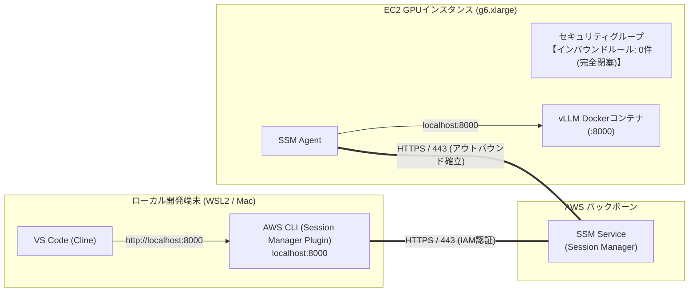

## はじめに

前回の記事（[EC2スポットインスタンス×vLLMでGPUコストを大幅削減する](/blogs/2026/10/02/vllm_spot_instance/)）では、時差・価格・中断耐性を加味した「マルチリージョン総合優先度自動選定」を導入し、`g6.xlarge`（NVIDIA L4 24GB）を1時間あたり約80〜90円という格安価格でスポット調達する仕組みを構築しました。

これにより、高価なクラウドGPUを個人の手元から「使いたい時だけサッと起動し、終わったら即座に破棄する」エフェメラルな開発スタイルが確立できました。

しかし、第3回までの運用構成には、セキュリティおよび運用の観点で**看過できない2つの課題**が残っていました：

1. **ポート22（SSH）の開放リスク**: インスタンスへのアクセスにSSHトンネル（ポート8000転送）を使用していたため、セキュリティグループでインバウンドのポート22を許可する必要がありました。IP制限をかけているとはいえ、自宅・オフィス・リモートワーク環境でグローバルIPが変わるたびにセキュリティグループの更新が必要になり、運用が煩雑でした。
2. **SSH秘密鍵（`.pem`）の管理負荷**: 探索対象の複数リージョン（東京、オレゴン、バージニア等）それぞれにキーペアを事前作成し、ローカルに秘密鍵ファイルを安全に保持・管理する必要がありました。

そこで今回は、AWSのマネージドサービスである **「AWS Systems Manager (SSM) Session Manager」のポートフォワーディング機能** を導入します。

EC2セキュリティグループの **インバウンドルールを完全に空（ポート開放ゼロ）** にしたまま、ローカルPCのポート8000とEC2上のvLLM（ポート8000）を安全にトンネリングし、SSH秘密鍵の管理を完全に撤廃する手法を詳しく解説します。

:::info
**📚 関連する過去の検証記事**
* **第1回（基本構成）**: [AWS×UserDataでvLLMを自動起動！停止時コストほぼゼロのローカルLLM環境](/blogs/2026/09/16/vllm_autolaunch/)
* **第2回（Cline連携）**: [自前vLLMをOpen WebUI経由でVS Code（Cline）に接続！トークンフリーで開発する](/blogs/2026/09/29/vllm_openwebui_cline/)
* **第3回（スポット活用）**: [EC2スポットインスタンス×vLLMでGPUコストを大幅削減する](/blogs/2026/10/02/vllm_spot_instance/)
:::

---

## なぜSSHからSSMポートフォワーディングへ移行するのか？

> **📌 このセクションの要点**  
> SSMポートフォワーディングを採用することで、「インバウンド全閉塞（ポート開放ゼロ）」と「SSH秘密鍵の完全撤廃」を同時に実現できます。接続の認可はAWS IAMで一元管理され、CloudTrailによる監査ログも自動で残ります。

### 1. ポート開放ゼロ（インバウンド許可一切不要）

従来のSSH接続では、EC2のセキュリティグループでインバウンドポート22を許可する必要がありました。

しかし、SSM Session Managerは**EC2インスタンス内部で稼働する「SSM Agent」が、AWSのSSMエンドポイントに対して外向き（アウトバウンド HTTPS/443）にWebSocketセッションを張りに行く**アーキテクチャを採用しています。



これにより、EC2セキュリティグループのインバウンドルールは **1つも存在しない（インバウンド0件）** 状態にできます。インターネット側からのポートスキャンやブルートフォース攻撃をネットワーク的に遮断し、インバウンドの攻撃面（アタックサーフェス）を最小化できます。

### 2. SSH秘密鍵（`.pem`）の完全撤廃

第3回のようにオレゴンやバージニアなど複数リージョンへインスタンスを立ち上げる場合、リージョンごとにキーペアを作成して手元のマシンに秘密鍵を保管しておく必要がありました。鍵のローテーションや紛失リスク、誤ってGitへコミットしてしまうリスクなど、鍵管理の心理的負荷は小さくありません。

SSMポートフォワーディングを利用する場合、認証・認可はすべて**AWS IAM**に統合されます。
開発者が手元の端末で `aws configure` や SSO（IAM Identity Center）で設定したAWS認証情報（アクセスキーやセッショントークン）を使ってセッションを開始するため、**SSH秘密鍵は1つも必要ありません**。

### 3. SSH接続とSSMポートフォワーディングの比較

| 項目 | 従来のSSHトンネル (第3回) | SSMポートフォワーディング (今回) | メリット |
| :--- | :--- | :--- | :--- |
| **インバウンドポート** | ポート 22 を開放必須 | **完全閉塞（ポート開放ゼロ）** | インターネットからのインバウンド直接侵入経路を排除 |
| **接続元IP制限** | 自宅/オフィスのIP変更時にSG修正が必要 | **不要**（IAM認証で保護） | リモートワークでもIP変更作業がゼロに |
| **鍵管理** | リージョンごとの `.pem` 秘密鍵の保管・管理が必要 | **不要（鍵レス）** | 秘密鍵自体の保管・ローテーション管理が不要に |
| **監査ログ** | SSH接続ログをサーバー内に収集する設定が必要 | **CloudTrail / CloudWatch** に自動記録 | いつ誰がセッションを開始したか証跡が残る |
| **マルチリージョン展開** | リージョンごとにKeyName作成が必要 | **全リージョン共通で追加設定不要** | スクリプトの可搬性と自動化が容易 |

---

## 前提条件とローカル環境の準備

SSMポートフォワーディングを使用するには、ローカルマシンに `session-manager-plugin` をインストールしておく必要があります。

### Session Manager Pluginのインストール

まだインストールしていない場合は、AWS公式ドキュメントに従ってインストールします。

**Ubuntu / WSL2 の場合:**
```bash
curl "https://s3.amazonaws.com/session-manager-downloads/plugin/latest/ubuntu_64bit/session-manager-plugin.deb" -o "session-manager-plugin.deb"
sudo dpkg -i session-manager-plugin.deb
rm session-manager-plugin.deb
```

**macOS (Homebrew) の場合:**
```bash
brew install --cask session-manager-plugin
```

**Windowsの場合:**
```powershell
winget install Amazon.SessionManagerPlugin
```

インストール後、以下のコマンドでバージョン情報が表示されれば準備完了です：
```bash
session-manager-plugin
# 出力例: The Session Manager plugin is installed successfully. Use the AWS CLI to start a session.
```

---

## AWSリソースの事前セットアップ

SSM経由での接続を実現するために、各リージョンに以下の2つのリソースを準備します：

1. **IAMインスタンスプロファイル**: EC2がSSMエージェントを通じてAWS SSMサービスと通信するためのIAMロール（`AmazonSSMManagedInstanceCore` ポリシーを含む）。
2. **インバウンド全閉塞セキュリティグループ**: インバウンドルールが0件で、アウトバウンドのみ許可されたセキュリティグループ（`vllm-ssm-isolated-sg`）。

これらを一括作成するセットアップスクリプトを用意しました。

<details><summary>00_setup_ssm_assets.sh（クリックで展開）</summary>

```bash
#!/bin/bash
set -euo pipefail

# ==============================================================================
# 00_setup_ssm_assets.sh
# SSMポートフォワーディング用のIAMロールおよびインバウンド全閉塞SGを各リージョンに作成する
# ==============================================================================

ROLE_NAME="vllm-ssm-instance-role"
PROFILE_NAME="vllm-ssm-instance-profile"
SG_NAME="vllm-ssm-isolated-sg"
REGIONS=("ap-northeast-1" "us-west-2" "us-east-1" "us-east-2" "eu-central-1")

echo "=== 1. IAMロール & インスタンスプロファイルの作成 ==="

# 信頼ポリシー (EC2)
TRUST_POLICY='{
  "Version": "2012-10-17",
  "Statement": [
    {
      "Effect": "Allow",
      "Principal": { "Service": "ec2.amazonaws.com" },
      "Action": "sts:AssumeRole"
    }
  ]
}'

if ! aws iam get-role --role-name "${ROLE_NAME}" >/dev/null 2>&1; then
    echo "IAMロール ${ROLE_NAME} を作成中..."
    aws iam create-role --role-name "${ROLE_NAME}" --assume-role-policy-document "${TRUST_POLICY}"
    
    # SSM管理ポリシーの付与
    aws iam attach-role-policy --role-name "${ROLE_NAME}" \
        --policy-arn "arn:aws:iam::aws:policy/AmazonSSMManagedInstanceCore"
    # S3モデル読み取り権限
    aws iam attach-role-policy --role-name "${ROLE_NAME}" \
        --policy-arn "arn:aws:iam::aws:policy/AmazonS3ReadOnlyAccess"
    # ECRコンテナ読み取り権限
    aws iam attach-role-policy --role-name "${ROLE_NAME}" \
        --policy-arn "arn:aws:iam::aws:policy/AmazonEC2ContainerRegistryReadOnly"
else
    echo "IAMロール ${ROLE_NAME} は既に存在します。"
fi

if ! aws iam get-instance-profile --instance-profile-name "${PROFILE_NAME}" >/dev/null 2>&1; then
    echo "インスタンスプロファイル ${PROFILE_NAME} を作成中..."
    aws iam create-instance-profile --instance-profile-name "${PROFILE_NAME}"
    aws iam add-role-to-instance-profile --instance-profile-name "${PROFILE_NAME}" --role-name "${ROLE_NAME}"
    echo "IAMインスタンスプロファイルの反映待機中 (10秒)..."
    sleep 10
else
    echo "インスタンスプロファイル ${PROFILE_NAME} は既に存在します。"
fi

echo "=== 2. 各リージョンでの インバウンド全閉塞セキュリティグループ作成 ==="
for REGION in "${REGIONS[@]}"; do
    echo "リージョン [${REGION}] を確認中..."
    VPC_ID=$(aws ec2 describe-vpcs --region "${REGION}" --filters "Name=is-default,Values=true" --query "Vpcs[0].VpcId" --output text)
    
    EXISTING_SG=$(aws ec2 describe-security-groups --region "${REGION}" --filters "Name=group-name,Values=${SG_NAME}" --query "SecurityGroups[0].GroupId" --output text 2>/dev/null || true)
    
    if [ -z "${EXISTING_SG}" ] || [ "${EXISTING_SG}" = "None" ]; then
        echo "  ${SG_NAME} を VPC (${VPC_ID}) に作成中..."
        SG_ID=$(aws ec2 create-security-group \
            --region "${REGION}" \
            --group-name "${SG_NAME}" \
            --description "Zero-inbound security group for vLLM SSM port forwarding" \
            --vpc-id "${VPC_ID}" \
            --query "GroupId" --output text)
        
        # デフォルトで全アウトバウンドは許可されるため、インバウンドルールは何も追加しない（ポート開放ゼロ）
        echo "  作成完了: ${SG_ID} (インバウンドルール: 0件)"
    else
        echo "  既に存在します: ${EXISTING_SG}"
    fi
done

echo "事前準備が完了しました！"
```

</details>

このスクリプトを実行すると、各リージョンにインバウンドルールが1つもないセキュリティグループ `vllm-ssm-isolated-sg` と、SSM通信が許可されたインスタンスプロファイル `vllm-ssm-instance-profile` が作成されます。

---

## 起動スクリプトのSSM対応

第3回の起動スクリプト（`01_ec2_launch_spot_and_sync_openwebui.sh`）から、SSH接続部分をSSMポートフォワーディングへと置き換えたスクリプト（`01_start_vllm_ssm.sh`）を作成します。

### 主な変更ポイント

1. **SSHキーの指定を削除**:
   - `aws ec2 run-instances` に渡していた `--key-name` パラメータを完全に削除します。
2. **IAMインスタンスプロファイルとインバウンド全閉塞SGを指定**:
   - `--iam-instance-profile Name=vllm-ssm-instance-profile` を追加。
   - `--security-group-ids` に `vllm-ssm-isolated-sg` を指定。
3. **SSMエージェントのオンライン待機**:
   - 以前はSSHポート22の応答を `nc -z` でループ待機していましたが、今回はAWS SSM API（`aws ssm describe-instance-information`）を呼び出し、`PingStatus == "Online"` になるまで待機します。
4. **SSMポートフォワーディングセッションの確立**:
   - `aws ssm start-session` でポートフォワーディングを開始し、バックグラウンド実行します。

```bash
aws ssm start-session \
    --region "${AWS_REGION}" \
    --target "${INSTANCE_ID}" \
    --document-name AWS-StartPortForwardingSession \
    --parameters '{"portNumber":["8000"],"localPortNumber":["8000"]}'
```

### 完全なスクリプト: `01_start_vllm_ssm.sh`

<details><summary>01_start_vllm_ssm.sh（クリックで展開）</summary>

```bash
#!/bin/bash
set -euo pipefail

# ==============================================================================
# 01_start_vllm_ssm.sh
# スポットインスタンスを探索・起動し、SSMポートフォワーディングで安全に直結する
# ==============================================================================

SCRIPT_DIR="$(cd "$(dirname "${BASH_SOURCE[0]}")" && pwd)"
USER_DATA_FILE="${USER_DATA_FILE:-${SCRIPT_DIR}/02_ec2_userdata.sh}"
INSTANCE_STATE_FILE="${SCRIPT_DIR}/.current_instance_id"
TUNNEL_PID_FILE="${SCRIPT_DIR}/.current_tunnel_pid"
REGION_STATE_FILE="${SCRIPT_DIR}/.current_region"
TUNNEL_LOG="${SCRIPT_DIR}/.current_tunnel.log"

CANDIDATE_REGIONS=("ap-northeast-1" "us-west-2" "us-east-1" "us-east-2" "eu-central-1")
CANDIDATE_INSTANCE_TYPES=("g6.xlarge")
IAM_PROFILE_NAME="vllm-ssm-instance-profile"
SG_NAME="vllm-ssm-isolated-sg"
EBS_SIZE_GB="40"

echo "=== 1. マルチリージョン スポット総合優先度探索 ==="
ITYPE="${CANDIDATE_INSTANCE_TYPES[0]}"
START_TIME="$(date -u +%Y-%m-%dT%H:%M:%SZ)"

# Spot Advisor 中断頻度の取得
declare -A REGION_INTR_TIERS
PY_BIN=""
command -v python3 >/dev/null 2>&1 && PY_BIN="python3" || (command -v python >/dev/null 2>&1 && PY_BIN="python")
if [ -n "${PY_BIN}" ]; then
    ADVISOR_DATA=$("${PY_BIN}" -c "
import urllib.request, json
try:
    with urllib.request.urlopen('https://spot-bid-advisor.s3.amazonaws.com/spot-advisor-data.json', timeout=4) as res:
        adv = json.loads(res.read()).get('spot_advisor', {})
        for r, info in adv.items():
            print(f'{r}:{info.get(\"Linux\", {}).get(\"${ITYPE}\", {}).get(\"r\", 4)}')
except Exception: pass
" 2>/dev/null || true)
    while IFS=':' read -r r_id r_tier; do
        r_id=$(echo "${r_id}" | tr -d '[:space:]')
        r_tier=$(echo "${r_tier}" | tr -d '[:space:]')
        [ -n "${r_id}" ] && REGION_INTR_TIERS["${r_id}"]="${r_tier}"
    done <<< "${ADVISOR_DATA}"
fi

declare -A REG_STATUS REG_MIN_PRICES REG_AZ_COUNTS REG_SCORES REG_RANKS
BEST_PRICE="999.0"

for REGION in "${CANDIDATE_REGIONS[@]}"; do
    RAW_PRICES=$(aws ec2 describe-spot-price-history \
        --region "${REGION}" \
        --instance-types "${ITYPE}" \
        --product-descriptions "Linux/UNIX" \
        --start-time "${START_TIME}" \
        --no-paginate \
        --query 'SpotPriceHistory[*].[AvailabilityZone, SpotPrice]' \
        --output text 2>/dev/null | tr -d '\r' || true)

    if [ -z "${RAW_PRICES}" ]; then
        REG_STATUS["${REGION}"]="unavailable"
        continue
    fi

    REG_MIN_PRICE="999.0"
    AZ_COUNT=0
    while read -r AZ PRICE; do
        AZ=$(echo "${AZ}" | tr -d '[:space:]')
        PRICE=$(echo "${PRICE}" | tr -d '[:space:]')
        [ -z "${AZ}" ] || [ -z "${PRICE}" ] && continue
        AZ_COUNT=$((AZ_COUNT + 1))
        if awk -v p="${PRICE}" -v m="${REG_MIN_PRICE}" 'BEGIN {exit !(p < m)}' 2>/dev/null; then
            REG_MIN_PRICE="${PRICE}"
        fi
    done <<< "${RAW_PRICES}"

    if [ "${REG_MIN_PRICE}" = "999.0" ]; then
        REG_STATUS["${REGION}"]="unavailable"
        continue
    fi

    REG_STATUS["${REGION}"]="ok"
    REG_MIN_PRICES["${REGION}"]="${REG_MIN_PRICE}"
    REG_AZ_COUNTS["${REGION}"]="${AZ_COUNT}"

    if awk -v p="${REG_MIN_PRICE}" -v m="${BEST_PRICE}" 'BEGIN {exit !(p < m)}' 2>/dev/null; then
        BEST_PRICE="${REG_MIN_PRICE}"
    fi
done

# スコア計算 (価格 40点 + 余剰AZ数 40点 + 中断頻度 20点 = 100点満点)
for REGION in "${CANDIDATE_REGIONS[@]}"; do
    if [ "${REG_STATUS[${REGION}]:-}" != "ok" ]; then
        echo "  - [${REGION}]: 在庫なしまたは未提供"
        continue
    fi

    PRICE="${REG_MIN_PRICES[${REGION}]}"
    TIER="${REGION_INTR_TIERS[${REGION}]:-4}"
    AZ_COUNT="${REG_AZ_COUNTS[${REGION}]}"

    # 価格スコア (最大40点)
    P_SCORE=$(awk -v min="${BEST_PRICE}" -v cur="${PRICE}" 'BEGIN {printf "%.0f", 40.0 * (min / cur)}')

    # 中断頻度スコア (最大20点)
    case "${TIER}" in
        0) I_SCORE=20; I_TEXT="< 5% (極低)" ;;
        1) I_SCORE=15; I_TEXT="5-10% (低)" ;;
        2) I_SCORE=10; I_TEXT="10-15% (中)" ;;
        3) I_SCORE=5;  I_TEXT="15-20% (中高)" ;;
        *) I_SCORE=0;  I_TEXT="> 20% (高)" ;;
    esac

    # キャパシティスコア (最大40点)
    if [ "${AZ_COUNT}" -ge 5 ]; then C_SCORE=40
    elif [ "${AZ_COUNT}" -eq 4 ]; then C_SCORE=32
    elif [ "${AZ_COUNT}" -eq 3 ]; then C_SCORE=24
    elif [ "${AZ_COUNT}" -eq 2 ]; then C_SCORE=16
    else C_SCORE=8
    fi

    TOTAL_SCORE=$(( P_SCORE + I_SCORE + C_SCORE ))
    REG_SCORES["${REGION}"]="${TOTAL_SCORE}"

    if [ "${TOTAL_SCORE}" -ge 75 ]; then RANK="Rank S"
    elif [ "${TOTAL_SCORE}" -ge 65 ]; then RANK="Rank A"
    elif [ "${TOTAL_SCORE}" -ge 50 ]; then RANK="Rank B"
    else RANK="Rank C"
    fi
    REG_RANKS["${REGION}"]="${RANK}"

    PRICE_FMT=$(awk -v p="${PRICE}" 'BEGIN {printf "%.4f", p}')
    echo "  - [${REGION}] 価格=\$${PRICE_FMT}/h, 中断率=${I_TEXT}, 余剰AZ=${AZ_COUNT} -> 総合スコア: ${TOTAL_SCORE}点 (${RANK})"
done

# スコア順にソート (降順)
SORTED_REGIONS=($(for r in "${!REG_SCORES[@]}"; do echo "$r ${REG_SCORES[$r]}"; done | sort -k2 -nr | awk '{print $1}'))

echo "----------------------------------------------------------"
echo "総合優先度ランキング:"
for i in "${!SORTED_REGIONS[@]}"; do
    r="${SORTED_REGIONS[$i]}"
    echo "  第$((i+1))位: ${r} (${REG_RANKS[$r]} / スコア: ${REG_SCORES[$r]}点, 最安: \$${REG_MIN_PRICES[$r]}/h)"
done
echo "----------------------------------------------------------"

# --- 2. スポットインスタンス起動試行 ---
echo "=== 2. スポットインスタンス起動試行 ==="
SELECTED_REGION=""
INSTANCE_ID=""

for REGION in "${SORTED_REGIONS[@]}"; do
    echo "リージョン [${REGION}] でスポット起動を試行中..."
    
    # インバウンド全閉塞SGのID取得
    SG_ID=$(aws ec2 describe-security-groups --region "${REGION}" --filters "Name=group-name,Values=${SG_NAME}" --query "SecurityGroups[0].GroupId" --output text 2>/dev/null || true)
    if [ -z "${SG_ID}" ] || [ "${SG_ID}" = "None" ]; then
        echo "  警告: ${REGION} に ${SG_NAME} が見つかりません。スキップします。"
        continue
    fi

    # Ubuntu 22.04 Deep Learning AMI (NVIDIA Driver & Docker導入済み) の動的取得
    AMI_ID=$(aws ec2 describe-images \
        --region "${REGION}" \
        --owners amazon \
        --filters "Name=name,Values=Deep Learning OSS Nvidia Driver AMI GPU PyTorch * (Ubuntu 22.04)*" "Name=state,Values=available" \
        --query 'sort_by(Images, &CreationDate)[-1].ImageId' \
        --output text 2>/dev/null || true)

    # UserDataの読み込みと環境変数の正確な注入
    AWS_ACCOUNT_ID=$(aws sts get-caller-identity --query Account --output text 2>/dev/null || echo "")
    S3_BUCKET_NAME="my-vllm-models-hackathon-2026-${AWS_ACCOUNT_ID}-${REGION}-an"
    DOCKER_IMAGE="${AWS_ACCOUNT_ID}.dkr.ecr.${REGION}.amazonaws.com/vllm-openai:latest"
    TMP_USERDATA=$(mktemp)
    sed -e "s|^AWS_REGION=.*|AWS_REGION=\"${REGION}\"|" \
        -e "s|^S3_BUCKET_NAME=.*|S3_BUCKET_NAME=\"${S3_BUCKET_NAME}\"|" \
        -e "s|^DOCKER_IMAGE=.*|DOCKER_IMAGE=\"${DOCKER_IMAGE}\"|" \
        "${USER_DATA_FILE}" > "${TMP_USERDATA}"

    LAUNCH_RES=$(aws ec2 run-instances \
        --region "${REGION}" \
        --image-id "${AMI_ID}" \
        --instance-type "${ITYPE}" \
        --iam-instance-profile Name="${IAM_PROFILE_NAME}" \
        --security-group-ids "${SG_ID}" \
        --instance-market-options '{"MarketType":"spot","SpotOptions":{"SpotInstanceType":"one-time","InstanceInterruptionBehavior":"terminate"}}' \
        --block-device-mappings "[{\"DeviceName\":\"/dev/sda1\",\"Ebs\":{\"VolumeSize\":${EBS_SIZE_GB},\"VolumeType\":\"gp3\",\"DeleteOnTermination\":true}}]" \
        --user-data "file://${TMP_USERDATA}" \
        --tag-specifications "ResourceType=instance,Tags=[{Key=Name,Value=vllm-ssm-spot-node}]" \
        --query "Instances[0].InstanceId" \
        --output text 2>&1 || true)
    rm -f "${TMP_USERDATA}"

    if [[ "${LAUNCH_RES}" =~ ^i-[0-9a-f]+$ ]]; then
        INSTANCE_ID="${LAUNCH_RES}"
        SELECTED_REGION="${REGION}"
        echo "  起動成功！ Instance ID: ${INSTANCE_ID} (${SELECTED_REGION})"
        break
    else
        echo "  キャパシティ不足またはエラーのためスキップ: ${LAUNCH_RES}"
    fi
done

if [ -z "${INSTANCE_ID}" ]; then
    echo "エラー: 全候補リージョンでスポット起動に失敗しました。"
    exit 1
fi

echo "${INSTANCE_ID}" > "${INSTANCE_STATE_FILE}"
echo "${SELECTED_REGION}" > "${REGION_STATE_FILE}"

echo "インスタンスが running 状態になるのを待機中..."
aws ec2 wait instance-running --region "${SELECTED_REGION}" --instance-ids "${INSTANCE_ID}"

# Git Bash環境向けにSessionManagerPluginのパスを追加
if [ -d "/c/Program Files/Amazon/SessionManagerPlugin/bin" ]; then
    export PATH="${PATH}:/c/Program Files/Amazon/SessionManagerPlugin/bin"
fi

# --- 3. SSMエージェントのオンライン待機 ---
echo "=== 3. SSMエージェントのオンライン待機 ==="
echo "EC2インスタンス内部のSSM Agentが接続されるのを待機中..."
SSM_OK=false
for i in {1..30}; do
    STATUS=$(aws ssm describe-instance-information \
        --region "${SELECTED_REGION}" \
        --filters "Key=InstanceIds,Values=${INSTANCE_ID}" \
        --query "InstanceInformationList[0].PingStatus" \
        --output text 2>/dev/null || true)
    
    if [ "${STATUS}" = "Online" ]; then
        echo " SSM Agent が Online になりました！ (${i}回目の試行)"
        SSM_OK=true
        break
    fi
    echo -n "."
    sleep 3
done
echo ""

if [ "${SSM_OK}" != "true" ]; then
    echo "エラー: SSM Agent が Online になりませんでした。IAMロールやアウトバウンド通信を確認してください。"
    exit 1
fi

# --- 4. サーバー側での vLLM 起動待機 (S3モデルDL・コンテナ起動) ---
echo "=== 4. サーバー側での vLLM 起動待機 (http://127.0.0.1:8000/health) ==="
echo "UserDataによるS3モデルダウンロードとvLLM起動を待機しています（通常2〜4分程度）..."
SERVER_READY=false
for i in {1..90}; do
    CMD_ID=$(aws ssm send-command \
        --region "${SELECTED_REGION}" \
        --instance-ids "${INSTANCE_ID}" \
        --document-name "AWS-RunShellScript" \
        --parameters 'commands=["curl -s -m 2 http://127.0.0.1:8000/health >/dev/null && echo OK || echo WAITING"]' \
        --query "Command.CommandId" \
        --output text 2>/dev/null || true)
    
    if [ -n "${CMD_ID}" ]; then
        sleep 2
        RES=$(aws ssm get-command-invocation \
            --region "${SELECTED_REGION}" \
            --command-id "${CMD_ID}" \
            --instance-id "${INSTANCE_ID}" \
            --query "StandardOutputContent" \
            --output text 2>/dev/null || true)
        if [[ "${RES}" =~ "OK" ]]; then
            echo " サーバー側の vLLM が正常に応答しました！"
            SERVER_READY=true
            break
        fi
    fi
    echo -n "."
    sleep 5
done
echo ""

if [ "${SERVER_READY}" != "true" ]; then
    echo "警告: サーバー側のvLLM起動待機がタイムアウトしました。UserDataログを確認してください。"
fi

# --- 5. 既存トンネルの整理と新規SSMポートフォワーディング確立 ---
echo "=== 5. SSMポートフォワーディングの確立 (ポート開放不要トンネル) ==="
if [ -f "${TUNNEL_PID_FILE}" ]; then
    OLD_PID=$(cat "${TUNNEL_PID_FILE}" | tr -d '[:space:]')
    if [ -n "${OLD_PID}" ] && ps -p "${OLD_PID}" > /dev/null 2>&1; then
        echo "古いポートフォワードプロセス (PID: ${OLD_PID}) を終了します..."
        kill -9 "${OLD_PID}" 2>/dev/null || true
    fi
    rm -f "${TUNNEL_PID_FILE}"
fi
pkill -f "AWS-StartPortForwardingSession.*8000" 2>/dev/null || true

# バックグラウンドでSSMポートフォワーディングを開始（ログを .current_tunnel.log に出力）
nohup aws ssm start-session \
    --region "${SELECTED_REGION}" \
    --target "${INSTANCE_ID}" \
    --document-name AWS-StartPortForwardingSession \
    --parameters '{"portNumber":["8000"],"localPortNumber":["8000"]}' \
    > "${TUNNEL_LOG}" 2>&1 &

TUNNEL_PID=$!
echo "${TUNNEL_PID}" > "${TUNNEL_PID_FILE}"
echo "SSMポートフォワーディングを開始しました (PID: ${TUNNEL_PID})"
sleep 2

# --- 6. ローカル疎通確認 ---
echo "=== 6. ローカル疎通確認 (http://localhost:8000/health) ==="
LOCAL_OK=false
for i in {1..10}; do
    if curl -s -m 3 "http://localhost:8000/health" > /dev/null 2>&1; then
        echo " ローカルからの直結疎通を確認しました！ (HTTP 200 OK)"
        LOCAL_OK=true
        break
    fi
    echo -n "."
    sleep 2
done
echo ""

if [ "${LOCAL_OK}" != "true" ]; then
    echo "警告: ローカル接続に失敗しました。トンネルログを確認してください:"
    cat "${TUNNEL_LOG}" 2>/dev/null || true
fi

echo "=========================================================="
echo " ポート開放ゼロ SSM環境の起動が完了しました！"
echo " EC2 Instance ID : ${INSTANCE_ID} (Spot, Region: ${SELECTED_REGION})"
echo " セキュリティ      : インバウンドルール 0件（完全閉塞）"
echo " トンネル接続      : localhost:8000 -> EC2:8000 (SSM暗号化)"
echo " Web UI / API    : http://localhost:8000/v1"
echo ""
echo " VS Code の Cline から接続してください (Base URL: http://localhost:8000/v1)"
echo " 検証終了時は以下のコマンドで完全破棄してください:"
echo "   ./02_stop_vllm_ssm.sh"
echo "=========================================================="
```

</details>

---

## 実際に動かしてみる

### 1. スクリプトの実行

スクリプトを実行すると、マルチリージョン探索、スポットインスタンスの起動、SSMエージェントの接続待機、サーバー側vLLM起動待機、ポートフォワーディングの確立がすべて全自動で進みます。

```bash
$ ./01_start_vllm_ssm.sh
=== 1. マルチリージョン スポット総合優先度探索 ===
  - [ap-northeast-1] 価格=$0.5510/h, 中断率=< 5% (極低), 余剰AZ=3 -> 総合スコア: 72点 (Rank A)
  - [us-west-2] 価格=$0.3850/h, 中断率=< 5% (極低), 余剰AZ=4 -> 総合スコア: 92点 (Rank S)
  - [us-east-1] 価格=$0.5830/h, 中断率=5-10% (低), 余剰AZ=6 -> 総合スコア: 81点 (Rank S)
  - [us-east-2] 価格=$0.4210/h, 中断率=< 5% (極低), 余剰AZ=3 -> 総合スコア: 80点 (Rank S)
  - [eu-central-1] 価格=$0.4120/h, 中断率=< 5% (極低), 余剰AZ=3 -> 総合スコア: 81点 (Rank S)
----------------------------------------------------------
総合優先度ランキング:
  第1位: us-west-2 (Rank S / スコア: 92点, 最安: $0.3850/h)
  第2位: us-east-1 (Rank S / スコア: 81点, 最安: $0.5830/h)
  第3位: eu-central-1 (Rank S / スコア: 81点, 最安: $0.4120/h)
  第4位: us-east-2 (Rank S / スコア: 80点, 最安: $0.4210/h)
  第5位: ap-northeast-1 (Rank A / スコア: 72点, 最安: $0.5510/h)
----------------------------------------------------------
=== 2. スポットインスタンス起動試行 ===
リージョン [us-west-2] でスポット起動を試行中...
  起動成功！ Instance ID: i-0abc12345678def01 (us-west-2)
インスタンスが running 状態になるのを待機中...

=== 3. SSMエージェントのオンライン待機 ===
EC2インスタンス内部のSSM Agentが接続されるのを待機中...
..... SSM Agent が Online になりました！ (5回目の試行)

=== 4. サーバー側での vLLM 起動待機 (http://127.0.0.1:8000/health) ===
UserDataによるS3モデルダウンロードとvLLM起動を待機しています（通常2〜4分程度）...
................................ サーバー側の vLLM が正常に応答しました！

=== 5. SSMポートフォワーディングの確立 (ポート開放不要トンネル) ===
SSMポートフォワーディングを開始しました (PID: 41820)

=== 6. ローカル疎通確認 (http://localhost:8000/health) ===
 ローカルからの直結疎通を確認しました！ (HTTP 200 OK)

==========================================================
 ポート開放ゼロ SSM環境の起動が完了しました！
 EC2 Instance ID : i-0abc12345678def01 (Spot, Region: us-west-2)
 セキュリティ      : インバウンドルール 0件（完全閉塞）
 トンネル接続      : localhost:8000 -> EC2:8000 (SSM暗号化)
 Web UI / API    : http://localhost:8000/v1

 VS Code の Cline から接続してください (Base URL: http://localhost:8000/v1)
 検証終了時は以下のコマンドで完全破棄してください:
   ./02_stop_vllm_ssm.sh
==========================================================
```

### 2. インバウンドルール0件の確認

AWSマネジメントコンソールやAWS CLIで対象インスタンスのセキュリティグループを確認してみます。

```bash
$ aws ec2 describe-security-groups \
    --region us-west-2 \
    --filters "Name=group-name,Values=vllm-ssm-isolated-sg" \
    --query "SecurityGroups[0].IpPermissions"
[]
```

出力は `[]`、つまり**インバウンドルールは1件も登録されていません**。

外部から一切の着信ポートが存在しないにもかかわらず、手元の端末からは `http://localhost:8000/v1/models` で普通にモデル情報が取得できます：

```bash
$ curl -s http://localhost:8000/v1/models | jq .data[0].id
"Qwen/Qwen2.5-Coder-14B-Instruct-AWQ"
```

外部に対するインバウンドポートを一切開けずに手元から透過的に直結できる体験は、従来のSSH運用と比べても管理負荷とセキュリティの両面で大きなメリットがあります。

---

## 検証終了時の完全破棄スクリプト

作業が終わったら、破棄スクリプト（`02_stop_vllm_ssm.sh`）を実行してリソースを解放します。

<details><summary>02_stop_vllm_ssm.sh（クリックで展開）</summary>

```bash
#!/bin/bash
set -euo pipefail

# ==============================================================================
# 02_stop_vllm_ssm.sh
# SSMポートフォワードプロセスを終了し、スポットインスタンスを完全破棄する
# ==============================================================================

SCRIPT_DIR="$(cd "$(dirname "${BASH_SOURCE[0]}")" && pwd)"
INSTANCE_STATE_FILE="${SCRIPT_DIR}/.current_instance_id"
TUNNEL_PID_FILE="${SCRIPT_DIR}/.current_tunnel_pid"
REGION_STATE_FILE="${SCRIPT_DIR}/.current_region"
TUNNEL_LOG="${SCRIPT_DIR}/.current_tunnel.log"

AWS_REGION=$(cat "${REGION_STATE_FILE}" 2>/dev/null | tr -d '[:space:]' || echo "ap-northeast-1")
INSTANCE_ID=$(cat "${INSTANCE_STATE_FILE}" 2>/dev/null | tr -d '[:space:]' || echo "${1:-}")

# 1. SSMポートフォワードプロセスの終了
echo "=== 1. SSMポートフォワードプロセスの終了 ==="
if [ -f "${TUNNEL_PID_FILE}" ]; then
    TUNNEL_PID=$(cat "${TUNNEL_PID_FILE}" | tr -d '[:space:]')
    if [ -n "${TUNNEL_PID}" ] && ps -p "${TUNNEL_PID}" > /dev/null 2>&1; then
        echo "SSMポートフォワードプロセス (PID: ${TUNNEL_PID}) を終了中..."
        kill -9 "${TUNNEL_PID}" 2>/dev/null || true
    fi
    rm -f "${TUNNEL_PID_FILE}"
fi
pkill -f "AWS-StartPortForwardingSession.*8000" 2>/dev/null || true

# 2. EC2インスタンスの完全終了 (Terminate)
if [ -n "${INSTANCE_ID}" ]; then
    echo "=== 2. EC2インスタンスの完全終了 (Terminate) ==="
    echo "対象インスタンスID: ${INSTANCE_ID} (${AWS_REGION})"
    aws ec2 terminate-instances --region "${AWS_REGION}" --instance-ids "${INSTANCE_ID}" --output table
    echo "インスタンスの終了完了を待機中..."
    aws ec2 wait instance-terminated --region "${AWS_REGION}" --instance-ids "${INSTANCE_ID}"
fi

rm -f "${INSTANCE_STATE_FILE}" "${REGION_STATE_FILE}" "${TUNNEL_LOG}"
echo "=========================================================="
echo " スポットインスタンス、EBSボリューム、SSMトンネルの完全破棄が完了しました！"
echo "=========================================================="
```

</details>

実行すると、バックグラウンドのポートフォワーディングプロセスが終了し、EC2インスタンスとEBSがTerminateされ、これ以降の課金は完全にストップします。

---

## まとめ

今回は、第3回で構築した「マルチリージョン・スポットvLLM環境」の通信レイヤーを根本から見直し、**AWS Systems Manager Session Managerによるポートフォワーディング**へと刷新しました。

* **ポート開放ゼロ（インバウンド全閉塞）の達成**: セキュリティグループのインバウンド許可を完全に撤廃し、不特定多数からのポートスキャンや直接攻撃のリスクを遮断。
* **SSH鍵管理の完全撤廃**: リージョンごとの鍵ペア作成や `.pem` ファイルの管理・配布・紛失リスクから完全に解放。
* **IAMによる認可と監査**: AWS認証情報に基づくアクセス制御とCloudTrailによるセッション開始ログの取得により、企業ユースでも求められるアクセス統制とセッション監査ログの取得に対応。
* **使い勝手は変わらず快適**: ローカルPC上ではこれまで通り `localhost:8000` にアクセスするだけで、Open WebUIやClineからの透過的な推論が可能。

セキュリティと運用利便性の双方を大きく向上させた強固な基盤が整いました。
低コストなスポットGPUをさらにセキュアに活用したい方の参考になれば幸いです。
