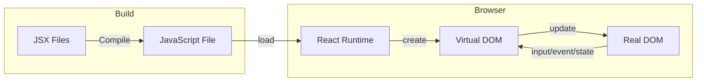
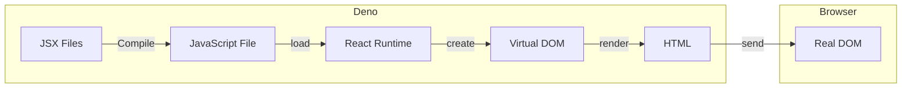

[前回](/deno/getting-started/02-use-external-packages/)からしばらく開いてしまいました。この間 Deno v1.26 がリリースされています。

今回は、Deno の有力なユースケースの1つである  Web アプリケーションの Server side rendering (SSR) について見ていきましょう。


## Deno の JSX サポートによる SSR
Deno は React の HTML ライク DSL である JSX による DOM 操作をサポートしています[^1]。JSX は JavaScript に事前コンパイルされブラウザ上で DOM 操作に使用されます(下記のフローでは、サーバーからの JavaScript などのアセット受信は省略しています)。

[^1]: Deno から React / preact など JSX ランタイムを使用することで実現しています。



DOM 操作はブラウザにとって静的 HTMLのレンダリングより高コストです。そこでサーバーサイドの Deno に JSX のコンパイルから HTML 生成までの処理をオフロードします。これでブラウザは静的 HTML のレンダリングをするだけになります。クライアントサイドでの DOM 操作はユーザーのアクションのたびに実行されますが、サーバーサイドの DOM 操作はリクエストからレスポンスまでの1度だけです。当然、クライアントでのインタラクティブ性は無くなります。



以前のブログ記事「[Fresh - Deno の 次世代 Web フレームワーク](https://developer.mamezou-tech.com/blogs/2022/07/04/fresh-deno-next-gen-web-framework/)」で紹介した Fresh も、Router や iland の仕組み以外の部分は preact のコードを処理して事前レンダリングを行なっています。

## Deno と preact による SSR の実装
Deno の HTTP Server と preact を使って SSR するサーバーを書いてみます。以下のような TSX ファイルを作成します。

- date.tsx
```typescript
/** @jsx h */
import { h } from "https://esm.sh/preact@10.11.2";
import { renderToString } from "https://esm.sh/preact-render-to-string@5.2.5";
import { serve } from "https://deno.land/std@0.160.0/http/server.ts";

function handler(_req: Request): Response {
  const page = (
    <div>
      <h1>Current time</h1>
      <p>{new Date().toLocaleString()}</p>
    </div>
  );
  const html = renderToString(page);
  return new Response(html, {
    headers: { "content-type": "text/html; charset=utf-8" },
  });
}

serve(handler);
```

リクエストを受けたら、preact と preact-render-to-string の API を使って page コンポーネントをレンダリングし、response に content-type のヘッダーをつけて、レンダリング結果の HTML を返します。

このコードを実行するには、以下のコマンドを入力します。`--watch` オプションを付けることで、ファイルの変更を検知して、サーバーを再起動してくれます。

```shell
deno run --allow-net=:8000 --watch date.tsx
```

ブラウザに送信されたコードを見ると以下のような静的な HTML になっています。

```html
<div><h1>Current time</h1><p>2022/10/20 17:10:10</p></div>
```

:::info
上記コードの1行目 `/** @jsx h */` はコンパイラに渡すプラグマで、preact の Virtual DOM API 呼び出しに変換されます。

```javascript
const page = h(
  'div',
  null,
  h(
    h('h1', null, 'Current time'),
    h('p', null, Date().toLocaleString())
  );
);
```

なお、Fresh 1.1 では preact の コンパイル設定は Fresh が面倒を見てくれるようになり、プラグマや import が不要になっています。

[Fresh 1.1 - automatic JSX, plugins, DevTools, and more](https://deno.com/blog/fresh-1.1#automatic-jsx)
:::

実用的なアプリケーションを作るには、Fresh のようなフレームワークを利用した方が効率はよいですが、ちょっとしたサイトを作って [Deno Deploy](https://deno.com/deploy) に置いたりするのには十分使えそうです。

## Import Maps と Task Runner の適用
date.tsx のコードは、import がごちゃついているし、deno のコマンドも長くてタイプが面倒です。そこで、deno.json と import_map.json を作成します。

deno.json には tasks として起動コマンドを書き、importMap の指定を書きます。

- deno.json
```json
{
  "tasks": {
    "start": "deno run --allow-net --watch date.tsx"
  },
  "importMap": "./import_map.json"
}
```

import_map.json には[前回](/deno/getting-started/02-use-external-packages/#import-maps-の利用)紹介した Import Maps で簡略名と URL のマップを作ります。

- import_map.json
```json
{
  "imports": {
    "preact": "https://esm.sh/preact@10.11.2",
    "preact-render-to-string": "https://esm.sh/*preact-render-to-string@5.2.5",
    "serve": "https://deno.land/std@0.160.0/http/server.ts"
  }
}
```

date.tsx の import はシンプルになります。

- date.tsx
```typescript
/** @jsx h */
import { h } from "preact";
import { renderToString } from "preact-render-to-string";
import { serve } from "serve";

function handler(_req: Request): Response {
  const page = (
    <div>
      <h1>Current time</h1>
      <p>{ new Date().toLocaleString() }</p>
    </div>
  );
  const html = renderToString(page);
  return new Response(html, {
    headers: { "content-type": "text/html; charset=utf-8" },
  });
}

serve(handler);
```

また、次のコマンドでサーバーを起動できるようになります。

```shell
deno task start
```

## チャートを SSR する

Fresh 専用ですが、[Chart.js](https://www.chartjs.org/) ベースのチャート作成ライブラリもあります。

[GitHub - denoland/fresh_charts: A server-side-rendered charting library for Fresh](https://github.com/denoland/fresh_charts)

Chart.js は、マウス操作に伴うリッチなエフェクト付きのチャートを表示するライブラリです。fresh_charts は Chart.js のレンダリングエンジンを利用して生成した静的な SVG をブラウザに送信します。

fresh_charts 利用するには、Fresh プロジェクトの import_map.json に追加します。

- import_map.json
```json
{
  "imports": {
    "$fresh/": "https://deno.land/x/fresh@1.1.2/",
    "$fresh_charts/": "https://deno.land/x/fresh_charts@0.1.0/"
  }
}
```

公式のサンプル通りですが、２系列のデータを線グラフとして描画し、半透明で重ねて表示する例です。

- chart.tsx
```typescript
import { Head } from "$fresh/runtime.ts";
import { Chart } from "$fresh_charts/mod.ts";
import { ChartColors, transparentize } from "$fresh_charts/utils.ts";

export default function Home() {
  return (
    <>
      <Head>
        <title>Example Chart</title>
      </Head>
      <div class="p-4 mx-auto max-w-screen-md">
        <Chart
          type="line"
          options={{
            devicePixelRatio: 1,
            scales: { yAxes: [{ ticks: { beginAtZero: true } }] },
          }}
          data={{
            labels: ["1", "2", "3"],
            datasets: [{
              label: "Sessions",
              data: [123, 234, 234],
              borderColor: ChartColors.Red,
              backgroundColor: transparentize(ChartColors.Red, 0.5),
              borderWidth: 1,
            }, {
              label: "Users",
              data: [346, 233, 123],
              borderColor: ChartColors.Blue,
              backgroundColor: transparentize(ChartColors.Blue, 0.5),
              borderWidth: 1,
            }],
          }}
        />
      </div>
    </>
  );
}
```

ブラウザでは、SVG を表示しているだけです。


リッチなエフェクトは付きませんが、大量にデータをプロットしたい時など、クライアントでの処理は重くなりがちなので、サーバーサイドにオフロードするのが効果的なケースもあるでしょう。

## DOM API の利用
Deno の Web platform API は DOM API を直接サポートしていませんが、サードパーティのライブラリを利用してDOM 操作を行うことができます。

preact で書いた最初の SSR のコードを linkdom を使って書いてみます。

[GitHub - WebReflection/linkedom: A triple-linked lists based DOM implementation.](https://github.com/WebReflection/linkedom)


```typescript
import {serve} from "https://deno.land/std@0.160.0/http/server.ts";
import { DOMParser } from "https://esm.sh/linkedom";

function handler(_req: Request): Response {
  const document = new DOMParser().parseFromString(
    `<!DOCTYPE html>
     <html>
      <head>
        <title>Current time</title>
      </head>
      <body>
        <h1>Current time</h1>
        <p>placeholder</p>
      </body>
    </html>`,
    "text/html",
  );

  const p = document.querySelector("p");
  p.innerHTML = new Date().toLocaleString();
  return new Response(document, {
    headers: { "content-type": "text/html; charset=utf-8" },
  });
}

serve(handler);
```

linkdom の `DOMParser.parseFromString` で HTML の文字列をパースして、ブラウザの Document インターフェース互換のオブジェクトを生成しています。あとは使い慣れた DOM API を使って DOM を操作できます。SSR の用途では JSX が使えるのでわざわざこんなことはする必要はないですが、スクレイピングによるデータ収集などで役立ちそうです。

## まとめ
今回は、Deno による SSR の実装について見ました。リッチなサイトを作る場合は、動的要素のハイドレーションも可能な Fresh のようなフレームワークを使うのがよいでしょう。小規模でインタラクティブな要件がない場合は Deno と JSX でシンプルに作るのもよいでしょう。また、サードパーティのライブラリを使えば、ブラウザ内で動く DOM 操作を Deno のプロセスで実行することも可能です。

次回以降は、プロセスやファイルなどの OS に関連する機能や WASM の利用などについて見ていきたいと思います。
