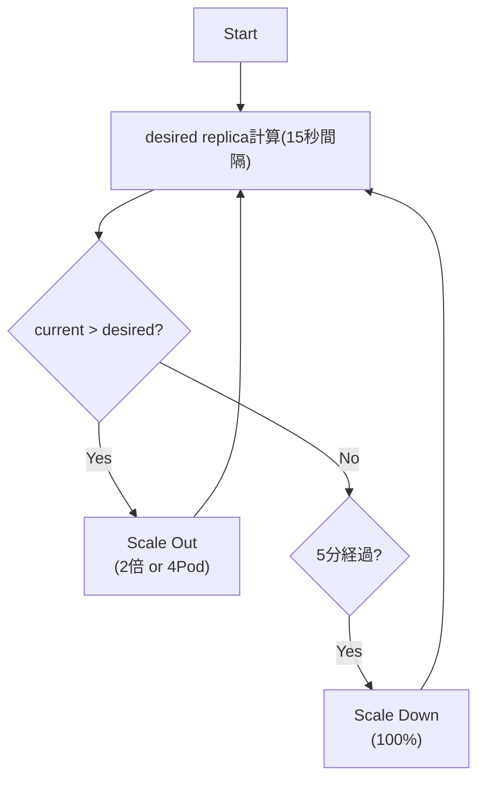

商用環境で実際にサービスが運用されると、時間帯やイベント等、様々な要因によってトラフィックが変動し、それに合わせてシステム負荷も増減します。
コンテナ以前の従来のシステムでは、あらかじめ最大のスループットを見積もり、それに合わせてサーバーのサイジングをすることが一般的でした。
ただ、これはほとんどのケースでオーバースペックで、費用対効果が良いとは言えない状況でした。
また、いざサーバーを増やすとなると調達やセットアップ等のリードタイムがかかり、変化の激しいビジネス要求に追従していくのが難しい状況でした。

この状況はコンテナ技術の登場で大きく変わりました。
軽量なコンテナは、必要な実行環境がイメージとして含まれていますので、コンテナランタイム環境があればすぐにデプロイ可能で、高価なサーバーは不要です。
このような特性は負荷に応じた即時のオートスケールを容易にし、Kubernetesを始めとするほとんどのコンテナオーケストレーションツールではオートスケール機能が備わっています。
Kubernetesには、以下の2種類のオートスケーリング機能があります。

#### Cluster Auto Scaling
Cluster Auto ScalingはPodがスケジュールできない状況になったときに、クラウドプロバイダが提供するAPIを通して自動でNodeを追加します。
また、負荷状況が改善され、NodeがオーバースペックとなったらNodeを削減します。
Kubernetesでは公式の[Cluster Autoscaler](https://github.com/kubernetes/autoscaler/tree/master/cluster-autoscaler)が利用できます。
主要なクラウドプロバイダに対応していますので、対応したクラウド環境を利用している場合は、別途導入しておくと良いでしょう。

:::info
AWSは2021/11に[Karpenter](https://karpenter.sh/)という新しい仕組みのOSSをGAリリースしました。
これはCluster Autoscalerよりも高速スケール可能で、より柔軟な設定が可能となっています。AWS EKSでの利用の場合はこちらを第一候補とすると良いかと思います。
Karpenterについては、別の記事で紹介していますので、興味がある方は[こちら](/blogs/2022/02/13/introduce-karpenter/)を参照してください。
:::

#### Pod Auto Scaling
もう1つのPod Auto Scalingは、CPU使用率等の各メトリクスを収集し、Podレベルでスケーリングします。
水平方向か垂直方向かで2種類のオートスケール機能が提供されています。

1. Horizontal Pod Autoscaler(HPA)
2. Vertical Pod Autoscaler(VPA)

Horizontal Pod Autoscaler(HPA)は、その名の通り水平方向のオートスケーラです。
デフォルトではPodのCPUやメモリの使用率を監視し、Pod全体の使用率がしきい値を超えた場合にPodのレプリカ数を増やしてスケールアウトさせます。
逆に、一定期間しきい値を下回った場合Podのレプリカ数を下げて、オーバースペックにならないよう調整します。
CPU、メモリ以外にも[Prometheus](https://prometheus.io/)等のメトリクスからスケーリングすることも可能です。

[Vertical Pod Autoscaler(VPA)](https://github.com/kubernetes/autoscaler/tree/master/vertical-pod-autoscaler)はレプリカ数ではなく、Podのリソーススペック(`resources.requests`)を調整します。
こちらは、長らくBetaステータスで、別途VPAコントローラの導入が必要です[^1]。

[^1]: 弊社の社内システムで運用しているEKS on FargateではVPAを利用し、作成されるPod(Fargate Node)のスペックを調整しています。

今回は最も利用されていることが多いであろうHorizontal Pod Autoscaler(HPA)を導入し、その動きを見ていきましょう。

[[TOC]]

## 事前準備
ここではAWS EKSで実施しますが、HPAはローカル環境(minikube等)でも実行可能です。

- [AWS EKS(eksctl)](/containers/k8s/tutorial/infra/aws-eks-eksctl/)
- [AWS EKS(Terraform)](/containers/k8s/tutorial/infra/aws-eks-terraform/)

また、アプリケーションにアクセスするためのIngress Controllerも別途用意してください。今回はNGINX Ingress Controllerを使用します。

- [NGINX Ingress Controller](/containers/k8s/tutorial/ingress/ingress-nginx/)


## メトリクスサーバー導入

HPAはメトリクスを収集して、Podのオートスケールを行います。
今回はCPU使用率にもとづいたスケールをします。
まずは、メトリクスを収集するための仕組みを事前に入れておく必要があります。
これに対応する[Metrics Server](https://github.com/kubernetes-sigs/metrics-server)を導入しましょう。

:::info
HPAではPodのメトリクス以外にもリクエストスループットや外部のメトリクスにもとづいたスケール機能も備わっています。
これを利用する場合は、メトリクス収集のための[Custom Metrics API](https://github.com/kubernetes/metrics#custom-metrics-api)を実装するプロダクトの導入が別途必要です。
たとえば、Prometheusのメトリクス収集には、[Prometheus Adapter](https://github.com/kubernetes-sigs/prometheus-adapter)があります。

また、さらに柔軟なオートスケールを実現する、[KEDA](https://keda.sh/)というプロダクトがあります。
こちらもCustom Metrics APIを実装しており、CloudWatch等の多様なメトリクスに対応可能です。
KEDAもスケールの仕組みにはHPAを使いますが、現時点(v1.23)のHPAデフォルトでは実現できない(Alphaステータス)ゼロスケールにも対応しています。
:::

Metrics ServerもHelmチャートが提供されていますので、こちらを利用します。
まずは、Helmチャートのリポジトリを登録します。

```shell
helm repo add metrics-server https://kubernetes-sigs.github.io/metrics-server/
helm repo update
```

続いて、Metrics Serverをインストールします。以下は現時点で最新の`3.8.0`のチャートを使用しています。
特にパラメータは指定不要です(最低限の構成)。

```shell
helm upgrade metrics-server metrics-server/metrics-server \
  --install --version 3.8.0 \
  --namespace metrics-server --create-namespace \
  --wait
```

インストールが終わったら、Metrics Serverの状況を見てみましょう。

```shell
kubectl get pod -n metrics-server
```

```
NAME                              READY   STATUS    RESTARTS   AGE
metrics-server-79c48b9c97-snsb5   1/1     Running   0          44s
```

Metrics Serverが、実行中であることが確認できます。
Metrics Serverを導入すると、kubectlでNode/Podのメトリクスを確認できます。
例えば、Nodeのメトリクスを確認する場合は、以下のコマンドを実行します。

```shell
kubectl top node
```

```
NAME                                                CPU(cores)   CPU%   MEMORY(bytes)   MEMORY%   
ip-192-168-38-243.ap-northeast-1.compute.internal   41m          2%     597Mi           8%        
ip-192-168-89-125.ap-northeast-1.compute.internal   45m          2%     639Mi           9%        
```

`kubectl describe node`よりも簡単に各NodeのCPU/メモリの使用状況が分かります。

## サンプルアプリデプロイ

オートスケール対象のサンプルアプリをデプロイします。ここではシンプルなモックAPIサーバーである[httpbin](https://httpbin.org/)を利用します。
以下のマニフェストファイル(`app.yaml`)を用意します。

```yaml
kind: Deployment
apiVersion: apps/v1
metadata:
  name: app
  labels:
    app: app
spec:
  replicas: 2
  selector:
    matchLabels:
      app: app
  template:
    metadata:
      name: app
      labels:
        app: app
    spec:
      containers:
        - name: app
          image: kennethreitz/httpbin
          ports:
            - name: http
              containerPort: 80
          resources:
            requests:
              cpu: 20m
---
apiVersion: v1
kind: Service
metadata:
  name: app
spec:
  selector:
    app: app
  ports:
    - name: http
      port: 80
      targetPort: http
---
apiVersion: networking.k8s.io/v1
kind: Ingress
metadata:
  name: app
spec:
  ingressClassName: nginx
  rules:
    - http:
        paths:
          - path: /
            backend:
              service:
                name: app
                port:
                  name: http
            pathType: Prefix
```

注意点としてHPAは、Podの要求スペックから使用率を算出します。
このため、`resources.requests`は必ず設定する必要があり、未設定の場合はオートスケールされません。
ここではCPU使用率ベースのスケールを行うため、`20m`(0.02コア)を要求スペックとしました。

それ以外はシンプルなので説明は不要でしょう。
このモックAPIはIngress(NGINX Ingress Controller)経由でアクセスできるようにしています。

このアプリをデプロイしましょう。

```shell
kubectl apply -f app.yaml
```

デプロイ後はNGINXを通してアクセスできるかを確認しましょう。
今回はカスタムドメインは使用せずに、AWSで自動生成されたドメインでアクセスします(AWS ELBが作成されるまで割当に少し時間がかかります)。
以下を実行して変数に設定しておきましょう。

```shell
# ADDRESSが割り当てられたことを確認
kubectl get ing app
# ADDRESSを変数に保存
APP_ENDPOINT=$(kubectl get ing app -o jsonpath='{.status.loadBalancer.ingress[0].hostname}')
```

curlコマンドでアクセスしてみます。

```shell
curl -I ${APP_ENDPOINT}/get
```

`HTTP/1.1 200 OK`が返ってきていれば、問題ありません。

## HPAリソース作成

それでは作成したアプリに対するオートスケール設定を追加しましょう。
HorizontalPodAutoscalerというリソースを作成します(以下HPAと略します)。
以下のマニフェストファイル(`app-hpa.yaml`)を作成します。

```yaml
apiVersion: autoscaling/v2beta2
kind: HorizontalPodAutoscaler
metadata:
  name: app-hpa
spec:
  maxReplicas: 10
  minReplicas: 1
  scaleTargetRef:
    apiVersion: apps/v1
    kind: Deployment
    name: app
  metrics:
    - type: Resource
      resource:
        name: cpu
        target:
          type: Utilization
          averageUtilization: 50
  behavior:
    scaleDown:
      stabilizationWindowSeconds: 60 # デフォルトは300(5分)
      policies:
        - type: Percent
          value: 20
          periodSeconds: 30
```

`spec`配下がオートスケール設定です
まず、`maxReplicas`で最大レプリカ数、`minReplicas`で最小レプリカ数を指定します。
`minRelicas`とDeploymentの`replicas`を両方指定するとHPAリソースが優先されます。

`scaleTargetRef`でオートスケール対象のリソースを指定します。ここで先程作成したアプリを指定します。

最後に`metrics`にオートスケール対象のしきい値を指定します。
ここでは`type: Resource`として、Podのリソースフィールド(`resources`)のCPU使用率を対象に、平均50%と指定しています。
これによりCPU使用率の全Pod平均値が50%を超えるとオートスケールが起動します。

これ以外にもスループット等のカスタムメトリクスを指定することも可能です。
カスタムメトリクスの詳細は、[こちら](https://kubernetes.io/docs/tasks/run-application/horizontal-pod-autoscale-walkthrough/#autoscaling-on-multiple-metrics-and-custom-metrics)を参照してください。

なお、複数メトリクスを指定した場合は、それぞれ評価され、算出されたレプリカ数の多い方のしきい値でオートスケールします。

`behavior`を指定するとメトリクス収集間隔やスケールダウン/アップの調整可能です。
上記では、スケールダウンの様子を把握するために、負荷が減って1分経過すると、20%ずつ緩やかにスケールダウンするように調整しました。
詳細は[こちら](https://kubernetes.io/docs/tasks/run-application/horizontal-pod-autoscale/#configurable-scaling-behavior)を参照してください。

:::alert
HPAリソースのapiVersionに注意してください。
ここではKubernetes v1.21で環境構築していますので、それに対応する`autoscaling/v2beta2`を設定しています。
これ以外に`autoscaling/v1`も利用できますが、これは古いI/Fのためここでは使用しません。
なお、Kubernetes v1.23からはStableバージョンの`autoscaling/v2`が利用可能です。
:::

これをクラスタ環境に反映しましょう。

```shell
kubectl apply -f app-hpa.yaml
```

HPAを参照してみましょう。

```shell
kubectl get hpa app-hpa
```

```
NAME      REFERENCE        TARGETS         MINPODS   MAXPODS   REPLICAS   AGE
app-hpa   Deployment/app   <unknown>/50%   1         10        0          9s
```

`TARGETS`の部分が`<unknown>`になっています。HPAのメトリクス収集にはタイムラグがありますので、しばらく待ってから再度実施しましょう。

```
NAME      REFERENCE        TARGETS   MINPODS   MAXPODS   REPLICAS   AGE
app-hpa   Deployment/app   3%/50%    1         10        2          81s
```

このように`TARGETS`の部分が3%となり、メトリクスが収集できていることが分かります。
なお、各Podレベルの利用状況は`kubectl top pod`コマンドで確認できます。

```
NAME                  CPU(cores)   MEMORY(bytes)   
app-c4677c7c6-j8dfh   1m           37Mi            
app-c4677c7c6-nkkng   1m           37Mi            
```

5分経過すると実行中のPodが1台なります。これはDeploymentでは`replicas: 2`と指定しましたが、HPAの最小レプリカ数`minReplicas`で1と指定したからです。
HPAがメトリクスから1レプリカで十分と判断されたためです。
このように両方を指定するとHPAの方が優先されますので、混乱を招かないよう、Deploymentの方は指定しない(または`minReplicas`に揃える)方が良いかと思います。

## 動作確認

それでは負荷をかけて、Podをオートスケールしてみましょう。
今回負荷をかけるツールとして、[loadtest](https://www.npmjs.com/package/loadtest)を使用します。

以下コマンドでインストールしておきます。

```shell
npm install -g loadtest
```

オートスケールの様子を見るために、別ターミナルを起動して以下を実行しておきましょう。

```shell
kubectl get hpa app-hpa -w
```

50の並行度で3分間負荷をかけます。また、モックAPIは1秒の遅延させてトラフィックを溢れさせます。

```shell
loadtest -c 50 -t 180 -k http://${APP_ENDPOINT}/delay/1
```

別ターミナルでウォッチしていた、HPAの状態は以下のようになります。


HPAが負荷とともに最小レプリカ1から最大値レプリカの10までPodをスケールさせ、負荷が解消した後は、レプリカ数1まで徐々に減っていることが分かります。

HPAのレプリカ数評価式は以下のようになります(引用元は[こちら](https://kubernetes.io/docs/tasks/run-application/horizontal-pod-autoscale/#algorithm-details))。

> desiredReplicas = ceil[currentReplicas * ( currentMetricValue / desiredMetricValue )]

例えば上記2行目は`1 * (190 / 50)`となり`3.8`切り上げて4レプリカが望ましいレプリカ数として算出し、Deployment/ReplicaSet経由でPodを増やしています。
なお、デフォルトでは、現在のレプリカの2倍を上限としてスケールするようになります(この値はHPAの`behavior`で変更可能)。
また、今回スケールダウンは徐々に減るように、カスタム調整しましたが、デフォルトは5分経過後に、負荷がない状態であれば一気にスケールダウンします。
`behavior`を指定しない場合のデフォルトでは以下のようになります。


この辺りのしきい値を、最初に決めるのはかなり難しいので、負荷試験や実運用を通して継続的に見直していくことが望ましいでしょう。

## まとめ

オートスケールはシステム全体の利用効率を高めるためには必須の機能と言えます。
ここでは実施しませんでしたが、これにNodeレベルのオートスケーリングを組み合わせることで、現在の負荷状況に応じて臨機応変にスケールさせることが可能です。

ここで重要なことは、アプリケーションの廃棄容易性です。
オートスケールを利用すると、アプリケーションが頻繁にスケジューリングされることになります。
オートスケールだけが要因ではありませんが、アプリケーションのデプロイ・アンデプロイの頻度は確実に増えることになります。
このため、まずはアプリケーションに安全に停止可能にすることが大切です。突然の停止でデータ不整合等を起こしては意味がありません。
これには[The Twelve-Factor App](https://12factor.net/)の[Disposability](https://12factor.net/ja/disposability)を参考に、これを言語・フレームワークに合うように実装するのが良いでしょう。
また、Podのライフサイクルフック(preStop)を利用して、単純にスリープしてアプリケーションのシャットダウン処理に時間的猶予を与えたりや、個別にシャットダウン処理を実行するなども考えられます。

- <https://kubernetes.io/docs/concepts/containers/container-lifecycle-hooks/>

さらに、高速なスケールアウトのためには、起動速度も重要です。これには以下の要素について検討すると良いでしょう。

- コンテナイメージを軽量に保つ(不要なものは入れない)
- 起動時のフットプリントが小さい言語/フレームワークを選択する
- 重量なアプリケーションの初期化処理を遅延させる

---
参考資料
- [Kubernetes HPAドキュメント](https://kubernetes.io/docs/tasks/run-application/horizontal-pod-autoscale/)