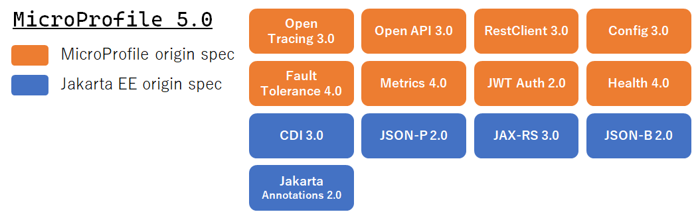

[前回](/msa/mp/cntrn01-what-mp/)はMicroProfileの登場からMicroProfileが目指すものまで説明しました。今回はMicroProfileの中身となるMicroProfileの仕様と実装について、私見も交えながら説明したいと思います。若干長い説明となりますが、最後まで目を通していただけたら幸いです。

MicroProfileは"逆張りのMicroProfile"として連載しています。他の記事は[こちら](/msa/#microprofile)からどうぞ。

[[TOC]]

## MicroProfileがカバーする仕様
早速ですがMicroProfile5.0に含まれている仕様[^1]を並べると下のとおりとなります。

:::info
MicroProfileに含まれる仕様と言った場合、厳密には図に挙げたMicroProfile 5.0に含まれるトップレベルの仕様以外にもここに記載のない[Reactive Messaging](https://download.eclipse.org/microprofile/microprofile-reactive-messaging-2.0.1/microprofile-reactive-messaging-spec-2.0.1.html)や[GraphQL](https://download.eclipse.org/microprofile/microprofile-graphql-1.1.0/microprofile-graphql-spec-1.1.0.html)と言った単独の仕様も含まれます。この連載では主にコアとなるトップレベルの仕様を扱うとともにMicroProfileの仕様と言った場合、原則としてこのトップレベルの仕様を指すものとして説明していきます。
:::

[^1]: MicroProfileの[公式GitHub](https://github.com/eclipse/microprofile/)に"the top-level umbrella MicroProfile specification"として定義されている仕様を記載。

### Jakarta EEやJavaエコシステムの活用
図をパッと見てCDIやJAX-RSなど見慣れた、もしくは耳にしたことがあるJakarta EEの仕様が含まれているのが分かると思います。これが正に[前回](/msa/mp/cntrn01-what-mp/)の説明にあった「Jakarta EEや既に存在するJavaエコシステムの活用」に当たります。

昨今のJavaアプリケーション開発ではオブジェクトの管理やオブジェクトの依存性の注入(Dependency Injection)を行うDIコンテナは必須となっていますが、そのDIの手段としてMicroProfileではJakarta EEのCDIを取り入れ活用しています。また、RESTはマイクロサービスアーキテクチャで必須となりますが、これもJakarta EEのJAX-RSが取り入れられています。

このようにMicroProfileはJakarta EEの仕様がベースとなっているため、Jakarta EEと非常に親和性の高いAPI体系となっています。

### マイクロサービスアーキテクチャへの考慮
そして、次に注目すべき仕様としてOpenTracingやMetricsなどがあります。

マイクロサービスアーキテクチャで重要性が増す非機能要件として、システムがどのような状態になっているか観測可能かを意味する可観測性と障害から回復しサービスを継続する回復性があります。MicroProfileではこの可観測性と回復性を実現する仕様としてOpenTracingやMetrics、Health, Fault Toleranceが含まれています[^2]。

これらの仕様が含まれている点が[前回](/msa/mp/cntrn01-what-mp/)の説明でMicroProfileの目的として掲げられていた「マイクロサービスアーキテクチャで必要となる標準APIや機能の提供」をよく表しています。

[^2]: MicroProfileの特徴がよく表された仕様ですが、可観測性や回復性に対するソリューションは他にも多く存在するため、これらのMicroProfile仕様を実際に利用するかは別、つまり可観測性や回復性は他のソリューションで実現する選択肢もあります。

## MicroProfileの各仕様
MicroProfileに含まれるそれぞれの仕様の内容は下記のとおりとなります。 仕様にはMicroProfileの実装を提供する実装ベンダー観点とそれを利用する利用者観点、双方の内容が含まれています（なので若干小難しくなっています）

| 仕様 | 概要[^3] |
| ---- | -------- |
|OpenTracing|MicroProfile のサービスをopentracing.ioのOpenTracing機能に参加 させるインテグレーション機能に関する仕様|
|OpenAPI|ソースからOAS(Open API Specification)ドキュメントを生成する ためのアノテーションやドキュメント生成方法を定めた仕様|
|RestClient|インタフェースを定義するだけでREST呼び出しを可能にする仕組みと その利用法を定めた仕様|
|Config|環境変数やシステムプロパティ、設定ファイルなど異なる設定源の 構成を統合して扱えるようにする仕組みとその利用法を定めた仕様|
|Fault Tolerance|いわゆるサーキットブレーカやRetry、Timeoutなどのフォールト トレラント機能をMicroProfile仕様として定めたもの|
|Metrics|ヒープサイズやGC回数などのシステム状況を監視するメトリックス と公開方法が定義されている|
|JWT Auth[^4]|何をするものなのかMicroProfileの中で実体が一番掴みづらい仕様だが 実体は[OIDC](https://openid.net/connect/)をベースにした標準的なclaimに加えRBACのために必要な Roleに関するclaimを定義したJavaのインタフェースとその扱いが定め られているのみ。実際の認証と認可をどのように行うかは定められて いない|
|Health|サービスの死活監視に関するいわゆるReadnessとLivenessに関する 仕様を定めたもの|
|CDI|いわゆるDIコンテナに相当するJakarta EEバージョンの仕様|
|JSON-P|"-P"のPはParserのPではなくProcessingのPでJSON-Bのベースと なるもの|JAX-RS|RESTリクエストを送信するRESTクライアントとRESTリクエストを 受信するRESTリソースに関する仕様が定義されています|
|JSON-B|こちらがいわゆるパーサーに関する仕様。その実装としては jackson-databindが有名と言うとよりピンとくるでしょうか|
|Jakarta Annotations|各仕様間で同じようなannotationがバラバラに定義されないように 共通的なannotationを定義したもの。`@Priority`や`@PostConstruct`など が定義されています|

[^3]: 一口コメント的な内容ですので、詳細な仕様はそれぞれ[JakartaEE Spec](https://jakarta.ee/specifications/)または[MicroProfile Spec](https://download.eclipse.org/microprofile/microprofile-5.0/microprofile-spec-5.0.html)を参照ください。
[^4]: この仕様の表記は公式資料の中でも揺れています。公式資料ではJWT PropagationやJWT RBACの表記も出てきますが、実体はいずれも同じものを指していると思われます。

:::column:あれっ、データベースアクセスってどうするの？
MicroProfile仕様を一覧して気づいた方もいるかと思いますが、MicroProfile仕様にはJPAやJTAなどと言ったRDBに関する仕様は一切含まれていません。

マイクロサービスアーキテクチャではデータベースは必須ではなく、またデータベースもRDBとも限りません。ですので、これらに関する仕様が含めていないことは理解できますが、実際問題としてRDBが利用されるケースはまだまだ多くあるため、これはかなり思い切った選択だったと思います。

とは言っても、それではどうするの？となると思いますが、この後に説明するMicroProfileの利用形態の一つであるアプリケーションサーバでは、当然Jakarta EEの一部としてJPAやJTAはサポートされますし、それぞれのMicroProfileフレームワークにも付加機能としてJPAインテグレーションが備えられています。ですので、MicroProfile仕様には含まれませんが、実際にはJPAやJTAもMicroProfileと一緒に利用可能と考えて問題ありません。
:::

:::column:Spring Frameworkは混ぜるなキケンではなく一緒に使えません
MicroProfileに含まれる仕様はいくつかの例外を除き、その基盤としてオブジェクトの生成や依存性の注入を行うCDIコンテナが存在することを前提としています。

例えばJAX-RSであれば、JAX-RSを構成するResourceクラスやProviderクラスはCDIコンテナでそのインスタンスが管理されることが前提となります。また、JAX-RSを使いやすくしたRestClientはJAX-RSがベースですので、おのずとCDIコンテナが前提となります。よって、CDI以外の仕様は必要なものだけを取捨選択することができますが、CDIについてはMicroProfileの基盤となる仕組みであるため、MicroProfileにおいて、その利用は実質的に必須となります。

これはJavaのアプリケーション開発で広く利用されているSpring Framework(Spring)でも同様となります。SpringもCDIと同様にオブジェクトの生成と依存性の注入を行うSpring独自のDIの仕組みを持っています[^5]。これがSpringのDIコンテナで、Springの他の機能もDIコンテナを前提としており、DIコンテナなくしてSpringは成り立ちません。

このようにSpringとMicroProfileでは目的を同じにした別の仕組みを基盤としているため、両者を1つのアプリケーションで共有して使う理由はありませんし、仕組みとしてもムリがあります。

[^5]: これはむしろJava EEがSpringのDIを後追いで標準化したという方が正しいですが、、
:::

## MicroProfileの実装形態
MicroProfileはあくまでも仕様のため、MicroProfileを使うにはMicroProfile仕様に準拠した実装が必要となります。そして、この仕様と実装の関係は基本的にJakarta EEと同じとなります。

例えばJakarta EE仕様の1つであるJPAであれば、その実装としてHibernateやEclipseLinkがありますが、これと同様にMicroProfileも1つの仕様に対して複数の実装が存在するものがあります。また、Jakarta EE対応のアプリケーションサーバ（以降、アプリケーションサーバ）であれば、対応するプロファイル[^6]に含まれるすべての実装がアプリケーションサーバから提供されます。

よって、アプリケーションサーバ上でWebアプリケーションを稼働させる場合、warのWEB-INF/libにJPAなど利用したい実装（ライブラリ）を個別に配置する必要はありません。

これはJakarta EEの実装は基盤となるアプリケーションサーバから提供されるためです。MicroProfileの機能を利用する場合も基本的にこれと同様となります。つまり、MicroProfileを利用する場合は対応する基盤を利用ことになります。

と、ここで基盤と敢えてボンヤリ書いたことには理由があります。それはMicroProfileの実装形態が大きく2つあるからです。そこで次からは具体的なMicroProfileの対応製品を見ていきたいと思います。

[^6]: JakartaEEに含まれる仕様は広範に渡るため利用形態に応じて必要となる仕様をセットにしたもので、Webアプリケーション向けには[WebProfile](https://jakarta.ee/specifications/webprofile/9.1/jakarta-webprofile-spec-9.1.html)が用意されています。また、MicroProfileも元々はマイクロサービス向けのJava EE プロファイルとして考えられていました。

## MicroProfileの実装（製品）
筆者の独断と偏見でMicroProfileの実装[^7] ならコレ！というものを5つ選び、ブランドロゴを並べてみました。

### Jakarta EEアプリケーションサーバの利用
ロゴを見てもらうと良く知っている製品が並んでいるかと思います。そうです、MicroProfileの利用形態の1つは、MicroProfileに対応したアプリケーションサーバを使うことになります。

[OpenLiberty](https://openliberty.io/)や[Payara](https://www.payara.fish/products/payara-server/)、[WildFly](https://www.wildfly.org/)はJakarta EEはもちろんのこと、MicroProfileにも対応しています。ですので、MicroProfile対応のアプリケーションサーバを使っていれば、追加で何かを導入することなく、MicroProfileの機能を利用することができます[^8] 。また、MicroProfile対応のアプリケーションサーバで稼働している既存のアプリケーションにMicroProfileを利用した処理を追加することももちろん可能です。

[^7]: 他の対応製品については、公式ページで公表されている[リスト](https://wiki.eclipse.org/MicroProfile/Implementation)を参照ください。
[^8]: 必要となる製品エディションや追加設定などがある場合があります。必要事項の有無やその内容については利用製品のマニュアル等で確認ください。

### MicroProfileフレームワークの利用
もう1つの形態は、マイクロサービスアーキテクチャで利用されることを目的として開発された[Quarkus](https://quarkus.io/)や[Helidon](https://helidon.io/docs/v2/#/about/01_overview)といったMicroProfileフレームワーク[^9]の利用となります。

マイクロサービスアーキテクチャはアプリケーションサーバ上で稼働させていたモジュラーモノリス[^10]といった比較的大きな1つのアプリケーションを複数のモジュールに分割し、分割した1つ1つのモジュールを独立した1つのJavaプロセスとして動作させるものとなります。しかし、このモジュールを動作させる基盤としアプリケーションサーバを用いることにはやや問題があります。

それはメモリやディスクのフットプリントです。単純に今まで1つで賄っていたアプリケーションサーバを分割したモジュールの数だけ用意する必要があると言われた場合、感覚的に「えっ！？」となることは容易に理解いただけると思います。

また、アプリケーションサーバにはServletやJSFと言ったMPA(MultiPageApplication)に関するUI機能や分散トランザクションなどの堅牢性に関する仕組みが多く含まれてきます。アプリケーションによってはこれらが有効に機能するケースが多くありますが、マイクロサービスアーキテクチャではREST APIとしてサービスを提供するのみで、UIを提供することはありません。

トランザクションについてもデータの一貫性が常に求められる分散トランザクションではなく、間隔が空いても最終的にはデータの一貫性が保たれればよしとする結果整合性によるトランザクションが一般的に用いられます。

よって、マイクロサービスアーキテクチャの実行基盤にアプリケーションサーバを用いた場合、利用しない無駄な機能により大なり小なりメモリとディスクが消費されます。そのため、端的に不必要に高機能とも言えます。

そこで選択肢となるのが、先ほど出てきたQuarkusやHelidonといったMicroProfileフレームワークとなります。MicroProfileフレームワークはそれ自身でWebサーバの機能を内包しているためExecutable Jarとして、javaコマンドから直接アプリケーションを起動することができます。つまり、アプリケーションの実行にアプリケーションサーバを必要としません。

また、含まれる機能はMicroProfile実装とマイクロサービス向けに追加された各フレームワークの固有機能のみとなり、UIや分散トランザクションと言ったマイクロサービスアーキテクチャで使われることがない機能は含まれません。よって、アプリケーションサーバと比較した場合、軽量となります。

ここで軽量と表現すると貧弱と言ったネガティブなイメージを与えますが、UIを持たずHTTPのエンドポイントとしてサービスを公開するマイクロサービスのアプリケーション開発ではMicroProfileに含まれるAPIや機能で十分事が足ります。このため、既存アプリケーションも一緒に稼働させると言った制約がない限り、マイクロサービスアーキテクチャの基盤にアプリケーションサーバを選択する理由はありません。

[^9]: QuarkusやHelidonはフレームワークではなくライブラリだろ！と言う声が聞こえてきそうですが、語感が良いのでここではフレームワークと言う用語を使っていきます。
[^10]: 単一プロセス内のコードが複数のモジュールに分割されている構造。具体的にはドメインごとに分割されているjarを1つのwarにpackage化した構造がその1例となります。

:::column:アプリケーションサーバもかなり良くなっている
重い遅いデバック辛い、、と言ったイメージがあるアプリケーションサーバですが、昨今は必要となるまでモジュールのロードを遅延させる遅延ロード機能などにより高度に最適化が図られているため、一昔前とは違い、起動速度もメモリ消費もかなり向上しましています。

このため、MicroProfileフレームワークが軽量と言っても、昨今のアプリケーションサーバと比べて画期的に起動時間が短く、メモリ消費が少なくなるわけではありません。ただし、アプリケーションサーバのインストールも不要でかつ、jarの配置だけでアプリケーションを稼働させることができるため、その点で圧倒的に「軽量」なことは断言できます。
:::

### MicroProfile製品の各紹介
MicroProfile対応製品の各種情報と勝手な一口コメントでこのテーマを終わりにします。

|プロダクト名|開発元(運営元)|対応Version|一口コメント|
|------------|--------------|:-----------:|------------|
|[OpenLiberty](https://openliberty.io/)|IBM|5.0|製品版のWebSphereLibertyと同様に MicroProfileの最新バージョンへの追従が 速く、MicroProfileをけん引する製品と 言っても過言ではない|
|[Payara Server](https://www.payara.fish/products/payara-server/)|Payara|3.3|GlassFish Serverから派生したアプリ ケーションサーバ。コマンドラインからwar を起動することができる[Payara Micro](https://www.payara.fish/products/payara-micro/)もある|
|[WildFly](https://www.wildfly.org/)|Red Hat|3.2|Jakarta EEアプリケーションサーバの 雄のWildFlyだが、MicroProfileへの対応は 同社のQuarkusに絞ったのかと思わせるほど 近年WildFlyとしての対応は消極的に見える|
|[Helidon](https://helidon.io/docs/v2/#/about/01_overview)|Oracle|3.3|シンプルさに特化しているがMicroProfileに 非対応のHelidon SEとMicroProfileに対応した Helidon MPの2つのエディションがある|
|[Quarkus](https://quarkus.io/)|Red Hat|3.3[^11]|[GraalVM](https://www.graalvm.org/)によるnative-imageの作成にいち 早く対応したことで有名。また内部で利用して いるMicroProfile実装の[SmallRye](https://smallrye.io/)自体は MicroProfileの最新バージョンへの追従も速く 同じRed Hatがスポンサードしている|

[^11]: [公式リスト](https://wiki.eclipse.org/MicroProfile/Implementation)では3.2となっていますが、Quarkusの[公式ブログ](https://ja.quarkus.io/blog/quarkus-eclipse-microprofile-3-3/) で3.3に対応したことがアナウンスされています。

:::column:アプリケーションサーバの実装を利用する意義ってなに？
アプリケーションサーバを使っているからと言って、必ずしもアプリケーションサーバが提供する実装を使わなければいけない訳ではありません。もちろんアプリケーションサーバの実装以外を利用することもでき、この場合は他のOSSライブラリと同様に利用したい実装をWEB-INF/libに配置するだけです。

であれば、アプリケーションサーバが持つ実装を利用することとMyFacesやEclipseLinkなどと言った自分の好きなJakarta EE準拠のOSSライブラリををWEB-INF/libに配置して利用することの違いはなにになるのでしょうか？

その違いはいくつかありますが、個人的に一番大きな違いと考えているのはサポートの有無となります[^12]。

アプリケーションサーバの実装を利用する場合、有償にはなりますが一般的に開発ベンダーからのサポートを期待することができます。

開発ベンダーは利用しているOSSに対し、自身が実質的な開発元になっている場合やコミッターを多数雇用しているなど強いコネクションを持っている場合が多くあります。事実、WildFlyはJPAの実装にHibernateを、そしてCDIにはWeldを採用していますが、いずれも実質的にRed Hat傘下のコミュニティで開発が行われているのが分かりやすい例と言えます。

昨今の開発においてOSSを使わないことはまずあり得ないと言って過言ではありません。ですので、ミドルウェアとしてのアプリケーションサーバからアプリが利用するOSSライブラリまでワンストップで強力なサポートを期待できることは、ミッションクリティカルなアプリケーション開発において大きなメリットになり得ます。よって、これがアプリケーションサーバに内包されているJakarta EE準拠のOSSライブラリをアプリケーションサーバから提供される機能として利用するのと自分でWEB-INF/libにJakarta EE準拠の別のOSSを配置することの違いになると考えています。なお、サポート範囲やサービスレベルは製品ごとに異なるため、サポートを期待される場合は製品ベンダーに確認されることをお勧めいたします。

[^12]: もう一つの理由としてOSSライブラリの独自機能を使いたいということが考えられます。
:::

## MicroProfileの今後
[第1回](/msa/mp/cntrn01-what-mp/)のMicroProfileの登場でも軽く触れましたが、MicroProfileの一部であったMicroProfile ConfigはJakarta EE10に取り込まれる予定[^13]となっています。また、MicroProfile Config同様に今後Jakarta EEに取り込まれることが噂されるMicroProfile仕様もいくつかあります。

これらのことから、今後はMicroProfileの成果がJakarta EEに積極的にフィードバックされていくのではないかと思われます。

Java EE時代はJavaアプリケーションのデファクトであるSpring Frameworkの後追いや劣化版的な否めませんでした。これがもし今後は標準化団体主導で新しいアーキテクチャが切り開かれ、結果それが標準化としてデファクトになることがなるのであればそれは健全で歓迎すべきことではないかと思います（そうなるかは別ですが・・）。

MicroProfileは1.0リリースから約6年経ちバージョンも5.0となった現在、実践でも十分に使える仕様になってきていると個人的に実感しています。Javaによる現実的で実践的なマイクロサービスアーキテクチャの未来としてこの機会をきっかけに是非MicroProfileにも注目していただければと思います。

[^13]: Specifications - Jakarta Config: <https://jakarta.ee/specifications/config/>

## 標準準拠について
多くのアプリケーションは標準準拠がそれだけでアーキテクチャの目的となることはありません。標準準拠はあくまでも私たちがアーキテクチャ上の課題を解決するための1つの手段でしかありません。

よって、Jakarta EEやMicroProfileなどの標準仕様を採用する場合は、標準に準拠することで「何を得たいか」、「何を解決したいか」、そして「それは他のアーキテクチャを選択するよりも大事なことなのか」を考えることが重要となります。

Spring FrameworkではなくJava EEを採用したが、Java EEはSpring Frameworkよりも○○なので、イケてない、失敗だったなどと言ったコメントや評価をたまに見聞きしたりしますが、なぜJava EEを選択したのか実際に聞いてみると、その多くは「標準だから」です。標準を利用することは目的ではありません。Jakarta EEやMicroProfileに対してこのような残念な評価がなくなることを期待し今回は終わりにしたいと思います。

