[前回](/msa/mp/cntrn18-mp-specsystem/)まではMicroProfile全体に関する軟らかめの話でしたが、今回からはMicroProfileでどのようなことができるか？そして使うのか？などの実装的な側面の話をしていきます。

その初回となる今回は、まずは動くものを見てもらう意味も含めMicroProfileを使ったサンプルアプリを紹介し、その後にMicroProfile実装として利用しているHelidonを説明します。サンプルアプリの中身は以降の回をとおして説明するため、今回はこんなのが有りますよ程度の説明に留めます。

:::column:連載の紹介
豆蔵デベロッパーサイトではMicroProfileをテーマに「[逆張りのMicroProfile ～ Helidonで始めるマイクロサービスへの一歩 ～](/msa/#逆張りのmicroprofile-～-helidonで始めるマイクロサービスへの一歩-～)」を連載しています。他の記事も是非どうぞ!
:::


## サンプルアプリの紹介
:::alert: サンプルアプリはリニューアルされています
この記事で紹介しているサンプルアプリはMicroProfileの一部の仕様しか使っていませんでした。現在はUmbrella仕様（コアプラットフォーム仕様）のほぼすべてを使ったサンプルアプリにリニューアルしています。サンプルアプリを参考にする場合は次の記事を参考にしてください。
- [MicroProfileを使ったサンプルアプリのリニューアル – 今度はほんとにMSA](/msa/mp/cntrn19-mp-sample-renewal/)
:::

サンプルアプリはレンタル品を予約するシステム（レンタル品予約システム）を題材にしたアプリで、コードはGitHubで公開しています。アプリは次のようにいくつかのリポジトリで構成されていますが、MicroProfileのサンプルはrmsリポジトリとなります。

|repository| 説明 |
|---|---|
|[rms](https://github.com/extact-io/rms)|MicroProfileによるレンタル品予約システムのバックエンドアプリ<br/>(簡易的なフロントエンドとしてコンソールアプリも含む)|
|[rms-ui-react](https://github.com/extact-io/rms-ui-react)|ReactによるrmsのSPAフロントエンドアプリ |
|[rms-generated-client-js](https://github.com/extact-io/rms-generated-client-js)| OpenAPI Generatorで生成したrmsのAPI Client |




レンタル品予約システムのバックエンドとなるrmsアプリの内容やアーキテクチャは[README](https://github.com/extact-io/rms/blob/main/README.md)に記載していますので興味のある方は見ていただければと思います。また、rmsの中身は冒頭の説明のとおり今後、実際の利用例として適宜紹介してきます。

:::info
紹介したサンプルアプリはMicroProfileの利用法や効果を確認するため、ある程度実践的かつ、それなりな規模のアプリとなっています。
:::

サンプルアプリの紹介は以上として、次はMicroProfileの実装として利用しているHelidonについて説明します。

## Helidonについて
[Helidon](https://helidon.io/)は前回説明したアプリケーションサーバを必要としない[MicroProfileフレームワーク](/msa/mp/cntrn02-what-mp/#microprofileフレームワークの利用)タイプのMicroProfile実装でOracleが開発を行っています。

Helidonには2つのエディションがあり、1つはシンプルさに特化し非常に軽量な[Helidon SE](https://helidon.io/docs/v2/#/se/introduction/01_introduction)、もう1つはHelidon SEにMicroProfile対応を加えた[Helidon MP](https://helidon.io/docs/v2/#/mp/introduction/01_introduction)となります。

サンプルアプリではHelidon MPを利用していますが、このHelidon MPには次の特徴があります。

### Non-BlockingでReactiveなNettyがベース
Helidonに含まれるHelidon Web ServerはNon-Blockingでリクエスト処理を行う[Netty](https://netty.io/)がベースとなっているため、Nettyの特徴である高スループット、低レイテンシ、低リソースでリクエストが処理されます。

### アプリケーションをコマンドラインから起動可能
Helidon Web Serverはmainメソッドから起動ができます。そして、これにより大きな恩恵を受けるものとしてデバックがあります。

特定のテスティングフレームワークやIDEのプラグイン機能を使うことで従来のJakarta EEアプリケーションでもEclipseなどのIDEからアプリケーションサーバを起動しデバック実行が可能でしたが、コンソールアプリのようにIDEから直接アプリケーションを起動してのデバックはできませんでした。

これに対しHelidonは、次のmainメソッドのようにHelidonの`Main#main()`を呼び出すだけでHTTPサーバやCDIコンテナなど配下のすべての機能が起動します。

```java
public static void main(String[] args) {
   io.helidon.microprofile.cdi.Main.main(args);
}
```

このためHelidonを使った開発では、何も考えず、かつ何も必要とせずIDEから直接、簡単にアプリケーションの起動・デバックが行えとても便利です。（アプリケーションサーバを使う気がなくなります）

CDIやJAX-RSアプリケーションはその起動やデバックにアプリケーションサーバーが必要となる点[^1]が非常に辛いところでした。これがHelidonを使うことでSpring Frameworkと同様にmainメソッドから行えるようになるのは開発効率の面から大きなメリット[^2]があります。


[^1]: 似たようなものとして以前からEJB 3.1 Embeddable APIやWeld SEなどがありましたが、Productionと異なる構成が必要だったり、一緒に利用するライブラリとの相性があったりと、実開発で使うには難があるものでした。その点、HelidonはJAX-RSやInterceptorなどCDIと連携するすべての機能がインテグレーション済みの実行環境が提供されるため、何も考えず、かつ何も必要とせずほんとに簡単にIDEから起動・デバックができます。
[^2]: QuarkusもHelidonと同様の起動方式となります。ですので、このコマンドラインからの起動によるメリットはHelidonと言うよりも正しくはMicroProfileフレームワークに対して当てはまるものとなります。また、Payara Microはアプリケーションサーバですが、warをコマンドラインから起動することができます。


### MicroProfile以外の豊富な機能
MicroProfileにはJTAやJPAなどRDBに対する仕様は含まれていませんが、Helidon MPはその独自機能としてJTA/JPAとのインテグレーション機能の他、設定値の暗号化やIDプロバイダとの認証連携機能など実際のアプリケーション開発で必要となる機能を提供[^3]してくれます。

[^3]: 提供される機能とその詳細は[公式ページ](https://helidon.io/docs/v2/#/mp/introduction/01_introduction)を参照

### 最新仕様への追従に積極的
最新のHelidon MPが対応しているMicroProfileバージョンは3.3[^4]ですが、GitHubのプロジェクトリポジトリでは最新の[5.0への対応](https://github.com/oracle/helidon/issues/2636)が進められています。

2022年3月現在で利用されているMicroProfileの主なバージョンは3.x系、4.x系、5.x系の3つになりますが、4.x以降の対応にはMicroProfileがベースとするJakara EEの移行も絡むため、IBMのOpenLiberty以外はどの製品もまだ対応できていません。また、4.x系最終バージョンの4.1から5.0の変更点はjakartaパッケージへの変更のみで機能的には同じとなります。ですので、3.xと5.xでは数字上、メジャーバージョンが2つも離れていますが、実質的には1つ程度の違いとなります。

現時点でMicroProfile 5.0への対応がかなりの程度進んでいることとこれらを踏まえると、Helidonは最新仕様への追従に積極的と言えます。

[^4]: 2022年3月時点におけるHelidon MPの最新バージョン2.4.2が対応しているMicroProfileバージョン

### GraalVMによるnative-image化対応
[GraalVM](https://www.graalvm.org/)によるnative-image化は同じMicroProfile実装の[Quarkus](https://quarkus.io/)がいち早く対応し一時期脚光を浴びましたが、HelidonもSE,MP両エディションともにGraalVMの[native-image化](https://www.graalvm.org/native-image/)に対応しています。

GraalVMのネイティブコンパイル機能を使うことで、JavaアプリケーションをLinuxやMac、Windowsと言ったプラットフォームにネイティブな実行ファイル（Windowsであればexeファイル）に変換できます（これがnative-image化）。また、native-image化することで従来のJavaVM上での実行に比べ、アプリケーションの起動を高速化し、メモリ消費を低減させることができます。

ただし、このnative-image化はなんでも可能と言う訳ではなく、変換にはそれなりの制約や制限等があります。このため、GraalVMによるnative-image化は変換するモジュール(jar)がnative-image化に対応している必要があります。

これに対してHelidonはHelidon SE,MPともnative-image化に正式に対応しているため、Helidonから提供される実装（jar）を利用している限り、それを利用したJavaアプリケーションはnative-image化が可能ですが、これには注意点もあります。

native-image化は対象アプリケーションが利用するすべてのjarファイルが変換の対象となります。ですので、もしアプリケーション内でHelidonから提供される以外のOSSを利用していた場合、そのOSSがnative-image化できるとは限りません。

また、Helidonの公式ページではnative-image化に対し次のコメント[^5]が付けられています。このコメントから分かるとおり、Helidon、GraalVM双方の開発元であるOracle自体もnative-image化は銀の弾丸ではないことを言っています。
> ネイティブイメージは、多数のインスタンスに迅速にスケールアウトする機能が重要である、水平方向のスケーラビリティ要件が高いアプリケーションに最適です。
とはいえ、ネイティブイメージにはいくつかの制限があり、起動とフットプリントの優先度が低い長時間実行アプリケーションには、Java SE HotSpotVMの方が適している可能性があります。

このようにnative-image化は万能な銀の弾丸ではありませんが、対応していることでアーキテクチャ上の選択肢は広がるため、使うか使わないかは別として、native-image化対応はメリットと言えます。また、GraalVM、Helidonともに開発元は同じOracleとなることから、対応している他の実装よりもHelidonはより厚いサポートが期待できるのではないかと思います。（あくまでも期待で実際のところは不明ですが、、）

[^5]: 原文は公式ページの[”When should I use Native Images?”](https://helidon.io/docs/v2/#/mp/guides/36_graalnative)。なお、引用はGoogle翻訳のまま。

:::column:native-image化に対する考察
native-image化によるメリットとして高速起動が挙げられますが、これはあくまでも起動だけを言っているだけで、起動後の処理はなにも言っていない点に注意は必要です。

JavaVMでは稼働プラットフォームや頻繁に実行されるパスなどアプリケーションの実行特性を考慮した最適化がJITコンパイラにより実行時に行われます。一方のnative-image化はアプリケーションを実行する前にGraalVMのAOTコンパイラによる事前コンパイルが行われるため、JITコンパイラによる最適化は行われません。

よって、このことから次の2つが言えます。
- native-image化したアプリとある程度稼働しJITが十分に掛かっているJavaVM上のアプリを比較した場合、JavaVM上のアプリの方が効率良く処理される
- 処理効率を比較した場合、起動直後はnative-image化アプリの方が有利だが、ある程度稼働を続けるとJavaVMアプリの方が有利となる時が来る

これらのことから、native-image化はイベントの都度、起動と停止を行い高速な起動が求められるAWS Lambdaに代表されるFaaS(Function as a Service)で使うのが最も効果的で、反対に常にリクエストを待機している必要があるいわゆる普通のサーバーアプリには向かないと言えます。そして、これが先ほど説明したHelidon公式ページのコメントに込められている真の意味と個人的に理解しています。
:::

## まとめ 
今回はMicroProfileを使ったサンプルアプリの紹介とサンプルで使っているHelidonについて説明しました。次回はMicroProfileをサンプルアプリで実際に使ってみて、これは便利だ、素敵だと感じた是非使ってみるべきとも言える3つの仕様を紹介します。
