MicroProfileは大小様々な仕様が存在します。 [前回](/msa/mp/cntrn03-sampleapp-helidon/)紹介したサンプルアプリにMicroProfileの各機能を組み込んでフィット感を試してみた結果、MicroProfileを採用するのであれば『これは抑えておくベキ、もしくは使っておくベキ』と言える仕様がいくつかありました。今回はその中から厳選した3つの仕様をランキング形式で紹介します。

APIレベルまでまとめて1度で説明するのはムリがあるため、今回はどんなことができるかの概要を紹介し、APIも含めた利用法は次回3回に分けて説明していきます。

:::column:連載の紹介
豆蔵デベロッパーサイトではMicroProfileをテーマに「[逆張りのMicroProfile ～ Helidonで始めるマイクロサービスへの一歩 ～](/msa/#逆張りのmicroprofile-～-helidonで始めるマイクロサービスへの一歩-～)」を連載しています。他の記事も是非どうぞ!
:::

話しは戻って、それでは早速ランキング発表に行きます！

# 第3位 MicroProfile OpenAPI
REST APIの仕様はOAS([OpenAPI Specification](https://spec.openapis.org/oas/latest.html))に従った形式で記述するのが最近のスタンダードとなりつつありますが、MicroProfile OpenAPIはこのOASをコードから生成するためのアノテーションとそのOASの取得方法を定めた仕様となります。

と言ってもピンと来ないかと思いますので動作イメージを図にしてみると次のようになります。

MicroProfile OpenAPIを利用することで、図のように『REST APIを公開しているサーバが、自身が動作させているモジュールから取得した情報をもとに、OASでAPI仕様を返却する』と言った、ある意味完全なまでの仕様と実装の一致を実現する[^3]ことが可能となります。

またもう1つのメリットは、例えばパラメータの意味などコードから解釈できない情報は当然アノテーションで意味を明示する必要がありますが、コードから解釈できるものはアノテーションを付けなくともコードをもとにかなりの程度のOASドキュメントを自動で生成してくれます。

OASドキュメントをスクラッチから手で書いていて特に手間が掛かるものとして、入出力に利用するDTOの定義がありますが、これはなにも手を加えなくても使用に十分耐える程度のOASドキュメントをコードから生成してくれます。すごく便利です！

[^3]: もちろん適切なアノテーションに適切な情報を定義していることが前提となります。そしてそれが一番難しいと言うことはおいておき、仕組みとしてはとても良いモノだと思います。

# 第2位 MicroProfile Config
マイクロサービスなアプリケーションはコンテナ上での稼働が前提となるため、ポータブルである必要があります。

このため、内部で持っている設定をアプリケーション外部の環境変数などで上書きする機能や同じ設定を複数の設定源が持っている場合、設定源ごとに優先度を定義し値を決定するといった機能が必要となります。

MicroProfile Configは正にこのようなことが考慮された設定仕様となります。
例えば下の図のようにjarの内部にデフォルト値として開発用の接続先情報を持たせ、環境ごとに環境変数でこの設定を変更するといったことが簡単にできるようになります。

また、MicroProfile ConfigはJava SE環境でも動作可能でCDIを必須としません。ですので、MicroProfileとしてではなく、このConfig機能だけ単独でも利用できます[^2]。なので、これ単独でも利用したくなるくらい使い勝手の良い設定機能と言えます。

[^2]: MicroProfile Configの実装として独立しているプロダクトに[SmallRye Config](https://smallrye.io/smallrye-config/)があります。また、MicroProfile Configの実装ではありませんが、同様なコンセプトを持ち、より高機能なプロダクトとして[Typesafe Config(現Lightbend Config)](https://github.com/lightbend/config)があります。

# 第1位 MicroProfile RestClient
REST通信にはREST APIを公開する側のRESTリソースとREST APIを呼び出す側のRESTクライアントの2つが登場します。

JAX-RSを使ってRESTクラアントを実装する場合、JAX-RSのWebTargetクラスを使ってリクエストの送受信を行う定型的で冗長な実装が必要となります。しかし、MicroProfile RestClientを使うとなんと！このRESTクライアントの実装が不要となります。

必要となるのは呼び出すREST APIを表したJavaのインタフェースのみとなります。RESTクライアントで必要となる呼び出し処理はMicroProfileのランタイムにより、インタフェースに基づいたProxyが動的に生成され処理されます[^1]。

またRESTリソース側の統合テストレベルを行う場合、疑似的な対向アプリとなるRESTクライアント側のテストコードの実装に手間が掛かりましたが、RestClientの仕組みと使うことで、RESTクライアントの実装をせずにRESTリソース自身のインタフェースを使ってRESTリソースの呼び出しが行えるため、テストでも威力を発揮します。

[^1]: 別の例えで言うと、DAOのインタフェースからデータベースアクセスを行うProxyインスタンスが動的に生成され処理されるデータベースアクセスライブラリによくあるタイプのRESTクライアント版のようなイメージです。

# まとめ
厳選3仕様、いかがでしたでしょうか。使ってみたいなと少しでも思っていただけたら幸いです。次回は3回に分けて今回紹介したそれぞれの仕様についてAPIレベルで利用法を紹介していきたいと思います。

