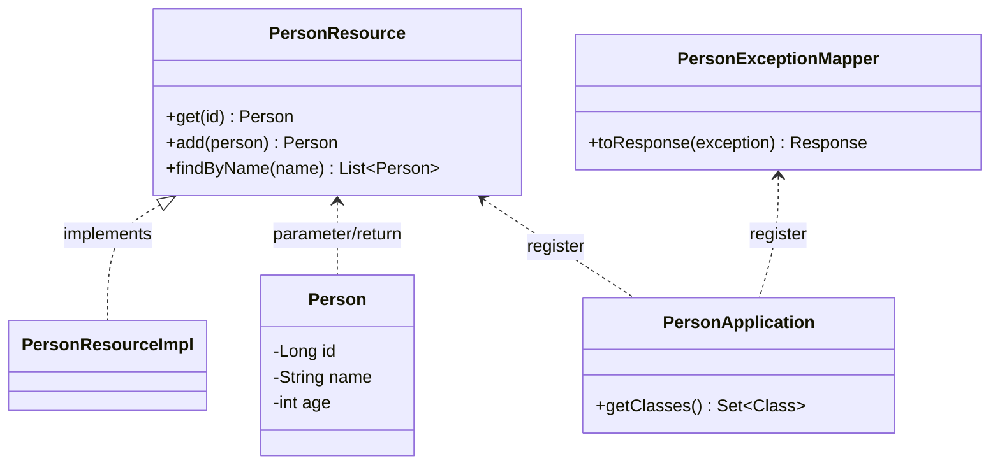

勝手に選んだMicroProfile厳選3仕様を紹介する初回はMicroProfile OpenAPI(MP OpenAPI)です。MP OpenAPIは[前回](/msa/mp/cntrn04-spec-ranking/)の概要編でも説明したとおり、API仕様の取得リクエストに対しソースコード上のアノテーション情報をもとに動的にOAS（OpenAPI Specification）ドキュメントを生成しレスポンスとして返す一連の仕組みを定めた仕様です。仕様にはMP OpenAPIランタイムの開発ベンダー視点の仕様も含まれますが、ここでは利用する側の視点でその利用方法を説明します。

今回はAPIの利用方法が主となるため、小さなサンプルアプリにMP OpenAPIのアノテーションを追加していきながらその出力を確認してくStep by Step形式で説明していきます。題材に使用するアプリは以下のGitHubリポジトリにアップしていますので、是非動かしながら見てください。
- <https://github.com/extact-io/contrarian-microprofile-sample/tree/main/03-openapi>

なお、記事は必要な部分のコードの抜粋を記載します。全体を見たい場合は適時上記GitHubのリポジトリを参照ください。

:::info
この記事はJava11+Helidon 2.4.2 + MicroProfile OpenAPI 1.2をもとに作成しています。
:::

[[TOC]]


# サンプルアプリと動作方法
それではまず題材とするサンプルアプリとその動作から見ていきましょう。
題材とするアプリの構造とコードは次のとおりです。コードはサンプルアプリを理解する上でポイントとなる[JAX-RS](https://ja.wikipedia.org/wiki/JAX-RS)のResourceインタフェースとその実装クラスの2つを記載します。

- アプリの構造


- PersonResourceインタフェース
```java
public interface PersonResource {
    @GET
    @Path("/{id}")
    @Produces(MediaType.APPLICATION_JSON)
    Person get(@PathParam("id")long id);

    @POST
    @Consumes(MediaType.APPLICATION_JSON)
    @Produces(MediaType.APPLICATION_JSON)
    Person add(Person person);

    @GET
    @Produces(MediaType.APPLICATION_JSON)
    List<Person> findByName(@QueryParam("name") String name);
}
```

- PersonResourceImplクラス
```java
@ApplicationScoped
@Path("persons")
public class PersonResourceImpl implements PersonResource  {

    private Map<Long, Person> personMap = new ConcurrentHashMap<>();

    @PostConstruct
    public void init() {
        personMap.put(1L, new Person(1L, "taro", 12));
        personMap.put(2L, new Person(2L, "hanko", 9));
        personMap.put(3L, new Person(3L, "bob", 15));
    }

    @Override
    public Person get(long id) {
        if (!personMap.containsKey(id)) {
            throw new PersonException(CauseError.NOT_FOUND);
        }
        return personMap.get(id);
    }

    @Override
    public Person add(Person person) {
        // name の重複は許可しない
        personMap.values().stream()
                .filter(p -> p.getName().equals(person.getName()))
                .findAny()
                .ifPresent(p -> {
                    throw new PersonException(CauseError.CONFLICT);
                });
        // Personの登録
        var nextId = personMap.keySet().stream().max(Long::compareTo).get() + 1;
        var newPerson = person.withId(nextId);
        personMap.put(nextId, newPerson);
        return newPerson;
    }

    @Override
    public List<Person> findByName(String name) {
        return personMap.values().stream()
                .filter(p -> p.getName().startsWith(name))
                .collect(Collectors.toList());
    }
}
```

やっていることはコードから分かるとおり、Personの追加と取得/検索となります。また、クラス図に登場しているPersonApplicationは起動するRESTリソースの登録などRESTアプリケーションの全体構成を定義するJAX-RSのお約束的なクラスとなります。

次にサンプルアプリを起動してみます。サンプルアプリをcloneまたはダウンロードし次の手順でビルド&実行[^1]します。

```shell
# Clone this repository
git clone https://github.com/extact-io/contrarian-microprofile-sample.git
# Go into the sample
cd contrarian-microprofile-sample/03-openapi/01_before
# build application
mvn clean package
# start application
java -jar target/openapi-sample.jar
```

[^1]: 余談ですが、JakartaEEとMicroProfileはMavenを標準のビルドツールとしているためそれに倣いMavenを利用してます（ということを「なんでGradleじゃないの？」という声が聞こえてくる気がするので予め言っておきます）。


起動すると以下のようなログが出力されます。一番下の`情報: Helidon MP 2.4.2 features:`のメッセージが出力されれば起動完了です。

```
~~ snip ~~
3月 23, 2022 9:58:35 午後 io.helidon.webserver.NettyWebServer lambda$start$8
情報: Channel '@default' started: [id: 0xa4700343, L:/0:0:0:0:0:0:0:0:7001]
3月 23, 2022 9:58:35 午後 io.helidon.microprofile.server.ServerCdiExtension startServer
情報: Server started on http://localhost:7001 (and all other host addresses) in 3469 milliseconds (since JVM startup).
3月 23, 2022 9:58:36 午後 io.helidon.common.HelidonFeatures features
情報: Helidon MP 2.4.2 features: [CDI, Config, Fault Tolerance, Health, JAX-RS, Metrics, Open API, REST Client, Security, Server, Tracing]
```

:::info
`情報: Server started on http://localhost:7001`のようにログにはNettyWebServerのListenポートが出力されます。デフォルトは7001ポートでHTTPがListenされますが、環境やHelidonのバージョンなどによっても変わる場合があります。記事はデフォルトの7001ポートを前提に説明しますが、起動ログからListenポートを確認し、異なる場合は読み替えて手順を実施してください。
:::

起動ができたので本題とは直接関係はないですがサンプルアプリのイメージを掴むためREST APIを呼び出してみましょう。APIは参照(get)、登録(add)、検索(findByName)の3つありますので、それぞれcurlで動作を確認してみます。

- 参照(get)
```shell
# 該当あり
curl -X GET http://localhost:7001/api/persons/1 -w ':%{http_code}\n'
{"age":12,"id":1,"name":"taro"}:200

# 該当なし
curl -X GET http://localhost:7001/api/persons/9 -w ':%{http_code}\n'
Not Found:404
```

- 登録(add)
```shell
# toshioを登録
curl -X POST -H "Content-Type: application/json" -d '{"id":null,"name":"toshio","age":20}' http://localhost:7001/api/persons -w ':%{http_code}\n'
{"age":20,"id":4,"name":"toshio"}:200

# toshioを再度登録（重複エラー）
curl -X POST -H "Content-Type: application/json" -d '{"id":null,"name":"toshio","age":20}' http://localhost:7001/api/persons -w ':%{http_code}\n'
Conflict:409
```

- 検索(findByName)
```shell
# nameが't'から始まるpersonを検索（該当複数）
curl -X GET http://localhost:7001/api/persons?name=t -w ':%{http_code}\n'
[{"age":12,"id":1,"name":"taro"},{"age":20,"id":4,"name":"toshio"}]:200

# nameが'x'から始まるpersonを検索（該当なし）
curl -X GET http://localhost:7001/api/persons?name=x -w ':%{http_code}\n'
[]:200
```


うまく動きましたでしょうか？サンプルアプリのイメージが掴めたら準備は完了です。次からはこのサンプルアプリにMP OpenAPIを使ってAPI仕様を定義していきましょう！


:::column:Helidonにおける利用機能のON/OFF
`情報: Helidon MP 2.4.2 features: [CDI, Config, Fault Tolerance, ...]`の起動ログから分かるとおり、サンプルアプリはHelidonのすべての機能(feature)が起動します。Helidonは起動時にfeatureに対するbootstrapクラスをclasspathから検索し、見つかったbootstrapクラスからfeatureの起動を行います。よって、利用したいfeatureがある場合、そのjarをclasspathに含めればよいだけです。

また、Helidonにbootstrapなるクラスがある訳ではなく、その多くはCDIコンテナ起動時に実行される`jakarta.enterprise.inject.spi.Extension`で実装されています。このExtension実装はhelidon-microprofile-cdiのように概ねartifactIdがhelidon-microprofile-\<featureName\>となっているjarに格納されています[^2]。ですので、利用したいfeatureが起動時に組み込まれていない場合は、classpathに該当するjarが含まれているか確認してみてください。

とは言うもののfeatureを起動させるjarを1つずつ調べながらpomにdependencyを追加していくのはかなり骨が折れます。まずはお試しで動かしてみたいと言った場合は、Helidon MPのすべての機能が組み込まれる次のartifactを利用するのがお勧めです。サンプルアプリもこの全部入りartifactを利用しているため、すべてのfeatureが起動するようになっています。
```xml
<dependency>
    <groupId>io.helidon.microprofile.bundles</groupId>
    <artifactId>helidon-microprofile</artifactId>
</dependency>
```

ただし、この全部入りartifactは便利ですがその反面、利用しないfeatureに関連する大量のjarも含まれてくるため実開発での利用はお勧めしません[^3]。Helidonに限らず開発では必要なjarだけに依存を留めるのが大原則です。
:::

[^2]: 機能の有効方法やExtension実装がどのjarに入っているかは公式ページにも記載がありません。ですので必要なjarだけがclasspathに乗るようにしたいと言った場合、嗅覚を働かせてtry&errorしてみるしかないのが実際のところです。

[^3]: 全部入りのartifactを利用しているサンプルサプリでは`.target/lib`になんと147個のjarが含ます。


# そのままでも結構使えるMicroProfile OpenAPI
MP OpenAPIはAPI仕様を生成するために必要なアノテーションとその生成方法を定めています。[前回](/msa/mp/cntrn04-spec-ranking/)のMP OpenAPIの紹介でも触れたましたが、実は何もアノテーションを付けなくてもそれなりに仕様として必要な情報を生成してくれます。

ということで、アノテーションがなにも付いてない状態でどの程度の出力をしてくれるかみてみましょう。

API仕様が公開されるパスは`/openapi`とMP OpenAPI仕様でき決められています。ですので、MP OpenAPIによるAPI仕様を取得した場合はRESTリクエストを投げるサーバに`/openapi`のGETをするだけです。これはHelidonだろうがOpenLibertyだろうがMP OpenAPIを使っている限りすべて同じとなります。

ではcurlでリクエストしてみます。

```shell
curl -X GET http://localhost:7001/openapi
```
- `/openapi`のレスポンス
```yaml
info:
  title: Generated API
  version: '1.0'
openapi: 3.0.3
paths:
  /persons:
    post:
      requestBody:
        content:
          application/json:
            schema:
              type: object
      responses:
        '200':
          content:
            application/json:
              schema:
                type: object
          description: OK
    get:
      parameters:
      -
        in: query
        name: name
        schema:
          type: string
      responses:
        '200':
          content:
            application/json:
              schema:
                items:  {}
                type: array
          description: OK
  /persons/{id}:
    get:
      parameters:
      -
        in: path
        name: id
        required: true
        schema:
          format: int64
          type: integer
      responses:
        '200':
          content:
            application/json:
              schema:
                type: object
          description: OK
```

`/openapi`のレスポンスとしてそのサーバが公開しているRESTのエンドポイントやパラメータ、DTOの構造などREST APIに関する仕様がYAMLで返ってきます。

::: info
OASとMP OpenAPIの詳細については次の公式ページを確認ください
- OpenAPI Specification: <https://spec.openapis.org/oas/v3.1.0>
- MicroProfile OpenAPI: <https://download.eclipse.org/microprofile/microprofile-open-api-1.2/microprofile-openapi-spec-1.2.html>
:::


これだけでもある程度OASの詳細を知らなくともAPI仕様を読み解くはできますが、より分かりやすくするため、次は`/openapi`のレスポンスをReDocを使って見てみます。

ReDocはMP OpenAPIに関係なくOASドキュメントをビジュアル化するSPAアプリです。OASドキュメントをビジュアル化するツールはSwagger UIやStoplightなど他にもいくつかありますが、サンプルアプリではCDNから取得したjsファイル1つで手軽に利用できるReDocを仕込んでありますのでブラウザから次のURLにアクセスしてみてください。

- <http://localhost:7001/static/>

`/openapi`のレスポンスとして受け取ったOASドキュメントを次のようにビジュアル化して見ることができます。


以降の説明ではReDocについて再度触れませんが、API仕様を確認する際はReDocを使って確認してみてくだい。


:::column:サンプルアプリにおけるReDocの利用
HTTPサーバの機能としてHelidonにはREST APIの公開以外にも静的コンテンツを公開する[Serving Static Content](https://helidon.io/docs/v2/#/mp/jaxrs/04_static-content)機能があります。今回はこの機能を利用しjar内に格納したredoc.htmlを公開しています。
サンプルアリのjar内の配置と公開に関する[Serving Static Content](https://helidon.io/docs/v2/#/mp/jaxrs/04_static-content)の設定は次のとおりになっています。

- jar内のredoc.htmlの配置
```shell
src
`-- main
    |-- java
    `-- resources
        |-- META-INF
        |   |-- beans.xml
        |   `-- microprofile-config.properties
        `-- pages
           `-- redoc.html
```

- Serving Static Contentの設定(`/META-INF/microprofile-config.properties`に設定)
```properties
server.static.classpath.location = /pages
server.static.classpath.context = /static
server.static.classpath.welcome = redoc.html
```

格納しているredoc.htmlの中身はCDNからredocの実体となるjsファイルを取得するscript定義とビジュアル化するOASドキュメントの指定となります。通常このOASドキュメトにはサーバー上に配置したopenapi.ymlなどの静的ファイルを指定しますがサンプルではMP OpenAPIの機能を利用し次のようにURLを指定しています。

```html
<body>
  <redoc spec-url='http://localhost:7001/openapi'></redoc>
  <script src="https://cdn.jsdelivr.net/npm/redoc@next/bundles/redoc.standalone.js"></script>
</body>
```

こうすることで常にMP OpenAPIが動的に生成したフレッシュなOASドキュメントを参照してもらうことができます。
:::


# アプリケーション情報を定義してみよう！
ここらは本題のMP OpenAPIのアノテーションを使ってAPI仕様を肉付けしていきましょう。

まずはアプリケーション全体に関する情報をMP OpenAPIの`@OpenAPIDefinition`を使って定義してみます。`@OpenAPIDefinition`をつけるクラスやメソッドに決まりはないですが、JAX-RSでは`javax.ws.rs.core.Application`がアプリケーションの全体構成を定義するクラスとなるため、ここでは`PersonApplication`に`@OpenAPIDefinition`を付けて次のようにアプリの情報を定義してみます。

```java
@OpenAPIDefinition(info =
    @Info(
        title = "MicroProfile OpneAPI Sample", 
        version = "0.0.1-SNAPSHOT", 
        contact = 
            @Contact(
                name = "課外活動", 
                url = "https://extact-io.github.io/")))
@ApplicationScoped
@ApplicationPath("api")
public class PersonApplication extends Application {
    @Override
    public Set<Class<?>> getClasses() {
        return Set.of(
                PersonResourceImpl.class,
                PersonExceptionMapper.class);
    }
}
```

定義ができたら、先ほどと同じ手順でビルド＆実行を行い`/openapi`からAPI仕様を取得してみます。

### ビルド＆実行とAPI仕様の取得
```shell
# build application
mvn clean package
# start application
java -jar target/openapi-sample.jar
# get APISpec
curl -X GET http://localhost:7001/openapi
```

取得したAPI仕様を見ると以下のように`info`に`@OpenAPIDefinition`の内容が反映されているのが分かります。

```yaml
info:
  contact:
    name: 課外活動
    url: https://extact-io.github.io/
  title: MicroProfile OpneAPI Sample
  version: 0.0.1-SNAPSHOT
```

:::column:OASドキュメントの生成ではJandexが使われる
MP OpenAPIアノテーションからOASドキュメントを生成する際、Helidonでは[Jandex](https://github.com/wildfly/jandex)が利用されます。Jandexはアノテーションなどクラスのメタ情報を解析し、結果を独自のindexファイルに格納しておく機能となります。

クラスのメタ情報は通常実行時に必要になった都度解析されますが、メタ情報の解析は比較的コストの高い処理となります。そこで、このデメリットをカバーするものとしてJandexが登場します。

MP OpenAPIはクラスに付けられているアノテーションなどを元に動的にOASドキュメントを生成しますが、HelidonではこのOASドキュメントの生成時にJandexのインデックスフィルを参照することで処理を高速化しています。このJandexファイルはサンプルではビルド時[^4]に作成されるようpom.xmlに次のように設定しています。また、インデックスファイルはJandexプライグインのデフォルトで`target/classes/META-INF/jandex.idx`に作成されています。
```xml
<build>
  ...
  <plugin>
    <groupId>org.jboss.jandex</groupId>
    <artifactId>jandex-maven-plugin</artifactId>
    <executions>
      <execution>
        <id>make-index</id>
      </execution>
    </executions>
  </plugin>
  ...
</build>
```
:::

:::alert
classpathにjandex.idxが見つからない場合、HelidonのMP OpenAPI実装では実行時にクラスのメタ情報を解析しますが、反対にclasspath上に1つでもjandex.idxがある場合、実行時のメタ情報の解析は一切行われません。
jandex.idxの生成が行われない非Maven環境のIDEから起動している場合、実行時にメタ情報が解析されることを期待したくなりますが、Helidonから提供されるjarにはjandex.idxを内包しているものもがあり、そのjandex.idxが検索されることで実行時のクラス解析が行われず、結果ソースコードの修正が反映されない場合があります。このため、MP OpenAPIの動作を確認する際はソースコードの修正の都度Mavenでビルドを行い`java`コマンドからアプリを起動する方が無難です。
:::

:::check
CDIコンテナ実装のWeldでも起動の高速化を目的にJandexが利用されます。実際にサンプルアプリでJandexの有無で起動の速度が変わるか試してみましたが、まったくと言って良いほど違いは出ませんでした。サンプルアプリにはCDI Beanが数個程度しかないためと思われますが、CDI Beanが数百数千とある実アプリでは効果を発揮するものと思われます。
:::

[^4]: 厳密にはコンパイルで生成したファイルに対して後処理を行うprocess-classesフェーズで生成されます。


# REST APIの仕様を定義してみよう！
次はAPI仕様の中核となるREST API個々の仕様を定義していきましょう。
ところで皆さんがREST APIを呼び出す側だとした場合、それにはどのような情報が必要でしょうか？最低限、次のような情報が必要ですよね。
- エンドポイント（URL）
- リクエストパラメータの送信内容
- リクエストパラメータのデータ構造
- リクエストパラメータの送信方法（パスパラメータ or QueryString or JSON）
- レスポンスデータの内容
- レスポンスデータの構造
- エラー発生条件と返却されるステータスコード

## PesonResource#getのAPI仕様を定義してみる
これらの情報をMP OpenAPIを使ってどのよう定義するかアノテーションを付けた例をもとに見ていきます。
まずは一番シンプルなPesonResource#getは次のようになります。

```java
@GET            // JAX-RS
@Path("/{id}")  // JAX-RS
@Produces(MediaType.APPLICATION_JSON) // JAX-RS
@Operation( // MP-OpneAPI
    operationId = "get", 
    summary = "Person情報を取得する", 
    description = "指定されたIDに対するPerson情報を取得する")
@Parameter( // MP-OpneAPI
    name = "id", 
    description = "PersonのインスタンスID", 
    required = true, 
    schema = @Schema(
        implementation = Long.class, 
        minimum = "0", 
        maximum = "9999999"))
@APIResponse( // MP-OpneAPI
    responseCode = "200", 
    description = "成功")
@APIResponse( // MP-OpneAPI
    responseCode = "404", 
    description = "該当なし", 
    content = @Content(
        mediaType = "text/plan", 
        example = "Not Found"))
Person get(@PathParam("id")long id);
```

アノテーションがどのような意味を持つかは生成されたOASドキュメントを見ながらの方が理解しやすいため、細かい説明は後にして上記のソースコードから生成されるAPI仕様を[先ほどと同じ手順](#ビルド＆実行とapi仕様の取得)で取得してみましょう。

上記のようにソースコードを定義するとPersonResource#getに対するAPI仕様として次のレスポンスが返ってきます。

```yaml
paths:
  /api/persons/{id}:  # 1.
    get:              # 2.
      operationId: get  # 3.
      summary: Person情報を取得する # 3.
      description: 指定されたIDに対するPerson情報を取得する # 3.
      parameters: # 4.
      -
        description: PersonのインスタンスID
        in: path
        name: id
        required: true
        schema: # 5.
          format: int64
          maximum: 9999999
          minimum: 0
          type: integer
      responses:  # 6.
        '200':    # 7.
          description: 成功
          content:
            application/json:
              schema:
                $ref: '#/components/schemas/Person'
        '404':    # 8.
          description: 該当なし
          content:
            text/plan:
              example: Not Found
components: # 9.
  schemas:  # 9.
    Person: # 10.
      properties:
        age:
          format: int32
          type: integer
        id:
          format: int64
          type: integer
        name:
          type: string
      type: object
```
(必要な部分のみ抜粋し出力順は見やすいように変更しています。以降も同様)

このAPI仕様はソースコードを入力としてMP OpenAPIのランタイムによりアノテーションが次のように解釈された結果となります。（下記の番号が上記API仕様のコメント番号と対応しています）

1. エンドポイントごとのAPI仕様が展開されます。
2. エンドポイントに対するHTTPメソッド（`@GET`）が出力されます。
3. `@Operation`で定義したAPI操作全般に関する内容が出力されます。
4. `@Parameter`の定義とコードの実装をもとにパラメータ仕様が出力されます。`@Parameter`の`name`属性と`@PathParam`の`value`属性により`@Parameter`が対象としているリクエストパラメータが紐づけられます。これによりパラメータの送信方法を表す`in`キーに対する値(`path`)がコードから補完され出力されます。
5. `@Schema`で定義されたデータ構造の詳細が出力されます。例では数値の精度（`int64`）を明示するために`implementation`属性で`Long`実装であることと業務上取り得る値を`minimum`と`maximum`の属性で指定しているため、その内容が出力されます。
6. `@APIResponse`で定義した各ステータスコードに対する仕様が展開されます。なお、ステータスコード`200`は`@APIResponse`を定義しなくてもデフォルトで情報が出力されます。
7. `@APIResponse`で定義したステータスコード`200`に対する定義とコードの実装から情報が出力されます。`@APIResponse`では`description`属性しか定義していませんが、返却されるデータ構造はメソッドの戻り値からPersonインスタンスであることが補完され、そのスキーマ情報への参照(`$ref`)が出力されます。また、Personインスタンスとして返却されるデータ形式(`application/json`)についても`@Produces`から補完され出力されます。
8. `@APIResponse`で定義したステータスコード`404`に対する情報が出力されます。ステータスコード`404`のボティとして返却されるデータの形式はJAX-RSのアノテーションでは指定されていないため、ステータスコード`200`の定義とは違いコードからこの情報を補完することができないため、ステータスコード`404`では`@Content`で詳細を定義しています。
9.  メソッドの引数と戻り値に表れるDTOなどのデータクラスは複数のエンドポイントからから共通的に利用できるようにクラス実装から自動でOASのcomponents/schemasとして出力されます。
10. Personクラスの実装からプロパティ名やデータ型が出力されます。

MP OpenAPIのトップレベルのアノテーションは説明から分かるとおり`@Operation`と`@Parameter`、`@APIResponse`の3つのみで、他のアノテーションはRESTリソースとして元から付けられていたJAX-RSアノテーションになります。

MP OpenAPIではコードやJAX-RSのアノテーションから解釈できる部分はその内容からOAS情報を補完してくれます。例えば今回の場合であれば、パラメータの送信方法はパスパラメータになりますが、これはJAX-RSの`@PathParam`から解釈可能なため、改めてMP OpenAPIの`@Parameter`の`in`属性に`in = ParameterIn.PATH`と定義する必要はありません。

このように、MP OpenAPIを使うことで、少ない定義量でリッチなOASドキュメントを生成することができるとともに実際に動作するコードからかなりの情報が生成されるため（typoなどのない）精度の高いAPI仕様を公開することができます。


## PesonResource#addのAPI仕様を定義してみる
この勢いでPesonResource#addのAPI仕様も定義してみましょう。
PesonResource#getではPersonが戻り値で使われていましたが、PesonResource#addではこれが引数で使われている点がAPI的な主な違いとなります。他の点は概ね同じとなるため今回はこの点に着目して説明します。

アノテーションを付けたコード例とそこから出力されたAPI仕様は次のようになります。API仕様は[先ほどと同じ手順](#ビルド＆実行とapi仕様の取得)で取得します。

- API仕様を定義したPesonResource#add実装
```java
@POST // JAX-RS
@Consumes(MediaType.APPLICATION_JSON) // JAX-RS
@Produces(MediaType.APPLICATION_JSON) // JAX-RS
@Operation( // MP-OpenAPI
    operationId = "add", 
    summary = "Person情報を登録する", 
    description = "IDは登録時に自動で採番する")
@Parameter( // MP-OpenAPI
    name = "person", 
    description = "登録するPersonインスタンス", 
    required = true)
@APIResponse( // MP-OpenAPI
    responseCode = "200", 
    description = "成功。IDには採番した値を設定する")
@APIResponse( // MP-OpenAPI
    responseCode = "409", 
    description = "既に使用されているためnameのため重複エラー", 
    content = @Content(
        mediaType = "text/plan", example = "Conflict"))
Person add(Person person);
```

- 生成されたPesonResource#addのAPI仕様
```yaml
/api/persons:
  post:
    operationId: add
    summary: Person情報を登録する
    description: IDは登録時に自動で採番する
    requestBody:
      content:
        application/json:
          schema:
            $ref: '#/components/schemas/Person'
    responses:
      '200':
        description: 成功。IDには採番した値を設定する
        content:
          application/json:
            schema:
              $ref: '#/components/schemas/Person'
      '409':
        description: 既に使用されているためnameのため重複エラー
        content:
          text/plan:
            example: Conflict
```

`@Parameter`でパラメータを定義しますが、PesonResource#getと同様にメソッドの引数からPersonインスタンスであることが補完され、そのスキーマ情報への参照(`$ref`)が出力されます。また、データ形式(`application/json`)についても同様にJAX-RSの`@Consumes`から補完され出力されます。

PesonResource#getの戻り値とPesonResource#addの引数と戻り値には同じPersonクラスが使われていますが、いずれも同じ実体（#/components/schemas/Person）が参照されるようになっています。

## PesonResource#findByNameのAPI仕様を定義してみる
最後はPesonResource#findByNameです。
今までのAPIとの大きな違いは戻り値がArrayである点とパラメータがQueryStringとなる2点です。この2点はともにメソッド定義から解釈できるため、MP OpenAPIのアノテーションは付けなくてもコードから情報が補完されます。

では、コード例とAPI仕様を見てみましょう。API仕様は[先ほどと同じ手順](#ビルド＆実行とapi仕様の取得)で取得します。

- API仕様を定義したPesonResource#findByName実装
```java
@GET  // JAX-RS
@Produces(MediaType.APPLICATION_JSON) // JAX-RS
@Operation( // MP-OpenAPI
    operationId = "findByName", 
    summary = "Person情報を検索する", 
    description = "QueryStringで指定されたnameに前方一致するPerson情報を検索する")
@Parameter( // MP-OpenAPI
    name = "name", 
    description = "検索するnameの値", 
    required = true)
@APIResponse( // MP-OpenAPI
    responseCode = "200", 
    description = "成功。該当なしの場合は空リストで返却する")
List<Person> findByName(@QueryParam("name") String name);
```

- 生成されたPesonResource#findByNameのAPI仕様
```yaml
/api/persons:
  get:
    operationId: findByName
    summary: Person情報を検索する
    description: QueryStringで指定されたnameに前方一致するPerson情報を検索する
    parameters:
    -
      description: 検索するnameの値
      in: query
      name: name
      required: true
      schema:
        type: string
    responses:
      '200':
        description: 成功。該当なしの場合は空リストで返却する
        content:
          application/json:
            schema:
              items:
                $ref: '#/components/schemas/Person'
              type: array
```

上述したとおりMP OpenAPIのアノテーションで明示はしていませんが、確かにパラメータの送信方法は`in: query`, responseのtypeは`array`になっているのが分かります。


### 共通情報を定義してみる
引数や戻り値のデータクラスは実装をもとに`components/schemas`に定義されることを見てきましたが、データクラスやプロパティの説明や制約を追加したい場合もあります。ここではこのような場合に対する定義方法を見ていきます。

答えから先に言うと、この方法は簡単で今まで何度か出てきた`@Schema`をデータクラスに定義するだけです。では、さっそく`@Schema`をPersonに追加したコード例と生成されるAPI仕様を見てみましょう。API仕様は[先ほどと同じ手順](#ビルド＆実行とapi仕様の取得)で取得します。

- API仕様を定義したPerson実装
```java
@Schema(description = "Person情報") // MP-OpenAPI
@NoArgsConstructor  // Lombok
@AllArgsConstructor // Lombok
@Setter @Getter     // Lombok
public class Person {
    @With // Lombok
    @Schema(  // MP-OpenAPI
        description = "インスタンスID", 
        implementation = Long.class, 
        minimum = "0", 
        maximum = "9999999")
    private Long id;
    @Schema(  // MP-OpenAPI
        description = "名前", 
        required = true,  
        minLength = 1, 
        maxLength = 10)
    private String name;
    @Schema(  // MP-OpenAPI
        description = "年齢", 
        required = true,  
        implementation = Integer.class, 
        minimum = "0", 
        maximum = "199")
    private int age;
}
```

- 生成されたPesonのAPI仕様
```yaml
components:
  schemas:
    Person:
      type: object
      description: Person情報
      required:
      - name
      - age
      properties:
        id:
          description: インスタンスID
          format: int64
          maximum: 9999999
          minimum: 0
          type: integer
        name:
          description: 名前
          maxLength: 10
          minLength: 1
          type: string
        age:
          description: 年齢
          format: int32
          maximum: 199
          minimum: 0
          type: integer
```

API仕様を見て分かるとおり`@Schema`で定義した説明や制約がレスポンスに反映されています。また、このcomponents/schemas定義は各API仕様の`$ref`から参照される実体となります。ですので、データクラスを参照する側のすべてが自ずと同じ内容となることが担保されます（One Fact in One Placeですね）。

:::column:信頼できる唯一の情報源の起点
OASを使った開発スタイルとして、プラットフォームや実装にニュートラルなAPIスキーマ(要はAPI仕様)をまずOASで定義し、クライアントやサーバ間で合意したそのAPIスキーマを「信頼できる唯一の情報源」(Single Source of Truth)として開発を進めていく「スキーマファースト」がよく知られています。

これに対しMP OpenAPIを使った開発は、JavaのインタフェースでAPI仕様を定義しそこから取得したAPIスキーマをクライアントとサーバ間の「信頼できる唯一の情報源」として開発を進めて行きます。

どちらもOASによるAPIスキーマを「信頼できる唯一の情報源」として扱うことに変わりはないですが、スキーマファーストの開発スタイルがトップダウンアプローチであるのに対し、MP OpenAPIを使った開発は実装を起点としたボトムアップアプローチとなり、同じOASを使った開発でもスタイルが異なります。

これは一義的にどちらがいい悪いではなく、あくまでもスタイルですので、開発対象や組織、文化により適するものを選択すべきです。筆者としては今回のMP OpenAPIを使った開発スタイルは、当然ですがサーバサイドがJavaでかつ仕様が比較的軽量なプロセスで決定する小規模な開発でその効力が発揮されるのではないかと考えています。
:::

# リファレンスアプリでの利用例
[第3回](/msa/mp/cntrn03-sampleapp-helidon/)で紹介したMicroProfileを使った[リファレンスアプリ(RMS)](https://github.com/extact-io/rms)では上述の「(コラム)サンプルアプリにおけるReDocの利用」と同じ方法でAPI仕様を公開しています。このAPI仕様を定義している実際のコードとそこから生成されるAPI仕様をReDocで公開したものは以下になります。

- API仕様を定義しているソースコード
  - [ApplicationConfig.java](https://github.com/extact-io/rms/blob/main/rms-server/src/main/java/io/extact/rms/external/webapi/ApplicationConfig.java)
  - [WebApiSpec.java](https://github.com/extact-io/rms/blob/main/rms-server/src/main/java/io/extact/rms/external/webapi/WebApiSpec.java)
- MP OpenAPIによりソースコードから生成されたAPI仕様
  - [ReDoc](https://app.extact.io/static/)

ReDocを見ると細かいレベルまで仕様が表現されているのが分かります。これはすべて上記ソースコードから生成されたもので一切手は加えていません。このことからMP OpenAPIが実践でどのくらい使えるか理解いただけるかと思います。

# まとめ
[前回](/msa/mp/cntrn04-spec-ranking/)はMP OpenAPIの前振りとしてを次のようなことを言っていました。
> MicroProfile OpenAPIを利用することで、図のように『REST APIを公開しているサーバが、自身が動作させているモジュールから取得した情報をもとに、OASでAPI仕様を返却する』と言った、ある意味完全なまでの仕様と実装の一致を実現することが可能となります。

今回紹介したのはMP OpenAPIの基本的な部分のみのですが、それだけでもこの意図や感覚を理解いただけたのではないかと思います。

MP OpenAPIはOASで定義されているかなりの要素をカバーしています。例えば、データに対する制約として今回はmaxLenght/minLengthとmin/maxの例を紹介しましたが@Schemaには他にも定義可能な情報や制約等が豊富に用意されています。

また、今回は紹介できませんでしたが入出力の具体例を定義する@ExampleObjectや認証方法を定義する@SecuritySchemeなど制約以外に関する定義も多岐に渡り用意されており実践には十分な内容となっています。

是非MP OpenAPIによるAPI仕様の定義に挑戦してみていただければと思います。

