勝手に選んだMicroProfile厳選仕様を紹介していく2回目はMicroProfile Config(MP Config)です。MP Configは[第4回](/msa/mp/cntrn04-spec-ranking/)の概要編で触れたとおりマイクロサービスでの利用が考慮された使い勝手の良い設定機能です。今回はその基本機能から特徴的な機能や応用機能まで実装例をもとに紹介していきます。

なお、記事はコードの抜粋を記載します。全体を見たい場合や動作を確認したい場合は以下のGitHubリポジトリを参照ください。
- <https://github.com/extact-io/contrarian-microprofile-sample/tree/main/02-config>

また、MicroProfileは"逆張りのMicroProfile"として連載しています。他の記事は[こちら](/msa/#microprofile)からどうぞ。


:::info
この記事はJava11+Helidon 2.4.2 + MicroProfile Config 1.4をもとに作成しています。
:::

[[TOC]]

## 設定の読み込み
Javaの標準的な設定機能と言えばpropertiesファイルの読み込みと取得を行う`java.util.Properties` (もしくは`java.util.ResourceBundle`)ですが、MP Configも同じようにその基本機能として設定の読み込みと取得の機能を持っています。

これに加えてMP Configでは以下の3つがデフォルトの設定源として定義されています。これらの設定源は仕様として定義されているため、実装や環境に依らずMP Configでは常に使用することができます。

-	システムプロパティ
-	環境変数
-	/META-INF/microprofile-config.properties

MP Configはシステムプロパティと環境変数もpropertiesファイルなどと同じように設定情報を取得することができます。また、`/META-INF/microprofile-config.properties`のファイルはデフォルトとしてクラスパスから検索され読み込みが行われます。

それではこれらデフォルトの設定源から値を取得するMP Configのサンプルコードを見ていきましょう。なお、サンプルコードはclasspath上の`/META-INF/microprofile-config.properties`のファイルが配置されていることを前提としています。

- propertiesファイル(`/META-INF/microprofile-config.properties`)
```properties
name = mamezou
foo.bar.baz = Hello
```

- 設定の読み込みと取得のサンプルコード
```java
public static void main(String[] args) {
    // Configインスタンスの取得
    Config config = ConfigProvider.getConfig();

    // propertiesファイルの設定値の取得（キー名区切りなし）
    String name = config.getValue("name", String.class);
    // propertiesファイルの設定値の取得（キー名区切りあり）
    String baz = config.getValue("foo.bar.baz", String.class);
    // どこにも設定されていない設定値
    Optional<String> address = config.getOptionalValue("address", String.class);
    // システムプロパティの設定値の取得
    String version = config.getValue("java.version", String.class);
    // 環境変数の設定値の取得
    Optional<String> envUserName  = config.getOptionalValue("USERNAME", String.class);

    // 取得値の出力
    System.out.println("name:" + name);
    System.out.println("foo.bar.baz:" + baz);
    System.out.println("address:" + address.orElse("empty"));
    System.out.println("java.version:" + version);
    System.out.println("USERNAME:" + envUserName.orElse("no def"));
}
```

- 実行結果
```shell
name:mamezou
foo.bar.baz:Hello
address:empty
java.version:11.0.5  <-- 使用しているJDKのバージョンが出力されます
USERNAME:ogiwara     <-- Windowsでは自分のログインIDが出力されます
```

MP ConfigはJava SE環境でも動作可能なため、上記のサンプルコードはmainメソッドから起動しています。1行目のConfigProvider#getConfigの呼び出しで設定ファイルが実際に読み込まれその結果がConfigインスタンスとして返されます。そして、このConfigインスタンスが設定情報全体を表すオブジェクトとなります。

HelidonではConfigインスタンスはキャッシュされるため、ConfigProvider#getConfigを何度読みだしても同じインスタンスが返されます。キャッシュの扱いは仕様に明記されていませんが、常識的に考えてどの実装でもキャッシュされるものと思われます。

また、サンプルコードの例は規定のシステムプロパティを取得するものでしたが、起動パラメータで`-D<propName>=<value>`により定義されたシステムプロパティも同様に取得できます。これは環境変数についても同じとなります。

:::alert
ConfigインタフェースにはMP Configの`org.eclipse.microprofile.config.Config`とHelidon独自の`io.helidon.config.Config`の2つあります。IDEを使っている場合、間違えやすいので注意してください。サンプルコードはMP Configの例ですので使用するのは前者となります。
:::


## 設定値の型変換
先ほどのサンプルは設定値をすべて文字列で取得する例でしたが他の型を指定することも可能です。また、この指定可能な型、言い方を変えるとMP Configのランタイムが標準としてサポートすべき型はMP Configの仕様で決められています。

標準でサポートされる代表的な型をサンプルコードで示します。なお、標準でサポートされるすべての型は公式ページの["Configuration for MicroProfile - Converter"](https://download.eclipse.org/microprofile/microprofile-config-1.4/microprofile-config-spec.html#converter)を参照ください

- propertiesファイル(`/META-INF/microprofile-config.properties`)
```properties
booleanValue = true
intValue = 100
doubleValue = 123.456
classValue = io.extact.mp.sample.config.SimpleSampleMain
arrayValue = 1,2,3,4
```

- 型変換ありのサンプルコード
```java
public static void main(String[] args) {
    // Configインスタンスの取得
    Config config = ConfigProvider.getConfig();

    // "true"をbooleanとして取得
    boolean booleanValue = config.getValue("booleanValue", boolean.class);
    // "100"をintとして取得
    int intValue = config.getValue("intValue", int.class);
    // "123.456"をdoubleとして取得
    double doubleValue = config.getValue("doubleValue", double.class);
    // "io.extact.mp.sample.config.SimpleSampleMain"をClassインスタンスとして取得
    Class<?> classValue = config.getValue("classValue", Class.class);
    // "1,2,3,4"を単一文字列として取得
    String stringValue = config.getValue("arrayValue", String.class);
    // "1,2,3,4"をカンマで分割した文字列配列として取得
    String[] stringArrayValue = config.getValue("arrayValue", String[].class);

    // 取得値の出力
    System.out.println("booleanValue:" + booleanValue);
    System.out.println("intValue:" + intValue);
    System.out.println("doubleValue:" + doubleValue);
    System.out.println("classValue:" + classValue.getName());
    System.out.println("arrayValue:" + stringValue);
    System.out.println("arrayValue:" + String.join(":", stringArrayValue));
}
```

- 実行結果
```shell
booleanValue:true
intValue:100
doubleValue:123.456
classValue:io.extact.mp.sample.config.SimpleSampleMain
arrayValue:1,2,3,4
arrayValue:1:2:3:4
```

booleanの型変換に関して補足すると、`true`に変換される文字列は例の他にも"1", "YES", "Y" "ON"があります。一方、`false`に変換する文字列は定義されておらず、trueに変換できなかった値をfalseに変換します。

必要となりそうな型は概ね標準でサポートされているため、実際の開発で困ることはないかと思いますが、欲を言えばenum(列挙型)も標準で対応して欲しいところです。

また、今回は説明しませんが、MP Configの`Converter`インタフェースを実装することで独自型への変換や独自ルールによる変換も可能です。

:::info
記事がベースとしているMP Config 1.4ではサポートされていませんが、2.0からは複数の設定項目を任意のデータクラスにバインドする機能や`foo = ${bar}`といった変数置換など便利な機能が多く追加されています。興味がある方は["Release Notes for MicroProfile Config 2.0"](https://download.eclipse.org/microprofile/microprofile-config-2.0/microprofile-config-spec-2.0.html#release_notes_20)をチェックしてみてください。
:::

## CDIインテグレーション
JavaSE環境での利用を説明してきましたが、MP ConfigにはCDIとのインテグレーション機能も定義されています。このため、特段の仕掛けや設定は不要でCDIからMP Configを利用することができます。

このCDIインテグレーションに含まれる機能は大小様々ありますが、その中心となるのは次の2つになります

1. CDIコンテナ側で設定源の読み込みを行ってくれる
2. Configインスタンスを@Injectでインジェクション可能なInjectableオブジェクトにしてくれる

1.はJavaSE環境で自分で行っていた`ConfigProvider.getConfig()`をCDIコンテナ側が必要に応じて必要なタイミングで読み込み処理を行ってくれるようになります。
2.は平たく言うとConfigインスタンスを`@Inject`で取得可能にしてくれます。

その他細かいところではConfigインスタンスではなく指定した特定の項目のみをInjectしてくれる`@ConfigProperty`の機能やデフォルト値の設定機能などもあります。

機能の説明はここまでにして、それではコード例を見ていきましょう。

- propertiesファイル(`/META-INF/microprofile-config.properties`)
```properties
name = mamezou
age = 23
foo.bar.baz = Hello
values = 1,2,3,4
```

- CDIでConfig情報を取得するサンプルコード
```java
@ApplicationScoped
public class CdiSampleBean {
    // Field InjectionによるConfigインスタンスの取得
    @Inject
    private Config fieldConfig;

    // Field Injectionによる設定項目ごとの取得
    @Inject
    @ConfigProperty(name = "name")
    private String name;
    // Field Injectionによる設定項目ごとの取得（型変換あり）
    @Inject
    @ConfigProperty(name = "age")
    private int age;
    // Field Injectionによる設定項目ごとの取得（デフォルト値設定あり）
    @Inject
    @ConfigProperty(name = "address", defaultValue = "empty")
    private String address;
    // Field Injectionによる設定項目ごとの取得（キー名区切りあり）
    @Inject
    @ConfigProperty(name = "foo.bar.baz")
    private String baz;
    // Field Injectionによる設定項目ごとの取得（配列変換あり）
    @Inject
    @ConfigProperty(name = "values")
    private String[] arrayValues;
    // Field Injectionによる設定項目ごとの取得（List変換あり）
    @Inject
    @ConfigProperty(name = "values")
    private List<String> listValues;
    // Field Injectionによる設定項目ごとの取得（Set変換あり）
    @Inject
    @ConfigProperty(name = "values")
    private Set<String> setValues;

    // Constructor InjectionによるConfigインスタンスの取得
    @Inject
    public CdiSampleBean(Config config) {
        ...
    }
    ...
}
```

- 実行結果
```shell
**** ConstructorInjectionConfig ****
name:mamezou
age:23
address:empty
foo.bar.baz:Hello
values:1:2:3:4

**** FieldInjectionConfig ****
name:mamezou
age:23
address:empty
foo.bar.baz:Hello
values:1:2:3:4

**** ConfigProperties ****
name:mamezou
age:23
address:empty
foo.bar.baz:Hello
arrayValues:1:2:3:4
arrayValues:1-2-3-4
setValues:1/2/3/4
```


サンプルコードを見て分かるとおり、JavaSE環境で行っていたConfigインタフェースの操作と同じことがCDI環境ではアノテーションベースで行えます。
これに加えてConfigインタフェースでは複数要素を配列型でしか取得できませんでしたが、@ConfigPropertyではサンプルコードのようにListとSetでも取得が可能です。

:::column:CDI Beanから離れているオブジェクトでの設定情報の取得
CDI BeanではなくCDI Beanから呼び出される普通のオブジェクトから設定情報を取得したい場合、どうするのがいいのでしょうか？という相談はよく聞かれます。

案としては引数のバケツリレーで引き渡す方やSpringのgetBeanよろしく`CDI.current().select()`でConfigインスタンスを取得するなどが考えれます。いずれも絶対にダメではありませんが、よりシンプルな方法があります。それはJavaSE環境で利用していた`ConfigProvider.getConfig()`でConfigインスタンスを取得する方法です。この方法はCDI環境でMP Configを使っている場合でも利用できます。もっというとCDIインテグレーションはConfigProviderから生成されたConfigインスタンスをInjetableにしたものになります。ですので実体はどちらも同じです。

したがって、CDI環境で動作させているけど手元にCDI Beanがないような時には必要になったところで`ConfigProvider.getConfig()`で設定情報を取得するのが一番リーズナブルです。ただし、下のコラムでも触れていますがテスタビリティは低下しますので必要以上に使うのは避けましょう。CDI Beanからの呼び出しが離れていないのであれば引数で引き回す方法も選択肢になり得ます。
:::

:::column:Configインスタンスはどの方法で取得するべきか
ここまでの説明でConfigインスタンスの取得方法として次の3つがでてきましたが、どれを使うべきなのか？と思われた方もいるかと思います。
- コンストラクタインジェクション
- フィールドインジェクション
- ConfigProvider#getConfig
  
利用するクラスやアノテーションは`org.eclipse.microprofile.config.*`にいずれも収まっているため、ポータビリティの観点での違いはありません。また、パフォーマンについては素の機能である分、3つの相対比較ではConfigProvider#getConfigが有利ではあると思われますが、違いは無視できる程度であると考えられるため、パフォーマンスにも違いはないと判断できます。では、どこに違いがでてくるのでしょうか？それはテスタビリティです。

設定情報の取得をフィールドインジェクションやConfigProvider#getConfigで行った場合、対象のCDI Beanの単体テストではprivateフィールドに対する外部からの値設定やstaticメソッドのmock化といったカプセル化を破る技巧が必要になります。これに対してコンストラクタインジェクションではConfigインタフェースのスタブオブジェクトをコンストラクタに渡せばよいだけのため小細工が必要になることはありません。
したがって、CDI環境における設定情報の取得方法は1つ目のコンストラクタインジェクションが第一選択肢となります。なお、これはConfigインスタンスに限らずインジェクション全般に言えることになります。
:::

## 設定形式の抽象化
MP Configではその設定源に対する設定形式は限定していません。事実、Configインタフェースには特定の設定形式に依存したメソッドは存在せず、利用者側は設定源の設定形式を意識せず抽象化されたConfigインタフェースから情報を取得できるようになっています。

この設定形式の抽象化は実は既に見てきていました。最初の「[設定の読み込み](#設定の読み込み)」のサンプルではシステムプロパティ、環境変数、そしてpropertiesファイルと設定形式の異なる3つの設定源から設定値の取得を行っていましたが、ソースコード上でそれらの設定形式を意識することはありませんでした。

ただし、MP Configは仕様ですので、MP Configで個別の設定形式を扱えるようにするには実装が必要となります。MP Configが標準でサポートしている設定形式は先ほどの3つだけとなります。それ以外の設定形式をMP Configで扱えるようにするにはHelidonなどのMicroProfileフレームワークが拡張している独自実装を利用するか、設定形式に応じたMP Configの実装を自分で作成するかのどちらかとなります。

MP Configを自分で実装するのは若干ハードルが高いため、ここではHelidonから提供されるYAMLの設定情報読み込み機能を使い、同じ情報をproperties形式とYAML形式でそれぞれ定義し、どちらもソースコードから同じように取得できることをみていきましょう。

:::alert
本文でも触れましたがYAML機能はHelidonから提供されるMP Configの独自実装となります。YAMLのサポートはMP Configでは仕様として定義されておらず、MicroProfileの標準機能ではありませんので注意してください。
なお、HelidonのYAML機能はhelidon-config-yaml-mp.jar[^1]を依存に含めるだけで有効になります。また、classpath上の`/application.yaml`を自動で検索し読み込みを行ってくれます。つまり、HelidonでYAMLを使いたい場合はclasspath直下にapplication.yamlを配置するだけです。
:::
[^1]: [サンプルアプリ](https://github.com/extact-io/contrarian-microprofile-sample/tree/main/02-config)で利用している全部入りの`io.helidon.microprofile.bundles:helidon-microprofile`には該当のjarは含まれています。

- propertiesファイル(`/META-INF/microprofile-config.properties`)
```properties
person.name = mamezou
person.age = 23
person.address = shinjuku
```

- YAML(`/application.yaml`)
```yaml
person:
  name: tech
  age: 1
  address: virtual
```

- 上記設定を取得するサンプルコード
```java
public static void main(String[] args) {
    // Configインスタンスの取得
    Config config = ConfigProvider.getConfig();
    // 設定値の取得
    String name = config.getValue("person.name", String.class);
    int age = config.getValue("person.age", int.class);
    String address = config.getValue("person.address", String.class);
    // 取得値の出力
    System.out.printf("name:%s, age:%s, address:%s\n", name, age, address);
}
```

- 実行結果(propertiesファイル取得時)
```shell
name:mamezou, age:23, address:shinjuku
```
- 実行結果(YAML取得時)
```shell
name:tech, age:1, address:virtual
```

:::check
このサンプルはproeprtiesファイルの値を取得する際はYAMLの各項目をコメントアウトし、反対にYAMLの値を取得する場合はproeprtiesファイルをコメントアウトすることを前提にしています。
:::

実体の形式は全く異なりますが、利用者側からはそれを意識することなく、どちらも同じように設定値を取得できるのが分かります。この例により実感として設定形式の抽象化を理解いただけたのではないでしょうか。

:::column:いろいろな設定形式
本文ではYAMLを紹介しましたがHelidonでは拡張実装としてその他にも様々な形式や読み込み方法をサポートしています。どのようなものがあるか興味がある方は以下を参照ください。
- <https://helidon.io/docs/v2/#/mp/config/02_MP_config_sources>

また、HelidonではサポートされていませんがWidlFlyやQuaruksで使われている[SmallRay Config](https://smallrye.io/docs/smallrye-config/config-sources/config-sources.html)では[HOCON](https://github.com/lightbend/config/blob/main/HOCON.md)の設定形式がサポートされています。HOCONはマイナーですが、JSONのスーパーセットとしてより扱いやすくしたもののため、プログラムからとても扱いやすい設定形式となっています。最近はなんでもYAMLで定義するのがトレンドですが、環境設定などには確かにYAMLは向くと思いますが、アプリケーションプログラムで扱う情報にはHOCONが最強と思っています。
:::

## 複数設定源のマージ
MP Configは複数の設定源を同時に扱うことができます。デフォルトとして定義されている3つの設定源を1つのConfigインタフェースから設定源を意識することなく取得する例を「[設定の読み込み](#設定の読み込み)」で見てきましたが、複数設定源のマージとはこのことになります。

複数設定源のマージが考慮されていない設定機能では、「○○」の「△△」を取得というように設定源に関する情報を利用側で指定する必要がありますが、MP Cofingで指定する必要がありません。これはMP Configが起動時にclasspathを検索し、設定読み込み実装(`ConfigSourceProvider`インタフェース実装)が見つかった場合、その実装から設定を読み込み、既に読み込まれている設定情報とマージし、複数の設定源を1つのConfigインスタンスとして利用者側に提供してくれるためです。

では、propertiesとYAMLの2つの設定がマージされる様子をサンプルコードで見てみましょう。

- propertiesファイル(`/META-INF/microprofile-config.properties`)
```properties
company.name = mamezou
company.est = 2000
company.address = shinjuku
```

- YAML(`/application.yaml`)
```yaml
employee:
  name: soramame
  dept: BS
  rank: senior
```

- 上記設定を取得するサンプルコード
```java
public static void main(String[] args) {
    // Configインスタンスの取得
    Config config = ConfigProvider.getConfig();

    // propertiesファイルの設定値の取得
    String name = config.getValue("company.name", String.class);
    int est = config.getValue("company.est", int.class);
    String address = config.getValue("company.address", String.class);
    System.out.printf(  "name:%s, est:%s, address:%s\n", name, est, address);

    // YAMLの設定値の取得
    String empName = config.getValue("employee.name", String.class);
    String dept = config.getValue("employee.dept", String.class);
    String rank = config.getValue("employee.rank", String.class);
    System.out.printf("name:%s, dept:%s, rank:%s\n", empName, dept, rank);
}
```

- 実行結果
```shell
name:mamezou, est:2000, address:shinjuku
name:soramame, dept:BS, rank:senior
```

どちらの設定源も1つのConfigインスタンスから取得できることが分かります。

## 設定源の優先度付け
先ほどの「[設定形式の抽象化](#設定形式の抽象化)」の説明では片方をコメントアウトして実行してみてくださいといいましたが、勘のいい方なら、これコメントアウトしなかったらどうなるのだろう？と思ったのではないかと思います。
実際にやってみるとどちらかの設定値が返ってきますが、この結果は実は不定です。つまり、YAMLとpropertiesファイルのどちらの値が返ってくるかは今の設定では運次第となっています。

これについて詳しく説明していきます。

MP Configには特徴的でとても便利な「設定源ごとに優先度を定義し値を決定する機能」があります。これは設定源ごとに優先度を設定し、その優先度に応じて値が決定されるものとなります。優先度は数値で設定され、値が大きいものが優先されます。何回も出てくるデフォルトの3つの設定源は、優先度が次のように仕様として定義されています。また、優先度が明示的に設定されていないものは仕様で100とするとされています。

| 設定源 | 優先度 |
| -------|:-----:|
|システムプロパティ|400|
|環境変数|300|
|/META-INF/microprofile-config.properties|100|

これに対しHelidonの独自実装のYAML機能では明示的に優先度が設定されていません。よって、優先度は上記仕様に則り100が割り当てられます。

この結果、microprofile-config.propertiesもYAMLも優先度が同じ100となり、どちらが優先されるかは不定となります。

では、これを常にどちらか一方が優先されるようにするにはどのようにすればよいのでしょうか？それはYAMLの優先度を明示的に設定することです。microprofile-config.propertiesは仕様で100と決められているため変えることはできません。このため、YAML側の優先度を明示的に変える必要があります。

この優先度の設定方法には次の2つがあります。
- ConfigSource#getOrdinalで優先度を返すように実装する
- 設定ファイルに`config_ordinal`のキーで優先度を設定する

今回の例では後者の方が明らかに適しています。ですので、YAMLを優先したい場合は、config_ordinalに100より大きい値を、microprofile-config.propertiesを優先したい場合は、config_ordinalに100より小さい値を設定します。

例としてmicroprofile-config.propertiesを優先させる場合は次のとおりとなります。
```yaml
config_ordinal: 50
person:
  name: tech
  age: 1
  address: virtual
```

「[設定形式の抽象化](#設定形式の抽象化)」のサンプルに上記のように`config_ordinal`の設定を追加し、YAMLとpropertiesのどちらも有効にした状態（コメントアウトしない状態）で実行すると優先度の低いYAML(優先度:50)の設定値がmicroprofile-config.properties(優先度:100)により上書きされ、必ずmicroprofile-config.properties側の値が返ってくるのが分かります。

## 設定源の優先度付けを利用した応用例
優先度の仕組みを理解したところで、その応用例として[第4回](/msa/mp/cntrn04-spec-ranking/)で紹介した環境ごとに環境変数で設定を変更する例を実際にやってみたいと思います。今回のサンプルで行う定義は下の図のとおりになります。



まずはjarに含める設定を次のとおりに`/application.yaml`に定義します。
```yaml
sample.server:
  protocol: http
  host: localhost
  port: 7001
```

次に上記設定を取得するコードを次のように実装します。
```java
public static void main(String[] args) {
    // Configインスタンスの取得
    Config config = ConfigProvider.getConfig();
    // 設定値の取得
    String protocol = config.getValue("sample.server.protocol", String.class);
    String host = config.getValue("sample.server.host", String.class);
    int port = config.getValue("sample.server.port", int.class);
    // 取得値の出力
    System.out.printf("> %s://%s:%s\n", protocol, host, port);
}
```

ここまでで準備はOKですので、それでは動作を見ていきましょう。まずは環境変数を設定せずそのまま動かしてみます[^2]。
```shell
# build application
mvn clean package
# run application
java -cp "target/libs/*" io.extact.mp.sample.config.AdvancedExampleMain
> http://localhost:7001
```
[^2]: 本記事に付属の[サンプルアプリ](https://github.com/extact-io/contrarian-microprofile-sample/tree/main/02-config)を前提とした起動手順となります

なにも考えることはなくYAMLの内容がそのまま出力されますね。

次は環境変数を設定しIT環境と本番環境を想定した場合の例をみていきましょう。

- IT環境想定の例
```shell
# setting environment variables
export SAMPLE_SERVER_HOST=it.server.com
# run application
java -cp "target/libs/*" io.extact.mp.sample.config.AdvancedExampleMain
> http://it.server.com:7001
```

- 本番環境想定の例
```shell
# setting environment variables
export SAMPLE_SERVER_PROTOCOL=https
export SAMPLE_SERVER_HOST=production.server.com
export SAMPLE_SERVER_PORT=443
# run application
java -cp "target/libs/*" io.extact.mp.sample.config.AdvancedExampleMain
> https://production.server.com:443
```

今までの例はすべての設定項目を上書きする例でしたが、IT環境想定の例のように一部の設定だけを優先度の高い設定源で上書きすることもできます。

また、このようにデフォルトとなる値を優先度の低い設定でjarに内包しておき、環境や状況により異なる部分を環境変数やシステムプロパティなど優先度の高い設定で上書きするのが優先度を利用した効果的な設定方法となります。

:::check
環境変数の変数名はserver.portとか区切り文字は.(ドット)じゃないの？と思った方もいるかと思いますが、_(アンダースコア)でも正しく環境変数の設定が反映されます。
MP Configの仕様には環境変数をMP Configの設定として扱う際のマッピングルールが定義されており、server.portはSERVER_PORTのように_と英数字以外は_に、そして英字はアッパーケースにしたものと同義と扱ってくれます。これは一部のOSでは環境変数に., /などの文字が許容されないことに対する考慮となります。なお、環境変数に.の文字が使える環境では完全一致となる`sample.server.port`などと定義しても当然問題はありません。
:::

## リファレンスアプリでの利用例
 [第3回](/msa/mp/cntrn03-sampleapp-helidon/)で紹介したMicroProfileを使った[リファレンスアプリ(RMS)](https://github.com/extact-io/rms)ではこの記事では説明しなかったMP Configの拡張（ConfigSourceProviderの実装）や設定源の優先度付けを利用した実践的な設定の上書きなど、広範に渡りMP Configの機能を利用しています。

リファレンスアプリにおけるMP Configの利用は以下にまとめていますので興味がある方は見ていただければと思います。

・<https://github.com/extact-io/rms/wiki/MicroProfile-Config%E3%81%AE%E5%88%A9%E7%94%A8%E3%81%A8%E6%8B%A1%E5%BC%B5>

## まとめ
JavaSE環境でも使えるところや、優先度による設定や環境変数による外部からの設定の上書きなど、記事のタイトルにある「お手軽便利さ」を理解していただけたのではないでしょうか。

また、マイクロサービスなアプリケーションはコンテナ上での稼働が前提となるため環境依存の設定を如何に扱うが重要になってきますが、これに対するMicroProfile Configの解として優先度による設定や環境変数による上書き機能があります。是非活用いただければと思います。

最後に記事でも触れましたがMicroProfile Config 2.0ではさらに便利な機能がいくつも追加され、さらに魅力的な仕様となっています。次のHelidon 3.0ではMicroProfile Config 2.0がサポートされるため、今後も注目していきたいと思います。


---
参照資料

- MicroProfile Config: <https://download.eclipse.org/microprofile/microprofile-config-1.4/microprofile-config-spec.html>

