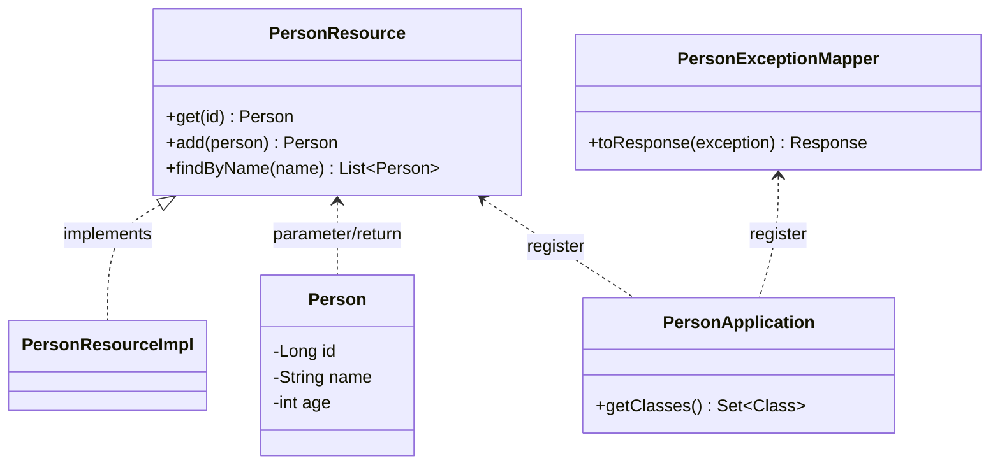

MicroProfileの厳選仕様を紹介していくシリーズの最後は[前回](/msa/mp/cntrn04-spec-ranking/)紹介した『これは抑えておくベキ、もしくは使っておくベキ』仕様第1位の筆者一押しのMicroProfile RestClient(MP RestClient)です。JAX-RSのAPIはREST向けに設計されているAPIとは言え、そのベースはHTTPプロトコルのためパラメータ送信1つをとっても、それがQueryStringかパスパラメータか、それともbodyのJSON連携かにより呼び出し手順やAPIが異なり、その実装は単調な割には骨の折れる面倒くさいものでした。MP RestClientはそんな面倒くさいREST API呼び出しをローカルAPI呼び出しのように正に「らくらく」に呼び出せる機能となります。

今回はそんな素敵なMP RestClientについてJAX-RSとの比較をとおしてMP RestClientの利用法やそのメリットを説明します。

なお、記事はコードの抜粋を記載してます。全体を見たい場合や動作を確認したい場合は以下のGitHubリポジトリを参照ください。
- <https://github.com/extact-io/contrarian-microprofile-sample/tree/main/01-restclient>

:::column:連載の紹介
豆蔵デベロッパーサイトではMicroProfileをテーマに「[逆張りのMicroProfile ～ Helidonで始めるマイクロサービスへの一歩 ～](/msa/#逆張りのmicroprofile-～-helidonで始めるマイクロサービスへの一歩-～)」を連載しています。他の記事も是非どうぞ!
:::

:::info
この記事はJava11+Helidon 2.4.2 + MicroProfile RestClient 1.4をもとに作成しています。MicroProfile RestClient 1.4の仕様は[こちら](https://download.eclipse.org/microprofile/microprofile-rest-client-1.4.0/microprofile-rest-client-1.4.0.html)を参照ください。また、MicroProfile RestClient 3.0や今回紹介できなかった機能は [MicroProfile RestClient 3.0の確認と小技機能の紹介](/msa/mp/cntrn11-mp-restclient3/) で紹介しています。
:::

## 比較に利用するREST API
まず最初にJAX-RSとMP RestClientの実装比較に利用REST APIを説明します。

実装比較に利用するREST APIはJAX-RSのRESTアプリケーションとして実装された以下のものとなります。参考までにどこかで見たことがあるなぁと思った方はそのとおりで、「[コードが仕様の源泉MicroProfile OpenAPI](/msa/mp/cntrn05-mp-openapi/#サンプルアプリと動作方法)」の説明に利用したPersonアプリと同じです。

- RESTアプリケーションの構造



- PersonResourceインタフェース
```java
public interface PersonResource {
    @GET
    @Path("/{id}")
    @Produces(MediaType.APPLICATION_JSON)
    Person get(@PathParam("id")long id);

    @POST
    @Consumes(MediaType.APPLICATION_JSON)
    @Produces(MediaType.APPLICATION_JSON)
    Person add(Person person);

    @GET
    @Produces(MediaType.APPLICATION_JSON)
    List<Person> findByName(@QueryParam("name") String name);
}
```

- PersonResourceImplクラス
```java
@ApplicationScoped
@Path("persons")
public class PersonResourceImpl implements PersonResource  {

    private Map<Long, Person> personMap = new ConcurrentHashMap<>();

    @PostConstruct
    public void init() {
        personMap.put(1L, new Person(1L, "taro", 12));
        personMap.put(2L, new Person(2L, "hanko", 9));
        personMap.put(3L, new Person(3L, "bob", 15));
    }

    @Override
    public Person get(long id) {
        if (!personMap.containsKey(id)) {
            throw new PersonException(CauseError.NOT_FOUND);
        }
        return personMap.get(id);
    }

    @Override
    public Person add(Person person) {
        // name の重複は許可しない
        personMap.values().stream()
                .filter(p -> p.getName().equals(person.getName()))
                .findAny()
                .ifPresent(p -> {
                    throw new PersonException(CauseError.CONFLICT);
                });
        // Personの登録
        var nextId = personMap.keySet().stream().max(Long::compareTo).get() + 1;
        var newPerson = person.withId(nextId);
        personMap.put(nextId, newPerson);
        return newPerson;
    }

    @Override
    public List<Person> findByName(String name) {
        return personMap.values().stream()
                .filter(p -> p.getName().startsWith(name))
                .collect(Collectors.toList());
    }
}
```

- PersonExceptionMapperクラス
```java
public class PersonExceptionMapper implements ExceptionMapper<PersonException> {
    @Override
    public Response toResponse(PersonException exception) {
        Status status = null;
        switch (exception.getCauseError()) {
            case NOT_FOUND:
                status = Status.NOT_FOUND; // 404
                break;
            case DUPLICATE:
                status = Status.CONFLICT; // 409
                break;
        }
        return Response
                .status(status)
                .entity(status.getReasonPhrase())
                .build();
    }
}
```

このRESTアプリのポイントは以下となります。以降で説明するクライアントアプリの実装を理解する上でもポイントとなりますので、軽く頭に入れておいてください。

- idに対する該当するPersonインスタンスが存在しない場合、nullではなくを例外(PersonException)を返す。(`PersonResource#get`の実装) 
- Personインスタンスの登録時に名前の重複チェックを行い、既に登録されている場合はエラーとして例外(PersonException)を返す。(`PersonResource#add`の実装)
- PersonResourceで送出されたPersonExceptionはPersonExceptionMapperで捕捉され、発生例外に応じたStatusCodeに変換される。よって、REST API側でエラーが発生した場合、クライアントアプリはエラーの情報をStatusCodeで受け取る。


今回はこのREST APIを呼び出すクライアントアプリをJAX-RSとMP RestClientの双方で実装し、その比較を行っていきます。

## JAX-RSによる実装
それではJAX-RSのClient APIを使って上で説明したREST APIを呼び出す実装を見てみましょう。クラス構造と実装コードは次のとおりになります。

- JAX-RSのClient APIによるクライアントアプリケーションの構造
（薄青色のクラスが本題のクラス）


- JaxrsPersonServiceクラス
```java
@ApplicationScoped
public class JaxrsPersonService implements PersonService {

    private Client client;
    private static final String BASE_URL = "http://localhost:7001/api/persons";

    @PostConstruct
    public void init() {
        client = ClientBuilder.newClient();
    }
    @Override
    public Person getPerson(long id) {
        // リクエスト送信
        var response = client
                .target(BASE_URL)
                .path("{id}")
                .resolveTemplate("id", id)
                .request()
                .get();
        // 結果該当なし
        if (response.getStatus() == Status.NOT_FOUND.getStatusCode()) {
            throw new PersonClientException(ClientError.NOT_FOUND);
        }
        // 結果取得
        return response.readEntity(Person.class);
    }
    @Override
    public Person addPerson(Person person) {
        // リクエスト送信
        var response = client
                .target(BASE_URL)
                .request()
                .post(Entity.json(person));
        // nameの値重複
        if (response.getStatus() == Status.CONFLICT.getStatusCode()) {
            throw new PersonClientException(ClientError.NAME_DEPULICATE);
        }
        // 結果取得
        return response.readEntity(Person.class);
    }
    @Override
    public List<Person> findPerson(String name) {
        // リクエスト送信
        var response = client
                .target(BASE_URL)
                .queryParam("name", name)
                .request()
                .get();
        // 結果取得
        return response.readEntity(new GenericType<List<Person>>() {});
    }
}
```

JAX-RSを使った基本的な流れは、
- REST APIの呼び出し窓口となるjavax.ws.rs.client.Clientを生成[^1]
- 宛先URLやパラメータ、bodyデータなどをClientに設定し呼び出しを実行
- 返却されたResponseから結果を取得

となります。

サンプルコードから分かるとおり、GETのREST API呼び出しには`get`メソッド、POSTなら`post`メソッドといったようにHTTPメソッドによって実行するメソッドを使い分ける必要があります。加えてパラメータの送信方法によっても設定メソッドは`path`メソッドや`queryParam`メソッドなどと異なり、呼び出したいREST APIは至って単純ですが、実装は煩雑なものとなります。（端的に言うとタルい実装です・・）

[^1]: javax.ws.rs.client.Clientはスレッドセーフでかつ生成にコストが掛かるため、`@PostConstruct`でCDI Beanの初期化処理で生成したものを使いまわしています。

:::info
REST APIの呼び出しにはクライアントアプリとサーバアプリ（RESTアプリケーション）をそれぞれ別のJavaプロセスで動作させる必要があります。動作方法についてはサンプルコードを格納したGitHubの[こちら](https://github.com/extact-io/contrarian-microprofile-sample/tree/main/01-restclient)を参照ください。
:::
:::stop
Helidonの機能がすべて含まれる`io.helidon.microprofile.bundles:helidon-microprofile`をMavenのdependencyに使っている場合、クライアントアプリでもサーバ機能が起動します。このため、今回のようにサーバアプリも一緒に動作させる場合、サーバアプリがデフォルトの7001ポートを既に掴んでいるため、クライアントアプリの起動が失敗します。このような場合は、エフェメラルポートを使用しサーバアプリとポートが被らないようにするのが一番手っ取り早い回避方法となります[^2]。エフェメラルポートは以下のように設定ファイルに使用ポート0を指定します。
```properties
# any available ephemeral port will be used.
server.port = 0
```
:::

[^2]: アプリの依存からサーバ機能を排除するのが本来的な対応ですが、Helidonはサーバアプリでの利用を前提としているためか、サーバ機能の依存を排除するのは一筋縄ではいきません。このため、ここでの説明は割愛していますが、出来ない訳ではありません。リファレンスアプリではクライアント側も最小限の依存にしていますので、実際どのようにやっているかを知りたい方は[こちら](https://github.com/extact-io/rms/blob/main/rms-client-api-remote/pom.xml)を参照ください。

## MicroProfile RestClientのコンセプト
このようにJAX-RSを使った実装では、REST API仕様に定義されているHTTPメソッドやパラメータ送信方法などに応じて実装を変える必要があります。ただし、これをよく見ていくと、例えばHTTPメソッドがGETなら実行するメソッドは`get`メソッド、パスパラメータの場合は`path`メソッドといったように、その実装はREST APIの仕様から機械的に決定できるものとなっています。これは言い換えるとREST APIの定義情報さえあれば自動的に処理することが可能なことを意味します。

では、このREST APIの定義情報はどこかになかったでしょうか？そうです、RESTリソースの実装がREST APIの定義そのものになります！もう一度お題としているPersonResourceインタフェースを見てみましょう。

- PersonResourceインタフェース(再掲)
```java
public interface PersonResource {
    @GET
    @Path("/{id}")
    @Produces(MediaType.APPLICATION_JSON)
    Person get(@PathParam("id")long id);

    @POST
    @Consumes(MediaType.APPLICATION_JSON)
    @Produces(MediaType.APPLICATION_JSON)
    Person add(Person person);

    @GET
    @Produces(MediaType.APPLICATION_JSON)
    List<Person> findByName(@QueryParam("name") String name);
}
```

REST APIのHTTPメソッドは`@GET`や`@POST`のアノテーションから、パラメータ送信方法は`@PathParam`や`@QeuryParam`から、そしてbodyで受け渡すJSONのデータ構造はメソッドの引数や戻り値の型からといったように、REST API仕様は呼び出す先のRESTリソースクラスの実装から解釈することが可能です。（REST API仕様に沿って実装されたものがRESTリソースとなるため当たり前の話ではありますが）

このJAX-RSのRESTリソース定義からREST API仕様を解釈可能ということをクライアント側で応用したのがMP RestClientとなります。

## MicroProfile RestClientによる実装
MP RestClientは上述のとおりJAX-RSのRESTリソースアノテーションを使ってクライアント側でREST API仕様に相当するインタフェースを定義し、MicroProfileランタイムはそのインタフェースをもとにREST APIを実際に呼び出すProxyを動的に生成します。これによりインタフェースのメソッド呼び出しによるREST API呼び出しが可能となります。

先ほどはJAX-RSを使いPersonServiceインタフェースを実装しましたが、今度は同じインタフェースをMP RestClientを使って実装してみます。このMP RestClientを使ったクライアントアプリのクラス構造と実装コードは次のとおりになります。

- MP RestClientによるクライアントアプリケーションの構造


- PersonClientインタフェース
```java
@RegisterRestClient(baseUri = "http://localhost:7001/api")
@Path("persons")
public interface PersonClient {
    @GET
    @Path("/{id}")
    @Produces(MediaType.APPLICATION_JSON)
    Person get(@PathParam("id")long id);

    @POST
    @Consumes(MediaType.APPLICATION_JSON)
    @Produces(MediaType.APPLICATION_JSON)
    Person add(Person person);

    @GET
    @Produces(MediaType.APPLICATION_JSON)
    List<Person> findByName(@QueryParam("name") String name);
}
```

- RestClientPersonServiceクラス
```java
@ApplicationScoped
public class RestClientPersonService implements PersonService {
    private PersonClient personClient;
    @Inject
    public RestClientPersonService(@RestClient PersonClient personClient) {
        this.personClient = personClient;
    }
    @Override
    public Person getPerson(long id) {
        return personClient.get(id);
    }
    @Override
    public Person addPerson(Person person) {
        return personClient.add(person);
    }
    @Override
    public List<Person> findPerson(String name) {
        return personClient.findByName(name);
    }
}
```

REST APIを呼び出すのに必要なコードは、REST API仕様を定義したインタフェース(PersonClient)とそのインタフェースを呼び出すコード(RestClientPersonService)のたった2つだけです。同じREST APIを呼び出すJAX-RSの実装と比較してもらえば、そのコード量の少なさは一目瞭然です！！

と、まずはコード量の少なさに注目してもらいましたが、MP RestClientを使ったコードの説明を少しだけします。ポイントはPersonClient インタフェースに付けられている`@RegisterRestClient` とRestClientPersonServiceのコンストラクインジェクションに付けられている`@RestClient`の2つになります。

### `@RegisterRestClient`の解説
`@RegisterRestClient`が付けられたインタフェースは、MicroProfileランタイムによりインタフェースに応じたMP RestClientのProxyインスタンスが動的に生成され、CDI Beanとして登録されます。

このProxyインスタンスのもとになるインタフェースをMP RestClientでは「RestClientインタフェース」と言い、ProxyインスタンスはRestClientインタフェースに定義されている`@Path`や`@PathParam`などのアノテーションやメソッドの引数や戻り値の解析結果をもとにREST APIの呼び出しを行います。

ここまでの説明で気づかれた方もいるかも知れませんが、RestClientインタフェースは呼び出す先のJAX-RSのResourceインタフェースをクライアントから見ているだけで、結局のところ双方は同じものとなります。事実、RESTアプリケーション側のResourceインタフェースをクライアント側にコピーして`@RegisterRestClient`を付けるだけで動作させることができます[^3]。

[^3]: Proxyの動作に関係するものはREST API仕様として現れるものだけです。RestClientインタフェースのメソッド名や引数名などはREST API仕様には関係ないため、Resourceインタフェースと同じにする必要はありません（が、敢えて別にする理由もないので同じにしています）。

:::check
サンプルコードはREST APIの宛先URLを`@RegisterRestClient`の`baseUrl`属性で指定していますが、これは次のように設定ファイルに定義することもできます。
```java
@RegisterRestClient(configKey = "personClient") // configKey属性を使う
@Path("persons")
public interface PersonClient {
    ...
}
```
```properties
personClient/mp-rest/url = http://localhost:7001/api
```

宛先URLを設定ファイルに定義する場合は`@RegisterRestClient`の`configKey`属性に宛先URLを設定するキーのprefixを指定します。MicroProfileランタイムは`configKey`属性で指定されたprefixに`/mp-rest/url`を付加した文字列を宛先URLの設定キー名[^4]とし、MicroProfile Config配下の設定情報からその値を取得します。

宛先URLは環境ごとに変わるため、実際の開発では`baseUrl`属性ではく`configKey`属性で宛先URLを指定し、必要に応じて環境変数でURLを変更する[^5]といった使い方が定石となります。
:::

[^4]: `/mp-rest/url`はMP RestClientの仕様で定義されていますが、`/`は区切り文字としてではなく単なる文字として扱われるため、YAMLファイルに設定する場合でも区切らず`<prefix>/mp-rest/url`と一続きでキーを設定する必要があります。（なので、ハッキリ言ってセンスのないネーミングですね・・）

[^5]: MicroProfile Confiによる設定の上書きを前提としています。MicroProfile Configがどのような機能か興味があるある方は[こちら](/msa/mp/cntrn06-mp-config/)の記事をどうぞ。

### `@RestClient`の解説
ポイントのもう一つの`@RestClient`は取得するProxyインスタンスに対する限定子(`Qualifier`)として指定します。上述したとおりProxyインスタンスはCDI Beanとして登録されているため、他のCDI Beanと同様に`@Inject`によりインスタンスを取得できますが、CDIの登録時に`@RestClient`の限定子付きで登録されているため、インジェクションでインスタンスを取得する際には`@RestClient`を付けるのが作法[^6]となります。

[^6]: `@RestClient`は単なる`Qualifier`の1つです。よって、RestClientインタフェースに対するインスタンスがProxy以外に存在しない場合、インジェクション対象は一意に決まるため、`@RestClient`はなくても動作します。また、RestClientインタフェースに対するインスタンスは通常Proxy以外に存在することはないため、実は`@RestClient`は付けなくても動作するケースが大多数のため、説明では「作法」としています。

::: column:REST APIを用いた実装の効率化ソリューション
MP RestClientはRestClientインタフェースをREST API仕様として実装を効率化したものですが、実装の効率化でよく利用される他のREST API仕様の成果物として[OpenAPI Specification](https://spec.openapis.org/oas/v3.1.0)(OAS)があります。
MP RestClientはREST API仕様に相当するRestClientインタフェースを入力として動的にProxyを生成するソリューションなのに対し、OASを使ったソリューションはOAS成果物を入力としツールでソースコードを自動生成する手法が用いられます。この代表的なツールとしては[OpenAPI Generator](https://github.com/openapitools/openapi-generator)があります。

MP RestClientで必要となるものはRestClientインタフェースのみで後はRestClientインタフェースをもとにすべて動的に解決されるため、強力なソリューションであることに間違いありませんが、クライアントの実装言語がJavaに限定されます。
一方のOAS成果物は言語に依らない中立的な成果物であるため、ツールがサポートする言語であれば任意の言語でコードを生成することができます。これに加えてクライアント側だけでなくサーバー側のコードも生成可能です。OAS成果物によるソリューションはMP RestClientと比べ生成の手間や生成した成果物を維持管理していく手間が掛かりますが、その代わりにMP RestClientよりも高い柔軟性があります。
:::

## MicroProfile RestClientにおけるエラーハンドリング
同じインタフェースに対するJAX-RSとMP RestClientの実装を見てきましたが、RestClientPersonServiceでは未だできていないことが実はあります。それはエラーハンドリングです。JaxrsPersonServiceではStatusCodeをもとにPersonClientExceptionの送出を行っていますが、RestClientPersonServiceはその点がなにも考慮されていません。このためサーバー側でエラーが発生した場合、クライアント側では意図しないエラーが発生します。

では、どのようにエラーハンドリングを行えばよいでしょうか？

JaxrsPersonServiceのようにそれぞれのメソッドでステータスコードをもとに頑張って判別することもできますが、MP RestClientにはエラーハンドリング専用の仕組みとしてResponseExceptionMapperインタフェースが用意されています。ですので、MP RestClientにおけるエラーハンドリングはResponseExceptionMapperインタフェースを実装して行うのがスマートな方法となります。

### ResponseExceptionMapperインタフェースの実装
では早速ResponseExceptionMapperインタフェースを使ったエラーハンドルの実装を見ていきましょう。

- ResponseExceptionMapperインタフェースの実装例
```java
public class PersonClientExceptionMapper 
        implements ResponseExceptionMapper<PersonClientException> {
    // このクラスでハンドルするステータスコード
    private static final List<Integer> SHOULD_HANDLLE_ERROR =
            List.of(
                Status.NOT_FOUND.getStatusCode(),
                Status.CONFLICT.getStatusCode()
            );
    @Override
    public boolean handles(int status, MultivaluedMap<String, Object> headers) {
        // ハンドル対象のステータスコードか確認
        return SHOULD_HANDLLE_ERROR.contains(status);
    }
    @Override
    public PersonClientException toThrowable(Response response) {
        // ステータスコードに応じた例外を返す（例外変換）
        var status = Status.fromStatusCode(response.getStatus());
        switch (status) {
            case NOT_FOUND:
                return new PersonClientException(ClientError.NOT_FOUND);
            case CONFLICT:
                return new PersonClientException(ClientError.NAME_DEPULICATE);
            default:
                throw new IllegalArgumentException("unknown status:" + status);

        }
    }
}
```

サンプルはResponseExceptionMapperインタフェースに定義されている`handles`メソッドと`toThrowable`メソッドの2つを実装しています。

`handles`メソッドは引数で渡されたStatusCodeとレスポンスヘッダをもとに自分がハンドルしたいレスポンスかを判断し、ハンドルしたいレスポンスの場合は`true`を返します。`handles`メソッドで`true`を返した場合、続けて`toThrowable`メソッドがコールバックされるため、`toThrowable`メソッドでレスポンスに応じた例外を返却します。

サンプルはJaxrsPersonServiceのエラーハンドルと同じになるようにこの2つのメソッドを実装しています。

### RestClientインタフェースへの登録
ResponseExceptionMapperの実装ができたら`@RegisterProvider`を使いRestClientインタフェースにResponseExceptionMapperを登録します。

```java
@RegisterRestClient(baseUri = "http://localhost:7001/api")
@RegisterProvider(PersonClientExceptionMapper.class) // ExceptionMapperの登録
@Path("persons")
public interface PersonClient {
    ...
}
```

登録したResponseExceptionMapperはMicroProfileランタイムによりレスポンス受信時の処理に織り込まれるため、`toThrowable`メソッドで返却した例外はRestClientインタフェースのメソッド呼び出し結果として送出されるようになります。

:::info
ResponseExceptionMapperを登録するアノテーションとして`@RegisterProvider`を説明しましたが、`@RegisterProvider`はResponseExceptionMapperだけのものではありません。`@RegisterProvider`にはパラメータの型変換を行うParamConverterProviderやレスポンスに対するフィルター処理を行うClientResponseFilterなどJAX-RSのClient APIでサポートされているProviderも指定することができます。
:::


### ResponseExceptionMapperの複数登録
StatusCodeやレスポンスヘッダの内容によって型階層の異なる例外を返却したい場合もあるため、ResponseExceptionMapperは1つのRestClientインタフェースに複数登録することもできます。

ResponseExceptionMapperが複数登録されている場合、その呼び出し順序は`ResponseExceptionMapper#getPriority`メソッドの返却値により決まり、返却された数値が小さい順にtrueを返すインスタンスが現れるまで登録されたResponseExceptionMapperの`handles`メソッドが呼び出されます[^7]（数値が低い方が優先されるという意味になります）。

`getPriority`メソッドはResponseExceptionMapperインターフェースにdefault実装されているため、順序性の考慮が不要な場合は実装する必要はありませんが、順序性の制御が必要な場合は期待する順序になるようにそれぞれの`getPriority`メソッドを実装する必要があります。

説明した内容を元に優先度が2番目のResponseExceptionMapperがエラーハンドルする場合の流れをシーケンス図で示すと以下にようになります。

```mermaid
sequenceDiagram
    RestClient#058;Proxy->>MicroProfileランタイム: REST API呼出の実行
    MicroProfileランタイム->>MicroProfileランタイム: REST API呼出
    MicroProfileランタイム->>REM#058;優先度1: handles(status, headers)
    Note right of REM#058;優先度1: REMはResponseExceptionMapperの略
    REM#058;優先度1-->>MicroProfileランタイム: false
    MicroProfileランタイム->>REM#058;優先度2: handles(status, headers)
    REM#058;優先度2-->>MicroProfileランタイム: true
    MicroProfileランタイム->>REM#058;優先度2: toThrowable(response)
    REM#058;優先度2-->>MicroProfileランタイム: 例外
    MicroProfileランタイム-->>RestClient#058;Proxy: throw 例外
````
[^7]: これは依頼に対して処理可能なオブジェクトが現れるまで、依頼を聞き回るGoFの”Chain of Responsibility”パターンを使った典型的な実装と言えます。

## リファレンスアプリでの利用例
「[使った、作った、Helidonで！](/msa/mp/cntrn03-sampleapp-helidon/)」で紹介したMicroProfileを使ったリファレンスアプリ(RMS)ではこの記事では説明しなかった複数Providerの登録やリクエストヘッダの操作を行うためにMP RestClientに用意されているClientHeadersFactoryインタフェースの利用など広範に渡りMP RestClientの機能を利用しています。

リファレンスアプリにおけるMP RestClientの利用は以下にまとめていますので興味がある方は見ていただければと思います。

・<https://github.com/extact-io/rms/wiki/MicroProfile-RestClient%E3%81%AE%E5%88%A9%E7%94%A8%E3%81%A8%E4%BE%8B%E5%A4%96%E3%83%8F%E3%83%B3%E3%83%89%E3%83%AA%E3%83%B3%E3%82%B0>

## まとめ
今回は便利さを理解してもらうことに力点を置きMP RestClientの機能を説明しました。このような便利な機能にはそのデメリットして「○○はできない、使えない」などといったなんらかの制約が存在するのがよくあるパターンですが、筆者の経験上、JAX-RSのClient APIを使った素の実装ではできるが、MP RestClientを使った場合、それができないといったことはありません。また、JAX-RSのClient APIの煩雑な部分がProxyに隠蔽されるため、学習コストも僅かなものとなります。

また、REST API呼び出しに直接関係するアプリのコードはRestClientインタフェースしかないため、メソッド横断的な処理はその仕組み上、おのずと役割ごとにProviderに委譲した実装となり、結果としてRestClientインタフェースに必要なProvider実装を組み合わせたComposableな構造になりやすいといった利点もあります。

これらのことからMP RestClientを利用可能な状況において、敢えてJAX-RSのClient APIを選択する理由はありません。本記事を読んでMP RestClientを使ってみたいなと思われた方は是非、積極的に活用していただければと思います。

今回は紹介できなかったRESTリソースのテストを効率的に行うMP RestClientの便利な利用法を「[Helidon Tips - MicroProfile RestClientを使ったRESTリソースのJUnitテスト](/msa/mp/ext03-helidon-rest-testing)」として別の記事で紹介していますので、ご興味がある方はそちらも続けてどうぞ！

