MicroProfileの機能を紹介していくシリーズの今回はMicroProfile Health(MP Health)です。MP Healthはアプリケーションの「生きてますか？」を確認するヘルスチェックに関する仕様をまとめたものです。ヘルスチェックは機能としては小さく地味ですが、マイクロサービスのような分散システムでアプリケーションを正常に運用にするためには欠かせない要素です。今回はそんなヘルスチェックに対しMP Healthが規定、提供する仕様や機能を紹介していきます。

記事はコードの抜粋を記載します。全体を見たい場合や動作を確認したい場合は以下のGitHubリポジトリを参照ください。
- <https://github.com/extact-io/contrarian-microprofile-sample/tree/main/04-health>

MicroProfileをテーマにブログを連載しています。他の記事もよければ以下のリンクからどうぞ！
- [逆張りのMicroProfile ～ Helidonで始めるマイクロサービスへの一歩 ～](/msa/#逆張りのmicroprofile-～-helidonで始めるマイクロサービスへの一歩-～)

[[TOC]]

:::info
この記事はJava17+Helidon 3.0.1 + MicroProfile Health 4.0をもとに作成しています。
MicroProfile Healthの詳細は[公式マニュアル](https://download.eclipse.org/microprofile/microprofile-health-4.0/microprofile-health-spec-4.0.html)を参照くだい。
:::

## MP Healthとは
MP Healthは機能やAPIの提供よりも、ヘルスチェックに関する共通的な仕様を規定している面が強いため、実装の説明に入る前にMP Heathが規定するものと提供するものについて説明します。

MP Healthは大きく次の２つから構成されています。
- ヘルスチェック手順を実装するための Java API
- ヘルスチェックプロトコルとワイヤフォーマット

前者のJava APIはサンプルをもとにヘルスチェックを組み込みながら説明した方が分かりやすいため後回しにし、後者のプロトコルとワイヤフォーマットから説明していきます。

## ヘルスチェックプロトコルとワイヤフォーマット
難しいように聞こえるタイトルですが、ここで定められているものをザックリというとMP Healthに準拠するランタイム、もしくはアプリが従う／満たすべき、「ヘルスチェックの種類」と「ヘルスチェックを行うREST API」、「ヘルスチェックの応答メッセージフォーマット」となります。（前者2つがプロトコル、最後のワイヤフォーマットがメッセージフォーマットに相当するイメージです）

## ヘルスチェックの種類
MP Healthでは次の3つのヘルスチェックとそれぞれのセマンティック（意味）が規定されています。

- Readiness check
  - アプリケーションがリクエストを処理する準備ができているかどうか。
- Liveness check
  - アプリケーションが実行されているかどうか。このチェックが失敗した場合、アプリケーションを破棄 (終了、シャットダウン) できることを意味します。
- Startup check
  - アプリケーションが起動したかどうか。これは起動時間を必要とするアプリケーションの確認に役立ち、Liveness checkはStartup check 検証後に行うようにします。

:::info
気づいた方もいるかと思いますが、この規定はMP Health独自というよりも Kubernetes で用いられるヘルスチェック([Kubernetes Liveness, Readiness and Startup Probes]( https://kubernetes.io/docs/tasks/configure-pod-container/configure-liveness-readiness-startup-probes/))を強く意識したものとなります。
:::

## ヘルスチェックを行うREST API
MP Healthでは3つのヘルスチェックに対するREST API を次のように規定しています。

|path|method|ステータスコード|ヘルスチェックの種類|ボティ|
|----|------|---------------|-----------------|------|
|/health/live|GET|200, 500, 503|Liveness| [次項](#応答メッセージフォーマット)のとおり|
|/health/ready|GET|200, 500, 503|Readiness| [次項](#応答メッセージフォーマット)のとおり|
|/health/started|GET|200, 500, 503|Startup| [次項](#応答メッセージフォーマット)のとおり|
|/health|GET|200, 500, 503|Liveness + Readiness + Startup| [次項](#応答メッセージフォーマット)のとおり|

- ステータスコードの意味
  - 200:ヘルスチェックが正常のUP状態
  - 503:ヘルスチェックが異常のDOWN状態
  - 500:ヘルスチェックを処理できなかった状態

MicroProfileではパス`/openapi`がMicroProfile OpenAPIで予約されているように、`/health`はMP Healthで予約されています。

## 応答メッセージフォーマット
ヘルスチェックの結果としてレスポンスボディに設定するJSONデータもMP Healthで規定されています。このJSONデータの構造とプロパティ、つまりレスポンスに設定されるメッセージフォーマットは次のようになっています。



後述の[複数のヘルスチェック実装](#複数のヘルスチェック実装)で詳しく説明していますが、MP Healthではヘルスチェックを複数定義することができます。あるアプリケーションのReadiness状態はAチェックとBチェックの2つの結果によって決まるといった場合、AとBの2つのチェックを別々に実装することができます。

MP Healthの応答メッセージのトップレベルには全体の結果を表すstatusがあり、その下に実行したチェックの詳細を表すCheckが複数あり、それぞれごとにチェック名とその結果の情報を持ちます。また、チェックの詳細情報としてCheck情報にはkey-value形式の複数の情報を持つこともできます。

|JSON項目|設定内容|必須|
|-------|--------|---|
|status|全体のチェック結果。`UP`または`DOWN`が設定される|必須|
|checks[]|ヘルスチェックごとの詳細|1つ以上|
|checks[].name|ヘルスチェック名|必須|
|checks[].status|該当チェックのチェック結果。`UP`または`DOWN`が設定される|必須|
|checks[].data|任意の情報を設定するMap|任意|

全体の結果を表すstatusは実行したチェック、つまりCheck情報に示されている複数のチェック結果からMPランタイムにより導出され結果が設定されます。それ以外はヘルスチェックを実装するアプリケーションがMP HealthのAPIを使ってメッセージ内容を設定します。

このメッセージフォーマットは3つのヘルスチェックとも同様で、許可応答(200)または否定応答(503)を返す際に設定されます。UP/DOWNが判定できなかった否定応答(500)の場合、レスポンスボディはなしで規定されています。

MP Healthが規定するヘルスチェックプロトコルとワイヤフォーマットを見てきました。MP Healthではこのようにヘルスチェックの意味とその呼び出し方法、応答内容が細かく規定されているため、MP Healthに準拠したアプリであれば、どんなアプリに対しても目的に応じたヘルスチェックの実行とその結果の検証を共通的に行うことができます。

次からはこのMP Healthにもとづいた実際のヘルスチェックの実装を見ていきます。

## サンプルアプリのお題
今回は外部からのリクエストによりアプリの状態を開局（OPEN）や閉局（CLOSE）に変えるRESTアプリにヘルスチェックを組み込む例を題材にMP Healthの実装を説明していきます。

このサンプルアプリに組み込むヘルスチェックの仕様は以下のとおりとします。
- アプリが起動を完了したかのヘルスチェックを行えるようにする
  - サンプルアプリは起動後、開局通知（/status/open）を受け取って初めて起動完了とする。開局通知を受け取るまでは起動完了のヘルスチェックに対しては否定応答を返す[^1]
- アプリケーションレベルでリクエスト処理が可能な状態かのヘルスチェックを行えるようにする
  - アプリの状態が開局（OPEN）でかつDBへの疎通が行える状態をアプリケーションレベルで処理が可能な状態とする

[^1]: 起動完了していないの、どうやって開局通知を受け取るんだ？と仕様の矛盾に気がつく方もいるかも知れませんが、そこは例を分かりやすくしているということで気にしないでください。

## ヘルスチェックの実装
上述のヘルスチェックをMP Healthをもとに実装する場合、作成するチェックは次のようになります。

- Startup check
  - アプリの開閉局状態を確認しOPENの場合に肯定応答(UP)を返し、CLOSEの場合は否定応答(DOWN)を返す
- Readiness check
  1. Startup checkと同様にアプリの状態を確認する
  2. DBの疎通確認を行う
  3. 1.と2. の双方がOKの場合にReadiness checkに対する結果として肯定応答(UP)を返し、それ以外は否定応答(DOWN)を返す

（Liveness checkとして実装するものはなし）

これだけでは全体のイメージが沸きづらいと思うので最終的なサンプルアプリのイメージを示すと次のようになります。


### HealthCheckインタフェースの実装
それでは一つ目のStartup checkの実装を説明していきます。コードを見ながらの方が理解しやすいため、先にコードを示すとお題となっているヘルスチェックの実装は次のようになります。

```java
@ApplicationScoped  // 1.
@Startup            // 2.
public class OpenCloseStatusHealthCheck implements HealthCheck {  // 1.
    private OpenCloseStatus openClosestatus;
    @Inject
    public OpenCloseStatusHealthCheck(OpenCloseStatus status) {
        this.openClosestatus = status;
    }
    @Override
    public HealthCheckResponse call() { // 3.
        return HealthCheckResponse      // 4.
                .named(this.getClass().getSimpleName())
                .status(openClosestatus.isOpen())
                .withData("open/close", openClosestatus.isOpen() ? "OPEN" : "CLOSE")
                .withData("checkTime", LocalDateTime.now().toString())
                .build();
    }
}
```

コードにある各要素の説明は次のとおりです。

1. MP HealthのヘルスチェックはHealthCheckインタフェースを実装したCDI Beanとする必要があるため、HealthCheckインタフェース実装したクラスを定義し、`@ApplicationScoped`を付けます[^2]
2. 実装するインタフェースはStartupやReadinessなど種類を問わず同じ`HealthCheck`となるため、ヘルスチェックの種類を表すMP Healthのアノテーションを付けます。今実装しているヘルスチェックはStartup checkなので`@Startup`を付けています。なお、他のアノテーションは`@Readiness`, `@Liveness`となります
3. HealthCheckインタフェースには`call`メソッドが定義されているので、`call`メソッドに行いたいヘルスチェックを実装します
4. ヘルスチェックの結果は`HealthCheckResponse`で返します。`HealthCheckResponse`は[応答メッセージフォーマット](#応答メッセージフォーマット)で説明したJSONメッセージを作成する各種builderメソッドが付いているので、そのbuilderメソッドを使って結果を設定していきます

[^2]: CDI Beanであればよいので`@ApplicationScoped`以外も利用できます。利用ケースは浮かびませんが、リクエストごとにインスタンス生成が必要なチェックであれば`@RequestScoped`でも構いませんし、セッションごとの状態管理が必要なチェックであれば`@SessionScoped`でも構いません。

:::info:ラムダ式を使ったHealthCheckインタフェースの実装
ヘルスチェックを実装したHealthCheckインタフェースは次のようになっています。
```java
@FunctionalInterface
public interface HealthCheck {
    HealthCheckResponse call();
}
```

見て分かるとおりHealthCheckインタフェースには関数型インタフェースを表す`@FunctionalInterface`がつけられているため、ヘルスチェックはJakarta CDIのProducer機能とラムダ式を使って実装することもできます。OpenCloseStatusHealthCheckをProducerとラムダ式で実装すると次のようになります。

```java
@ApplicationScoped
public class OpenCloseStatusHealthCheck {
    private OpenCloseStatus openClosestatus;
    @Inject
    public OpenCloseStatusHealthCheck(OpenCloseStatus status) {
        this.openClosestatus = status;
    }
    @Produces
    @Startup
    public HealthCheck startupCheck() {
        return () -> HealthCheckResponse
                .named(this.getClass().getSimpleName())
                .status(openClosestatus.isOpen())
                .withData("open/close", openClosestatus.isOpen() ? "OPEN" : "CLOSE")
                .withData("checkTime", LocalDateTime.now().toString())
                .build();
    }
}
```

Healthインタフェースの直接実装とProducerとラムダ式の実装の2つの実装方式は機能的には全く同じになりますが、実装可能なヘルスメソッドの数に違いがあります。Healthインタフェースの直接実装方式で実装できるヘルスチェックは当たり前ですが言語仕様的に1クラスに1つとなりますが、Producerとラムダ式の実装方式は次のように複数のProducerメソッドを定義することで1クラスに複数のヘルスチェックを実装することができます。

```java
@ApplicationScoped
public class SomethingHealthCheck {
    ...
    @Produces
    @Startup
    public HealthCheck startupCheck() {
        return () -> ...
    }
    @Produces
    @Readiness
    public HealthCheck readinessCheck() {
        return () -> ...
    }
}
```
:::

### ヘルスチェックの動作
お題のStartup checkの実装ができたので、次は動作を確認してみましょう。

HelidonなどのMP Healthランタイムは起動時にHealthCheckインタフェースを実装したCDI Beanを自動検出し、付加されているアノテーションからヘルスチェックの種類を認識します。このヘルスチェック種類の認識により[ヘルスチェックを行うREST API](#ヘルスチェックを行うrest-api)で示したパスへのマッピングが行われます。

今回の例はStartup checkですので、`/health/started`へのリクエストで起動完了チェックが行えるようになります。

では、やってみましょう。起動後、開局通知を受け取るまでは起動完了とはならないため、否定応答が返ってきます。

```shell
curl -X GET http://localhost:7001/health/started -w ':%{http_code}\n'
{"status":"DOWN","checks":[{"name":"OpenCloseStatusHealthCheck","status":"DOWN","data":{"checkTime":"2022-09-10T15:47:06.970042100","open/close":"CLOSE"}}]}:503
```
MP Healthにもとづいたヘルスチェックに対応する応答は、[応答メッセージフォーマット](#応答メッセージフォーマット)で説明したMP Healthの仕様に従ったものが返されます。
今回は否定応答のため、ステータスコードは503で、チェック内容を表すボディには下記のとおりMP Healthの仕様に従ったJSONデータが返されているのが分かります。

```json
{
  "status": "DOWN",
  "checks": [
    {
      "name": "OpenCloseStatusHealthCheck",
      "status": "DOWN",
      "data": {
        "checkTime": "2022-09-10T15:47:06.970042100",
        "open/close": "CLOSE"
      }
    }
  ]
}
```
(レスポンスのボティ部分を見やすいように整形してます)

次に開局通知を投げた後の起動完了チェックを見てみます。
```shell
# 開局通知を投げる（アプリ機能）
curl -X GET http://localhost:7001/status/open
# Startup checkを行う
curl -X GET http://localhost:7001/health/started -w ':%{http_code}\n'
{"status":"UP","checks":[{"name":"OpenCloseStatusHealthCheck","status":"UP","data":{"checkTime":"2022-09-10T15:48:36.728909700","open/close":"OPEN"}}]}:200
```

今度はステータスコードが200で返ってきます。

このようにMP Healthではヘルスチェック部分だけを実装すればよく、あとはMP HealthランタイムがMP Healthの仕様に従って処理の受付や応答を行ってくれます。MP Health自体がやってくることは少ないですが、一貫性のあるREST APIを自分で考えるのはセンスも必要で地味に大変だったりします。その点MP Healthに準拠しておけば、その辺りは考えることなく一貫性のあるヘルスチェックが実現できるため、筆者はMicroProfileの中でも結構お気に入りの仕様だったりします。

## 複数のヘルスチェック実装
Startup checkができたので、次はReadiness checkを実装してみます。今回のReadiness checkのお題は次のとおりでした。

- Readiness check（再掲）
  1. Startup checkと同様にアプリの状態を確認する
  2. DBへ疎通確認を行う
  3. 1.と2. の双方がOKの場合にReadiness Checkに対する結果として肯定応答(UP)を返し、それ以外は否定応答(DOWN)を返す

### 複数用途で使うヘルスチェック実装
1.のStartup checkと同様にアプリの状態を確認する必要がありますが、これはStartup checkで実装したOpenCloseStatusHealthCheckに次のように`@Readiness`を追加するだけです。

```java
@ApplicationScoped
@Startup
@Readiness // ← アノテーションを追加
public class OpenCloseStatusHealthCheck implements HealthCheck {
    ...
}
```

ヘルスチェックアノテーションはヘルスチェックの用途を表すものなため、1つのヘルスチェック実装に複数付けることができます。OpenCloseStatusHealthCheckに`@Readiness`を追加することでOpenCloseStatusHealthCheck はStartup checkを行う`/health/started`に加え、Readiness checkを行う`/heath/ready`のリクエストでもチェックが行われるようになります。

### 複数ヘルスチェック実行の結果評価
Readiness checkで行うもう一つのヘルスチェックのDBの疎通確認の実装は次のようになります。
```java
@ApplicationScoped
@Readiness
public class DbHealthCheck implements HealthCheck {
    private static final String PING_SQL = "SELECT 1"; // for H2 database
    @PersistenceContext
    private EntityManager em;
    @Override
    public HealthCheckResponse call() {
        var responseBuilder = HealthCheckResponse.named(this.getClass().getSimpleName());
        try {
            em.createNativeQuery(PING_SQL).getSingleResult();
            return responseBuilder.up().build();
        } catch (Exception e) { // DBとの疎通エラー
            return responseBuilder.down().build();
        }
    }
}
```

MP Healthとして説明が必要な新たな要素はありません。やっていることは`@PersistencContext`でコンテナから取得した`EntityManager`を使ったDBとの疎通確認となります。また、疎通はDBにping sqlを投げ、その応答有無により確認しています。

:::info
@PersistencContextが定義されているJakarta Persistence(JPA)はMicroProfileには含まれない仕様ですが、Helidonはその拡張としてJPAを正式にサポートしています。HelidonのJPAインテグレーション機能については、以下の記事のコラム「DBアクセス周りで利用している機能と設定」で紹介しているので参考にしてください。
- [Helidon Tips - Helidon MP Testing with JUnit5を使ってみる](/msa/mp/ext02-helidon-testing/)
:::
:::column:ping sqlってなに？
ping sqlはDBMSとの疎通確認に用いられるSQLの俗称でDBMSにそのものズバリが用意されている訳ではありません。一般的にはDBMSが起動していればどんな状況、どんなスキーマ、どんなユーザでも実行できるSQLが用いられます。サンプルはH2を前提としたping sqlですが、Oracleの場合はDUAL表を用いた`SELECT 1 FROM DUAL`が良く用いられると思います。
:::

これでお題としていた2つのReadinessに対するチェックができました。`@Readiness`が付いているチェックは2つなので`/health/ready`のリクエストに対して2つのチェックが実行されます。この時、片方のチェックが失敗し、片方が成功した場合、全体としての結果は失敗となり、クライアントには否定応答が返されます。

では閉局通知を投げてOpenCloseStatusHealthCheckが失敗する状態におけるReadiness checkの応答を見てみましょう。

```shell
# 閉局通知を投げる（アプリ機能）
curl -X GET http://localhost:7001/status/close
# Readiness checkを行う
curl -X GET http://localhost:7001/health/ready -w ':%{http_code}\n'
{"status":"DOWN","checks":[{"name":"DbHealthCheck","status":"UP"},{"name":"OpenCloseStatusHealthCheck","status":"DOWN","data":{"checkTime":"2022-09-10T15:50:54.500723200","open/close":"CLOSE"}}]}:503
```

上述のとおり全体としては失敗のためステータスコードは503で返ってきます。ボディ内容は次のとおり全体は失敗のDOWNで、チェックの詳細を表すchecksからDbHealthCheckは成功(UP)でOpenCloseStatusHealthCheckは失敗(DOWN)したことが分かります。

```json
{
  "status": "DOWN",
  "checks": [
    {
      "name": "DbHealthCheck",
      "status": "UP"
    },
    {
      "name": "OpenCloseStatusHealthCheck",
      "status": "DOWN",
      "data": {
        "checkTime": "2022-09-10T15:50:54.500723200",
        "open/close": "CLOSE"
      }
    }
  ]
}
```
(レスポンスのボティ部分を見やすいように整形してます)


次に開局通知を投げてOpenCloseStatusHealthCheckが成功する状態に戻してReadiness checkを行うと次のとおり成功となります。
```shell
# 開局通知を投げる（アプリ機能）
curl -X GET http://localhost:7001/status/open
# Readiness checkを行う
curl -X GET http://localhost:7001/health/ready -w ':%{http_code}\n'
{"status":"UP","checks":[{"name":"DbHealthCheck","status":"UP"},{"name":"OpenCloseStatusHealthCheck","status":"UP","data":{"checkTime":"2022-09-10T15:52:12.756466200","open/close":"OPEN"}}]}:200
```

### リファレンスアプリでの利用例
MP Healthではヘルスチェックの応答が規定されているため、連携先のアプリの詳細を知ることなくヘルスチェックを行うことができます。リファレンスアプリではこの性質とMicroProfile RestClientの利点を活かして「連携先のアプリがすべてReadinessか？」を確認する汎用的な [ReadinessOfOutboundServersHealthCheck](https://github.com/extact-io/msa-rms-platform/blob/main/platform-core/src/main/java/io/extact/msa/rms/platform/core/health/ReadnessOfOutboundServersHealthCheck.java)を作成しています。興味がある方は参考にしてみてください。

### まとめ
MP Healthによりヘルスチェックに関するプロトコル（URLとメッセージフォーマット）が標準化されているため、MP Health準拠であれば相手がどんなチェックをしているかを知らなくても、決まったURLにリクエストを投げれば、決まった応答が返ってきます。これにより、相手先ごとに相手先ごとの都合によるチェック処理を作らなくてよくなりヘルスチェックAPIを共通化しやすくなります。MP Healthは機能も小さく地味な存在ですが、MP Healthの1番の利点はそんな共通化の促進にあると筆者は考えています。

