今回のテーマは前回のMicroProfile Metricsに続き可観測性のもう一角をなす分散トレーシングのMicroProfile OpenTracing(MP OpenTracing)です。MP OpenTracingの仕様は主にランタイム提供ベンダー向けのもので利用する側はランタイムがトレース情報を自動計測してくれるため、その存在を意識することはほぼありません。これは便利で都合がよいことですが、その一方で、どこまでがOpenTracingなどの標準仕様で決められていることで、どこからがMP OpenTracing固有で、そしてJeagerなどの製品が担っているのはどの部分か？などといった、分散トレーシングの構成要素とその役割が分かりづらくなっています。今回の記事ではこの辺りも意識し、MP OpenTracingだけではなく少し視野を広げた説明を行っていきます。

なお、記事はコードの抜粋を記載しています。全体を見たい場合や動作を確認したい場合は以下のGitHubリポジトリを参照ください。
- <https://github.com/extact-io/contrarian-microprofile-sample/tree/main/10-tracing>

また、MicroProfileをテーマにブログを連載しています。他の記事もよければ以下のリンクからどうぞ！
- [逆張りのMicroProfile ～ Helidonで始めるマイクロサービスへの一歩 ～](/msa/#逆張りのmicroprofile-～-helidonで始めるマイクロサービスへの一歩-～)

[[TOC]]

:::info
この記事はJava17+Helidon 3.0.2 + MicroProfile OpenTracing 3.0 + Jeager 1.39をもとに作成しています。
MicroProfile OpneTracingの詳細は[公式マニュアル](https://download.eclipse.org/microprofile/microprofile-opentracing-3.0/microprofile-opentracing-spec-3.0.html)を参照ください。
:::
:::alert: OpenTelemetryに移行されます
MicroProfile OpenTracingは次バージョンのMicroProfile 6.0で廃止され、MicroProfile 6.0からはOpenTelemetryに準拠した新たなMicroProfile Telemetry[^1]に移行することが決定しています。したがって、MicroProfile OpenTracingが利用できるのはMicroProfile 5.0までとなります。
この変更はMicroProfile内部で利用する分散トレーシングの仕組みをOpenTracingからOpenTelemetryベースに変えるもので、アプリケーションは変わらず自動計測されるため、その変更を利用者側が意識することはほぼありません。また、全体の仕組みや出来ることにも大きな変わりはないため、今からでもMicroProfile OpenTracingを理解しておくことには意味があります。

[^1]:記事執筆時点ではRC4まできています - [MicroProfile Telemetry Tracing 1.0-RC4](https://download.eclipse.org/microprofile/microprofile-telemetry-1.0-RC4/tracing/microprofile-telemetry-tracing-spec-1.0-RC4.html)
:::

# 分散トレーシングとは
MP OpenTracingのテーマそのものとなる"分散トレーシング"について筆者なりの理解を説明します。

マイクロサービスは複数の分散アプリケーションが協調動作して機能を実現するため、外部からのリクエストに対して、どのアプリケーションをいつ、どのように通ったかを把握できるようにすることが障害調査やパフォーマンスのボトルネック調査で重要となります。しかし、マイクロ―サービスはアプリケーションが分散している分、この把握は難しくなります。そこで登場するのが分散トレーシングです。

分散トレーシングとはアプリケーションを跨いだ一連のリクエストを追跡（トレース）し、通過したアプリや時間などのテレメトリーデータを収集、記録する技術となります。また、この収集したテレメトリーデータをツールで可視化することで、どのアプリケーションをどのように通ったかを把握できるようにするものとなります。

テレメトリーデータを収集、可視化するツールはいつかありますが、今回はその中でもフリーで使える定番のJaeger(イェーガー)を使って説明していきます。

# MicroProfile OpenTracingを使ってできること
そんな素敵な分散トレーシングをMP OpenTracingを使ってどのようなことができるかをみてきます。そもそもOpenTracingとはなにか？などの細かい話しは機能のイメージを掴んでもらった後に説明します。

## 説明に使用するサンプル
複数のアプリが協調動作するシンプルなものがよいため、今回は[第11回](/msa/mp/cntrn11-mp-restclient3/)で利用した挨拶を返す次の簡単なRESTアプリケーションを使って説明していきます。


[第11回](/msa/mp/cntrn11-mp-restclient3/)の説明と重複しますが、このRESTアプリケーションはHelloAggregateサービスが収集(/aggregate)のリクエストを受け取ると配下の3つのHelloサービスに挨拶(/hello)を問い合わせ、各Helloサービスは自身の言語に対する挨拶を返します。HelloAggregateサービスは各Helloサービスから返された挨拶をカンマ区切りで連結してまとめ、その内容をリクエスト元に返すものとなります。

## MicroProfile OpenTracingとJeagerを使ってみる
上述の挨拶アプリケーションを使ってアプリケーションを跨いだリクエストの流れがどのように記録、可視化されるかをMP OpenTracingとJeagerを使ってみていきます。

### 準備
MP OpenTracingは計測対象のアプリケーションにMP OpenTracingを組み込んで有効化することで、自動でテレメトリーデータを取得し、取得したデータをJeagerなどのバックエンドに自動で送信します。なお、MP OpenTracingの有効化はMicroProfileランタイムごとに異なるため、詳細は利用するランタイムのマニュアルを参照ください。

:::column: HelidonにおけるMicroProfile OpenTracingの有効化
MicroProfile OpenTracingを問わずHelidonの各機能はCDI Extensionにより機能が有効化されます。よって、MicroProfile OpenTracingの有効化はCDI Extensionを含むjarをクラスパスに含めることになります。この有効化に必要なdependencyの設定は次のとおりになります。

```xml
<dependency>
    <groupId>org.eclipse.microprofile.opentracing</groupId>
    <artifactId>microprofile-opentracing-api</artifactId>
</dependency>
<dependency>
    <groupId>io.helidon.microprofile.tracing</groupId>
    <artifactId>helidon-microprofile-tracing</artifactId>
    <scope>runtime</scope>
</dependency>
<dependency>
    <groupId>io.helidon.tracing</groupId>
    <artifactId>helidon-tracing-jaeger</artifactId>
    <scope>runtime</scope>
    <exclusions>
        <exclusion>
            <groupId>org.slf4j</groupId>
            <artifactId>slf4j-jdk14</artifactId>
        </exclusion>
    </exclusions>
</dependency>
```
helidon-microprofile-tracingがMicroProfile OpenTracingを有効化するCDI Extensionを内包するartifact(jar)となります。helidon-tracing-jaegerはjeagerに固有な実装を含むライブラリで今回のようにバックエンドにJeagerを使う場合は必須となります。なお、HelidonでJeager以外にサポートされるバックエンドとしてはZipkinがあります。scopeとexclusionに対する細かい説明は脚注の[^2]と[^3]を参照ください。

[^2]:microprofile-opentracing-apiはhelidon-microprofile-tracingの推移的依存に含まれるため、明示的に設定する必要はありませんが、アプリケーションからの依存を許可するモノ(compile scope)と依存を許可しないモノ(runtime scope)とを分けるため明示的に設定しています。
[^3]:exclusionの設定は「[Helidon Tips - SLF4J＋LogbackへのLogger切り替え](/msa/mp/ext01-helidon-logback/)」で紹介しているJava Logging Util(JDK14Logger)からSLF4Jへの切り替え設定との相性問題によりStackoverflowErrorが発生するため、それを回避する設定となります。
:::

MP OpenTracingのアプリケーションへの組み込みができたら次はJeagerの起動になります。
Jeagerのインストール方法はいくつかありますが、UIも含め必要なものが一式含まれているAll-in-oneのコンテナイメージを使うのが一番簡単なため、ここではAll-in-oneコンテナを使った説明をしてきます。

次のdockerコマンドでJeagerのAll-in-oneコンテナを起動します。

```shell
docker run -d --name jaeger \
  -e COLLECTOR_ZIPKIN_HOST_PORT=:9411 \
  -e COLLECTOR_OTLP_ENABLED=true \
  -p 6831:6831/udp \
  -p 6832:6832/udp \
  -p 5778:5778 \
  -p 16686:16686 \
  -p 4317:4317 \
  -p 4318:4318 \
  -p 14250:14250 \
  -p 14268:14268 \
  -p 14269:14269 \
  -p 9411:9411 \
  jaegertracing/all-in-one:1.39
```
コンテナが起動したしたらブラウザから`http://localhost:16686`にアクセスし、下の画面が開けば起動成功です。問題がある場合やAll-in-oneコンテナの詳細についてはJeager公式の[こちら](https://www.jaegertracing.io/docs/1.39/getting-started/#all-in-one)を参考にしてください。

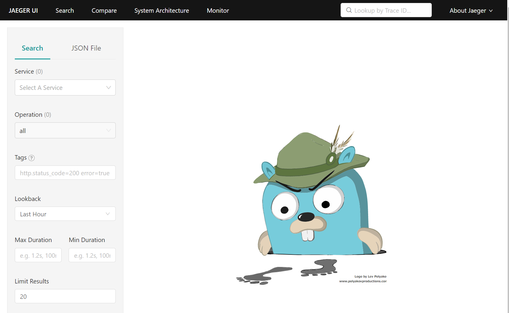

ここまでで準備は完了です。次からは実際のトレース機能をみていきましょう。

### テレメトリーデータの取得と可視化
先ほど説明した挨拶アプリにリクエストを送り動かしてみます。

```shell
curl localhost:7001/aggregate/sync
こんにちは, Hello, ニイハオ
```
- リクエストの流れ(再掲)


この際のリクエストは上の図(再掲)のようにHelloAggregation→HelloService→HelloService→HelloServiceと流れ、それぞれのHelloSeviceの処理時間はスリープにより約1秒程度となっているハズです。

それではこの結果をJeagerで確認してみましょう。
挨拶アプリにリクエストを投げた後に先ほどの`http://localhost:16686`の画面の左上の”Service”プルダウンメニューに\[HelloAggregationApplicaiton\]が出てくるので、それを選択し\[FindTraces\]ボタンをクリックします。

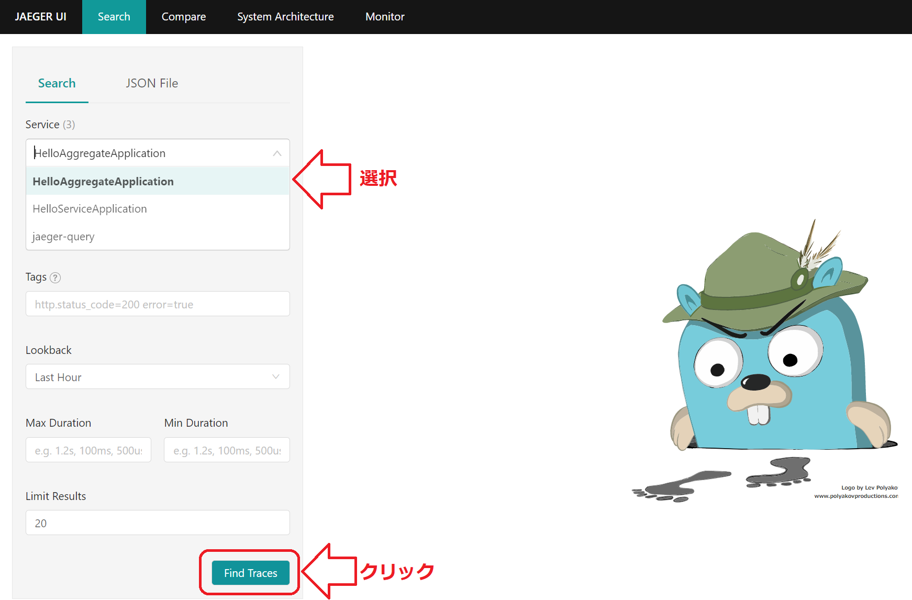

そうすると次のような結果が表示されます。

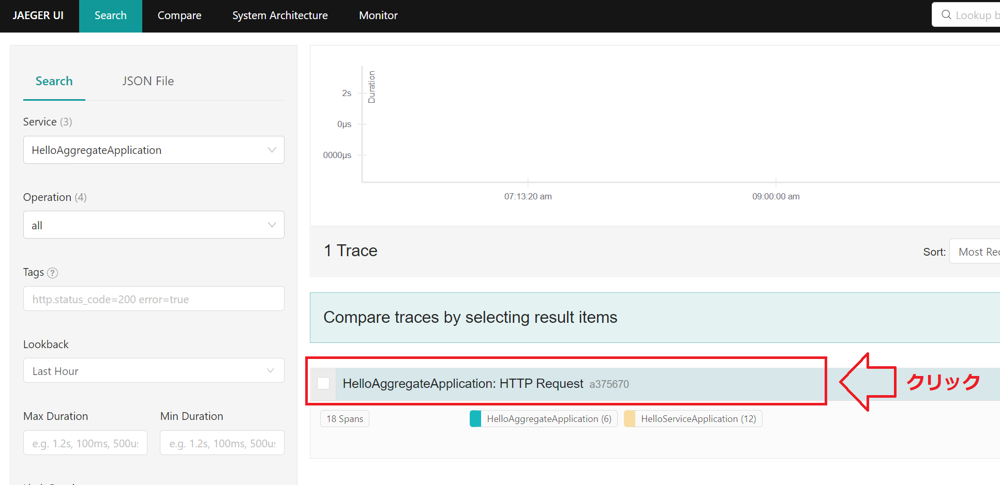

この結果の"HelloAggregationApplicaiton"の行を選択すると、そのリクエストに対するアプリケーションを跨ったトレース情報がビジュアルに表示されます。

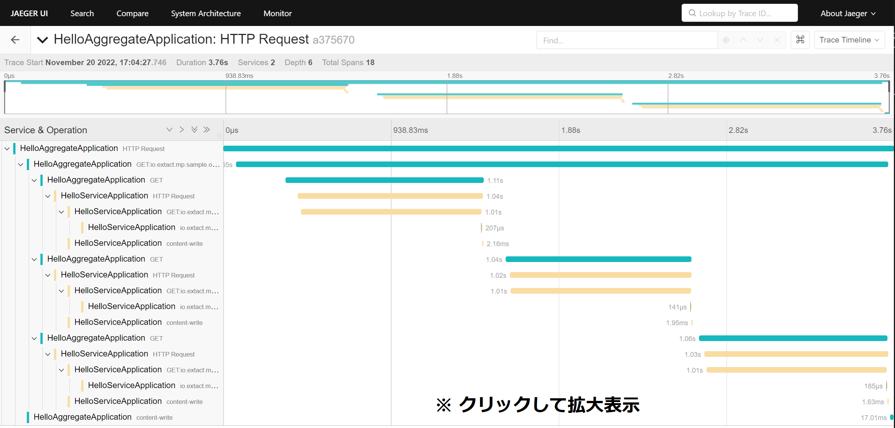

この結果から`/aggregate`に対するリクエストが確かにHelloAggregation→HelloService→HelloService→HelloServiceと流れていき、それぞれのHelloServiceの処理時間が約1秒程度でトータルで約4秒弱掛かっていることが分かります。

MP OpenTracingにはこの他にもコードを実装することでより詳細なトレース情報を取得する機能もあります。本記事ではこの機能は取り上げませんが、興味がある方は公式マニュアルの[こちら](https://download.eclipse.org/microprofile/microprofile-opentracing-3.0/microprofile-opentracing-spec-3.0.html#_enabling_explicit_distributed_tracing_code_instrumentation)を参照ください。

# 分散トレーシングの全体像
MP OpenTracingとJeagerでどのようなことができるかを掴んでもらったところで、次は「だれが」「どこで」「どのように」トレース情報を採っているかを見ていきたいと思います。

今回のトレース情報の取得から表示に関わる登場人物をもとにその全体像を表すと次のようになります。Jeagerに登場する要素は他にもありますが、本題と余り関係ない要素は省略しています。


MP OpenTracingはJakarta RESTful Web Services(JAX-RS)のリクエストに対するトレース情報を自動で取得します。MP OpenTracingはRESTリソースに対するリクエスト（Incoming Request）があった場合、下の画面キャプチャの1つの赤帯に相当するSpanを開始し、リクエストが完了した時点でそのSpanを終了させます。JAX-RS Clientで送信するリクエスト(Outgoing Request)に対しては、トレースID等のSpanContext情報をHTTPヘッダに設定し、送信先にそのコンテキスト情報を自動で伝播させます。

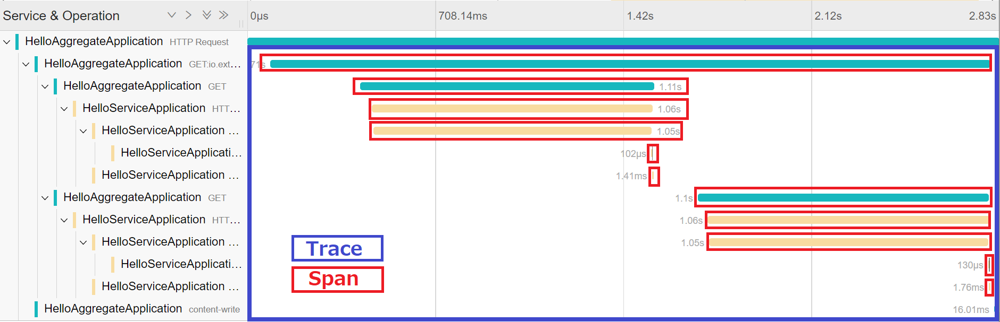

MP OpenTracingにより取得されたトレース情報はMP OpenTracingの機能によりJeager Collectorに自動で送信され、Jeager Collectorは受信したトレース情報を蓄積していきます。そしてこの蓄積されたトレース情報をJeager UIを通してビジュアルに表示するといった流れになります。

ここまでの説明を整理する次のようになります。
- MP OpenTracingによりJAX-RSのリクエストに対するトレース情報の取得とバックエンドへの送信が行われる
- Jeagerなどのバックエンドによりトレース情報が収集、蓄積されるとともにトレース情報を可視化する機能も提供される

ポイントはMP OpenTracingとJeagerの双方の役割はトレース情報の取得・送信と収集・蓄積を境に分かれるところになります。この点は理解しておきましょう。

仕組みの説明してきましたがOpenTracingの話はまだ出てきていません。次からはMP OpenTracingの中を少し掘り下げて、MP OpenTracingとOpenTracingの関係を見ていきます。

# MicroProfile OpenTracingとOpenTracingの関係
まずはOpenTracingについて簡単に説明します。

OpenTracingは過去にCloud Native Computing Foundation(CNCF)により策定されたトレースを取得するためのベンダー非依存な仕様で、主にTraceとSpanといったトレースのデータモデルとそのデータモデルを扱うAPI仕様で構成されています。このAPIは主要な各言語に対して提供されており、Javaの場合はio.opentracing.*パッケージ(opentracing-api.jar)がその実体となります。

ただし、OpenTracingは仕様を定めているだけのため、実際のトレース処理にはJeagerなどのOpenTracingに準拠した実装が必要なります。このOpenTracingとJeagerの関係はJakartaEEのJakarta Persistence(JPA)とその実装としてのHibernateやEclipse Linkと同じといえます。

また、JPAを素で使うときと同じようにOpenTracingを素で使う場合は、OpenTracingのAPIを使い下記のようにTraceを取得するロジックをアプリケーションに埋め込むことが必要となります。

```java
io.opentracing.Tracer tracer = ...;
...
Span span = tracer.buildSpan("someWork").start();
try (Scope scope = tracer.scopeManager().activate(span)) {
    // Do things.
} catch(Exception ex) {
    Tags.ERROR.set(span, true);
    span.log(Map.of(Fields.EVENT, "error", Fields.ERROR_OBJECT, ex, Fields.MESSAGE, ex.getMessage()));
} finally {
    span.finish();
}
```
- 引用元: [GitHub::opentracing/opentracing-java - Starting a new Span](https://github.com/opentracing/opentracing-java#starting-a-new-span)


OpenTracingを素で使う場合、コードが必要になる一方、MP OpenTracingではトレースに関する処理は一切書いていません。これがMP OpenTracingの具体的な機能となります。MP OpenTracingはJAX-RSとCDIの機能を統合し、OpenTracing APIを使った処理を肩代わりしてくれます。

このMP OpenTracingとOpenTracingの関係を今度はソフトウェアスタックで図示すると次のようになります。



アプリケーションからはMicroProfile OpenTracingしか意識することはありませんが、図にあるとおり、その内部における実際のトレースの取得と送信はOpenTracing実装(今回はJeager Client)により行われます。

:::check: OpenTelemetryとは
冒頭で触れとおり次のMicroProfile 6.0で準拠する標準がOpenTracingからOpenTelemetryに変わります。OpenTelemetryはメトリクス、トレース、ログの3つの要素から構成されますが、ここではトレース部分について説明します。

トレースに関する有力な標準はOpenTracingの他にもう1つOpenCensusがありました。OpenTracingがCNCF配下で仕様の策定だけを範囲としていたのに対し、OpenCensusはGoogleが公開、開発したメトリクスと分散トレースに関する仕様と実装となります。
当初、トレースに関する標準が2つ存在する形になっていましたが、2019年にOpenTracingからOpenCensusとの統合が発表[^4]され、その統合されたものがOpenTelemetryのトレース部分となります[^5]。したがって、OpenTelemetryではトレースの仕様だけでなく、その実装となる各言語に対するSDKも提供されるのがOpenTracingとの大きな違いとなります。

[^4]: [Merging OpenTracing and OpenCensus: Goals and Non-Goals](https://medium.com/opentracing/merging-opentracing-and-opencensus-f0fe9c7ca6f0)
[^5]: OpenTracing, OpenCensus, OpenTelemetry間の関係は仕様と実装の双方の観点が入り交じり、その経緯と棲み分けを理解するのは難しいですが次のブログが分かりやすくまとめられています。 - [YAMAGUCHI::weblog / OpenTelemetryについての現状まとめ （2020年6月版）](https://ymotongpoo.hatenablog.com/entry/2020/06/01/164221)
:::

:::column:HelidonのMicroProfile OpenTracing実装
HelidonのMicroProfile OpenTracing実装は2.xまではJeagerなどのトレースアプリ固有の実装を使っていましたが、3.xからは内部の実装は次のようにOpenTelemetryベースになっています。


Helidon 3.xでもトレース情報の取得や送信はOpenTracing APIを経由して行うようになっていますが、その背後にある実装はJeager Clientからshim経由[^6]のOpenTelemetry SDK実装に変わっています。また、これに伴いバックエンドへのトレース情報の送信もHelidon 3.xからはOpenTelemetry SDKによりネイティブのOpenTelemetry Protocol(OTPL)を使って行われます。現時点ではOpenTracing APIの皮を1枚被せていますが、その実装はすべてOpenTelemetryベースになっており、いつもでOpenTelemetryへ移行ができる状態になっています。

[^6]:shim(シム)とはGoFのデザインパターンでいうところのOpenTracing APIに対するAdapter実装となります。
:::

# 非MicroProfile OpenTracingアプリのトレースの参加
マイクロサービスの利点の一つとして、サービスごとに実装言語や実行環境を選択できることがあります。このため、マイクロサービスを構成するすべてのアプリケーションがMicroProfile OpenTracingをサポートしているとは限りません。では、MicroProfile OpenTracingをサポートしていないアプリ(非MP OpenTracingアプリ)を分散トレースに参加させるにはどのようにしたらよいでしょうか？

これには分散トレーシングの仕組みへの理解が必要となります。ここではよりその仕組みを理解することを目的に非MP OpenTracingアプリをトレースに参加させる方法をみていきます。

## 分散トレースにおける2つのプロトコル
MP OpenTracingアプリと非MP OpenTracingアプリが混在したトレース環境の構成は次のようになります。


この際、非MP OpenTracingアプリのトレースで考える必要があることは、呼び出し元のBアプリケーションからSpanの紐づけ情報として渡されるトレース情報のHTTPヘッダの設定形式を意味するPropagationフォーマットとバックエンドにSpan情報を送信する際のSpanフォーマット(通信プロトコルも含む)の2つになります。

MP OpenTracingで構成されたトレース環境に参加するには、MP OpenTracingアプリ間で利用されているPropagationフォーマットとSpanフォーマットに合わせる必要があります。この具体的なフォーマットしてはOpenTelemetry SDKがサポートしているフォーマットが参考になります。(Propagationフォーマットは[こちら](https://github.com/open-telemetry/opentelemetry-java/blob/main/sdk-extensions/autoconfigure/README.md#propagator)、Spanフォーマット[^7]は[こちら](https://github.com/open-telemetry/opentelemetry-java/blob/main/sdk-extensions/autoconfigure/README.md#exporters))

[^7]: OpenTelemetryがバックエンドに送信するテレメトリーデータはSpan情報だけではなくメトリクスやログも含まれます。このため、OpenTelemetryにSpnaフォーマットといった用語はなく、バックエンドに送信するデータフォーマットに該当する用語は`Exporter`となりますが、ここでは用語の混乱を避けるためSpanフォーマットと呼んでいます。

:::column: Helidonで利用されるPropagationフォーマットとSpanフォーマット
Helidon 3.xのMP OpenTracing実装で利用されるデフォルトのPropagationフォーマットは[B3](https://github.com/openzipkin/b3-propagation#single-header)、SpanフォーマットはOpenTelemetryの[OTLP](https://github.com/open-telemetry/opentelemetry-specification/blob/main/specification/protocol/otlp.md)となります。

Helidon 3.xはPropagationフォーマットにB3を使っているため、Helidon 3.xアプリからのRESTリクエスト(Outgoing Request)には次のようなHTTPヘッダーがHelidonによって追加されます。
```shell
X-B3-TraceId: 80f198ee56343ba864fe8b2a57d3eff7
X-B3-ParentSpanId: 05e3ac9a4f6e3b90
X-B3-SpanId: e457b5a2e4d86bd1
X-B3-Sampled: 1
```
これはHelidon3.xを使っているアプリ群のトレースに参加するには、このB3フォーマットのHTTPヘッダーを送受信できるようにする必要があることを意味します。
:::

## OpenTelemetry Java agentの利用
先ほどの説明に使っていたRESTアプリに次のようにRandomHelloServiceを追加してみます。


このRandomHelloApplicationアプリはJAX-RSを使っていますが、HelloAggregationApplicaitonやHelloServiceApplicationのようにMP OpenTracingは組み込んでいません。トレース実装にはその代わりとして[OpenTelemetry Java agent(Java agent)](https://github.com/open-telemetry/opentelemetry-java-instrumentation)を使います。

Java agentはその名のとおりエージェントによるAuto Instrumentation方式のため、[サポート一覧](https://github.com/open-telemetry/opentelemetry-java-instrumentation/blob/main/docs/supported-libraries.md#supported-libraries-frameworks-application-servers-and-jvms)に記載されているフレームワークやライブラリ、アプリケーションサーバであれば、起動時にagentを組み込むだけでコードやライブラリを追加することなく各対応コンポーネントに対するトレースを取得できます[^8]。

[^8]:MP OpenTracingはCDIのInterceptorを使ってトレース処理を割り込ませるのに対して、OpenTelemetry Java agentはクラスローディングをフックし、クラスをバイトコードレベルで書き換えてトレース処理を割り込ませる方式となります。

RandomHelloApplicaitonを次のように起動し、Java agentを組み込みます。なお、`-javaagent:`には[releasesページ](https://github.com/open-telemetry/opentelemetry-java-instrumentation/releases)で取得した`opentelemetry-javaagent.jar`へのパスを指定します。

```shell
export OTEL_TRACES_EXPORTER=otlp
export OTEL_PROPAGATORS=b3
export OTEL_METRICS_EXPORTER=none
export OTEL_SERVICE_NAME=RandomHelloService
java -javaagent:/path/to/opentelemetry-javaagent.jar -jar target/hello-service-random-tr.jar
```

ここでポイントとなるのは起動する前に設定している`OTEL_TRACES_EXPORTER`と`OTEL_PROPAGATORS`の環境変数です。これはJava agentに対する設定となります。

上述したとおり、Helidon 3.xのMP OpenTracingアプリケーションではPropagationフォーマットにB3フォーマット、SpanフォーマットにはOTLPが使われます。後から追加したRandomHelloApplicationは利用するフォーマットを参加する環境に合わせ、B3とOTLPにする必要があります[^9]。

[^9]: OpenTelemetry Java agenetのデフォルトのPropagationフォーマットはW3Cにより策定されている[`tracecontext`](https://www.w3.org/TR/trace-context/)となります。また、Spanフォーマットのデフォルトは`otlp`のため環境変数の設定は省略も可能です。

他の2つの環境変数は、今回はメトリクス情報の取得は対象としてないため`OTEL_METRICS_EXPORTER`に`none`を、トレースのタイムラインで表示されるサービス名は`RandomHelloService`となるように`OTEL_SERVICE_NAME`を設定しています。

それではこのように構成したアプリケーションのトレース情報を見てみましょう。

まずは`/aggregate`へのリクエスト結果を確認します。

```shell
curl localhost:7001/aggregate/sync
こんにちは, Hello, ニイハオ, チャオ
```

挨拶結果の4つ目に`チャオ`が追加されていることからRandomHelloも処理に参加していることが確認できます。

次にJeager UIから該当のトレース情報を確認してみます。

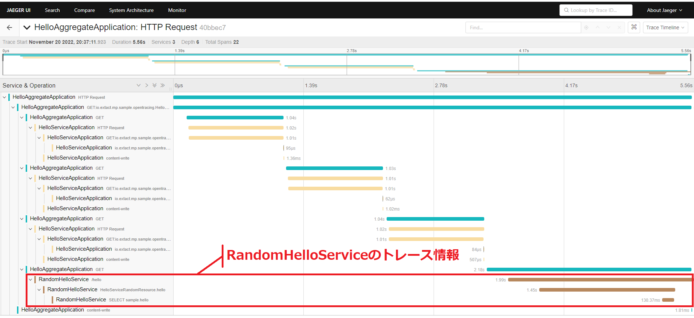

表示されたトレース情報からMP OpenTracingアプリケーションの中に、OpenTelemetryを使った非MP OpenTracingアプリのRandomHelloアプリがトレースに参加できていることが確かに分かります。

# まとめ
MicroProfile OpenTracingによる分散トレーシングをみてきましたが、Kubernetesなどを利用したクラウドネイティブ環境ではトレース機能をアプリケーション側で持つのではなく、[分散トレーシング(OpenTelemetry / Jaeger)](https://developer.mamezou-tech.com/containers/k8s/tutorial/ops/jaeger/)の記事で紹介しているようなサイドカーやサービスメッシュで持つのが一般的です。

サイドカーやサービスメッシュの場合は、言語を問わずアプリケーションに後からアドオンできるという大きなメリットがありますが、非コンテナ環境のアプリケーションには適用できません。また、記事で詳細は取り上げませんでしたがMicroProfile OpenTracingはコードを実装することでアプリケーション内部の詳細なトレース情報も簡便に取得ことが可能です。

サイドカーやサービスメッシュが利用できる環境であれば、筆者もそちらを中心とした方がメリットがあると考えていますが、非コンテナ環境のサポートやアプリケーション内部のトレース情報の取得などの要件がある場合はMicroProfile OpenTracingの存在が活きてくると思います。

---
参照資料

- OpenTracing: <https://opentracing.io/docs/>
- Jeager: <https://www.jaegertracing.io/docs/1.39/>
- OpenTelemetry: <https://opentelemetry.io/docs/>
- Qiita - Kubernetes上のマイクロサービスを分散トレースする: <https://qiita.com/mumoshu/items/d4065a96a9d7e319eceb>
