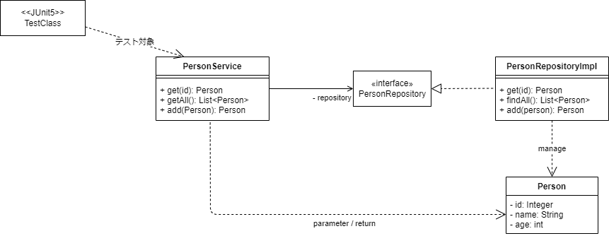

CDIのテストはCDIコンテナが必要となる点やアノテーションをもとにした静的な依存解決が中心になることから融通が効きづらく悩ましい点がありました。[Helidon MP Testing With JUnit5](https://helidon.io/docs/v2/#/mp/testing/01_testing)(Helidon MP Testing)は言ってしまえばHelidonを使ってJUnit5からCDIのテストを行えるようにしてくれるだけのライブラリですが、実際に使ってみると非常に便利で悩み多きCDIのテストを激変させる威力を秘めています。

今回はそのすごさを少しでも実感してもらうため、サンプルにはDBアクセスを行う実践的なものを、そして説明よりもコードで語る系の記事で行きたいと思います。

なお、記事はコードの抜粋を記載しています。設定やコードの全体を確認したい場合は以下のGitHubリポジトリを参照ください。
- <https://github.com/extact-io/contrarian-microprofile-sample/tree/main/ex-helidon-testing>

:::info
この記事はJava11+Helidon 2.4.2 をもとに作成しています。なお、Helidon MP Testing With JUnit5はMicroProfileには含まれないHelidon独自の機能となります。
:::

[[TOC]]


## テスト対象クラスの説明
最初にテスト対象として説明に利用するサンプルアプリの構造とコードを以下に示します。今回の記事ではこのサンプルアプリを題材として説明してきます。

:::info
サンプルアプリのDBアクセスにはJakarta EEのJTA/JPAを利用していますが、今回の本題ではないためこれらの説明は行いません。ただし、難しいことは行ってはいませんので、なにをやっているかをコードの雰囲気から理解していただく程度で十分です。
:::

- サンプルアプリの構造


- PersonServiceクラス
```java
@ApplicationScoped
@Transactional
public class PersonService {
    private PersonRepository repository;
    @Inject
    public PersonService(PersonRepository repository) {
        this.repository = repository;
    }
    public Person get(int id) {
        return repository.get(id);
    }
    public List<Person> getAll() {
        return repository.findAll();
    }
    public Person add(Person person) {
        return repository.add(person);
    }
}
```

- PersonRepositoryインタフェース
```java
public interface PersonRepository {
    Person get(int id);
    List<Person> findAll();
    Person add(Person person);
}
```
- PersonRepositoryImplクラス
```java
@ApplicationScoped
public class PersonRepositoryImpl implements PersonRepository {
    @PersistenceContext
    private EntityManager em;
    @Override
    public Person get(int id) {
        return em.find(Person.class, id);
    }
    @Override
    public List<Person> findAll() {
        return em.createQuery("select p from Person p", Person.class)
                .getResultList();
    }
    @Override
    public Person add(Person person) {
        em.persist(person);
        return person;
    }
}
```

- Personクラス
```java
@Entity
public class Person {
    @Id
    @GeneratedValue(strategy = GenerationType.IDENTITY)
    private Integer id;
    private String name;
    private int age;
    ... 
}
```

## Helidon MP Testingの準備
次にHelidon MP Testingを利用するために必要な依存をpomに追加します[^1]。

```xml
<dependency>
    <groupId>io.helidon.microprofile.tests</groupId>
    <artifactId>helidon-microprofile-tests-junit5</artifactId>
    <scope>test</scope>
</dependency>
<dependency>
    <groupId>org.junit.jupiter</groupId>
    <artifactId>junit-jupiter-api</artifactId>
    <scope>test</scope>
</dependency>
<dependency>
    <groupId>org.junit.jupiter</groupId>
    <artifactId>junit-jupiter-engine</artifactId>
    <scope>test</scope>
</dependency>
```
[^1]: テストライブラリに関する依存はHelidonの全部入りartifactの`io.helidon.microprofile.bundles:helidon-microprofile`には含まれていないため個別に追加する必要があります。


サンプルアプリには他にもDB周りで必要となる依存や設定がありますが、これは記事の最後にコラムとしてまとめています。


## インテグレーションテストの実施
準備が整いましたのでまずは肩慣らしとしてHelidon MP Testingを使ったServiceとRepositoryのプロダクトコードを結合したPersonService#getのテスト実装を見てみましょう。（getAllとaddに対するテスト実装はまだ行わず後にとっておきます）

このテストコードは次のとおりになります。
```java
@HelidonTest // 1.
public class PersonServiceItTest {
    @Inject  // 2.
    private PersonService service;
    @Test
    void testGetPerson() {
        var expected = new Person(1, "soramame", 18);
        var actual = service.get(1);
        assertEquals(expected, actual);
    }
}
```
この機能は主に以下2つのアノテーションにより実現されています。
1. `@HelidonTest`が認識されることでHelidonのJUnit5拡張テストにより開始時(beforeAll)にCDIコンテナが起動され、テスト終了時(AfterAll)にCDIコンテナが停止されます。
2. Helidonにより`@Inject`されているインスタンス変数に対してJUnit5拡張テストで起動したCDIコンテナ配下のCDI Beanがインジェクションされます。

:::check
["Helidon Tips - SLF4J＋LogbackへのLogger切り替え"](/msa/mp/ext01-helidon-logback/)でログの切り替え方法を説明していますが、JUnitのテストクラスにはmainメインメソッドがありません。このため、テスト時のログを切り替えたい場合はJUnit5の拡張機能(`BeforeAllCallback`)を使い次のように切り替え処理を実装します。
```java
public class JulToSLF4DelegateExtension implements BeforeAllCallback {
    static {
        // java.util.loggingの出力をSLF4Jへdelegate
        SLF4JBridgeHandler.removeHandlersForRootLogger();
        SLF4JBridgeHandler.install();
    }
    @Override
    public void beforeAll(ExtensionContext context) throws Exception {
        // beforeAllのコールバックを待たずにクラスがロードされた時点で
        // SLF4Jへのdelegate処理を実行させるためのダミー実装
    }
}

```
テストクラス側に制御が渡ってくるのはCDIコンテナが起動した後になるため、その前に割り込ませる必要があるためJUnit5の拡張機能をやや強引な方法で使用しています。

次に拡張した実装を有効にするためテストクラス側にアノテーションを指定します。
```java
...
@ExtendWith(JulToSLF4DelegateExtension.class) <-- 拡張機能を有効にする
public class SampleTest {
    ....
}
```
:::


:::column:他のテスト支援ライブラリとの比較
JUnitでCDIのテストを可能にするテスト支援ライブラリとしては他にも[CDIUnit](http://cdi-unit.github.io/cdi-unit/)や[Arquillian](https://arquillian.org/guides/getting_started_ja/)がありますが、CDIUnitはCDIを疑似的に再現するものでProduction環境で利用するランタイムとは別ものとなり、Arquillianはアプリケーションサーバー上で動作させることができますが、それには独自のアーカイブ処理を実装する必要がありました。

それに対してHelidon MP Testingはmainメソッドから起動したものと、そのまま同じ構成、同じランタイムで特別なことをすることなくテストが行えます。Helidon MP Testingのまだほんの入り口しか見てもらっていませんが、これだけでもその便利さを理解いただけるかと思います。

余談となりますが、Springではそんなの当たり前のようにできるけど、、と思われる方もいるかと思います。CDIはSpringとは異なりそもそもmainメソッドから利用することはできず、アプリケーションサーバ上で動作を確認する必要がありました。このため、JavaSE環境で動作するJUnit5からCDIのテストを行うには非常に高いハードルがありました。
:::


## 依存先をスタブに切り替える
CDIはクラスパス上のInjection候補から静的に依存先を決定するため、実物の依存先がクラスパス上に存在する場合、それをプロダクトコードに影響を与えず他に切り替えるのはその仕組み上、CDIではハードルが高いものでした[^2]。
その一方、単体テストでは依存先の品質が確保されていない場合やテスト条件を作りやすくするため、実物クラスをスタブに置き換えたい場合がよくありました。

[^2]: `@Alternative`や`@Qualifire`、Producerなどの仕組みを使って実行時に切り替えることは可能ですが、それはテスト時に切り替えるために必要となるコードをプロダクトコードに入れることに相当するため、できれば避けたいものでした。

従来の仕組みではこれはとても悩ましい問題でしたが、Helidon MP Testingでは簡単にスタブへの切り替えが行えるようになります。

では、さっそく実物のPersonRepositoryImplクラスをスタブに置き換えてテストを行う実装例を見てみましょう。このテストコードは次のようになります

```java
@HelidonTest
@DisableDiscovery                    // 1.
@AddBean(PersonService.class)        // 2.
@AddBean(PersonRepositoryStub.class) // 2.
public class PersonServiceStubTest {
    @Inject
    private PersonService service;
    @Test
    void testGetPerson() {
        var expected = new Person(1, "stub-person", 99);
        var actual = service.get(1);
        assertEquals(expected, actual);
    }
    // PersonRepositoryに対するスタブ実装
    static class PersonRepositoryStub implements PersonRepository {
        @Override
        public Person get(int id) {
            return new Person(id, "stub-person", 99);
        }
        @Override
        public List<Person> findAll() {
            throw new UnsupportedOperationException();
        }
        @Override
        public Person add(Person person) {
            throw new UnsupportedOperationException();
        }
    }
}
```

この機能は主に以下2つのアノテーションにより実現されています。
1.	`@DisableDiscovery`はHelidon MP TestingのアノテーションでCDIコンテナ起動時に行われるクラスパスからのCDI Beanの検索と登録を無効化します。
2.	`@AddBean`に指定されたクラスをApplicationScopedのCDI BeanとしてCDIコンテナに登録します。なお、`@AddBean`のscoped属性を指定することで他のスコープでCDI Beanを登録することも可能です。

上記のアノテーション定義により、テスト実行時に実物のPersonRepositoryImplが検索されなくなり、変わってスタブ実装のPersonRepositoryStubインスタンスがCDI Beanとして登録され、PersonServiceにもインジェクションされるようになります。

このようにHelidon MP Testingでは`@DisableDiscovery`を使ってCDIの検索を無効化し、テスト向けに必要なCDI Beanを`@AddBean`を使って一時的に登録することができるため、クラスパス上に配置されている依存関係とは別に任意のオブジェクト間の関係を作ることができます。

## 設定を一時的に追加上書きする
単体テストではテスト条件を作るためにテスト向けの設定を追加したり上書きしたりすることが必要となったりします。Helidon MP Testingではこのような場合には`@AddConfig`を使って次のように簡単に一時的な設定の追加や上書きができます。

```java
@HelidonTest
@DisableDiscovery
@AddBean(PersonService.class)
@AddBean(PersonRepositoryStub.class)
@AddExtension(ConfigCdiExtension.class)                 // 1.
@AddConfig(key = "test.name", value = "config-person")  // 2.
@AddConfig(key = "test.age", value = "10")              // 2.
public class PersonServiceStubWithConfigTest {
    @Inject
    private PersonService service;
    @Test
    void testGetPerson() {
        var expected = new Person(1, "config-person", 10);
        var actual = service.get(1);
        assertEquals(expected, actual);
    }
    // PersonRepositoryに対するスタブ実装
    static class PersonRepositoryStub implements PersonRepository {
        private Config config;
        @Inject
        PersonRepositoryStub(Config config) {
            this.config = config;
        }
        @Override
        public Person get(int id) {
            var name = config.getValue("test.name", String.class);
            var age = config.getValue("test.age", int.class);
            return new Person(id, name, age);
        }
        @Override
        public List<Person> findAll() {
            throw new UnsupportedOperationException();
        }
        @Override
        public Person add(Person person) {
            throw new UnsupportedOperationException();
        }
    }
}
```

（テストとしては余り意味がないですが）このテストは設定から取得した値でPersonインスタンスを返すようにしています。また、この機能は主に以下2つのアノテーションにより実現されています。

1. `@AddBean`と同様に`@AddExtension`で指定されたCDI Extensionを起動時に実行します。今回の例では`@DisableDiscovery`によりMicroProfile Configも無効化さているため、MicroProfile Configを起動するCDI Extensionの実装クラスを明示的に指定しています。
2. `@AddConfig`のkeyとvalueで指定された設定をMicroProfile Configに追加します。同じキー名が他の設定源に含まれている場合は上書きします。[^3]

[^3]: 優先度は公式ページにも明記されていませんが、実装を見ると優先度はシステムプロパティ(優先度:400)や環境変数(優先度:300)よりも高い1000となっているため、実質的に@AddConfigの設定が最優先されます。

## メソッドごとにCDIコンテナを起動する
Helidon（CDIコンテナ）の起動はデフォルトで1テストクラスごとに1回となります。このため、副作用のあるテストを連続して実行した場合、事後条件を固定化できず困る場合があります。この典型的な例は次のようなテスト実装となります。

```java
@HelidonTest
public class PersonServiceItAllTest {
    @Inject
    private PersonService service;
    @Test
    void testGetPerson() {
        var expected = new Person(1, "soramame", 18);
        var actual = service.get(1);
        assertEquals(expected, actual);
    }
    @Test
    void testGetAllPerson() {
        var expected = 2;
        var actual = service.getAll();
        assertEquals(expected, actual.size());
    }
    @Test
    void testAddPerson() {
        var newPerson = new Person(null, "add-person", 32);
        var addedPerson = service.add(newPerson);
        assertNotNull(addedPerson.getId());
    }
}
```
(assertは手を抜いています、、悪しからずご承知の程を・・)

JUnit5のテスト実行順序はなにも指定しない限り順不同となります。これに対してすべてのPersonインスタンスを取得するテスト(`testGetAllPerson`)は初期登録時の2件を期待値としていますが、これはPersonインスタンスの追加を行うテスト(`testAddPerson`)の実行順序に依存しているため、`testAddPerson`が先に実行された場合、結果は3件となりテストが失敗します。

これは`testAddPerson`の副作用が`testGetAllPerson`に影響したためですが、テストには「テストは他のテストの影響受けず、また与えず、テストごとに独立していること」という原則があります。この意味において、今回の例はテスト開始時に起動したCDIコンテナとDBを複数のテストで使いまわしているため、結果テストが独立していないことにより発生しています。

:::check
場合によっては`testGetAllPerson`が常に先に実行されテスト失敗がなかなか再現しない場合があります。このような場合はJUnit5の実行順を固定化する機能を使い次のように常に`testAddPerson`が先に実行されるようにしてみましょう。
```java
@HelidonTest
@TestMethodOrder(OrderAnnotation.class) <-- JUnit5の順序指定の有効化
public class PersonServiceItAllTest {
    @Inject
    private PersonService service;
    @Test
    @Order(1) <-- 他のメソッドも@Orderでテスト順序を指定する
    void testAddPerson() {
        ...
    }
    ...
}
```
:::


これに対してHelidon MP TestingではテストメソッドごとにCDIコンテナを起動させるようにするオプションを`@HelidonTest`で持っています。今回のような問題はテストメソッドごとにCDIコンテナを起動するようにし、テストデータも含め[^4]毎回テストメソッドをクリーンな状態で実行しテストを独立させることで解決できます。

では、テストメソッドごとにCDIコンテナを起動するようにした例を見ていきましょう。コードは次のようになります。
```java
@HelidonTest(resetPerTest = true) // CDIコンテナをテストメソッドごとに起動
public class PersonServiceItAllTest {
    private PersonService service;
    @BeforeEach
    void init() { // テストメソッドごとにテスト対象を取得する
        this.service = CDI.current().select(PersonService.class).get();
    }
    @Test
    void testGetPerson() {
        var expected = new Person(1, "soramame", 18);
        var actual = service.get(1);
        assertEquals(expected, actual);
    }
    @Test
    void testGetAllPerson() {
        var expected = 2;
        var actual = service.getAll();
        assertEquals(expected, actual.size());
    }
    @Test
    void testAddPerson() {
        var newPerson = new Person(null, "add-person", 32);
        var addedPerson = service.add(newPerson);
        assertNotNull(addedPerson.getId());
    }
}
```
[^4]: 最後のコラムでも説明していますが、今回のサンプルはCDIコンテナ起動時にテストデータがDBに自動で投入され、CDIコンテナ終了時にDBごと破棄される仕組みとなっています。

まず`@HelidonTest` の`resetPerTest` 属性がCDIコンテナの起動単位を指定するオプションとなります。未指定の場合はデフォルトの`false`が有効となり「テストごとに起動しない」で動作していましたが、これを`true`に指定することでテストメソッドごとにCDIコンテナが（再）起動するようになります。

他に変更前と変わったところとしてPersonServiceインスタンスの取得方法があります。

`@Inject`によりインスタンス変数で保持するCDI Beanはすべてのテストメソッドに渡り保持され続けますが、`resetPerTest`を`true`にした場合、インスタンス変数の実体であるCDI Beanがメソッドの終了ごとに無効化されます。このため、CDI Beanを`@Inject`で取得することはできなくなります。

`resetPerTest`を`true`にした場合はこの制約があるため、テスト対象のCDI Beanは例のようにテストメソッドごとに`CDI.current.select()`で毎回取得する必要があります。

このように実装することでテストは順序に依らず常に成功するようになります。

:::column:テストメソッドごとにCDIコンテナを起動するメリットとデメリット
本文でも触れたとおり、単体テストの原則はテストメソッドごとに独立させる（クリーンにする）です。この点に立った場合、`@HelidonTest`を使ったテストは`resetPerTest`を`true`にすべきですが、Helidonもこれをデフォルトにしてないところから分かる通り、それなりなデメリットがあります。

それはテストに時間が掛かることです！Helidonの起動はJakartaEEのアプリケーションサーバに比べて速いといっても1回の起動に少なくとも2,3秒は掛かります。このため、テストメソッドが増えれば増えるほど、テストの実行時間がリニアに延びていきます。

ですので、ベキ論としては`resetPerTest`を`true`にして毎回クリーンな状態でテストを実施すべきですが、「時は金なり」で必要に迫られない限りデフォルト設定の`false`で使うのが実際のところだと思います。また、今回の例でいえばテストの順序を固定化すればよいだけですので、JUnit5の`@TestMethodOrder(OrderAnnotation.class)`を使って順序を固定化する選択肢もあります。
:::


:::column:DBアクセス周りで利用している機能と設定
サンプルのDBアクセス周りにはJTA＋JPA＋H2(DBMS)を使っています。これらは通常サーバ環境で動作するものですが、JavaSE環境のHelidonからどのように利用可能しているか、Helidon MP Testingの話題からは逸れますが参考として説明します。

まずJPAの実装には[EclipseLink](https://www.eclipse.org/eclipselink/)を使用し[Helidon MP JPA](https://helidon.io/docs/v2/#/mp/jpa/01_introduction)を使うことでJakartaEEサーバー上での動作と同じようにJavaSE環境でも`@PesistenceContext`で`EntityManage`を取得できるようにしています。また、JPAから利用されるDataSourceは[CDI extension for HikariCP](https://helidon.io/docs/v2/#/mp/extensions/02_cdi_datasource-hikaricp)を使いJavaSE環境からDataSourceを利用できるようにしています。そしてJTAには[CDI extension for JTA](https://helidon.io/docs/v2/#/mp/extensions/05_cdi_jta)を使っています。

ここで説明したEclipseLinkとHelidonの固有機能は全部入りartifactの`io.helidon.microprofile.bundles:helidon-microprofile`には含まれていないため、次の依存をpomに追加する必要があります。
```xml
<dependency><!-- JakartaEE JTA Spec -->
    <groupId>jakarta.transaction</groupId>
    <artifactId>jakarta.transaction-api</artifactId>
</dependency>
<dependency><!-- JakartaEE JPA Spec -->
    <groupId>jakarta.persistence</groupId>
    <artifactId>jakarta.persistence-api</artifactId>
</dependency>
<dependency><!-- CDI extension for JTA -->
    <groupId>io.helidon.integrations.cdi</groupId>
    <artifactId>helidon-integrations-cdi-jta-weld</artifactId>
    <scope>runtime</scope>
</dependency>
<dependency><!-- CDI extension for HikariCP -->
    <groupId>io.helidon.integrations.cdi</groupId>
    <artifactId>helidon-integrations-cdi-datasource-hikaricp</artifactId>
    <scope>runtime</scope>
</dependency>
<dependency><!-- Helidon MP JPA -->
    <groupId>io.helidon.integrations.cdi</groupId>
    <artifactId>helidon-integrations-cdi-jpa</artifactId>
    <scope>runtime</scope>
</dependency>
<dependency><!-- Helidon MP JPA for EclipseLink -->
    <groupId>io.helidon.integrations.cdi</groupId>
    <artifactId>helidon-integrations-cdi-eclipselink</artifactId>
    <scope>runtime</scope>
</dependency>
<dependency><!-- EclipseLink(JPA implementation) -->
    <groupId>org.eclipse.persistence</groupId>
    <artifactId>org.eclipse.persistence.jpa</artifactId>
    <scope>runtime</scope>
</dependency>
<dependency><!-- H2(DBMS) -->
    <groupId>com.h2database</groupId>
    <artifactId>h2</artifactId>
    <scope>runtime</scope>
</dependency>
```

また、JPAの動作にはpersistence.xmlとDataSourceの設定が必要となりますが、それは次のように設定しています。なお、DataSourceは先ほどのCDI extension for HikariCP固有の設定となります。
- persistence.xml
```xml
<persistence version="2.2" xmlns="http://xmlns.jcp.org/xml/ns/persistence"
  xmlns:xsi="http://www.w3.org/2001/XMLSchema-instance"
  xsi:schemaLocation="http://xmlns.jcp.org/xml/ns/persistence
                                 http://xmlns.jcp.org/xml/ns/persistence/persistence_2_2.xsd">
  <persistence-unit name="sample" transaction-type="JTA">
    <description>A persistence unit for Helidon MP Testing with JUnit5 Sample</description>
    <jta-data-source>sampleDataSource</jta-data-source>
    <class>io.extact.mp.sample.testing.Person</class>
    <validation-mode>NONE</validation-mode>
    <properties>
      <property name="eclipselink.deploy-on-startup" value="true" />
      <property name="eclipselink.jdbc.native-sql" value="true" />
      <property name="eclipselink.target-database" value="org.eclipse.persistence.platform.database.H2Platform" />
      <property name="eclipselink.target-server" value="io.helidon.integrations.cdi.eclipselink.CDISEPlatform" />
    </properties>
  </persistence-unit>
</persistence>
```

- application.yaml
```yaml
javax.sql.DataSource:
  sampleDataSource: # このキー名がDataSource名となる
    dataSourceClassName: org.h2.jdbcx.JdbcDataSource
    dataSource:
      url: jdbc:h2:mem:sample;INIT=RUNSCRIPT FROM 'classpath:init-rms.ddl'
      user: sa
      password:
```

H2（DB）の接続先(url)に指定している下記について補足すると、
`jdbc:h2:mem:sample;INIT=RUNSCRIPT FROM 'classpath:init-rms.ddl'` 
これはH2をin-memory形式で利用し、起動時にクラスパス上の`init-rms.ddl`スクリプトを実行するという指定になります。
これにより、テスト起動時にテストプログラムと同じJavaプロセス内にDBが展開（起動）されるとともにスクリプトで定義されたテストデータが投入され、テスト終了後にはDBごとメモリから消滅するようになっています。このため、DBの起動／終了やテストデータの投入／削除などの手順が不要になっています。
:::


## まとめ
Helidon MP Testingとして提供される機能はホボここで説明したものが全てで機能としては決して多くはありません。しかし機能は多くありませんが、これまでCDIでは難しかったことやそもそも実現できなかったことを可能にしてくれる、正にCDIの単体テストを激変させる威力を秘めている機能となっています。Helidonを使う際は是非ご一緒にどうぞ！


---
参照資料

- Helidon公式: [Helidon MP Testing with JUnit5](https://helidon.io/docs/v2/#/mp/testing/01_testing)
