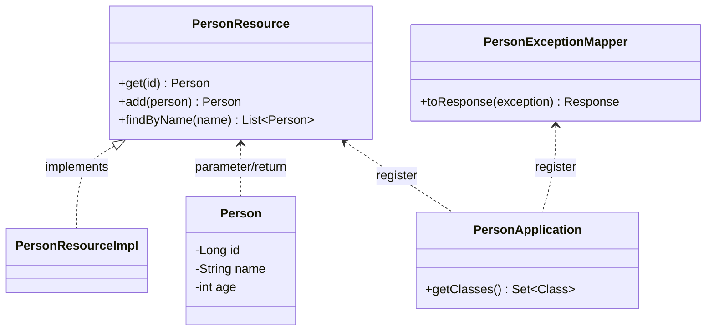

HTTPプロトコルを用いた結合レベルのRESTリソースのテストはどのようにやられていますか？ クライアントからE2Eテストでドカンと一緒に確認でしょうか？それともRESTリソースを呼び出す疑似クライアントプアプリを作成して実施でしょうか？あるいは真面目にやっていないとかでしょうか？いずれにせよHTTPレベルでRESTリソース（REST API）に対するテストを細かくやろうと思った場合、それなりに手間は掛かると思います。

今回はそんな手間のかかるHTTPレベルのRESTリソースのテストをMicroProfile RestClientとHelidon MP Testing With JUnit5(Helidon MP Testing)を使って効率的に行う便利なテスト方法を紹介します。

記事はコードの抜粋を記載しています。全体を見たい場合や動作を確認したい場合は以下のGitHubリポジトリを参照ください。
- <https://github.com/extact-io/contrarian-microprofile-sample/tree/main/ex-helidon-rest-testing>

MicroProfileは連載を行ってます。よければ他の記事も下のリンクからどうぞ！
- [逆張りのMicroProfile ～ Helidonで始めるマイクロサービスへの一歩 ～](/msa/#逆張りのmicroprofile-～-helidonで始めるマイクロサービスへの一歩-～)

[[TOC]]

:::info
この記事はJava11 + Helidon 2.4.2 + MicroProfile RestClient 1.4 + Helidon MP Testing With JUnit5をもとに作成しています。MicroProfile RestClientやHelidon MP Testing With JUnit5の説明は本記事では行いませんので、ご存じない方は以下を一読されることをお勧めします。
- [第7回 らくらくMicroProfile RestClient](/msa/mp/cntrn07-mp-restclient/)
- [Helidon Tips - Helidon MP Testing with JUnit5を使ってみる](/msa/mp/ext02-helidon-testing/)
:::

## MicroProfile RestClient＋Helidon MP Testingでできること

最初に結論から言うと、MicroProfile RestClientとHelidon MP Testingを組み合わせて使うことで
- RESTリソースに対するテストを
- 実際のネットワークを介したHTTPレベルで
- テスト用のクライアントアプリやテスト向けの特別な設定なしで
- 簡単に！
  
実施ができるようなります。

RESTリソースのテストを簡単にするポイントはMicroProfile RestClientの利用にあります。「[第7回 らくらくMicroProfile RestClient](/msa/mp/cntrn07-mp-restclient/)」で取り上げましたが、RESTリソースのインタフェースがあれば、それをそのままMicroProfile RestClient のRestClientインタフェースとして利用することができます。

この発想を少し転換させ、RESTリソースが持つPersonResourceインタフェースをRestClientインタフェースとして使うことで、RESTリソースを呼び出すクライアント（テストドライバ）を簡単に手に入れることができます。つまり、RESTリソースが実装しているインタフェースを使ってHTTPレベルで自分自身のテストができるようになります。

では、実際にどのようにやるかを見てきましょう。

## テスト対象のRESTリソース
今回は「[第7回 らくらくMicroProfile RestClient](/msa/mp/cntrn07-mp-restclient/)」で使用した以下のPersonアプリをテスト対象のアプリとして利用します。

- テストに利用するRESTアプリケーションの構造



- PersonResourceインタフェース
```java
public interface PersonResource {
    @GET
    @Path("/{id}")
    @Produces(MediaType.APPLICATION_JSON)
    Person get(@PathParam("id")long id);

    @POST
    @Consumes(MediaType.APPLICATION_JSON)
    @Produces(MediaType.APPLICATION_JSON)
    Person add(Person person);

    @GET
    @Produces(MediaType.APPLICATION_JSON)
    List<Person> findByName(@QueryParam("name") String name);
}
```

クラス図のとおり、RESTリソースの実装（PersonResourceImplクラス）とREST APIのインタフェース(PersonResourceインタフェース)は分けて定義しています。ですので、今回例として説明するのはPersonResourceインタフェースを実装したPersonResourceImplに対するHTTPレベルのテストの実装方法となります。

## テストクラスの実装
HTTPレベルのRESTリソースのテストはMicroProfile RestClientとHelidon MP Testingを使うことで次のように簡単に実現できます。

```java
@HelidonTest
@AddConfig(key = "server.port", value = "7001")
public class PersonResourceTest {
    private PersonResource personResource;
    @BeforeEach
    public void setup() throws Exception {
        personResource = RestClientBuilder.newBuilder()
                .baseUri(new URI("http://localhost:7001/api/persons"))
                .build(PersonResource.class);
    }
    @Test
    void tesGetPerson() {
        var expected = new Person(1L, "taro", 12);
        var actual = personResource.get(1L);
        assertEquals(expected, actual);
    }
    @Test
    void testGetPersonOnNotFound() {
        var exception = assertThrows(WebApplicationException.class, () -> {
            personResource.get(99L);
        });
        assertEquals(Status.NOT_FOUND.getStatusCode(), exception.getResponse().getStatus());
    }
    @Test
    void tesAddPerson() {
        var newPerson = new Person(null, "add-person", 32);
        var addedPerson = personResource.add(newPerson);
        assertNotNull(addedPerson.getId());
    }
    @Test
    void testAddPersonOnDuplicated() {
        var exception = assertThrows(WebApplicationException.class, () -> {
            personResource.add(new Person(null, "hanko", 50));
        });
        assertEquals(Status.CONFLICT.getStatusCode(), exception.getResponse().getStatus());
    }
    @Test
    void tesFindPerson() {
        var actual = personResource.findByName("bo");
        assertEquals(1, actual.size());
    }
    @Test
    void testFindPersonOnNotFound() {
        var actual = personResource.findByName("xx");
        assertEquals(0, actual.size());
    }
}
```

テスト実装のポイントはテスト対象のPersonResourceインタフェースをMicroProfile RestClientのRestClientインタフェースに指定[^1]し、Proxyを取得（詳細は後述のInformation欄を参照）しているところになります。

[^1]: 今回のテスト対象には予めインタフェースを導出していましたが、JAX-RS的にはRESTリソースに対するインタフェースは必須ではありません。これに対して、今回紹介した方法は、RestClientインタフェースにRESTリソースのインタフェースを用いるため、その作成は必須となります。一見すると手間と制約が増える感じがしますが、インタフェースはいくらあっても設計的にデメリットになることはなく、むしろ多くの場合プラスに作用します。よって、このデメリットは実質的には無視できるものとなります。


:::check
RestClientインタフェースに対するProxyインスタンスの取得は`@Inject`による宣言的な取得の他にプログラムで明示的に取得する方法もMicroProfile RestClientに用意されています。上記テスト実装も次のようにプログラムによる明示的な方法で取得しています。

```java
private PersonResource personResource;
@BeforeEach
public void setup() throws Exception {
    personResource = RestClientBuilder.newBuilder()
            .baseUri(new URI("http://localhost:7001/api/persons"))
            .build(PersonResource.class);
}
```

プログラムによる取得では、RestClientBuilderのAPIで宛先URLと基にするRestClientインタフェースを指定します。この他に`register`メソッドを使ってconverterやfilterなどのProviderも指定することもできます。
では、今回のテスト実装ではなぜ`@Inject`を使ってないのでしょう？これはインジェクションによる取得ができないためです。今回、RestClientインタフェースに指定しているのはPersonResourceインタフェースですが、RestClientインタフェースを識別するための` @RegisterRestClient`はPersonResourceインタフェースには付いていません。また付けてもいけません[^2]。このため、RestClientBuilder APIでRestClientインタフェースを認識させる方法を採っています。
:::

[^2]: PersonResourceインタフェースに`@RegisterRestClient`を付けても動作上は問題ありませんが、`@RegisterRestClient`はクライアント側の要素となります。PersonResourceインタフェースはプロダクトコードですので、テストのためだけに不要な依存やコードの追加は厳に避けるべきです。


## テストの仕組み
テスト実行時にはRESTクライアントとRESTリソース（サーバ）の2つが1つのJavaプロセス内に登場するため若干混乱しますが、実行時の状況をイメージ図にすると次のようになります。



図から分かるように、実行時にはHelidon MP Testing(@HelidonTest)により、テスト対象のRESTアプリケーション(PersonResourceImpl)が起動し、テストメソッドの各実行前(`@BeforeEach`)にProxyインスタンス(personResourceフィールド)が取得されます。

テスト対象のPersonResouceインタフェースに対する呼び出しは、コード上、単なるメソッドの呼び出しに見えますが、その実体はProxyインスタンスで裏ではlocalhostの7001ポートを経由したREST APIの呼び出しが行われるため、実際にはネットワークを介したテストを行っているのと同じとなります。

## リファレンスアプリでの利用例
[第3回](/msa/mp/cntrn03-sampleapp-helidon/)で紹介したMicroProfileを使った[リファレンスアプリ(RMS)](https://github.com/extact-io/rms)でも今回説明した方法でRESTリソースのテストを行っています。

- <https://github.com/extact-io/rms/blob/main/rms-server/src/test/java/io/extact/rms/external/webapi/RentalReservationResourceTest.java>

また、この他にもMiciroProfile OpenAPIにより公開されているOAS情報をMiciroProfile RestClientを使って取得し、openapi.yamlとしてファイルに保存する使い方をしています。

- <https://github.com/extact-io/rms/blob/main/rms-server/src/test/java/io/extact/rms/external/webapi/GenerateOasFileTest.java>

実践レベルで使う場合の参考としていただければと思います。

## まとめ
RESTリソース側のテストにMicroProfile RestClientを一工夫して使うことでHTTPレベルのテストが簡単に行えることを説明しました。実際に使ってもスゴク便利な組み合わせですので是非、実践で活用いただければと思います。
