## こんな人におすすめ
- 3Dスキャン、特に動画像を用いた3次元物体・空間の再構成技術に興味がある
- お気に入りのコレクションや景色をデジタルで保存したい
- お金をかけずにリアルな3Dモデルを作成したい

## はじめに
弊社はモデリング技術に力を入れている会社です。
システム設計においては主にUMLを有効活用してシステムをモデル化し、全体を客観的に俯瞰することを得意としています。ここでは、弊社でよく使われている「システム全体を俯瞰する」目的とは異なり、「実世界をデジタル空間にそっくり再現する」ことを目的としたモデル化(3次元再構成技術)について解説します。

## 3次元再構成はどこで使われているか
例としては以下のようなものが挙げられます。
- 現実世界に忠実なデジタル空間シミュレーション
    - 例：[自動運転](https://tur.ing/turipo/7u4Sl6wN)
- VRデバイスを用いた没入体験型コンテンツ
    - 例：[VRchat with MetaQuest3](https://www.youtube.com/watch?v=VXj9umRidvA)
- 建築物や遺跡などを歴史的資料として保存(デジタルアーカイブ)
    - 例：[首里城復元](https://www.our-shurijo.org/)

## 使用するアプリケーション
- [COLMAP](https://github.com/colmap/colmap/releases)
- [LichtFeldStudio(LFS)](https://github.com/MrNeRF/LichtFeld-Studio/releases)
- [SuperSplat](https://superspl.at/editor)

## 動作環境・スペック
- OS : Windows 11 Home 25H2
- CPU : Intel Core i7-11700K
- RAM : 64GB (DDR4-3200, より少ないRAMでも動作可能)
- GPU : NVIDIA GeForce RTX 4060Ti（VRAM 16GB版を使用, LichtFeldStudioがVRAM 8GB以上推奨）
- CUDA Toolkit : 12.1 (LichtFeldStudioが12.8以上推奨だが、このバージョンでも動作することを確認)

## 3D Gaussian Splatting (3DGS) とは
2023年に提案された3次元再構成技術[^1]で、大量の3次元ガウス分布で3Dモデルを構成します。\
従来の3次元表現方法よりも透明物体や光沢(鏡面反射)のある物体の表現能力が高く、かつ描画が軽量です。この技術における3次元ガウス分布の概要について以下の図に示しています。一言で簡単に説明すると **「視点(どこから見るか)によって色が変わる半透明の楕円体」** です。

楕円体といえば、ラグビーボールやアーモンドチョコみたいな形を想像される方も多いでしょう。スケールの制約が特に無ければ、縦横の比率によっては針のようにも見えます。一般的には半透明であるため、靄(もや)のイメージが近いかもしれません。このように楕円体に「不透明度」を設けることで、ガラスなどの半透明物体や光の分布をリアルに再現できます。

また、視点によって色が変わることはまさに3DGSのキーとなる点で、今まで表現が難しかった光沢の再現をも可能としています。この表現技術には、球面調和関数(Spherical Harmonics, SH)という特殊関数が用いられています。

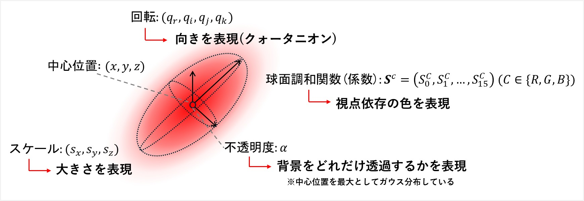

こうした性質を持った楕円体を空間に大量に配置することで、物体・空間を表現します。
どのように配置するかは、表現したい物体・空間を撮影した動画像をもとに決定されます。

## ワークフロー
1. **撮影**：対象(物体・空間)の写真を撮影する
2. **点群作成**：撮影した写真から、点で表現されたおおまかな3次元形状(点群)を計算する
3. **3DGS作成**：作成した点群をもとに3DGSを計算する(点群を「骨」とすると「肉付け」のイメージ)
4. **編集**：作成した3DGSを編集して仕上げる

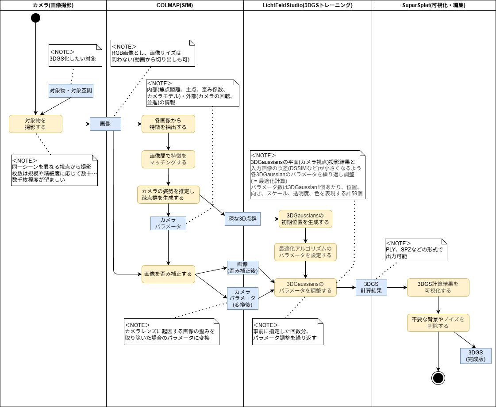

---

### 1. 撮影
以下のような花束を対象物とします。
撮り方のコツは対象物の全周を上下のアングルで隈なく撮影することです。
最終的な3DGSの解像度を上げたければ近距離や光学ズームで撮影した画像を含めるのもよいです。
今回の撮影枚数は全部で204枚となりました。

撮影条件は以下としました。
- カメラ：iPhone16 Pro
- 焦点距離：24mm(固定)
- 解像度：24MP(2400万画素)
- 露出：0.0(デフォルト設定)
- フラッシュ：なし(室内照明のみ)

:::info:豆知識
焦点距離や解像度が異なる画像を混ぜてもOKです。
:::

---

### 2. 点群作成
Structure from Motion(以下 SfM)という手法を用いて、撮影した画像から元の3次元物体・空間を再構成していきます。これは各画像の特徴点を抽出し、画像間でマッチングをすることで3次元空間内のどの位置に何があるかを推定する技術です。この処理のアウトプットとして、RGB情報を持つ3次元点群が出力されます。SfMを利用できるアプリケーションは様々ありますが、今回は簡単に実行できるOSSの[COLMAP](https://github.com/colmap/colmap/releases)を使用します。またCOLMAPの詳細設定に詳しくは触れず、基本的にデフォルト値を用いるものとします。

 

1. [COLMAP](https://github.com/colmap/colmap/releases)の最新版をダウンロードし、解凍(執筆時の最新版は3.13.0)
 

2. 解凍したフォルダ内の"COLMAP.bat"をクリックするとCOLMAPのGUI画面が立ち上がる

    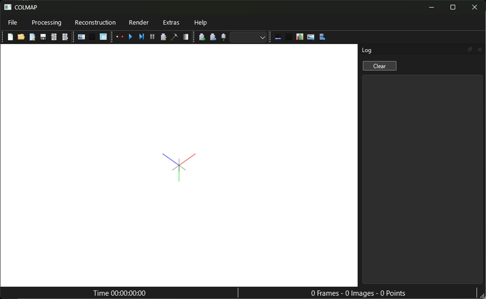
 

3. 左上メニューの"File" -> "New project"を選択し、プロジェクトを新規作成する
 

4. データベースファイルのパスと点群の元となる画像が格納されたディレクトリのパスを設定し、保存する(①～③の順で実施)

    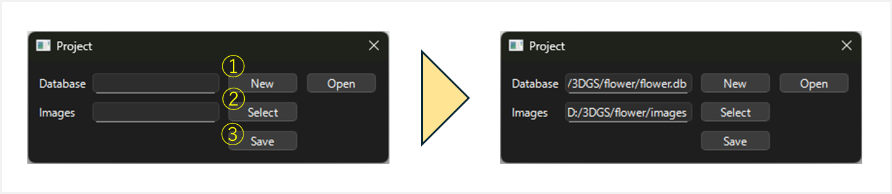
 

5. 左上メニューの"Processing" -> "Feature extraction"から以下の項目(①,②)を実施後、"Extract"(③)で各画像の特徴点を抽出する(今回はデフォルト設定)

    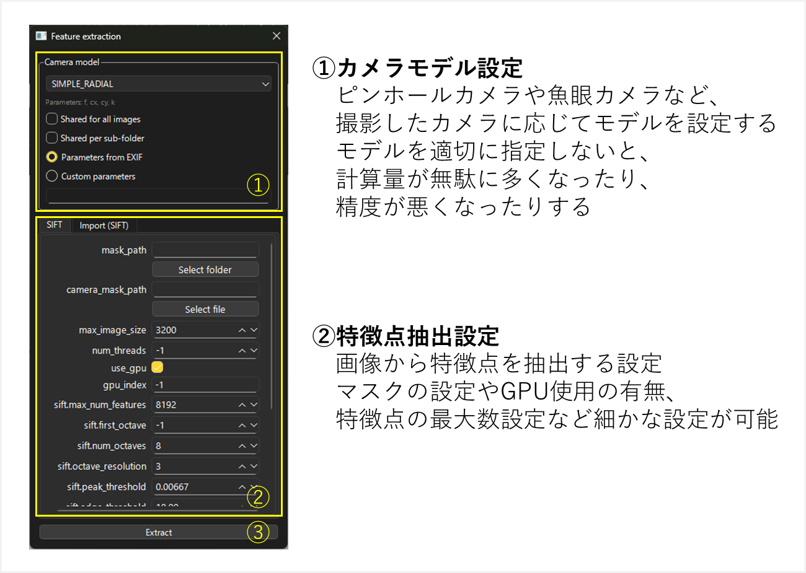
 

6. 処理完了("Extracting..."のダイアログが出なくなる)まで待機する
 

7. 左上メニューの"Processing" -> "Feature matching"から設定を実施後、"Run"(②)で画像間の特徴点マッチングを実行する(今回はデフォルト設定)

    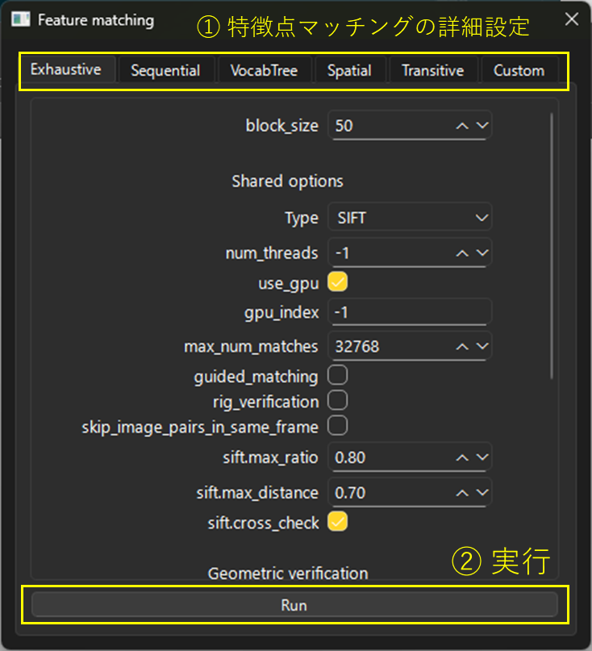
 

8. 処理完了("Matching..."のダイアログが出なくなる)まで待機する
 

9. 左上メニューの"Reconstruction" -> "Start reconstruction"を選択し、特徴点マッチング結果からRGB情報を持つ3次元点群を生成する

    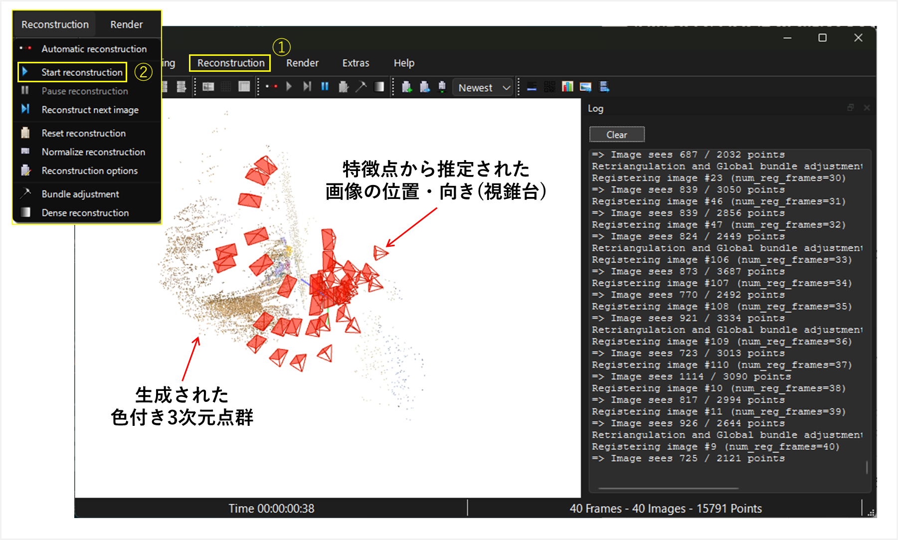
 

10. 左上メニューの"Extras" -> "Undistortion"を選択し、カメラレンズによる歪みを除去した画像を生成する
    - "Select folder"から出力を保存するフォルダを作成・指定しておくこと
    - ここでは入力画像と同じ階層に"dense"という名前のフォルダを作成する

    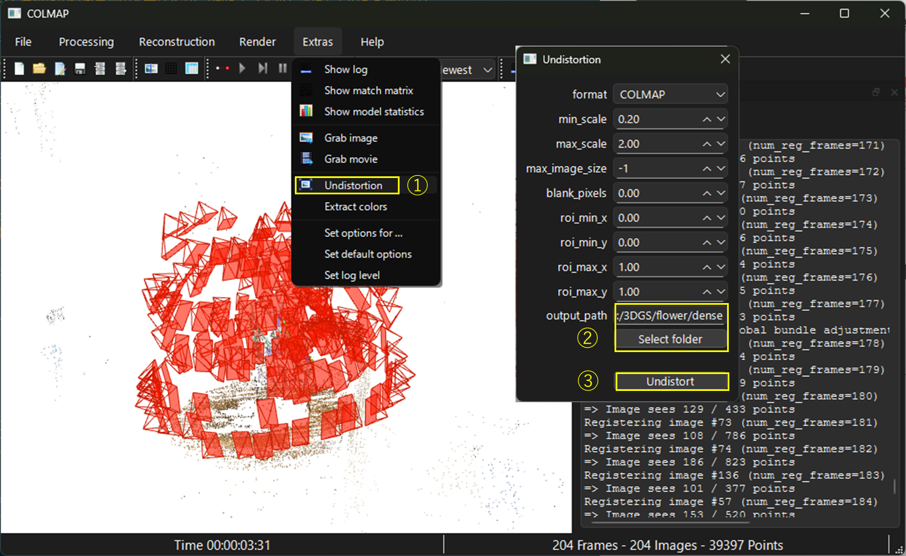
 

11. 処理完了("Undistorting..."のダイアログが出なくなる)まで待機する
 

12. 作成・指定したフォルダ内に出力画像等が生成されていれば完了
 

---

### 3. 3DGS作成
いよいよメイン工程です。COLMAPで作成した3次元点群や歪み補正した画像を用いて3DGSを作成していきます。本工程ではOSSの[LichtFeldStudio](https://github.com/MrNeRF/LichtFeld-Studio/releases)を使用します。LichtFeldStudioについてもCOLMAPと同様、設定可能なパラメータは数多いですが、今回は詳細設定に詳しく触れず、基本的にデフォルト値を用いるものとします。

 

1. [LichtFeldStudio](https://github.com/MrNeRF/LichtFeld-Studio/releases)の最新版をダウンロードし、解凍(執筆時の最新版は0.41)
 

2. 解凍したフォルダ内の"bin -> LichtFeld-Studio.exe"をクリックするとGUI画面が立ち上がる
    - 中央のプルダウンから言語を日本語などに変更可能

    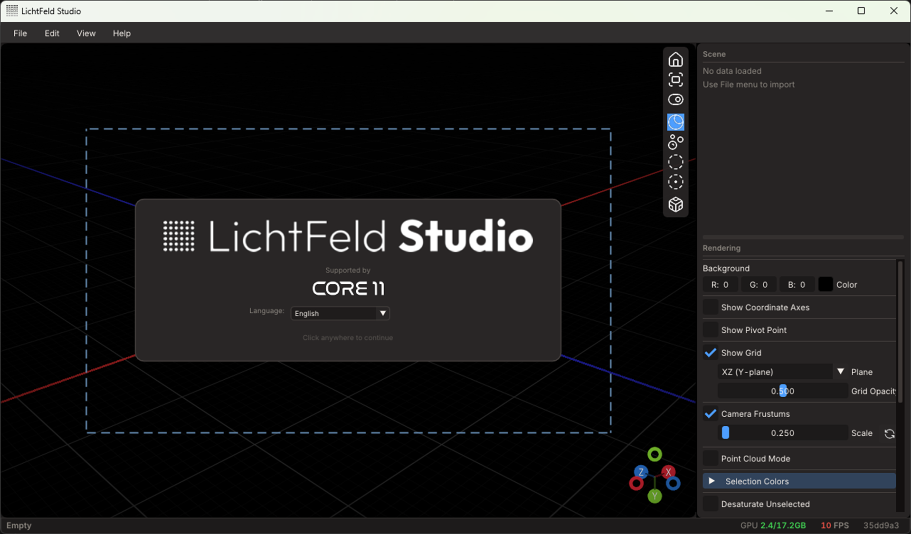
 

3. アプリケーションウィンドウ内の任意の場所をクリックすると、以下のように画面が切り替わる

    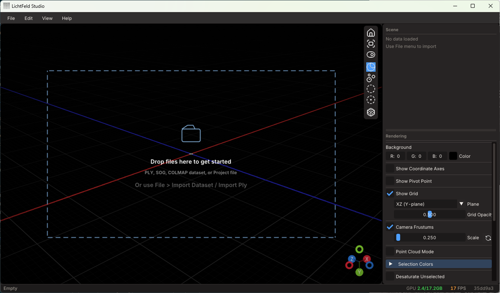
 

4. COLMAPの出力(今回は"dense")をフォルダごとドラッグ&ドロップすると、以下の画面が表示されるため、Outputの場所を確認し、"Load"ボタンを押す

    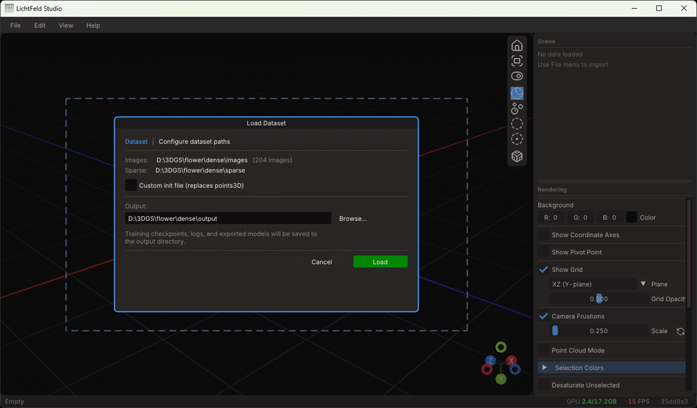
 

5. COLMAPで生成した3次元点群と画像の位置・向きを表現した視錐台(Frustum)が表示される

    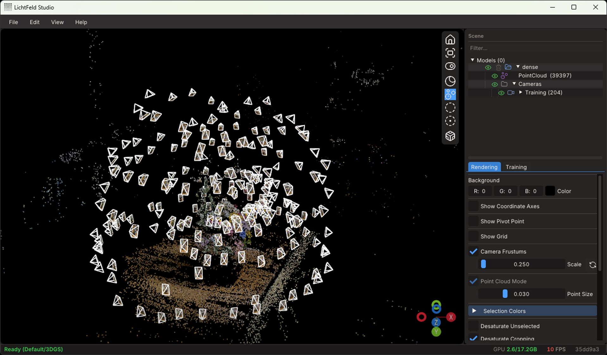
 

6. ウインドウ右の"Training"タブをクリックし設定パラメータを確認後、"Start Training"を押す\
    以下に主要な設定パラメータを示しています。
    - Iterations：繰り返し計算の回数
    - Max Gaussians：3次元ガウス分布の最大個数
    - SH Degree：球面調和関数の次数(小さいほどパラメータ数が減る)

    いずれも数値が大きいほど高品質のものができやすい反面計算量が多くなるため、その他の設定パラメータも含め、試行錯誤が必要な場合があります。

    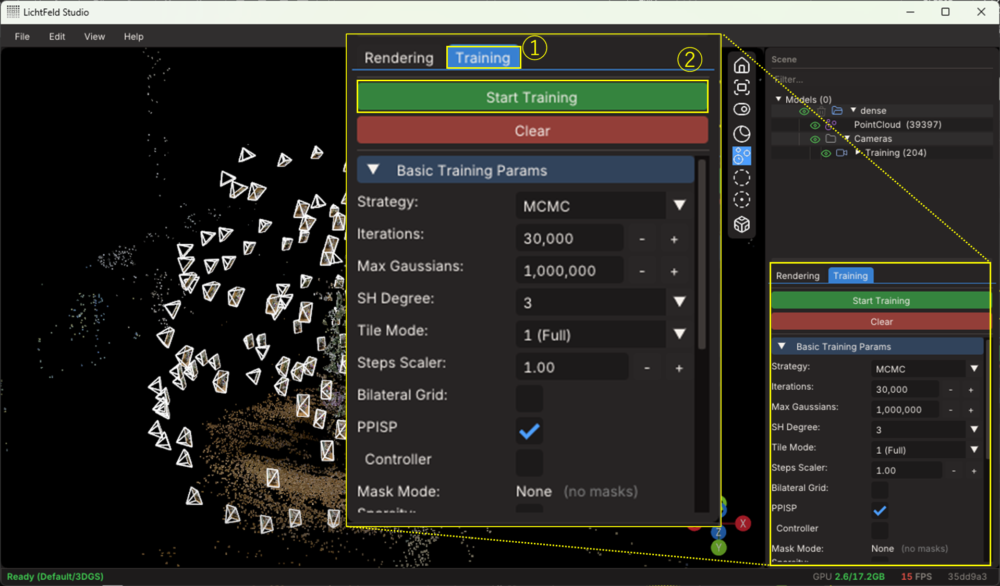

    以下はトレーニング中の様子。

    - COLMAPの点群を初期値として、点(=3次元ガウス分布の中心)の数を増やしたり、移動させたりしている(10倍速、点群表示モード)

        

    - 各点を中心とした3次元ガウス分布を生成し、パラメータを調整している(10倍速)

        
 
    
7. "Training Complete"のダイアログが表示されるまで待機する

    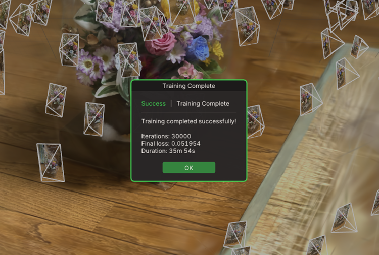
 

8. "File" -> "Export..."を選択し、作成した3DGSをファイルに保存できれば完了

    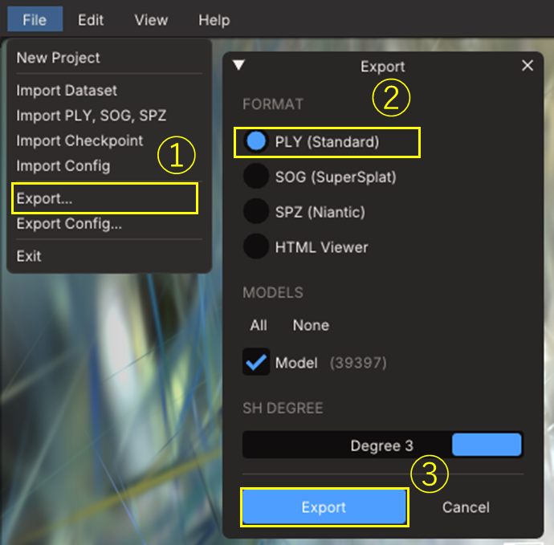
 

---

### 4. 編集
作成した3DGSをキレイに仕上げていくフェーズです。
特に手を加えなくても3DGSの品質が十分と判断した場合は省略してもOKです。
ただ一般的には背景の解像度が低かったり、対象物の周囲などに意図していないモヤのようなもの(フローター)が浮かんでいることが多いため、それらを処理すると3DGSの見栄えがさらに良くなります。また、レンダリング速度の向上やファイルサイズの軽量化にもつながります。このような3DGSの編集に[SuperSplat](https://superspl.at/editor)を使用します。

 

1. [SuperSplat](https://superspl.at/editor)にアクセスする

    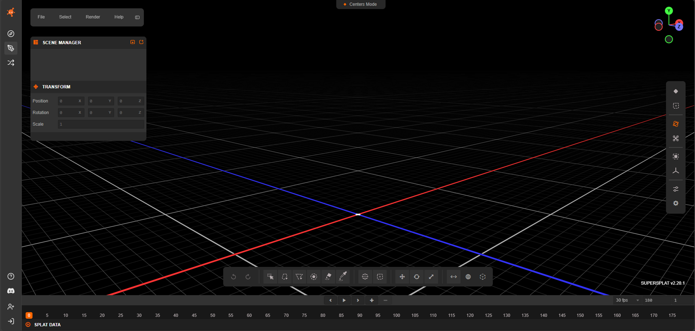
 

2. SuperSplatを表示したブラウザ画面に、作成した3DGSファイルをドラッグ&ドロップしてインポートする

    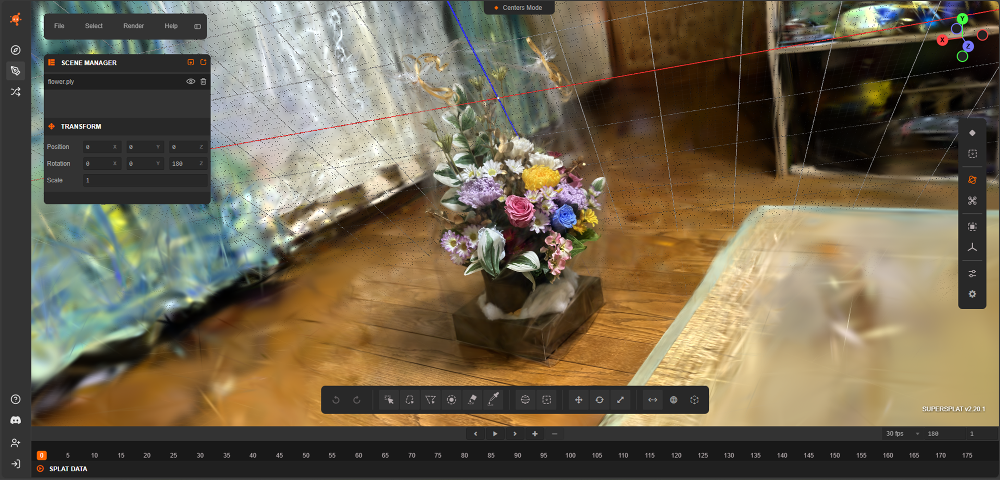
 

3. インポートした3DGSを編集する

    - 原点位置と座標系の向きを変更する
        インポート時にはワールド座標系の原点が意図しない位置・向きになっていることが多く、編集の際に不便となることがあります。そこでまず並進移動と回転のツールを用いて対象物とワールド座標系の位置・向きを合わせます。

        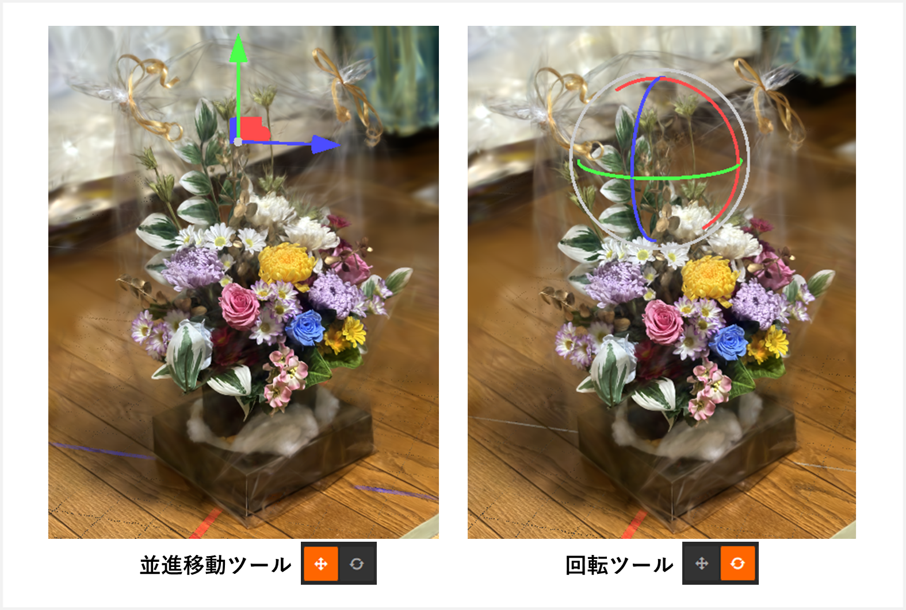
        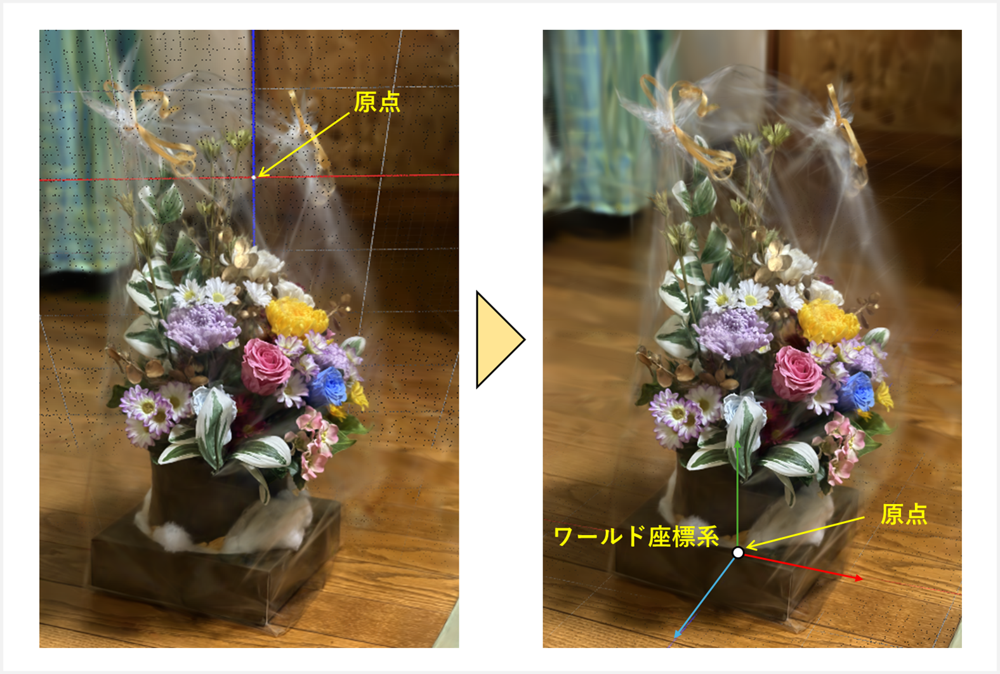

    - 対象物の背景を領域選択して削除する
        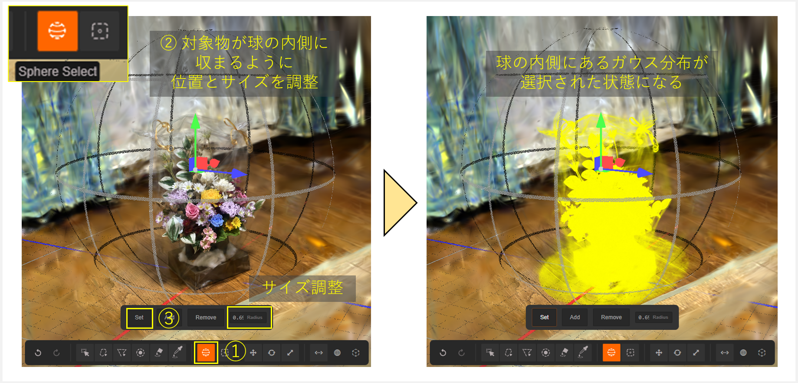
        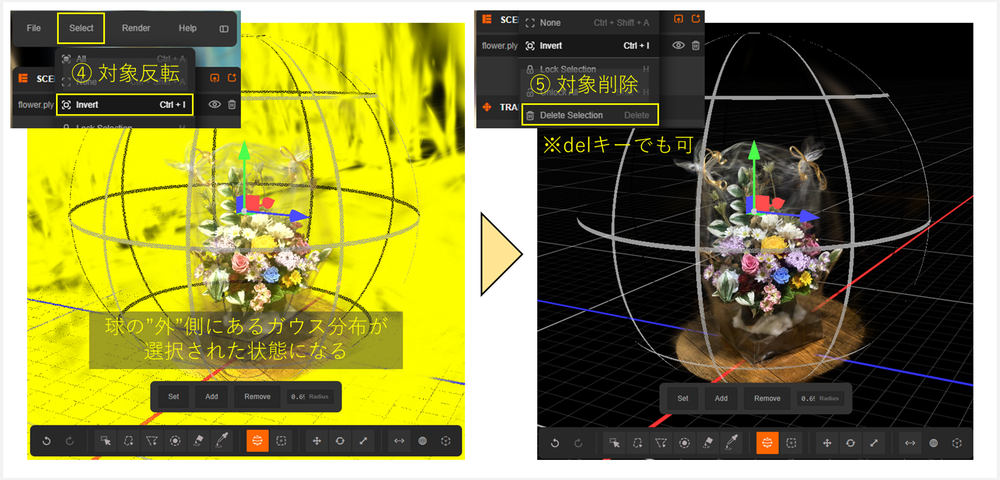

    - 不要なガウス分布を個別に選択して削除する
        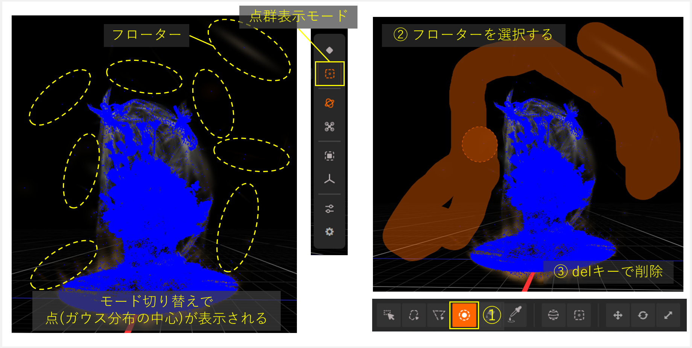
 

4. 編集した3DGSを保存する

    
 

---

## おわりに
今回は3次元物体・空間をデジタルでリアルに再構成する技術である3DGSを、無料かつ高解像度で作成する手順に焦点を当てました。今後は技術的な深堀や3DGSの課題、最新研究を解説していきたいと思います。

## おまけ

本編におけるアプリケーションは今のところすべて無料ですが、環境構築の手間とGPUが必須のため、お手軽かと言われると微妙なところなのが正直なご感想かと思います。そこで他の選択肢も用意しました。
- 有料でもいいからもっと簡単に作りたいなら...[Postshot](https://www.jawset.com)
- スマホだけでお手軽にササッと作りたいなら...[Scaniverse](https://scaniverse.com)

| |手軽さ|表現できる解像度|パラメータ自由度|GPU|備考|
|----------|:---:|:---:|:---:|:---:|-------------------------------|
|COLMAP+LFS| △  |〇~◎ |◎   |必須 |無料、細かなチューニングができる  |
|Postshot  | 〇  |〇~◎ |〇   |必須 |有料、高品質な3DGSが簡単に作成可能|
|Scaniverse| ◎  |△~〇 |△   |不要 |無料、スマホのみで作成可能        |

ただし今回ご紹介したLichtFeldStudioは、本記事を執筆した2026年1月現在開発が盛んに行われており、手軽さや機能の向上が今後見込まれます。

[^1]:[3D Gaussian Splatting for Real-Time Radiance Field Rendering](https://arxiv.org/pdf/2308.04079)