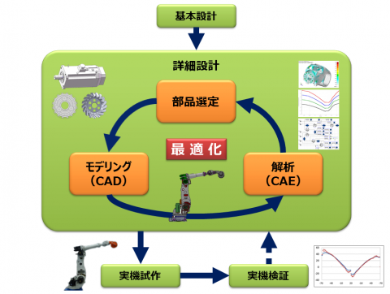

# はじめに

豆蔵は2013年よりロボットシステム開発の支援およびコンサルティングを行っています。
もともとソフトウェアの開発が強みの会社ですが、メカやエレキも含めた総合的な支援を行っています。

Beanusはこれまで培った知見をもとに生まれた豆蔵のオリジナルロボットです。
Bean（豆）とVenus(ヴィーナス)からとってBeanusと名付けられました。
BeanusシリーズはBeausとBeanus2の2機種があります。Beanusシリーズは製品ではなく、あくまで豆蔵のロボット開発の技術をアピールするために生まれたロボットです。

本記事では、豆蔵のオリジナルロボットであるBeanusシリーズの紹介をします。

# Beanus

2017年、東京農工大学との共同研究により、産業用ロボットアームの開発期間を短縮する設計手法の実用化を実現しました。弊社の持つソフトウェア技術、モデルベース開発プロセスと、東京農工大学 工学研究院 先端機械システム部門 遠山茂樹教授のロボット工学の知識とを融合し、少ない試作回数で競争力のある産業用ロボットを市場に出すための設計手法を確立しました。

Beanusは、この設計手法を適用し、デモ用の試作機として短期間（８ヶ月）で開発されたロボットです。
特徴としては関節が7軸で構成される垂直多関節ロボットであることが挙げられます。一般に垂直多関節ロボットは6軸の構成が多いですが、7軸の構成とすることで障害物を回り込んでアプローチすることが可能であり、狭い空間でも動くことができます。
7軸ロボットの動作を実現している制御コントローラと操作端末であるペンダントのソフトウェアは豆蔵でイチから作っています。

以下は、Beanusを初めて展示会（2017年 国際ロボット展）に出展した時の動画です。Beanusがジュースを作り、来場者に提供するデモを行いました。

<iframe width="560" height="315" src="https://www.youtube.com/embed/yB6r_LOnhLs?si=FQ0Zn52biMBjGLuj" title="YouTube video player" frameborder="0" allow="accelerometer; autoplay; clipboard-write; encrypted-media; gyroscope; picture-in-picture; web-share" allowfullscreen></iframe>

他にも様々なデモを行い、展示会に出展しています。
ネクストスケープ社が開発したアプリケーションと連携して、「Holo-Teach ホロティーチ ～ホログラフィック ロボット遠隔操作～ 」のデモを展示しました。Microsoft HoloLensを装着し、目の前に現れるホログラムを操作する事で、実体のロボットに指示を出して、ゴミを分別して、くずかごに捨てるデモを行いました。

<iframe width="560" height="315" src="https://www.youtube.com/embed/J130rFdeh48?si=A6Po3xPAGjgzkSbD" title="YouTube video player" frameborder="0" allow="accelerometer; autoplay; clipboard-write; encrypted-media; gyroscope; picture-in-picture; web-share" allowfullscreen></iframe>

# Beanus2

Beanus2は三井化学、ニデックドライブテクノロジー（旧　日本電産シンポ）、豆蔵の3社で共同研究開発したロボットです。Beanusシリーズの特徴である「7軸協働ロボット」、「自社開発した高性能コントローラ」や「市販タブレットを利用した直感的なペンダント」のコンセプトはそのままに、新たに以下の特徴を備えました。

### フレームの樹脂化
三井化学の樹脂成型技術により、ロボットのフレームの大部分を樹脂化し、金属製と比べて重量を最大で1/2にまで軽くできています。金属との接合が必要な箇所には金属樹脂一体成型技術を使用し、樹脂でありながらも高い剛性を実現しました。軽量化により、衝突時の衝撃力の低減、可搬重量の増加、省電力化などが期待できます。

### 高バックドライバビリティ減速機の搭載
一般的な減速機を採用すると外力をモータ電流値から検出することが困難であるため関節毎にトルクセンサを搭載することが多いです。日本電産シンポの高効率・低摩擦な高バックドライバビリティ減速機を採用することで、モータ電流値から高精度に外力を推定することができています。

### センサレスによる力制御
力制御を行うには各関節に掛かるトルクを高精度に推定する必要があります。
高バックドライバビリティ減速機を使うことで、高精度にトルクを推定することができます。センサレスでトルクを推定するには重力や慣性、摩擦による影響を高精度に推定する必要があります。この推定を豆蔵の技術で実現しています。
また外力に応じてロボットを柔らかく動かす制御も豆蔵の技術によって実現しています。

以下は、センサレス力制御を応用して、作業者が直接ロボットを手で動かすダイレクトオペレーション機能のデモ動画です。
<iframe width="560" height="315" src="https://www.youtube.com/embed/Wx6d8uE_IKo?si=okAzrx7xYsZC7jg-" title="YouTube video player" frameborder="0" allow="accelerometer; autoplay; clipboard-write; encrypted-media; gyroscope; picture-in-picture; web-share" allowfullscreen></iframe>

センサレスでの力制御が難しいのは、ロボットで多く使われる波動歯車減速機は摩擦の影響が主な理由です。摩擦のモデル化が難しく、トルクを高精度に推定することが困難です。そのため、摩擦のモデル化が難しいところは、不感帯処理など摩擦の影響を無視する方策を採ることが多いです。この不感帯が大きいと小さなトルクを検出できず、力制御の性能が落ちてしまいます。一方で、高バックドライバビリティ減速機を使うことで摩擦の影響を受けにくくなるため、不感帯の範囲を小さくでき、センサレスでも小さなトルクを検出することが可能となります。動画のように軽い力でロボットを動かすことができるのです。

また、Fogale Robotics社の外装センサと組み合わせて、ロボットが人に近づいたときに非接触で衝突を回避するデモも行っています。外装センサは静電容量式のセンサで導電物体との距離を計測することができます。距離情報から衝突を回避する制御を豆蔵で実現しています。

<iframe width="560" height="315" src="https://www.youtube.com/embed/z-rUd-ylx58?si=Cv33SeoRFQEre0Un" title="YouTube video player" frameborder="0" allow="accelerometer; autoplay; clipboard-write; encrypted-media; gyroscope; picture-in-picture; web-share" allowfullscreen></iframe>

協働ロボットにおいて，人の安全を確保するために接触時に停止させることが一般的ですが、高速運転下では接触を検出した瞬間の衝撃力が大きく、安全性が担保できません。そのため、人との協働時には動作速度を制限して運用することが一般的です。一方で、外装センサを使う場合には接触する前に反応して停止や回避動作ができるので、接触を検出する場合と比べて速度制限の緩和が可能で、安全性と高速動作の両立が期待できます。

# おわりに 

本記事では豆蔵のオリジナルロボットであるBeanusとBeanus2について紹介しました。
Beanusで実現してきた「7軸ロボット制御」や「センサレス力制御」、「非接触衝突回避」などの要素技術について触れましたが、詳細は紹介できませんでした。別の記事で、これらの技術について詳しく紹介していきたいと思います。