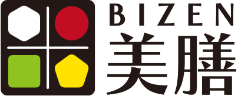
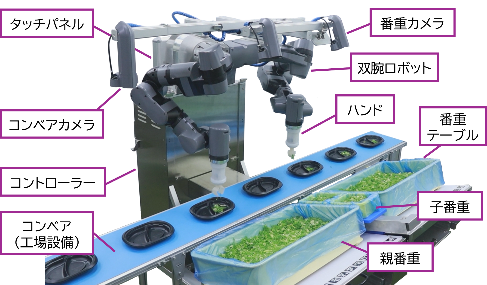
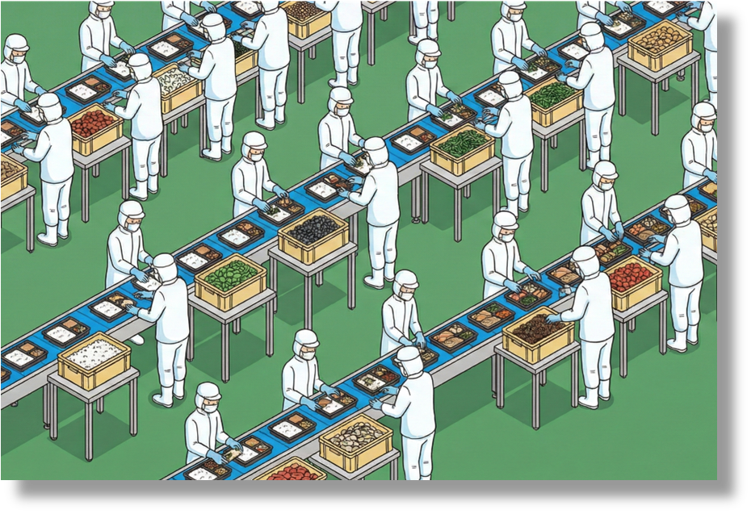
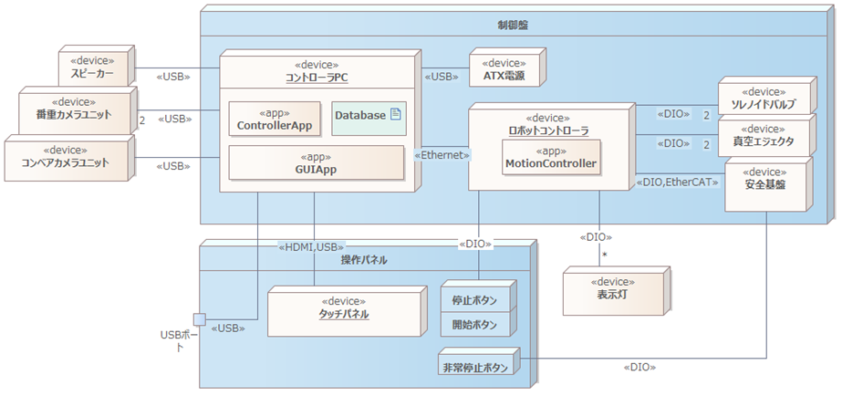
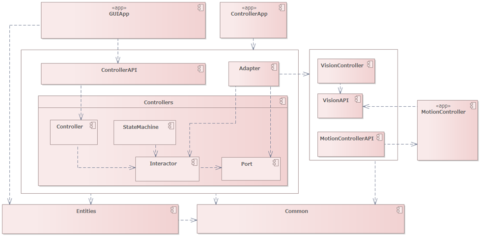

少し公開が遅くなってしまいましたが、これは[豆蔵デベロッパーサイトアドベントカレンダー2025](/events/advent-calendar/2025/)第15日目の記事です。

# はじめに

豆蔵は長年にわたり、ロボットシステム開発の支援およびコンサルティングを行ってきました。
オリジナルロボット「BEANus」シリーズなどで培ってきた技術力は、単なるメカニクスの制御にとどまらず、高度なソフトウェア技術との融合にあります。

今回、三井化学株式会社と共同開発した中食（なかしょく）工場向け食品盛り付けロボット美膳®（びぜん）は、まさにその結晶です。
詳細なプレスリリースは[こちら](https://mamezo.tech/n/11061/)をご覧ください。

私は、主にソフトウェアアーキテクトとして美膳®の開発に携わりました。
今回、ロボット開発では珍しいクリーンアーキテクチャ（Clean Architecture）を採用し、ドメイン中心設計を実現しました。
本記事では、食品盛り付けロボット美膳®の紹介と、それを支えるソフトウェアアーキテクチャについて紹介します。

---

  

---

# 美膳®の紹介

美膳®は、中食業界で深刻化する労働力不足を解消するために開発された、食品盛り付けロボットシステムです。
豆蔵がシステム設計、メカ・エレキ設計、そしてAI・ビジョン・モーションを含むソフトウェア開発を担当し、三井化学が高機能樹脂素材の提供やロボットハンドの開発、製造・販売を担当するという、両社の強みを活かした共同開発によって生まれました。

### 美膳®が解決したい社会課題

下図に示すように、中食工場では多くの盛り付け作業が人手で行われており、労働力不足や人件費高騰が深刻な問題となっています。
このような背景から、盛り付け工程の自動化が強く求められています。

*画像提供：株式会社豆蔵*

### 美膳®で出来ること

美膳®は、弁当や惣菜の盛り付け作業を自動化します。
具体的には、以下のような高度な作業を高速かつ正確に行います。

- **食材の認識とピッキング**: 番重（食材コンテナ）内にランダムに置かれた食材を、AIビジョンで瞬時に認識し、最適な把持位置を判断してピッキングします。
- **容器への追従盛り付け**: ベルトコンベア上を流れる容器の位置・姿勢・速度をカメラを使ってリアルタイムに認識し、ロボットアームが追従しながら正確な位置に食材を盛り付けます。
- **双腕による協調動作**: 左右のアームが互いの状況をリアルタイムに共有し、上流での作業漏れを下流でカバーしたり、作業負荷を分散させたりするなど、双腕ならではの柔軟な連携により生産性を最大化します。

### 特徴

美膳®には以下の大きな特徴があります。

#### 1. 業界最速レベルの生産性
中食工場での人の作業スピードは1時間あたり約2,000食と言われていますが、美膳®はこの人の作業と同等の生産能力（2,000食/時）を実現しました。従来の盛り付けロボットの多くが1,200食/時程度であったのに対し、大幅な生産性向上を達成しています。

#### 2. 迅速な段取り替え
多品種少量生産が求められる中食工場では、頻繁なライン変更が必要です。美膳®はキャスター付きで移動が容易であり、ロボットハンドも簡単に交換できる設計になっています。これにより、生産品目が変わっても短時間でラインを切り替えることができます。

#### 3. 軽量・コンパクト
三井化学の高機能樹脂素材を採用することで、軽量化と高剛性を両立しました。また、双腕ロボットでありながら小型化を実現しており、既存の盛り付けラインの限られたスペースにも導入しやすくなっています。

#### 4. 人との協働
非接触の外装センサーを搭載することで、人が近づくと自動で減速・停止する機能を備える予定です。これにより、安全柵なしで人とロボットが同じ空間で作業することが可能になります。

:::info
※本機能は現在開発中であり、現行品には搭載されていません。
:::

# ソフトウェアアーキテクチャの紹介

私はソフトウェアアーキテクトとして、この美膳®の開発に携わりました。
よって、ここからはソフトウェアアーキテクチャの概要について説明します。

## 美膳®における設計思想

美膳®は単にメカが動くだけでなく、AIによる認識、複雑なモーション制御、そしてそれらを統合するシステム全体が高度に連携して動作しています。

このシステムの核となるのは、**「食品を認識し、把持し、盛り付ける」という「食品盛り付け業務（ドメイン）」** です。
このドメイン知識をシステムの中心に据え、特定のハードウェアといった技術的詳細に依存しない設計を目指しました。

アーキテクチャ設計においては、以下の点を重視しました。

- **ドメイン中心**: 「食品盛り付け」という業務ロジックを最重要視し、技術的詳細から分離すること
- **保守性**: 長期間にわたる運用と機能追加に耐えうる構造であること
- **テスト容易性**: ハードウェアに依存せず、ロジック単体でのテストが可能であること
- **独立性**: フレームワークやセンサ・インジケーターなどの外部要素への依存を最小限に抑えること

特に、独立性を重視した理由は、**美膳®には食品盛り付けロボットシステムのプラットフォームとしての役割**も期待されており、将来的に新しいセンサ技術などが登場した際に、容易に置き換えられる柔軟性が求められたためです。

以上より、次節で説明する**クリーンアーキテクチャ（Clean Architecture）** の思想を取り入れた設計を採用しました。

## クリーンアーキテクチャとは

クリーンアーキテクチャ（Clean Architecture）は、Robert C. Martin (Uncle Bob) 氏によって提唱されたソフトウェア設計思想です。
同心円状の図で表現されることが多く、外側から内側に向かってのみ依存関係を持つ「依存性のルール（Dependency Rule）」が最大の特徴です。

> The overriding rule that makes this architecture work is The Dependency Rule. This rule says that source code dependencies can only point inwards. Nothing in an inner circle can know anything at all about something in an outer circle.
>
> (出典: [The Clean Architecture | The Clean Code Blog](https://blog.cleancoder.com/uncle-bob/2012/08/13/the-clean-architecture.html))

このアーキテクチャにおいて、最も内側に位置するのは「エンティティ（Entities）」や「ユースケース（Use Cases）」といった**ドメイン（ビジネスロジック）** です。
データベースやWebフレームワーク、UI、そしてロボットにおけるデバイスといった詳細な技術要素は、すべて外側に配置されます。

つまり、**「ドメインが詳細（インフラ）に依存するのではなく、詳細がドメインに依存する」** という構造を作ることが、クリーンアーキテクチャの核心です。
これにより、技術の流行り廃りやハードウェアの変更といった外的要因から、システムの核となるビジネスロジックを守ることができます。

## 具体的な設計の紹介

### システム物理配置

システムの物理配置図を以下に示します。

ステレオタイプ\<<app\>>の要素がソフトウェアの実行単位となります。
よって、以下の3つが主要なソフトウェアの実行単位となります。

<table width="100%">
  <colgroup>
    <col style="width: 20%" />
    <col style="width: 80%" />
  </colgroup>
  <thead>
    <tr>
      <th>名前</th>
      <th>説明</th>
    </tr>
  </thead>
  <tbody>
    <tr>
      <td><strong>GUIApp</strong></td>
      <td>GUIを有するアプリケーションである。ユーザ向けのGUIを提供する。コントローラPC上で実行され、操作パネルのタッチパネル上に表示される。</td>
    </tr>
    <tr>
      <td><strong>ControllerApp</strong></td>
      <td>本システムのコアアプリケーションである。機能的にはシステムの状態制御や登録データの管理、画像処理を行う。 その手段として、コントローラPCに接続されたデバイスの制御、Databaseの操作を行う。 また、GUIAppから接続可能なサーバー機能を有する。また、生産運転中に限り、画像処理結果を供給するビジョンサーバー機能を有する。</td>
    </tr>
    <tr>
      <td><strong>MotionController</strong></td>
      <td>ロボットモーション制御を主に担うアプリケーションである。また、DIO接続デバイスや安全基盤との結合も担う。モーション制御に関する機能を持つサーバー機能を有し、ControllerAppがクライアントとして接続される。また、生産運転実行中はControllerAppのビジョンサーバーに接続し、画像処理結果を取得する。</td>
    </tr>
  </tbody>
</table>

:::info
**GUIAppとControllerAppが何故別々の実行単位なのか**

非機能要件で将来的に操作パネルをタブレット端末など別デバイスに変更する可能性があるため、GUI部分を分離している。
:::

:::info
**コントローラPCとロボットコントローラが分かれている理由**

PoC段階でロボットコントローラとして[KEBA社](https://www.keba.com/jp/home)のコントローラを使用していたため。
:::

### コンポーネント構成

美膳®のソフトウェアコンポーネント設計について解説します。
全体は、クリーンアーキテクチャのように同心円の表記ではありませんが、同様の思想に基づいて設計されています。
クリーンアーキテクチャの同心円にて中心方向に依存が向かうのと同様に、依存方向は下に向かっており、下層にはEntitesやInteractorなどのドメインロジックが配置されています。

<table width="100%">
  <colgroup>
    <col style="width: 20%" />
    <col style="width: 80%" />
  </colgroup>
  <thead>
    <tr>
      <th>コンポーネント</th>
      <th>説明</th>
    </tr>
  </thead>
  <tbody>
    <tr>
      <td><strong>ControllerApp</strong></td>
      <td>関連コンポーネントを結合し、実行可能にするアプリケーションコンポーネント。</td>
    </tr>
    <tr>
      <td><strong>ControllerAPI</strong></td>
      <td>外部（GUIAppや上位システム）との通信を担うAPI層。</td>
    </tr>
    <tr>
      <td><strong>Adapter</strong></td>
      <td>外部サービス(ビジョン・モーションなど)の実装コンポーネント。</td>
    </tr>
    <tr>
      <td><strong>Controllers</strong></td>
      <td>メインのビジネスロジックを束ねるコンポーネント。</td>
    </tr>
    <tr>
      <td><strong>Controller</strong></td>
      <td>ユースケース（Interactor）を統合・制御するコンポーネント。一般的なクリーンアーキテクチャのController（Interface Adapters）とは異なり、ここでは複数のInteractorを束ねる「アプリケーションサービス」に近い役割を担う。</td>
    </tr>
    <tr>
      <td><strong>StateMachine</strong></td>
      <td>システムの状態遷移を管理するコンポーネント。Interactorで実現される機能に対して横断的にシステム状態遷移を実現する。</td>
    </tr>
    <tr>
      <td><strong>Port</strong></td>
      <td>Adapterのインターフェース定義コンポーネント。外部サービスのインターフェースとなる。</td>
    </tr>
    <tr>
      <td><strong>Interactor</strong></td>
      <td>ユースケースに応じたビジネスロジックフロー(機能)を実現する中心的なコンポーネント。</td>
    </tr>
    <tr>
      <td><strong>Entities</strong></td>
      <td>ドメインモデルやデータ構造を定義するコンポーネント。</td>
    </tr>
    <tr>
      <td><strong>VisionController</strong></td>
      <td>画像処理関連機能を有するコンポーネント。</td>
    </tr>
    <tr>
      <td><strong>VisionAPI</strong></td>
      <td>画像処理機能を外部に提供するAPI。</td>
    </tr>
    <tr>
      <td><strong>MotionControllerAPI</strong></td>
      <td>MotionControllerの機能を外部に提供するAPI。REST APIによるMotionControllerへの指令送信や状態取得をラップする。</td>
    </tr>
    <tr>
      <td><strong>Common</strong></td>
      <td>再利用性の高い共通で使用される汎用的なコンポーネント群。ロギング、数値計算、スレッド制御などの機能を集約している。</td>
    </tr>
  </tbody>
</table>

この構成における重要なポイントは、**Port (インターフェース) と Adapter (実装) の分離**です。

例えば、ビジョンシステムやモーション制御といった外部要素は、Portコンポーネントで定義されたインターフェースを通じてのみアクセスされます。
実体である Adapterは、このインターフェースを実装する形で提供されます。
これにより、Interactorなどのビジネスロジックは、具体的なカメラの機種やロボットコントローラの通信プロトコルを知る必要がなくなります。

結果として、ビジネスロジックが分離され、ハードウェアの変更が容易になり、テストの効率化と保守性の向上を実現しています。

# おわりに

今回は、中食工場向け盛り付けロボット美膳®の概要と、その裏側にあるソフトウェアアーキテクチャについてご紹介しました。

ロボット開発はハードウェアとソフトウェアが密接に関わるため複雑になりがちですが、適切な設計パターンを適用することで、もっと楽しく、効率的に開発できるようになります。
この記事が、日々ロボット開発に奮闘されているエンジニアの皆さんのヒントになれば嬉しいです。

豆蔵では、こうしたモダンな設計思想を取り入れたロボット開発を推進しています。
「ちょっと話を聞いてみたい」「ウチのロボットも何とかして」という方は、ぜひお気軽にご連絡ください。

