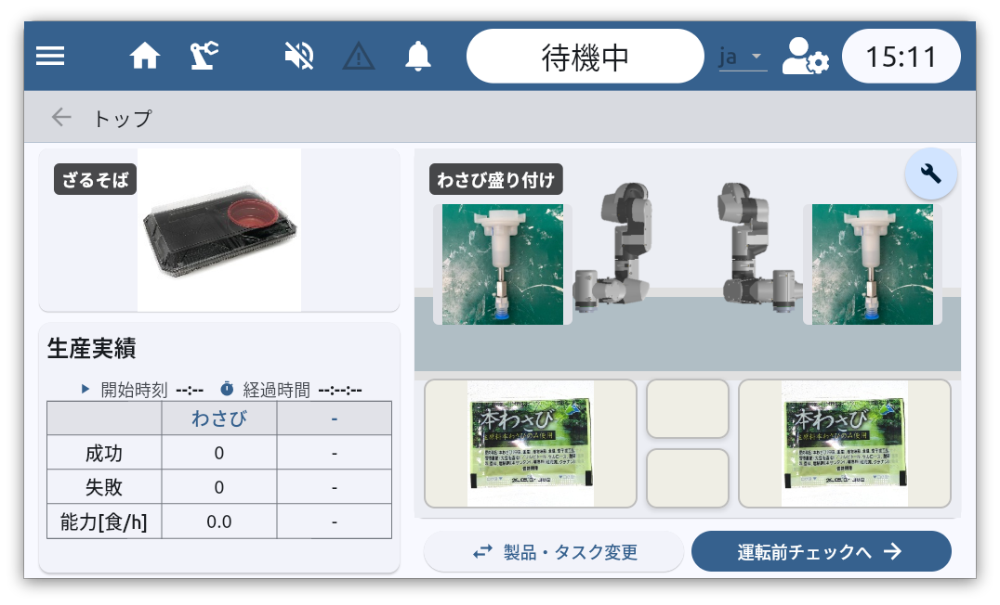
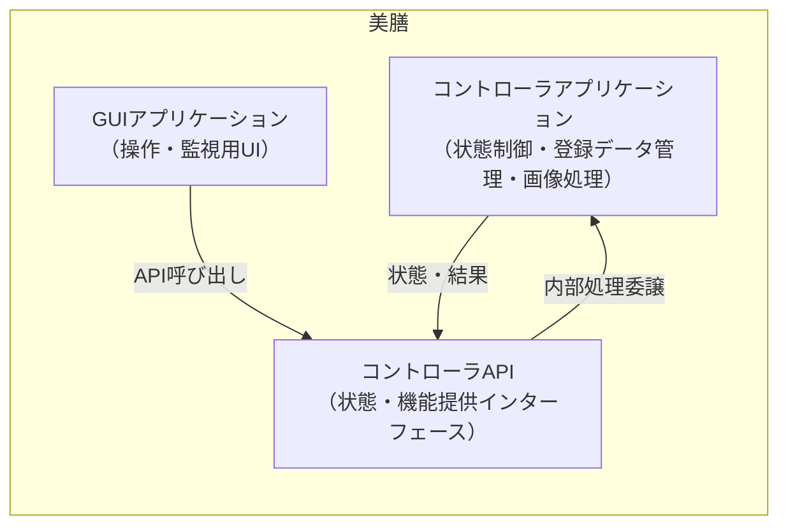
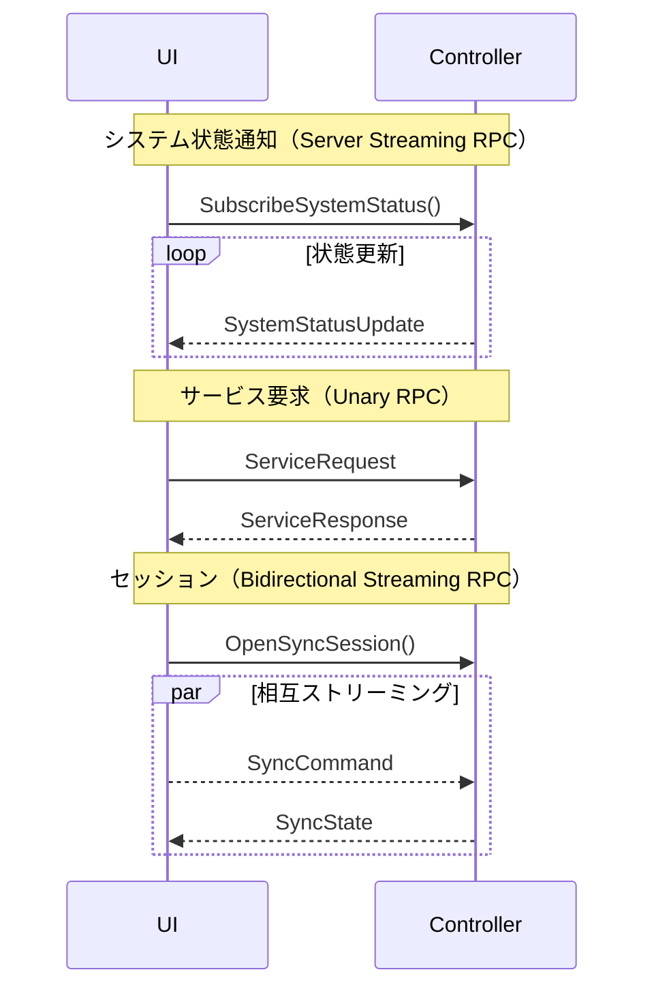
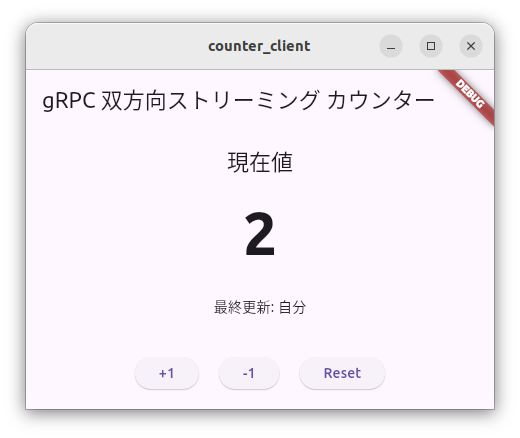
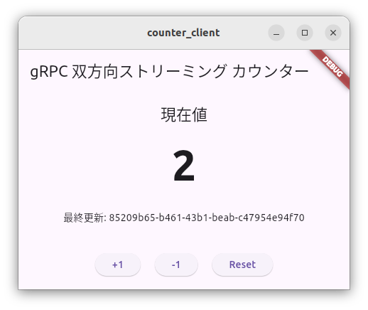

# はじめに

ロボットや製造装置のソフトウェアでは、ユーザーインターフェースと装置制御ロジックの設計が重要になります。特に装置の操作パネルは、装置の状態を分かりやすく表示するとともに、安全に操作を行えるインターフェースである必要があります。

食品盛り付けロボット「美膳®」は、製品製造の現場でエンドユーザーが装置の機能を利用できるように設計されたロボットシステムです。美膳®の本体には、システムを操作するための専用の操作パネルが用意されています。

本記事では、美膳®のUI設計を例として、次の内容を紹介します。

* 装置UIのソフトウェアアーキテクチャ
* Flutterを利用したGUI実装
* gRPCによるコンポーネント間通信
* 双方向ストリーミングを用いたリアルタイム通信

---

# 美膳®のソフトウェアアーキテクチャ

## システム構成

美膳®のソフトウェアは、役割ごとに分離された複数のコンポーネントによって構成されています。それぞれのコンポーネントが明確な責務を持つことで、システム全体の保守性と拡張性を高めています。

主なコンポーネントは次の3つです。

* **GUIアプリケーション**
  ユーザー操作の入口となるアプリケーションです。装置の状態表示や操作入力を担当し、直接コアロジックにはアクセスせず、必ずAPIを経由して操作を行います。

* **コントローラAPI**
  コントローラアプリケーションの機能や状態を外部に公開するインターフェース層です。GUIなどの外部アプリケーションは、このAPIを通して装置の機能にアクセスします。

* **コントローラアプリケーション**
  美膳®の中核となるコンポーネントです。装置の状態制御、登録データ管理、画像処理などを担当します。



システム構成は次の図のようになります。



このように、GUIアプリケーションは直接コントローラアプリケーションにアクセスするのではなく、APIを介して通信する構造になっています。これにより、UIとコアロジックを独立して開発・保守することが可能になります。

---

# コンポーネント間通信

## gRPCによる通信

美膳®では、GUIアプリケーションとコントローラアプリケーションの通信に **gRPC** を採用しています。コントローラAPIはgRPCで実装されており、コントローラアプリケーションはgRPCサーバとして動作します。GUIアプリケーションはgRPCクライアントとして接続し、各種サービスを利用します。

この構成により、UIと制御ロジックを言語や実装に依存せず接続することが可能になります。

通信の用途は主に次の3つです。

### システム状態通知

GUIアプリケーションはサーバに接続している間、システムの状態更新を継続的に受信します。これは **サーバストリーミングRPC** によって実装されています。コントローラの状態変化に応じてGUIの表示が更新され、装置の状態とUIが常に同期されます。

### サービス要求

ユーザー操作によって発生する単発の処理要求は **Unary RPC** によって実装されています。GUIアプリケーションから要求が送信され、サーバから処理結果が応答されます。

### 同期セッション

リアルタイム性が必要な操作では **双方向ストリーミングRPC** を使用します。クライアントとサーバが同時にメッセージを送信できるため、リアルタイムな通信セッションを実現できます。

例えば次のような用途で利用されています。

* カメラ映像を確認しながらのパラメータ調整
* 運転開始前の確認操作
* ロボットの状態監視

通信の流れは次の図のようになります。



---

# Flutterについて

美膳®のGUIアプリケーションは、Googleが提供するUIフレームワーク **Flutter** を利用して実装されています。FlutterではDart言語を使用してアプリケーションを開発します。

Flutterはクロスプラットフォームのフレームワークであり、単一のコードベースから複数のOS向けのアプリケーションを生成できます。また、豊富なUIコンポーネントが提供されているため、操作パネルのようなGUIの開発を効率的に行うことができます。

さらに、Googleが提供する他の技術との親和性が高いことも特徴の一つです。

---

# gRPCについて

gRPCはGoogleが開発したオープンソースのRPC（Remote Procedure Call）フレームワークです。gRPCでは **Protocol Buffers（Protobuf）** を利用してAPIを定義し、データのシリアライズを高速に行うことができます。

ProtobufでAPIを定義することで、複数のプログラミング言語から同一のインターフェースを利用することが可能になります。そのため、Flutter（Dart）で実装されたGUIと、C++で実装されたコントローラアプリケーションのような異なる言語のシステムを容易に接続できます。

豆蔵では過去のロボット開発プロジェクトでもgRPCを利用した実績があります。

---

# 双方向ストリーミングによるリアルタイム通信の例

gRPCの双方向ストリーミングは、クライアントとサーバが同時にメッセージを送信できる通信方式です。この仕組みを利用することで、リアルタイム性の高いUI操作を実装できます。

ここでは、FlutterとgRPCを用いた簡単なサンプルアプリケーションを通して、双方向ストリーミングによるリアルタイム通信の仕組みを紹介します。

実際の美膳®では、Flutterで実装されたUIとC++で実装されたコアアプリケーションが通信していますが、ここでは理解を容易にするため、Dartでサーバとクライアントを実装したサンプルを作成します。

このサンプルでは、サーバが共有カウンターを管理し、複数のクライアントがカウンターの更新操作を送信できるアプリケーションを作成します。クライアントから送信された操作はサーバで処理され、その結果がすべての接続クライアントへリアルタイムに配信されます。

以降では、このサンプルアプリケーションの実装手順を紹介します。

---

# サンプルアプリケーション

## サンプルプロジェクトのディレクトリ構成

今回のサンプルでは複数のプロジェクトを作業ディレクトリ`Examples`にまとめます。(`Examples`ディレクトリは任意の場所に作成してください)

これから作成するディレクトリの構成は下図のようになります。

``` plain
      Examples/
      |
      +-- counter_server/
      |     サーバプログラムのプロジェクトディレクトリ
      |
      +-- counter_client/
      |     クライアントプログラムのプロジェクトディレクトリ
      |
      +-- counter_api/
            gRPCで使用するAPIの定義を格納する
```

## gRPCを用いたAPIを定義する

最初にProtocol Bufferで、クライアント - サーバ間で使用するAPIを定義します。

ターミナルで`Examples`ディレクトリに入り、下記を実行してください。

``` bash
mkdir counter_api
cd counter_api
touch counter_api.proto
```

`counter.proto`をエディタで開き、gRPCのメッセージとサービスを定義して保存してください。

``` proto
syntax = "proto3";

package counter_api;

/// カウンターサービス定義
service CounterService {
  /// 双方向ストリーミング
  /// クライアントは操作を送信
  /// サーバーは最新カウント値をストリームで返す
  rpc SyncCounter(stream CounterRequest) returns (stream CounterResponse);
}

/// クライアントからの操作リクエスト
message CounterRequest {
  string client_id = 1;   // クライアント識別子

  oneof action {
    Increment increment = 2;
    Decrement decrement = 3;
    Reset reset = 4;
  }
}

/// +1 操作
message Increment {
  int32 amount = 1; // 通常は1
}

/// -1 操作
message Decrement {
  int32 amount = 1; // 通常は1
}

/// リセット操作
message Reset {}

/// サーバーから配信される現在状態
message CounterResponse {
  int32 current_value = 1;   // 現在のカウント値
  string updated_by = 2;     // 更新したクライアントID
  int64 timestamp = 3;       // 更新時刻（Unix ms）
}
```

## サーバのDartプロジェクトを作成する

`Examples`ディレクトリで下記をターミナルから実行する

``` bash
dart create counter_server
cd counter_server
```

続けて、先に定義した`counter_api.proto`をコンパイルして自動生成のコードをcounter_serverのソースに加えます。

``` bash
dart pub global activate protoc_plugin 21.1.2  # <-- protoc_plugin をインストール
export PATH="$PATH":"$HOME/.pub-cache/bin"  # <-- Protocol Buffers コンパイラ (protoc) のPATHを一時的に通す
mkdir -p lib/src/generated
protoc --dart_out=grpc:lib/src/generated -I../counter_api counter_api.proto # <-- counter_api.proto をコンパイルする
```

`counter.proto`のコンパイルに成功すると、下記のファイルが`Examples/counter_server/lib/src/`に生成されます。

``` plain
Examples/counter_server/lib/src/generated
|
+-- counter_api.pb.dart
|     メッセージ型の本体定義
|
+-- counter_api.pbenum.dart
|     enum定義 (今回は使用しない)
|
+-- counter_api.pbgrpc.dart
|     gRPCサービス用のコード
|
+-- counter_api.pbjson.dart
      JSON用メタデータ (今回は使用しない)
```

`counter_server/pubspec.yaml`を編集してプロジェクトを設定します。

``` yaml
name: counter_server
description: "gRPC bidirectional streaming counter server"
version: 1.0.0

environment:
  sdk: ^3.5.2

dependencies:
  grpc: ^3.2.4
  protobuf: ^3.1.0
  protoc_plugin: ^21.1.2
  fixnum: ^1.1.1

dev_dependencies:
  lints: ^4.0.0
  test: ^1.24.0
```

`counter_server/lib/counter_server.dart`を編集し、サーバを実装します。

``` dart
import 'dart:async';
import 'package:grpc/grpc.dart';
import 'package:fixnum/fixnum.dart';

import 'src/generated/counter_api.pb.dart';
import 'src/generated/counter_api.pbgrpc.dart';

class CounterServiceImpl extends CounterServiceBase {
  int _currentValue = 0;

  // 接続中クライアントへ配信するためのコントローラ一覧
  final List<StreamController<CounterResponse>> _clients = [];

  @override
  Stream<CounterResponse> syncCounter(
      ServiceCall call, Stream<CounterRequest> requestStream) {
    final controller = StreamController<CounterResponse>();

    _clients.add(controller);

    print("Client connected");

    // 接続直後に現在値を送信
    controller.add(_createResponse("server"));

    requestStream.listen(
      (request) {
        _handleRequest(request);
      },
      onDone: () {
        print("Client disconnected");
        _clients.remove(controller);
        controller.close();
      },
      onError: (e) {
        print("Stream error: $e");
        _clients.remove(controller);
        controller.close();
      },
    );

    return controller.stream;
  }

  void _handleRequest(CounterRequest request) {
    if (request.hasIncrement()) {
      _currentValue += request.increment.amount;
      _broadcast(request.clientId);
    } else if (request.hasDecrement()) {
      _currentValue -= request.decrement.amount;
      _broadcast(request.clientId);
    } else if (request.hasReset()) {
      _currentValue = 0;
      _broadcast(request.clientId);
    }
  }

  void _broadcast(String updatedBy) {
    final response = _createResponse(updatedBy);

    print("Broadcast: $_currentValue (by $updatedBy)");

    for (final client in _clients) {
      client.add(response);
    }
  }

  CounterResponse _createResponse(String updatedBy) {
    return CounterResponse()
      ..currentValue = _currentValue
      ..updatedBy = updatedBy
      ..timestamp = Int64(DateTime.now().millisecondsSinceEpoch);
  }
}

Future<void> main() async {
  final server = Server.create(
    services: [CounterServiceImpl()],
    interceptors: const <Interceptor>[],
  );

  await server.serve(port: 50051);
  print('Counter Server listening on port ${server.port}');
}
```

## クライアントのFlutterプロジェクトを作成する

`Examples`ディレクトリで下記をターミナルから実行します。

``` bash
flutter create counter_client
cd counter_client
```

続いてサーバのときと同じように、`counter_api.proto`をコンパイルして自動生成のコードをcounter_serverのソースに加えます。

``` bash
dart pub global activate protoc_plugin 21.1.2  # <-- protoc_plugin をインストール
export PATH="$PATH":"$HOME/.pub-cache/bin"  # <-- Protocol Buffers コンパイラ (protoc) のPATHを一時的に通す
mkdir -p lib/src/generated
protoc --dart_out=grpc:lib/src/generated -I../counter_api counter_api.proto # <-- counter_api.proto をコンパイルする
```

`counter_client/pubspec.yaml`を編集してプロジェクトを設定する

``` yaml
name: counter_client
description: "gRPC bidirectional streaming counter client"
publish_to: 'none'

version: 1.0.0+1

environment:
  sdk: ^3.5.2

dependencies:
  flutter:
    sdk: flutter
  cupertino_icons: ^1.0.8
  grpc: ^3.2.4
  protobuf: ^3.1.0
  uuid: ^4.4.0

dev_dependencies:
  flutter_test:
    sdk: flutter
  flutter_lints: ^4.0.0

flutter:
  uses-material-design: true
```

`counter_client/lib/main.dart`を編集し、クライアントを実装します。

``` dart
import 'dart:async';
import 'package:flutter/material.dart';
import 'package:grpc/grpc.dart';
import 'package:uuid/uuid.dart';

import 'src/generated/counter_api.pb.dart';
import 'src/generated/counter_api.pbgrpc.dart';

void main() {
  runApp(const MyApp());
}

class MyApp extends StatelessWidget {
  const MyApp({super.key});

  @override
  Widget build(BuildContext context) {
    return const MaterialApp(
      home: CounterPage(),
    );
  }
}

class CounterPage extends StatefulWidget {
  const CounterPage({super.key});

  @override
  State<CounterPage> createState() => _CounterPageState();
}

class _CounterPageState extends State<CounterPage> {
  late ClientChannel _channel;
  late CounterServiceClient _stub;
  late StreamController<CounterRequest> _requestController;
  Stream<CounterResponse>? _responseStream;

  final String _clientId = const Uuid().v4();
  int _currentValue = 0;
  String _lastUpdatedBy = "-";

  @override
  void initState() {
    super.initState();
    _initGrpc();
  }

  void _initGrpc() {
    _channel = ClientChannel(
      'localhost', // サーバーアドレス
      port: 50051,
      options: const ChannelOptions(
        credentials: ChannelCredentials.insecure(),
      ),
    );

    _stub = CounterServiceClient(_channel);

    _requestController = StreamController<CounterRequest>();

    _responseStream = _stub.syncCounter(_requestController.stream);

    _responseStream!.listen((response) {
      setState(() {
        _currentValue = response.currentValue;
        _lastUpdatedBy = response.updatedBy;
      });
    });
  }

  void _sendIncrement() {
    final request = CounterRequest(
      clientId: _clientId,
      increment: Increment()..amount = 1,
    );
    _requestController.add(request);
  }

  void _sendDecrement() {
    final request = CounterRequest(
      clientId: _clientId,
      decrement: Decrement()..amount = 1,
    );
    _requestController.add(request);
  }

  void _sendReset() {
    final request = CounterRequest(
      clientId: _clientId,
      reset: Reset(),
    );
    _requestController.add(request);
  }

  @override
  void dispose() {
    _requestController.close();
    _channel.shutdown();
    super.dispose();
  }

  @override
  Widget build(BuildContext context) {
    final isMe = _lastUpdatedBy == _clientId;

    return Scaffold(
      appBar: AppBar(
        title: const Text("gRPC 双方向ストリーミング カウンター"),
      ),
      body: Center(
        child: Column(
          mainAxisAlignment: MainAxisAlignment.center,
          children: [
            Text(
              '現在値',
              style: Theme.of(context).textTheme.titleLarge,
            ),
            const SizedBox(height: 16),
            Text(
              '$_currentValue',
              style: const TextStyle(
                fontSize: 60,
                fontWeight: FontWeight.bold,
              ),
            ),
            const SizedBox(height: 20),
            Text(
              '最終更新: ${isMe ? "自分" : _lastUpdatedBy}',
            ),
            const SizedBox(height: 40),
            Row(
              mainAxisAlignment: MainAxisAlignment.center,
              children: [
                ElevatedButton(
                  onPressed: _sendIncrement,
                  child: const Text("+1"),
                ),
                const SizedBox(width: 20),
                ElevatedButton(
                  onPressed: _sendDecrement,
                  child: const Text("-1"),
                ),
                const SizedBox(width: 20),
                ElevatedButton(
                  onPressed: _sendReset,
                  child: const Text("Reset"),
                ),
              ],
            ),
          ],
        ),
      ),
    );
  }
}
```

## サンプルプログラムの実行

ここでは作成したサンプルプログラムを実行し、gRPCの双方向ストリーミングによるクライアント間の状態同期を確認します。

このサンプルでは、1つのサーバに対して複数のクライアントが接続し、カウンタの状態をリアルタイムに共有します。

サーバは `localhost:50051` で待ち受けるように実装されています。  
そのため、サーバとクライアントは同じマシン上で実行することを前提としています。

下記の順にサーバとクライアントを起動します。

---

### 1. サーバ側

ターミナルで `counter_server` のプロジェクトディレクトリに移動し、Dartプログラムを実行します。

```bash
cd counter_server
dart run
````

サーバが起動すると、次のようなログが表示されます。

```bash
Counter Server listening on port 50051
```

この状態で、クライアントからの接続を受け付けます。

---

### 2. クライアント側

別のターミナルを開き、`counter_client` のプロジェクトディレクトリでFlutterアプリケーションを起動します。

```bash
cd counter_client
flutter run
```

クライアントアプリケーションが起動すると、gRPCを通して自動的にサーバへ接続されます。

---

## 実行結果

クライアントの **[+1]** / **[-1]** ボタンをタップすると、操作内容が双方向ストリーミングRPCを通してサーバへ送信されます。

サーバはカウンタの状態を更新し、その結果を接続中のすべてのクライアントへストリームで配信します。
クライアントは受信した状態をもとに画面の表示を更新します。



上図はカウンタを「2」までカウントアップした状態のクライアントです（以下では「**クライアントA**」と呼びます）。

画面下部の **[最終更新]** には、最後にカウンタを更新したクライアントが表示されます。
この場合はクライアントA自身が更新しているため、「自分」と表示されています。

---

次に、別のターミナルを開いてもう1つクライアントを起動します。
これを「**クライアントB**」とします。



クライアントBもサーバから状態ストリームを購読しているため、現在のカウンタ値「2」が表示されます。
しかし **[最終更新]** には、更新を行ったクライアントAの識別子が表示されます。

---

この状態でクライアントBからカウンタを更新すると、次のような挙動になります。

1. クライアントBが更新操作を送信
2. サーバがカウンタ値を更新
3. サーバが全クライアントへ状態更新を配信
4. クライアントAとクライアントBの画面が同時に更新

この結果、

* クライアントBでは **[最終更新] = 自分**
* クライアントAでは **[最終更新] = クライアントBのID**

と表示が更新されます。

このように、複数のクライアントが同じ状態をリアルタイムに共有していることを確認できます。

---

## 考察

今回のサンプルでは、双方向ストリーミングRPCを利用してクライアントとサーバ間の通信を実装しました。

ただし、このカウンタの例だけを見ると、必ずしも双方向ストリーミングを使用する必要はありません。例えば次のような構成でも同様の機能を実現できます。

* カウンタ更新
  → Unary RPC

* 状態更新通知
  → Server Streaming RPC

この方法でもクライアント間の状態同期は可能です。

しかし、実際の装置ソフトウェアでは次のような要件が発生することが多くあります。

* 操作入力をリアルタイムに送信する
* カメラ映像などのデータを連続的に受信する
* 操作と状態更新を同一セッションで同期する

このようなケースでは、クライアントとサーバが同時にデータを送受信できる **双方向ストリーミングRPC** が有効です。

美膳のシステムでは、この仕組みを利用して次のような操作を実装しています。

* カメラ映像を確認しながらのパラメータ調整
* ロボット操作の確認セッション
* UIと装置状態のリアルタイム同期

双方向ストリーミングを利用することで、リアルタイム性を保ちながら複雑な操作セッションを実装することができます。

---

# まとめ

本記事では、食品盛り付けロボット「美膳®」におけるUIアーキテクチャと、その実装技術の概要を紹介しました。

美膳®では、ユーザーインターフェースとロボット制御ロジックを明確に分離した構成を採用しています。GUIアプリケーションはFlutterによって実装され、コントローラアプリケーションとはgRPCを用いて通信します。

このような構成にすることで、UIと制御ロジックを独立して開発・保守することが可能になります。その結果、装置ソフトウェアの整備性や拡張性を高めることができます。

また、gRPCのストリーミング機能を活用することで、装置の状態通知やリアルタイムな操作セッションなど、用途に応じた通信モデルを柔軟に実装できます。

美膳®のソフトウェア設計のポイントは次の通りです。

1. **UIと制御ロジックの分離**\
    GUIアプリケーションとコントローラアプリケーションを独立したコンポーネントとして構成することで、責務を明確にし、開発と保守を容易にしています。
2. **APIによるコンポーネント接続**\
    コントローラアプリケーションの機能をAPIとして公開することで、UIからのアクセスを安全に制御し、システムの境界を明確にしています。
3. **多言語環境を前提とした通信基盤**\
    Flutter（Dart）とC++という異なる言語で実装されたアプリケーションを接続するために、gRPCとProtocol
    Buffersを用いた通信基盤を採用しています。
4. **ストリーミング通信によるリアルタイム同期**\
    システム状態の配信や操作セッションなど、装置のUIに必要なリアルタイム通信を効率的に実装しています。

ロボットや装置のソフトウェアでは、UI、通信、制御ロジックなど複数の要素が密接に関係します。本記事で紹介した構成はその一例ですが、装置ソフトウェアの設計を検討する際の参考になれば幸いです。
