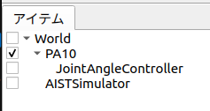

# 0. はじめに
## Choreonoidとは
Choreonoid[^1]は、産業技術総合研究所（AIST）が開発したオープンソースのロボットシミュレーションソフトウェアです。
2025年1月10日の最新バージョンでは下記のOSでの動作をサポートしています。

- Ubuntu Linux
- Windows

:::check
本記事ではUbuntu 22.04を使用します。
:::


[^1]: [Choreonoidとは](https://choreonoid.org/ja/about.html)

元々はロボットの動作振り付けツールとして開発されていたようであり、"Choreograph"（振り付けをする）と"Humanoid"（ヒューマノイド）を組み合わせた名前となっています。

現在は、株式会社コレオノイドにより開発が継続されており、ソースコードは[こちら](https://github.com/choreonoid/choreonoid)[^2]のGitHubで公開されています。

[^2]: [Choreonoid GitHubリンク](https://github.com/choreonoid/choreonoid)

本シミュレータの特徴として、以下の点が挙げられます。

- 動力学シミュレータとして利用可能
- 軽快な動作性能
- プラグインによる高い拡張性
- ROS1およびROS2との連携が可能

筆者は学生時代に本シミュレータを研究で使用しており、特に動力学シミュレータであるGazeboと比較しても、動作の軽快さについては目を見張るものがありました。

本記事では、Choreonoidの魅力について、使用方法やサンプルを交えてご紹介します。


## GitHubリンク
本記事で実装するコードは[こちら](https://github.com/hayat0-ota/choreonoid-simple-controllers/tree/Chapter1)[^3]で共有しています。必要に応じてご覧ください。
[^3]: [本記事のGitHubリポジトリ](https://github.com/hayat0-ota/choreonoid-simple-controllers/tree/Chapter1)


# 1. 開発環境構築
## 作業用ディレクトリの作成
使用するワークスペースディレクトリを作成します。
本記事ではHomeディレクトリ内に`Chorenoid_ws`という名前のフォルダを作成します。
これ以外のフォルダ名とする場合は、適宜読み替えてください。

```shell: ワークスペースの生成
$ mkdir -p ~/Choreonoid_ws
```


## リポジトリのクローン
ワークスペースディレクトリ内にChoreonoidのリポジトリをクローンします。

```shell: choreonoidリポジトリのクローン
$ cd ~/Choreonoid_ws
$ git clone git@github.com:choreonoid/choreonoid.git
```

## 関連ツールのインストール
Choreonoidに関連するツールをインストールします。リポジトリ内に一括でインストールするためのbashファイルが存在するため、それを使用します。

:::alert
実行するファイルはOS毎によって変わります。ファイル名のsuffixに注意してください。
今回はUbuntu22.04に対応するファイルを使用します。
:::

```shell: choreonoid依存パッケージのインストール
$ cd ~/Choreonoid_ws/choreonoid/misc/script
$ bash install-requisites-ubuntu-22.04.sh
```


## ビルド
クローンしたソースコード内に入り、CMakeを使用してビルドします。

```shell: choreonoidのビルド
# ディレクトリ移動
$ cd ~/Choreonoid_ws/choreonoid

# ビルドシステム生成
$ cmake -S . -B build

# ビルド実行（並列ビルド）
$ cmake --build build --parallel 4
```

## インストール
一般的なアプリケーションでは`make install`などを使用して`/usr/local`などにインストールすることが多いですが、choreonoidではホームディレクトリ内に生成したままとすることを推奨[^4]しています。

[^4]: [Choreonoid開発版ドキュメント ソースコードからのビルドとインストール (Ubuntu Linux編)/インストール](https://choreonoid.org/ja/manuals/latest/install/build-ubuntu.html#build-ubuntu-install)


本記事では、生成したバイナリファイルへのパスを通すだけに留めます。
前節で生成した実行ファイルへのパスを`~/.bashrc`に登録します。

```shell: 実行ファイルへのパス追加
$ echo "export PATH=$PATH:~/Choreonoid_ws/choreonoid/build/bin" >> ~/.bashrc
```

ターミナルを再起動して上記の変更を反映した後、下記コマンドを実行してchoreonoidが起動することを確認します。

```shell: choreonoid起動
$ choreonoid
```


開発環境の構築は以上で完了です。

# 2. プロジェクトの準備
## プロジェクトフォルダの新規作成
今回のサンプルでは、Choreonoid内で公開されている三菱重工のマニピュレータロボット"PA-10"[^5]（下図）のモデルを使用します。  　

[^5]: [三菱重工 電動汎用多軸マニピュレータ（PA-10,25,60）](https://www.mhi.com/jp/products/energy/manipulator_robot.html)

<div align="center">
    
    三菱重工 電動汎用多軸マニピュレータ PA-10
</div>

まずは、作業用ディレクトリである`choreonoid/ext`フォルダ内に、`PA10_JointAngleControl`フォルダを作成します。  

この中にプロジェクトファイルやコントローラのソースコードを格納します。

```shell: 本記事のファイル格納フォルダ作成
$ mkdir -p ~/Choreonoid_ws/choreonoid/ext/PA10_JointAngleControl
```

:::info
本記事では既存の`choreonoid/ext`フォルダ内にファイル等を格納します。  
choreonoid内に任意のフォルダを作成可能ですが、本記事では便宜上`ext`フォルダ内に格納することとします。
以降、コントローラ毎にサブフォルダを作成し、その中にコードなどを格納します。
:::

## PA10のモデルコピー
PA10のモデルファイルは`choreonoid/share/model/PA10`フォルダ内に格納されています。
このフォルダ内の要素を、先ほど作成した`PA10_JointAngleControl`に`model`フォルダとしてコピーします。
```shell: モデルファイルのコピー
$ cd ~/Choreonoid_ws/choreonoid
$ cp -r share/model/PA10 ext/PA10_JointAngleControl/model
```

フォルダ構成は下記のようになるはずです。
```
ext/
└── PA10_JointAngleControl/
    └── model/（※ share/model/PA10のコピー）
```

`model/PA10.body`ファイルの一部を以下に記します。  
本ファイルはロボットモデルの定義がYAML言語にて記述されており、各リンクの形状・特性や各軸リミット、モデリングファイルが記載されています。

:::info
Bodyファイルのリファレンスはこちらになります。適宜参照してください。
https://choreonoid.org/ja/manuals/latest/handling-models/modelfile/yaml-reference.html
:::

```yaml: PA10.body
format: ChoreonoidBody
formatVersion: 1.0
angleUnit: degree   # 角度単位
name: PA10

links:  # 構成リンク一覧
  -
    name: BASE          # リンク名（ルートリンク）
    jointType: fixed    # 固定リンク
    mass: 3.04          # 質量[kg]
    centerOfMass: [ 0, 0, 0.075 ]   # 重心位置
    inertia: [  # 慣性モーメント
      1, 0, 0,
      0, 1, 0,
      0, 0, 1 ]
    elements:
      Visual: { resource: { uri: "parts/BASE.wrl" } }
      Collision:
        shape:
          rotation: [ 1, 0, 0, 90 ]
          translation: [ 0, 0, 0.1 ]
          geometry:
            type: Cylinder
            height: 0.2
            radius: 0.115
  -
    name: J1                    # リンク名称
    parent: BASE                # 親リンク
    jointType: revolute         # 回転リンク（ジョイント）
    jointAxis: [ 0, 0, 1 ]      # 回転軸
    jointId: 0                  # 関節ID
    translation: [ 0, 0, 0.2 ]  # 親リンクからの相対位置
    rotation: [ 0, 0, 1, 0 ]    # 親リンクからの相対姿勢
    jointRange: [ -177, 177 ]   # リミット角度
    jointVelocityRange: [ -180, 180 ] # リミット角速度
    rotorInertia: 3.0E-4        # ロータ慣性モーメント
    mass: 9.78                  # 質量
    centerOfMass: [ 0, 0, 0.14818 ] # 重心位置
    inertia: [
      1, 0, 0,
      0, 1, 0,
      0, 0, 1 ]
    elements:   # リンクの構成要素ノード一覧
      Visual: { resource: { uri: "parts/J1.wrl" } } # モデルファイル指定
      Collision:  # 衝突モデル
        elements: # 構成要素
          -
            type: Shape
            rotation: [ 1, 0, 0, 90 ]
            translation: [ 0, 0, 0.01 ]
            geometry:
              type: Cylinder
              height: 0.02
              radius: 0.115
          -
            type: Transform
            translation: [ 0.085, 0, 0.09 ]
            elements: &J1_FRAME
              Shape:
                rotation: [ 1, 0, 0, 90 ]
                geometry:
                  type: Capsule
                  height: 0.062
                  radius: 0.058
          -
            type: Transform
            translation: [ -0.09, 0, 0.09 ]
            elements: *J1_FRAME
  -
    name: J2
    parent: J1
    jointType: revolute
    # （以降略）
```

PA10の各関節の上限・下限角度を下表に記します。

| 関節名 | 下限値[deg] | 上限値[deg] |
| :----: | :---------: | :---------: |
|   J1   |   -177.0    |    177.0    |
|   J2   |    -94.0    |    94.0     |
|   J3   |   -174.0    |    174.0    |
|   J4   |   -137.0    |    137.0    |
|   J5   |   -255.0    |    255.0    |
|   J6   |   -165.0    |    165.0    |
|   J7   |   -255.0    |    255.0    |
| HAND_L |   -0.030    |    0.030    |
| HAND_R |   -0.030    |    0.030    |

## Choreonoidの起動
Choreonoidの開発環境が構築できたため、早速シミュレーションの準備を整えていきましょう。

まず、ターミナルからChoreonoidを起動します。

```shell
$ choreonoid
```

## ワールドの追加
Chorenoidを起動したら、シミュレーションするための準備を行います。

まず、「ファイル」タブ -> 「新規」->「ワールド」を選択し、ワールド名を「World」とします。


:::info
ワールドはすべての要素の親となる要素です。
そのため、ロボット・シミュレーションはワールドの下に作成します。
要素ツリー内で親要素を選択した状態で要素を追加することで、子要素として配置できます。
:::

この状態で一旦プロジェクトファイルを保存します。
「ファイル」->「プロジェクトに名前をつけて保存」を選択します。


下記の場所に「project」フォルダを作成し、ファイル名を「PA10_JointAngleControl」として保存します。

```
ext/
└── PA10_JointAngleControl/
    ├── model/
    └── project/                          <--- 新規作成
        └── PA10_JointAngleControl.cnoid  <--- 保存ファイル
```

## ボディファイルの追加
「ワールド」に子要素としてボディファイルを追加します。
「ワールド」を選択した状態で
「ファイル」->「読み込み」->「ボディ」を選択します。


先ほどコピーしたmodelフォルダ内の「PA10.body」を選択します。
選択すると、画面上にPA10が表示されます。


## コントローラ設定
制御対象モデルに対するコントローラを設定します。
まず、PA10（制御対象モデル）を選択した状態で
「ファイル」->「新規作成」->「シンプルコントローラ」を選択します。
ここで、コントローラの名前は「JointAngleController」とします。


:::info
後ほど、生成したコントローラをこの部分で設定します。
:::

## シミュレータの作成
ワールド、コントローラの設定は以上で完了ですが、シミュレーション用のアイテムを作成します。
ワールドを選択した状態で
「ファイル」->「新規作成」->「AISTシミュレータ」を選択します。

名前は「AISTSimulator」とします。

## プロジェクトの保存
設定は以上で完了です。画面左上の「Save」アイコン押下して現在のプロジェクト構成をファイルに保存します。


プロジェクトの準備は以上で完了です。Choreonoidを一旦閉じておきましょう。
最終的なプロジェクト内の構成は下図のようになります。



# 3. 目標関節角度指令を出力するコントローラの作成
## Choreonoidで使用可能なコントローラの種類
Chorenoidでは下記のコントローラを使用してロボットを動かすことができます。

- SimpleController
  - Choreonoid独自の軽量なコントローラ
  - C++で記述する
- Python Controller
  - Pythonで記述する
- BodyIoRTC
- ROS Controller
- Plugin-based Controller


## ソースコードフォルダ・ファイルの作成
ロボットを動かすためのコントローラを作っていきます。
`ext/PA10_JointAngleControl`フォルダ内に、ソースフォルダとソースファイル、CMakeLists.txtを作成します。

```shell
$ cd ~/Choreonoid_ws/choreonoid/ext/PA10_JointAngleControl
$ mkdir src
$ touch src/PA10_JointAngleController.cpp
$ touch CMakeLists.txt
```

## CMakeLists.txtの編集
作成したソースファイルをChoreonoidのシンプルコントローラとしてビルドするように設定します。

```cmake: PA10_JointAngleControl/CMakeLists.txt
choreonoid_add_simple_controller(PA10_JointAngleController src/PA10_JointAngleController.cpp)
```

## コントローラの実装
`src/PA10_JointAngleController.cpp`を実装します。
今回は下記のようなシンプルコントローラを作成します。

- ロボットの各軸に対して、乱数で生成した関節角度を指令値として与える
  - ただし、値はリミット制限内とします
- 下記の時間毎に関節角度を与える
  - t1 = 0.0 ~ 2.5[s]
  - t2 = 2.5 ~ 5.0[s]
  - t3 = 5.0 ~ 7.5[s]
  - t4 = 7.5 ~ 10.0[s]

コードを以下に記します。（GitHubリンクは[こちら](https://github.com/hayat0-ota/choreonoid-simple-controllers/blob/88b1b25027659475e88e7957984f9b78e11d7e5d/PA10_JointAngleControl/src/PA10_JointAngleController.cpp)）

```cpp: PA10_JointAngleController.cpp
#include <cnoid/SimpleController>
#include <random>

#pragma region Declaration

/// @brief Give joint angle to each joint of PA10
class PA10_JointAngleController : public cnoid::SimpleController
{
private:
    /// @brief The number of joint
    static const int jointNum = 9;

    /// @brief  The number of pattern
    static const int patternNum = 4;

    /// @brief Joint limits of PA10 model
    const float JointLimit[jointNum] = {177.0, 94.0,  174.0, 137.0, 255.0,
                                        165.0, 255.0, 0.030, 0.030};

    /// @brief Pattern of joint angles
    float anglePattern[patternNum][jointNum];

    /// @brief Pointer for Body
    cnoid::BodyPtr ioBody;

    /// @brief Curremt simulation time [ms]
    double currentTime;

    /// @brief Simulation step time [ms]
    double timeStep;

    /// Methods
    float generateRandomFloat(float min, float max);
    float deg2rad(float deg);

public:
    /// Methods
    PA10_JointAngleController();
    virtual bool initialize(cnoid::SimpleControllerIO* io) override;
    virtual bool control() override;
};
CNOID_IMPLEMENT_SIMPLE_CONTROLLER_FACTORY(PA10_JointAngleController)

#pragma endregion

#pragma region Implementation

/// @brief Constructor (Not Implemented)
PA10_JointAngleController::PA10_JointAngleController() {}

/// @brief Executed once at SimpleController launched
/// @param io Pointer of SimpleControllerIO
/// @return Result of Initialization
bool PA10_JointAngleController::initialize(cnoid::SimpleControllerIO* io)
{
    // Obtain the pointer of Body
    ioBody = io->body();

    // Configure each joint
    for (int jointId = 0; jointId < jointNum; jointId++)
    {
        cnoid::Link* joint = ioBody->joint(jointId);

        // Set the way to control joint
        joint->setActuationMode(cnoid::Link::JointAngle);

        // Enable Input and Output for joint
        io->enableIO(joint);
    }

    // Initialize current time
    currentTime = 0.0;

    // Create joint angle patterns
    // Angle must be between joint limit.
    for (int patternId = 0; patternId < patternNum; patternId++)
    {
        for (int jointId = 0; jointId < jointNum; jointId++)
        {
            anglePattern[patternId][jointId] =
                generateRandomFloat(-JointLimit[jointId], JointLimit[jointId]);
        }
    }

    // Obtain timestep of simulation
    timeStep = io->timeStep();

    return true;
}

/// @brief Executed in every period
/// @return Result of Execution
bool PA10_JointAngleController::control()
{
    // Select pattern index according to current simulation time
    int currentPatternIndex;
    if (0 <= currentTime && currentTime < 2.5)
        currentPatternIndex = 0;
    else if (2.5 <= currentTime && currentTime < 5.0)
        currentPatternIndex = 1;
    else if (5.0 <= currentTime && currentTime < 7.5)
        currentPatternIndex = 2;
    else if (7.5 <= currentTime && currentTime < 10.0)
        currentPatternIndex = 3;
    else
        currentPatternIndex = 0;

    // Control angle of joint according to patten index
    for (int jointId = 0; jointId < jointNum; jointId++)
    {
        // Unit must be radian
        ioBody->joint(jointId)->q_target() = deg2rad(anglePattern[currentPatternIndex][jointId]);
    }

    // Calculate current time
    currentTime += timeStep;

    return true;
}

/// @brief Generate random float value
/// @param min Minimum
/// @param max Maximum
/// @return Generated value
float PA10_JointAngleController::generateRandomFloat(float min, float max)
{
    if (min > max)
    {
        throw std::invalid_argument("min must be less than or equal to max");
    }

    std::random_device rd;
    std::mt19937 gen(rd());
    std::uniform_real_distribution<float> dis(min, max);

    return dis(gen);
}

/// @brief Convert from degree to radian
/// @param angle Angle in degree
/// @return Angle in radian
float PA10_JointAngleController::deg2rad(float deg)
{
    return deg * M_PI / 180.0f;
}

#pragma endregion
```

## コード解説
コード内で重要な部分について解説します。

### initializeメソッドとcontrolメソッド
今回作成した`PA10_JointAngleController`クラスは`cnoid::SimpleControllerIO`クラスを継承しています。
cnoid::SimpleControllerクラスには下記の仮想関数が定義されています。
派生クラス内でオーバーライドすることで、行いたい処理を実装します。

| メソッド                                           | 詳細                                             |
| -------------------------------------------------- | ------------------------------------------------ |
| `configure(cnoid::SimpleControllerConfig* config)` | SimpleControllerがBodyに追加された際に実行される |
| `initialize(cnoid::SimpleControllerIO* io)`        | シミュレーション開始前の初期化処理               |
| `start()`                                          | シミュレーション開始時に実行される               |
| `control()`                                        | シミュレーションの制御周期毎に実行される         |
| `stop()`                                           | シミュレーションが停止した際に実行される         |
| `unconfigure()`                                    | コントローラがアンロードされた際に実行される     |

:::info
SimpleControllerクラスの詳細は
`choreonoid/src/Body/SimpleController.h`
に記載されているコメントなどをご覧ください。
:::

今回作成したコントローラ`PA10_JointAngleController`では、`initialize()`と`control()`の2つをオーバーライドしています。

`initialize`メソッドでは
- 各関節の入出力設定
- 関節パターンの作成
- シミュレーションステップ時間の取得

`control`メソッドでは
- 現在時刻変数`currentTime`の更新
- 時間に応じたパターン切り替え
- パターンに応じた関節角度の制御

を行っています。

### ロボットへの動作指令
ロボットの関節角を制御するまでの流れは下記のとおりです。

1. initializeメソッド内でBodyへのポインタを取得する
```cpp
ioBody = io->body();
```

2. initializeメソッド内で各関節を角度で制御するように設定する
```cpp
// Configure each joint
for (int jointId = 0; jointId < jointNum; jointId++)
{
    cnoid::Link* joint = ioBody->joint(jointId);

    // 関節を角度で制御するように設定
    joint->setActuationMode(cnoid::Link::JointAngle);

    // 関節の制御とセンシングを許可
    io->enableIO(joint);
}
```

3. controlメソッド内で`q_target`の参照に対して目標角度を代入する
```cpp
// Control angle of joint according to patten index
    for (int jointId = 0; jointId < jointNum; jointId++)
    {
        // 
        ioBody->joint(jointId)->q_target() = deg2rad(anglePattern[currentPatternIndex][jointId]);
    }
```

## コントローラのビルド
CMakeLists.txtにSimpleControllerをビルドする記述を追加します。
第一引数にはコントローラ名を、第二引数にはコントローラのソースファイルを指定します。

```cmake: PA10_JointAngleControl/CMakeLists.txt
choreonoid_add_simple_controller(PA10_JointAngleController src/PA10_JointAngleController.cpp)
```

編集したら、choreonoidビルドをしたときと同様にビルドします。

```shell: Choreonoidとコントローラのビルド
$ cd ~/Choreonoid_ws/choreonoid
$ cmake --build build --parallel 4
```

ビルドを行うと、コントローラファイルが下記に生成されます。
コントローラは`.so`ファイル（共有ライブラリ）として出力されます。

```PATH
choreonoid/build/lib/choreonoid-2.2/simplecontroller/PA10_JointAngleController.so
```

後ほどこのファイルを使用するように設定します。

# 4. シミュレーションの実行
## Choreonoidの起動
先程閉じたChoreonoidを再度開きます。
このとき、コマンドの第一引数にprojectファイルを指定することで、プロジェクトを開くことができます。

```shell: Choreonoidプロジェクトのオープン
$ cd ~/Choreonoid_ws/choreonoid/ext/PA10_JointAngleControl
$ choreonoid project/PA10_JointAngleControl.cnoid
```

## コントローラの設定
「コントローラ設定」の節で作成したSimpleControllerアイテム欄を選択状態とし、画面左下のプロパティ欄の「コントローラモジュール」をクリックします。
クリック後に表示されるアイコンをクリックして、先ほど生成したSimpleControllerのファイルを指定します。
生成場所は下記です。

```PATH
choreonoid/build/lib/choreonoid-2.2/simplecontroller/PA10_JointAngleController.so
```

また、「再読込」プロパティをTRUEに変更します。
これにより、ビルド後に毎回SimpleControllerを設定し直す手間を省きます。


ここまで完了したら、プロジェクトを保存します。

## シミュレーションの実行
画面上部の「シミュレーション開始」ボタンを押下してシミュレーションを開始します。


シミュレーションを開始すると、下図のように2.5秒毎にロボットの姿勢が変化します。
また、毎回シミュレーションを開始しなおすと、ロボットの角度パターンがランダムに変化するはずです。


# 5. まとめ
今回はロボットの各軸を動かすSimpleControllerを作ってみましたが、依然として下記のような課題が残っています。

- モーション
  - ロボットが一瞬で動く（=速度が無限大）ため非現実的な動作となっている。ロボットを滑らかに動かしたい。
- コントローラ
  - 関節の上限値・下限値をマジックナンバーとして定義している。Bodyファイルへのポインタを使用して取得するようにしたい。
  - 軸数が定数で定義されているためロボットが変わると同じコントローラを使用できない。汎用的に使用できるようにしたい。
- シミュレーション
  - シミュレーションが10秒経過しても終わらない。終わったら自動で終了するようにしたい。

次回は上記の課題を解決するようなコントローラを作成します。

# 参考資料
- [Choreonoid開発版ドキュメント](https://choreonoid.org/ja/manuals/latest/index.html)
- [Choreonoid研修 RTF 2023年8月24日〜26日 Choreonoid研修資料](https://choreonoid.org/ja/workshop/summar-training-2023.html)