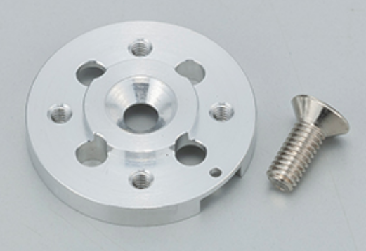

## こんなひとにおすすめ

- マルチモーダルAI、フィジカルAI、模倣学習、強化学習などロボティクス分野のAIに興味はあるが、どこから手をつけたらいいのか分からない方
- 実機のロボットの価格が高くて試せないと感じている方
- 手を動かして学びたいが、低コストで始めたい方

## はじめに

本記事では、オープンソースプロジェクトである LeRobot とオープンソースのアームロボットである SO-101 を題材に、マルチモーダル AI に関する技術紹介と環境構築の手順を解説します。  
最終的なゴールは、片方のアームを動かすともう片方のアームが同じ動作を追従する動作を再現することです（下記GIF参照）。

<p align="center">
  
</p>

## 用語の説明

### マルチモーダルAI とは

従来のロボティクス開発では、ロボット本体、カメラ、通信規格など複数の技術（モダリティ）が個別に動作し、出力されるデータ形式も異なるため、それらを統合して1つのシステムとして運用するのは容易ではありませんでした。  

近年、Transformer 系モデルなどの進展により、画像・音声・テキスト・センサー値など複数モダリティを統合して扱う「マルチモーダルAI」の研究・実装が進んでおり、異なるデータ形式の扱いや統合が以前より容易になっています。  

これに伴い、ロボティクス領域では前述の問題点の解消が期待され、マルチモーダルAIを活用した開発が増えつつあります。  

:::info  
似たような用語として「フィジカルAI」が存在します。こちらはロボットや物理世界での学習・意思決定に焦点を当てる用語で、マルチモーダルAIと重なる部分が多いですが、本記事では区別せず「マルチモーダルAI」として扱います。  
:::

### LeRobot とは

公式リポジトリ：[LeRobot](https://github.com/huggingface/lerobot)

<p align="center">
    
</p>


LeRobot は Hugging Face が公開しているオープンソースのロボティクスライブラリで、実ロボット向けのモデル、データセット、ツールを提供しています。LeRobot を使うことで多様なロボットの制御やデータ収集、学習ワークフローの構築が容易になります。  
本記事ではLeRobotのインストールと設定に焦点を当て、最終的にSO-101を動作させる手順を説明します。[^1]

### SO-101 とは

公式リポジトリ：[SO-101](https://github.com/TheRobotStudio/SO-ARM100)

|  |  |
|---|---|
| SO101 Follower の画像。<br>実物のロボットに近しい構成となっている。 | SO101 Leader の画像。<br>人間が操作しやすいようにグリップ部分がある。 |

SO-101 は RobotStudio と Hugging Face が共同で開発した、低コストのオープンソース・ロボットアームで、ロボティクス分野への参入ハードルを下げることを目的としています。

SO-101 は「Leader（先導者）」と「Follower（従者）」の2台のロボットアームで構成されます。一般的な利用では Leader をユーザーが手動で操作してデータ収集をし、Follower はその記録や学習済みモデルに基づいて同じ動作を再現することを想定しています。

本記事では [SO-101 の入手方法](#prepare-so101)と、LeRobot で動かす際に必要な手順を解説します。  

## 動作環境

本記事では環境構築の手順に重点を置くため環境要件は簡略化しますが、LeRobot の多くのチュートリアルが CLI 操作を前提としていることから OS は Linux または macOSを 推奨します。  
本記事では整合性を図るために、Linux を前提としています。

:::alert:GPU に関して  
将来的に LeRobot と SO-101 で学習するのであれば、VRAM容量が 8GB 以上の GPU も必要となります。  
:::  

:::info:あると便利なもの  
本記事の手順を遂行するのに必ずしも必要ありませんが、以下の物があると便利です。

- 2口以上の電源タップ：2台のロボットアームへの電源供給に必要なため。
- 2口以上で電源供給可能な USB3.0 ハブ：2台のロボットアームをPCに接続するため。
- タックシール：複数のモーターや部品を管理しやすくするため。
:::

## 環境構築方法

こちらでは LeRobot と SO-101 を用いた環境構築の手順を解説します。  
手順としては次のように進めますが…

1. [LeRobot の環境構築方法](#lerobot-の環境構築方法)
2. [SO-101 の環境構築](#so-101-の環境構築)  

事前に [SO-101 の印刷（もしくは購入）](#prepare-so101)を確認いただき、SO-101 のパーツを揃えることをおすすめします。

## LeRobot の環境構築方法

LeRobot の環境構築方法は Hugging Face の [Installation](https://huggingface.co/docs/lerobot/installation) ページを参照しているため、重要な手順に絞って解説します。

### 0. 【任意】conda 系のパッケージがインストールされていない場合 {#conda-install}

LeRobot は複数の Python パッケージを扱うため、Conda を用いて仮想環境を構築することを勧めている。そのため、Conda がインストールされていない場合は下記コマンドでインストールします。

```bash
wget "https://github.com/conda-forge/miniforge/releases/latest/download/Miniforge3-$(uname)-$(uname -m).sh"
bash Miniforge3-$(uname)-$(uname -m).sh
```

### 1. 仮想環境構築 {#virtual-env-setup}

1. Conda で仮想環境を構築する

    ```bash
    # 下記の lerobot は構築する環境の名前なので、お好きなものに変えても構いません
    # その場合、他の手順も同様に変更を加えてください
    conda create -y -n lerobot python=3.12
    ```

2. Conda の仮想環境をアクティブする

    ```bash
    conda activate lerobot
    ```

3. `ffmpeg` を仮想環境にインストールする
   
    ```bash
    conda install ffmpeg -c conda-forge
    ```

    LeRobot の現在のバージョンでは、`ffmpeg` のバージョン 8.x に対応していないので、前のコマンドでインストールされた `ffmpeg` のバージョンを確認します：

    ```bash
    ffmpeg -version
    ```

    このとき、`ffmpeg` のバージョン 8.x になっていれば、下記コマンドで `ffmpeg` のバージョンをダウングレードします：

    ```bash
    conda install ffmpeg=7.1.1 -c conda-forge
    ```

### 2. LeRobot をインストールする

LeRobot はリポジトリのソース、もしくは PyPl からインストール出来ます。将来的に個人開発したい場合は、コードの編集が可能なソースからのインストールを推奨します。

リポジトリのソースからインストールする場合は下記コマンドを実行します。

```bash
git clone https://github.com/huggingface/lerobot.git
cd lerobot
# 編集可能モードで Conda 環境にインストールする
pip install -e .
```

PyPl からインストールする場合は下記コマンドを実行します。

```bash
pip install lerobot
```

## SO-101 の環境構築

### 1. SO-101 の印刷（もしくは購入） {#prepare-so101}

SO-101 のハードウェア構成は [公式リポジトリ](https://github.com/TheRobotStudio/SO-ARM100) で公開されています。  
リポジトリの3Dデータを使ってパーツを3Dプリントするか、リポジトリで案内されている [公認販売サイト](https://github.com/TheRobotStudio/SO-ARM100) からパーツキットを購入して、Follower と Leader の両アームを組み立てられます。

注意点として、公式リポジトリで入手できるのは主に外装・機構パーツで、サーボモーターなどの駆動部品は別途用意する必要があります。モーター購入時は公式リポジトリ内の [Parts For Two Arms (Follower and Leader Setup):](github.com/TheRobotStudio/SO-ARM100?tab=readme-ov-file#parts-for-two-arms-follower-and-leader-setup) の記載を参照するか、公認販売元のキットを購入してください。

参考として、筆者の場合は公式リポジトリで紹介されていた秋月電子通商のサイトから、以下の2つのキットを購入しました。また、説明の整合性を図るために、これらのパーツを基準として手順を解説します。

- [[131169]SO-101 オープンソースロボットアームキット Pro版](https://akizukidenshi.com/catalog/g/g131228)
- [[131222]SO-101 オープンソースロボットアームキット 3Dプリントパーツ](https://akizukidenshi.com/catalog/g/g131222)

### 2. SO-101 のセットアップ

SO-101 のはセットアップ Hugging Face の [SO-101](https://huggingface.co/docs/lerobot/so101) ページを参照しているため、重要な手順に絞って解説します。また、前述でも触れましたが、SO-101 は Leader と Follower の2台のロボットアームで構成されるため、一部の手順が異なる点には留意してください。

初めに下記のコマンドで　SO-101 を動かすために必要な SDK をインストールします。

```bash
pip install -e ".[feetech]"
```

#### 2.1. モーターの仕分け {#label-motors}

参考リンク：[Configure the motors](https://huggingface.co/docs/lerobot/so101#configure-the-motors)

初めに [前のセクション](#prepare-so101) で用意したモーターを Leader と Follower 用に分けます。Leader 側は複数種類のギア比を持つモーターで構成されるのに対し、Follower 側は同一仕様（1 / 345）のモーターで構成されるためです。

Leader の各関節に割り当てるモーターID （[後述を参照](#connect-motor-motorbus)）とギア比は次の通りです。

|   Leader-Arm Axis   | Motor | Gear Ratio |
|:-------------------:|-------|------------|
| Base / Shoulder Pan | 1     | 1 / 191    |
| Shoulder Lift       | 2     | 1 / 345    |
| Elbow Flex          | 3     | 1 / 191    |
| Wrist Flex          | 4     | 1 / 147    |
| Wrist Roll          | 5     | 1 / 147    |
| Gripper             | 6     | 1 / 147    |

モーターの種類は本体のラベル（シール）で判別できます。Leader 用モーターにはギア比が明記されていることが多く、Follower 用は同一仕様のためギア比の表記がないことがあります。  

##### 2.2. MotorBus（モーターバス）のセットアップ {#setup-motorbus}

モーターの仕分けが終わりましたら、モーターバス（下記画像参照）の設定します。

<p align="center">
    
</p>

モーターバスは複数のモーターをまとめて管理・通信するための機器です。  
[前セクション](#label-motors) で分けた Leader 用の全モーターに対して1台、Follower 用の全モーターに対して1台のモーターバスを用意します。このとき、Leader と Follower のモーターを誤って混同すると後で修正が大変なので、タックシールなどで全モーターにラベルを貼り、どのモーターバスに対応させるかを明確にするといいです。  

以降の手順では便宜上、次の略称を使います。

- Leader用モーターバス：Leader_MB
- Follower用モーターバス：Follower_MB

1. Leader_MB と Follower_MB の電源を入れ、PC に接続する。
2. 各モーターバスの USB ポートを確認する。  

    両方のモーターバスを接続した状態で下記を実行する。  
    スクリプト実行中に指示が出たら、Leader_MB の USB ケーブルを抜いて Enter キーを押す。

    ```bash
    lerobot-find-port
    ```

    例）スクリプトの出力例：

    ```bash
    Finding all available ports for the MotorBus.  
    ['/dev/ttyACM0', '/dev/ttyACM1']  
    Remove the usb cable from your MotorsBus and press Enter when done.

    #（対応する Leader_MB のケーブルを抜いて Enter を押す）

    The port of this MotorsBus is /dev/ttyACM0
    Reconnect the USB cable.
    
    #（対応する Leader_MB のケーブルを差し直す）
    ```

    `Reconnect the USB cable.` が表示された時点で Leader_MB のケーブルを差し直してください。上記例では `/dev/ttyACM0` が Leader_MB のポートとなるので、こちらを記録してください。

    同様に Follower_MB の USB ケーブルを抜いて、Follower_MB のポートを確認・記録してください。上記例では `/dev/ttyACM1` が Follower_MB のポート番号になりますが、環境によっては異なることには注意してください。  

    :::alert:Linux のデバイス権限に関して
    Linuxではデバイスファイルのアクセス権が原因で認識できないことがあるため、必要に応じて以下を実行して権限を付与してください。下記例では `ttyACM0` デバイスの権限を変更しておりますが、デバイス名は環境により変わることには注意してください。

    ```bash
    sudo chmod 666 /dev/ttyACM0
    ```
    :::

#### 2.3. モーターとモーターバスを連動させる {#connect-motor-motorbus}

出荷時のモーター ID はすべて 1 に設定されているため、モーターバスと正しく通信・連動させるには各モーターに一意の ID を割り当てる必要があります。  
まずは Leader_MB を設定するために、下記コマンドを実行してください。

```bash
lerobot-setup-motors \
    --robot.type=so101_follower \
    --robot.port=/dev/ttyACM0 # Leader_MB のポート番号
```

`--robot.port=` には [MotorBus（モーターバス）のセットアップ](#setup-motorbus) で確認した Leader_MB のポートを入力します。確認しポートが`/dev/ttyACM0` 以外であれば、適切に変更してから実行してください。  

PC と Leader_MB の通信が確率すると、下記メッセージが表示されます。

```bash
Connect the controller board to the '＜関節名＞' motor only and press enter.
```

ここで表示される `<関節名>` は、これから ID を割り当てるモーターが担当する関節名（例：`gripper`）を示します。手順は次の通りです。

1. [モーターの仕分け](#label-motors) で用意したモーターとその章のテーブルと照合して、該当する種類のモーターを準備する（例：gripper → ギア比 1 / 147 のモーター）
2. 該当モーターをモーターバスに接続する（モーター付属ケーブルを使う）
3. ターミナルで Enter キーを押す

ID 割り当てが正常に行われると、次のように表示されます。

```bash
'＜関節名＞' motor id set to ＜ID＞
```

続けて他の Leader 用モーターにも同様に ID を設定してください。これら手順の一連の流れは下記の公式動画から確認できます。

<video align="center"  controls>
  <source src="https://huggingface.co/datasets/huggingface/documentation-images/resolve/main/lerobot/setup_motors_so101_2.mp4" type="video/mp4">
</video>

Leader_MB の設定が終わったら、同じように Follower_MB の設定します。前述の通り、Follower 側のモーターは同一のギア比で構成されていることが多いので、モーターが担当する関節名を照合する必要はありません。ただ、設定した ID を混同しないよう、留意してください。


:::info:アドバイス
公式リポジトリの動画ではモーターを既にアームに取り付けた状態で ID を設定していますが、筆者は取り付け前に ID を設定することをおすすめします。Leader 側は複数のギア比の異なるモーターで構成され、取り付け済みだと種類判別が難しく、誤った位置に取り付けると分解・ID 再設定が必要になるためです。  
事前にIDを振り、ラベル（タックシール等）で識別してからアームに組み付けるとトラブルを大幅に減らせます。
:::

#### 2.4. ロボットアームの組み立て

SO-101 の組み立て手順は多岐にわたるため、まずは公式チュートリアル動画や販売元の組み立て動画を参照してください。

- [LeRobot 公式サイトのチュートリアル](https://huggingface.co/docs/lerobot/so101?example=Linux#joint-1)
- [WoWRobo が公開している組み立て手順の動画](https://www.youtube.com/watch?v=70GuJf2jbYk)

:::stop::キャリブレーションに関して
組み立て後は、各公式ページやチュートリアルで案内されているキャリブレーション手順に従ってモーターの位置合わせを必ず行ってください。キャリブレーションが不十分だと関節角がずれて想定外の姿勢で動作し、周囲の物や人にぶつかるなど危険が生じます。
:::

:::info:アドバイス
組み立てに関しては、上記のいずれかの動画を見ていけばいいのですが、サーボホーン（下記画像参照）でいくつかアドバイスをしたいと思います。 

<p align="center">
    
</p>

1. サーボホーンにロボットアームの外装・機構パーツを固定する際は、大きなネジを使います。モーター本体をロボットアームに固定するためには、小さなネジを使います。
2. サーボホーンは「凸部（突起）」が外側（表）に見える向きではなく、突起が見えないように裏返して取り付けてください（平らな面を表にする）。裏表を誤るとネジが最後まで締まらず、アームの可動域やスムーズさに影響することがあります。[^2]
:::

### 3. 動作確認

参考リンク：[Imitation Learning on Real-World Robots](https://huggingface.co/docs/lerobot/il_robots#imitation-learning-on-real-world-robots)

最後に、LeRobot が提供する模倣学習のサンプルコードを使って、Leader から Follower へのテレオペレーションで動作確認を行います。モーターバスがPCに接続されていることを確認してから、下記コマンドを実行します。

```bash
lerobot-teleoperate \
    --robot.type=so101_follower \
    --robot.port=/dev/ttyACM0 \ # MotorBus（モーターバス）のセットアップで確認した Follower_MB のポートを入力してください
    --robot.id=my_awesome_follower_arm \ # 好きな変数名を入力してください
    --teleop.type=so101_leader \
    --teleop.port=/dev/ttyttyACM0 \ # MotorBus（モーターバス）のセットアップで確認した Leader_MB のポートを入力してください
    --teleop.id=my_awesome_leader_arm # 好きな変数名を入力してください
```

今までの手順が正しく行われていれば、[はじめに](#はじめに) の章の GIF のように、Leader を動かすとFollower が追従して動作します。

### 最後に

本記事は LeRobot と SO-101 を使ったフィジカルAI入門として、環境構築と基本的な動作確認手順を紹介しました。今後も機会があれば、LeRobotを使った学習（模倣学習・強化学習）や、ロボティクス領域のAI手法の詳細について掘り下げていく予定です。

[^1]: 機会があれば、学習方法に関して記事を書くかもしれません。
[^2]: 著者はこれのせいで、組み立て済みのロボットアームを分解して、再度組み直すことになりました。