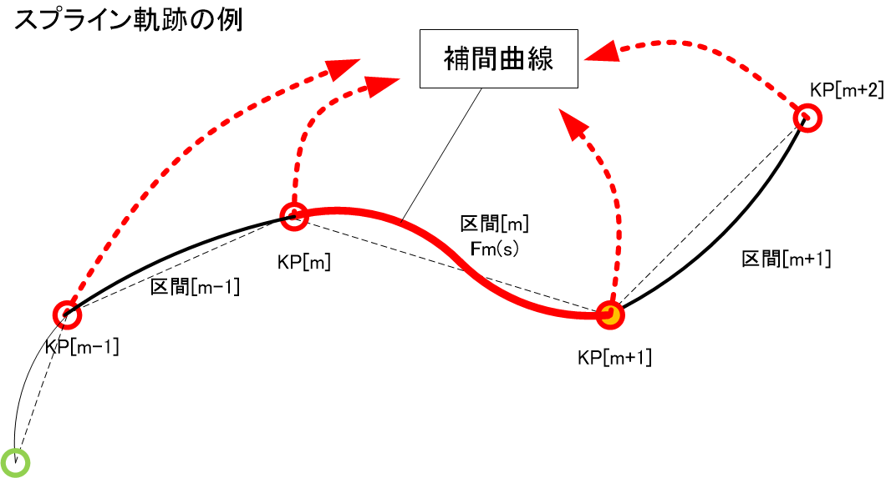
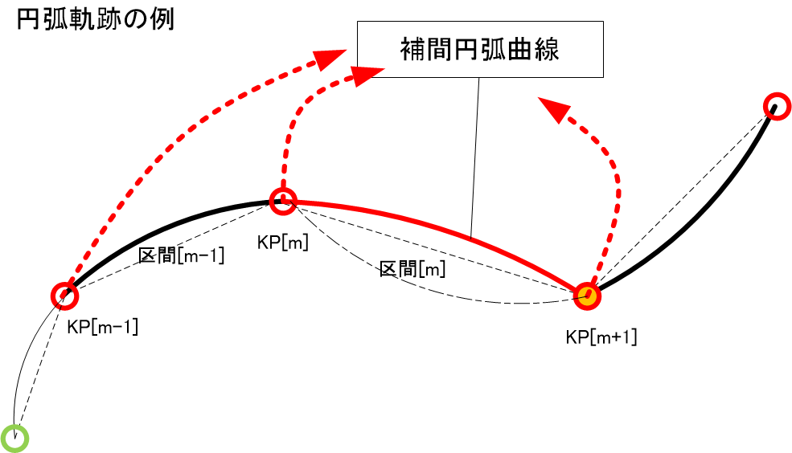
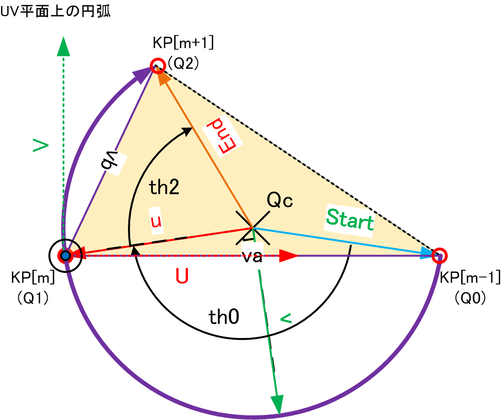
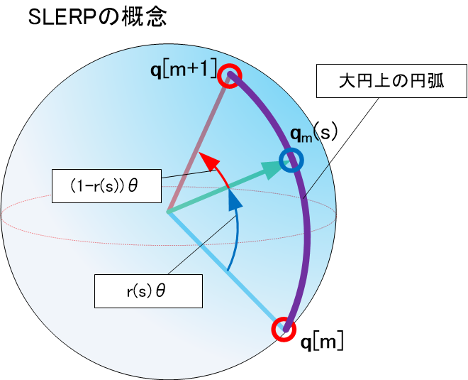
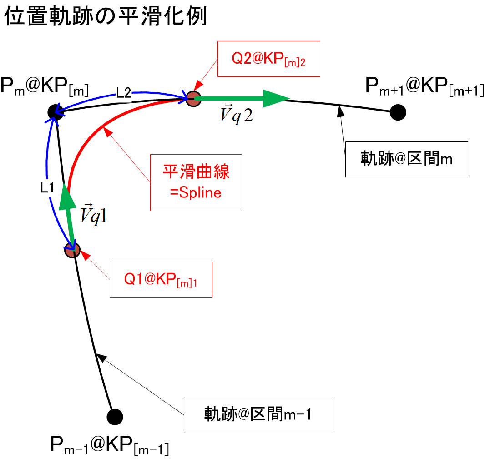

<script type="text/javascript" async src="https://cdnjs.cloudflare.com/ajax/libs/mathjax/2.7.7/MathJax.js?config=TeX-MML-AM_CHTML">
</script>
<script type="text/x-mathjax-config">
 MathJax.Hub.Config({
 tex2jax: {
 inlineMath: [['$', '$'] ],
 displayMath: [ ['$$','$$'], ["\\[","\\]"] ]
 }
 });
</script>

# ロボットマニピュレータ制御のアルゴリズム2
(株)豆蔵　エンジニアリングソリューション事業部　石井隆寛

## 1. はじめに
（株）豆蔵では様々なロボット技術を開発している。他社製ロボットを用いてクライアントの要望に応える応用技術を開発することが多いが、自社でも6軸や7軸のアームを持つ産業用ロボット、いわゆるロボットアーム＝マニピュレータを一から開発している。この開発を通じて様々な応用技術や提案を生み出している。今回ここで得た知見を読者の方と共有したいと思う。本解説では6軸の産業用垂直多関節型マニピュレータを例にしてこれを制御するさまざまなしくみを説明したい。

今回は、前回説明した基礎的な軌跡生成処理アルゴリズムの詳細の一例を紹介する。具体的にはユーザが指定した特徴的な位置と姿勢からどう補間して軌跡（位置と姿勢のセット）のサンプルを算出するか、について言及する。

## 2. 軌跡生成
## 区間設定
ロボットプログラムでは、ツール先端の軌跡が通過する重要地点KP（＝Key Point）の位置と姿勢を連続的に指定する。さらにKPとKPの間、つまり区間内の軌跡の形状と速度や加速度も指定する。これらを使って位置や姿勢をサンプリングして軌跡$T_i$とする。

ここでKPも、前回述べたツール先端の位置・姿勢の定義を使い同様に表現する。ここでKPの軌跡上の順番の番号を$j$とする。（jは0以上の整数）

$$T_{KP[j]}=\left(
\begin{array}{cccc}
 u_x & v_x & w_x & q_x \\
 u_y & v_y & w_y & q_y \\
 u_z & v_z & w_z & q_z \\
 0 & 0 & 0 & 1 \\
\end{array}
\right)$$

これをあらためて説明すると、左上の3x3の部分行列 $R_{KP[j]}$（正規直交系）がベース座標系 $\Sigma_0$から見た、ツール先端座標系の姿勢/方向を表す。また4列目がその原点位置を表す。つまり$j$番目のツール先端座標系XYZの3軸の方向は

$$
\begin{align*}
& \vec{X_j} = ( u_x,u_y,u_z ) \\
& \vec{Y_j} = ( v_x,v_y,v_z ) \\
& \vec{Z_j} = ( w_x,w_y,w_z ) \\
& |\vec{X_j}| = |\vec{Y_j}| =|\vec{Z_j}| =1 \\
\end{align*}
$$
であり、位置は
$$
\vec{P}_{KP[j]} = ( q_x,q_y,q_z )
$$

と表すことができる。必要なら6軸の関節角度ベクトル$\Theta_j$から$T_{KPj}$を順運動学を使って求めてもよい。また姿勢$R_{KP[j]}$はオイラー角から求めることもできる。

また、KP-KP間の軌跡が決まり、その距離が決まれば、速度と加速度を使って前回説明した台形の速度プロファイルを決定できる。

以下形状毎の軌跡生成方法を説明する。実際の処理は煩雑なので、ここではあえて具体的な処理方法まで踏み込まずその考え方のみを説明するにとどめる。

## 区間内位置軌跡
### 直線
以上のようなKP間を３次元上で直線で結ぶことを考える。


補間区間番号$m$（$m$は0以上の整数）の区間（KP$_m$～KP$_{m+1}$）に関して、パラメータを$s$(>0.0)とすると

$$\vec{F}(s) = (1-(s-m))*\vec{P}_{KP[m]} + (s-m)*\vec{P}_{KP[m+1]}　$$

$$ m=floor(s)$$

が直線補間の式となる。これをサンプリング、すなわち$s$を適当に分割して$\vec{F}(s)$を計算すれば位置の軌跡が求まる。なお、KP$_{m}$にて（s=mのとき）位置は一致するのでこの軌跡はKPを通る。

### スプライン曲線
3の点以上KP、いいかえれば連続で2区間以上が指定されるとき区分3次スプライン補間による滑らかな位置の3次元軌跡を得ることができる。



まず区間$m$に関して、下記のようにパラメータを$s$とする区分3次スプライン補間式を定める。

$$\vec{F}_m(s) = \vec{a}_m + \vec{b}_m*(s-m) + \vec{c}_m*(s-m)^2 + \vec{d}_m*(s-m)^3 　$$

これを下記の条件が成立するよう、任意のmにおいて連立方程式をたて、係数 $\vec{a}_m, \vec{b}_m, \vec{c}_m, \vec{d}_m$を未知数として方程式を解く。この求解は一意の計算で実行可能である。

1. ０次連続：
    
	$\vec{P}_{KP[m]}=\vec{F_m}(m); \vec{P}_{KP[m+1]}=\vec{F_m}(m+1);...$
2. １次連続：KPでの接線の傾きが連続 
   
	$\frac{d\vec{F}_{m-1}(m)}{ds}=\frac{d\vec{F}_{m}(m)}{ds}$; $\frac{d\vec{F}_m(m+1)}{ds}=\frac{d\vec{F}_{m+1}(m+1)}{ds}$;...

3. ２次連続：KPでの曲率が連続 
   
	$\frac{d^2\vec{F}_{m-1}(m)}{ds^2}=\frac{d^2\vec{F}_{m}(m)}{ds^2}$;
	$\frac{d^2\vec{F}_m(m+1)}{ds^2}=\frac{d^2\vec{F}_{m+1}(m+1)}{ds^2}$;...

4. 開始KPと終了KPでは接線の傾きは不定, 曲率は0とする。

こうして求めた係数を用いて$\vec{F}_m(s)$を確定後、$s$をサンプルして漸次$\vec{F}_m(s)$を計算すればサンプル点列として軌跡が求まる。このとき
$$m=floor(s)$$
とする。この軌跡はKPを貫通する滑らかな３次元曲線である。

### 円弧
3点のKP、いいかえれば連続で2区間が指定されると円弧状の滑らかな3次元軌跡を得ることができる。3点が通る円の中心と半径を求め、中心からの移動角度でサンプリングすることで円弧軌跡を算出できる。



実際、この計算を３次元空間上でストレートに処理するのは困難なので、一旦２次元に投影して考える。下記の図でUV座標系はKP[m]を原点にして、KP[m-1]がU軸に乗るよう、またKP[m+1]がUV平面に乗るように配置したものである。



これを定式化すると、下記のようになる。
$$\vec{v}_a=\vec{P}_{KP[m-1]}-\vec{P}_{KP[m]}$$
$$\vec{v}_b=\vec{P}_{KP[m+1]}-\vec{P}_{KP[m]}$$
$$\vec{U}=\vec{v}_a/|\vec{v}_a|$$
$$\vec{W}=\frac{\vec{v}_a \times \vec{v}_b}{|\vec{v}_a||\vec{v}_b|}$$
$$\vec{V}=W \times U $$

これで、UVW座標系からΣ0座標系に変換する4x4の同次行列$T^{WC}_{UV}$を算出できる。つまり、行列の回転行列部に$\vec{U},\vec{V},\vec{W}$、平行移動部に$\vec{P}_{KP[m]}$を代入する。

さらに$\vec{v}_a$と$\vec{v}_b$とのなす角度を内積の公式を用いて算出すれば、UV座標上で3個のKPの2次元座標$Q_0,Q_1,Q_2$が求まる。そこでUV座標にてこれら3点を通る円の半径$R$と中心座標$Q_c(U_c, V_c)$を解析的に導出できる。同様に$Q_c$を中心とした回転移動角度$th_0$と$th_2$も計算できる。
ここで、さらに図のように$Q_c$を原点として、$Q_1$方向にu軸を置いたuv座標を規定する。UVW座標上でuvw軸はそれぞれ
$$
\begin{align*}
& \vec{u}= (-U_c/R, -V_c/R,0 ) \\
& \vec{v}= ( V_c/R, -U_c/R,0) \\
& \vec{w}= (0,0,1)
\end{align*}
$$
と表すことができる。これで、uvw座標からUVW座標へ変換するための同次変換行列$T^{UV}_{uv}$が得られる。

以上からuvw座標系からベース座標系$\Sigma_0$への同次変換行列$T^{WC}_{uv}$は
$$T^{WC}_{uv} = T^{WC}_{UV} T^{UV}_{uv}$$
とすることで算出できる。

さてuvw座標上で$Q_0$を開始点とする円弧のパラメータ表示は
$$ 
\left(
\begin{array}{ccc}
u \\ v \\ w
\end{array}
\right)
=　\left(
\begin{array}{ccc}
R\space cos(-\theta) \\
R\space sin(-\theta)\\
0
\end{array}
\right)

$$
となるため、θを$-th_0$から$th_2$まで順にサンプルして、$T^{WC}_{uv}$を使って座標変換すれば3次元上での円弧のサンプル点列を算出できる。

## 区間内姿勢軌跡
これまで直観的にわかりやすいツール先端「位置」に関して軌跡の導出方法あるいは補間方法を説明してきた。これに対して「姿勢」もKP間で連続的に変化するよう補間が必要であり、軌跡を構成する重要なサンプル情報である。「姿勢」とはツール先端の状態を表す4x4の同次行列の左上3x3の回転行列部$R$であり、9個の数値であることはすでに説明した。これら9個の数値を正規直交系を保ちながら、姿勢間でうまく補間するのは難しい。そのため古くはこれら9個の数値を一旦オイラー角つまり3つの角度を表すベクトルに変換し、角度ベクトル間を適当に補間する方法がとられていた。しかし、この方法では3つの角度の異方性のために自然な補間にならず効率的な姿勢移動ができなかった。また、ジンバルロックの対処が困難であった。

そのため昨今ではKPで設定される3次元空間での姿勢やその回転操作を4元数$\bold{q}$（Quaternion）で表現し、それらの間で補間処理を行うことが普通である。なお、回転を表すには長さ1の単位Quaternionを利用する。

補間処理を行う手続きは以下のようになる。

1. 補間したい区間mに属するKP[m],KP[m+1],...での姿勢を示す回転行列$R$[m],$R$[m+1],...を各々Quaternion $\bold{q}_{[m]}$, $\bold{q}_{[m+1]}$, ...に変換
2. $\bold{q}_{[m]}$, $\bold{q}_{[m+1]}$, ...の間が滑らかになるよう補間してサンプル$\bold{q}_{[m]}(s_i)$を生成
3. $\bold{q}_{[m]}(s_i)$を順次$R_{[m]}(s_i)$に逆変換

上記1の$R$から$\bold{q}$へ変換するコード例は以下のようになる。
```cpp
///////////////////////////////////////////////////////////
/// @brief		行列（3x3）からクォータニオンを計算して設定
/// @param[in]	_matrix
/// @return		なし
/// @note
///////////////////////////////////////////////////////////
void Quaternion::SetR3x3(const Matrix& _matrix)
{
	const REAL m11=_matrix.At(0, 0), m12=_matrix.At(0, 1), m13=_matrix.At(0, 2);
	const REAL m21=_matrix.At(1, 0), m22=_matrix.At(1, 1), m23=_matrix.At(1, 2);
	const REAL m31=_matrix.At(2, 0), m32=_matrix.At(2, 1), m33=_matrix.At(2, 2);

	// w ( =q1 )の最大成分を検索
	REAL q[4]; // wの候補 0:w, 1:x, 2:y, 3:z
	q[0] =  m11 + m22 + m33 + 1.0;
	q[1] =  m11 - m22 - m33 + 1.0;
	q[2] = -m11 + m22 - m33 + 1.0;
	q[3] = -m11 - m22 + m33 + 1.0;

	int imax = 0;
	for ( int i=1; i<4; i++ ) {
		if ( q[i] > q[imax] ) imax = i;
	}
	if( q[imax] < 0.0 ){
		assert(0);
		m_quat1=1.0;m_quat2=0.0;m_quat3=0.0;m_quat4=0.0;
		return;
	}
	// 最大要素の値を算出
	const double v = sqrt( q[imax] )*0.5;
	q[imax] = v;
	const double kc = 0.25/v;
	switch ( imax ) {
	case 0: // w
		q[1] = (m32 - m23) * kc;
		q[2] = (m13 - m31) * kc;
		q[3] = (m21 - m12) * kc;
		break;
	case 1: // x
		q[0] = (m32 - m23) * kc;
		q[2] = (m21 + m12) * kc;
		q[3] = (m13 + m31) * kc;
		break;
	case 2: // y
		q[0] = (m13 - m31) * kc;
		q[1] = (m21 + m12) * kc;
		q[3] = (m32 + m23) * kc;
		break;
	case 3: // z
		q[0] = (m21 - m12) * kc;
		q[1] = (m13 + m31) * kc;
		q[2] = (m32 + m23) * kc;
		break;
	}
	m_quat1 = q[0];
	m_quat2 = q[1];
	m_quat3 = q[2];
	m_quat4 = q[3];
}
```
上記3での逆変換のコード例は以下のようになる。
```cpp
///////////////////////////////////////////////////////////
/// @brief		クォータニオンから回転行列（3x3）を計算して出力
/// @param[out]	_matrix
/// @return		なし
/// @note
///////////////////////////////////////////////////////////
void Quaternion::GetR3x3(Matrix& _matrix) const
{
	assert(_matrix.GetRow() >= 3);
	assert(_matrix.GetCol() >= 3);

	const REAL qw =m_quat1;
	const REAL qx =m_quat2;
	const REAL qy =m_quat3;
	const REAL qz =m_quat4;

	double qxy = 2.0*qx*qy;
	double qyz = 2.0*qy*qz;
	double qxz = 2.0*qx*qz;

	double qwx = 2.0*qw*qx;
	double qwy = 2.0*qw*qy;
	double qwz = 2.0*qw*qz;

	double qxx = 2.0*qx*qx;
	double qyy = 2.0*qy*qy;
	double qzz = 2.0*qz*qz;

	REAL& m11=_matrix.At(0, 0), &m12=_matrix.At(0, 1), &m13=_matrix.At(0, 2);
	REAL& m21=_matrix.At(1, 0), &m22=_matrix.At(1, 1), &m23=_matrix.At(1, 2);
	REAL& m31=_matrix.At(2, 0), &m32=_matrix.At(2, 1), &m33=_matrix.At(2, 2);

	m11 = 1.0 - qyy - qzz;
	m21 = qxy + qwz;
	m31 = qxz - qwy;

	m12 = qxy - qwz;
	m22 = 1.0 - qxx - qzz;
	m32 = qyz + qwx;

	m13 = qxz + qwy;
	m23 = qyz - qwx;
	m33 = 1.0 - qxx - qyy;
}
```
### 球面線形補間（SLERP）
ある姿勢$\bold{q}_{[m]}$から$\bold{q}_{[m+1]}$まで最短で回転移動しながら補間するのが球面線形補間(Spherical linear interpolation)である。イメージとしては、4次元単位球の表面上においた2つの$\bold{q}$点の間を大円を描くように球表面をなぞる曲線に沿ってゆくような感じである。このとき移動角度で前後の$\bold{q}$を案分するので、変化させるパラメータsと実際の回転量が比例する。



具体的には下記の手続きで区間mでのQuaternion $\bold{q}_{[m]}(s)$を得る。

まず、Quaternion間のなす角度("$\cdot$"は内積を表す)
$$
\theta = cos^{-1}(\bold{q}_{[m]} \cdot \bold{q}_{[m+1]}) \\
$$
を算出する。次にパラメータ$s$ $(m\le s \le m+1)$に対して重み
$$
r(s)=s-m \\
$$
を得る。このとき、$\theta \le \frac{\pi}{2}$ならば
$$
\begin{align*}

&k_s(s)=sin((1.0-r(s)) \space \theta)/sin(\theta) \\
&k_e(s)=sin(\theta\space r(s))/sin(\theta) \\
&\bold{q}_{[m]}(s)=k_s(s)\space\bold{q}_{[m]} + k_e(s)\space\bold{q}_{[m+1]} \\

\end{align*}
$$
それ以外、$\theta \gt \frac{\pi}{2}$のときはQuaternion の逆向き同義性を利用して
$$ 
\begin{align*}
&\theta' = \pi-\theta\\
&k_s(s)=sin((1.0-r(s)) \space \theta')/sin(\theta') \\
&k_e(s)=sin(\theta' \space r(s))/sin(\theta') \\
&\bold{q}_{[m]}(s)=k_s(s)\space\bold{q}_{[m]} - k_e(s)\space\bold{q}_{[m+1]} \\

\end{align*}
$$
と計算する。
この処理の一部は整理して関数化でき、下記のように定義できる。
すなわち、$\bold{q}_0$から$\bold{q}_1$までの線形変化で案分率rのQuaternionはSlerp関数を使用して$\bold{q}$と計算される。
$$
\bold{q} =Slerp(r, \bold{q}_0,\bold{q}_{1} ) \\
\space (0.0 \le r \le 1.0)
$$


## 区間境界での平滑化
区間の境界付近で位置も姿勢も滑らかに変化するような軌跡の修正方法について述べる。このとき修正された軌跡は区間境界に置かれたKPの位置/姿勢をもはや正確にトレースできなくてよい。

### 必要性
例えば、ある区間で直線を、次の区間では円弧の軌跡が指定された場合を考えよう。ツール先端が問題なく動作するためには2つの区間の境界に置かれたKPにおいて速度を0にし、その前に適度な減速、その後適度な加速を行うようにする。こうすれば、当該KPで軌跡が折れ曲がっていても（=1次非連続かつ2次非連続）瞬間に一旦停止するので関節軸の作動に無理をかけない。しかしながら、できるだけ当該KP付近を高速に通過したい場合、一旦停止はせずツール先端速度をなるだけキープして移動した方がよい。そのためにはどうしてもKP前後の軌跡を滑らかにつなげる必要がある。これは位置の軌跡だけのことでなく姿勢の軌跡についても同様である。

### 滑らかな位置/姿勢軌跡のあてはめ方式
#### 位置軌跡のあてはめ
一度前後の区間で指定された軌跡曲線を描いてみて、あとから滑らかに接続するように適当な曲線を当てはめる方法である。例えば下記のようにKP$_{[m]}$を区間境界とする場合、一度KP$_{[m]}$の前後の区間m-1と区間mで軌跡曲線を引き、KP$_{[m]}$から当該曲線上に沿って、適当な距離（$L_1$, $L_2$）にあるサブポイントKP$_{[m]1}$とKP$_{[m]2}$を考える。各ポイントでの位置を$\vec{Q}_1$,$\vec{Q}_2$、接線ベクトルを$\vec{V}_{q1}$,$\vec{V}_{q2}$として、これらを利用することにより3次スプライン補間式$\vec{F}_0(s) \space (s=0.0～1.0)$をサンプリングして、平滑曲線とする方法がある。



この曲線あるいは補間式の求め方は前述したスプライン曲線の求め方とよく似ている。しかし区分は１つで、境界条件も異なってくる。それは次のようになる。

まず3次スプラインの補間式$\vec{F}_0(s)$を再掲する。

$$\vec{F}_0(s) = \vec{a}_0 + \vec{b}_0*s + \vec{c}_0*s^2 + \vec{d}_0*s^3 　$$

これを下記の条件が成立するよう、連立方程式をたて、係数 $\vec{a}_0, \vec{b}_0, \vec{c}_0, \vec{d}_0$を未知数として方程式を解く。この求解も一意の計算で実行可能である。

1. ０次連続：

	$\vec{Q}_1=\vec{F_0}(0); \vec{Q}_{2}=\vec{F_0}(1)$
2. １次連続：KPでの接線の傾きが連続 
   
	$\vec{V}_{q1}=\frac{d\vec{F}_0(0)}{ds}; \vec{V}_{q2}=\frac{d\vec{F}_0(1)}{ds}$


以上をまとめると、

1. KP$_{[m-1]}$からKP$_{[m]1}$までは区間m-1での元の軌跡を使い、
2. KP$_{[m]1}$からKP$_{[m]2}$までは上記スプライン曲線を使い、
3. KP$_{[m]2}$からKP$_{[m+1]}$までは区間mでの元の軌跡を使う

ことにより、滑らかに連続した一連の軌跡となる。滑らかにしたいKPからの距離$L_1$と$L_2$を調整することにより平滑の具合を調整できるのがこの方法の特徴である。このとき速度プロファイルにおいても変形が必要である。元の2区間分の2つの速度プロファイルを並べたあとKP$_{[m]1}$からKP$_{[m]2}$までの間は、

1) なるべく一定速度で移動する。
2) 正確にスプライン曲線の距離分移動する。

ように変形を加える。（なお、距離とは速度プロファイルの積分、つまり区間の面積に相当することに注意）

ところで、本方式では1か所の平滑化を施すために、計算の最初に2本分の軌跡データが必要であるが、結局その一部は後に不要となる。その分の計算負荷とメモリが負担となることを実装時には留意されたい。

#### 姿勢のあてはめ
前後の姿勢軌跡が全域で滑らかに変化するよう一部の軌跡を滑らかにする方法である。例えば、下記のような方法がとれる。


KP$_{[m]}$を区間境界として、$\bold q_{[m-1]}$,  $\bold q_{[m]}$, $\bold q_{[m+1]}$がそれぞれKP$_{[m-1]}$、KP$_{[m]}$、KP$_{[m+1]}$でのQuaternionとして、

$$
\begin{align*}
& \bold q_{[m]1} = Slerp(1-w, \bold q_{[m-1]}, \bold q_{[m]} ) \\
& \bold q_{[m]2} = Slerp(w, \bold q_{[m]}, \bold q_{[m+1]} )
\end{align*}
$$
を算出する。ここで、$w$は比較的小さな値(0.3くらい)である。そのため、$\bold q_{[m]1}$は区間m-1の途中でややKP$_{m}$よりの姿勢、また$\bold q_{[m]2}$は区間mの途中でややKP$_{m}$よりの姿勢になる。このあと下記の補間方法で滑らかな姿勢変化の軌跡$\bold q$を計算する。
すなわち
$$
\begin{align*}
& \bold q_1 = Slerp(t, \bold q_{[m]1}, \bold q_{[m]} ) \\
& \bold q_2 = Slerp(t, \bold q_{[m]}, \bold q_{[m]2} )　\\
& \bold q = Slerp(t, \bold q_1, \bold q_2 )　\\
\end{align*}
$$
このときパラメータtを0から1まで変化させながら、$\bold q$を漸次サンプルすれば、滑らかなQuaternion列が求まる。これを区間m-1の大円円弧のうち$\bold q_{[m-1]}～\bold q_{[m-1]1}$部分と区間mの大円円弧のうち$\bold q_{[m]2}～\bold q_{[m+1]}$部分とを合わせて滑らかな姿勢の軌跡とする。

### 速度プロファイル重ね方式

これまで述べた平滑化とは別の発想で生まれた平滑化の手法である。平滑化したい対象KPの前後区間での元の速度（ベクトル）プロファイル例を下記の図の上側に示す。左半分は後方（時間をさかのぼる方向）の区間での軌跡上をツール先端が動く時の通常の速度ベクトルの時系列であり、台形制御となっている。また右半分は前方（時間が流れる方向）の区間の速度ベクトルの時系列であり、これも台形制御となっている。2つの境界にあたる対象のKP付近で滑らかな動きにしようとすれば前の台形と後ろの台形をずらして合成すればよい。それを下側で示す。この図では速度プロファイルを一部重ねたような速度制御となる。このような速度制御となるように元の前後の軌跡を補間することにより、滑らかな位置・姿勢の軌跡にするのが速度プロファイル重ね方式、略して速度重ね方式(OVV=OVerlapped Velocity)である。


前方側の台形（右半分）をどのくらい後方（左方向）にずらすかの時間をoverlap時間$t_{ov}$と呼ぶ。これを大きくすれば速度を落とさず当該KP付近を短時間に通過できる。

さて一般的に、下記の式のように速度$\vec {V}$の時間積分で位置$\vec{P}(t)$が算出できる。
$$
\vec{P}(t) =\int_{t_s}^{t_e} \vec{V}(t) dt　+\vec {P}_s
$$

この関係をうまく利用すれば元の軌跡曲線の位置・姿勢の時系列から速度重ねの状態を表す滑らかな時系列を算出できる。


ここでは具体的な証明はしないが、次のような結論を得る。上記図のような状態で$\vec{P}(t)$、$\bold{R}(t)$を時刻tのときの位置（3次元ベクトル）、姿勢（3x3の回転行列）とすると、速度重ね状態の軌跡の補間式は
$$
\begin{align*}
&(t_m-t_{ov}) \lt t \le t_m  のとき\\
&\vec{P}(t)=\vec{P}_b(t) + \vec{P}_f(t+t_{ov})- \vec {P}_2 \\
&\bold{R}(t)=\bold{R}_f(t+t_{ov})\space \bold{R}^{-1}_2\space \bold{R}_b(t) \\
\end{align*}
$$
と簡単に表せる。なお、$t_m$は元の軌跡をたどったとき、KP$_{[2]}$(=$\vec{P}_2$, $\bold{R}_2$)に到達する時刻である。

従って、次のような処理で平滑化のサンプルが得られる。元の軌跡をjでサンプルした前後の位置の時系列$\vec{P}_f[j], \vec{P}_b[j]$、また前後の姿勢の時系列$\bold{R}_f[j], \bold{R}_b[j]$がすでに用意されており、
$$
\begin{align*}
& dt：時刻サンプル幅 \\
& j_m：KP[2](\vec{P}_2, \bold{R}_2)に到達する\vec{P}_b[j]または\bold{R}_b[j]のインデックス \\
& nj = round(\frac{t_{ov}}{dt}) ：overlap時間分のサンプル数\\
\end{align*}
$$
とすれば、平滑部は
$$
\begin{align*}
& (j_m-nj) \lt j \le j_m  のとき\\
& \vec{P}[j]=\vec{P}_b[j] + \vec{P}_f[j+nj]- \vec {P}_2 \\
& \bold{R}[j]=\bold{R}_f[j+nj]\space \bold{R}^{-1}_2 \space\bold{R}_b[j] \\
\end{align*}
$$

と簡単に補間計算が可能である。

## 4. 終わりに

実用的な軌跡生成の方法、また境界付近での平滑化について解説した。

次回は特異点と呼ばれるロボットアームの厄介な特殊姿勢とその回避方法について述べる。


##  参考文献

1. 遠山 茂樹 (著)、　「ロボット工学 (メカトロニクス教科書シリーズ)」、コロナ社 (1994)
2. R.P.ポール (著), 吉川 恒夫 (訳)、 「ロボット・マニピュレータ―」、コロナ社（1984）

以上
