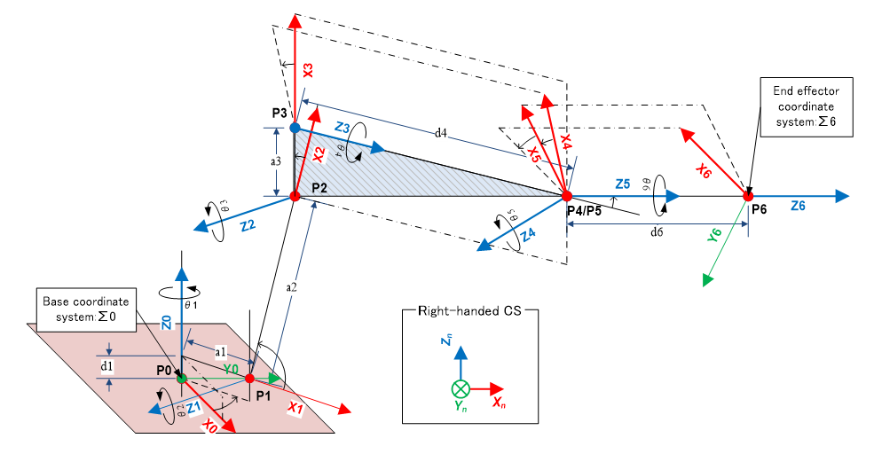
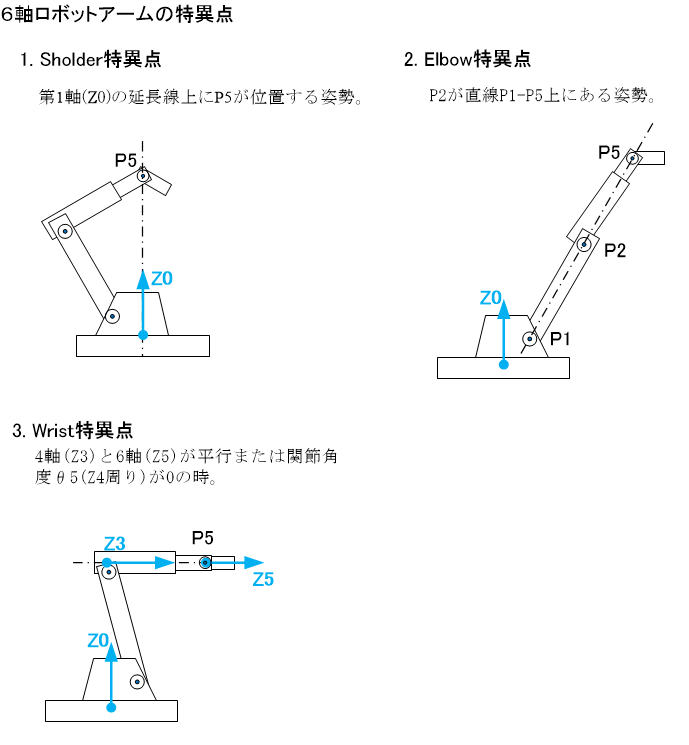
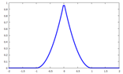

# ロボットマニピュレータ制御のアルゴリズム3
(株)豆蔵　エンジニアリングソリューション事業部　石井隆寛

## 1. はじめに
（株）豆蔵では様々なロボット技術を開発している。他社製ロボットを用いてクライアントの要望に応える応用技術を開発することが多いが、自社でも6軸や7軸のアームを持つ産業用ロボット、いわゆるロボットアーム＝マニピュレータを一から開発している。この開発を通じて様々な応用技術や提案を生み出している。今回ここで得た知見を読者の方と共有したいと思う。本解説では6軸の産業用垂直多関節型マニピュレータを例にしてこれを制御するさまざまなしくみを説明したい。

今回は、これまで説明してきた[軌跡生成処理アルゴリズム][1]を適用してロボットアームを動作させたとき、必ず問題となる「特異点」について理論も含めて解説する。また、その解決方法、いわゆる「特異点回避」の方法の一例を紹介する。

[1]:https://developer.mamezou-tech.com/robotics/manip-algo2/manip-algo2/

## 2. ロボットアームの特異点
## 特異点とは？
これまで述べてきたようにロボットアームは6個の関節軸を動かすことにより様々な姿勢をとり、ツール先端（TCP=Tool Center Point ）の位置や姿勢（向き、方向）を変えることができる。しかしある特定の姿勢に近づく、あるいはそれから遠ざかるとき、突然一部のアームが急激な動作をとりサーボモータや減速機に無理な負荷をかけたり、大きな振動を生じさせたりすることがある。その特定の姿勢状態をロボットアームの「特異点」と呼ぶ。本稿で取り上げている6軸の産業用垂直多関節型マニピュレータの場合、経験的に下記の3つの特異点が知られている。

1. Shoulder特異点
2. Elbow特異点
3. Wrist特異点

下記のようなマニピュレータのジオメトリにおいて、（※Z軸は各関節での回転軸）

これら3つの特異点は下記のように定義されている。

これらの特異点の姿勢に近くなると、アームの動きに不都合が生じる。例えば、「3.Wrist特異点」の姿勢からTCPの向きは変えないようZ4軸（Bn軸）方向（この絵では紙面の裏から表方向）にゆっくりと移動させると、P3とP4の間のアームがZ3軸（Rt軸）周りに急激に回転する。この回転角度は一瞬で90度近くになる。このときP3より先にある部材はかなりの重量があるのでRt軸のサーボモータに急激な負荷がかかり、場合によっては大きな振動を発生することがある。

## 特異点の数学的説明

以上のような特異点とは一体何なのか、数学的に説明してみよう。

まず、以前説明した「速度の順運動学/逆運動学計算」に関する記述で紹介したヤコビ行列とその利用方法を再掲する。

* $\vec{P_t}$：TCP位置
* $\vec{P_0}$：ベース座標系原点位置
* ”$\times$"はベクトル積
* 右肩のＴは行列の転置を表す。

$$
J=\left(
\begin{array}{ccccc}
 [\vec{Z_0} \times (\vec{P_t}-\vec{P_0})]^T & [\vec{Z_1} \times (\vec{P_t}-\vec{P_1})]^T & [\vec{Z_2} \times (\vec{P_t}-\vec{P_2})]^T & ... &[\vec{Z_5} \times (\vec{P_t}-\vec{P_5})]^T\\
 \vec{Z_0}^T  & \vec{Z_1}^T & \vec{Z_2}^T & ... & \vec{Z_5}^T\\
 \end{array}
\right)
$$

このヤコビ行列を用いて下記のように関節軸速度からTCPの並進速度と回転速度が計算できる。
* $\omega_i$ {i=1,2,...,6}：各関節軸での角速度
* $\vec{v_t}$：TCPの3次元並進速度ベクトル
* $\vec{w_t}$：TCPの3次元回転速度ベクトル
* $\vec{\omega}$:各関節軸の角速度を表す6次元縦ベクトル
* $\vec{v}$:TCPの速度を表す6次元縦ベクトル
  

$$
\Omega=( \omega_1, \omega_2 , \omega_3 , \omega_4 , \omega_5 , \omega_6  )
$$
$$
\vec{\omega}=\Omega^T
$$
$$
\vec{v}=
\left(
\begin{array}{c}
 {\vec{v_t}^T} \\
 {\vec{w_t}^T} \\
 \end{array}
\right)
$$
$$
\vec{v}=J \vec{\omega}
$$
$$
\vec{\omega} =J^{-1} \vec{v}
$$
$J$はロボットアームの瞬間的な姿勢で決まるが、これの逆行列 $J^{-1}$が求まらないことがある。このときTCPの移動量$\vec{v}$がどうであれ、関節軸の回転量$\vec{\omega}$が不定となる。そもそも逆行列の要素を求めるときは、行列式の値で割る操作が必要なので$J^{-1}$が求まらないということは行列式が0つまり、
$$
det[J] = 0
$$
と同義である。それがまさに特異点をとる姿勢である。一方、特異点近くの姿勢においては、その行列式$det[J]$は0に近いが0ではない。そのため一応$J^{-1}$は求まる。しかしその要素は微小の$det[J]$で割ったものであるため巨大な数値になりえる。そのため
$$
\vec{\omega} =J^{-1} \vec{v}
$$
を計算すると、TCPの移動量$\vec{v}$が小さくても関節角度の変化量$\vec{\omega}$の要素が巨大となる。これが特異点近傍で一部のアームが異常な動作を引き起こす理由である。

## 特異点回避
### 主な回避方法
以上のように特異点付近では動作に問題があるため、これらの特異点を何とか回避する方法が考えられてきた。主に以下の方法がある。

1. 特異点に近づくと本来の軌跡（TCPの経路や向き）をやや変える。
2. 特異点に近づくと本来の軌跡を変えないよう全モータの速度を一律に急速に落とす。

上記1.の方法では事前に計画した動作時間通り動く半面、本来の軌跡から逸脱するため精度が損なわれる。また2.の方法では計画通り正確な軌跡をたどるが、事前に予定した時刻よりかなり遅れた動作になってしまう。

さて、産業用ロボットマニピュレータは、工場などの生産現場で使用されることが多いため、時間節約の問題は重要である。また、精度が要求される重要な軌跡では特異点にならないよう、また単なるツールの移動場面でのみ特異点になるよう、注意してプログラミングすれば、1.の方法で構わない。そのため本稿では実際に採用した1.の方法の一例である「特異点低感度運動分解」を利用した特異点回避の方法を説明する。（参考文献1.参照）

### 特異点低感度運動分解による特異点回避

#### 概要

参考文献1.は特異点に近づくと本来の軌跡（TCPの経路や向き）をやや変えるために低感度運動分解行列$J^{*}$を導入する方法である。パラメータで細かくその変え方（感度）を調整することも可能である。この方法を6軸マニピュレータに適用した場合の具体的計算方法を説明する。なお、当該文献では任意の多関節マニピュレータに関して一般的な言及をしており、$J$が正方行列とは言えないため$J^{-1}$の代わりに一般化逆行列（疑似行列）に置き換えて議論されている。しかし、本稿では$J$や$J^{-1}$が正方行列であるので、そのまま置き換えずに式に利用する。

さて、本方法の概要は次のようになる。

正確なTCPの位置と姿勢との誤差を最小にするための条件から、低感度運動分解を行うための低感度運動分解行列$J^{*}$が導出できる。これを$J^
{-1}$の代りに軌跡生成時に用いれば、特異点付近において、TCPの「姿勢」精度を犠牲にする一方TCPの「位置」精度は保つような動作をさせることができる。このとき、どの関節軸も思わぬ急加速はせず滑らかに作動する。その結果、無事に特異点を回避することができる。ちなみに$J^{*}$は特異点近傍から遠ざかると完全に$J^{-1}$と一致する。

#### 特異点低感度運動分解行列$J^*$

導出は省き、結論として、低感度運動分解行列$J^{*}$の定義を以下に示す。

$$
J^{*}=N_{\theta}^{-1}\hat{J}^{T}(\hat{J}\hat{J}^{T} + kI)^{-1}N_{r} 
$$
ここで
$$
\begin{align*}
& \hat{J}= N_r J N_{\theta}^{-1}\\
& k=k_f(k_0, w_0, w_f(J)) \\
& w_f(J)=|det[J]| 

\end{align*}
$$
また、

* $N_θ$ :関節軸の運動の感度を決める6x6の対角行列
  * デフォルト値：$diag(1,1,1,1,1,1)$
* $N_r$ :TCPの運動の感度を決める6x6の対角行列
  * デフォルト値：$diag(a,a,a,b,b,b)$
  * ここで$a=1/V_{max},\quad b=1/W_{max}$
  * $V_{max}$：設計仕様上のTCP最高並進速度
  * $W_{max}$：設計仕様上のTCP最高回転速度
* $k$：ロボットアームの姿勢が特異点に近いかどうかの中村の指標
  * 特異点で$k_0$、特異点から離れると0に漸近
  * 下記が定義
$$
k=k_f(k_0,w_0,w)= \left \{
\begin{array}{ccc}
if(|w/w_0|<1) ~~ k_0(1-|w/w_0|)^2 \\
else ~~~~~~~~~~~~~~ 0
\end{array}
\right.
$$
* 上記関数$k_f()$のグラフ（横軸：$w$, 縦軸：ｋ）
 

ここで$k_0$と$w_0$は制御調整値であり下記指針で決める。

* $k_0$
  *	0.0～1.0で調整可能。デフォルト値：0.01
  * 大きくすると特異点近傍でTCPの移動量に対する$θ$の感応性が小さくなる。また1部の軸の急加速回転は緩和するが、目標軌道からは逸脱しやすくなる。
  * 小さくすると目標軌道への追従が良くなる。
  
* $w_0$
  * 特異点領域と非特異点領域をわける境界基準値
  * $w_0=w_f(J_0)$で算出。この行列$J_0$はWrist特異点姿勢（$θ_5$=0°）を基準として、$θ_5$=10°～30°くらいに変更したときの姿勢に対して算出されたヤコビ行列を使用するとよい。

#### $J^{*}$を利用した軌跡生成アルゴリズム

上記で定義された$J^{*}$を利用して特異点回避可能な軌跡生成を行う具体的な方法について説明する。

まず、ある関節角度セット$\vec{\theta_\tau}$で構成される姿勢に関して算出される$J^*$を
$$
J^{*}=J^*(\vec{\theta_\tau})
$$
と関数表現する。
また、すでに従来の方法で生成している理想的なTCP軌跡$\bold{P}(t)$およびその関節角度の軌跡$\bold{\theta}(t)$を時々刻々と変更し、特異点回避可能な実際の関節角度軌跡 を出力する。そのためTCP軌跡に関してフィードバック制御を行う下記の式を用いる。

QQQQQQQQQQQQQQQQQQQQQQQQQQQQQQQQQQ

1. １次連続：KPでの接線の傾きが連続 
   
	$$\frac{d\vec{F}_{m-1}(m)}{ds}=\frac{d\vec{F}_{m}(m)}{ds};~ \frac{d\vec{F}_m(m+1)}{ds}=\frac{d\vec{F}_{m+1}(m+1)}{ds} ;~...　
	$$

2. ２次連続：KPでの曲率が連続 
   
	$$\frac{d^2\vec{F}_{m-1}(m)}{ds^2}=\frac{d^2\vec{F}_{m}(m)}{ds^2};~ \frac{d^2\vec{F}_m(m+1)}{ds^2}=\frac{d^2\vec{F}_{m+1}(m+1)}{ds^2};~... $$

### 円弧
3点のKP、いいかえれば連続で2区間が指定されると円弧状の滑らかな3次元軌跡を得ることができる。3点が通る円の中心と半径を求め、中心からの移動角度でサンプリングすることで円弧軌跡を算出できる。

実際、この計算を３次元空間上でストレートに処理するのは困難なので、一旦２次元に投影して考える。下記の図でUV座標系はKP$_{[m]}$を原点にして、KP$_{[m-1]}$がU軸に乗るよう、またKP$_{[m+1]}$がUV平面に乗るように配置したものである。

これを定式化すると、下記のようになる。
$$\vec{v}_a=\vec{P}_{KP[m-1]}-\vec{P}_{KP[m]}$$
$$\vec{v}_b=\vec{P}_{KP[m+1]}-\vec{P}_{KP[m]}$$
$$\vec{U}=\vec{v}_a/|\vec{v}_a|$$
$$\vec{W}=\frac{\vec{v}_a \times \vec{v}_b}{|\vec{v}_a||\vec{v}_b|}$$
$$\vec{V}=\vec{W} \times \vec{U} $$

これで、UVW座標系から$\Sigma_0$座標系に変換する4x4の同次行列$T^{WC}_{UV}$を算出できる。つまり、行列の回転行列部に$\vec{U},\vec{V},\vec{W}$、平行移動部に$\vec{P}_{KP[m]}$を代入する。

ここで、さらに図のように$Q_c$を原点として、$Q_1$方向にu軸を置いたuv座標系を規定する。UVW座標系上でu軸、v軸、w軸はそれぞれ
$$
\begin{align*}
& \vec{u}= (-U_c/R, -V_c/R,0 ) \\
& \vec{v}= ( V_c/R, -U_c/R,0) \\
& \vec{w}= (0,0,1)
\end{align*}
$$
と表すことができる。これで、uvw座標系からUVW座標系へ変換するための同次変換行列$T^{UV}_{uv}$が得られる。

さてuvw座標系上で$Q_0$を開始点とする円弧のパラメータ表示は
$$ 
\left(
\begin{array}{ccc}
u \\ v \\ w
\end{array}
\right)
=　\left(
\begin{array}{ccc}
R~ \rm{cos}(-\theta) \\
R~ \rm{sin}(-\theta)\\
0
\end{array}
\right)

$$
となるため、θを$-th_0$から$th_2$まで順にサンプルして、$T^{WC}_{uv}$を使って座標変換すれば3次元上での円弧のサンプル点列を算出できる。

補間処理を行う手続きは以下のようになる。

### 球面線形補間（$\rm{Slerp}$）

まず、Quaternion間のなす角度("$\cdot$"は内積を表す)
それ以外、$\theta \gt \frac{\pi}{2}$のときはQuaternion の逆向き同義性を利用して
$$ 
\begin{align*}
&\theta' = \pi-\theta\\
&k_s(s)=\rm{sin}((1-r(s)) ~ \theta')/\rm{sin}(\theta') \\
&k_e(s)=\rm{sin}(\theta' ~ r(s))/\rm{sin}(\theta') \\
&\bold{q}_{[m]}(s)=k_s(s)~\bold{q}_{[m]} - k_e(s)~\bold{q}_{[m+1]} \\

\end{align*}
$$
と計算する。
この処理の一部は整理して関数化でき、下記のように定義できる。
すなわち、$\bold{q}_0$から$\bold{q}_1$までの線形変化で案分率rのQuaternionは$\rm{Slerp}$関数を使用して$\bold{q}$と計算される。
$$
\bold{q} =\rm{\rm{Slerp}}(r, \bold{q}_0,\bold{q}_{1} ) \\
~ (0 \le r \le 1)
$$

### 滑らかな位置/姿勢軌跡のあてはめ方式
#### 位置軌跡のあてはめ

まず3次スプラインの補間式$\vec{F}_0(s)$を再掲する。

$$\vec{F}_0(s) = \vec{a}_0 + \vec{b}_0*s + \vec{c}_0*s^2 + \vec{d}_0*s^3 　$$

これを下記の条件が成立するよう、連立方程式をたて、係数 $\vec{a}_0, \vec{b}_0, \vec{c}_0, \vec{d}_0$を未知数として方程式を解く。この求解も一意の計算で実行可能である。

1. ０次連続：

	$$\vec{Q}_1=\vec{F_0}(0);~ \vec{Q}_{2}=\vec{F_0}(1)$$
2. １次連続：KPでの接線の傾きが連続 
   
	$$\vec{V}_{q1}=\frac{d\vec{F}_0(0)}{ds};~ \vec{V}_{q2}=\frac{d\vec{F}_0(1)}{ds}$$

以上をまとめると、

1. KP$_{[m-1]}$からKP$_{[m]1}$までは区間m-1での元の軌跡を使い、
2. KP$_{[m]1}$からKP$_{[m]2}$までは上記スプライン曲線を使い、
3. KP$_{[m]2}$からKP$_{[m+1]}$までは区間mでの元の軌跡を使う

ことにより、滑らかに連続した一連の軌跡となる。滑らかにしたいKPからの距離$L_1$と$L_2$を調整することにより平滑の具合を調整できるのがこの方法の特徴である。このとき速度プロファイル（正確には速度ベクトルのノルムのプロファイル）においても変形が必要である。元の2区間分の2つの速度プロファイルを並べたあとKP$_{[m]1}$からKP$_{[m]2}$までの間は、

1) なるべく一定速度で移動する。
2) 正確にスプライン曲線の距離分移動する。

ように変形を加える。なお、距離とは速度プロファイルの積分、つまり区間の面積に相当することに注意。

ところで、本方式では1か所の平滑化を施すために、計算の最初に2本分の軌跡データが必要であるが、結局その一部は後に不要となる。その分の計算負荷とメモリが負担となることを実装時には留意されたい。

#### 姿勢のあてはめ
前後の姿勢軌跡が全域で滑らかに変化するよう一部の軌跡を滑らかにする方法である。例えば、下記のような方法がとれる。

KP$_{[m]}$を区間境界として、$\bold q_{[m-1]}$,  $\bold q_{[m]}$, $\bold q_{[m+1]}$がそれぞれKP$_{[m-1]}$、KP$_{[m]}$、KP$_{[m+1]}$でのQuaternionとして、

$$
\begin{align*}
& \bold q_{[m]1} = \rm{Slerp}(1-w, \bold q_{[m-1]}, \bold q_{[m]} ) \\
& \bold q_{[m]2} = \rm{Slerp}(w, \bold q_{[m]}, \bold q_{[m+1]} )
\end{align*}
$$
を算出する。ここで、$w$は比較的小さな値(0.3くらい)である。そのため、$\bold q_{[m]1}$は区間m-1の途中でややKP$_{m}$よりの姿勢、また$\bold q_{[m]2}$は区間mの途中でややKP$_{m}$よりの姿勢になる。このあと下記の補間方法で滑らかな姿勢変化の軌跡$\bold q$を計算する。
すなわち
$$
\begin{align*}
& \bold q_1 = \rm{Slerp}(t, \bold q_{[m]1}, \bold q_{[m]} ) \\
& \bold q_2 = \rm{Slerp}(t, \bold q_{[m]}, \bold q_{[m]2} )　\\
& \bold q = \rm{Slerp}(t, \bold q_1, \bold q_2 )　\\
\end{align*}
$$
このときパラメータtを0から1まで変化させながら、$\bold q$を漸次サンプルすれば、滑らかなQuaternion列が求まる。これを区間m-1の大円円弧のうち$\bold q_{[m-1]}～\bold q_{[m]1}$部分と区間mの大円円弧のうち$\bold q_{[m]2}～\bold q_{[m+1]}$部分とを合わせて滑らかな姿勢の軌跡とする。

### 速度重ね方式

ここで前方側の台形（右半分）を後方（左方向）にずらす時間をoverlap時間$t_{ov}$とする。これを大きくすればなるべく速度を落とさず当該KP付近を$t_{ov}$分、短時間に通過できる。

さて一般的に、下記の式のように速度$\vec {V}$の時間積分で位置$\vec{P}(t)$が算出できる。
$$
\vec{P}(t) =\int_{ts}^{te} \vec{V}(t) dt　+\vec {P}_s
$$

この関係をうまく利用すれば元の軌跡曲線の位置・姿勢の時系列から速度重ねの状態を表す滑らかな時系列を算出できる。

ここでは具体的な証明はしないが、次のような結論を得る。上記図のような状態で$\vec{P}(t)$、$\bold{R}(t)$を時刻tのときの位置（3次元ベクトル）、姿勢（3x3の回転行列）とすると、速度重ね状態の軌跡の補間式は
$$
\begin{align*}
&(t_m-t_{ov}) \lt t \le t_m  のとき\\
&\vec{P}(t)=\vec{P}_b(t) + \vec{P}_f(t+t_{ov})- \vec {P}_2 \\
&\bold{R}(t)=\bold{R}_f(t+t_{ov})~ \bold{R}^{-1}_2~ \bold{R}_b(t) \\
\end{align*}
$$
と簡単に表せる。なお、$t_m$は元の軌跡をたどったとき、KP$_{[2]}$(=$\vec{P}_2$, $\bold{R}_2$)に到達する時刻である。

従って、時系列サンプルデータがある場合は次のような簡単な処理で平滑化サンプルが得られる。元の軌跡をjでサンプルした前後の位置の時系列$\vec{P}_f[j], \vec{P}_b[j]$、また前後の姿勢の時系列$\bold{R}_f[j], \bold{R}_b[j]$がすでに用意されており、

$$\begin{align*}
& \Delta t：時刻サンプル幅 \\
& j_m：KP[2]でのサンプル点\vec{P}_b[j]または\bold{R}_b[j]のインデックス \\
& ~~~~~\iff  \vec{P}_b[j_m]=\vec{P}_2かつ \bold{R}_b[j_m]=\bold{R}_2　\\
& nj = \rm{round}(\frac{t_{ov}}{\Delta t}) ：overlap時間分のサンプル数\\
\end{align*}$$

とすれば、平滑部は
$$
\begin{align*}
& (j_m-nj) \lt j \le j_m  のとき\\
& \vec{P}[j]=\vec{P}_b[j] + \vec{P}_f[j+nj]- \vec {P}_2 \\
& \bold{R}[j]=\bold{R}_f[j+nj]~ \bold{R}^{-1}_2 ~\bold{R}_b[j] \\
\end{align*}
$$

と補間計算が可能である。直線、円弧、スプラインなどのCP制御の区間と区間の間で平滑化したい場合はこれらの方法が使える。またPTP制御（関節軸主体制御）の区間と区間の間の平滑化の時は$\vec{\Theta}$を$\vec{P}$の代わりに用いれば同じことが可能である。また区間の片方がCP制御もう片方がPTP制御のときはどちらかの制御軌跡に統一した後、本方式を適用することが可能である。

ところで、本方式でも1か所の平滑化を施すために、計算の最初に前後2本分の軌跡データ（しかも時系列サンプルデータ）が必要であるが、結局その一部は後に不要となる。その分の計算負荷とメモリが負担となることを実装時には留意されたい。

## 4. 終わりに

実用的な軌跡生成の方法、また境界付近での平滑化について解説した。ロボットアームにプログラムを与えて動作指示をしたとき、内部でいかなる計算が行われ軌跡生成しているのか、その端緒を示すことができたと思う。実際の実装では、これらを実機で動作させてみて工夫を加えたアルゴリズムに改良したり、高速化や安定化のための改善策を追加したり、例外処理を追加する。

次回は特異点と呼ばれるロボットアームの厄介な特殊姿勢とその回避方法について解説する。

##  参考文献

1. 中村仁彦, 花房秀郎、「関節形ロボットアームの特異点低感度運動分解」, 計測自動制御学会論文集 第20巻 第5号 ( 昭和59年5月 )
2. 遠山 茂樹 (著)、　「ロボット工学 (メカトロニクス教科書シリーズ)」、コロナ社 (1994)
以上
