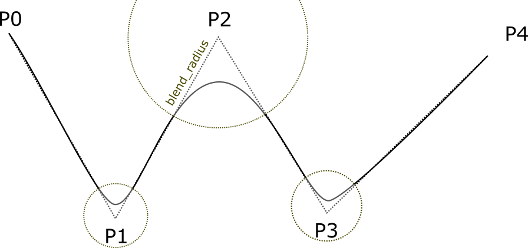

こんにちは。エンジニアリングソリューション事業部の長谷川です。

この記事ではMoveItのモーションプランナーライブラリの1つであるPilz Industrial Motion Plannerを紹介します。MoveItはROSを使用してロボットのマニピュレーションを行う際に非常に便利なツールです。ですが、デフォルトのモーションプランナーを使用する場合、教示点へと到達するたびに動作が一時停止するという課題がありました。
この課題を解決するため、複数の教示点を滑らかに繋いだ軌道に沿って動作させる手段を調べていたところ、Pilz Industrial Motion Plannerに出会いました。
今回はこのプランナーの機能と利点について紹介します。

# Pilz Industrial Motion Plannerの概要
## モーションプランナーの役割

Pilz Industrial Motion Plannerはモーションプランナーの一種です。MoveItを使用したロボットの動作生成において、モーションプランナーは手先の目標位置を受け取り、各関節の角度を計算して目標位置に到達するまでの軌道を生成します。
MoveItで利用できるプランナーのそれぞれの特徴については下記リンクを参照してください。


[MoveItで利用可能なプランナー](https://moveit.ros.org/documentation/planners/)


## ライブラリの特徴

Pilz Industrial Motion PlannerはもともとROS-Industrialのプロジェクトの1つとして開発されたライブラリです。従来の産業用ロボットと同等のインターフェースをROSの世界に持ち込むことをコンセプトに開発され、2020年にMoveItのリポジトリに取り込まれました。

Pilzの特徴は、複数の動作命令をなめらかにつないだ動作（シーケンス動作）が実現できることです。
複数の動作命令を1つのリクエストとして受け取り、動作間で停止することのない滑らかな軌道の生成が可能です。

OMPL等の他のプランナーでは、1つの動作命令ごとにリクエストが完結するため、目標位置へ到達するたびにロボットの動作が停止します。

また、動作間の軌道を平滑化でき、ブレンド半径というパラメータを指定することでなめらか度合いの指定が可能です。
例えばタクトタイムを意識するような現場で、ロボットを少しでも早く動作させたいという場合には、このような直観的なパラメータがあると調整が行いやすいですね。


# 使用できる命令

## 基本のコマンド
Pilz Industrial Motion Plannerには、PTP/LIN/CIRCの3つの基本コマンドがあります。
### PTP

PTP命令はロボットの手先が指定した座標に到達するようにロボットを移動させる命令です。3次元空間上の軌道は指定しません。

### LIN

LIN命令では、動作の開始点から到達点までを結んだ直線に沿うように手先が移動します。
開始点と到達点の間に到達不可能な姿勢がある場合は動作に失敗します。

PTPとLINの軌道の違いは動画で見ると分かりやすいです。

<iframe width="560" height="315" src="https://www.youtube.com/embed/WOL-jQg79Ss?si=nmRluy5_7G89ESVa" title="YouTube video player" frameborder="0" allow="accelerometer; autoplay; clipboard-write; encrypted-media; gyroscope; picture-in-picture; web-share" referrerpolicy="strict-origin-when-cross-origin" allowfullscreen></iframe>


### CIRC

CIRC命令では軌道が円弧を描くような動作を命令できます。
3次元空間上の円弧を定義するには開始点と到達点の２点では足りないため、円弧の中心点を指定する方法か、円弧上の第三の点を指定する方法のいずれかを選択し、座標の情報を与える必要があります。
いずれの方法でも、指定された情報で円弧を定義できない場合は命令がエラーで終了します。


## シーケンス命令

シーケンス命令では、上記の基本コマンドを連続して実行します。
また、下の図のようにブレンド半径が指定できます。ロボットの手先が教示点のブレンド半径内に入ると、教示点へ到達する前に次の教示点へ向かって移動を開始します。




[Pilz Industrial Motion Planner](https://moveit.github.io/moveit_tutorials/doc/pilz_industrial_motion_planner/pilz_industrial_motion_planner.html#user-interface-sequence-capability)のドキュメントから引用。


# 使用方法

実際にPilzのモーションプランナーを使用する方法を説明します。

実行環境はUbuntu 20.04、ディストリビューションはROS1のnoeticを使用しています。

## moveit configの用意
Pilz Industrial Motion Plannerの使用にかかわらず、MoveItを使用する際はロボットに合わせた設定ファイル群を用意する必要があります。
有名なロボットであれば、{ロボットの名前}_moveit_configという名前でファイルがGithubで公開されていますし、URDFファイルが入手できれば、設定ファイルを生成するsetup assistantを使用する選択肢もあります。

公開されているファイルを使用する場合、Pilz用のパラメータが含まれていないことがあるので注意が必要です。
launchフォルダ内に"pilz_industrial_motion_planner_planning_pipeline.launch.xml"が含まれていれば使用可能です。

今回は[prbt](https://wiki.ros.org/pilz_robots)を使用します。
必要なパッケージをインストールします。


```bash
sudo apt update
sudo apt install ros-noetic-pilz-robots
sudo apt install ros-noetic-pilz-industrial-motion
```

## move_groupノードを起動する

move_groupノードを起動します。
起動時のパラメータでpilz_industrial_motion_plannerを指定します。

```bash
roslaunch prbt_moveit_config moveit_planning_execution pipeline:=pilz_industrial_motion_planner
```

上記のprbtのmoveit_configに含まれる[moveit_planning_execution.launch](https://github.com/PilzDE/pilz_robots/blob/noetic-devel/prbt_moveit_config/launch/moveit_planning_execution.launch)では、pipelineのパラメータをコマンドラインから受け取れるようになっていますが、setup assistantで作成したlaunchファイルではそうはなっていません。prbtのlaunchファイルを参考に修正する必要があります。


## 動作命令をリクエストする

立ち上げたmove_groupノードに対してリクエストを送信します。
送信するメッセージの型は[MoveItのドキュメント](https://moveit.github.io/moveit_tutorials/doc/pilz_industrial_motion_planner/pilz_industrial_motion_planner.html#the-ptp-motion-command)に記載があります。
当然、自身でpublisherを書いても良いのですが、Pilzのモーションプランナー用のpythonインターフェースである[pilz_robot_programming](https://wiki.ros.org/pilz_robot_programming)が公開されているので今回はこちらを使用します。

下記はシーケンス命令の実行例です。

```python
#!/usr/bin/env python3
from geometry_msgs.msg import Pose, Point
from pilz_robot_programming import *
import math
import rospy

__REQUIRED_API_VERSION__ = "1"  # API version
__ROBOT_VELOCITY__ = 0.3      # velocity of the robot

# main program
def start_program():
    frange_front_orientation = from_euler(math.radians(90), math.radians(-90), math.radians(0))
    
    blend_sequence= Sequence()
    
    blend_sequence.append(Lin(goal=Pose(position=Point(-0.1, -0.55, 0.35),orientation=frange_front_orientation), vel_scale=__ROBOT_VELOCITY__), blend_radius=0.04)
    blend_sequence.append(Lin(goal=Pose(position=Point(0., -0.55, 0.55),orientation=frange_front_orientation), vel_scale=__ROBOT_VELOCITY__), blend_radius=0.08)
    blend_sequence.append(Lin(goal=Pose(position=Point(0.1, -0.55, 0.35),orientation=frange_front_orientation), vel_scale=__ROBOT_VELOCITY__), blend_radius=0.12)
    blend_sequence.append(Lin(goal=Pose(position=Point(0.2, -0.55, 0.55),orientation=frange_front_orientation), vel_scale=__ROBOT_VELOCITY__))
   
    r.move(blend_sequence)
    
    
if __name__ == "__main__":
    # init a rosnode
    rospy.init_node('robot_program_node')

    # initialisation
    r = Robot(__REQUIRED_API_VERSION__) 
    
    # start the main program
    start_program()
```

実行すると次の動画のように動作します。
この例では4つのLIN命令をシーケンス命令でまとめて実行しています。
`blend_radius`引数の値を0.04、0.08、0.12と3パターン用意しましたが、値が大きいほど軌道の接続が滑らかになることが分かります。


<iframe width="560" height="315" src="https://www.youtube.com/embed/NyyHtrfrbfQ?si=MRQjsobOin-s3r2F" title="YouTube video player" frameborder="0" allow="accelerometer; autoplay; clipboard-write; encrypted-media; gyroscope; picture-in-picture; web-share" referrerpolicy="strict-origin-when-cross-origin" allowfullscreen></iframe>


余談ですが、こちらの動画では7秒付近で第4軸、第6軸が急動作しています。
これはLINやCIRCの動作において生じる、特異点と呼ばれる到達不可能な姿勢の付近を通るためです。
今回はシミュレーション環境なので動作できていますが、実機では動作不可能な速度であるため、特異点を回避する必要があります。
特異点については[ロボットマニピュレータ制御のアルゴリズム](https://developer.mamezou-tech.com/robotics/manip-algo2/manip-algo2/#4-%E7%B5%82%E3%82%8F%E3%82%8A%E3%81%AB)の連載記事で解説する予定です。


## 参考

[pilz_robots/Tutorials - ROS Wiki](http://wiki.ros.org/pilz_robots/Tutorials)
[pilz_robot_programming 0.5.0 documentation](https://docs.ros.org/en/noetic/api/pilz_robot_programming/html/)
