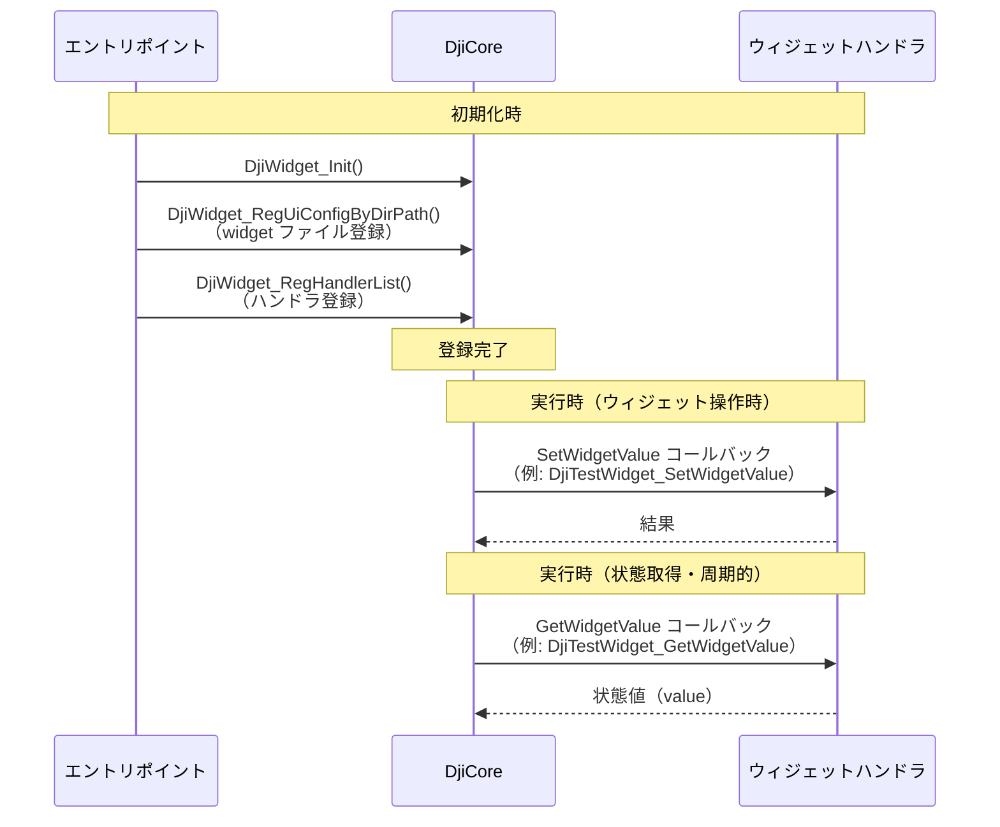

## はじめに

豆蔵では太陽光発電パネルの清掃ロボットシステムの開発に取り組んでいます。

本システムは、太陽光発電パネルを清掃するロボットと、それを搬送するドローンで構成されています。本記事では、ドローン側の開発に用いる [Payload SDK](https://developer.dji.com/doc/payload-sdk-tutorial/en/tutorial-map.html) を使って、送信機にカスタムウィジェットを表示する方法を紹介します。

Payload SDK の概要は以下の記事でも紹介しています。あわせて参照してください。

@[og](https://developer.mamezou-tech.com/robotics/solar-panel-clean-robot/dji-drone-psdk-introduction/)

## カスタムウィジェットとは

ペイロードデバイスを機体に搭載して使う場合、ユーザーがペイロードに対して操作指示を出したり、状態を確認したりしたい場面は多いでしょう。

DJI のドローンシステムでは、UI として DJI 製の送信機（DJI Pilot 2 が動作）や [Mobile SDK](https://developer.dji.com/mobile-sdk/) で開発したアプリケーションが使われます。

カスタムウィジェットは、これらの UI に独自のウィジェットを組み込むための仕組みです。

送信機を使う場合のシステム構成のイメージは以下のとおりです。


サードパーティ製のペイロードデバイスの SBC 内のアプリケーションが Payload SDK を介してウィジェットの定義を機体へ提供します。
送信機内で動作する DJI Pilot 2 は機体から自動でウィジェットの定義を取得し、UI へウィジェットを表示します。

本記事では、[DJI のチュートリアル](https://developer.dji.com/doc/payload-sdk-tutorial/en/function-set/basic-function/custom-widget.html) をベースに、カスタムウィジェットでできることを紹介していきます。

## カスタムウィジェットのサンプルコードによるデモ

[Payload SDK のリポジトリ](https://github.com/dji-sdk/Payload-SDK) には、SDK の各機能ごとにサンプルコードが含まれています。

カスタムウィジェットのサンプルコードは次のパスにあります。

- [Payload-SDK/samples/sample_c/module_sample/widget/](https://github.com/dji-sdk/Payload-SDK/blob/master/samples/sample_c/module_sample/widget/)

以下はサンプルコードを実行したときのデモ動画です。

DJI Pilot 2 のカメラビュー左側のメインメニューに「PSDK」が追加されています。

<a href="https://youtu.be/uJdoqYUyc-0"></a>

右上の設定ボタンを押すと、右側の設定メニューにも「PSDK」が表示されます。

<a href="https://youtu.be/P9zsJkX1biQ"></a>

サンプルではウィジェット操作時のコールバックがモック実装のため、ボタン押下時の実際の動作はありませんが、UI がどのように拡張されるかはイメージしやすいと思います。

## カスタムウィジェットのファイル構成

サンプルディレクトリ（[Payload-SDK/samples/sample_c/module_sample/widget/](https://github.com/dji-sdk/Payload-SDK/blob/master/samples/sample_c/module_sample/widget/)）のファイル構成は以下のとおりです。

```bash
├── test_widget.c
├── test_widget.h
└── widget_file
    ├── cn_big_screen
    │   ├── icon_button1.png
    │   ├── icon_button2.png
    │   ├── icon_list_item1.png
    │   ├── icon_list_item2.png
    │   ├── icon_scale.png
    │   ├── icon_switch_select.png
    │   ├── icon_switch_unselect.png
    │   └── widget_config.json
    └── en_big_screen
        ├── icon_button1.png
        ├── icon_button2.png
        ├── icon_list_item1.png
        ├── icon_list_item2.png
        ├── icon_scale.png
        ├── icon_switch_select.png
        ├── icon_switch_unselect.png
        └── widget_config.json
```

`widget_config.json` がカスタムウィジェットの定義ファイルで、PNG ファイルがアイコンとして使われます。

UI の言語ごとにディレクトリが分かれており、中国語向けが `cn_big_screen`、英語向けが `en_big_screen` です。送信機の言語設定に応じて、参照されるディレクトリが切り替わります。

すべての言語向けに定義を作る必要はなく、デフォルトのディレクトリを指定できます。サンプルでは `en_big_screen` をデフォルトとしており、前述のデモでは送信機が日本語設定だったため `en_big_screen` が参照されていました。

`test_widget.c` には、SDK から呼ばれるコールバック用のハンドラが実装されています。ハンドラ内で、ボタン押下時の処理や UI に表示する値を返す処理を記述します。

## カスタムウィジェットの初期化処理の流れ

サンプルアプリケーションを起動すると、各機能用のコンソールメニューが表示されます。カスタムウィジェットは、起動後に自動で機体へアップロードされ、DJI Pilot 2 に表示されます。

```bash
0.016	            core	[Info]	               dji_core.c:113  Payload SDK Version : V3.15.0-beta.0-build.2318 Dec 10 2025 17:27:05
1.075	         adapter	[Info]	     dji_access_adapter.c:351  Identify mount position type is Extension Port Type
1.075	         adapter	[Info]	     dji_access_adapter.c:371  Identify aircraft series is Matrice 4 Series
1.578	         adapter	[Info]	     dji_access_adapter.c:493  Identity uart0 baudrate is 921600 bps
1.582	            core	[Info]	    dji_identity_verify.c:627  Updating dji sdk policy file...
...(omit)
12.455	            core	[Info]	               dji_core.c:328  Start dji sdk application
12.455	            user	[Info]	          application.cpp:372  Application start.

| Available commands:                                                                              |
| [0] Fc subscribe sample - subscribe quaternion and gps data                                      |
| [1] Flight controller sample - you can control flying by PSDK                                    |
| [2] Hms info manager sample - get health manger system info by language                          |
| [a] Gimbal manager sample - you can control gimbal by PSDK                                       |
| [c] Camera stream view sample - display the camera video stream                                  |
| [d] Stereo vision view sample - display the stereo image                                         |
| [e] Run camera manager sample - you can test camera's functions interactively                    |
| [f] Start rtk positioning sample - you can receive rtk rtcm data when rtk signal is ok           |
| [g] Request Lidar data sample - Request Lidar data and store the point cloud data as pcd files   |
| [h] Request Radar data sample - Request radar data                                               |
| [l] Run widget states manager sample, control widget states on other payload                     |
```

以下は、SDK の初期化処理（抜粋）です。

[Payload-SDK/samples/sample_c++/platform/linux/raspberry_pi/application/application.cpp](https://github.com/dji-sdk/Payload-SDK/blob/326b8698dd98d5451fc14cfc952976795d37bd66/samples/sample_c%2B%2B/platform/linux/raspberry_pi/application/application.cpp#L330)

```c
void Application::DjiUser_ApplicationStart()
{
    ...(omit)

    returnCode = DjiCore_SetAlias("PSDK_APPALIAS");  // ペイロード名（UI表示用）
    if (returnCode != DJI_ERROR_SYSTEM_MODULE_CODE_SUCCESS) {
        throw std::runtime_error("Set alias error.");
    }

    ...(omit)

    returnCode = DjiTest_WidgetStartService();  // ウィジェットサービス開始
    if (returnCode != DJI_ERROR_SYSTEM_MODULE_CODE_SUCCESS) {
        USER_LOG_ERROR("widget sample init error");
    }
```

`DjiCore_SetAlias` で指定した `PSDK_APPALIAS` は、ペイロードデバイス名として UI に表示されます。`DjiTest_WidgetStartService` は、前述の `test_widget.c` で定義されている関数です。

以下は `DjiTest_WidgetStartService` の抜粋です。`widget_file` のディレクトリパスを SDK に設定し、各ウィジェットの操作時コールバックと表示値を返すコールバックのハンドラを登録しています。`s_widgetHandlerList` のインデックス 0〜8 は、`widget_config.json` で定義した各ウィジェットの `widget_index` と対応します。

[Payload-SDK/samples/sample_c/module_sample/widget/test_widget.c](https://github.com/dji-sdk/Payload-SDK/blob/e8041ad6ea468db3346379f771f78c0636994aa8/samples/sample_c/module_sample/widget/test_widget.c#L112)

```c
static const T_DjiWidgetHandlerListItem s_widgetHandlerList[] = {
    {0, DJI_WIDGET_TYPE_BUTTON,        DjiTestWidget_SetWidgetValue, DjiTestWidget_GetWidgetValue, NULL},
    {1, DJI_WIDGET_TYPE_LIST,          DjiTestWidget_SetWidgetValue, DjiTestWidget_GetWidgetValue, NULL},
    {2, DJI_WIDGET_TYPE_SWITCH,        DjiTestWidget_SetWidgetValue, DjiTestWidget_GetWidgetValue, NULL},
    {3, DJI_WIDGET_TYPE_SCALE,         DjiTestWidget_SetWidgetValue, DjiTestWidget_GetWidgetValue, NULL},
    {4, DJI_WIDGET_TYPE_BUTTON,        DjiTestWidget_SetWidgetValue, DjiTestWidget_GetWidgetValue, NULL},
    {5, DJI_WIDGET_TYPE_SCALE,         DjiTestWidget_SetWidgetValue, DjiTestWidget_GetWidgetValue, NULL},
    {6, DJI_WIDGET_TYPE_INT_INPUT_BOX, DjiTestWidget_SetWidgetValue, DjiTestWidget_GetWidgetValue, NULL},
    {7, DJI_WIDGET_TYPE_SWITCH,        DjiTestWidget_SetWidgetValue, DjiTestWidget_GetWidgetValue, NULL},
    {8, DJI_WIDGET_TYPE_LIST,          DjiTestWidget_SetWidgetValue, DjiTestWidget_GetWidgetValue, NULL},
};

...(omit)

T_DjiReturnCode DjiTest_WidgetStartService(void)
{
    T_DjiReturnCode djiStat;
    T_DjiOsalHandler *osalHandler = DjiPlatform_GetOsalHandler();

    //Step 1 : Init DJI Widget
    djiStat = DjiWidget_Init();
    if (djiStat != DJI_ERROR_SYSTEM_MODULE_CODE_SUCCESS) {
        USER_LOG_ERROR("Dji test widget init error, stat = 0x%08llX", djiStat);
        return djiStat;
    }

    ...(omit)

    //set default ui config path
    djiStat = DjiWidget_RegDefaultUiConfigByDirPath(tempPath);
    if (djiStat != DJI_ERROR_SYSTEM_MODULE_CODE_SUCCESS) {
        USER_LOG_ERROR("Add default widget ui config error, stat = 0x%08llX", djiStat);
        return djiStat;
    }

    //set ui config for English language
    djiStat = DjiWidget_RegUiConfigByDirPath(DJI_MOBILE_APP_LANGUAGE_ENGLISH,
                                             DJI_MOBILE_APP_SCREEN_TYPE_BIG_SCREEN,
                                             tempPath);
    if (djiStat != DJI_ERROR_SYSTEM_MODULE_CODE_SUCCESS) {
        USER_LOG_ERROR("Add widget ui config error, stat = 0x%08llX", djiStat);
        return djiStat;
    }

    //set ui config for Chinese language
    djiStat = DjiWidget_RegUiConfigByDirPath(DJI_MOBILE_APP_LANGUAGE_CHINESE,
                                                DJI_MOBILE_APP_SCREEN_TYPE_BIG_SCREEN,
                                                tempPath);
    if (djiStat != DJI_ERROR_SYSTEM_MODULE_CODE_SUCCESS) {
        USER_LOG_ERROR("Add widget ui config error, stat = 0x%08llX", djiStat);
        return djiStat;
    }

    //Step 3 : Set widget handler list
    djiStat = DjiWidget_RegHandlerList(s_widgetHandlerList, s_widgetHandlerListCount);
    if (djiStat != DJI_ERROR_SYSTEM_MODULE_CODE_SUCCESS) {
        USER_LOG_ERROR("Set widget handler list error, stat = 0x%08llX", djiStat);
        return djiStat;
    }
```

言語設定の識別子（`DJI_MOBILE_APP_LANGUAGE_ENGLISH` など）は [dji_typedef.h](https://github.com/dji-sdk/Payload-SDK/blob/e8041ad6ea468db3346379f771f78c0636994aa8/psdk_lib/include/dji_typedef.h#L237) に定義されています。

```c
/**
 * @brief Mobile APP system language.
 */
typedef enum {
    DJI_MOBILE_APP_LANGUAGE_UNKNOWN             = 255, /*!< The system language of the mobile app is unknown */
    DJI_MOBILE_APP_LANGUAGE_ENGLISH             = 0, /*!< The system language of the mobile app is English */
    DJI_MOBILE_APP_LANGUAGE_CHINESE             = 1, /*!< The system language of the mobile app is Chinese */
    DJI_MOBILE_APP_LANGUAGE_JAPANESE            = 2, /*!< The system language of the mobile app is Japanese */
    DJI_MOBILE_APP_LANGUAGE_FRENCH              = 3, /*!< The system language of the mobile app is French */
} E_DjiMobileAppLanguage;
```

サンプルでは日本語（`DJI_MOBILE_APP_LANGUAGE_JAPANESE`）用の UI 設定を登録していません。そのため、送信機が日本語のときは `DjiWidget_RegDefaultUiConfigByDirPath` で登録したデフォルト（`en_big_screen`）が参照されます。これが前節で述べた「デフォルトのディレクトリ」の挙動です。

次に、ハンドラの実装を見てみましょう。

```c
static T_DjiReturnCode DjiTestWidget_SetWidgetValue(E_DjiWidgetType widgetType, uint32_t index, int32_t value,
                                                    void *userData)
{
    s_widgetValueList[index] = value;
    return DJI_ERROR_SYSTEM_MODULE_CODE_SUCCESS;
}

static T_DjiReturnCode DjiTestWidget_GetWidgetValue(E_DjiWidgetType widgetType, uint32_t index, int32_t *value,
                                                    void *userData)
{
    *value = s_widgetValueList[index];
    return DJI_ERROR_SYSTEM_MODULE_CODE_SUCCESS;
}
```

`s_widgetValueList` は、ウィジェットのインデックスを添字とする配列です。UI でウィジェットを操作すると `DjiTestWidget_SetWidgetValue` が呼ばれ、操作に対応する値が `value` として渡されます。`DjiTestWidget_GetWidgetValue` は周期的に呼ばれ、ウィジェットの状態を `value` で返します。

サンプルでは `SetWidgetValue` で受け取った値を保持し、`GetWidgetValue` でそのまま返しているだけです。そのため、スイッチの ON/OFF 操作で表示が即座に切り替わります。

たとえば、スイッチの ON 操作で外部機器を制御する場合、機器の状態が変わるまでは表示を OFF にしておきたいときがあります。そのときは `GetWidgetValue` で実際の機器状態に応じた値を返すとよいでしょう。

DjiCore へのウィジェットファイル・ハンドラの登録、およびウィジェット操作時・状態取得（周期呼び出し）時のコールバックの流れは次のとおりです。アプリケーション側の開発対象は、エントリポイントとウィジェットハンドラです。



## widget_config.json の解説

本節では、サンプルアプリの `widget_config.json` を例に、定義ファイルの構成を説明します。詳細は [Payload SDK チュートリアル（Custom Widget）](https://developer.dji.com/doc/payload-sdk-tutorial/en/function-set/basic-function/custom-widget.html) を参照してください。

**トップレベルの構成**

- **version** … 設定フォーマットのバージョン（major / minor）。
- **ar_config** … チュートリアルおよび API 仕様に記載がないため、本記事では説明を省略する。
- **main_interface** … メインメニューに表示するウィジェットの定義。
- **config_interface** … 設定メニューに表示するウィジェットの定義。

**main_interface**

メインメニュー用の設定です。`floating_window`（フローティング画面の表示有無）と `speaker`（TTS／音声）のほか、`widget_list` でウィジェットを並べます。サンプルでは `widget_index` 0〜3 の 4 つ（Button, List, Switch, Scale）を定義しています。

メニュー上部に表示されるペイロードデバイス名は、前述の `DjiCore_SetAlias` で設定した文字列です。


**config_interface**

設定メニュー用の設定です。`text_input_box`（テキスト入力の有無やプレースホルダー）と `widget_list` でウィジェットを定義します。サンプルでは `widget_index` 4〜8 の 5 つ（Button／Scale／Integer Input Box／Switch／List）を定義しています。


**widget_list の各要素**

各ウィジェットは少なくとも次のプロパティを持ちます。

| プロパティ | 説明 |
| ---------- | ------ |
| widget_index | ウィジェットのインデックス。ハンドラ登録時の `s_widgetHandlerList` のインデックスと対応し、コールバックでどのウィジェットかを識別するために使います。 |
| widget_type | ウィジェット種別。`button`・`list`・`switch`・`scale`・`int_input_box` の 5 種類があります。 |
| widget_name | UI に表示する名前。 |

このほか、種別に応じて次のプロパティを指定できます。

| ウィジェット種別 | 追加プロパティ | 説明 |
| ----------------- | ---------------- | ------ |
| button | `icon_file_set` | `icon_file_name_selected` と `icon_file_name_unselected` に PNG ファイル名を指定。GetWidgetValue が返す value が 1 のとき選択時、0 のとき非選択時のアイコンが表示される。同一ディレクトリを参照。 |
| list | `list_item` | 配列で各項目の `item_name` を指定。各項目に `icon_file_set` を指定可能。 |
| switch | `icon_file_set` | button と同様。 |
| scale | `icon_file_set`、`customize_rc_buttons_config` | アイコンは button と同様。`button_value_step_length` で送信機ボタン操作時のステップ幅を指定。 |
| int_input_box | `int_input_box_hint` | 単位などのヒント文字列（例: `"unit:s"`）を指定。 |

## アイコン仕様

DJI Pilot 用のカスタムウィジェットでは、アイコンに次のデザイン仕様が推奨されています。

**サイズ・フレーム**

| 項目 | 推奨値 |
| ----- | ------ |
| アイコン標準サイズ | 96px |
| ボトムフレーム（サイズ） | 80px |
| ボトムフレーム（背景色） | <span style="display:inline-block;width:1.2em;height:1.2em;background:#000000;vertical-align:middle;border:1px solid #666;"></span> #000000（黒） |
| ボトムフレーム（不透明度） | 0.6（アルファ。0＝完全透明、1＝完全不透明。約 60% の不透明度で半透明） |
| ボトムフレーム（ブラー） | 4（枠のぼかし強さ。エッジが柔らかく表示される） |
| 円形要素のストローク（線の太さ） | 4px 程度 |

ボトムフレームは、仕様で示されているアイコン表示用の枠です。

**表示状態と色**

アイコンは表示状態に応じて次の色で表現します。`icon_file_name_selected` / `icon_file_name_unselected` および GetWidgetValue コールバックが返す value に対応します。

| 状態 | 色（HEX） | 説明 |
| ----- | --------- | ------ |
| Normal（非選択） | <span style="display:inline-block;width:1.2em;height:1.2em;background:#4E4E4E;vertical-align:middle;border:1px solid #ccc;"></span> #4E4E4E | 非選択時（value が 0 のとき） |
| Active（選択） | <span style="display:inline-block;width:1.2em;height:1.2em;background:#1FA3F6;vertical-align:middle;border:1px solid #ccc;"></span> #1FA3F6 | 選択時（value が 1 のとき） |
| Disable | <span style="display:inline-block;width:1.2em;height:1.2em;background:#BCBCBC;vertical-align:middle;border:1px solid #999;"></span> #BCBCBC | 無効時 |

:::info:補足
上記の表は UI アイコン仕様全般の記載と考えられます。カスタムウィジェットでは `widget_config.json` で指定できるのは 2 種類のみです。`icon_file_name_selected` と `icon_file_name_unselected` です。Disable 用を SDK に渡す仕組みはありません。**Normal と Active に従い、2 種類のアイコンを用意すれば十分です。**
:::

**形式・レイアウト**

- アイコン形式は **PNG** を使用する。
- 表示領域サイズの例は 48×48、56×56、40×56、56×40 など。実コンテンツを中央に収め、余白を適切にすることが推奨されている。

Sketch 用テンプレート（[psdk_widget.sketch](https://terra-1-g.djicdn.com/71a7d383e71a4fb8887a310eb746b47f/psdk/psdk_widget.sketch)）が DJI から提供されています。アイコン作成時は、これをベースにすることを推奨します。


## まとめ

本記事では、送信機の UI をペイロード用に拡張するカスタムウィジェットの仕組みと、定義ファイル（`widget_config.json`）およびハンドラ登録による実装の流れを紹介しました。

Payload SDK を用いたカスタムペイロードの開発事例はまだ多くなく、チュートリアルだけでは情報が限られるため、「どのような UI が作れるか」が分かりにくい状況にあります。本記事が、ペイロードデバイスを開発しようとしている方の参考になれば幸いです。
