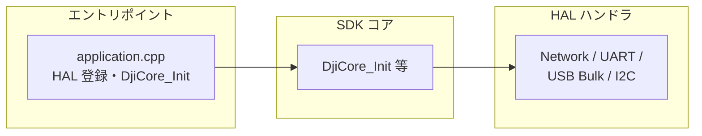
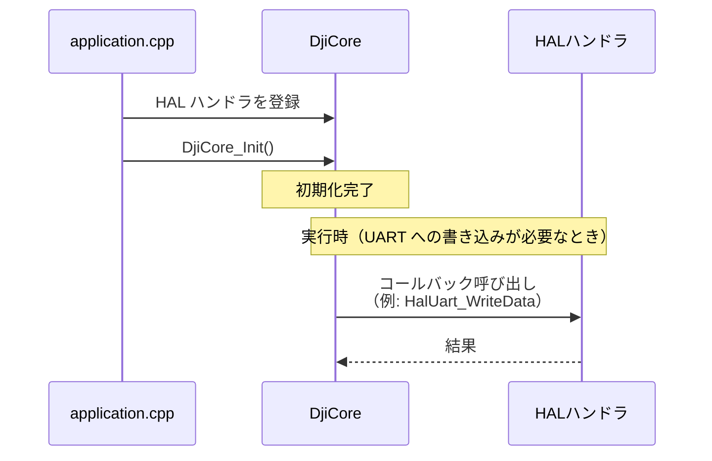

## はじめに

豆蔵では太陽光発電パネルの自動清掃ロボットシステムの開発に取り組んでいます。

本システムでは太陽光パネルを清掃するロボットとロボットを搬送するドローンで構成されており、本記事では、ドローン側の開発技術である [Payload SDK](https://developer.dji.com/doc/payload-sdk-tutorial/en/tutorial-map.html) を紹介します。

## プロジェクトの概要

太陽光パネルの発電効率を最大限に保つためには、表面に堆積する埃や汚れの定期的な除去が不可欠です。
一般家庭用の小規模なパネルであれば手作業での清掃も可能ですが、
メガソーラーなどの大規模な発電施設では、人力による清掃作業は効率面・コスト面で現実的ではありません。


当社では、このような発電施設向けの自律型清掃ロボットを開発しています。

## 清掃ロボットのシステム構成

発電所には連結された太陽光パネルがそれぞれ離れた位置に設置されています。
太陽光パネルは地表から2m以上の高い位置に設置されており、人手でロボットをパネル間で搬送するのは困難です。

そのため、本システムではドローンを使用してロボットを搬送する手法を採用しています。


主な構成要素は以下のとおりです。

### 清掃ロボット

太陽光パネル上をブラシで清掃しながら自律走行する自社開発の AMR です。ドローンの搬送対象（ペイロード）であり、総重量がドローンの可搬重量以内になるように設計しています。[2025 国際ロボット展](https://mamezo.tech/n/10850/) でも展示しました。


### ドローン

[DJI FlyCart 30](https://www.dji.com/jp/flycart-30) を使用しています。可搬重量は、デュアルバッテリーモードで 30 kg（最大飛行時間 18 分）、シングルバッテリーモードで 40 kg（最大飛行時間 9 分）です。

送信機（操作端末）は DJI RC Plus でDJI Pilot 2 というアプリケーションが動作しています。


### ペイロードデバイス

FlyCart 30 に標準で付属している以下の貨物ケースは内寸 573×416×305 mm のため、ロボットを格納できません。そのため、ドローンにロボットを固定するデバイスを開発しています。


## ペイロードデバイスの構成

本システムにおけるペイロードデバイスの主な役割はロボットをドローンに固定することです。

ドローンの送信機の操作でロック機構を制御し、ロボットを固定します。
ロック機構の制御や送信機へのウィジェットの提供はペイロードデバイス内のSBC（シングルボードコンピュータ）が担います。

DJIはペイロードデバイスの開発用に [Payload SDK](https://developer.dji.com/doc/payload-sdk-tutorial/en/tutorial-map.html) というSDKを提供しており、ペイロードデバイスではこのSDKを使用して開発したアプリケーションをSBC上で動作させます。

FlyCart 30の場合は以下のインターフェイスがペイロードデバイス向けに提供されています。

- [E-Port Lite](https://developer.dji.com/doc/payload-sdk-tutorial/en/quick-start/drone-port.html#e-port-lite)
    - USB Type-C のメンテナンス用ポート
    - [DJI Assistant 2](https://www.dji.com/downloads/softwares/dji-assistant-2-for-delivery-series) がインストールされた PC と USB Type-C ケーブルで直接接続し、機体のファームウェア更新やログ収集が可能
    - FlyCart 30 のように E-Port を提供していない機体では、E-Port Lite と SBC を USB to TTL シリアルモジュールで接続し、拡張ポートとして使用が可能
- [Payload Port](https://developer.dji.com/doc/payload-sdk-tutorial/en/quick-start/drone-port.html#flycart-30-payload-port-power-supply-port)
    - ペイロードデバイス向けの電源供給ポート
    - 定格電圧は 51.2 V

本システムのロック機構は開発中のため詳細は割愛します。以下は CAN 対応のサーボを使う場合の構成イメージです。この場合、サーボへの電源供給は Payload Port から行い、SBC が E-Port Lite を介して機体と連携し、サーボを制御します。


## 機体が提供するさまざまな拡張ポート

前述した構成は FlyCart 30 の例です。機体によっては E-Port Lite 以外の拡張ポートを提供しているものもあります。

### [E-Port](https://developer.dji.com/doc/payload-sdk-tutorial/en/quick-start/drone-port.html#e-port)

多くの機体がサポートしている拡張ポートで、電源、UART、USB を提供します。[E-Port Development Kit](https://store.dji.com/jp/product/dji-e-port-development-kit) を中継してカスタムペイロードと接続し、UART や USB の通信が可能になります。

E-Port Lite ではカメラ画像の取得などに制約がありますが、E-Port では Development Kit を中継することで USB が拡張され、多くの機能を利用できます。


### [E-Port V2](https://developer.dji.com/doc/payload-sdk-tutorial/en/quick-start/drone-port.html#e-port-v2-port)

M400（Matrice 400）で提供される拡張ポートです（M400 は 2025年6月発表であり、E-Port V2 は比較的、最近登場したポートです）。E-Port が機体あたり 1 ポートであることが多いのに対し、E-Port V2 は M400 の機体下部に 4 ポートを備え、1 ポートあたり 120 W の電源供給が可能です。電源出力は 13.6 V / 17 V / 24 V の 3 段階で調整できます。USB 3.0 をサポートしており、4K ストリームやレーダーポイントクラウドデータなどを同時に取得可能です。[E-Port V2 Development Kit](https://store.dji.com/jp/product/dji-e-port-v2-development-kit) を中継してカスタムペイロードと接続します。

### [Gimbal Port](https://developer.dji.com/doc/payload-sdk-tutorial/en/quick-start/drone-port.html#gimbal-port)

M300 RTK（2020年5月発表）と M350 RTK（2023年5月発表）のジンバル部に装備される標準インターフェースで、PSDK Port とも呼ばれます。Zenmuse シリーズに代表される DJI 製ジンバルペイロード（カメラ・センサー等）を接続するためのインターフェースです。


サードパーティ向けには [Payload SDK Development Board Kit 2.0](https://store.dji.com/product/psdk-development-kit-v2) が提供されており、これを中継すればカスタムペイロードと接続できます。

### [OSDK Port](https://developer.dji.com/doc/payload-sdk-tutorial/en/quick-start/drone-port.html#osdk-port)

現行機体ではM300 RTK のみが提供する旧来のインターフェースです。E-Port 登場以前の方式であり、[Onboard SDK (OSDK)](https://developer.dji.com/document/30ac6801-db84-46c2-baf2-8ad8d62bf3ba) を利用しますが、OSDK の最終リリースは `2021-02-02(OSDK 4.1.0)` で、新機能の追加は終了しています。

OSDK Port は [OSDK Expansion Module](https://dl.djicdn.com/downloads/matrice-300/20200617/OSDK_Expansion_Module_Product_Information.pdf) 以外に `E-Port Development Kit` との接続もサポートしており、Payload SDK（PSDK）を使用できます。[OSDK Version Support Information](https://developer.dji.com/document/30ac6801-db84-46c2-baf2-8ad8d62bf3ba)（2023年5月9日付）では、**OSDK 4.x の機能はすべて [PSDK V3](https://developer.dji.com/doc/payload-sdk-tutorial/en/) へ移行済みである**とされています。新規開発では PSDK V3 への移行が推奨されています。

## 機体別の拡張ポート

以下は、現行機体が提供している拡張ポートの一覧です。[Standard Hardware Port Introduction](https://developer.dji.com/doc/payload-sdk-tutorial/en/quick-start/drone-port.html#standard-hardware-port-introduction) より抜粋。

| Aircraft | Port Name | Supports App Binding |
| -------- | ----------- | -------------------- |
| FlyCart 100 | E-Port Lite | – |
| M400 | E-Port V2 | ✓ |
| Matrice 4D/4TD | E-Port, E-Port Lite | ✓ |
| Matrice 4E/4T | E-Port, E-Port Lite | ✓ |
| Matrice 3D/3TD | E-Port, E-Port Lite | – |
| FlyCart 30 | E-Port Lite | – |
| Mavic 3E/3T | E-Port | – |
| Matrice 30/30T | E-Port | – |
| M350 RTK | E-Port | – |
| M350 RTK | Gimbal Port | ✓ |
| M300 RTK | OSDK Port | – |
| M300 RTK | Gimbal Port | ✓ |

`Supports App Binding` にチェックが入っている機体は [Application Binding](https://developer.dji.com/doc/payload-sdk-tutorial/en/quick-start/quick-guide/bind-application.html) の手順が必要な機体です。
この手順は別の記事で紹介する予定です。

## ポート種別ごとの機能対応表

下表は、[Aircraft Type Function Difference](https://developer.dji.com/doc/payload-sdk-tutorial/en/model-instruction/choose-develop-platform.html#aircraft-type-function-difference) の一覧から、一部の機体について、ポートごとの対応機能を抜粋したものです。

同じポート種別でも機体によって対応機能は異なるため、「E-Port ならこの機能が使える」のようにポート種別だけでは判断できません。例えば Hoisting Control は、FlyCart 100 の E-Port Lite でのみサポートされています。

| Function Name | Function Level | FlyCart 30 E-Port Lite | Matrice 4E/4T E-Port | Matrice 400 E-Port V2 | Matrice 350 RTK Gimbal Port |
| :--- | :--- | :---: | :---: | :---: | :---: |
| Log Management | basic | ✓ | ✓ | ✓ | ✓ |
| Data Subscription | basic | ✓ | ✓ | ✓ | ✓ |
| Basic Camera Function | basic | - | ✓ | ✓ | ✓ |
| Basic Camera Management | advanced | - | - | ✓ | - |
| Gimbal Function | basic | - | ✓ | ✓ | ✓ |
| Gimbal Management | advanced | - | - | ✓ | - |
| Power Management | basic | ✓ | - | ✓ | ✓ |
| Flight Control | advanced | ✓ | - | ✓ | ✓ |
| Custom Widget | basic | ✓ | ✓ | ✓ | ✓ |
| Custom HMS | basic | ✓ | ✓ | ✓ | ✓ |
| HMS Manager | advanced | ✓ | - | ✓ | ✓ |
| Time Synchronization | basic | - | ✓ | ✓ | ✓ |
| Low-speed Data Transmission | basic | ✓ | ✓ | ✓ | ✓ |
| Camera Video Stream | basic | - | ✓ | ✓ | ✓ |
| Playback Download | basic | - | - | ✓ | ✓ |
| X-Port Function | basic | - | - | ✓ | ✓ |
| Camera Stream Liveview | advanced | - | - | ✓ | - |
| Local Upgrade | basic | - | ✓ | - | ✓ |
| High-speed Data Transmission | basic | - | - | ✓ | - |
| Positioning | basic | - | - | ✓ | ✓ |
| SDK Interconnection | basic | - | - | ✓ | ✓ |
| Waypoint Mission | advanced | ✓ | - | ✓ | - |
| Speaker | basic | ✓ | ✓ | ✓ | ✓ |
| Hoisting Control | basic | - | - | - | - |
| Access Internet | advanced | - | - | ✓ | - |
| Network RTK | advanced | - | - | ✓ | - |

## シリアル通信仕様

Payload SDKはUARTやUSBのシリアル通信を使用します。

USB 通信では USB Gadget（Linux デバイスを USB 機器のデバイス側として振る舞わせる仕組み）を用い、次の 2 種類の通信方式を使い分けます。

- Bulk（USB Bulk Transfer）
    - デバイスとホスト間の双方向の生データ通信
- RNDIS（Remote Network Driver Interface Spec）
    - USB上で Ethernet をエミュレートする規格
    - デバイスとホスト間のIP通信

各ポートのサポート状況は次の表のとおりです。

| Port | Only UART | UART+Bulk | UART+RNDIS | Only Bulk | Only RNDIS |
| ---- | --------- | --------- | ----------- | --------- | ---------- |
| E-Port Lite | ✓ | – | – | – | – |
| E-Port | ✓ | ✓ | ✓ | – | – |
| E-Port V2 | ✓ | – | – | ✓ | ✓ |
| Gimbal Port | ✓ | – | ✓ | – | – |

| 方式 | 説明 |
| ---- | ---- |
| Only UART | UART のみで機体と通信 |
| UART+Bulk | UART と Bulk を併用して機体と通信 |
| UART+RNDIS | UART と RNDIS を併用して機体と通信 |
| Only Bulk | Bulk のみで機体と通信 |
| Only RNDIS | RNDIS のみで機体と通信 |

Bulk のみまたは RNDIS のみで通信できるのは E-Port V2 だけで、それ以外のポートでは UART が必須です。

詳細は以下の DJI Developer Support のページ（中国語）を参照してください。いずれも閲覧には DJI Developer Center でのアカウント登録が必要です。

- [PSDK 各机型硬件连接介绍](https://sdk-forum.dji.net/hc/zh-cn/articles/50341690206105-PSDK-%E5%90%84%E6%9C%BA%E5%9E%8B%E7%A1%AC%E4%BB%B6%E8%BF%9E%E6%8E%A5%E4%BB%8B%E7%BB%8D)
- [树莓派4B配置USB device RNDIS 和 BULK](https://sdk-forum.dji.net/hc/zh-cn/articles/10232604141465-%E6%A0%91%E8%8E%93%E6%B4%BE4B%E9%85%8D%E7%BD%AEUSB-device-RNDIS-%E5%92%8C-BULK)

どのポートでも UART のみで通信できるため、開発初期は UART だけを接続し、Payload SDK で開発したアプリケーションの動作検証から始めることを推奨します。

## Payload SDK の API 仕様

[Payload SDK の API リファレンス](https://developer.dji.com/doc/payload-sdk-api-reference/en/)には、SDKのソースコードのヘッダから自動生成されたと思われる API 仕様が掲載されています。ただし説明文はほとんどなく、関数や型の一覧が中心です。そのため、API仕様を理解するには、サンプルコードを参照しつつ実機で動作を確認する必要があります。

## Payload SDK のサンプルアプリケーション

DJI の [Payload-SDK](https://github.com/dji-sdk/Payload-SDK) リポジトリには、Payload SDK のライブラリとそれを使ったサンプルアプリケーションが公開されています。

### ディレクトリ構成

リポジトリのディレクトリ構成は以下のとおりです。

```
├── psdk_lib
│   ├── include
│   └── lib
│       ├── aarch64-linux-gnu-gcc
│       ├── arm-linux-gnueabi-gcc
│       ├── arm-linux-gnueabihf-gcc
│       ├── armcc_cortex-m4
│       └── x86_64-linux-gnu-gcc
├── samples
│   ├── sample_c
│   │   ├── module_sample
│   │   │   ├── camera_emu
│   │   │   ├── camera_manager
│   │   │   ├── cloud_api
│   │   │   ├── data_transmission
│   │   │   ├── fc_subscription
│   │   │   ├── flight_control
│   │   │   ├── gimbal_emu
│   │   │   ├── gimbal_manager
│   │   │   ├── hms
│   │   │   ├── interest_point
│   │   │   ├── liveview
│   │   │   ├── mop_channel
│   │   │   ├── payload_collaboration
│   │   │   ├── perception
│   │   │   ├── positioning
│   │   │   ├── power_management
│   │   │   ├── tethered_battery
│   │   │   ├── time_sync
│   │   │   ├── upgrade
│   │   │   ├── utils
│   │   │   ├── waypoint_v2
│   │   │   ├── waypoint_v3
│   │   │   ├── widget
│   │   │   ├── widget_interaction_test
│   │   │   └── xport
│   │   └── platform
│   │       ├── linux
│   │       │   ├── common
│   │       │   │   ├── 3rdparty
│   │       │   │   ├── monitor
│   │       │   │   ├── osal
│   │       │   │   └── upgrade_platform_opt
│   │       │   ├── manifold2
│   │       │   │   ├── application
│   │       │   │   └── hal
│   │       │   ├── manifold3
│   │       │   │   ├── app_json
│   │       │   │   ├── application
│   │       │   │   └── hal
│   │       │   ├── nvidia_jetson
│   │       │   │   ├── application
│   │       │   │   └── hal
│   │       │   └── raspberry_pi
│   │       │       ├── application
│   │       │       └── hal
│   │       └── rtos_freertos
│   │           ├── common
│   │           │   └── osal
│   │           ├── gd32f527_development_board
│   │           │   ├── application
│   │           │   ├── bootloader
│   │           │   ├── drivers
│   │           │   ├── hal
│   │           │   ├── middlewares
│   │           │   └── project
│   │           └── stm32f4_discovery
│   │               ├── application
│   │               ├── bootloader
│   │               ├── drivers
│   │               ├── hal
│   │               ├── middlewares
│   │               └── project
│   └── sample_c++
│       ├── module_sample
│       │   ├── camera_manager
│       │   ├── flight_controller
│       │   ├── gimbal
│       │   ├── hms_manager
│       │   ├── liveview
│       │   ├── perception
│       │   ├── positioning
│       │   └── widget_manager
│       └── platform
│           └── linux
│               ├── common
│               │   ├── 3rdparty
│               │   └── osal
│               ├── manifold2
│               │   ├── application
│               │   └── hal
│               ├── manifold3
│               │   ├── application
│               │   └── hal
│               ├── nvidia_jetson
│               │   ├── application
│               │   └── hal
│               └── raspberry_pi
│                   ├── application
│                   └── hal
```

### psdk_lib

プラットフォームごとの静的ライブラリが配置されています。各ツールチェーンについては [Using third-party development platforms](https://developer.dji.com/doc/payload-sdk-tutorial/en/model-instruction/choose-develop-platform.html#using-third-party-development-platforms) を参照してください。Raspberry Pi や Jetson の場合はこのディレクトリ内の `aarch64-linux-gnu-gcc/libpayloadsdk.a` を使用します。ここにないツールチェーンを使う場合は、SDK テクニカルサポート（dev@dji.com）に依頼すれば、そのツールチェーン用の静的ライブラリを用意してもらえるようです。[PSDK platform static library link](https://sdk-forum.dji.net/hc/en-us/community/posts/35228015714073-PSDK-platform-static-library-link-problem-feedback-application) も参照してください。

### samples

#### module_sample

SDK が提供する各機能のサンプルコードが配置されています。カメラ管理・飛行制御・ジンバル・ライブビュー・HMS・位置情報・ウィジェットなど、機能ごとにサンプルが用意されています。

#### platform

プラットフォーム依存のコードがまとめられています。`hal/` に配置されているソースコードは、ハードウェア抽象化レイヤー（HAL）の実装（ネットワーク・UART・USB Bulk・I2C など）です。

サンプルアプリケーションのエントリポイントは `application/main.cpp` です。ここから `application/application.cpp` が呼ばれ、HAL ハンドラの登録や `DjiCore_Init` による SDK のセットアップが行われます。UART・Bulk・RNDIS のいずれを使うかは、登録する HAL ハンドラの組み合わせで決まります。

上記の HAL ハンドラ登録部分（`CONFIG_HARDWARE_CONNECTION` による分岐）の抜粋です。

[Payload-SDK/samples/sample_c++/platform/linux/raspberry_pi/application/application.cpp](https://github.com/dji-sdk/Payload-SDK/blob/326b8698dd98d5451fc14cfc952976795d37bd66/samples/sample_c%2B%2B/platform/linux/raspberry_pi/application/application.cpp#L179)

```cpp
    returnCode = DjiPlatform_RegHalI2cHandler(&i2CHandler);
    if (returnCode != DJI_ERROR_SYSTEM_MODULE_CODE_SUCCESS) {
        throw std::runtime_error("register hal i2c handler error");
    }

#if (CONFIG_HARDWARE_CONNECTION == DJI_USE_UART_AND_USB_BULK_DEVICE)
    returnCode = DjiPlatform_RegHalUartHandler(&uartHandler);
    if (returnCode != DJI_ERROR_SYSTEM_MODULE_CODE_SUCCESS) {
        throw std::runtime_error("Register hal uart handler error.");
    }

    returnCode = DjiPlatform_RegHalUsbBulkHandler(&usbBulkHandler);
    if (returnCode != DJI_ERROR_SYSTEM_MODULE_CODE_SUCCESS) {
        throw std::runtime_error("Register hal usb bulk handler error.");
    }
#elif (CONFIG_HARDWARE_CONNECTION == DJI_USE_UART_AND_NETWORK_DEVICE)
    returnCode = DjiPlatform_RegHalUartHandler(&uartHandler);
    if (returnCode != DJI_ERROR_SYSTEM_MODULE_CODE_SUCCESS) {
        throw std::runtime_error("Register hal uart handler error.");
    }

    returnCode = DjiPlatform_RegHalNetworkHandler(&networkHandler);
    if (returnCode != DJI_ERROR_SYSTEM_MODULE_CODE_SUCCESS) {
        throw std::runtime_error("Register hal network handler error");
    }
#elif (CONFIG_HARDWARE_CONNECTION == DJI_USE_ONLY_USB_BULK_DEVICE)
    returnCode = DjiPlatform_RegHalUsbBulkHandler(&usbBulkHandler);
    if (returnCode != DJI_ERROR_SYSTEM_MODULE_CODE_SUCCESS) {
        throw std::runtime_error("Register hal usb bulk handler error.");
    }

#elif (CONFIG_HARDWARE_CONNECTION == DJI_USE_ONLY_NETWORK_DEVICE)
    returnCode = DjiPlatform_RegHalNetworkHandler(&networkHandler);
    if (returnCode != DJI_ERROR_SYSTEM_MODULE_CODE_SUCCESS) {
        throw std::runtime_error("Register hal network handler error");
    }

    //Attention: if you want to use camera stream view function, please uncomment it.
    returnCode = DjiPlatform_RegSocketHandler(&socketHandler);
    if (returnCode != DJI_ERROR_SYSTEM_MODULE_CODE_SUCCESS) {
        throw std::runtime_error("register osal socket handler error");
    }
#elif (CONFIG_HARDWARE_CONNECTION == DJI_USE_ONLY_UART)
    /*!< Attention: Only use uart hardware connection.
     */
    returnCode = DjiPlatform_RegHalUartHandler(&uartHandler);
    if (returnCode != DJI_ERROR_SYSTEM_MODULE_CODE_SUCCESS) {
        throw std::runtime_error("Register hal uart handler error.");
    }
#endif
```

以下はアプリケーションのレイヤー構成のイメージです。



実行時には、DjiCore が UART への書き込みなどを行う際に、事前に登録した HAL ハンドラがコールバックとして呼ばれます。その流れは次のとおりです。



図中の application.cpp と HALハンドラがサンプルコードに含まれており、DjiCore は psdk_lib の静的ライブラリとして提供されています。

初見ではサンプルコードの割にコード量が多く感じられるかもしれませんが、プラットフォーム依存のコードは基本的にそのまま利用できます。ただし、同じプラットフォームでも、最新の OS や付随するライブラリでは動作しない場合があるため、開発者側での保守が必要です。

## Payload SDK の検証環境

残念ながら、Payload SDK のアプリケーションの動作を確認するには実際の機体が必要です。

DJI Assistant 2 にはフライトをシミュレートする機能がありますが、送信機とペアリングされた機体と接続した状態でしか利用できません。また、Payload SDK の通信先も実際の機体が前提となります。

本番運用で使用する機体と同じポート（E-Port Lite や E-Port）を備えた機種を調達またはレンタルする必要があります。

弊社では本番運用に FlyCart 30 を使用しますが、高価なため開発・デバッグには E-Port Lite を備えた別機種（Matrice 4E など）でアプリケーションを開発しています。

## まとめ

本記事では、太陽光パネル清掃ロボットをドローンで搬送するシステムのうち、ドローン側の開発に用いる Payload SDK を紹介しました。

インターネット上で検索しても Payload SDK に関する資料は DJI 提供のものに限られ、実用的な手順も DJI Developer Support の中国語ページが中心です。弊社でも、アプリケーションを動作するところまで持っていくのに手間がかかりました。同じようにカスタムペイロードの開発に取り組まれる方にとって、本記事がスタート地点の一助となれば幸いです。

飛行状態の取得やウィジェット連携、Application Binding の手順など、Payload SDK の実践的なトピックは続く記事で詳しくお届けする予定です。引き続きお付き合いいただければと存じます。
