# 記事草案
## ソリューション作成
Visual Studio もしくは XAE Shellを開く。  
（今回はVisual Studioを選択）

「新しいプロジェクトの作成」を選択する。
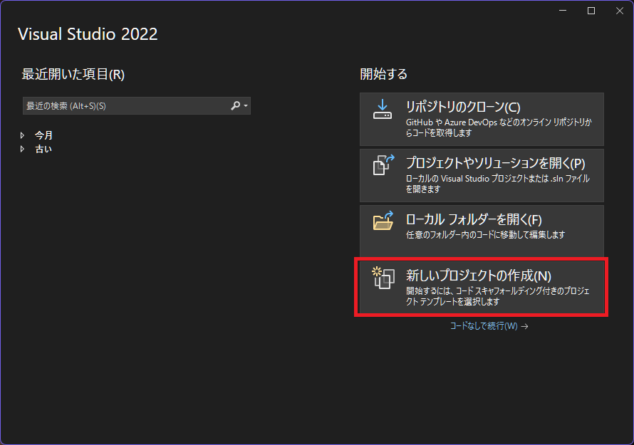

プロジェクトテンプレートには「TwinCAT XAE Project (XML format)」を選択する。
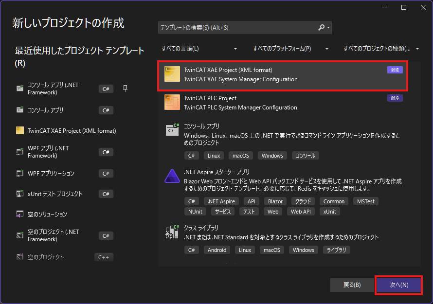

プロジェクト名とソリューション名を指定する。
「ソリューションとプロジェクトを同じディレクトリに配置する」にチェックを入れておく。（個人の好み）
プロジェクト名・ソリューション名は「TwinCAT-Tutorial」とする。
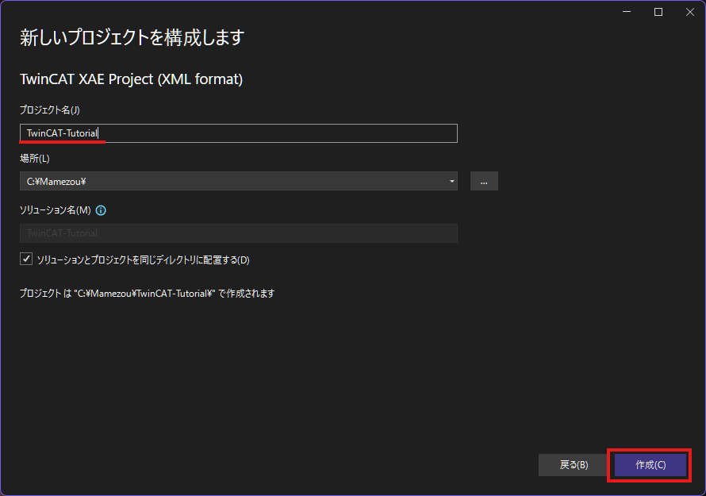

## PLCプロジェクト作成
ソリューションエクスプローラーにて「PLC」を右クリック。「新しい項目の追加」をクリック。
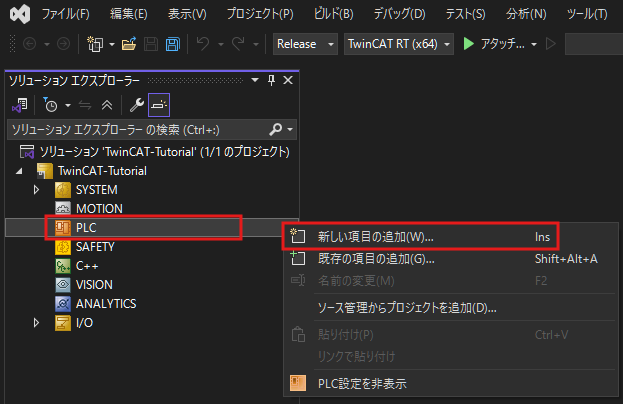

※ ToDo : ソリューションエクスプローラーの表示方法を記載する

「Standard PLC Project」を選択し，プロジェクト名を指定する。追加ボタンを押す。
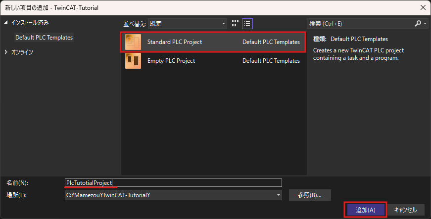


## MAINプログラムを編集してみる
「POUs」フォルダ内にある「MAIN(PRG)」をクリックして編集画面を開きます。

編集画面の上半分はプログラムの定義スペース，下半分はプログラムの実装スペース。
（C++で例えるなら，上半分がヘッダファイル，下半分がソースファイルを記述するスペース。）
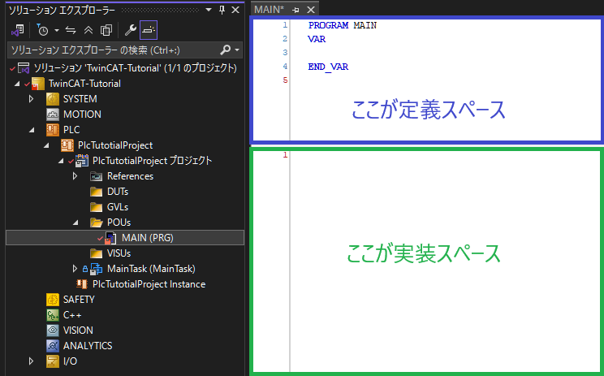

定義スペース（上半分）には下記のように記述する。
変数定義時は「変数名 : 型」のように記述する。

```Pascal
PROGRAM MAIN
VAR
	/// プログラム呼び出し回数
	CycleCount : DINT;
END_VAR
```
実装スペース（下半分）は下記のように記述する。

```Pascal
// 変数をインクリメントする
CycleCount := CycleCount + 1;
```

※ 代入の演算子は「:=」である。「=」は同値評価である点に注意。
※ 使用可能なプリミティブ型の一覧は[こちら](https://infosys.beckhoff.com/english.php?content=../content/1033/tcplccontrol/925424907.html&id=)を参照。

プログラムの編集が完了したら，ビルドしてエラーが発生しないことを確認します。
IDE上部の「ビルド」タブ>「ソリューションのビルド」をクリックします。
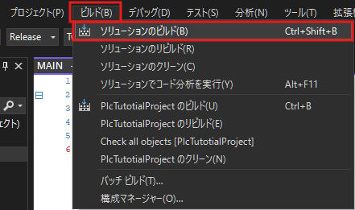

IDE下部に表示される「出力」タブ内で，失敗の数が0となっていることを確認します。
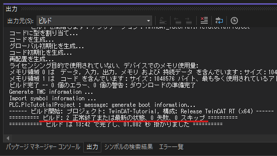


## プロジェクトのデプロイ
プログラムを書き込むために，まずはXAR環境（＝実行環境）にアクセスできるかを確認します。

システムトレイに表示されている歯車アイコンを右クリックして  
「Router」>「Edit Routes」を選択します。
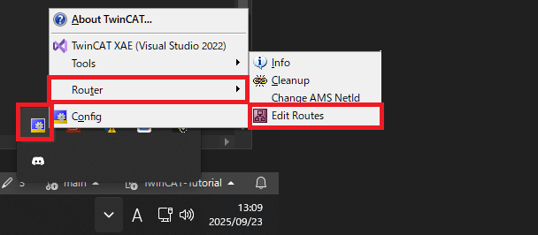

:::info: システムトレイにアイコンが表示されない場合
システムトレイに歯車アイコンが表示されない場合は，下記のexeファイルを起動してください。
`C:\Program Files (x86)\Beckhoff\TwinCAT\3.1\System\TcAmsRemoteMgr.exe`
（※TwinCATのインストール場所を変更した場合は，上記と異なる場合があります）
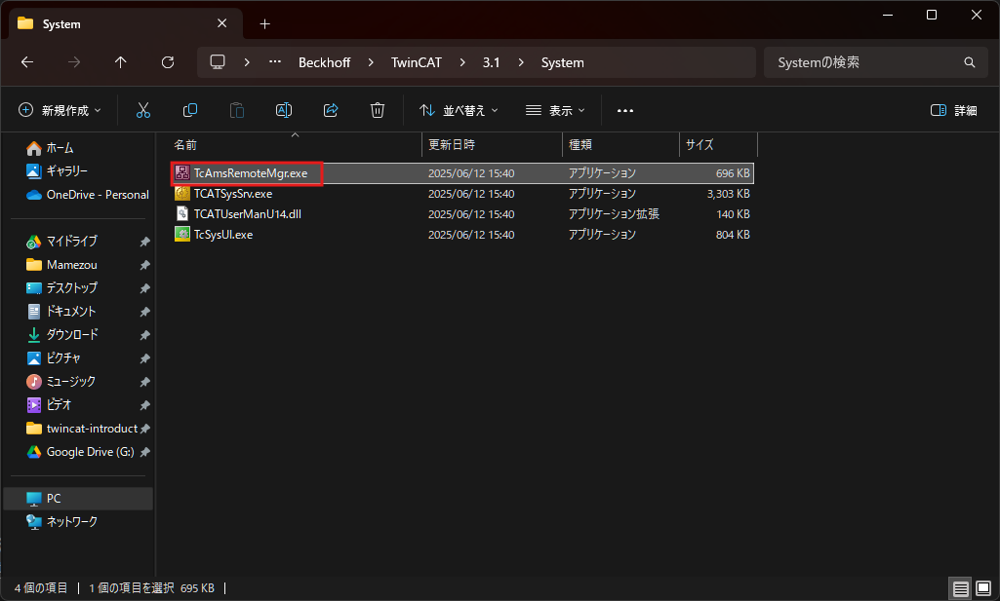
:::

「TwinCAT Static Routes」ウィンドウが表示されるため，下記のように緑色となっていれば接続が行えています。
もし緑色の項目が存在しない場合は，前回の記事を参考に設定してください。
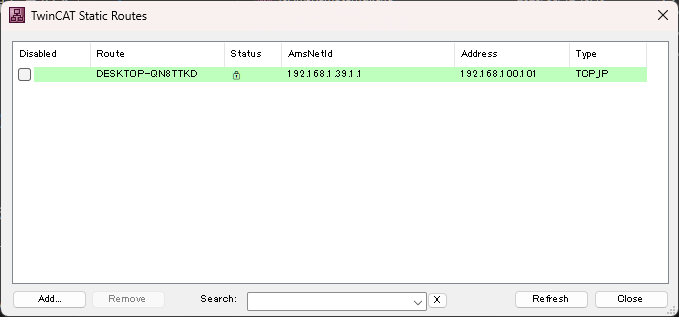


XARとの通信が確立していることを確認したら，IDEからターゲットを指定します。

IDEを開き，「表示」タブ>「ツールバー」>「TwinCAT XAE Base」をクリックしてチェックを入れます。
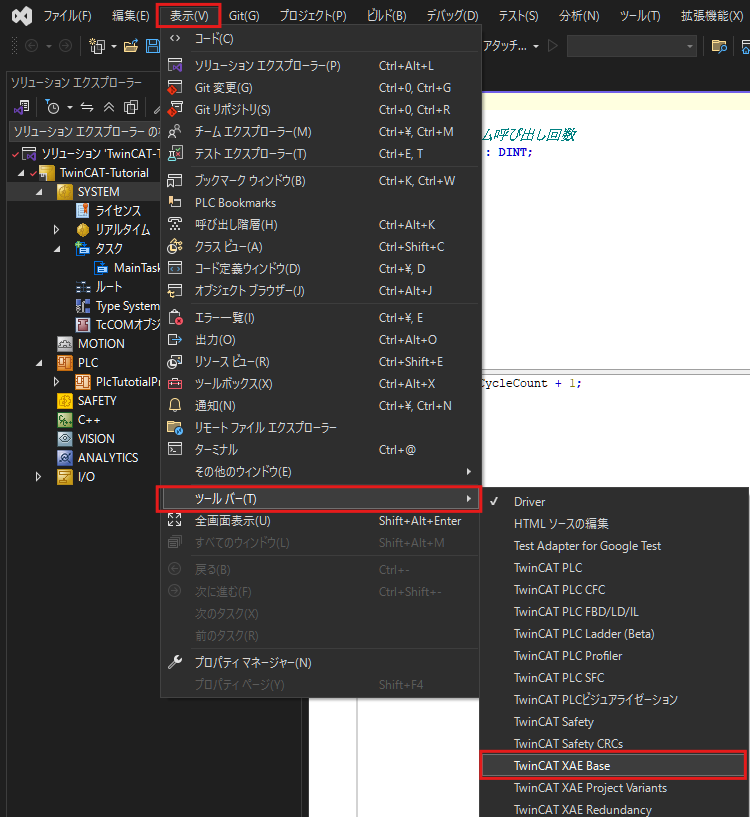

これにより，IDEの上部にTwinCATに関する表示が増えます。

【変更前】
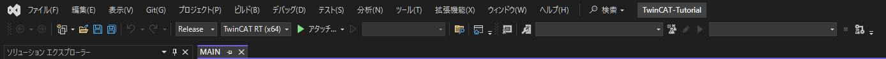

【変更後】
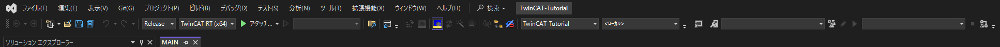

追加された項目のうち，「ローカル」と表示されているコンボボックスをクリックして，XAR環境をターゲットとして指定します。
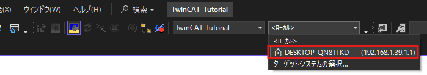

ターゲット指定後，青色の階段のアイコンをクリックします。


「構成のアクティブ化」ウィンドウが表示されるので，OKボタンを押します。
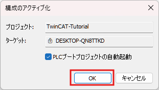

初回書き込み時は評価ライセンスの生成を促されるため，「はい」を選択します。
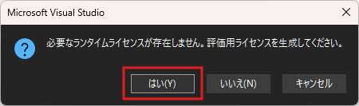

表示されたものと同じ文字列をテキストボックスに入力し，OKボタンを押します。
これにより，評価用ライセンスが生成され，プログラムが実行可能な状態となります。
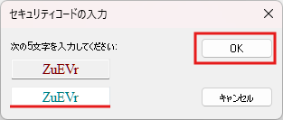

:::info:TwinCATのランタイムライセンスについて
（ToDo : 7日間の評価用ライセンスについて記載する）
:::

TwinCATを再起動するか尋ねられるため，「OK」を押して再起動します。
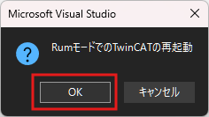

IDEの右下に表示されている歯車アイコンが下図のように緑色かつ回転していれば，プログラムが正常に実施されています。


## ログインによる動作確認
TwinCATでは，XARにログインすることで変数の値をリアルタイムで確認することができます。  
このログイン機能を使用して，先ほど書き込んだプログラムが正常に動作しているかを確認してみます。  

「拡張機能」タブ>「PLC」>「ログイン」を選択してログインします。
このボタンが無効状態となっている場合は，ターゲットを指定するコンボボックスに正しいターゲットが指定されているかを確認してください。 
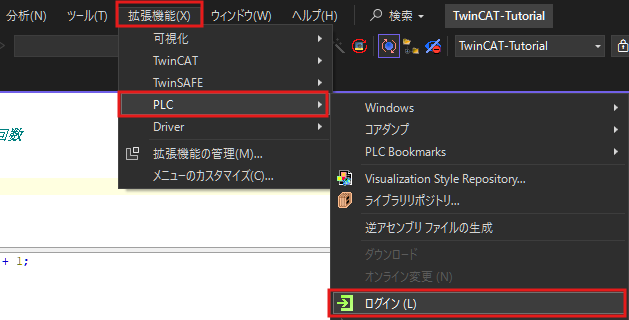

ログインした状態でMAINプログラムを開くと，CycleCount変数の値がリアルタイムで確認できます。  
1秒間におよそ100だけ加算されていく様子が確認できると思います。
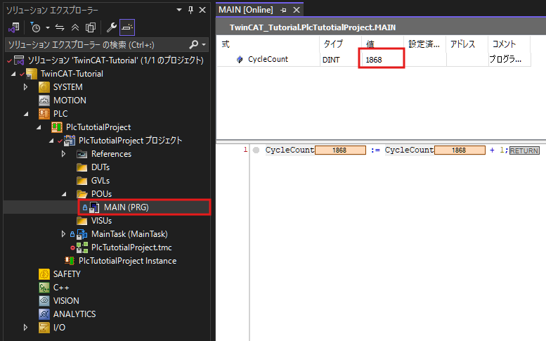

これは，TwinCATプロジェクトを作成したときに生成されるタスクの実行周期は10msであるためです。

## タスクの実行周期を変えてみる
理解を深めるために，プロジェクト生成時に自動で追加されたタスクを消してみる。
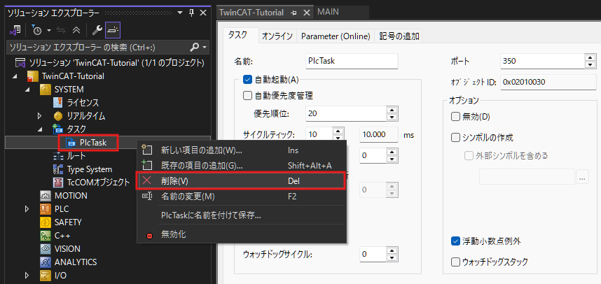

新しいタスクを作成する。「SYSTEM」>「タスク」を右クリックして「新しい項目の追加」を押す。
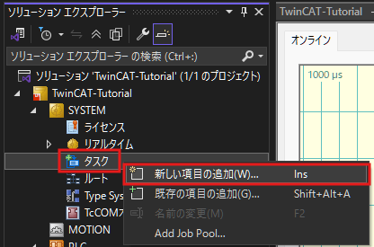

タイプは「TwinCATタスク」を選択して，名前を「MainTask」として「OK」を押す。
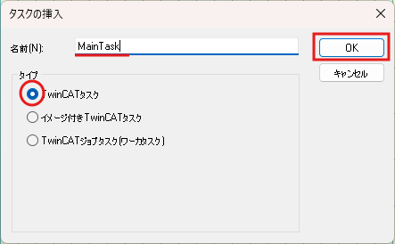

作成したタスクの詳細設定画面が開く。「サイクルティック」を10 → 100に変更する。
これによりタスクの実行周期が100msとなる。
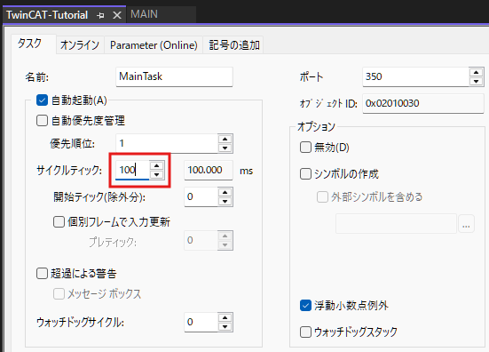

:::info
サイクルティック1つ当たりの時間はデフォルトでは1msだが，CPUのコア設定で変更可能。
詳細についてはこちらを確認。（ToDo : リンクを貼る）
:::

タスクを作成したら，どのプログラムを呼び出すかを設定する。
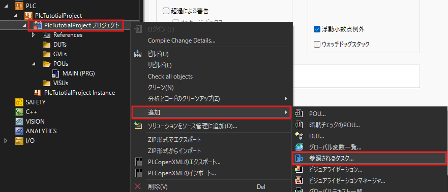

割り当て可能なタスクが表示されるので，先ほど作成した「MainTask」を指定して「Open」を押す。
「タスク参照」の項目が生成される。
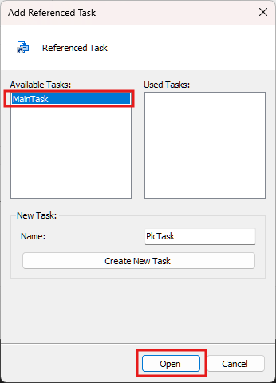

生成した「タスク参照」を右クリックして，下記の項目を選択する。
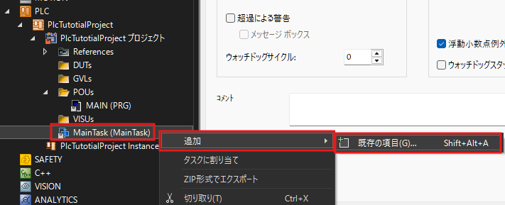

タスクから呼び出すプログラムを選択する。先ほどコードを修正した「MAIN」プログラムを選択してOKを押す。
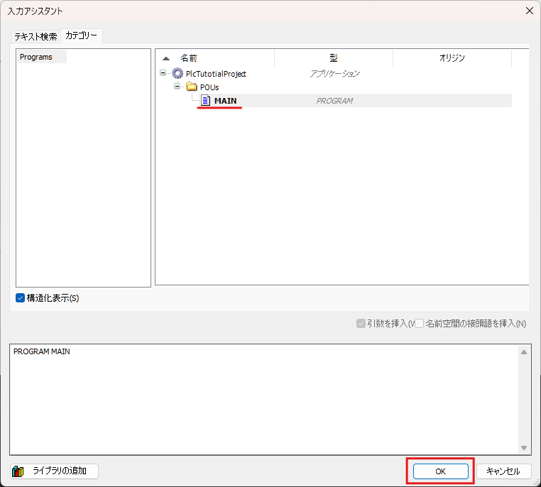

先程と同様に，ログインして変数の様子を見てみましょう。1秒間に10だけ値が増えていくことが確認できると思います。これは，先ほど作成したタスクがMAINプログラムを100msごとに呼び出しているからです。

ここまでのプログラムは下記の通りとなっているはずです。タグ名は`Chapter2-1`です。
https://github.com/hayat0-ota/TwinCAT-Tutorial/tree/Chapter2-1


# Function Blockを使用したプログラム
（WIP）