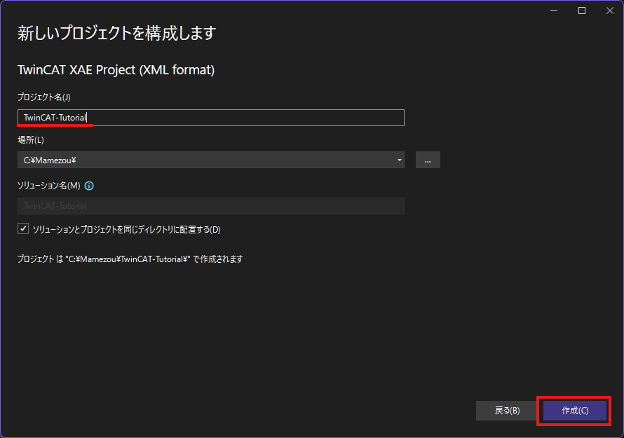
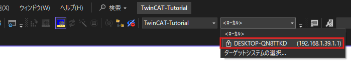

# 0. はじめに
[前回](https://developer.mamezou-tech.com/robotics/twincat/introduction/twincat-introduction/)はTwinCATの開発環境（XAE）・実行環境（XAR）の構築方法について説明しました。
今回はPLCプログラムをST言語で実装して動作を確認し，基本的な実装方法を確認します。

# 1. ST言語とは？
IEC61131-3規格で定められた5種類のプログラム言語のうちの1つです。  
テキスト形式による実装が可能な言語であり，Pascalライクな文法で記述します。  
本記事ではこの言語を使用します。

```cs: ST言語によって記述したプログラムの例
FOR i:=0 TO 10 DO
    // メソッド実施，引数によるデータの入出力
	fbHogeHoge.FugaFuga(i, outData => tmpData)
END_FOR
```

# 2. PLCプログラムの作成・実装
開発環境を起動し，ST言語でのPLCプログラムを実装していきます。

## ソリューション作成
Visual Studio もしくは XAE Shellを開きます。  
（今回はVisual Studioを選択しました）

「新しいプロジェクトの作成」を選択します。


プロジェクトテンプレートには「TwinCAT XAE Project (XML format)」を選択します。


プロジェクト名とソリューション名を指定します。
「ソリューションとプロジェクトを同じディレクトリに配置する」にチェックを入れます。
プロジェクト名・ソリューション名は「TwinCAT-Tutorial」とします。


## PLCプロジェクト作成
ソリューションエクスプローラーにて「PLC」を右クリックして，「新しい項目の追加」をクリックします。


:::info:ソリューションエクスプローラーの開き方
XAEShellもしくはVisualStudioの画面左側にソリューションエクスプローラーが表示されない場合は，下記の項目をクリックしてください。
- 「表示」>「ソリューションエクスプローラー」

:::

「Standard PLC Project」を選択して，プロジェクト名を指定します。  
今回は「PlcTutorialProject」として追加ボタンをクリックします。


## MAINプログラムを編集してみる
PLCプログラムを新規作成すると，ソリューションエクスプローラー内の「PLC」配下に項目が追加されます。  
「POUs」フォルダ内にある「MAIN(PRG)」をクリックして編集画面を開きます。

編集画面の上半分は変数を定義するためのスペース，下半分はプログラムの処理を記述するためのスペースです。
（C++で例えるなら，上半分がヘッダファイル，下半分がソースファイルを記述するスペースとなります）


定義スペース（上半分）には下記のように記述します。今回はDINT型（符号付き32bit整数）の変数を定義します。  
変数定義時は「変数名 : 型」のように記述します。

```cs:MAINプログラム 定義スペース
PROGRAM MAIN
VAR
	/// プログラム呼び出し回数
	CycleCount : DINT;
END_VAR
```
実装スペース（下半分）は下記のように記述します。  
今回は処理1回ごとに変数「CycleCount」をインクリメントしています。

```cs:MAINプログラム 実装スペース
// 変数をインクリメントする
CycleCount := CycleCount + 1;
```

:::alert: 代入時の記号
代入では「:=」を使用します。「=」は**同値評価（値が等しいかどうか）**である点に注意してください。
:::

:::info: TwinCATで使用可能なプリミティブ型
使用可能なプリミティブ型の一覧は[こちら](https://infosys.beckhoff.com/english.php?content=../content/1033/tcplccontrol/925424907.html&id=)を参照してください。
:::

:::check: 自動補完機能
「Ctrl+Space」キーを入力すると，補完候補のウィンドウが表示されます。コーディングの時間短縮におすすめです。

:::

プログラムの編集が完了したら，ビルドしてエラーが発生しないことを確認します。
IDE上部の「ビルド」タブ>「ソリューションのビルド」をクリックします。


IDE下部に表示される「出力」タブ内で，失敗の数が0となっていることを確認します。


## プロジェクトのデプロイ
プログラムを書き込むために，まずはXAR環境（＝実行環境）にアクセスできるかを確認します。

システムトレイに表示されている歯車アイコンを右クリックして  
「Router」>「Edit Routes」を選択します。


:::info: システムトレイにアイコンが表示されない場合
システムトレイに歯車アイコンが表示されない場合は，下記のexeファイルを起動してください。
`C:\Program Files (x86)\Beckhoff\TwinCAT\3.1\System\TcAmsRemoteMgr.exe`
（※TwinCATのインストール場所を変更した場合は，上記と異なる場合があります）

:::

「TwinCAT Static Routes」ウィンドウが表示されるため，下記のように緑色となっていれば接続が行えています。
もし緑色の項目が存在しない場合は，[前回記事の3章・4章](https://developer.mamezou-tech.com/robotics/twincat/introduction/twincat-introduction/#3-%E3%83%95%E3%82%A1%E3%82%A4%E3%82%A2%E3%82%A6%E3%82%A9%E3%83%BC%E3%83%AB%E8%A8%AD%E5%AE%9A)から設定を見直してください。


XARとの通信が確立していることを確認したら，IDEからターゲットを指定します。

IDEを開き，「表示」タブ>「ツールバー」>「TwinCAT XAE Base」をクリックしてチェックを入れます。


これにより，IDEの上部にTwinCATに関する表示が増えます。

【変更前】


【変更後】


追加された項目のうち，「ローカル」と表示されているコンボボックスをクリックして，XAR環境をターゲットとして指定します。


ターゲット指定後，青色の階段のアイコンをクリックします。


「構成のアクティブ化」ウィンドウが表示されるので，OKボタンを押します。


初回書き込み時は評価ライセンスの生成を促されるため，「はい」を選択します。


表示されたものと同じ文字列をテキストボックスに入力し，OKボタンを押します。
これにより，評価用ライセンスが生成され，プログラムが実行可能な状態となります。


:::info:TwinCATのランタイムライセンスについて
（ToDo : 7日間の評価用ライセンスについて記載する）
:::

TwinCATを再起動するか尋ねられるため，「OK」を押して再起動します。


IDEの右下に表示されている歯車アイコンが下図のように緑色かつ回転していれば，プログラムが正常に実施されています。


## ログインによる動作確認
TwinCATでは，XARにログインすることで変数の値をリアルタイムで確認することができます。  
このログイン機能を使用して，先ほど書き込んだプログラムが正常に動作しているかを確認してみます。  

「拡張機能」タブ>「PLC」>「ログイン」を選択してログインします。
このボタンが無効状態となっている場合は，ターゲットを指定するコンボボックスに正しいターゲットが指定されているかを確認してください。 


ログインした状態でMAINプログラムを開くと，CycleCount変数の値がリアルタイムで確認できます。  
1秒間におよそ100だけ加算されていく様子が確認できます。


これは，TwinCATプロジェクトを作成したときに生成されるタスクの実行周期は10msであるためです。

## タスクの実行周期を変えてみる
デフォルトで生成されるタスクの周期は10msですが，これを変更してみましょう。
プロジェクト生成時に自動で追加されたタスクを消してみます。


新しいタスクを作成します。「SYSTEM」>「タスク」を右クリックして「新しい項目の追加」をクリックしてください。


タイプは「TwinCATタスク」を選択し，名前を「MainTask」として「OK」をクリックします。


作成したタスクの詳細設定画面が開かれるので，「サイクルティック」を10 → 100に変更します。
これによりタスクの実行周期が100msとなります。


:::info
サイクルティック1つ当たりの時間はデフォルトでは1msですが，CPUのコア設定で変更可能です。
詳細についてはこちらをご覧ください。
https://infosys.beckhoff.com/english.php?content=../content/1033/tc3_system/5210414219.html&id=
:::

タスクを作成したら，どのプログラムを呼び出すかを設定します。  
「PLCプロジェクト」を右クリック>「追加」>「参照されるタスク」を選択します。


割り当て可能なタスクが表示されるので，先ほど作成した「MainTask」を指定して「Open」をクリックします。


生成した「タスク参照」を右クリックして，「追加」>「既存の項目」を選択します。


タスクから呼び出すプログラムを選択します。先ほどコードを修正した「MAIN」プログラムを選択してOKを押します。


先程と同様に，ログインして変数の様子を見てみましょう。  
1秒間に10だけ値が増えていくことが確認できると思います。これは，先ほど作成したタスクがMAINプログラムを100msごとに呼び出しているからです。


# 3. 同一タスクに複数のプログラムを登録する
1つのタスクには複数個のプログラムを登録できます。
例えば実行周期を10msに設定したタスクにプログラムAとプログラムBの2つを登録した場合，10msごとにプログラムAとプログラムBが実施されます。
ただし，プログラムAとBは並列で実行されるのではなく，**どちらかのプログラムが完了した後にもう一方のプログラムが実施される**点に注意してください。

:::stop
両プログラムの処理時間の合計がタスク実行周期を上回る（タスクオーバーラン）と，システムがハングする可能性があります。  
プログラムの実行時間とタスクの実行周期には十分ご注意ください。
:::

実際に複数のプログラムを同一のタスクに割り当ててみます。  
「POUs」フォルダを右クリックして，「追加」>「POU」を選択します。


プログラム名は「MAIN2」とし，タイプは「プログラム」を，実装言語は「構造化テキスト」（ST）を選択してOpenをクリックします。


MAIN2プログラムでは，MAINプログラムと同じように変数をカウントアップする処理を記述します。
（MAINプログラムと区別するために，インクリメント量を2倍にしておきます）

```cs: MAIN2プログラム 定義スペース
PROGRAM MAIN2
VAR
	/// プログラム呼び出し回数の2倍値
	CycleDoubleCount : DINT;
END_VAR
```

```cs: MAIN2プログラム 実装スペース
CycleDoubleCount := CycleDoubleCount + 2;
```

MAINプログラムの時と同様に，MAIN2プログラムをMainTaskにアサインします。


MainTask参照アイテムの子要素に「MAIN」と「MAIN2」の両方があることを確認してください。


この内容を書き込んで動作を確認してみます。
MAIN2プログラムはMAINプログラムと同じ周期（100ms）で実行され，CycleDoubleCount変数値が1秒間で20だけ値が増えることが確認できます。


# 4. プログラム間でデータを共有する
あるプログラムで計算した値を別のプログラムで使用したい場合が多々あります。
このような場合は，プログラムもしくはタスク間で共通のデータ（グローバル変数）を定義します。
グローバル変数はすべてのタスクが参照できる共有リソースとして定義されるため，これを用いることでタスクを跨いだデータ共有が可能です。

実際にMAINプログラム内での値をMAIN2プログラムで参照してみます。

「GVLs」フォルダを右クリックして，「追加」>「グローバル変数一覧」をクリックします。


変数リスト名は「GVL_Var」として「Open」をクリックします。


ソリューションエクスプローラー上の「GVL_Var」をクリックして編集画面を開き，下図のようにグローバル変数を定義します。

```cs: GVL_Var
{attribute 'qualified_only'}
VAR_GLOBAL
	/// プログラム間共有データ
	SharedData : DINT;
END_VAR
```

:::info
先頭行に記載されている波括弧の部分は，グローバル変数に対する属性（Attribute）です。
Attributeの詳細については下記のリンク先をご覧ください。
https://infosys.beckhoff.com/english.php?content=../content/1033/tc3_plc_intro/2529567115.html&id=
:::

MAINプログラムでこのグローバル変数（SharedData）に，CycleCount変数の値を代入するようにします。

```cs: MAINプログラム 実装スペース
CycleCount := CycleCount + 1;

// 共有データに値を書き込む（追記部分）
GVL_Var.SharedData := CycleCount;
```

この値を，MAIN2プログラム内で別変数として受け取ってみます。

```cs: MAIN2プログラム 定義スペース
PROGRAM MAIN2
VAR
	CycleDoubleCount : DINT;
	
	/// MAINプログラムのデータ
	MainProgramData : DINT;
END_VAR
```

```cs: MAIN2プログラム 定義スペース
CycleDoubleCount := CycleDoubleCount + 1;

// 共有データの値をローカル変数に格納する
MainProgramData := GVL_Var.SharedData;
```

このTwinCATプロジェクトを書き込み動作を確認してみましょう。
MAIN2プログラムのMainProgramData変数に，MAINプログラムのCycleCount変数の値が格納されていることが確認できます。


# 5. おわりに
今回はST言語による基本的なPLCプログラムを作成してみました。
タスク・プログラムの使用方法が理解できたと思います。  
ここまでのプロジェクトを[こちら](https://github.com/hayat0-ota/TwinCAT-Tutorial/tree/Chapter2)で共有しています。補助資料としてご活用ください。

次回は，ファンクションブロック（Function Block）を用いたPLCプログラムについて説明します。