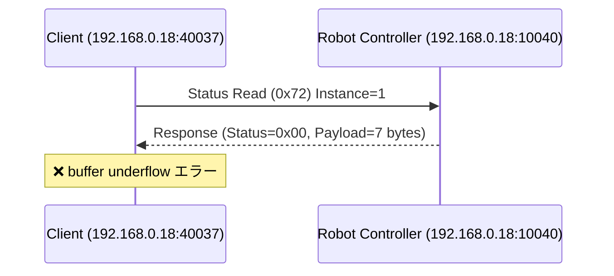

## はじめに

弊社では様々なメーカのロボットを使用してシステムを構築しています。ロボットコントローラとの通信部分は「出来て当たり前」の機能です。ここのインテグレーションコストを抑え、ビジョンやハンドといったシステム固有の機能開発にフォーカスしたいという課題がありました。

一方で、産業用ロボットコントローラのプロトコル仕様はPDFで配布されていることが多く、LLMへの入力にはマークダウン化が必要です。マークダウン化しても理解にはドメイン知識を要したり、Webに活用事例のような情報が少なくLLMの学習データが不足していたりと、別途コンテキストの入力が必要なケースも多いです。

そこで今回、コントローラ通信プロトコルとクライアントの使用方法を**Agent Skills**として整備し、LLMにコントローラ通信コードを書かせる取り組みを行いました[^2]。

今回は安川ロボットのHSES（High-Speed Ethernet Server）プロトコル向けにスキルを作成し、Rust製クライアント moto-hses[^1] と組み合わせて検証しました。

通信仕様やクライアントの使用方法をAgent Skillsの形式で提供することで、Webに活用事例がなくてもLLMが適切なコードを生成してくれます。まだまだ内容は成熟していませんが、スキルを活用・改善してゆくことでコントローラとの通信コードはLLMが自動で実装してくれつつあります。また、通信の障害が発生した際にパケットデータと通信プロトコルを照合してデバッグするといった使い方も可能であり、コード生成から保守までLLMへ任せられるようになってきました。

## 安川電機が提供する標準SDK

安川電機のロボットコントローラと通信する手段としてメーカからは以下の3つのSDKが提供されています。

| 項目           | **MotoCom32 / MotoComES**                             | **MotoPlus**                       | **YMConnect**                                                                    |
| :----------- | :---------------------------------------------------- | :------------------------------------- | :------------------------------------------------------------------------------- |
| **概要**       | PCからEthernet経由でロボットコントローラへアクセスするための従来型通信SDK。外部PC上で実行。 | コントローラ内部で動作するユーザアプリをC言語で開発するための組込みSDK。 | MotoComの後継。クロスプラットフォーム対応の新世代通信SDK。外部PC上で実行。                                      |
| **対応OS**     | Windows（32bit/64bit）                                  | 専用RTOS（ロボットコントローラ内で動作）                 | **Windows 10+ / Ubuntu 22.04+**                                                  |
| **対応言語**     | C / C++ / VB6 / .NET                                  | C                                      | **C++17 / C# (.NET 10)**                                                         |
| **動作場所**     | 外部PC（ホスト側）                                            | コントローラ内（組込み側）                          | 外部PC（ホスト側）                                                                       |
| **通信方式**     | Ethernet（TCP/IP）                                      | 内部API（コントローラOSと直接連携）                   | Ethernet（TCP/IP）                                                                 |
| **主な用途**     | 監視・I/O制御・ジョブ起動など外部制御                                  | 高速制御・カスタム動作・外部通信タスク                    | 監視・I/O制御・ジョブ起動など外部制御                                                             |
| **有償 / 無償**  | **有償（USBドングルによるHWライセンス。実行環境ごとに必要）**                                       | **有償（開発ライセンスのみ。実行環境は不要）**                   | **無償（Apache License 2.0）**                                                       |
| **特徴**       | Windows専用、歴史が長く安定だが新機能は更新停止傾向。                        | 最も自由度が高く、リアルタイム処理・外部通信も可能。             | マルチプラットフォーム・モダンAPI設計。                                                            |
| **配布元**      | Yaskawa Electric（販売契約が必要）                               | Yaskawa Electric（契約した開発者のみ）              | [GitHub - Yaskawa-Global/YMConnect](https://github.com/Yaskawa-Global/YMConnect) |

MotoPlusの場合は、コントローラ内部で動作するアプリとPC側の通信クライアントをそれぞれ自身で開発する必要があります。そのため、提供されている通信クライアントとしてはMotoComとYMConnectの2択となります。

YMConnectは比較的最近（2024年）に公開されたSDKです。C++17以降や.NET 10以降を使用可能なモダンなプロジェクトならYMConnectが良さそうですが、既存のレガシーシステムではMotoComを使用し続けているケースも多いのではないでしょうか。YMConnectの活用事例はまだほとんど見かけません。しかし、<https://github.com/Yaskawa-Global/YMConnect/discussions> を見ると少しずつ不具合報告も挙がってきているので、徐々に採用実績も増えてくるのではないかと思います。

一方で安川ロボットのコントローラは `High-Speed Ethernet Server (HSES)` というサーバー機能を提供しており、通信プロトコルも公開されています[^4]。

MotoCom（恐らくYMConnectも）はHSESの通信クライアントとして安川から提供されたSDKであり、同等のクライアントは内製することができます。
今回は上位アプリケーションがRustであったこと、レガシーシステムでも使用したいこと、LLM駆動の開発に必要なモックサーバー機能が欲しかったことから、自作したRustクライアントを使用しています。

## moto-hses: Rust製HSESクライアント

moto-hses[^1] は、安川ロボットコントローラのHSES (High-Speed Ethernet Server) プロトコルに対応したRust製の非同期通信クライアントライブラリです。

:::info: moto-hses自体もLLMで開発
実はこのクライアント自体もLLMで開発しました。プロトコル仕様PDFをマークダウン化したドキュメントと、リファレンスとなる別言語のクライアントコードをコンテキストとして入力しています。LLMに対するガードレールや自動フィードバックの仕組みを整備しながら開発を進めました。同様のアプローチでC#向けクライアントなども作成できそうです。この開発プロセスについては、機会があれば別の記事で紹介したいと思います。
:::

### 特徴

- **型安全**: Rustの型システムを活用した安全なAPI設計
- **非同期処理**: Tokioランタイムを使用した非同期UDP通信
- **スレッドセーフ**: `SharedHsesClient` による複数タスクからの並行アクセスに対応
- **テスト容易性**: モックサーバー (`moto-hses-mock`) による統合テストが可能

:::info: モックサーバーの重要性
安川が提供するロボットシミュレータ（MotoSim EG-VRC）はHSESサーバー機能を有していません。そのため、これまでは実機のロボットコントローラを使用して通信検証する必要がありました。moto-hsesのモックサーバーを使えばローカル環境やCIで通信コードのテストが可能です。ローカルで完結して通信検証できることは、LLMへ自動でフィードバックする仕組みを構築する上でも非常に重要な要素となります。
:::

### クレート構成

| クレート | 説明 |
|---------|------|
| `moto-hses-proto` | プロトコル定義とシリアライゼーション |
| `moto-hses-client` | Tokioベースの非同期UDPクライアント |
| `moto-hses-mock` | テスト用のローカルモックHSESサーバー |

### 対応コマンド

現在、以下のロボット制御コマンドに対応しており、逐次追加中です。

| コマンドNo | コマンド名 |
|------------|------------|
| 0x70 | アラームデータ読み出し |
| 0x71 | アラーム履歴読み出し |
| 0x72 | ステータス情報読み出し |
| 0x73 | 実行中ジョブ情報読み出し |
| 0x75 | ロボット位置データ読み出し |
| 0x78 | I/Oデータ読み書き |
| 0x79 | レジスタデータ読み書き |
| 0x7A〜0x7E | 各種変数（B/I/D/R/S型）読み書き |
| 0x82 | アラームリセット / エラーキャンセル |
| 0x83 | ホールド / サーボON/OFF |
| 0x84 | ステップ / サイクル / 連続切替 |
| 0x86 | スタートアップ（ジョブ起動） |
| 0x87 | ジョブ選択 |

その他、ファイル操作コマンド（削除、保存、一覧取得）や複数データの一括読み書きコマンドにも対応しています。

### 基本的な使い方

```rust
use moto_hses_client::HsesClient;
use moto_hses_proto::AlarmAttribute;

#[tokio::main]
async fn main() -> Result<(), Box<dyn std::error::Error>> {
    // クライアント作成
    let client = HsesClient::new("192.168.0.3:10040").await?;

    // アラームデータ読み出し
    let alarm = client.read_alarm_data(1, AlarmAttribute::All).await?;
    println!("Alarm Code: {}", alarm.code);
    println!("Alarm Name: {}", alarm.name);

    // アラームリセット
    client.reset_alarm().await?;
    println!("Alarm reset completed");

    Ok(())
}
```

## Agent Skills によるLLM支援

Agent Skills[^5] は、AIコーディングエージェントに特定のドメイン知識や使用方法を教えるためのフォーマットです。スキルは、SKILL.md（エージェントへの指示）、references/（参考ドキュメント）、scripts/（自動化スクリプト）で構成されます。

今回、moto-hsesを活用するために以下の3つのスキルを作成しました。

| スキル | 説明 |
|--------|------|
| **hses-protocol** | HSESプロトコル仕様。メッセージ構造、コマンドフォーマット、エラーコードなど |
| **moto-hses-usage** | moto-hsesクレートの使用ガイド。クライアント操作、コマンドリファレンスなど |
| **hses-packet-analysis** | HSESパケットの解析ガイド。通信障害時のデバッグに活用 |

### スキルのインストール

作成したスキルはGitHubリポジトリ[^2]で公開しています。Vercelが提供するスキルインストーラー add-skill[^6] を使用して、プロジェクトにスキルを導入できます。

```bash
# Cursorの場合
npx add-skill masayuki-kono/agent-skills -s hses-protocol moto-hses-usage hses-packet-analysis -a cursor -y

# Claude Codeの場合
npx add-skill masayuki-kono/agent-skills -s hses-protocol moto-hses-usage hses-packet-analysis -a claude-code -y
```

インストールすると、プロジェクトに以下のようなディレクトリ構造でスキルが配置されます。

```
.agents/
└── skills
    ├── hses-packet-analysis
    │   └── SKILL.md
    ├── hses-protocol
    │   ├── references
    │   │   ├── data-types.md
    │   │   ├── error-codes.md
    │   │   ├── protocol-overview.md
    │   │   └── ...
    │   └── SKILL.md
    └── moto-hses-usage
        ├── references
        │   ├── examples
        │   │   ├── alarm_operations.rs
        │   │   ├── job_start.rs
        │   │   ├── read_status.rs
        │   │   └── ...
        │   └── protocol-commands.md
        └── SKILL.md
```

Cursorの場合は `.cursor/skills/` 配下にシンボリックリンクが作成され、AIエージェントがスキルを参照できるようになります。add-skillの詳しい使い方については公式リポジトリ[^6]を参照してください。

スキルをインストールすると、AIエージェントがHSESプロトコルを理解し、moto-hsesを使った適切なコードを生成できるようになります。

## Agent Skillsを使ったコード生成デモ

スキルの効果を検証するため、Cursor Agentにコードを生成させました。生成したコードはmoto-hses-examples[^3] リポジトリで公開しています。

### 生成プロンプト

以下のシンプルなプロンプトを入力しました。

> moto-hsesを使用したRustサンプルアプリケーションを開発してください。アプリ起動時にサーボをONにして、指定したジョブを起動してください。ロボットコントローラのIPアドレスはコマンドライン引数で指定できるようにしてください。

### 生成されたアプリケーション

上記プロンプトから、Cursor Agentが以下の機能を持つアプリケーションを自動生成しました。

1. コマンドライン引数でロボットコントローラのIPアドレスとジョブ名を指定
2. ロボットコントローラへ接続
3. サーボをONに設定
4. 指定されたジョブを選択して起動
5. 起動状態を確認して結果を表示

### 実行例

```bash
# ロボットコントローラ（192.168.0.18）に接続し、ジョブ "TEST" を起動
cargo run -- 192.168.0.18 TEST
```

実行すると以下のような出力が得られます。

```
[2026-01-26T21:50:24Z INFO  moto_hses_examples] Connecting to robot controller: 192.168.0.18:10040
[2026-01-26T21:50:24Z INFO  moto_hses_examples] ✓ Successfully connected to controller
[2026-01-26T21:50:24Z INFO  moto_hses_examples] Reading initial status...
[2026-01-26T21:50:24Z INFO  moto_hses_examples] ✓ Status read successfully
[2026-01-26T21:50:24Z INFO  moto_hses_examples]   - Running: false
[2026-01-26T21:50:24Z INFO  moto_hses_examples]   - Servo ON: true
[2026-01-26T21:50:24Z INFO  moto_hses_examples]   - Alarm: false
[2026-01-26T21:50:24Z INFO  moto_hses_examples]   - Error: false
[2026-01-26T21:50:24Z INFO  moto_hses_examples] Turning servo ON...
[2026-01-26T21:50:24Z INFO  moto_hses_examples] ✓ Servo ON command sent successfully
[2026-01-26T21:50:25Z INFO  moto_hses_examples] ✓ Servo is now ON
[2026-01-26T21:50:25Z INFO  moto_hses_examples] Selecting job 'TEST'...
[2026-01-26T21:50:25Z INFO  moto_hses_examples] ✓ Job 'TEST' selected successfully
[2026-01-26T21:50:25Z INFO  moto_hses_examples] Starting job 'TEST'...
[2026-01-26T21:50:25Z INFO  moto_hses_examples] ✓ Job start command sent successfully
[2026-01-26T21:50:25Z INFO  moto_hses_examples] ✓ Job 'TEST' started successfully
```

自作のクライアントライブラリであり、Web上に活用事例がほとんど存在しない状況でも、Agent Skillsによってドメイン知識を補完することで、LLMが適切なコードを生成できることが確認できました。

## Agent Skillsを使ったパケット解析デモ

次に、通信障害時のデバッグにスキルを活用する例を紹介します。

### 障害シナリオの作成

Status Reading（0x72）コマンドの応答パケットをモックサーバー側で意図的に不正なデータに書き換えて返信してみます。

HSESプロトコルでは、Status Readingコマンドの応答ペイロードは以下の2つのデータで構成されます。

- Data 1（4バイト）：動作モード・実行状態
- Data 2（4バイト）：HOLD状態・アラーム・サーボ状態

期待されるペイロードは8バイトですが、このペイロードを意図的に7バイトで返すようにモックサーバーを設定しました。

先ほど生成したアプリケーションを実行すると、以下のエラーログが出力されます。

```
[2026-01-27T13:51:41Z INFO  moto_hses_examples] Connecting to robot controller: 192.168.0.18:10040
[2026-01-27T13:51:41Z INFO  moto_hses_examples] ✓ Successfully connected to controller
[2026-01-27T13:51:41Z INFO  moto_hses_examples] Reading initial status...
[2026-01-27T13:51:41Z ERROR moto_hses_examples] ✗ Failed to read status: Protocol error: buffer underflow
Error: ProtocolError(Underflow)
```

`buffer underflow`エラーが発生しました。ここで hses-packet-analysis スキルを使ってLLMにパケット解析をしてもらいましょう。

hses-packet-analysis は、tsharkでパケットをキャプチャし、hses-protocol スキルのプロトコル仕様と照合してレポートを出力するスキルです。このようにスキル間で連携することで、複雑な解析タスクにも対応できます。

### 解析プロンプト

以下のプロンプトを入力しました。

> cargo run -- 192.168.0.18 TEST が失敗します。パケット解析してマークダウンに結果を出力して。

### 解析結果

以下の解析レポートが出力されました（一部抜粋）。

---

（中略）

**3. Sequence Diagram**



**4. Communication Sequence**

| # | Time (sec) | Dir | Command | Instance | Status | Description |
|---|------------|-----|---------|----------|--------|-------------|
| 1 | 0.000000 | →  | 0x72 (Status Read) | 1 | - | ステータス読み取りリクエスト |
| 2 | 0.000120 | ←  | 0x72 (Status Read) | - | 0x00 (Normal) | レスポンス受信、ペイロード7バイト |

（中略）

**6. Packet Details**

**Packet #1 - Request (Client → Controller)**

| Field | Offset | Raw (hex) | Value | Description |
|-------|--------|-----------|-------|-------------|
| Magic | 0-3 | 59455243 | "YERC" | プロトコルマジック |
| Header Size | 4-5 | 2000 | 32 | ヘッダーサイズ (リトルエンディアン) |
| Payload Size | 6-7 | 0000 | 0 | ペイロードなし |
| Reserved | 8 | 03 | 0x03 | 予約 |
| Division | 9 | 01 | Robot (0x01) | ロボット制御 |
| ACK | 10 | 00 | Request | リクエスト |
| Request ID | 11 | 01 | 1 | セッションID |
| Block Number | 12-15 | 00000000 | 0 | リクエストは常に0 |
| Reserved | 16-23 | 3939393939393939 | "99999999" | 予約領域 |
| Command ID | 24-25 | 7200 | 0x0072 | Status Reading |
| Instance | 26-27 | 0100 | 1 | Status Data 1 |
| Attribute | 28 | 00 | 0 | - |
| Service | 29 | 01 | Get_Attribute_All | 全属性取得 |
| Padding | 30-31 | 0000 | - | パディング |

**Raw Data**:
```
5945524320000000030100010000000039393939393939397200010000010000
```

**Packet #2 - Response (Controller → Client)**

| Field | Offset | Raw (hex) | Value | Description |
|-------|--------|-----------|-------|-------------|
| Magic | 0-3 | 59455243 | "YERC" | プロトコルマジック |
| Header Size | 4-5 | 2000 | 32 | ヘッダーサイズ |
| Payload Size | 6-7 | 0700 | 7 | ペイロード7バイト |
| Reserved | 8 | 03 | 0x03 | 予約 |
| Division | 9 | 01 | Robot (0x01) | ロボット制御 |
| ACK | 10 | 01 | Response | レスポンス |
| Request ID | 11 | 01 | 1 | セッションID |
| Block Number | 12-15 | 00000080 | 0x80000000 | 単一レスポンス |
| Reserved | 16-23 | 3939393939393939 | "99999999" | 予約領域 |
| Service | 24 | 81 | 0x01 + 0x80 | Get_Attribute_All レスポンス |
| Status | 25 | 00 | Normal (0x00) | 正常応答 |
| Added Status Size | 26 | 02 | 2 bytes | 追加ステータスサイズ |
| Padding | 27 | 00 | - | パディング |
| Added Status | 28-29 | 0000 | 0x0000 | エラーなし |
| Padding | 30-31 | 0000 | - | パディング |

**Payload (7 bytes)**:
```
00 00 00 00 00 00 00
```

**Raw Data**:
```
594552432000070003010101000000803939393939393939810002000000000000000000000000
```

**7. Root Cause Analysis**

**問題の特定**

**エラー**: `Protocol error: buffer underflow`

**原因**

Status Reading (Command 0x72, Instance 1) のレスポンスに問題があります。

1. **期待されるペイロード**: Status Data 1 は通常 **4バイト** (32ビット) のステータスフラグを返す
2. **実際のペイロード**: **7バイト** (すべてゼロ)

ペイロードの内容はすべてゼロです。

```
Expected: [status_data_1: 4 bytes]
Actual:   [00 00 00 00 00 00 00] (7 bytes of zeros)
```

**考えられる原因**

1. **シミュレーター/モック環境**: `192.168.0.18` はこのマシン自体のIPアドレスである。実際のロボットコントローラーではなく、シミュレーターまたはモックサーバーが応答している
2. **モックサーバーの不完全な実装**: シミュレーターがStatus Data 1のペイロードを正しく構築していない可能性がある
3. **クライアントのパース処理**: クライアントは `Added Status Size = 2` を見て追加の2バイトを読もうとするため、ペイロード構造との不一致の可能性がある

---

シンプルなプロンプトから、パケットのバイナリデータをプロトコル仕様と照合してくれました。Data 1が本来4バイトなのに7バイトなのか、Data 2が本来4バイトなのに3バイトなのかは分かりませんが、Data 1かData 2の構築方法がサーバー側と合っていないことが分かります。このように、Agent Skillsを活用することで通信障害のデバッグ作業もLLMに任せることができます。

## まとめ

本記事では、安川ロボットコントローラのHSES通信クライアント（moto-hses）とAgent Skillsを組み合わせた取り組みを紹介しました。

- **コード生成**: moto-hses-usage スキルにより、LLMがmoto-hsesを使った適切な通信コードを自動生成
- **パケット解析**: hses-packet-analysis スキルにより、通信障害時のデバッグをLLMに委任

産業用ロボットのプロトコル仕様はPDFとして配布されていたり、ドメイン知識が必要だったりとLLMには扱いにくい情報ですが、Agent Skillsの形式に整備すればこの課題を解決できます。コード生成から保守・デバッグまで、一貫してLLMに任せられる環境が整いつつあります。

## 今後の展望

各社ロボットコントローラがROS2のようなフレームワークに対応し、共通I/Fで利用できるようになる未来も想定されますが、コントローラ側の歩み寄りが必要であり現実的には難しいと考えています。また、各社ロボットには様々な独自仕様（溶接のような用途別の機能など）があり、共通I/Fでは吸収しきれない部分も存在します。

コントローラのI/Fが異なっていてもスキルが提供されれば、必要とするアプリケーションの開発をLLMが行うことは可能です。各社ロボットコントローラに対する様々なスキルを作成してゆき、ロボットシステム開発においてLLMが担える部位を増やしてゆきたいと考えています。

[^1]: [moto-hses - GitHub](https://github.com/masayuki-kono/moto-hses)
[^2]: [agent-skills - GitHub](https://github.com/masayuki-kono/agent-skills)
[^3]: [moto-hses-examples - GitHub](https://github.com/masayuki-kono/moto-hses-examples)
[^4]: [FS100 HSES Manual (PDF)](https://www.motoman.com/getmedia/16B5CD92-BD0B-4DE0-9DC9-B71D0B6FE264/160766-1CD.pdf.aspx?ext=.pdf)
[^5]: [Agent Skills](https://agentskills.io/)
[^6]: [add-skill - GitHub](https://github.com/vercel-labs/add-skill)
