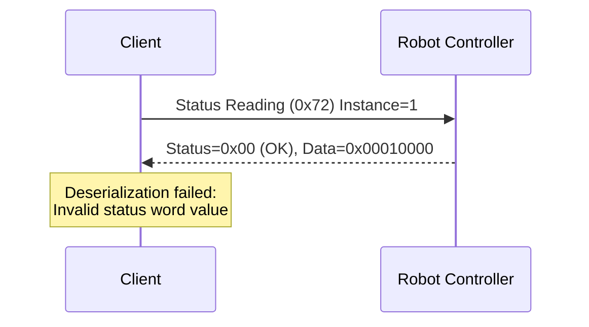

## はじめに

弊社では様々なメーカのロボットを使用してシステムを構築しています。ロボットコントローラとの通信部分は「出来て当たり前」の機能です。ここのインテグレーションコストを抑え、ビジョンやハンドといったシステム固有の機能開発にフォーカスしたいという課題がありました。

一方で、産業用ロボットコントローラのプロトコル仕様はPDFで配布されていることが多く、LLMへの入力にはマークダウン化が必要です。マークダウン化しても理解にはドメイン知識を要したり、Webに活用事例のような情報が少なくLLMの学習データが不足していたりと、別途コンテキストの入力が必要なケースも多いです。

そこで今回、コントローラ通信プロトコルとクライアントの使用方法を**Agent Skills**として整備し、LLMにコントローラ通信コードを書かせる取り組みを行いました[^2]。

今回は安川ロボットのHSES（High-Speed Ethernet Server）プロトコル向けにスキルを作成し、Rust製クライアント moto-hses[^1] と組み合わせて検証しました。

通信仕様やクライアントの使用方法をAgent Skillsの形式で提供することで、Webに活用事例がなくてもLLMが適切なコードを生成してくれます。まだまだ内容は成熟していませんが、スキルを活用・改善してゆくことでコントローラとの通信コードはLLMが自動で実装してくれつつあります。また、通信の障害が発生した際にパケットデータと通信プロトコルを照合してデバッグするといった使い方も可能であり、コード生成から保守までLLMへ任せられるようになってきました。

## 安川電機が提供する標準SDK

安川電機のロボットコントローラと通信する手段としてメーカからは以下の3つのSDKが提供されています。

| 項目           | **MotoCom32 / MotoComES**                             | **MotoPlus**                       | **YMConnect**                                                                    |
| :----------- | :---------------------------------------------------- | :------------------------------------- | :------------------------------------------------------------------------------- |
| **概要**       | PCからEthernet経由でロボットコントローラへアクセスするための従来型通信SDK。外部PC上で実行。 | コントローラ内部で動作するユーザアプリをC言語で開発するための組込みSDK。 | MotoComの後継。クロスプラットフォーム対応の新世代通信SDK。外部PC上で実行。                                      |
| **対応OS**     | Windows（32bit/64bit）                                  | 専用RTOS（ロボットコントローラ内で動作）                 | **Windows 10+ / Ubuntu 22.04+**                                                  |
| **対応言語**     | C / C++ / VB6 / .NET                                  | C                                      | **C++17 / C# (.NET 10)**                                                         |
| **動作場所**     | 外部PC（ホスト側）                                            | コントローラ内（組込み側）                          | 外部PC（ホスト側）                                                                       |
| **通信方式**     | Ethernet（TCP/IP）                                      | 内部API（コントローラOSと直接連携）                   | Ethernet（TCP/IP）                                                                 |
| **主な用途**     | 監視・I/O制御・ジョブ起動など外部制御                                  | 高速制御・カスタム動作・外部通信タスク                    | 監視・I/O制御・ジョブ起動など外部制御                                                             |
| **有償 / 無償**  | **有償（USBドングルによるHWライセンス。実行環境ごとに必要）**                                       | **有償（開発ライセンスのみ。実行環境は不要）**                   | **無償（Apache License 2.0）**                                                       |
| **特徴**       | Windows専用、歴史が長く安定だが新機能は更新停止傾向。                        | 最も自由度が高く、リアルタイム処理・外部通信も可能。             | マルチプラットフォーム・モダンAPI設計。                                                            |
| **配布元**      | Yaskawa Electric（販売契約が必要）                               | Yaskawa Electric（契約した開発者のみ）              | [GitHub - Yaskawa-Global/YMConnect](https://github.com/Yaskawa-Global/YMConnect) |

MotoPlusの場合は、コントローラ内部で動作するアプリとPC側の通信クライアントをそれぞれ自身で開発する必要があります。そのため、提供されている通信クライアントとしてはMotoComとYMConnectの2択となります。

YMConnectは比較的最近（2024年）に公開されたSDKです。C++17以降や.NET 10以降を使用可能なモダンなプロジェクトならYMConnectが良さそうですが、既存のレガシーシステムではMotoComを使用し続けているケースも多いのではないでしょうか。YMConnectの活用事例はまだほとんど見かけません。しかし、<https://github.com/Yaskawa-Global/YMConnect/discussions> を見ると少しずつ不具合報告も挙がってきているので、徐々に採用実績も増えてくるのではないかと思います。

一方で安川ロボットのコントローラは `High-Speed Ethernet Server (HSES)` というサーバー機能を提供しており、通信プロトコルも公開されています[^4]。

MotoCom（恐らくYMConnectも）はHSESの通信クライアントとして安川から提供されたSDKであり、同等のクライアントは内製することができます。
今回は上位アプリケーションがRustであったこと、レガシーシステムでも使用したいこと、LLM駆動の開発に必要なモックサーバー機能が欲しかったことから、自作したRustクライアントを使用しています。

## moto-hses: Rust製HSESクライアント

moto-hses[^1] は、安川ロボットコントローラのHSES (High-Speed Ethernet Server) プロトコルに対応したRust製の非同期通信クライアントライブラリです。

:::info: moto-hses自体もLLMで開発
実はこのクライアント自体もLLMで開発しました。プロトコル仕様PDFをマークダウン化したドキュメントと、リファレンスとなる別言語のクライアントコードをコンテキストとして入力しています。LLMに対するガードレールや自動フィードバックの仕組みを整備しながら開発を進めました。同様のアプローチでC#向けクライアントなども作成できそうです。この開発プロセスについては、機会があれば別の記事で紹介したいと思います。
:::

### 特徴

- **型安全**: Rustの型システムを活用した安全なAPI設計
- **非同期処理**: Tokioランタイムを使用した非同期UDP通信
- **スレッドセーフ**: `SharedHsesClient` による複数タスクからの並行アクセスに対応
- **テスト容易性**: モックサーバー (`moto-hses-mock`) による統合テストが可能

:::info: モックサーバーの重要性
安川が提供するロボットシミュレータ（MotoSim EG-VRC）はHSESサーバー機能を有していません。そのため、これまでは実機のロボットコントローラを使用して通信検証する必要がありました。moto-hsesのモックサーバーを使えばローカル環境やCIで通信コードのテストが可能です。ローカルで完結して通信検証できることは、LLMへ自動でフィードバックする仕組みを構築する上でも非常に重要な要素となります。
:::

### クレート構成

| クレート | 説明 |
|---------|------|
| `moto-hses-proto` | プロトコル定義とシリアライゼーション |
| `moto-hses-client` | Tokioベースの非同期UDPクライアント |
| `moto-hses-mock` | テスト用のローカルモックHSESサーバー |

### 対応コマンド

現在、以下のロボット制御コマンドに対応しており、逐次追加中です。

| コマンドNo | コマンド名 |
|------------|------------|
| 0x70 | アラームデータ読み出し |
| 0x71 | アラーム履歴読み出し |
| 0x72 | ステータス情報読み出し |
| 0x73 | 実行中ジョブ情報読み出し |
| 0x75 | ロボット位置データ読み出し |
| 0x78 | I/Oデータ読み書き |
| 0x79 | レジスタデータ読み書き |
| 0x7A〜0x7E | 各種変数（B/I/D/R/S型）読み書き |
| 0x82 | アラームリセット / エラーキャンセル |
| 0x83 | ホールド / サーボON/OFF |
| 0x84 | ステップ / サイクル / 連続切替 |
| 0x86 | スタートアップ（ジョブ起動） |
| 0x87 | ジョブ選択 |

その他、ファイル操作コマンド（削除、保存、一覧取得）や複数データの一括読み書きコマンドにも対応しています。

### 基本的な使い方

```rust
use moto_hses_client::HsesClient;
use moto_hses_proto::AlarmAttribute;

#[tokio::main]
async fn main() -> Result<(), Box<dyn std::error::Error>> {
    // クライアント作成
    let client = HsesClient::new("192.168.0.3:10040").await?;

    // アラームデータ読み出し
    let alarm = client.read_alarm_data(1, AlarmAttribute::All).await?;
    println!("Alarm Code: {}", alarm.code);
    println!("Alarm Name: {}", alarm.name);

    // アラームリセット
    client.reset_alarm().await?;
    println!("Alarm reset completed");

    Ok(())
}
```

## Agent Skills によるLLM支援

Agent Skills[^5] は、AIコーディングエージェントに特定のドメイン知識や使用方法を教えるためのフォーマットです。スキルは、SKILL.md（エージェントへの指示）、references/（参考ドキュメント）、scripts/（自動化スクリプト）で構成されます。

今回、moto-hsesを活用するために以下の3つのスキルを作成しました。

| スキル | 説明 |
|--------|------|
| **hses-protocol** | HSESプロトコル仕様。メッセージ構造、コマンドフォーマット、エラーコードなど |
| **moto-hses-usage** | moto-hsesクレートの使用ガイド。クライアント操作、コマンドリファレンスなど |
| **hses-packet-analysis** | HSESパケットの解析ガイド。通信障害時のデバッグに活用 |

### スキルのインストール

作成したスキルはGitHubリポジトリ[^2]で公開しています。Vercelが提供するスキルインストーラー add-skill[^6] を使用して、プロジェクトにスキルを導入できます。

```bash
# Cursorの場合
npx add-skill masayuki-kono/agent-skills -s hses-protocol moto-hses-usage hses-packet-analysis -a cursor -y

# Claude Codeの場合
npx add-skill masayuki-kono/agent-skills -s hses-protocol moto-hses-usage hses-packet-analysis -a claude-code -y
```

インストールすると、プロジェクトに以下のようなディレクトリ構造でスキルが配置されます。

```
.agents/
└── skills
    ├── hses-packet-analysis
    │   └── SKILL.md
    ├── hses-protocol
    │   ├── references
    │   │   ├── data-types.md
    │   │   ├── error-codes.md
    │   │   ├── protocol-overview.md
    │   │   └── ...
    │   └── SKILL.md
    └── moto-hses-usage
        ├── references
        │   ├── examples
        │   │   ├── alarm_operations.rs
        │   │   ├── job_start.rs
        │   │   ├── read_status.rs
        │   │   └── ...
        │   └── protocol-commands.md
        └── SKILL.md
```

Cursorの場合は `.cursor/skills/` 配下にシンボリックリンクが作成され、AIエージェントがスキルを参照できるようになります。add-skillの詳しい使い方については公式リポジトリ[^6]を参照してください。

スキルをインストールすると、AIエージェントがHSESプロトコルを理解し、moto-hsesを使った適切なコードを生成できるようになります。

## Agent Skillsを使ったコード生成デモ

スキルの効果を検証するため、Cursor Agentにコードを生成させました。生成したコードはmoto-hses-examples[^3] リポジトリで公開しています。

### 生成プロンプト

以下のシンプルなプロンプトを入力しました。

> moto-hsesを使用したRustサンプルアプリケーションを開発してください。アプリ起動時にサーボをONにして、指定したジョブを起動してください。ロボットコントローラのIPアドレスはコマンドライン引数で指定できるようにしてください。

### 生成されたアプリケーション

上記プロンプトから、Cursor Agentが以下の機能を持つアプリケーションを自動生成しました。

1. コマンドライン引数でロボットコントローラのIPアドレスとジョブ名を指定
2. ロボットコントローラへ接続
3. サーボをONに設定
4. 指定されたジョブを選択して起動
5. 起動状態を確認して結果を表示

### 実行例

```bash
# ロボットコントローラ（192.168.0.18）に接続し、ジョブ "TEST" を起動
cargo run -- 192.168.0.18 TEST
```

実行すると以下のような出力が得られます。

```
[2026-01-26T21:50:24Z INFO  moto_hses_examples] Connecting to robot controller: 192.168.0.18:10040
[2026-01-26T21:50:24Z INFO  moto_hses_examples] ✓ Successfully connected to controller
[2026-01-26T21:50:24Z INFO  moto_hses_examples] Reading initial status...
[2026-01-26T21:50:24Z INFO  moto_hses_examples] ✓ Status read successfully
[2026-01-26T21:50:24Z INFO  moto_hses_examples]   - Running: false
[2026-01-26T21:50:24Z INFO  moto_hses_examples]   - Servo ON: true
[2026-01-26T21:50:24Z INFO  moto_hses_examples]   - Alarm: false
[2026-01-26T21:50:24Z INFO  moto_hses_examples]   - Error: false
[2026-01-26T21:50:24Z INFO  moto_hses_examples] Turning servo ON...
[2026-01-26T21:50:24Z INFO  moto_hses_examples] ✓ Servo ON command sent successfully
[2026-01-26T21:50:25Z INFO  moto_hses_examples] ✓ Servo is now ON
[2026-01-26T21:50:25Z INFO  moto_hses_examples] Selecting job 'TEST'...
[2026-01-26T21:50:25Z INFO  moto_hses_examples] ✓ Job 'TEST' selected successfully
[2026-01-26T21:50:25Z INFO  moto_hses_examples] Starting job 'TEST'...
[2026-01-26T21:50:25Z INFO  moto_hses_examples] ✓ Job start command sent successfully
[2026-01-26T21:50:25Z INFO  moto_hses_examples] ✓ Job 'TEST' started successfully
```

自作のクライアントライブラリであり、Web上に活用事例がほとんど存在しない状況でも、Agent Skillsによってドメイン知識を補完することで、LLMが適切なコードを生成できることが確認できました。

## Agent Skillsを使ったパケット解析デモ

次に、通信障害時のデバッグにスキルを活用する例を紹介します。hses-packet-analysis スキルは、tsharkでパケットをキャプチャし、hses-protocol スキルのプロトコル仕様と照合してレポートを出力します。このようにスキル間で連携することで、複雑な解析タスクにも対応できます。

### 障害シナリオの作成

検証のため、Status Reading（0x72）コマンドの応答パケットをモックサーバー側で意図的に不正なデータに書き換えて返信してみます。

Status Reading の Data 1 フィールドは 4バイト（32ビット）ですが、有効なステータスビットは下位8ビットのみ使用されます。

| ビット | 内容 |
|--------|------|
| Bit 0 | Step モード |
| Bit 1 | One Cycle モード |
| Bit 2 | Continuous モード |
| Bit 3 | Running（動作中） |
| Bit 4 | Speed Limited |
| Bit 5 | Teach モード |
| Bit 6 | Play モード |
| Bit 7 | Remote モード |
| Bit 8-31 | 未使用（常に0であるべき） |

#### 仕様違反の内容

Data 1 の上位バイト（Bit 16-23）に値 `0x01` を設定し、定義された値域を超過させます。

```
期待値: [0x00][0x00][0x00][0x00]  （上位3バイトは常に0）
実際:   [0x00][0x00][0x01][0x00]  （3バイト目に0x01）
         ↓    ↓    ↓    ↓
        Bit  Bit  Bit  Bit
        0-7  8-15 16-23 24-31
                   ↑
              不正な値
```

この状態で先ほど生成したアプリケーションを実行すると、以下のエラーログが出力されます。

```
[2026-01-27T21:18:54Z INFO  moto_hses_examples] Connecting to robot controller: 192.168.0.18:10040
[2026-01-27T21:18:54Z INFO  moto_hses_examples] ✓ Successfully connected to controller
[2026-01-27T21:18:54Z INFO  moto_hses_examples] Reading initial status...
[2026-01-27T21:18:54Z ERROR moto_hses_examples] ✗ Failed to read status: Protocol error: deserialization error: Invalid status word value
Error: ProtocolError(Deserialization("Invalid status word value"))
```

`Invalid status word value`エラーが発生しました。ここで hses-packet-analysis スキルを使ってLLMにパケット解析をしてもらいましょう。

### 解析プロンプト

以下のプロンプトを入力しました。

> cargo run -- 192.168.0.18 TEST が失敗します。パケット解析してマークダウンに結果を出力して。

### 解析結果

以下の解析レポートが出力されました。スキルはパケットキャプチャを実行し、プロトコル仕様と照合して問題箇所を特定しています。

:::info: レポートの構成
出力されるレポートには、プロトコル検証結果、シーケンス図、パケット詳細（バイナリ解析）、推奨対応を含みます。今回は Status Data 1 の bit 16 に不正な値がセットされているという仕様違反を原因として特定しました。
:::

---

# HSES Protocol Analysis Report

**Generated:** 2026-01-28 06:19:36  
**Capture File:** hses_capture_20260128_061936.pcap  
**Export File:** hses_export_20260128_061936.txt

## 1. Summary

| Metric | Value |
|--------|-------|
| Total Packets | 2 |
| Requests | 1 |
| Responses | 1 |
| Errors | 0 (protocol level) |
| Duration | 0.000136 sec |

**Issue Detected:** Application error "Invalid status word value" - the robot controller returned a status value with an unexpected bit set (bit 16) that is not defined in the protocol specification.

## 2. Protocol Validation

| Check | Result | Details |
|-------|--------|---------|
| Magic bytes | ✅ Pass | Both packets start with "YERC" (0x59455243) |
| Header size | ✅ Pass | All headers are 32 bytes (0x0020) |
| Reserved (byte 8) | ✅ Pass | Value is 0x03 |
| Reserved (bytes 16-23) | ✅ Pass | Value is "99999999" |
| Division | ✅ Pass | 0x01 (Robot) |
| ACK field | ✅ Pass | Request=0x00, Response=0x01 |
| Block number | ✅ Pass | Request=0, Response=0x80000000 (single) |
| Request/Response pairs | ✅ Pass | 1 request matched with 1 response |
| Service code match | ✅ Pass | Response service (0x81) = Request service (0x01) + 0x80 |
| Command ID | ✅ Pass | 0x72 (Status reading) is valid |
| Response status | ✅ Pass | 0x00 (Normal reply) |
| **Payload validity** | ⚠️ Warning | Status word contains undefined bit 16 |

### Payload Analysis Issue

The response payload contains status data with an unexpected value:

- **Expected:** Status Data 1 should only use bits 0-7 (bits 8-15 are reserved)
- **Received:** `0x00010000` (bit 16 is set)
- **Consequence:** `moto-hses` library rejects this value as "Invalid status word value"

## 3. Sequence Diagram



## 4. Communication Sequence

| # | Time (sec) | Direction | Command | Instance | Status | Description |
|---|------------|-----------|---------|----------|--------|-------------|
| 1 | 0.000000 | Request | Status Reading (0x72) | 1 | - | Read Status Data 1 |
| 2 | 0.000136 | Response | Status Reading | - | 0x00 (OK) | Returned status=0x00010000 |

## 5. Protocol Errors

No protocol-level errors detected. However, an application-level deserialization error occurred.

| # | Time | Command | Issue | Meaning |
|---|------|---------|-------|---------|
| 2 | 0.000136 | Status Reading | Status word bit 16 set | Robot returned status data with undefined bit, causing deserialization failure |

### Root Cause Analysis

The robot controller returned Status Data 1 with value `0x00010000`, which has bit 16 set. According to the HSES protocol specification:

**Status Data 1 (Command 0x72, Instance 1) bit definitions:**

| Bit | Meaning |
|-----|---------|
| 0 | Step mode |
| 1 | One-cycle mode |
| 2 | Continuous mode |
| 3 | Running |
| 4 | Speed limited |
| 5 | Teach mode |
| 6 | Play mode |
| 7 | Remote mode |
| 8-15 | Reserved |

Bit 16 is not defined in the specification. The `moto-hses` library strictly validates status values and rejects undefined bits.

**Possible causes:**
1. Newer firmware version with extended status bits not yet documented
2. Controller-specific extension to the protocol
3. Memory/data corruption on the controller

## 6. Packet Details

### Packet 1 - Request

| Field | Value | Description |
|-------|-------|-------------|
| Time | 0.000000 | Start of capture |
| Type | Request | ACK=0x00 |
| Magic | YERC | 0x59455243 |
| Header Size | 32 | 0x0020 |
| Payload Size | 0 | No payload |
| Division | Robot | 0x01 |
| Request ID | 1 | Session ID |
| Block Number | 0 | Request block |
| Command ID | 0x0072 | Status reading |
| Instance | 1 | Status Data 1 |
| Attribute | 0 | Default |
| Service | 0x01 | Get_Attribute_All |

**Raw Hex:**
```
59455243 2000 0000 03 01 00 01 00000000 3939393939393939 7200 0100 00 01 0000
│        │    │    │  │  │  │  │        │                │    │    │  │  │
│        │    │    │  │  │  │  │        │                │    │    │  │  └─ Padding
│        │    │    │  │  │  │  │        │                │    │    │  └─ Service (Get_Attribute_All)
│        │    │    │  │  │  │  │        │                │    │    └─ Attribute
│        │    │    │  │  │  │  │        │                │    └─ Instance (1)
│        │    │    │  │  │  │  │        │                └─ Command ID (Status reading)
│        │    │    │  │  │  │  │        └─ Reserved "99999999"
│        │    │    │  │  │  │  └─ Block Number (0)
│        │    │    │  │  │  └─ Request ID (1)
│        │    │    │  │  └─ ACK (Request)
│        │    │    │  └─ Division (Robot)
│        │    │    └─ Reserved (0x03)
│        │    └─ Payload Size (0)
│        └─ Header Size (32)
└─ Magic "YERC"
```

### Packet 2 - Response

| Field | Value | Description |
|-------|-------|-------------|
| Time | 0.000136 | 136μs after request |
| Type | Response | ACK=0x01 |
| Magic | YERC | 0x59455243 |
| Header Size | 32 | 0x0020 |
| Payload Size | 8 | Status data |
| Division | Robot | 0x01 |
| Request ID | 1 | Matches request |
| Block Number | 0x80000000 | Single response |
| Service | 0x81 | Get_Attribute_All + 0x80 |
| Status | 0x00 | Normal reply |
| Added Status Size | 2 | |
| Added Status | 0x0000 | No error |

**Payload Data:**
```
00000100 00000000
│        └─ Status Data 1 part 2: 0x00000000
└─ Status Data 1 part 1: 0x00010000 (bit 16 set - UNEXPECTED)
```

**Raw Hex:**
```
59455243 2000 0800 03 01 01 01 00000080 3939393939393939 81 00 02 00 0000 0000 | 00000100 00000000
│        │    │    │  │  │  │  │        │                │  │  │  │  │    │      │
│        │    │    │  │  │  │  │        │                │  │  │  │  │    │      └─ Payload (8 bytes)
│        │    │    │  │  │  │  │        │                │  │  │  │  │    └─ Padding
│        │    │    │  │  │  │  │        │                │  │  │  │  └─ Added Status (0x0000)
│        │    │    │  │  │  │  │        │                │  │  │  └─ Padding
│        │    │    │  │  │  │  │        │                │  │  └─ Added Status Size (2)
│        │    │    │  │  │  │  │        │                │  └─ Status (0x00 = OK)
│        │    │    │  │  │  │  │        │                └─ Service (0x81 = 0x01 + 0x80)
│        │    │    │  │  │  │  │        └─ Reserved "99999999"
│        │    │    │  │  │  │  └─ Block Number (0x80000000 = single)
│        │    │    │  │  │  └─ Request ID (1)
│        │    │    │  │  └─ ACK (Response)
│        │    │    │  └─ Division (Robot)
│        │    │    └─ Reserved (0x03)
│        │    └─ Payload Size (8)
│        └─ Header Size (32)
└─ Magic "YERC"
```

## 7. Recommendations

1. **Investigate controller firmware** - Check if the robot controller has a newer firmware that uses extended status bits
2. **Update moto-hses library** - Consider relaxing status validation to ignore unknown bits (mask with `0x00FF` for Status Data 1)
3. **Contact Yaskawa** - If the issue persists, consult Yaskawa support about the meaning of bit 16 in Status Data 1

---

シンプルなプロンプトから、パケットのバイナリデータをプロトコル仕様と照合し、原因を特定してくれました。このように、Agent Skillsを活用することで通信障害のデバッグ作業もLLMに任せることができます。

## まとめ

本記事では、安川ロボットコントローラのHSES通信クライアント（moto-hses）とAgent Skillsを組み合わせた取り組みを紹介しました。

- **コード生成**: moto-hses-usage スキルにより、LLMがmoto-hsesを使った適切な通信コードを自動生成
- **パケット解析**: hses-packet-analysis スキルにより、通信障害時のデバッグをLLMに委任

産業用ロボットのプロトコル仕様はPDFとして配布されていたり、ドメイン知識が必要だったりとLLMには扱いにくい情報ですが、Agent Skillsの形式に整備すればこの課題を解決できます。コード生成から保守・デバッグまで、一貫してLLMに任せられる環境が整いつつあります。

## 今後の展望

各社ロボットコントローラがROS2のようなフレームワークに対応し、共通I/Fで利用できるようになる未来も想定されますが、コントローラ側の歩み寄りが必要であり現実的には難しいと考えています。また、各社ロボットには様々な独自仕様（溶接のような用途別の機能など）があり、共通I/Fでは吸収しきれない部分も存在します。

コントローラのI/Fが異なっていてもスキルが提供されれば、必要とするアプリケーションの開発をLLMが行うことは可能です。各社ロボットコントローラに対する様々なスキルを作成してゆき、ロボットシステム開発においてLLMが担える部位を増やしてゆきたいと考えています。

[^1]: [moto-hses - GitHub](https://github.com/masayuki-kono/moto-hses)
[^2]: [agent-skills - GitHub](https://github.com/masayuki-kono/agent-skills)
[^3]: [moto-hses-examples - GitHub](https://github.com/masayuki-kono/moto-hses-examples)
[^4]: [FS100 HSES Manual (PDF)](https://www.motoman.com/getmedia/16B5CD92-BD0B-4DE0-9DC9-B71D0B6FE264/160766-1CD.pdf.aspx?ext=.pdf)
[^5]: [Agent Skills](https://agentskills.io/)
[^6]: [add-skill - GitHub](https://github.com/vercel-labs/add-skill)
