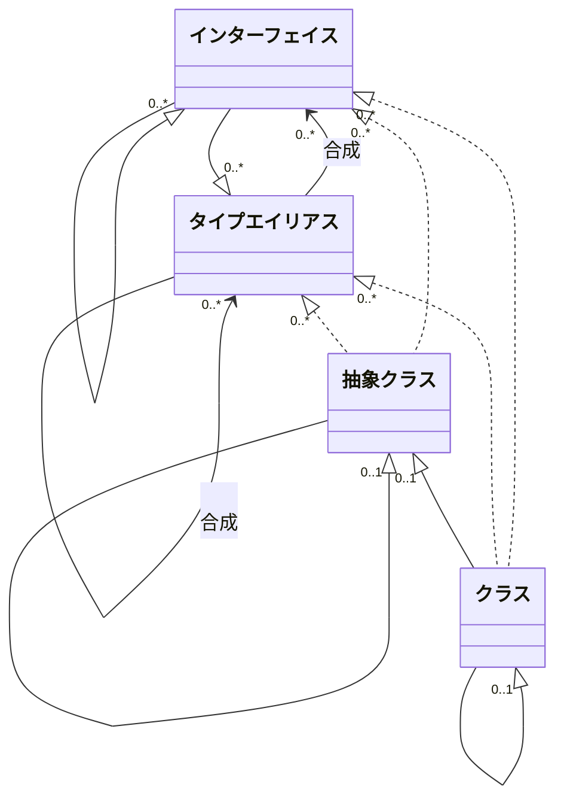
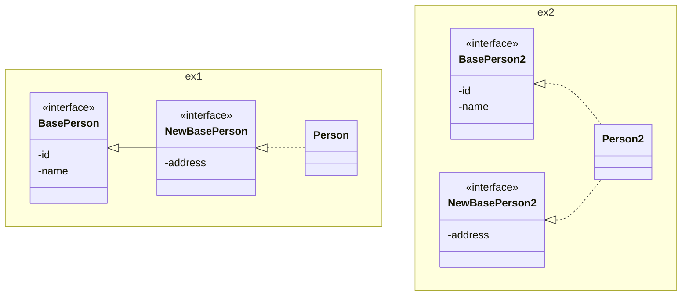
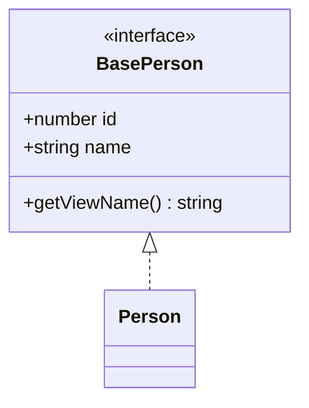
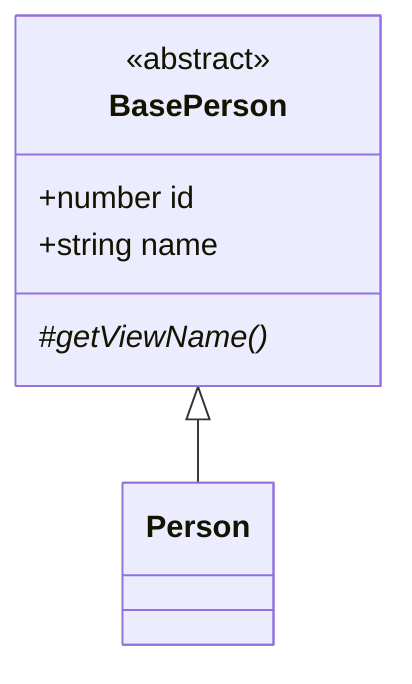
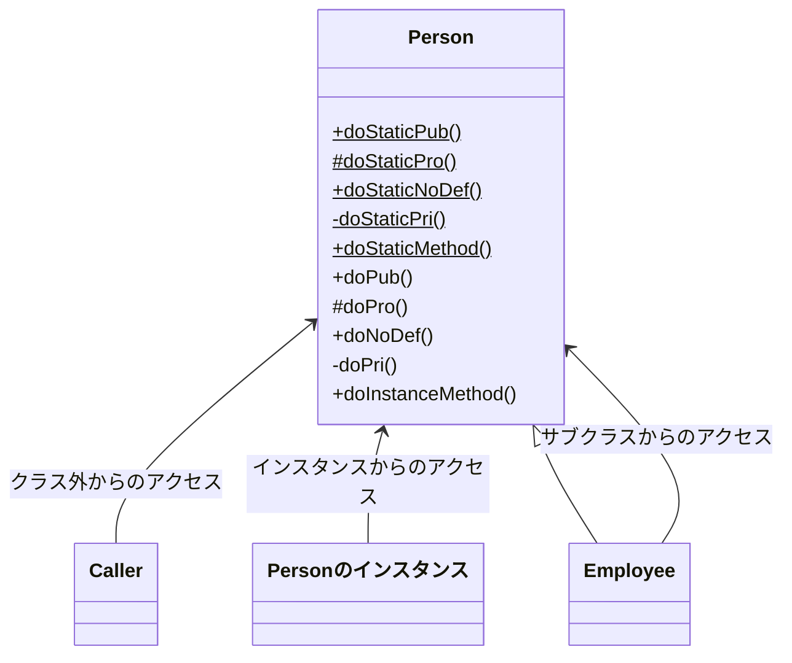

## はじめに

今回はオブジェクト指向プログラミングで馴染みのあるインターフェイスやクラスについて説明します。  

|名称|JavaScript|TypeScript|Java|用途|
|---|---|---|---|---|
|インターフェイス|-|interface|interface|オブジェクトの構造を定義する際に使用します|
|タイプエイリアス|-|type|≒interface|既存の型に別名を付ける際に使用します|
|クラス|class|class|class|オブジェクトの実体を定義する際に使用します|



## interface（インターフェイス）

オブジェクトの形状やクラスの仕様を定義したい場合に使用します。
* インターフェイス同士は継承が可能です。タイプエイリアスも継承できます。
* 再宣言可能: 同名でインターフェイスを宣言できます。
* JavaScriptに変換されるとインターフェイスは実体がなくなるため、`instanceof`などで比較できません。

### インターフェイスの宣言

インターフェイスの構文と定義例は下記の通りです。

```ts: 構文
/**
 * _インターフェイス名_　: インターフェイスの名称
 * _readonly_    　　　 :(任意)読み取り専用にする場合、指定します。
 * _属性名_　　　　　　　: 属性名
 * _属性型_             : 属性の型
 * _メソッド名_　　　　　: 振る舞い
 * _引数_　　　　　　　　:(任意)引数を持つ場合、設定します。複数指定する場合は`,`で区切って指定します。
 * _戻り値型_　　　　　　: 戻り値の型
 */
interface _インターフェイス名_ {
  _readonly_ _属性名_: _属性型_;
  _メソッド名_(_引数_): _戻り値型_;
}
```
* 文末のセミコロンはコンマでも定義できます。
* 振る舞いはアロー関数でも定義できます。

```ts: 定義例
interface BasePerson {
  id: number;
  _name: string;
  readonly secret: string; //*1
  comment?: string; //string or undefined *2
  getViewName(): string;
  updateName(name: string): void;
  updateComment: (comment: string) => void; //*3

  //*4
  get name(): string;
  set name(name: string);
}

//*5
interface BasePerson_comma {
  id: number,
  name: string,
}
```
* 1: 読み取り専用
* 2: `?`（オプション引数）を指定した引数はundefinedが許容されます。
* 3: アロー関数で定義した振る舞い仕様
* 4: ショートハンドで定義したアクセッサ仕様
* 5: 文末をコンマで書いた例

:::info
**TypeScriptとJavaの違い**
* TypeScript: 
  * 属性仕様が定義できます。
  * JavaScriptにトランスパイルされるとインターフェイスの実体はなくなるため、`instanceof`で型判定できません。型判定が必要な場合は型ガードを使用してください。
* Java: 
  * 属性仕様は定義できません。アクセッサ仕様を定義して代替してください。
  * インターフェイスの型判定に`instanceof`が使用できます。
:::

### コンストラクタシグネチャの定義

インターフェイスでコンストラクタシグネチャを定義できます。  
ジェネリクスや [インデックスシグネチャ](/typescript-intro/introduction-to-typescript-for-java-engineer_special-type#index-signature（インデックスシグネチャ）)を併用することで活かせるシーンがありそうです。

```ts: TypeScript
interface BasePerson {
  id: number;
  name: string;
}

class Person implements BasePerson {
  id: number;
  name: string;
  constructor(id: number, name: string) { this.id = id; this.name = name; }
}

interface PersonConstructor {
  new(id: number, name: string): BasePerson;
}

const person1: PersonConstructor = Person;
const person2 = new person1(1, "suzuki");
```

```java: Javaではどうなるか
// 対応する機能はありません。
```
Factoryメソッドパターンなどを代用することで同じようなことは実現できます。

### インターフェイスの再宣言

同名でインターフェイスを再定義し、インターフェイスをマージできる仕組みのことです。  
* インターフェイス間の整合性が保たれている必要があります。
* 再定義対象のインターフェイスは同一スコープ内である必要があります（スコープが異なると別物として扱われます）

```ts: TypeScript
interface BasePerson {
  id: number;
  name: string;
  getViewName(): string;
}

interface BasePerson {
  address: string,
}

interface BasePerson {
  // address: number, //*1
}

class Person1 implements BasePerson {
  id: number;
  name: string;
  address: string;  //*2
  getViewName = () => "hoge";

  constructor(id: number, name: string, address: string) {
    this.id = id;
    this.name = name;
    this.address = address;
  }
}
```
* 1: インターフェイス間の整合性が取れていないため、このような宣言はできません。
* 2: 再宣言で定義した属性が追加されます

```java: Javaではどうなるか
// 対応する機能はありません。
```
インターフェイスに継承関係を持たせて仕様を追加するか、追加仕様を別インターフェイスにして実装することで同じようなことは表現できます。



:::info
**TypeScriptとJavaの違い**
* TypeScript: 同一スコープ内で同名のインターフェイスを宣言できます。
* Java: 同一スコープ内では同名のインターフェイスは宣言できません。パッケージを分けるなどしてスコープを分ければ可能です。
:::

:::check
**インターフェイスの再宣言の使いどころ**
* 使い方によっては便利な機能ですが、バグを作りこみやすい機能なので利用は限定すべきです。
  * 外部システム、レガシーシステム、ライブラリなど直接変更ができない（もしくは難しい）インターフェイスに変更を加えたい場合に効果的に活用できる可能性があります。
  * 自領域など直接変更可能な場合は安易に使用しないことをお奨めします。
:::

### インターフェイスの継承

インターフェイスの継承例は下記の通りです。  
実装の仕方はJavaと変わりません。

```ts: TypeScript
interface BasePerson0 {
  id: number;
  name: string;
  getViewName(): string;
}
interface BasePerson extends BasePerson0 {
  address: string;
}
```

```java: Javaではどうなるか
interface BasePerson0 {
  int getId();
  void setId(int id);
  String getName();
  void setName(String name);
  String getViewName();
}
interface BasePerson extends BasePerson0 {
  String getAddress();
  void setAddress(String address);
}
```
* インターフェイスに属性は定義できないので、アクセッサ仕様を定義して代替しています。

## type（タイプエイリアス）

既存の型に別名を付けたい場合に使用する仕組みを指します。  
* タイプエイリアス同士は継承できませんが、[インターセクション](/typescript-intro/introduction-to-typescript-for-java-engineer_special-type#intersection（インターセクション型）)で同じようなことが実現できます。インターフェイスもインターセクションで合成できます。

### タイプエイリアスの宣言

タイプエイリアスの構文と定義例は下記の通りです。

```ts: 構文
/**
 * _タイプエイリアス名_　: タイプエイリアスの名称
 * _readonly_    　　　 :(任意)読み取り専用にする場合、指定します。
 * _属性名_　　　　　　　: 属性名
 * _属性型_             : 属性の型
 * _メソッド名_　　　　　: 振る舞い
 * _引数_　　　　　　　　:(任意)引数を持つ場合、設定します。複数指定する場合は`,`で区切って指定します。
 * _戻り値型_　　　　　　: 戻り値の型
 */

type _タイプエイリアス名_ = _属性型_; //型に別名を付ける場合
type _タイプエイリアス名_ = _(_引数_) => _戻り値型_; //関数に別名を付ける場合
type _タイプエイリアス名_ = { //構造を持つ型に別名を付ける場合
  _readonly_ _属性名_: _属性型_,
  _メソッド名_(_引数_): _戻り値型_,
};
```
* 指定する型またはメソッドが単数の場合、中括弧は不要です。
* 複数指定する場合、区切り文字はセミコロンでも定義できます。
* メソッドはアロー関数でも定義できます。

```ts: 定義例
type NumberType = number | null; //number or null *1
let num: NumberType = 1;

type TrafficLight = "red" | "yellow" | "blue"; //"red" or "yellow" or "blue" *1
const trafficLight: TrafficLight = "red";

type CallbackFn = (arg1: number, arg2: number) => boolean; //*2
const callbackFn: CallbackFn = (x: number, y: number) => x > y;

//*3
type Name = {
  lastNameKana: string, firstNameKana: string,
  lastName: string | null, firstName: string | null,
  readonly secret: string,
  getViewNameKana(suffix: string): string,
  compareXy1: (x: number, y: number) => boolean, //*4
  compareXy2: (x: number, y: number) => boolean, //*4
};
let name: Name = {
  lastNameKana: "suzuki", firstNameKana: "taro",
  lastName: "鈴木", firstName: "太郎",
  secret: "pass",
  getViewNameKana(suffix: string) {
    return `${this.lastNameKana} ${this.firstNameKana}${suffix}`;
  },
  //*5
  compareXy1: (x, y) => {
    // this.firstName;
    return x > y;
  },
  //*6
  compareXy2(x, y) {
    this.firstName; //thisは参照可
    return x > y;
  },
};

//*7
type Name_comma = {
  lastName: string;
  firstName: string;
};
```
* 1: 型に別名を付ける例
* 2: 関数に別名を付ける例
* 3: 構造を持つ型に別名を付ける例
* 4: これはメソッドではなく属性。インスタンスの作り方によって扱いが変わります。
* 5: アロー関数として定義しているため、`this`は外側のスコープに固定されます。したがって`this`で`name`を参照できません。
* 6: 直接関数を定義しているため、属性として認識されるものの、インスタンスメソッドとして動作します。したがって`this`で`name`を参照できます。
* 7: 区切り文字をセミコロンで書いた例

### コンストラクタシグネチャの定義

インターフェイスと同様、タイプエイリアスでもコンストラクタシグネチャを定義できます。  

```ts: TypeScript
type BasePerson = {id: number, name: string};

type PersonConstructor = {new(id: number, name: string): BasePerson};

class Person implements BasePerson {
  id: number;
  name: string;
  constructor(id: number, name: string) { this.id = id; this.name = name; }
}

const person1: PersonConstructor = Person;
const person2 = new person1(1, "suzuki");
```

```java: Javaではどうなるか
// 対応する機能はありません。
```
Factoryメソッドパターンなどで代用することで同じようなことは実現できます。

### タイプエイリアスの合成

タイプエイリアス同士は継承関係を持つことはできません。  
インターセクションタイプで合成できるので、その実装例を確認します。

```ts: TypeScript
type Person1 = { id: number, name: string };
type Person2 = { address: string, birthDate: string };

type Person = Person1 & Person2; // { id: number; name: string; address: string; birthDate: string; }
let person: Person = { id: 1, name: "suzuki", address: "tokyo", birthDate: "2000-01-01" };
```

```java: Javaではどうなるか
//対応する機能はありません。
```
インターフェイスに継承関係を持たせて仕様を追加するか、追加仕様を別インターフェイスにして実装することで同じようなことは表現できます。  
実装イメージは「インターフェイスの再宣言」と変わらないので省略します。

### Appendix：ユーティリティタイプを使ったタイプエイリアスの定義例

ユーティリティタイプを使うことで同じような定義を量産することなくタイプエイリアスを定義できます。  
APIのリクエストオブジェクトを作りたい場合など活用シーンは多くありそうです。  
便利とは言え、組み合わせすぎると分かりにくくなるので乱用は避けるのが良策です。  
```ts: TypeScript
type Person = { id: number, name: string, address: string, birthDate: string };

type PersonRequest = Omit<Person, "id">; // { name: string; address: string; birthDate: string; } *1
type PartialPerson = Pick<Person, "id" | "name">; // { id:string; name: string; } *2
type OptionalPerson = Partial<Person>; // { id?:string; name?: string; address?: string; birthDate?: string; } *3
type ReadonlyPerson = Readonly<Person>; // { readonly id: number; readonly name: string; readonly address: string; readonly birthDate: string; } *4
type RequiredPerson = Required<OptionalPerson>; // { id:string; name: string; address: string; birthDate: string; } *5
```
* 1: 一部の属性を除外
* 2: 一部の属性をピックアップ
* 3: すべての属性を任意
* 4: すべての属性を読み取り専用
* 5: すべての属性を必須

:::check
**インターフェイスとタイプエイリアスの使い分けはどうするべきか**
どちらも同じようなことができるので設計方針を定めて使い分ける必要があります。  
下記は使い分けの一案です。
* 基本方針
  * モデルに合わせた構造が採れる方法を選択する（継承関係にあるモノを合成で安易に代替しないなど）
  * DDDなどの設計方法論に基づくコンポーネント定義が策定されている場合、コンポーネントごとにどちらを選択するか定める
  * 迷った場合はどちらに寄せるかあらかじめ決める
* インターフェイス
  * オブジェクトの構造を定義する
  * 継承関係を持つ型を定義する
  * 拡張点として公開する型を定義する
* タイプエイリアス
  * 既存の型に別名を付ける
  * ユニオン型やインターセクション型などを利用して型定義する
  * 関数型を定義する
:::

## class（クラス）

オブジェクトの実体を定義したい場合に使用する。
* インターフェイスおよびタイプエイリアスが実装できます
* 抽象クラスには、抽象メソッドが定義できます
* クラス同士は継承できます

### クラスの宣言

クラスの構文と定義例は下記の通りです。

```ts: 構文
/**
 * _abstract_     :(任意)抽象クラスまたは抽象メソッドの場合、指定します。
 * _クラス名_      : クラスの名称
 * _アクセス修飾子_:(任意)スコープを設定したい場合に設定します。（public, protected, private。無指定の場合はpublic扱い）
 * _static_       :(任意)クラスメソッドまたはクラス変数の場合、指定します。
 * _readonly_     :(任意)読み取り専用にする場合、指定します。
 * _属性名_       : 属性名
 * _属性型_       :(任意)属性の型
 * _代入する値_   :(任意)初期値の設定が必要な場合、設定します。文中では"右辺"と表記します。
 * _メソッド名_   : 振る舞い
 * _引数_         :(任意)引数を持つ場合、設定します。複数指定する場合は`,`で区切って指定します。
 * _戻り値型_     :(任意)戻り値の型を明示したい場合に設定します。
 */
_abstract_ class _クラス名_ {
  _アクセス修飾子_ _static_ _readonly_ _属性名_: _属性型_ = _代入する値_; //属性

  constructor(_引数_) {/** 任意の処理。 */}

  _アクセス修飾子_ _abstract_ _メソッド名_(_引数_): _戻り値型_; //抽象メソッド
  _アクセス修飾子_ _static_ _メソッド名_(_引数_): _戻り値型_ {/** 任意の処理。 */}; //メソッド
}
```
* メソッドはアロー関数でも定義できます。

```ts: 定義例
abstract class BasePerson {
  /**
   * 住所変更。
   * @param address 住所
   */
  abstract editAddress(address: string): void;

  /**
   * 表示に成型した名前を取得する。
   * @returns 表示用の名前
   */
  abstract getViewName: () => string;
}

class Person extends BasePerson {
  /** ID。 */
  id: number | null = null;
  /** 名前。 */
  name: string;
  /** 住所。 */
  address: string;
  /** 読み取り専用の属性。 */
  readonly secret: string;

  /**
   * コンストラクタ。
   * @param name 名前
   * @param address 住所
   * @param secret 読み取り専用の属性
   */
  constructor(name: string, address: string, secret: string) {
    super();
    this.name = name;
    this.address = address;
    this.secret = secret;
  }

  editAddress(address: string): void { this.address = address; }

  getViewName = () => { return `${this.name}様`; };
}
```
:::info
**TypeScriptとJavaの相違点**
* TypeScript:
  * クラスにアクセス修飾子は設定できません
  * タイプエイリアスを実装できます
* Java:
  * クラスにアクセス修飾子が設定できます

**JavaScriptでは**
* インターフェイスおよびタイプエイリアスは利用できません
* 抽象クラスおよび抽象メソッドが定義できません
:::

### ショートハンドを使ったクラスの宣言

属性は、コンストラクターのパラメーターにアクセス修飾子を付与することで自動的に定義できます。  
アクセッサは、get/setキーワードで定義できます。

```ts: TypeScript
class Person {
  constructor(private _id: number, private _name: string, _address: string) {
    this._id = _id;
    this._name = _name;
    // this._address = _address; //*1
  }
  get id(): number {
    return this._id;
  }
  set id(id: number) {
    this._id = id;
  }
}
let person = new Person(1, "suzuki", "tokyo"); //{1, suzuki, tokyo}
// person._id; //*2
// person._name; //*2
person.id;
person.id = 2; //{2, suzuki, tokyo}
```
* 1: アクセス修飾子がなく属性として認識されてないのでエラー
* 2: スコープ外なので参照できません

### インターフェイスの実装

インターフェイスは抽象クラスまたはクラスで実装します。  
実装の仕方はJavaと変わりません。  
抽象クラスによる実装は内容が変わらないため省略しています。



```ts: TypeScript
// インターフェイス
interface BasePerson {
  id: number;
  name: string;
  getViewName(): string;
}

// クラスで実装
class Person implements BasePerson {
  id: number;
  name: string;
  getViewName(): string { return `${this.name}様`; }

  constructor(id: number, name: string) {
    this.id = id;
    this.name = name;
  }
}
```

```java: Javaではどうなるか
// インターフェイス
interface BasePerson {
  void setId(Long id);
  Long getId();
  void setName(String name);
  String getViewName();
}

// クラスで実装
@AllArgsConstructor
@Getter
@Setter
class Person implements BasePerson {
  private Long id;
  private String name;

  public String getViewName() {
    return "%s様".formatted(this.name);
  }
}
```

### クラスの継承

継承は`抽象クラス<-抽象クラス`、`抽象クラス<-クラス`、`クラス<-クラス`の組み合わせが実施できます。  
実装の仕方はJavaと変わりません。
コード例は`抽象クラス<-クラス`を掲載しています。他のケースは、実装は内容が変わらないため省略しています。



```ts: TypeScript
//抽象クラス
abstract class BasePerson {
  id: number;
  name: string;
  constructor(id: number, name: string) {
    this.id = id;
    this.name = name;
  }
  //抽象メソッド
  protected abstract getViewName(): string;
}

// 抽象クラスを継承
class Person extends BasePerson {
  constructor(id: number, name: string) {
    super(id, name);
  }
  protected getViewName(): string {
    return `${this.name}様`;
  }
}
```

```java: Javaではどうなるか
// 抽象クラス
@AllArgsConstructor
@Getter
@Setter
abstract class BasePerson {
  private Long id;
  private String name;

  // 抽象メソッド
  protected abstract String getViewName();
}

// 抽象クラスを継承
class Person extends BasePerson {
  public Person(Long id, String name) {
    super(id, name);
  }

  protected String getViewName() {
    return "%s様".formatted(getName());
  }
}
```

### スコープの確認

属性、振る舞いのスコープを確認します。 

|アクセス修飾子|アクセス可能な範囲（TypeScript）|アクセス可能な範囲（Java）| 
|---|---|---|
|public|どこからでもアクセスできます|同左|
|protected|同一クラス内、サブクラス内のみ|同一パッケージ内、サブクラス内のみ|
|無指定|public扱いになるため、スコープはpublicと同じ|package private: 同一パッケージ内のみ|
|private|同一クラス内|同左|

コード例には下記の検証内容を掲載しています。


```ts: TypeScript
class Person {
  //クラス変数
  public static attrStaticPub = 1;
  protected static attrStaticPro = 1;
  static attrStaticNoDef = 1;
  private static attrStaticPri = 1;

  //メンバ変数
  public attrPub = 1;
  protected attrPro = 1;
  attrNoDef = 1;
  private attrPri = 1;

  //クラスメソッド
  public static doStaticPub() {}
  protected static doStaticPro() {}
  static doStaticNoDef() {}
  private static doStaticPri() {}

  //メンバメソッド
  public doPub() {}
  protected doPro() {}
  doNoDef() {}
  private doPri() {}

  constructor(attrPub: number, attrPro: number, attrNoDef: number, attrPri: number) {
    this.attrPub = attrPub; this.attrPro = attrPro; this.attrNoDef = attrNoDef; this.attrPri = attrPri;
  }
}

/** サブクラス。 **/
class Employee extends Person {
  //*****サブクラス内からののアクセス
  doMethod() {
    Person.attrStaticPub;
    Person.attrStaticPro;
    Person.attrStaticNoDef;
    // Person.attrStaticPri; //*1

    this.attrPub;
    this.attrPro;
    this.attrNoDef;
    // this.attrPri; //*1

    Person.doStaticPub();
    Person.doStaticPro();
    Person.doStaticNoDef();
    // Person.doStaticPri(); //*1

    this.doPub();
    this.doPro();
    this.doNoDef();
    // this.doPri(); //*1
  }
}

const caller = () => {
  //****クラス外からのアクセス
  Person.attrStaticPub;
  // Person.attrStaticPro; //*1
  Person.attrStaticNoDef;
  // Person.attrStaticPri; //*1

  Person.doStaticPub();
  // Person.doStaticPro(); //*1
  Person.doStaticNoDef();
  // Person.doStaticPri(); //*1

  //****インスタンスからのアクセス
  let person = new Person(1, 2, 3, 4);

  person.attrPub;
  // person.attrPro; //*2
  person.attrNoDef;
  // person.attrPri; //*1

  person.doPub();
  // person.doPro(); //*2
  person.doNoDef();
  // person.doPri(); //*1
}
```
* 1: スコープ外のため、アクセスできません
* 2: protectedはインスタンスからは呼び出せません

```java: Javaではどうなるか
//protectedの範囲が異なるのでパッケージを分けています。

//package example.person;
@AllArgsConstructor
public class Person {
  // クラス変数
  public static int attrStaticPub = 1;
  protected static int attrStaticPro = 1;
  public static int attrStaticNoDef = 1;
  private static int attrStaticPri = 1;

  // メンバ変数
  public int attrPub = 1;
  protected int attrPro = 1;
  public int attrNoDef = 1;
  private int attrPri = 1;

  // クラスメソッド
  public static void doStaticPub() {}
  protected static void doStaticPro() {}
  public static void doStaticNoDef() {}
  private static void doStaticPri() {}

  // メンバメソッド
  public void doPub() {}
  protected void doPro() {}
  public void doNoDef() {}
  private void doPri() {}
}

//package example.employee;
/** サブクラス。 */
public class Employee extends Person {

  public Employee(int attrPub, int attrPro, int attrNoDef, int attrPri) {
    super(attrPub, attrPro, attrNoDef, attrPri);
  }

  //*****サブクラス内からののアクセス
  void doMethod() {
    System.out.println(Person.attrStaticPub);
    System.out.println(Person.attrStaticPro);
    System.out.println(Person.attrStaticNoDef);
    // System.out.println(Person.attrStaticPri); // *1

    System.out.println(this.attrPub);
    System.out.println(this.attrPro);
    System.out.println(this.attrNoDef);
    // System.out.println(this.attrPri); // *1

    Person.doStaticPub();
    Person.doStaticPro();
    Person.doStaticNoDef();
    // Person.doStaticPri(); // *1

    this.doPub();
    this.doPro();
    this.doNoDef();
    // this.doPri(); //*1
  }
}

//package example.caller;
public class Caller {
  public void callPerson() {
    //****クラス外からのアクセス
    System.out.println(Person.attrStaticPub);
    // System.out.println(Person.attrStaticPro); // *1
    System.out.println(Person.attrStaticNoDef);
    // System.out.println(Person.attrStaticPri); // *1

    Person.doStaticPub();
    // Person.doStaticPro(); // *1
    Person.doStaticNoDef();
    // Person.doStaticPri(); //*1

    //****インスタンスからのアクセス
    var person = new Person(1, 2, 3, 4);

    System.out.println(person.attrPub);
    // System.out.println(person.attrPro); // *2
    System.out.println(person.attrNoDef);
    // System.out.println(person.attrPri); // *1

    person.doPub();
    // person.doPro(); // *2
    person.doNoDef();
    // person.doPri(); //*1
  }
}
```
* 1: スコープ外のため、アクセスできません
* 2: protectedはインスタンスからは呼び出せません

:::info
**TypeScriptとJavaの相違点**
* TypeScript
  * スコープ無指定の場合、public扱いになります
  * protectedの範囲: 同一クラス内、サブクラス内のみアクセスできます
* Java
  * スコープ無指定の場合、package privateになります
  * protectedの範囲: 同一パッケージ内、サブクラス内のみアクセスできます
:::
