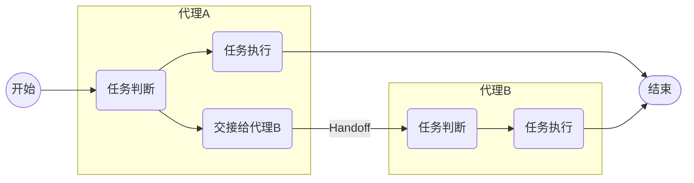
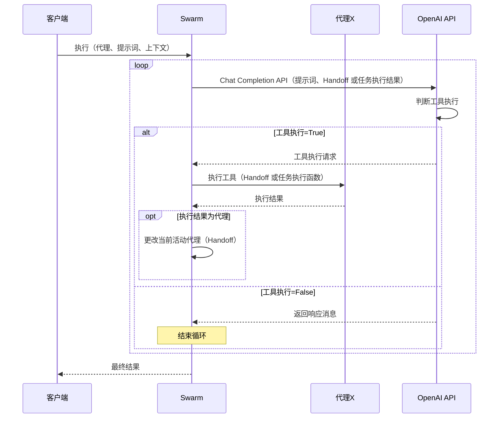
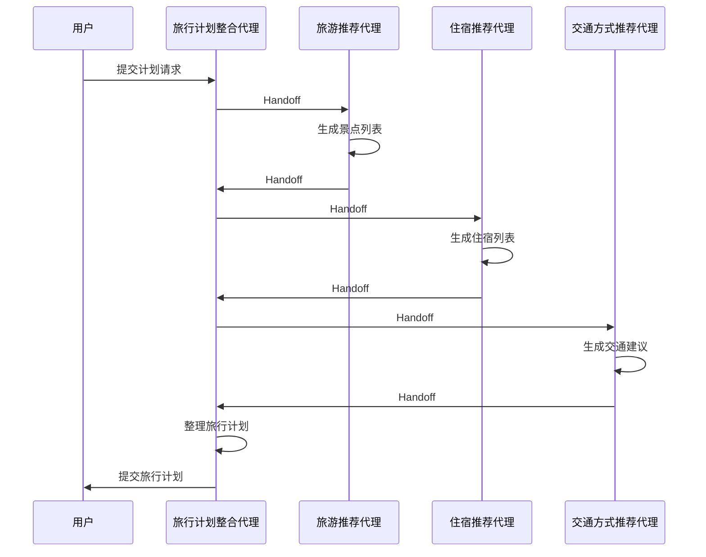

这是[is开发者网站Advent Calendar 2024](/events/advent-calendar/2024/)的第4天文章。

如果说2025年有望腾飞的AI重点技术，代理功能绝对是其中之一[^1]。

最近，Anthropic公开了一种名为[Computer Use](https://docs.anthropic.com/en/docs/build-with-claude/computer-use)的AI，可直接操作PC的AI代理（目前是Beta版本[^2]），在业界引发了热议。
与此同时，OpenAI、Google等AI厂商也计划陆续推出自主型代理功能，这既受到极大期待，也带来了一定的伦理担忧。

[^1]: 代理功能的定义尚未明确，这里将其理解为可以递归执行任务，直至完成目标的AI功能。
[^2]: 虽然目前是Beta版本，但可以通过Anthropic API，以及AWS Bedrock或Google Cloud Vertex使用（Claude 3.5 Sonnet模型）。

这一次，我们来学习一下这些备受期待的AI代理如何通过协作来实现一个目标（代理编排）的机制。
实现的方式有多种可选，但这次我们会深入探讨OpenAI Cookbook中以下文章提到的方法：

@[og](https://cookbook.openai.com/examples/orchestrating_agents)

本文标题中提到的Swarm，是该文章中展示的代理编排的一个样例实现，并已作为GitHub上的开源代码发布（笔者看到标题时想起了Docker Swarm[^3]）。

[^3]: 虽然与Docker Swarm完全不同，但Docker Swarm用于协调容器，而OpenAI Swarm用于协调代理，从对象上看有所不同，但其意义是相似的。

@[og](https://github.com/openai/swarm/tree/main)

此项目并非官方产品，而是示例代码，但对于学习代理编排的思路非常有帮助。

## Swarm 的概念

Swarm 的思路非常简单，由以下两大概念构成。

## Routines / Agent

在Cookbook中称其为Routines，而在Swarm的README中称为Agent。本文统一使用代理（Agent）。

以下引用自Cookbook文章：

> "routine" 的概念并未得到严格定义，而是用来概括用于完成任务的一系列步骤。具体来说，我们可以将其定义为一组以自然语言指令（我们用系统提示表示）编写的指令，以及完成这些指令所需的工具。

正如说明，代理由自然语言编写的指令以及执行该指令的工具构成。

从实现层面看，代理利用了以函数调用（Function calling）为基础的Chat Completion API。
以下是Swarm中Agent类的类型定义：

```python
class Agent(BaseModel):
    name: str = "Agent"
    model: str = "gpt-4o"
    instructions: Union[str, Callable[[], str]] = "You are a helpful agent."
    functions: List[AgentFunction] = []
    tool_choice: str = None
    parallel_tool_calls: bool = True
```

其中，`instructions`（系统消息）和`functions`（Function calling）是关键属性。
`instructions`中包含了代理的职责描述及完成任务的指令，而`functions`中定义了具体执行任务的函数。

此外，由于需要处理多个代理，因此通过`name`标识不同的代理。

从设计来看，Swarm定义代理的方式非常简单，聚焦于最基础必要的部分。

## Handoff

代理编排的核心是Handoff（交接）。
以下引自Cookbook：

> 我们将handoff定义为一个代理（或例程）将当前的会话交接给另一个代理，就像在电话会议中将通话转移给其他人。但在这种情况下，代理拥有完整的会话历史！

可以将其想象为将电话转接给其他人的场景。

在代理编排的上下文中，如果某项任务超出了当前代理的责任范围，那么将任务交接给合适的代理就是Handoff。

代理A -> 代理B的任务交接可以用以下图示表示：



通过连续Handoff接力代理，可以构建更大的代理编排网络。

在Swarm中，通过将Handoff函数加入工具列表实现交接。
一个Handoff函数可能如下所示：

```python
# 下一接手的代理
refund_agent = Agent(...)

# Handoff 函数
def transfer_to_refunds():
    """用于处理用户退款请求时调用"""
    return refund_agent
```

Handoff函数需要返回下一个代理。函数命名一般采用`transfer_to_XXX`（XXX为代理名）的形式，这样便于LLM准确判断是否可以执行。

Handoff函数需要在交接代理的工具（`functions`）中预先指定。

```python
triage_agent = Agent(
    name="Triage Agent",
    instructions=triage_instructions,
    # 添加 Handoff 函数
    functions=[transfer_to_flight_refunds, transfer_to_xxxx],
)
```

这个代理仅配置了Handoff函数，但也可以与普通函数组合使用。
通过这种配置，代理（LLM）会选择合适的下一个代理，并传递当前任务。

## Swarm 的执行流程

我们来梳理一下Swarm的大致执行流程（省略了部分细节控制）。



LLM会持续调用API执行任务，直到判断无需调用工具（即生成消息）。其中一旦执行了Handoff函数，当前活动代理会切换到下一个代理。
此外，Handoff时还会传递消息历史和上下文信息，以便后续代理可以参考之前的信息和用户上下文。

如果是用户与代理间的对话模式，则只需重复以上循环即可实现。Swarm提供了[run_demo_loop函数](https://github.com/openai/swarm/blob/main/swarm/repl/repl.py#L60)作为示例。

## 实际运行 Swarm

理解了代理编排机制之后，最后我们来运行实例。
这次以旅行计划生成功能为例，构建以下代理的协同工作：

- 旅行计划整合代理：从各代理收集信息，为客户制定旅行计划。
- 旅游推荐代理：根据目的地推荐旅游景点。
- 住宿推荐代理：推荐目的地附近的住宿。
- 交通方式推荐代理：根据出发地和目的地选择最佳交通方式。

由旅行计划整合代理作为用户接口，利用其他代理的协作（Handoff）构建最终的旅行计划。



接着编写代码实现协作代理功能......（后略，全代码已在日文文章中提供，不再重复）。

最终在CLI运行，生成了完整的旅行计划，读者可以查看响应内容及日志。

## 最后

通过Swarm，我们了解了代理编排的基本机制。Swarm的设计目的偏向教学，其结构十分简洁，但理解这些基本思路后，可以延伸应用于并行代理、多任务处理，以及规模性编排。

结合Assistants API，可以扩展支持更多实用工具（如文件搜索、代码解释器），进一步拓展功能边界。

未来，是否会出现类似Kubernetes的，专门支持资源编排的代理平台？也许已经有所尝试。
此外，随着多代理时代的到来，代理粒度的设计也将成为新的课题。一种类似于“微服务”的，共享职责的“微代理”设计思维或许会引领潮流，避免出现“全能代理”的困境。
