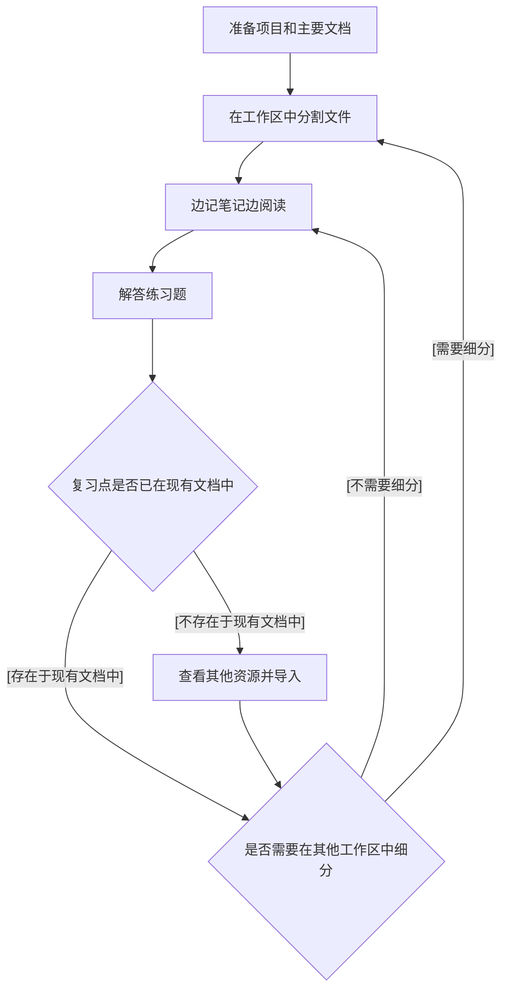

这是[is开发者网站Advent Calendar 2024](/events/advent-calendar/2024/)第18日的文章。

## 引言
我是来自业务解决方案事业部的山下。这次我想结合AWS认证资格学习，给大家介绍一款名为LiquidText的文档管理工具。以下是本文将要涵盖的内容以及不会涉及的内容。

### 涉及内容
- LiquidText简介
- AWS认证资格学习与LiquidText的结合优势
- 我的具体应用示例
### 未涉及内容
- 特定AWS认证资格的攻略方法
- LiquidText的详细功能

## 什么是LiquidText
@[og](https://www.liquidtext.net/)
这是近年备受关注的文档工具。不仅可以提取文档中的文字或图表进行保存，还可以实现知识的高效管理，超越了简单的文档功能。
[官方网站](https://www.liquidtext.net/)列出了如下特点：
- 灵活的PDF注释功能：可以通过拖拽轻松添加高亮或笔记
- 直观的文档对比：可同时打开多个PDF进行横向参考与对比
- 互动式工作区：可以提取重要的部分并进行链接或分组
- 多设备支持：可在iPad、Windows等多种设备上同步使用

仅通过文字可能不够直观，因此以下展示一些使用示例。

### 示例项目
以下是从提供的示例工作区中引用的图片，希望通过这些图片能够让大家感受到使用的体验。

默认设置下，左半部分显示文档内容，右半部分为工作区（笔记区）。工作区不仅可以直接从文档中拖拽文字或图片，还可以添加自己的笔记。同时，从拖入工作区的文字可以快速跳转回原文档位置。

## AWS认证资格与LiquidText的结合优势
AWS认证资格通常具有以下特点：
- 要求对于目标服务有全面的知识理解
- 需要理解某些固定（架构）模式，例如：
  - CloudFront的设置以S3作为源
  - 结合Lambda、API Gateway和DynamoDB的无服务器架构
  - 等等…
- 需要理解部分YAML模板，例如：
  - CloudFormation的栈
  - S3存储桶策略
  - 等等…
- 需要一定的理论知识理解，例如：
  - 理解Route53中的DNS服务器
  - 对于MEA限定部分，需要了解机器学习相关知识
  - 等等…

为此，学习这类知识需要广泛而深入的资料。然而无需过于担心，无论是收费还是免费的资源，都一定能找到对应粒度的文档。

与上述特点对照，可以想象出如下匹配关系：
- 要求掌握目标服务的全面知识
  → 认证备考课程资料
- 需要理解固定（架构）模式  
  → 课程文档、AWS官方文档，有时也可能参考网络文章
- 需要理解部分YAML模板
  → AWS官方文档等 
- 需要掌握一定的理论知识
  → 其他相关文档

如果能存储多份必要的文档，广泛收集和管理信息，就能更有效地展开学习。因此，我选择前文提到的LiquidText作为文档管理工具。以下是我具体使用的示例，希望能帮助大家更好地理解。

## AWS认证考试学习中的使用示例
### 使用流程
大致的LiquidText使用方式如下：

主要是在项目创建初期和复习阶段时使用LiquidText。在初期，需要准备核心文档并导入LiquidText。如果此时提前将工作区分割好，会更有条理。同时在分区时可对文件有全局性的俯瞰，因此个人认为这是一个推荐的做法。

复习时，利用搜索功能检查文档中是否已有相关内容。如果包含则详细查看，如果没有就从外部资源引入并阅读。如果教材中表达不够清晰，也可以参考一些解释性网络文章的其他资源。

以上听起来可能显得抽象，以下以AWS某服务（Route53）为例举一个情境：
- 在初期阶段，仅对Route53进行概要理解
- 同时设置一个Route53工作区
- 将文档中的章节标题拖入工作区并与文档建立关联
- 开始解答练习题
- 根据练习题结果发现自己对Route53的理解不足
- 查看课程教材，对子概念（例如托管区域，解析器）细分工作区
- 将创建的工作区与文档关联
- 针对某些情境的问题：
  - 比如将私有托管区域（private hosted zone）和自己VPC进行绑定等
- 导入其他文档并与工作区进行关联
- 再次解答问题
- 等等…

为了让大家更明确理解，以下展示我的实际示例。

### 示例1: AWS Budgets

- 诸如章节标题及一些关键表达都已被移至工作区中
- 通过右侧笔记可以跳转回PDF原文

### 示例2: CloudHSM

- 非核心学习材料的部分内容通过解读性文章导入
- 不清楚的表达或需要注意的点都被拖入笔记区保存

### 示例3: 具有层级结构的工作区

- 通过工作区可以构建层级结构

## 其他注意事项或提示
- 大型PDF文件无法处理  
  文件大小有限制，大容量PDF或大量文档同时导入可能会导致软件运行不稳定甚至崩溃。若单个文件超过50MB，请考虑进行分割。
- 高效管理工作区的方法  
  可以按AWS服务进行分区，如果有更细节的话题则进一步细分。但无论如何，将所有内容置于一个工作区会导致视图混乱。
- 不适合目录式整理  
  即使使用搜索功能，目前依然缺乏一种快速掌握特定分类所在位置的手段。在这种情况下我会结合其他工具。
- 导入多个文档需要付费  
  需要购买永久授权或订阅月费计划[^1]。详情请参考[价格相关链接](https://www.liquidtext.net/pricing-features)。
- 单靠阅读文档无法通过考试  
  无论LiquidText有多方便，考试的通过不可能仅靠阅读文档。请将其仅视作文档管理辅助工具。

[^1]: 截至2024年12月，永久授权价格为49.99美元，每月订阅费用为7.99美元起。

## 总结
这次，我以AWS认证资格学习为重点介绍了LiquidText的使用方法。目前我仍在学习中，但LiquidText对AWS认证资格学习起到了重要辅助作用。不仅仅是针对资格考试，这款工具也是阅读和管理文档的强大辅助工，聊起兴趣的朋友不妨尝试一下它。
