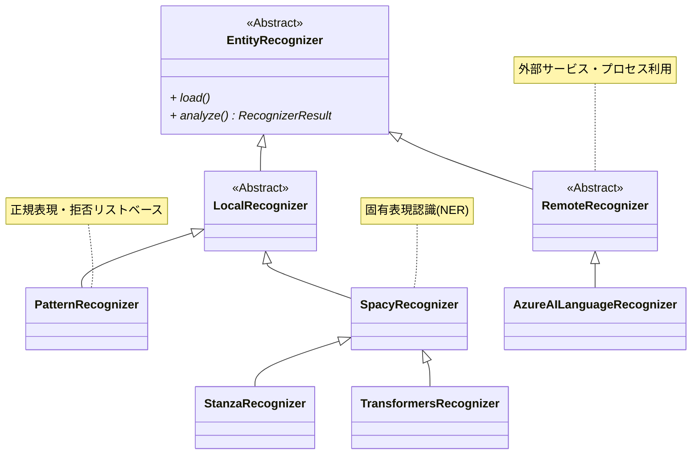

近年来，人们对于个人信息保护的意识越来越高。  
其背后原因在于大规模语言模型（LLM）的引入和普及。LLM 在各种场景中被广泛应用，但由于处理的数据中可能包含个人信息，因此必须进行适当的管理。

在这种情况下，我注意到这次 Microsoft 提供的开源工具 Presidio。

@[og](https://github.com/microsoft/presidio/)

Presidio 是一个用于检测能够识别个人身份的信息（PII: Personally Identifiable Information）并进行匿名化处理的 Python 框架。  
借助该工具，企业和开发者可以在 LLM 或其他系统中安全地使用数据。

Presidio 的特点在于能够从非结构化数据中以高精度检测出个人信息。  
随后，通过对检测到的信息进行掩码或替换处理，在确保数据机密性的同时，实现数据的实用化利用。

此外，Presidio 具有模块化设计的特点，使得添加自定义实体或修改处理逻辑变得十分简单。  
因此，它具备应对各国或各组织不同需求的灵活性。

:::info
Presidio 还包含面向图像数据或结构化数据中个人信息的专用包（截至撰写时以 Beta 或 Alpha 版本提供）。  
本文不讨论这些功能，有兴趣的读者请参阅以下官方文档：

- [Presidio Doc - Presidio Image Redactor](https://microsoft.github.io/presidio/image-redactor/)
- [Presidio Doc - Presidio structured](https://microsoft.github.io/presidio/structured/)
:::

## 设置 Presidio

Presidio 的设置非常简单。  
这里介绍了使用用于检测个人信息的 Presidio Analyzer 以及对其进行匿名化处理的 Presidio Anonymizer 的基本安装步骤。

首先安装所需的 Presidio 包：

```shell
pip install presidio-analyzer presidio-anonymizer
```

在 Presidio 中，主要利用自然语言解析框架（以下简称 NLP 引擎）来执行两项任务。  
一项是基于命名实体识别（NER: Named Entity Recognition）来识别个人信息（PII）；另一项是利用上下文实现高级检测的规则基础特征提取。

这次我们将使用 [spaCy](https://spacy.io/) 的日语模型 ([ja_core_news_trf](https://spacy.io/models/ja#ja_core_news_trf)) 作为 NLP 引擎。  
接下来，通过 spaCy 的 download 命令单独下载该模型。

```shell
python -m spacy download ja_core_news_trf
# 检查已下载的模型 (Pipelines)
python -m spacy info
# ============================== Info about spaCy ==============================
# 
# spaCy version    3.8.3                         
# Location         /path/to/presidio-trial/.venv/lib/python3.12/site-packages/spacy
# Platform         macOS-15.1.1-arm64-arm-64bit  
# Python version   3.12.4                        
# Pipelines        en_core_web_lg (3.8.0), ja_core_news_trf (3.8.0)
```

此外，还可以使用 [stanza](https://stanfordnlp.github.io/stanza/) 和 [Huggingface Transformers](https://huggingface.co/docs/transformers/en/index) 作为 NLP 引擎。

- [Presidio Doc - 在 Presidio Analyzer 中自定义 NLP 引擎](https://microsoft.github.io/presidio/analyzer/customizing_nlp_models/)

## 基本用法

这里说明如何使用 Presidio 从示例文本中检测个人信息并对其匿名化处理。  
以下例子使用包含人名（PERSON）和电话号码（PHONE_NUMBER）的日语文本。

### 检测个人信息（Presidio Analyzer）

使用 Presidio Analyzer 检测文本中的个人信息。

```python
from presidio_analyzer import AnalyzerEngine
from presidio_analyzer.nlp_engine import NlpEngineProvider

# NLP 引擎设置。指定下载的日语模型
configuration = {
    "nlp_engine_name": "spacy",
    "models": [
        {"lang_code": "ja", "model_name": "ja_core_news_trf"}
    ],
}
provider = NlpEngineProvider(nlp_configuration=configuration)
nlp_engine = provider.create_engine()

analyzer = AnalyzerEngine(nlp_engine=nlp_engine, supported_languages=["ja"])

sample_text = "豆蔵太郎の電話番号は080-1234-5678です。"

# 检测个人信息
results = analyzer.analyze(
    text=sample_text,
    entities=["PERSON", "PHONE_NUMBER"],
    language="ja"
)
for result in results:
    print(f"entity: {result.entity_type}, start: {result.start}, end: {result.end}")
```

该代码的执行结果如下：

```
(出力結果)
entity: PERSON, start: 0, end: 4, score: 0.85
entity: PHONE_NUMBER, start: 10, end: 23, score: 0.4
```

- entity: 检测到的实体类型（PERSON, PHONE_NUMBER）。  
- start/end: 文本中检测到的位置。  
- score: 检测的置信分数（范围 0～1）。

可以看出，人名、电话号码等个人信息被正确检测出来。

:::info
通过指定检测时的阈值 `score_threshold`，可以排除分数低于该阈值的检测结果。

```python
results = analyzer.analyze(
    text=sample_text,
    entities=["PERSON", "PHONE_NUMBER"],
    language="ja",
    score_threshold=0.5 # 指定分数阈值
)
```

在此示例中，如此指定后，分数为 0.4 的电话号码将从检测结果中排除。
:::

### 个人信息匿名化（Presidio Anonymizer）

接下来，对个人信息进行匿名化处理。在前面的个人信息检测之后，增加以下代码：

```python
from presidio_anonymizer import AnonymizerEngine

anonymizer = AnonymizerEngine()
# 将个人信息检测结果传入，对示例文本进行匿名化
anonymized_text = anonymizer.anonymize(text=sample_text,analyzer_results=results)

for item in anonymized_text.items:
    print(f"entity: {item.entity_type}, start: {item.start}, end: {item.end}, text: {item.text}, operator: {item.operator}")
print(f"匿名化結果: {anonymized_text.text}")
```

该代码的执行结果如下：

```
entity: PHONE_NUMBER, start: 14, end: 28, text: <PHONE_NUMBER>, operator: replace
entity: PERSON, start: 0, end: 8, text: <PERSON>, operator: replace
匿名化結果: <PERSON>の電話番号は<PHONE_NUMBER>です。
```

检测到的个人信息已被匿名化处理（此处为替换为实体名）。

## 定制个人信息识别（Recognizer）

可以看出，即使在默认状态下，Presidio 也能以一定精度检测出个人信息。  
但在实际应用中，由于需要准确检测日本特有的信息或组织专用格式，定制化几乎是必不可少的。

在定制个人信息识别规则方面，Recognizer 起着核心作用。

每个 Recognizer 都采用不同的方法来检测一个或多个实体（如人名、电话号码、地址等）。  
其实现方法包括：

- 正则表达式/禁用词列表：基于固定模式的高效检测。  
- 命名实体识别（NER）：利用考虑上下文的机器学习模型实现高级检测，依赖 NLP 引擎（如 spaCy 或 stanza 等）。  
- 自定义逻辑：应用基于特定业务或项目需求的自有规则。

通过灵活组合这些方法，可以实现高精度的检测。

以下是展示 Presidio 主要 Recognizer 的类图。



该类图以 EntityRecognizer 为顶点构成层级结构。  
在定制 Recognizer 时，请重点关注以下类：

- [EntityRecognizer](https://github.com/microsoft/presidio/blob/main/presidio-analyzer/presidio_analyzer/entity_recognizer.py)  
  - 整个 Recognizer 的基类。load 方法和 analyze 方法为扩展点。
- [LocalRecognizer](https://github.com/microsoft/presidio/blob/main/presidio-analyzer/presidio_analyzer/local_recognizer.py)  
  - 用于本地进程的 Recognizer。
- [PatternRecognizer](https://github.com/microsoft/presidio/blob/main/presidio-analyzer/presidio_analyzer/pattern_recognizer.py)  
  - 基于正则表达式和禁用词列表的 Recognizer，同时支持基于验证和上下文的分数加成（Context Enhancement）。
- [RemoteRecognizer](https://github.com/microsoft/presidio/blob/main/presidio-analyzer/presidio_analyzer/remote_recognizer.py)  
  - 用于包含外部服务的远程进程的 Recognizer。

此外，虽然上图中未全部展示，但 Presidio 已预置了许多内置 Recognizer。

@[og](https://github.com/microsoft/presidio/tree/main/presidio-analyzer/presidio_analyzer/predefined_recognizers)

首先建议确认这些 Recognizer 是否可以定制，如不行，则自行实现可能更好。自行实现时，内置 Recognizer 的源码将是极好的参考资料。

### 内置 Recognizer

这里，我们尝试定制并应用 Presidio 内置的 Recognizer。

#### 针对日本的电话号码支持

在前面的例子中，检测到了 080-1234-5678 这样的手机号码，但这并非针对日本特有的号码体系。  
实际上，它只是与默认配置的其他地区（例如印度(IN)格式）匹配罢了。

为了验证这一点，将电话号码从 080-1234-5678 改为固定电话的 03-1234-5678 进行测试。以下是执行结果：

```
entity: PERSON, start: 0, end: 4, score: 0.85
```

在此结果中，人名（PERSON）被检测出来，但电话号码（PHONE_NUMBER）未被检测到。

将其修改为能检测日本电话号码格式。如下所示，将内置的 [PhoneRecognizer](https://github.com/microsoft/presidio/blob/main/presidio-analyzer/presidio_analyzer/predefined_recognizers/phone_recognizer.py) 设置为支持日本后添加进去。

```diff-python
# （略）

+ from presidio_analyzer.predefined_recognizers import PhoneRecognizer

provider = NlpEngineProvider(nlp_configuration=configuration)

nlp_engine = provider.create_engine()
+ phone_recognizer = PhoneRecognizer(
+     supported_regions=["JP"],
+     supported_language="ja",
+     context=["電話"]
+ )
+ analyzer = AnalyzerEngine(nlp_engine=nlp_engine, supported_languages=["ja"])
+ analyzer.registry.add_recognizer(phone_recognizer)

+ # 示例文本 -> 检测固定电话
+ sample_text = "豆蔵太郎の電話番号は03-1234-5678です。"

# 检测个人信息
results = analyzer.analyze(
    text=sample_text,
    entities=["PERSON", "PHONE_NUMBER"],
    language="ja"
)
for result in results:
    print(f"entity: {result.entity_type}, start: {result.start}, end: {result.end}, score: {result.score}")
```

在 PhoneRecognizer 的构造函数中，通过将区域（`supported_regions`）指定为 `JP`，支持日本特有的电话号码格式[^1]。

[^1]: PhoneRecognizer 内部使用 [phonenumbers](https://pypi.org/project/phonenumbers/) 来识别各地区相应的电话号码格式。

另外，这里在 `context` 中指定了 `電話`。  
这利用了 Presidio 的 Context Enhancement 功能，根据上下文调整分数。如果实体前后[^2]包含“電話”这个词，则认为其更可能为电话号码，故加分[^3]。  
加分值和上下文范围均可自由调整，详情请参阅官方文档。

[^2]: 在默认设置下，会检查前 5 个标记中是否包含上下文词汇。所使用的 Enhancer 的源码请参见 [こちら](https://github.com/microsoft/presidio/blob/main/presidio-analyzer/presidio_analyzer/context_aware_enhancers/lemma_context_aware_enhancer.py)。  
[^3]: 默认情况下，如果上下文匹配会加 0.35 分，而且加分后分数不会低于 0.4。

- [Presidio Doc - 利用上下文词汇](https://microsoft.github.io/presidio/tutorial/06_context/)

执行后将得到以下结果：

```
entity: PERSON, start: 0, end: 4, score: 0.85
entity: PHONE_NUMBER, start: 10, end: 22, score: 0.75
```

这一次检测到了电话号码，并且分数也从之前的 0.4 提高到 0.75。  
这是由于 Context Enhancement 根据上下文匹配（此处为 `電話`）所加的分数所致。

#### 信用卡号码识别

在多项试验中注意到，当指定为日语时，信用卡号码未被识别为个人信息，这存在较大问题。

不过，Presidio 已预置了信用卡号码的 Recognizer（[CreditCardRecognizer](https://github.com/microsoft/presidio/blob/main/presidio-analyzer/presidio_analyzer/predefined_recognizers/credit_card_recognizer.py)）。  
该 Recognizer 除了使用正则表达式模式匹配外，还进行校验和验证。  
然而，仔细阅读源码后发现，这个 Recognizer 仅支持英语、西班牙语等部分语言，对日语并不支持[^4]。

[^4]: 可能需要单词边界 (\b)，且不支持全角数字或连字符。正因如此，默认配置中未启用该功能。

我们将对 CreditCardRecognizer 进行针对日本的定制并添加进去。  
如下所示。  
另外，这里使用的正则表达式几乎未经测试，**请不要直接复制粘贴使用**（本人不承担任何责任）。

```diff-python
# （略）

+ from presidio_analyzer.predefined_recognizers import CreditCardRecognizer

provider = NlpEngineProvider(nlp_configuration=configuration)

nlp_engine = provider.create_engine()

+ pattern = Pattern(
+     name="credit_card_ja",
+     score=0.3,
+     regex=r"(?:[４4][0-9０-９]{3}|[５5][1-５0-５][0-9０-９]{2}|[３3][0-9０-９]{3}|[６6][0-9０-９]{3}|[１1][0-9０-９]{3})[ー－\- 　]?(?:[0-9０-９]{4}[ー－\- 　]?){2}[0-9０-９]{4}"
+ )
+ credit_card_recognizer = CreditCardRecognizer(
+     patterns=[pattern],
+     supported_language="ja",
+     replacement_pairs=[("-", ""), (" ", ""),("　", ""),("ー", ""), ("－", "")]
+ )
+ analyzer.registry.add_recognizer(credit_card_recognizer)

+ # 添加信用卡号码（全角）
+ sample_text = "豆蔵太郎の電話番号は03-1234-5678です。クレジットカード番号は４５００ー１２３４ー５６７８ー９０１２です。"

# 检测个人信息
results = analyzer.analyze(
    text=sample_text,
+   entities=["PERSON", "PHONE_NUMBER", "CREDIT_CARD"],
    language="ja"
)
for result in results:
    print(f"entity: {result.entity_type}, start: {result.start}, end: {result.end}, score: {result.score}")
```

步骤与电话号码（PhoneRecognizer）类似，生成 CreditCardRecognizer 的实例后添加到注册表中。  
在生成 CreditCardRecognizer 时，定制了考虑全角格式的正则表达式（`pattern`）和替换条件（`replacement_pairs`）。

以下是执行结果：

```
entity: CREDIT_CARD, start: 36, end: 55, score: 1.0
entity: PERSON, start: 0, end: 4, score: 0.85
entity: PHONE_NUMBER, start: 10, end: 22, score: 0.75
```

全角格式的信用卡号码被正确检测到。  
当 CreditCardRecognizer 在正则匹配后通过校验和验证，其分数会被补正至 1.0（未通过则为 0.0）。

:::info
这里虽然是通过代码进行设置，但也可以通过 YAML 文件指定。  
关于这方面，请参阅以下官方文档：

- [Presidio Doc - 从文件定制 Recognizer 注册表](https://microsoft.github.io/presidio/analyzer/recognizer_registry_provider/)

另外，默认配置可通过以下链接查看：

- [GitHub microsoft/presidio - /presidio-analyzer/presidio_analyzer/conf/default_recognizers.yaml](https://github.com/microsoft/presidio/blob/main/presidio-analyzer/presidio_analyzer/conf/default_recognizers.yaml)

如您所见，目前（版本 `2.2.356`）中并未针对日本进行配置。  
与其直接通过源码修改，不如预先准备专用的配置文件可能更佳。
:::

### 自制 Recognizer 的创建

接下来，尝试自制 Recognizer。  
例如，创建一个识别组织专属员工编号的 Recognizer。假定员工编号格式如下：

- `MZ-`（固定值） + 四位数字（入职年份-公历） + `-`（固定值） + 六位数字（序号）  
  - 例如：MZ-2000-000001  
- 入职年份仅限 19xx 或 20xx  
- 允许全角字符

这里我们尝试自制此 Recognizer，使用正则表达式识别员工编号的 PatternRecognizer。

```python
from presidio_analyzer import AnalyzerEngine, Pattern, PatternRecognizer
from presidio_analyzer.nlp_engine import NlpEngineProvider

configuration = {
    "nlp_engine_name": "spacy",
    "models": [
        {"lang_code": "ja", "model_name": "ja_core_news_trf"}
    ],
}
provider = NlpEngineProvider(nlp_configuration=configuration)

nlp_engine = provider.create_engine()

# 员工编号的正则表达式
pattern = Pattern(
    name="mz_emp_number",
    regex=r"[MＭ][ZＺ][\-－ー](?:[１1][９9][0-9０-９]{2}|[２2][０0][0-9０-９]{2})[\-－ー][0-9０-９]{6}",
    score=0.5
)
emp_number_recognizer = PatternRecognizer(
    supported_entity="MZ_EMP_NUMBER",
    name="mz_emp_number",
    supported_language="ja",
    patterns=[pattern],
    context=["社員"]
)
analyzer.registry.add_recognizer(emp_number_recognizer)

# 示例文本
sample_texts = [
    "MZ-2001-000001",
    "ＭＺー２００１ー０００００１", # 全角
    "社員番号: MZ-1990-000001", # 上下文增强
    "MZ-3001-000001", # 无效（入职年份为3001年）
    "MZ-2001-000000", # 序号全为零
    "MZ-2001-999999", # 序号全为9
    "MZ-2099-000001", # 无效的公历（未来）
    "MZ-1900-000001"  # 无效的公历（遥远过去）
]
# 检测
for sample_text in sample_texts:
    results = analyzer.analyze(
        text=sample_text,
        entities=["MZ_EMP_NUMBER"],
        language="ja"
    )
    print(f"text: {sample_text}, score:{results[0].score if len(results) > 0 else 'None'}")
```

首先，创建一个设定了员工编号正则表达式及匹配分数的 Pattern，然后基于它生成一个 PatternRecognizer 实例。  
由于这是新实体，因此在构造函数中通过 `supported_entity` 指定实体名（MZ_EMP_NUMBER）。  
另外，与电话号码示例类似，为了实现上下文分数增强，指定了上下文（`社員`）。  
最后，只需将此 Recognizer 添加到注册表中即可。

:::column:作为批处理检测个人信息
上述源码中对每个文本分别执行个人信息检测，但也提供了可用于批处理的 [BatchAnalyzerEngine](https://github.com/microsoft/presidio/blob/main/presidio-analyzer/presidio_analyzer/batch_analyzer_engine.py)。  
使用它可以对以 Iterable 或 Dict 形式提供的文本执行个人信息检测。

以下是使用 BatchAnalyzerEngine 改写后的源码示例。

```python
# （略）
analyzer.registry.add_recognizer(emp_number_recognizer)
# 示例文本
sample_texts = [
  # ...(省略)
]
batchAnalyzer = BatchAnalyzerEngine(analyzer_engine=analyzer)
batch_results = batchAnalyzer.analyze_iterator(
    texts=sample_texts, 
    language="ja", 
    entities=["MZ_EMP_NUMBER"]
)
for index, results in enumerate(batch_results):
    print(f"text: {sample_texts[index]}, score:{results[0].score if len(results) > 0 else 'None'}")
```
:::

执行后，输出结果如下（附有注释）：

```
text: MZ-2001-000001, score:0.5 # OK
text: ＭＺー２００１ー０００００１, score:0.5 # OK
text: 社員番号: MZ-1990-000001, score:0.85 # OK(上下文增强)
text: MZ-3001-000001, score:None # OK(仅允许 19xx/20xx)
text: MZ-2001-000000, score:0.5 # OK?? 序号全为零
text: MZ-2001-999999, score:0.5 # OK?? 序号全为9
text: MZ-2099-000001, score:0.5 # OK??(未来)
text: MZ-1900-000001, score:0.5 # OK??(遥远过去)
```

总体来说，结果符合预期。  
全角支持以及上下文（`社員`）的分数加成（0.85）、公历前两位数字的检查也都如预期。

不过，虽然正则表达式匹配成功，但实际上也会匹配到不存在的模式（后四个）。  
在此，我们在正则匹配的基础上新增以下规则：

- 序号全为零或全为9视为无效  
- 若公历部分为未来年份，则无效  
- 若公历部分在过去50年内，则更可能为员工编号

为实现这一点，需要进一步自制 Recognizer。  
这次我们将以继承 PatternRecognizer 的类形式新建，并在其中实现验证逻辑。  
新增的 Recognizer 类如下：

```python
class MyEmpNumberRecognizer(PatternRecognizer):
    REGEX = r"[MＭ][ZＺ][\-－ー](?<year>[１1][９9][0-9０-９]{2}|[２2][０0][0-9０-９]{2})[\-－ー](?<seq>[0-9０-９]{6})"
    PATTERNS = [
        Pattern(
            name="mz_emp_number",
            regex=REGEX,
            score=0.3  # 仅靠正则匹配时分数较低
        )
    ]
    CONTEXT = ["社員"]

    def __init__(self):
        super().__init__(
            supported_entity='MZ_EMP_NUMBER',
            patterns=self.PATTERNS,
            context=self.CONTEXT,
            supported_language="ja",
        )

    def validate_result(self, pattern_text: str) -> Optional[bool]:
        match = self.PATTERNS[0].compiled_regex.search(pattern_text)

        seq = int(match.group("seq"))
        if seq == 0 or seq == 999999:
            return False

        year = int(match.group("year"))
        current_year = datetime.now().year
        if year > current_year:
            return False  # 未来日期: 分数为0.0
        elif current_year - 50 <= year <= current_year:
            return True  # 在合理范围内: 分数为1.0
        else:
            return None  # 分数不变（遥远的过去）

emp_number_recognizer = MyEmpNumberRecognizer()
analyzer.registry.add_recognizer(emp_number_recognizer)
```

与之前的 Recognizer 在功能上的区别如下：

- 将正则匹配的分数从 0.5 降至 0.3，单靠正则匹配时分数较低  
- 重写 validate_result 方法以实现附加规则  
  - PatternRecognizer 若返回 True 则分数设为 1.0，返回 False 则设为 0.0（表示不作为个人信息检测）

通过这样做，除了正则匹配之外，还通过个性化验证调整了检测精度。  
对同样文本执行时，结果如下：

```
text: MZ-2001-000001, score:1.0 # 過去50年以内: 0.3 -> 1.0
text: ＭＺー２００１ー０００００１, score:1.0 # 同上
text: 社員番号: MZ-1990-000001, score:1.0 # 1.0为最大值，故忽略上下文加分
text: MZ-3001-000001, score:None # OK(仅允许 19xx/20xx)
text: MZ-2001-000000, score:None # OK(序号全为零)
text: MZ-2001-999999, score:None # OK(序号全为9)
text: MZ-2099-000001, score:None # OK(因未来日期而未检测)
text: MZ-1900-000001, score:0.3  # OK(入职年份遥远，因此分数较低)
```

## 定制匿名化 (Anonymizer) 的设置

到目前为止，我们主要关注了个人信息检测（Analyzer）的定制化，最后简单讨论一下匿名化（Anonymizer）的部分。  
在 Presidio 默认配置下，检测到的个人信息会被用实体名（如 PERSON、PHONE_NUMBER 等）替换，例如：

```
豆蔵太郎の電話番号は03-1234-5678です。クレジットカード番号は４５００ー１２３４ー５６７８ー９０１２です。  
↓  
<PERSON>の電話番号は<PHONE_NUMBER>です。クレジットカード番号は<CREDIT_CARD>です。
```

匿名化的定制主要通过为 Anonymizer 指定参数 operators 实现。  
关于内置操作符及其参数的详细信息，请参阅以下官方文档：

- [Presidio Doc - Presidio Anonymizer](https://microsoft.github.io/presidio/anonymizer/)

虽然本文未作尝试，但操作符也可以自制。请参阅以下官方文档了解详情：

- [Presidio Doc - Developing PII anonymization operators](https://microsoft.github.io/presidio/anonymizer/adding_operators/)

在这里，我们尝试几种实际可能常用的匿名化模式。

### 替换为固定值

```python
from presidio_anonymizer.entities import OperatorConfig

anonymized_text = anonymizer.anonymize(
    text=sample_text,
    analyzer_results=results,
    operators={
        "DEFAULT": OperatorConfig(operator_name="replace", params={"new_value": "<SECRET>"})
    })
print(anonymized_text.text)
```

operators 参数的键为实体名或 `DEFAULT`（未指定时的默认值）。  
这里将默认规则设置为替换为 `<SECRET>`（使用 `replace` 操作符）。  
结果如下：

```
<SECRET>の電話番号は<SECRET>です。クレジットカード番号は<SECRET>です。
```

所有的个人信息已被替换为`<SECRET>`。

### 掩码处理

```python
from presidio_anonymizer.entities import OperatorConfig

anonymized_text = anonymizer.anonymize(
    text=sample_text,
    analyzer_results=results,
    operators={
        "PHONE_NUMBER": OperatorConfig(operator_name="mask", params={"masking_char": "*", "chars_to_mask": 8, "from_end": False}),
        "CREDIT_CARD": OperatorConfig(operator_name="mask", params={"masking_char": "*", "chars_to_mask": 14, "from_end": True})
    })
print(anonymized_text.text)
```

这次我们并未使用默认规则 (`DEFAULT`)，而是针对各个实体分别设置。  
将 `operator_name` 指定为 `mask` 并传入参数：

- masking_char：用于掩码的字符（`*`）。  
- chars_to_mask：要掩码的字符数。  
- from_end：是否从末尾开始应用掩码。

结果如下：

```
<PERSON>の電話番号は********5678です。クレジットカード番号は４５００ー**************です。
```

电话号码和信用卡号码已分别被部分掩码处理。  
另一方面，由于未指定人名的规则，已应用默认的实体名称替换。

### 自定义函数

```python
def replacer(entity: str):
    katakana = "アイウエオカキクケコサシスセソタチツテトナニヌネノハヒフヘホマミムメモヤユヨラリルレロワヲン"
    return ''.join(random.choices(katakana, k=len(entity)))

anonymized_text = anonymizer.anonymize(
    text=sample_text,
    analyzer_results=results,
    operators={
        "PERSON": OperatorConfig(operator_name="custom", params={"lambda": replacer}),
    })
print(anonymized_text.text)
```

在 `custom` 操作符中指定了用于匿名化的函数（`replacer`）。  
这里指定的函数会返回与原实体字符数相同的一串随机片假名。

匿名化结果如下：

```
タルフワの電話番号は<PHONE_NUMBER>です。クレジットカード番号は<CREDIT_CARD>です。
```

### 总结

本文从 Microsoft Presidio 的基本用法出发，简单介绍了 Analyzer 和 Anonymizer 的定制化方法。  
作为一个重视扩展性的框架，Presidio 除了本文中介绍的内容外，还提供了许多扩展点。

Presidio 的应用场景非常广泛。稍加思考即可联想到以下几种应用案例：

- LLM 微调训练数据中的个人信息匿名化  
- RAG（检索增强生成）中的个人信息删除  
- 检查 LLM 提示中是否包含个人信息  
- 将商业数据作为测试数据时的匿名化处理  
- 数据分析时对个人信息的掩码处理  
- 检查日志文件或其他记录中是否包含个人信息

Presidio 能灵活应对这些应用场景，并且作为开源软件（OSS）提供。  

在这个越来越重视隐私保护的时代，Presidio 将成为一个强大的工具。  
作为一个值得考虑的选项，建议您务必试用一下！
