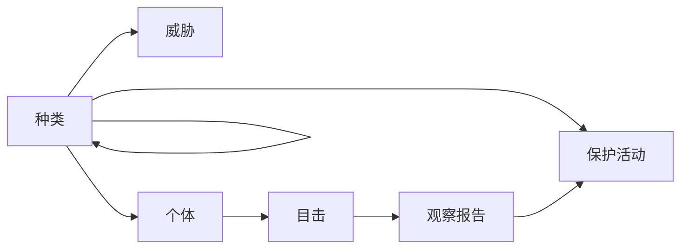

## 初始
我是业务解决方案事业部的山下。这次，我想介绍一下PostgreSQL中实现的CYCLE语句。  
CYCLE语句是一种为了安全执行递归查询的功能。  
具体来说，它可以检测并防止由于循环引用引起的无限循环。

## 递归查询
在本文中会稍微触及递归查询，但不会进行详细的解释。  
递归查询是一种可以在查询中**引用查询结果自身**的特殊SQL查询。  
通过使用WITH RECURSIVE语句来实现，具有以下结构：  

- 非递归部分：用于生成初始结果集的基本查询  
- 递归部分：使用上一次的结果生成下一个结果的查询  
- UNION ALL：合并两部分的查询结果  

具体语法如下所示：
```sql
WITH RECURSIVE recursive_table AS (
    -- 非递归部分
    SELECT columns FROM table WHERE condition
    UNION ALL
    -- 递归部分
    SELECT columns FROM table 
    JOIN recursive_table ON condition
)
SELECT * FROM recursive_table;
```

一般来说，递归查询对于表示树结构或网络结构的数据模型非常有效。然而，递归表现与循环问题密不可分。  
虽然可以通过设置递归深度限制等多种对策来解决，但在PostgreSQL中引入了CYCLE语句这一解决措施。  
通过使用CYCLE语句，不需要担心可能发生的循环引用，就能安全地执行查询。

## 使用CYCLE语句检测循环
CYCLE语句是PostgreSQL从14版开始引入的一项功能，与递归查询结合使用。  
只需要在递归查询末尾添加如下内容，即可实现循环检测与防止[^1]：  

```sql
CYCLE dst SET is_cycle USING path
```

[^1]: 取决于版本，在不使用CYCLE语句的情况下也可以解决循环问题。详情请参阅[链接](https://www.postgresql.jp/document/16/html/queries-with.html#QUERIES-WITH-CYCLE)。

以下是一个可以直接运行的示例。这条查询通过连接临时表中的src和dst，检测路径。  
路径连接会导致循环的发生。

```sql
DROP TABLE IF EXISTS tmp_connectivity;

CREATE TEMPORARY TABLE tmp_connectivity AS
SELECT * FROM (
  VALUES 
      ('a', 'b')
    , ('b', 'c')
    , ('c', 'd')
    , ('b', 'e')
    , ('e', 'f')
    , ('f', 'g')
    , ('f', 'a') -- 此处导致路径循环
    , ('h', 'i')
) AS _(src, dst);

WITH RECURSIVE full_connectivity AS (
  -- 非递归部分
  SELECT 
    *
  FROM tmp_connectivity
  WHERE src = 'a'
  UNION ALL
  -- 递归部分
  SELECT 
    fc.src
    , c.dst
  FROM full_connectivity AS fc
  JOIN tmp_connectivity AS c ON (fc.dst = c.src)
) CYCLE dst SET is_cycle USING path -- 将dst的历史保存到path中，并检测无限循环

SELECT * FROM full_connectivity;
```

以下是提取出CYCLE语句的代码块：
```sql
CYCLE dst SET is_cycle USING path
```

针对该部分分解说明如下：
- 监视dst列的值  
- 检测相同值的再次出现  
- 将true设置到is_cycle列  
- 始终将经过的路径历史记录保存到path列中  

执行上述查询后，应获得如下结果：

```sql
 src | dst | is_cycle |         path          
-----+-----+----------+-----------------------
 a   | b   | f        | {(b)}
 a   | c   | f        | {(b),(c)}
 a   | e   | f        | {(b),(e)}
 a   | d   | f        | {(b),(c),(d)}
 a   | f   | f        | {(b),(e),(f)}
 a   | g   | f        | {(b),(e),(f),(g)}
 a   | a   | f        | {(b),(e),(f),(a)}
 a   | b   | t        | {(b),(e),(f),(a),(b)}
```

从结果中可以看出路径中存在循环，例如路径"a → b → e → f → a → b"，并检测到了循环。

## 示例模型说明
作为示例，设计了一个类似于围绕野生生物生态系统的数据模型[^2]。  
[^2]: 数据模型的设计已交由生成型AI完成。

请参考以下的代码库示例：  
[https://github.com/shohei-yamashit/cycle-postgres-wild](https://github.com/shohei-yamashit/cycle-postgres-wild)

:::info
在该示例中，可以通过代码库根目录中的compose.yml启动数据库容器。  
能够启动包含定义数据的PostgreSQL容器，因此无需另外运行SQL。
:::

涉及的表如下所示：
```
- ConservationStatus（保全状态）
    管理表中物种的保护状态情况，包括保护状态的说明。
- Species（种类）
    管理物种的基本信息。包括物种名称、保护状态以及与其他物种的关系（自引用）。
- WeatherPattern（气候模式）
    管理气候模式的信息，包括模式的说明。
- Ecosystem（生态系统）
    管理生态系统的基本信息，包括生态系统名称。
- Habitat（栖息地）
    管理生物的栖息地信息，包括栖息地名称及与所属生态系统的关联。
- Region（区域）
    管理地理区域信息，包括区域名称和与气候模式的关联。
- Animal（动物）
    管理个体动物的信息，包括物种、区域、栖息地的关联。
- Event（事件）
    管理观察和保护相关的事件信息，包括事件说明。
- Threat（威胁）
    管理物种面临的威胁信息，包括威胁的说明及受影响物种的关系。
- PlantSpecies（植物种类）
    管理植物种类的信息，包括植物名称及栖息地的关系。
- AnimalSighting（动物目击）
    记录动物目击信息，包括动物ID、时间戳及相关事件关系。
- Researcher（研究者）  
    管理研究者的基本信息，包括研究者名称。
- ObservationReport（观察报告）
    管理与动物目击相关的详细报告，包括与目击信息的关联。
- ConservationAction（保护活动）
    管理物种保护活动相关的信息，包括活动说明、目标种类及负责研究人员的关系。
```

整体看可能仍不直观，以下将提供ER图。  


## 将CYCLE语句应用于示例
接下来满足以下需求的查询将被导出：
```sql
从上述表中，遍历特定列名为〇〇id的情况，导出与种类（species）相关的表
```

首先，在不使用CYCLE语句的情况下，通过递归查询遍历information.column以获取关系：

```sql
WITH RECURSIVE species_relative AS (
    SELECT 
        * 
    FROM 
        has_species_id
    UNION ALL
        SELECT
            cl_info.table_name AS name
            , CONCAT(cl_info.table_name,'id') AS id_with_table
            , cl_info.column_name
            , cl_info.data_type
            FROM species_relative AS ir, information_schema.columns AS cl_info
        WHERE 
            cl_info.column_name = ir.id_with_table
            AND
            table_schema = 'public'            
)
,  has_species_id AS (
    SELECT 
        table_name
        , CONCAT(table_name,'id') AS id_with_table
        , column_name
        , data_type
    FROM information_schema.columns AS cl_info
    WHERE 
        table_schema = 'public'
        AND
        column_name = 'speciesid'
)
SELECT * FROM species_relative
```

:::info
和其他DBMS一样，PostgreSQL配备了管理数据库系统信息的表，也就是所谓的信息架构。  
详情：[https://www.postgresql.jp/document/16/html/information-schema.html](https://www.postgresql.jp/document/16/html/information-schema.html)  
本次我们聚焦于信息架构中的columns表，参考列名称以调查表的关系。
:::

由于发生无限循环，因此可能出现查询无法结束等情况。  
在此基础上，添加CYCLE语句。  
最终的查询如下：

```sql
WITH RECURSIVE species_relative AS (
    SELECT 
        * 
    FROM 
        has_species_id
    UNION ALL
        SELECT
            cl_info.table_name AS name
            , CONCAT(cl_info.table_name,'id') AS id_with_table
            , cl_info.column_name
            , cl_info.data_type
            FROM species_relative AS ir, information_schema.columns AS cl_info
        WHERE 
            cl_info.column_name = ir.id_with_table
            AND
            table_schema = 'public'
            
) CYCLE table_name SET is_cycle USING path_cycle -- 添加

,  has_species_id AS (
    SELECT 
        table_name
        , CONCAT(table_name,'id') AS id_with_table
        , column_name
        , data_type
    FROM information_schema.columns AS cl_info
    WHERE 
        table_schema = 'public'
        AND
        column_name = 'speciesid'
)
SELECT table_name, column_name, is_cycle, path_cycle FROM species_relative;
```

执行后应得如下结果：

```sql
     table_name     |   column_name    | is_cycle |                        path_cycle                         
--------------------+------------------+----------+-----------------------------------------------------------
 species            | speciesid        | f        | {(species)}
 animal             | speciesid        | f        | {(animal)}
 threat             | speciesid        | f        | {(threat)}
 conservationaction | speciesid        | f        | {(conservationaction)}
 species            | speciesid        | t        | {(species),(species)}
 animal             | speciesid        | f        | {(species),(animal)}
 threat             | speciesid        | f        | {(species),(threat)}
 animalsighting     | animalid         | f        | {(animal),(animalsighting)}
 conservationaction | speciesid        | f        | {(species),(conservationaction)}
 animalsighting     | animalid         | f        | {(species),(animal),(animalsighting)}
 observationreport  | animalsightingid | f        | {(animal),(animalsighting),(observationreport)}
 observationreport  | animalsightingid | f        | {(species),(animal),(animalsighting),(observationreport)}
```
可以看到species表自引用了自己。若没有CYCLE语句，递归查询无法安全执行。

## （附加）使用Mermaid进行可视化
正文内容已经完成，但最后，我们整理出目标表的关系。  
上一段中，通过table_name和column_name获取结果。结果中存在重复及"id"附加表达，可以进一步整理。  

```sql
SELECT DISTINCT
    table_name,
    REPLACE(column_name,'id','') AS relative_table_name 
FROM species_relative ORDER BY table_name;
```

然后以Mermaid格式输出即可明确表的关联关系。  
省略代码细节，运行示例工具后获得如下关系图：

```text
graph LR
        species[种类]
        conservationaction[保护活动]
        threat[威胁]
        animal[个体]
        animalsighting[目击]
        observationreport[观察报告]
        species --> conservationaction
        species --> threat
        species --> animal
        species --> species
        animal --> animalsighting
        animalsighting --> observationreport
        observationreport --> conservationaction
```


通过以上过程，在避免无限循环的同时，成功利用递归查询导出了相关表。

## 总结
本文介绍了在PostgreSQL中使用CYCLE语句实现安全递归查询的方法。  
虽然可能存在版本等限制，但在执行可能引发无限循环的递归查询时，不妨尝试使用CYCLE语句。
