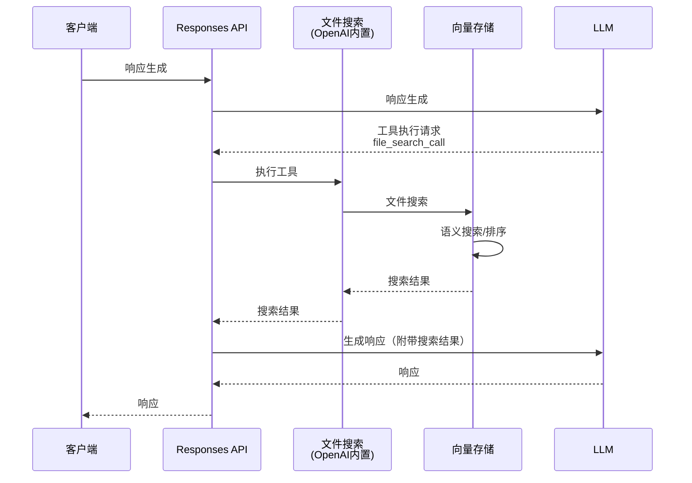

前几天，OpenAI 公布了关于 API 的以下发布内容。

- [OpenAI News - New tools for building agents](https://openai.com/index/new-tools-for-building-agents/)

这是针对构建 AI 代理而设计的基础 API——Responses API 以及各种内置工具、Agent SDK 等，对许多开发者来说都是非常吸引人的消息。

本文首先将对其中的 File Search 进行检验。
File Search 本来在之前仅作为 Assistants API 中的 beta 版本提供，但存在一个限制，即在众多用户使用的 Chat Completion API 中无法调用。
这次，随着新引入的 Responses API，File Search 作为内置工具得以使用（不过，仍然无法作为 Chat Completion API 中的工具使用）。
在功能上，通过增加元数据过滤，相比以往的 File Search 得到了增强。

使用 File Search 工具的流程如下：



:::info
此前支持使用 File Search 的 Assistants API，一旦引入对 Responses API 的兼容功能（预计在 2026 年前半年），便会宣布弃用。

- [OpenAI Docs - What this means for existing APIs - Assistants](https://platform.openai.com/docs/guides/responses-vs-chat-completions#assistants)

最终 Assistants API 并未成为正式版本。
:::

## 使用 OpenAI 的 Vector Store

在检验 File Search 工具之前，我们先来了解一下作为数据源的 Vector Store 相关 API。
此次发布中，Vector Store API 也从 beta 版升级为正式版。

- [OpenAI Docs - Platform - Retrieval](https://platform.openai.com/docs/guides/retrieval)
- [OpenAI API Reference - Vector Stores](https://platform.openai.com/docs/api-reference/vector-stores)

### 创建 Vector Store

首先，创建 Vector Store。关于这一点，自 beta 版以来没有变化。

```python
from openai import OpenAI

client = OpenAI()

vector_store = client.vector_stores.create(
    name='Tech Blog Articles',
    expires_after={'anchor': 'last_active_at', 'days': 1}
)
```

所有参数均为可选。在上述示例中，仅指定了名称。

如果需要对注册到 Vector Store 中的文件进行切块设置，请指定 `chunking_strategy`[^1]。
以下是指定固定切块大小和重叠大小的示例：

[^1]: <https://platform.openai.com/docs/guides/retrieval#chunking>

```python
vector_store = client.vector_stores.create(
    name='Tech Blog Articles',
    chunking_strategy={
        'type': 'static',
        'static': {
            'max_chunk_size_tokens': 1600, # 默认是800
            'chunk_overlap_tokens': 800 # 默认是400
        }
    }
)
```

:::column:注意 Vector Store 的计费
Vector Store 的前 1GB 是免费的，但超出部分将按每日计费（当前为 $0.1/1GB）。
如果用于测试目的，建议测试后删除，或者在创建时指定有效期。

```python
vector_store = client.vector_stores.create(
    name='Tech Blog Articles',
    # 如果 1 天未使用，则过期
    expires_after={'anchor': 'last_active_at', 'days': 1}
)
```

除了通过 API（`vector_store.delete`）外，Vector Store 也可以从 OpenAI API 的仪表盘中删除。
:::

### 文件上传（切块与向量化）

接下来，将文件上传到刚刚创建的 Vector Store 中。
文件上传时，会结合通用 File 对象和 Vector Store 的 API 来实现。

- [OpenAI API Reference - Files](https://platform.openai.com/docs/api-reference/files)
- [OpenAI API Reference - Vector store files](https://platform.openai.com/docs/api-reference/vector-stores-files)

这里，我们上传本网站今年的博客文章（Markdown 文件）。

```python
article_dir = '/path/to/blogs'
file_names = [name for name in os.listdir(article_dir) if name.endswith('.md')]

for file_name in file_names:
    file_path = os.path.join(article_dir, file_name)
    with open(file_path, 'r', encoding='utf-8') as f:
        content = f.read()
        # 获取 Markdown 中包含的元数据
        metadata = {line.split(': ')[0]: line.split(': ')[1] for line in content.split('\n') if ': ' in line}
        author = metadata.get('author', 'Unknown')
        title = metadata.get('title', 'Untitled')
        date = int(datetime.strptime(metadata['date'], '%Y-%m-%d').timestamp())
        attributes = {'title': title, 'author': author, 'date': date}
        # 创建 File 对象
        file = client.files.create(
            file=(file_name, content, 'text/markdown'),
            purpose='assistants'
        )
        # 在 VectorStore 中注册 File（切块）
        client.vector_stores.files.create(
            vector_store.id,
            file_id=file.id,
            attributes=attributes
        )
        # 等待 VectorStore 中的准备完成（可选）
        client.vector_stores.files.poll(file.id, vector_store_id=vector_store.id)
```

首先，通过 Files API 创建 OpenAI 的通用 File 对象（client.files.create）。
当在 File Search 中使用 File 对象时，需要在 `purpose` 中指定 `assistant`。

接下来，将创建的 File 对象上传到 Vector Store（client.vector_stores.file.create）。
此时会对文件进行切块和向量化，并注册到 Vector Store 中。

另外，此时可以在 `attributes` 参数中指定任意属性键值对，以供元数据过滤使用。
这里，我们将 Markdown 文件头（Front Matter）中的部分信息注册为元数据。

虽然也提供了同时执行文件创建（create）和轮询（poll）的 create_and_poll 方法，但在现阶段的 SDK（openai-1.66.5）中无法注册 attributes（元数据）。
因此，上述代码中各方法是依次执行的（如果在后台运行无问题，则可省略 poll）。
 
:::column:批量上传多个文件
在 OpenAI 的 SDK 中，还提供了对多个文件同时执行 File 和 Vector Store API 的方法。
根据需要使用此方法可使代码更为简洁。

```python
for file_name in file_names:
    file_path = os.path.join(article_dir, file_name)
    with open(file_path, 'r', encoding='utf-8') as f:
        content = f.read()
        files.append((
            file_name,
            content,
            'text/markdown'
        ))
# 同时执行 File 的创建和 VectorStore 的注册
client.vector_stores.file_batches.upload_and_poll(
    vector_store.id, files=files)
```

不过，目前的 SDK 似乎无法对单个文件注册元数据 (attributes)。
:::

### 文件搜索 (Search)

已正式发布的 Vector Search 单独提供向量搜索功能，
而这一功能在之前的 beta 版 Vector Search API 中是不存在的。

首先，简单执行一次搜索。

```python
import json

# 执行文件搜索
response = client.vector_stores.search(
    vector_store.id,
    query='PostgreSQL', # 搜索查询
    max_num_results=3   # 最大搜索结果数
)
# 输出向量搜索结果
for data in response.data:
    print((
        '-' * 30 + '\n'
        f'file_id:{data.file_id}, filename:{data.filename}\n'
        f'score:{data.score}\n'
        f'attributes:{json.dumps(data.attributes, indent=2, ensure_ascii=False)}\n'
        f'content:{''.join(content.text for content in data.content)[:100]}...(省略)'
    ))
```

此搜索的执行结果如下：

```
------------------------------
file_id:file-7EpzUrFMAKQfF1wRHTrTo1, filename:0117_cycle-postgres.md
score:0.8612917666665437
attributes:{
  "title": "PostgreSQL中安全的递归查询！CYCLE语句用法详解",
  "author": "shohei-yamashita",
  "date": 1737039600.0
}
content:
---
title: PostgreSQL中安全的递归查询！CYCLE语句用法详解
author: shohei-yamashita
date: 2025-01-17
tags: [Postg...(省略)
------------------------------
file_id:file-L1RAexWnvr419K7PC9qgMe, filename:0312_langmem-aurora-pgvector.md
score:0.807569386941522
attributes:{
  "title": "将LangMem的长期记忆持久化到PostgreSQL(pgvector)",
  "author": "noboru-kudo",
  "date": 1741705200.0
}
content:
---
title: 将LangMem的长期记忆持久化到PostgreSQL(pgvector)
author: noboru-kudo
date: 2025-03-12
tags: [长期记忆,...(省略)
------------------------------
file_id:file-7EpzUrFMAKQfF1wRHTrTo1, filename:0117_cycle-postgres.md
score:0.7830848428325007
attributes:{
  "title": "PostgreSQL中安全的递归查询！CYCLE语句用法详解",
  "author": "shohei-yamashita",
  "date": 1737039600.0
}
content:
具体的语法如下：
```sql
WITH RECURSIVE recursive_table AS (
    -- 非再帰項
    SELECT columns FROM table...(省略)
```
```

从搜索结果中可以看到，同时返回了属性（attributes）和置信度分数（score）。
同一文件在搜索结果中出现多次，是因为搜索是基于切块而非单个文件进行的。

此外，应用于搜索结果的 Ranker 可以通过 `ranking_options` 参数进行调整。
以下是一个将低于一定分数的切块从搜索结果中排除的示例：

```python
response = client.vector_stores.search(
    vector_store.id,
    query='PostgreSQL LangMem',
    max_num_results=3,
    # 设置排名选项
    ranking_options={
        'ranker': 'auto', # 目前可选的只有 auto 或 default-2024-11-15
        'score_threshold': 0.8 # 排除分数低于 0.8 的搜索结果
    },
)
```

通过这种指定方式，可以调整搜索结果的精度。
接下来，试用正式版中新加入的元数据（属性）过滤功能。

元数据搜索同样在 `query` 参数中指定。

```python
from datetime import datetime, timedelta

one_month_ago = datetime.now() - timedelta(days=30)
unix_time = int(one_month_ago.timestamp())
response = client.vector_stores.search(
    vector_store.id,
    query='PostgreSQL',
    max_num_results=3,
    # 元数据过滤条件
    filters={
        'type': 'and',
        'filters': [
            {
                'type': 'gte',
                'key': 'date',
                'value': unix_time

            },
            {
                'type': 'eq',
                'key': 'author',
                'value': 'noboru-kudo'
            }
        ]
    })
for data in response.data:
    print((
        '-' * 30 + '\n'
        f'file_id:{data.file_id}, filename:{data.filename}\n'
        f'score:{data.score}\n'
        f'attributes:{json.dumps(data.attributes, indent=2, ensure_ascii=False)}\n'
        f'content:{''.join(content.text for content in data.content)[:100]}...(省略)'
    ))
```

这里，仅限制搜索最近 30 天内由特定作者创建的文件。

关于可指定过滤条件的详细信息，请参考以下官方指南及文档。

- [OpenAI Doc - Retrieval - Attribute filtering](https://platform.openai.com/docs/guides/retrieval#attribute-filtering)
- [OpenAI API Reference - Search Vector store](https://platform.openai.com/docs/api-reference/vector-stores/search)

此处的搜索结果如下所示：

```
------------------------------
file_id:file-L1RAexWnvr419K7PC9qgMe, filename:0312_langmem-aurora-pgvector.md
score:0.807569386941522
attributes:{
  "title": "将LangMem的长期记忆持久化到PostgreSQL(pgvector)",
  "author": "noboru-kudo",
  "date": 1741705200.0
}
content:
---
title: 将LangMem的长期记忆持久化到PostgreSQL(pgvector)
author: noboru-kudo
date: 2025-03-12
tags: [长期记忆,...(省略)
------------------------------
file_id:file-L1RAexWnvr419K7PC9qgMe, filename:0312_langmem-aurora-pgvector.md
score:0.6644617795244542
attributes:{
  "title": "将LangMem的长期记忆持久化到PostgreSQL(pgvector)",
  "author": "noboru-kudo",
  "date": 1741705200.0
}
content:
### 2. **量子计算**
- 当前计算机难以快速解决的问题，可借助下一代技术实现高速计算。  
- 在密码破解、分子模拟、金融最优化等特定领域，有望引发巨大变革。  
-...(省略)
------------------------------
file_id:file-L1RAexWnvr419K7PC9qgMe, filename:0312_langmem-aurora-pgvector.md
score:0.6606991798904742
attributes:{
  "title": "将LangMem的长期记忆持久化到PostgreSQL(pgvector)",
  "author": "noboru-kudo",
  "date": 1741705200.0
}
content:
```python
    # 3. LangGraph Functional API 的工作流程
    @entrypoint(store=store)
    def ...(省略)
```

可以看出，通过元数据过滤，只有具有特定属性的文件被纳入搜索范围。

:::column:在 Chat Completion API 中使用 Vector Store
虽然传统的 Chat Completion API 并不支持将 File Search 用作工具，但结合这个搜索功能，可以构建基于 OpenAI Vector Store 的 RAG 系统。
官方指南中也提供了相应的实现示例，有兴趣的朋友可以参考。

- [OpenAI Doc - Retrieval - Synthesizing responses](https://platform.openai.com/docs/guides/retrieval#synthesizing-responses)
:::
 
## 使用 File Search 工具（Responses API）

在理解了 Vector Store API 的用法之后，我们来检验 File Search 工具。
在新引入的 Responses API 中，File Search 可作为内置工具使用。

- [OpenAI Docs - Built-in Tools - File search](https://platform.openai.com/docs/guides/tools-file-search)

其基本用法与 Assistants API 时相同，但同时可以利用添加到 Vector Store API 的元数据过滤功能。

:::alert
与 Assistants API 不同，File Search 工具除了存储费用（$0.1/1GB/1日）外，还会根据调用次数收费。
目前收费标准为 $2.5/1000 次。最新费用请参阅官方指南。

- [OpenAI Doc - Pricing - Built-in tools](https://platform.openai.com/docs/pricing#built-in-tools)
:::

### File Search 的基本用法

首先简单试用一下。
如前所述，File Search 作为内置工具可在新引入的 Responses API 中使用（在 Chat Completion API 中不可用）。

```python
response = client.responses.create(
    model='gpt-4o-2024-11-20',
    input = '简要介绍一下 GitHub 的文章',
    instructions='You are an excellent tech leader.',
    tools=[{
        'type': 'file_search',
        'vector_store_ids': [vector_store.id],
        'max_num_results': 3, # 要使用的搜索结果数（可选）
    }]
)
# 响应消息
print(response.output_text)
print('-' * 30)
# 文件搜索结果
if hasattr(response.output[1], 'content') and response.output[1].content:
    for annotation in response.output[1].content[0].annotations:
        print(annotation)
```

这里，`tools` 中指定的部分是关键。通过将 `type` 指定为 `file_search`，并在 `vector_store_ids` 中指定 Vector Store 的 ID，即可启用 File Search。
由于 File Search 是 OpenAI 的内置工具，因此无需定义特殊函数。

File Search 的结果会与响应消息一起包含在 `annotations` 中。

这段代码的执行结果如下：

```
以下是对所提供 GitHub 相关文章的简要介绍。

1. **GitHub Issues 的 Sub-issues 进度管理 (2025-01-22)**  
   详解了如何利用 GitHub Issues 中的 Sub-issues 功能进行进度管理。Sub-issues 功能进入了公开预览，借助 Issue 父子关系，大幅提升了进度可视化的方法。通过柱状图等方式可以查看父 Issue 的进度，使项目管理变得更加便捷。

2. **尝试 GitHub Copilot 的代理模式 (2025-02-16)**  
   关于 GitHub Copilot 新代理模式（公开预览）的试用体验报告。报告中介绍了如何利用 VS Code Insiders 版，在 AI 辅助下进行文件编辑及自主执行指令的步骤。

3. **使用 GitHub Copilot Edits 进行代码重构 (2025-02-15)**  
   聚焦于使用 AI 助手实现代码重构的功能 “GitHub Copilot Edits”，详细解说了自动修复及多文件编辑的操作步骤，突出了通过一系列提示轻松编辑和改进文件的优势。

这些文章均对关注 GitHub 上项目管理和 AI 辅助功能最新动态的用户具有较高参考价值.
------------------------------
AnnotationFileCitation(file_id='file-SBuL8BmxQZ2PUp3MxorgJZ', index=240, type='file_citation', filename='0122_github-issues-sub-issue-progress.md')
AnnotationFileCitation(file_id='file-1BTgs1Cu5Y8NmPNc337kSZ', index=415, type='file_citation', filename='0216_try-github-copilot-agent.md')
AnnotationFileCitation(file_id='file-QFb3gSHt6mvmTUc1FVKYgR', index=587, type='file_citation', filename='0215_refactor-code-with-github-copilot-edits.md')
以下是从上传的文件中提取的与 AI 相关的文章概要.
```

File Search 将从 Vector Store 搜索到的结果传递给 LLM，并基于此生成消息。
此外，通过检查 `annotations` 可以了解到 LLM 是依据哪个文件生成的消息[^2].

[^2]: Assistants API 能够根据被引用文本中的注释标记（例如 ` ` 这类标记）来获取引用来源，而 Responses API 则改为通过索引判断。

### 使用元数据过滤

接下来介绍元数据过滤的使用方法。其基本用法与前面在 Vector Store API 中介绍的文件搜索功能相同。
在 Responses API 中使用时，指定方式如下。

```python
one_month_ago = datetime.now() - timedelta(days=30)
unix_time = int(one_month_ago.timestamp())
response = client.responses.create(
    model='gpt-4o-2024-11-20',
    input='简要介绍一下与 AI 相关的文章',
    instructions='You are an excellent tech leader.',
    tools=[{
        'type': 'file_search',
        'vector_store_ids': [vector_store.id],
        # 元数据过滤条件
        'filters': {
            'type': 'and',
            'filters': [
                {
                    'type': 'gte',
                    'key': 'date',
                    'value': unix_time
                },
                {
                    'type': 'eq',
                    'key': 'author',
                    'value': 'noboru-kudo'
                }
            ]
        },
        'max_num_results': 3,
    }]
)
print(response.output_text)
print('-' * 30)
if hasattr(response.output[1], 'content') and response.output[1].content:
    for annotation in response.output[1].content[0].annotations:
        print(annotation)
```

在 File Search 的 `filters` 参数中指定元数据过滤条件。
这里，同之前一样，仅限定搜索最近 30 天内由特定作者创作的文件。
另外，所指定的过滤条件规范与 Vector Store 的元数据过滤相同。

- [OpenAI Doc - Retrieval - Attribute filtering](https://platform.openai.com/docs/guides/retrieval#attribute-filtering)
- [OpenAI API Reference - Search Vector store](https://platform.openai.com/docs/api-reference/vector-stores/search)

执行结果如下：

```
以下是从上传的文件中提取的与 AI 相关的文章概要.

---

1. **Article: OpenAI Responses API 的新 File Search（Vector Stores）功能**
   - 日期: 2025年3月19日
   - 内容: OpenAI 在 Responses API 中引入了新 File Search 功能。该功能原本在 Assistants API 中提供，但通过 Responses API 以强化元数据过滤功能的形式正式发布。此外，此次发布中，Vector Store API 也同步以正式版形式推出。该工具对利用 AI 代理的开发者十分有用.

2. **Article: 基于 LangMem 的 LLM 长期记忆概览**
   - 日期: 2025年2月26日
   - 内容: LangChain 发布的 LangMem SDK 是用于让 AI 代理高效管理长期记忆的工具。该 SDK 能够跨会话保持用户信息与对话历史，从而解决传统 LLM 存在的问题。另外，长期记忆分为 Semantic（语义）、Episodic（情景）和 Procedural（程序）三类，实现更具人性化的对话.

3. **Article: 利用 PostgreSQL 实现 LangMem 长期记忆的持久化**
   - 日期: 2025年3月12日
   - 内容: 介绍了如何将上述 LangMem 的长期记忆持久化至 AWS Aurora Serverless v2 上的 PostgreSQL 数据库。这一方法实现了高级记忆管理，使得能够长期保存与利用符合用户偏好的数据。文中还给出了相关设置和代码示例.

---

这些文章详细探讨了 AI 代理和生成式 AI 技术的最新动态。如果需要更多细节，请告知！
------------------------------
AnnotationFileCitation(file_id='file-BxKNswrMUzunztT8VuByjQ', index=360, type='file_citation', filename='0319_openai-responses-api-filesearch.md')
AnnotationFileCitation(file_id='file-WbfBb3njxVkGnUkcotUbgh', index=624, type='file_citation', filename='0226_langmem-intro.md')
AnnotationFileCitation(file_id='file-L1RAexWnvr419K7PC9qgMe', index=860, type='file_citation', filename='0312_langmem-aurora-pgvector.md')
```

### 搜索结果的详细分析

刚才虽然能确定引用来源文件，但与 Vector Store API 相比，未能获得置信度分数和切块正文的详细信息。

这一功能在以往的 Assistants API 中就存在，而在 Responses API 的 File Search 工具中同样可以获取详细的搜索结果。

```python
response = client.responses.create(
    model='gpt-4o-2024-11-20',
    input = '简要介绍一下 GitHub 的文章',
    instructions='You are an excellent tech leader.',
    # 包含搜索结果
    include=['output[*].file_search_call.search_results'],
    tools=[{
        'type': 'file_search',
        'vector_store_ids': [vector_store.id],
        'max_num_results': 3,
    }]
)
if hasattr(response.output[0], 'results') and response.output[0].results:
    for result in response.output[0].results:
        print((
            '-' * 30 + '\n'
            f'file_id:{result.file_id}, filename:{result.filename}\n'
            f'score:{result.score}\n'
            f'attributes:{json.dumps(result.attributes, indent=2, ensure_ascii=False)}\n'
            f'content:\n{result.text[:100]}...(省略)'
        ))
```

与之前不同之处仅在于，在 `include` 参数中指定了 `output[*].file_search_call.search_results`。
这样，文件搜索结果（此处为 `response.output` 的第一个元素）便会增加 `results` 属性，从而可以获取到详细的搜索结果。

输出结果如下：

```
------------------------------
file_id:file-SBuL8BmxQZ2PUp3MxorgJZ, filename:0122_github-issues-sub-issue-progress.md
score:0.6980376676922656
attributes:{
  "title": "在 GitHub Issues 中，可以通过子问题掌握进展情况",
  "author": "masahiro-kondo",
  "date": 1737471600.0
}
content:
---
title: 在 GitHub Issues 中，可以通过子问题掌握进展情况
author: masahiro-kondo
date: 2025-01-22
tags: [...(省略)
------------------------------
file_id:file-1BTgs1Cu5Y8NmPNc337kSZ, filename:0216_try-github-copilot-agent.md
score:0.6593310562728306
attributes:{
  "title": "试用 GitHub Copilot 的代理模式（公开预览）", 
  "author": "masahiro-kondo",
  "date": 1739631600.0
}
content:
---
title: 试用 GitHub Copilot 的代理模式（公开预览）
author: masahiro-kondo
date: 2025-02-16
tags: [A...(省略)
------------------------------
file_id:file-QFb3gSHt6mvmTUc1FVKYgR, filename:0215_refactor-code-with-github-copilot-edits.md
score:0.6533722189166723
attributes:{
  "title": "在 VS Code 的 Copilot Edits 中高效地进行重构",
  "author": "masahiro-kondo",
  "date": 1739545200.0
}
content:
@[og](https://github.blog/news-insights/product-news/github-copilot-the-agent-awakens/)

Copilot Edi...(省略)
```

与 Vector Store API 的搜索结果类似，可以确认到分数、切块文本及属性等详细信息。

## 总结

本文详细检验了正式版 File Search API 的功能。
相比之前的 beta 版，新加入了元数据过滤等新功能，使该工具更为灵活且实用。

正式版的 Vector Store 仍然提供最多 1GB 的免费额度，相比一般的向量数据库托管服务，能够在控制成本的前提下运行，这也是一大亮点。

目前，我们正利用 Assistants API 将内部资源与 LLM 连接，但未来计划过渡到 Responses API 以及正式版 File Search，以实现更高效的运营。
