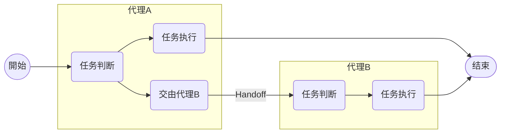
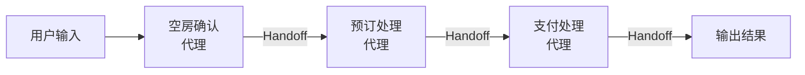

不久前，OpenAI发布了一则关于AI代理的有趣公告。

- [OpenAI News - New tools for building agents](https://openai.com/index/new-tools-for-building-agents/)

虽然Responses API和各种内置工具的发布也引起了热议，但尤其受到关注的应该是用于构建AI代理的框架Agents SDK。

本文将整理介绍一下这个Agents SDK的概况和用法。

@[og](https://github.com/openai/openai-agents-python)

 - [文档 - OpenAI Agents SDK](https://openai.github.io/openai-agents-python/)

Agents SDK 是一个基于Python的OSS，并且是基于去年OpenAI公开的[Swarm](https://github.com/openai/swarm/tree/main)开发的。
Swarm主要是用于教育和实验用途，但此次发布的Agents SDK不仅支持Responses API，其功能也大幅增强，使得开发AI代理变得更加简便灵活。
此外，还新增了诸如跟踪和护栏等与运维相关的功能，并设计为前提可以用于生产级使用。

:::info
关于Swarm，本站去年也撰写过介绍文章。因为它构成了Agents SDK机制的基础，所以有兴趣的朋友请务必一看。

- [通过 OpenAI 的 Swarm 理解代理编排的机制](/zh-cn/blogs/2024/12/04/openai-swarm-multi-agent-intro/)
:::

## 设置

Agents SDK 以 Python 的[软件包](https://pypi.org/project/openai-agents/)形式提供。请根据自己的环境进行安装。

```shell
pip install openai-agents
```

本文中使用的是当前最新版本 0.0.6。

## 创建代理

首先确认一下如何使用Agents SDK创建一个简单的代理。

```python
from agents import Agent

agent = Agent(
    name='simple agent', # 必须
    instructions='请将输入的内容原样返回',
    model='gpt-4o-mini' # 当前未指定时默认为`gpt-4o`
)
```

基本机制与Swarm几乎相同。

通过创建Agents SDK提供的Agent类的实例，即可构建代理。在此过程中，需要指定代理名称（name）以及系统/开发者消息（instructions）等。

此外还有许多其他参数，请查阅官方参考文档了解详情。

- [OpenAI Agents SDK - API Reference - Agents](https://openai.github.io/openai-agents-python/ref/agent/)

接下来立即运行这个代理进行测试。

```python
import asyncio
from agents import Runner

async def main():
    result = await Runner.run(agent, '早上好!!')
    print(result)

if __name__ == '__main__':
    asyncio.run(main())
```

使用Agents SDK提供的Runner类的run方法来指定要首先执行的代理和输入文本。

该run方法会执行代理。代理会反复与LLM进行交互和执行工具，直至获取到响应，并在必要时将任务转交给其他代理（Handoff）（默认最多循环10次）。
在本例中，由于没有指定工具或Handoff，因此循环仅执行一次。

执行结果如下：

```
RunResult:
- Last agent: Agent(name="simple agent", ...)
- Final output (str):
    早上好!! 今天有什么安排？
- 1 new item(s)
- 1 raw response(s)
- 0 input guardrail result(s)
- 0 output guardrail result(s)
(See `RunResult` for more details)
```

可以确认到最后执行的代理（Last agent）和输出结果（Final output）等。

另外，run方法是异步处理，但也提供了同步版的run_sync和支持流式处理的run_streamed。
详情请参阅官方参考文档。

- [OpenAI Agents SDK - API Reference - Runner](https://openai.github.io/openai-agents-python/ref/run/)

## 使用工具

前面的代理仅仅是进行LLM的聊天，并不能称之为能够自主完成特定任务的代理。
在这里通过使用工具，将其改进为更加具有代理特性的行为。

### 内置工具

首先尝试利用内置工具。此次，与Agents SDK一同发布的内置工具有以下3个：

- [OpenAI Doc - Built-in tools - Web Search](https://platform.openai.com/docs/guides/tools-web-search?api-mode=responses)
- [OpenAI Doc - Built-in tools - File Search](https://platform.openai.com/docs/guides/tools-file-search)
- [OpenAI Doc - Built-in tools - Computer Use](https://platform.openai.com/docs/guides/tools-computer-use)

刚刚不久，我们介绍了File Search工具的原理。

@[og](/zh-cn/blogs/2025/03/19/openai-responses-api-filesearch/)

既然如此，就来创建一个利用File Search工具的代理。

```python
import asyncio
from agents import Agent, Runner, FileSearchTool
agent = Agent(
    name='file search agent',
    instructions='你是一位技术博客运营者。请使用file_search工具搜索博客文件。',
    model='gpt-4o-mini',
    tools=[FileSearchTool(
        # Vector Store对象的ID
        vector_store_ids=['vs_xxxxxxxxxxxxxxx'],
        max_num_results=3, # 最大的搜索结果数量（可选）
        # 如果需要包含搜索结果的详情（分数、文本），请启用以下选项
        # include_search_results=True
        # 如果需要指定元数据过滤，请在下面写入
        # filters={...}
    )]
)

async def main():
    result = await Runner.run(
        agent,
        '请简要介绍一下与AI相关的文章'
    )
    print(result)
    
if __name__ == '__main__':
    asyncio.run(main())
```

使用工具时，在创建代理时通过tools参数进行指定。内置工具因为包含在Agents SDK对应的类中，只需要指定其实例即可。
在这里，为FileSearchTool类指定了Vector Store的ID。

执行后，得到了如下结果。

```
RunResult:
- Last agent: Agent(name="file search agent", ...)
- Final output (str):
    以下是关于AI相关的文章简介：

    1. **在线搜索 × AI：Perplexity新API Sonar的概况与基本用法**
       - **日期**: 2025年1月22日  
       - **内容**: 介绍了Perplexity新推出的Sonar API，提供结合生成式AI和LLM的搜索功能，可在应用中嵌入实时信息与引用内容。还介绍了新的定价体系和模型。

    2. **OpenAI Responses API 的新功能 File Search (向量存储)**
       - **日期**: 2025年3月19日  
       - **内容**: OpenAI在Responses API中新增了File Search功能，并强化了元数据过滤功能。这对AI代理开发者是一个非常有用的工具。

    3. **LangMem 实现LLM长期记忆的概况**
       - **日期**: 2025年2月26日  
       - **内容**: 介绍了LangChain开发的LangMem SDK，阐述了AI代理如何保留用户信息和对话历史，从而实现更自然的人机对话。

    这些文章提供了关于最新AI技术与工具应用的洞察，感兴趣的朋友请务必查阅详细内容。- 2 new item(s)
- 1 raw response(s)
- 0 input guardrail result(s)
- 0 output guardrail result(s)
```

可以确认到已保存在Vector Store的文章被搜索到的情况。

关于其他内置工具，由于Agents SDK中都已提供了对应的类，也能方便地使用。

### 自定义工具（Function calling）

内置工具是由OpenAI端托管的，因此客户端的控制仅限于参数的范围内。
因此，当需要更自由地扩展功能时，可以自己定义函数，并作为“自定义工具(Function calling)”供代理使用。

接下来，以获取客户信息的函数为例，创建一个自定义工具。

```python
from dataclasses import dataclass, asdict
import json
from agents import Agent, RunContextWrapper, Runner, function_tool
import asyncio

@dataclass
class LoginUser:
    id: str

@dataclass
class Customer:
    id: str
    location: str
    name: str

@function_tool
def fetch_customer(ctx: RunContextWrapper[LoginUser], customer_id: str) -> str:
    """获取客户信息。

    Args:
        customer_id (str): 要获取的客户ID。
    Returns:
        str: 顧客情報(JSON)。
    """
    print(f'[audit]fetched by {ctx.context.id}')
    user = Customer(
        id=customer_id,
        location='東京都新宿区西新宿二丁目1番1号 新宿三井ビルディング34階',
        name='株式会社豆蔵'
    )
    return json.dumps(asdict(user), ensure_ascii=False)
```

这是一个普通的Python函数，但是通过使用@function_tool进行装饰，Agents SDK能够从函数签名和docstring自动生成Function calling的schema。
在此次的函数中，生成了以下schema。

```json
{
  "name": "fetch_customer",
  "parameters": {
    "properties": {
      "customer_id": {
        "description": "要获取的客户ID。",
        "title": "Customer Id",
        "type": "string"
      }
    },
    "required": [
      "customer_id"
    ],
    "title": "fetch_customer_args",
    "type": "object",
    "additionalProperties": false
  },
  "strict": true,
  "type": "function",
  "description": "获取客户信息。"
}
```

LLM会基于这些信息生成参数，并请求执行该函数。

另外，函数的第一个参数(ctx)可以获取任意的上下文信息。这个上下文将在整个代理工作流程中共享，这里用于将获取到客户信息的用户ID作为审计日志输出。

从第二个参数开始，对应于LLM生成的Function calling参数。参数类型不仅支持基本类型，还支持TypedDict和Pydantic模型。

之后，只需像使用内置工具一样，在创建代理时将该函数添加到tools参数中即可。

```python
agent = Agent(
    name='customer agent',
    instructions='请使用fetch_customer工具获取客户信息',
    # 添加自定义工具
    tools=[fetch_customer],
    model='gpt-4o-mini'
)
```

最后，执行这个代理。本次以登录用户信息作为执行上下文进行传递。

```python
async def main():
    result = await Runner.run(
        agent,
        '请告诉我客户的地址。\nID:CUSTOMER_0001',
        # 在工作流程中共享的执行上下文
        context=LoginUser('MZ0001'))
    print(result)

if __name__ == '__main__':
    asyncio.run(main())
```

执行结果如下。

```
[audit]fetched by MZ0001
RunResult:
- Last agent: Agent(name="customer agent", ...)
- Final output (str):
    客户的地址如下：
    
    **住所**: 東京都新宿区西新宿二丁目1番1号 新宿三井ビルディング34階  
    **会社名**: 株式会社豆蔵
- 3 new item(s)
- 2 raw response(s)
- 0 input guardrail result(s)
- 0 output guardrail result(s)
(See `RunResult` for more details)
```

可以看出作为自定义工具的Function calling已经正常执行。
另外，作为上下文信息中的登录用户信息(MZ0001)也能在工具内获取到（审计日志）。

:::info
这次虽然直接使用了Python函数作为工具，但如果使用FunctionTool类，则可以实现更细粒度的控制。
详情请参考官方参考文档。

- [OpenAI Agents SDK - Docs - Custom function tools](https://openai.github.io/openai-agents-python/tools/#custom-function-tools)
- [OpenAI Agents SDK - API Reference - FunctionTool](https://openai.github.io/openai-agents-python/ref/tool/#agents.tool.FunctionTool)
:::

:::column:Agent as tools
在这里略去说明，另一种使用工具的方法也介绍了，就是将代理自身作为工具使用。

- [OpenAI Agents SDK - Docs - Tools - Agents as tools](https://openai.github.io/openai-agents-python/tools/#agents-as-tools)

这不是将代理的工作流程控制通过Handoff转交给其他代理，而是让代理以工具的形式执行任务的方法。
这种方法适用于中央集权式的代理对下属代理进行统筹管理的场景。
:::

## 使用护栏检查输入和输出

Agents SDK提供了一种名为护栏的机制，用于检查代理的输入和输出。

这里以规划旅行计划的代理为例，应用护栏进行检查。
首先，创建了如下的旅行计划代理。

```python
import asyncio
from pydantic import BaseModel
from agents import Agent, Runner

class TripPlan(BaseModel):
    """代理的输出schema"""
    departure_location: str
    destination: str
    days: int
    schedule: str
    budget: int

agent = Agent(
    name='trip planner',
    instructions='请根据指定的出发地、目的地和天数，以日语提出旅行计划',
    output_type=TripPlan,
)


async def main():
    result = await Runner.run(agent, '出発地:东京\n目的地:冲绳\n天数:3')
    # 使用final_output_as将输出转换为TripPlan
    print(result.final_output_as(TripPlan).model_dump_json(indent=2))

if __name__ == '__main__':
    asyncio.run(main())
```

在本代理中，输出schema是通过output_type指定的。

运行后，将获得如下结果。

```
{
  "departure_location": "東京",
  "destination": "沖縄",
  "days": 3,
  "schedule": "\n\n第1天：\n- 出发：上午从羽田机场飞往冲绳那霸机场\n- 午餐：在机场附近的当地餐厅品尝阿古猪料理\n- 那霸市内观光：游览首里城和国际通\n- 晚餐：在国际通附近的居酒屋享用冲绳料理\n- 入住酒店：那霸市内\n\n第2天：\n- 早餐：酒店内用餐\n- 美丽海水族馆：参观冲绳的海洋生物\n- 午餐：在水族馆附近的餐厅用餐\n- 古宇利岛观光：参观古宇利大桥和蒂奴滨（心形岩）\n- 晚餐：享用当地海鲜料理\n- 入住酒店：名护市内\n\n第3天：\n- 早餐：酒店内用餐\n- 再次参观首里城（如有需要）\n- 午餐：在机场附近简单用餐\n- 返回：从那霸机场飞回羽田机场",
  "budget": 80000
}
```

接下来，添加一个输入护栏，检查该代理的输入中是否包含天数。

```python
from agents import Agent, RunContextWrapper, input_guardrail, GuardrailFunctionOutput

@input_guardrail
def validate_trip_input(context: RunContextWrapper[None], agent: Agent, user_input: str):
    '''输入护栏'''
    days_match = re.search(r'天数[:：]\s*(\d+)', user_input)

    if not days_match:
        return GuardrailFunctionOutput(
            tripwire_triggered=True,
            output_info='请务必正确指定天数！（例如：天数:3）'
        )
    return GuardrailFunctionOutput(
        tripwire_triggered=False,
        output_info='OK'
    )

agent = Agent(
    name='trip planner',
    instructions='请根据指定的出发地、目的地和天数，以日语提出旅行计划',
    output_type=TripPlan,
    # 指定输入护栏
    input_guardrails=[validate_trip_input]
```

输入护栏是用@input_guardrail装饰的Python函数。

护栏函数接受执行上下文(context)、目标代理(agent)和用户输入(user_input)作为参数，并返回[GuardrailFunctionOutput](https://openai.github.io/openai-agents-python/ref/guardrail/#agents.guardrail.GuardrailFunctionOutput)。此时，如果将tripwire_triggered设为True，Agents SDK将在工作流程中触发错误。

之后，将该函数指定到创建代理时的input_guardrails参数中。

这次按如下方式执行，有意触发护栏错误。

```python
from agents import InputGuardrailTripwireTriggered, Runner

async def main():
    try:
        result = await Runner.run(agent, '出発地:东京\n目的地:冲绳')
        print(result.final_output_as(TripPlan).model_dump_json(indent=2))
    except InputGuardrailTripwireTriggered as e:
        # 输入护栏违规
        print(e.guardrail_result.output)
```

故意从输入中去除了天数，违反了护栏要求。
如果违反了输入护栏，就会触发[InputGuardrailTripwireTriggered](https://openai.github.io/openai-agents-python/ref/exceptions/#agents.exceptions.InputGuardrailTripwireTriggered)异常。

这里的执行结果如下（经过格式整理）：

```
GuardrailFunctionOutput(
  output_info='请务必正确指定天数！（例如：天数:3）', 
  tripwire_triggered=True
)
```

由此可见，输入护栏的检查功能正常工作。

对于输出护栏，添加方法基本相同。
这里设置在计划旅行的预算超过10万的情况下触发错误。

```python
from agents import Agent, InputGuardrailTripwireTriggered, OutputGuardrailTripwireTriggered, RunContextWrapper, Runner, input_guardrail, output_guardrail, GuardrailFunctionOutput

# 前略

@output_guardrail
def validate_trip_output(context: RunContextWrapper[None], agent: Agent, agent_output: TripPlan):
    '''输出护栏'''
    if agent_output.budget > 200000:
        return GuardrailFunctionOutput(
            tripwire_triggered=True,
            output_info=f'超出预算了！请再推荐一个更实惠的计划！预算:{agent_output.budget}'
        )
    return GuardrailFunctionOutput(
        tripwire_triggered=False,
        output_info='OK'
    )


agent = Agent(
    name='trip planner',
    instructions='请根据指定的出发地、目的地和天数，以日语提出旅行计划',
    output_type=TripPlan,
    # 指定输入护栏与输出护栏
    input_guardrails=[validate_trip_input],
    output_guardrails=[validate_trip_output]
)

async def main():
    try:
        # 故意使预算超标以触发输出护栏
        result = await Runner.run(agent, '出発地:东京\n目的地:纽约\n天数:14')
        print(result.final_output_as(TripPlan).model_dump_json(indent=2))
    except InputGuardrailTripwireTriggered as e:
        # 输入护栏违规
        print(e.guardrail_result.output)
    except OutputGuardrailTripwireTriggered as e:
        # 输出护栏违规
        print(e.guardrail_result.output)

if __name__ == '__main__':
    asyncio.run(main())
```

当违反输出护栏时，会抛出[OutputGuardrailTripwireTriggered](https://openai.github.io/openai-agents-python/ref/exceptions/#agents.exceptions.OutputGuardrailTripwireTriggered)异常。这里除了捕捉输入护栏异常，还捕捉了此异常并输出。

这里的执行结果如下（经过格式整理）：

```
GuardrailFunctionOutput(
  output_info='超出预算了！请再推荐一个更实惠的计划！预算::300000', 
  tripwire_triggered=True
)
```

可以看出输出护栏的检查也正常工作。

值得注意的是，在跨多个代理的工作流程中，并不是所有代理的护栏都会执行。
输入护栏仅适用于第一个代理，而输出护栏仅适用于最后一个代理。

## 使用Handoff构建多代理架构

这里介绍使用Handoff的Agents SDK的多代理机制。

- [OpenAI Agents SDK - Docs - Handoffs](https://openai.github.io/openai-agents-python/handoffs/)

Handoff与作为Agents SDK原型的Swarm的理念相同。
下面从[Swarm紹介記事](/zh-cn/blogs/2024/12/04/openai-swarm-multi-agent-intro/#handoff)中重新展示Handoff的概念。



如上所示，当代理判断其他代理更适合执行任务时，会将任务转交给目标代理（Handoff）。
通过串联Handoff，可以构建可扩展的多代理工作流程。

在这里，以酒店预订工作流程为例，通过Handoff来实现。



### 执行上下文的定义

首先，将酒店预订所需的客户信息定义为执行上下文。
该上下文可以在所有代理的instructions和自定义工具中引用，并且即使在代理之间发生转交也不会丢失。

```python
from pydantic import BaseModel

class Customer(BaseModel):
    '''虚拟的客户信息（执行上下文）'''
    id: str
    name: str
```

### 各代理的实现

下面是构成酒店预订工作流程的各个代理。
每个代理都有与其所负责任务相对应的工具（Function calling），并在必要时将任务交由下一个代理继续处理。

#### 1. 支付处理代理

在执行支付处理的代理中，将make_payment函数定义为自定义工具，并利用执行上下文中的客户信息完成支付。
此外，还使用payment_instructions函数动态生成instructions。

```python
from agents import Agent, RunContextWrapper, Runner, function_tool
from agents.extensions.handoff_prompt import prompt_with_handoff_instructions

@function_tool
def make_payment(ctx: RunContextWrapper[Customer], payment_info: str) -> str:
    print('[Payment Processing agent]: make_payment')
    return json.dumps({
        'payment': 'ok',
        'details': payment_info,
        'name': ctx.context.name
    })

def payment_instructions(ctx: RunContextWrapper[Customer], agent: Agent) -> str:
    return prompt_with_handoff_instructions((
        '请根据预订信息完成支付。\n'
        '支付完成后，为了向客户提供信息，请输出预订信息和支付信息。\n'
        '此时请注意安全，屏蔽卡号。\n'
        f'客户ID/客户名称: {ctx.context.id} / {ctx.context.name}'
    ))

payment_agent = Agent(
    name='Payment Processing',
    # 使用执行上下文动态生成instructions（也可以指定函数）
    instructions=payment_instructions,
    tools=[make_payment]
)
```

#### 2. 预订处理代理 

预订处理代理使用make_booking函数作为工具来执行酒店预订。
该代理为了转交给支付处理代理，通过handoffs参数指定了payment_agent。

```python
@function_tool
def make_booking(ctx: RunContextWrapper[Customer], booking_info: str) -> str:
    print('[Booking Processing agent]: make_booking')
    return json.dumps({
        'booking': 'ok',
        'hotel': booking_info,
        'customer_id': ctx.context.id
    })

booking_agent = Agent(
    name='Booking Processing',
    instructions=prompt_with_handoff_instructions(
        '请根据提供的用户信息进行酒店预订。'),
    tools=[make_booking],
    # 转交给支付处理代理
    handoffs=[payment_agent]
)
```
#### 3. 空房确认代理

空房确认代理使用check_availability函数来检查酒店的空房情况。
该代理为了转交给预订处理代理，通过handoffs参数指定了booking_agent.

```python
@function_tool
def check_availability(ctx: RunContextWrapper[Customer], user_input: str) -> str:
    print('[Availability Check agent]: check_availability')
    return json.dumps({
        'availability': 'ok',
        'details': user_input
    })

availability_agent = Agent(
    name='Availability Check',
    instructions=prompt_with_handoff_instructions(
        '请根据用户的请求确认酒店的空房情况。'),
    tools=[check_availability],
    # 转交给预订处理代理
    handoffs=[booking_agent]
)
```

### Handoff机制与要点

在创建每个代理时，通过handoffs参数指定了可转交的代理。
通过这种指定，Agents SDK会自动从代理信息生成用于转交的自定义工具（Function calling）。
例如，作为转交给预订处理代理的Handoff，会添加如下工具。

```json
  {
    "name": "transfer_to_booking_processing_agent",
    "parameters": {
      "additionalProperties": false,
      "type": "object",
      "properties": {},
      "required": []
    },
    "strict": true,
    "type": "function",
    "description": "Handoff to the Booking Processing agent to handle the request. "
  }
```

因此，LLM会判断是否需要转交任务，并在必要时请求执行此工具，将工作流程委托给目标代理。

另外，在每个代理的instructions中通过使用[prompt_with_handoff_instructions](https://openai.github.io/openai-agents-python/ref/extensions/handoff_prompt/#agents.extensions.handoff_prompt.prompt_with_handoff_instructions)自动插入建议提示，以确保Handoff能够被适当地处理。

此外，虽然这里直接在handoffs参数中指定了代理，但使用Agents SDK提供的handoffs函数，也可以进行更详细的设置，如工具名称、说明、Handoff发生时的事件钩子、输入历史的过滤、输入schema定义等。

详情请参考以下官方文档或API参考。

- [OpenAI Agents SDK - Doc - Handoffs - Customizing handoffs via the handoff() function](https://openai.github.io/openai-agents-python/handoffs/#customizing-handoffs-via-the-handoff-function)
- [OpenAI Agents SDK - API Reference - Handoffs](https://openai.github.io/openai-agents-python/ref/handoffs/#agents.handoffs.handoff)

### 执行工作流程

最后，利用上述代理群执行酒店预订工作流程。
执行时需指定用户输入和执行上下文（客户信息）。

```python
async def main():
    user_input = (
        '我想在2025年6月1日预订东京的酒店。\n'
        '房型为单人间，要求无烟。\n'
        '请使用以下信息进行支付。\n'
        '卡号:4500-0000-0000-0000\n'
        '有效期(MM-YY):07-28\n'
        '安全码:123'
    )
    result = await Runner.run(
        availability_agent,
        user_input,
        context=Customer(id='MZ0001', name='豆蔵太郎') # 执行上下文（客户信息）
    )
    print(result)

if __name__ == '__main__':
    asyncio.run(main())
```

执行结果示例如下：

```
[Availability Check agent]: check_availability
[Booking Processing agent]: make_booking
[Payment Processing agent]: make_payment
RunResult:
- Last agent: Agent(name="Payment", ...)
- Final output (str):
    预订和支付已完成。
    
    ### 预订信息
    - 日期：2025年6月1日
    - 地点：东京
    - 房型：单人间（无烟）

    ### 支付信息
    - 客户名：豆蔵太郎
    - 卡号：4500-****-****-****
    - 有效期：07-28

    如有其他疑问，请随时告知。
- 11 new item(s)
- 4 raw response(s)
- 0 input guardrail result(s)
- 0 output guardrail result(s)
(See `RunResult` for more details)
```

可以确认各代理之间相互协作，自主完成了一系列任务。

:::column:多代理模式
利用多代理的模式不仅仅局限于这里介绍的Handoff。
还存在通过代码联动代理的方法以及前述的“Agent as Tools”的使用方法。

详情请参考以下文档或GitHub仓库中的示例代码。

- [OpenAI Agents SDK - Doc - Orchestrating multiple agents](https://openai.github.io/openai-agents-python/multi_agent/)
- [GitHub openai/openai-agents-python - Common agentic patterns](https://github.com/openai/openai-agents-python/tree/main/examples/agent_patterns)
:::

## 跟踪（Tracing）

可以想象，随着系统规模的扩大，采用多代理的工作流程的调试会变得异常困难。
特别是当使用Handoff时，由于任务转交判断由LLM执行，因此很难准确预测。

为应对此问题，Agents SDK具备跟踪功能，并默认启用[^1]。

[^1]: 如果需要禁用，请指定[tracing_disabled](https://openai.github.io/openai-agents-python/ref/run/#agents.run.RunConfig.tracing_disabled)或者环境变量(OPENAI_AGENTS_DISABLE_TRACING)。

默认情况下，可以使用OpenAI的仪表板中的跟踪功能。
例如，在刚才利用Handoff的多代理示例中，可以看到如下的跟踪情况。


在该仪表板中，可以确认到LLM和工具调用的请求与响应的详细信息，以及通过Handoff的代理转交等，足够详尽的跟踪信息。
不需要作额外设置就能自动获取这些信息，这一点非常吸引人。

也可以显式地获取跟踪信息。
下面是一个示例，将在刚才的工作流程中多次执行的情况合并为一条跟踪信息。

```python
from agents import trace, Runner

async def main():
    customers = [
        Customer(id='CUSTOMER_0001', name='豆蔵太郎'),
        Customer(id='CUSTOMER_0002', name='豆蔵花子')
    ]
    with trace('豆蔵预订工作流程'): # 跟踪范围
        results = []
        for customer in customers:
            user_input = (
                '我想在2025年6月1日预订东京的酒店。\n'
                '房型为单人间，要求无烟。\n'
                '请使用以下信息进行支付。\n'
                '卡号:4500-0000-0000-0000\n'
                '有效期(MM-YY):07-28\n'
                '安全码:123'
            )

            result = await Runner.run(
                availability_agent,
                user_input,
                context=customer
            )
            results.append((customer, result))
```

trace函数可与with语句一起使用，从而自动记录该块内的处理作为跟踪信息。

运行后，多次代理工作流程的信息会汇总为一条跟踪信息，并在仪表板上显示如下：


:::info
除了跟踪信息外，通过使用以`span_`开头的API，还可以自定义获取内部的分段（span）。
详情请参阅API文档。

- [OpenAI Agents SDK - API Reference - Creating traces/spans](https://openai.github.io/openai-agents-python/ref/tracing/create)
:::

Agents SDK的跟踪功能可以与OpenAI之外的第三方平台进行集成。
从下面的官方文档可以看出，许多供应商已经开始支持Agents SDK。

- [OpenAI Agents SDK - Doc - Tracing - External tracing processors list](https://openai.github.io/openai-agents-python/tracing/#external-tracing-processors-list)

## 总结

这次简要调查和验证了Agents SDK的功能。
结果证实，构建AI代理系统可以非常简单和迅速地实现。
此外，跟踪、调试和生命周期钩子等功能也十分完善，使得对实际运维场景的想象更加具体。

另外，在撰写本文期间还发布了支持音频的版本，未来的扩展性非常值得期待。
今后我将尝试各种模式，更深入地掌握代理编排的机制。
