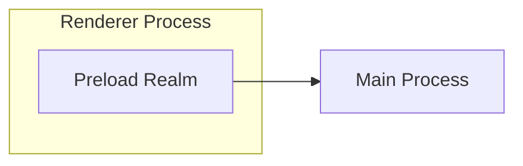
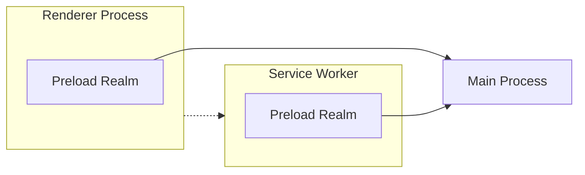
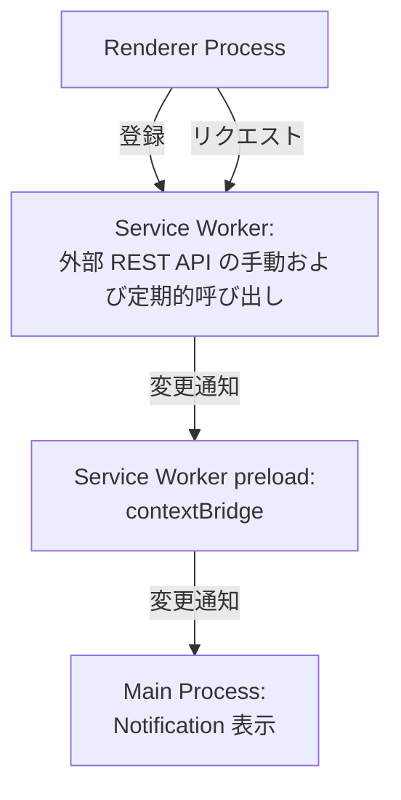

## 引言
本月初，Electron 35.0.0 发布了。

- [Electron 35.0.0 | Electron](https://www.electronjs.org/blog/electron-35-0)

在这一版本发布中，新增了可以将预加载脚本附加到 Service Worker 的功能。就像之前在 Renderer 进程中的预加载脚本为 Web 页面和 Main 进程（Node.js）的环境之间架起了桥梁一样，Service Worker 的预加载脚本也提供了连接 Service Worker 和 Main 进程的桥接功能。

:::info
在 Chrome 88 及之后版本支持的 Manifest V3 扩展中，有可能影响 Chrome 扩展性能的代码不再在主线程中执行，而是在 Service Worker 中执行，从而促进了向 Manifest V3 的迁移。

[迁移到 Manifest V3  |  Chrome Extensions  |  Chrome for Developers](https://developer.chrome.com/docs/extensions/develop/migrate?hl=ja)

新增 Service Worker 预加载脚本的功能，似乎旨在使 Electron 应用更容易支持已经迁移到 Manifest V3 的 Chrome 扩展。
:::

## Service Worker 预加载脚本的意义
能够将预加载脚本附加到 Service Worker 中，无疑对那些编写同时在 Chrome 和 Electron 应用中运行扩展的开发者有很大好处。而且，笔者认为这不仅如此，它还可能革新 Electron 的编程范式。

传统的预加载脚本为执行网页的 Renderer 进程提供了桥梁，使得与作为 Node.js 环境的 Main 进程之间的通信成为可能。


由于支持了 Service Worker 预加载脚本，现在在 Service Worker 中也可以像在 Renderer 进程中那样实现与 Main 进程间的通信。



通过引入 Service Worker，可以分担日益臃肿的 Main 进程的职责，或将可能影响 UI 操作的繁重处理卸载到 Service Worker 上。

:::info
在 35.0.0 的发布说明中提到，也可以实现 Service Worker 之间、以及 Preload Scripts 之间的 IPC 通信。可以创建针对不同目的的 Service Worker，并考虑构建一种类似微服务架构的 Service Worker 间联动。

> Furthermore, IPC is now available between Service Workers and their attached preload scripts via the ServiceWorkerMain.ipc class.

关于 Service Worker 预加载 Realm 的 RFC 如下所示。详细解释了引入它的动机以及提议的 API 对应用代码写法的影响。

@[og](https://github.com/electron/rfcs/blob/main/text/0008-preload-realm.md)
:::

:::info
关于 Electron 的编程模型，请参阅以下文章。

@[og](/blogs/2022/02/14/history-of-electron-quick-start/)

@[og](/blogs/2024/08/28/electron-webcontentsview-app-structure/)
:::

## 通过 Service Worker 预加载脚本实现 Hello World

这次的目标是构建如下的消息管道[^1]。
- 在 Electron 应用启动时，从 Renderer 进程注册 Service Worker
- 实现了从 Renderer 进程向 Service Worker 的调用
- 在 Service Worker 中调用外部 REST API 并保存结果
  - REST API 的调用在接收到消息时和定时触发时执行
  - 若 REST API 调用的结果与上一次结果不同，则通过 Preload 的 contextBridge 向 Main 进程发送变更通知
- 在 Main 进程中接收到变更通知后，在桌面显示 Notification

[^1]: 这设想了一种场景，即将之前在 Renderer 进程或 Main 进程中执行的对外部服务的轮询操作卸载到 Service Worker 上。



项目结构如下。

```shell
.
├── index.html
├── main.mjs              # Main 进程
├── package.json
├── preload-sw.js         # Service Worker 预加载脚本
├── preload.js            # Renderer 预加载脚本
├── renderer.js           # Renderer 进程
└── service-worker.js     # Service Worker
```

:::alert
请注意，Service Worker Preload Scripts 的 RFC 中展示的示例代码所使用的 API 是在提议阶段的版本，与 v35 中实现的版本有所不同。目前官方文档和示例几乎没有，因此在构建过程中，是通过在 VS Code 中悬停查看 JSDoc 来确认 API 的使用情况。因此，本文的代码片段在 API 使用方式上可能不完全合适，请注意。
:::

另外，此次编写的所有源代码可在以下仓库中获取。

[electron-study/serviceworker-notification-example at master · kondoumh/electron-study](https://github.com/kondoumh/electron-study/tree/master/serviceworker-notification-example)

### Service Worker 的注册 (Renderer 进程)
在 Renderer 进程中，在启动时会注册 Service Worker。

```javascript:renderer.js
onload = () => {
  navigator.serviceWorker.register('service-worker.js')
    .then(() => console.log('Service Worker registered'))
    .catch((err) => console.error('Service Worker registration failed:', err));
}
```

### 注册 Service Worker 预加载脚本 (Main 进程)
利用 Session 类的 registerPreloadScript 方法注册预加载脚本。在 35.0.0 中新增了在 `type` 中指定 `service-worker`，因此需指定此类型。

```javascript
app.whenReady().then( async () => {
  session.defaultSession.registerPreloadScript({
    type: 'service-worker',
    id: 'worker-preload',
    filePath: path.join(__dirname, 'preload-sw.js'),
  });
  // 创建窗口等
}
```

### 在 Service Worker 预加载脚本中的 API 定义
与传统的 Renderer 进程预加载脚本类似，此处使用 contextBridge 与 ipcRenderer 实现了与 Main 进程通信的 API。在此示例中，实现了一个通过标识符 `NOTIFY_TEXT` 发送文本信息到 Main 进程的 API，并将其公开给 Service Worker。

```javascript:preload-sw.js
const { contextBridge, ipcRenderer } = require('electron');

if (process.type == 'service-worker') {
  exposeApi();
}

function exposeApi() {
  const api = {
    notify: (text) => {
      ipcRenderer.invoke("NOTIFY_TEXT", text);
    },
  };

  contextBridge.exposeInMainWorld("myElectronApi", api);
}
```

### 实现 Service Worker
调用外部 REST API，并利用在 Preload 中定义的 myElectronApi 发送结果。此处理以十秒间隔执行[^2]。

[^2]: 虽然在 Service Worker 中使用 setInterval 可能会导致问题，但这里采用了简化的实现。

```javascript:service-worker.js
let lastStatus = null;

function checkStatus() {
  fetch('https://jsonplaceholder.typicode.com/todos/1') // Fake API for testing
    .then(res => res.json())
    .then(data => {
      if (data && data.title !== lastStatus) {
        lastStatus = data.title;
        myElectronApi.notify(data.title);
      }
    })
    .catch(err => console.error('[Service Worker] API error:', err));
}

checkStatus();
setInterval(checkStatus, 10000); // Check every 10 seconds
```

### 在 Main 进程中处理 Service Worker 的 IPC
来自 Service Worker 的 IPC 请求，与来自 Renderer 的 IPC 请求不同，不能由 ipcMain 进行处理。必须使用 ServiceWorker 类的 ipc 属性（IpcMainServiceWorker 类）的 handle 方法来处理。在与注册 Service Worker Preload Scripts 时相同的 app.whenReady() 环境中，利用 session 对象的 API 来实现该处理。

```javascript
app.whenReady().then( async () => {
  // ・・・
  session.defaultSession.serviceWorkers.on("running-status-changed", details => {
    if (details.runningStatus === "running") {
      const sw = session.defaultSession.serviceWorkers.getWorkerFromVersionID(details.versionId);
      if (!sw) return;
      sw.ipc.handle("NOTIFY_TEXT", (event, text) => {
        // Show a notification
        const notification = {
          title: 'Service Worker Notification',
          body: text,
        };
        new Notification(notification).show();
      });
    }
  }

  // 创建窗口处理
}
```
在接收到 Service Worker 生命周期事件 `running-status-changed` 时，根据 Service Worker 的 runningStatus 判断，如果为 `running`，则通过 getWorkerFromVersionID 方法获取 ServiceWorker 实例，并使用 ipc.handle 方法进行事件处理。在此，使用 Notification API 通过 IPC 请求发送的文本来显示桌面通知。

:::info
在 Service Worker 中的 console.log 输出可以通过监听 `console-message` 事件在 Main 进程中捕获。这对于调试与 Service Worker 的通信处理非常有帮助。

```javascript
  session.defaultSession.serviceWorkers.on(
    "console-message",
    (event, messageDetails) => {
      // Listen for console messages from the service worker
      console.log('Service Worker: %d console message: %s', messageDetails.versionId, messageDetails.message);
    }
  )
```
:::

### 从 Renderer 进程调用 Service Worker
到目前为止，我们已经实现了 Service Worker → Main 进程的通信，但尚未实现从 UI（Renderer 进程）调用 Service Worker。

在 UI 端添加一个调用 Service Worker 的按钮。

```html:index.html
<!DOCTYPE html>
<html>
  <head>
    <meta charset="UTF-8">
    <meta http-equiv="Content-Security-Policy" content="default-src 'self'; script-src 'self'; style-src 'self' 'unsafe-inline'">
    <title>Hello World!</title>
  </head>
  <body>
    <!-- 添加按钮 -->
    <p>
      <button id="service-worker">Call Service Worker</button>
    </p>
    <script src="./renderer.js"></script>
  </body>
</html>
```

通过使用 Web 标准的 ServiceWorkerContainer API，即可从 Renderer 进程向 Service Worker 发送消息。添加按钮的 EventListener 来实现对 Service Worker 的调用。

```javascript:renderer.js
document.querySelector("#service-worker").addEventListener("click", () => {
  navigator.serviceWorker.getRegistration().then((registration) => {
    if (registration) {
      registration.active.postMessage("Hello from the renderer process!");
    } else {
      console.error("No active service worker found.");
    }
  });
});
```
最后在 Service Worker 端注册一个监听器，并使用在 Preload 中定义的 myElectronApi 添加向 Main 进程发送数据的处理。

```javascript:service-worker.js
// 省略

globalThis.addEventListener('message', (event) => {
  myElectronApi.notify(event.data);
});
```

### 运行效果
我们试着运行了到目前为止实现的带有 DevTools 显示的应用。


定时执行产生的事件和按钮点击产生的事件均被通知，并显示了 Notification。


:::info
在 macOS 上开发 Electron 应用时，要启用桌面通知，需要在系统设置中启用 Electron 的通知。


:::

## 最后
以上，我们试用了在 Electron 35.0.0 中引入的 Service Worker 预加载脚本。期待官方进一步的信息发布，如果能发现有用的用例，我还会再写文章。
