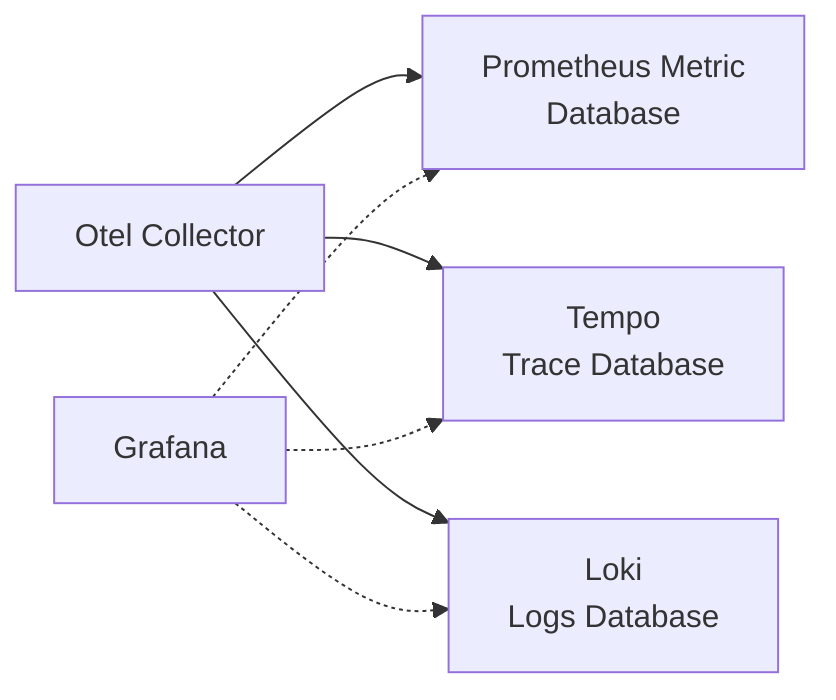
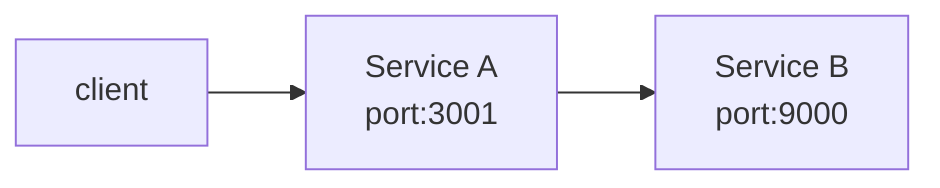

## 引言
虽然已经近两个月前，但在 Deno 2.2 发布时，OpenTelemetry 的集成作为亮点被宣布出来了。

[Deno 2.2: OpenTelemetry, Lint Plugins, node:sqlite](https://deno.com/blog/v2.2)

指标、追踪、日志等遥测信息的收集，是实现应用程序可观察性不可或缺的要素。由于遥测信息的交互已作为 OpenTelemetry 的规范得到标准化，促使各语言和运行时的支持不断推进，Deno 也因此作为运行时功能进行了集成。

Deno 的 OpenTelemetry 文档在这里。

@[og](https://docs.deno.com/runtime/fundamentals/open_telemetry/)

这次在 Deno 2.2.8 环境中进行了试用。

:::info
关于通过 OpenTelemetry 进行指标收集和分布式追踪，本站有几篇详细的文章，请参考。

@[og](/containers/k8s/tutorial/ops/opentelemetry/)
@[og](/containers/k8s/tutorial/ops/jaeger/)
@[og](/containers/k8s/tutorial/ops/awsxray/)
@[og](/msa/mp/cntrn16-mp-tracing/)
:::

## 启动 OTLP endpoint / Grafana
如果在本地试用的话，如官方博客中所述，使用 Grafana Labs 的 docker-otel-lgtm 可以启动 OpenTelemetry（以下简称 Otel）的 Collector 的端点以及 Grafana，从而在仪表板上进行监控。

@[og](https://github.com/grafana/docker-otel-lgtm)

Otel Collector 收集的数据会分别存储于 Prometheus Metric / Tempo Trace / Loki Logs 等数据库中，并且可通过 Grafana 仪表板进行监控。



使用 docker run 可以轻松启动。

```shell
docker run --name lgtm -p 3000:3000 -p 4317:4317 -p 4318:4318 --rm -ti \
    -v "$PWD"/lgtm/grafana:/data/grafana \
    -v "$PWD"/lgtm/prometheus:/data/prometheus \
    -v "$PWD"/lgtm/loki:/data/loki \
    -e GF_PATHS_DATA=/data/grafana \
    docker.io/grafana/otel-lgtm:0.8.1
```

如下所示，将启动 gRPC 与 HTTP 的端点以及 Grafana。

```
The OpenTelemetry collector and the Grafana LGTM stack are up and running. (created /tmp/ready)
Open ports:
 - 4317: OpenTelemetry GRPC endpoint
 - 4318: OpenTelemetry HTTP endpoint
 - 3000: Grafana. User: admin, password: admin
```

## 在多个服务协同中试用追踪：服务实现
如下，以 REST API 服务 (A) 再调用另一 REST API 服务 (B) 的构成来尝试追踪。



Service A 的代码。在端口 3001 启动，并将调用 Service B 的结果返回给客户端。

```typescript:service_a.ts
Deno.serve({ port: 3001 }, async (req) => {
  console.log("Service A Received request for", req.url);
  const res = await fetch("http://localhost:9000");
  const text = await res.text();
  console.log("Service A Received response from Service B", text);
  return new Response(`Service A got: ${text}`);
});
```

Service B 的代码。在端口 9000 启动，并向客户端（此处为 Service A）返回简单消息。

```typescript:service_b.ts
Deno.serve({ port: 9000 }, (req) => {
  console.log("Service B Received request for", req.url);
  return new Response("Hello world");
});
```

启动 Service A。通过将环境变量 `OTEL_DENO` 设为 true 来启用 Otel，并通过 `OTEL_SERVICE_NAME` 指定服务名来使追踪结果更易于查看。这里将其服务名设置为 `svc-a`。

```shell
OTEL_DENO=true OTEL_SERVICE_NAME=svc-a deno run --unstable-otel --allow-net service_a.ts
```
:::info
Deno 的 OpenTelemetry 集成 API 仍处于不稳定状态，未来可能会有所改变，因此需要指定 `--unstable-otel` 标志。
:::

同样地，也启动 Service B。服务名设置为 `svc-b`。

```shell
OTEL_DENO=true OTEL_SERVICE_NAME=svc-b deno run --unstable-otel --allow-net service_b.ts
```

## 在多个服务协同中试用追踪：在 Grafana 中可视化
到此已完成服务协同的准备，接下来我们调用 Service A 并在 Grafana 中观察追踪情况。

访问 `localhost:3000` 将显示 Grafana 的界面。


从菜单中选择 `Explore`。默认数据源为 Prometheus，因此请选择 Tempo。


将显示 Tempo 的查询界面。


使用 curl 调用 Service A。

```shell
curl - http://localhost:3001
```

点击刷新按钮后，在 Tempo 的查询界面中显示了调用的 Trace ID、时间、服务名、HTTP 方法及响应时间。


Trace ID 似乎是由 Deno 的 Otel Exporter 端分配的。点击此 Trace ID 后，将显示追踪信息的详细内容。执行顺序显示为 svc-a → svc-b。


展开 Node graph 后，可视化调用关系。


在查询界面的 Service Graph 中，服务之间的关系也得到了可视化。


Trace ID 好像被嵌入到了请求头中。在 Service B 中添加了显示请求头的代码。

```typescript:service_b.ts
Deno.serve({ port: 9000}, (req) => {
  // 显示请求头
  for (const [key, value] of req.headers.entries()) {
    console.log(key, value);
  }
  console.log("Service B Received request for", req.url);
  return new Response("Hello world");
});
```

Trace ID 是以键 `traceparent` 设置的。

```
accept */*
accept-encoding gzip,br
accept-language *
host localhost:9000
traceparent 00-34ea2fccfa0ce81bc8855043682b2810-895a8a6b4e02df52-01
user-agent Deno/2.2.8
```

看起来只需启用 Otel 而无需改动应用代码，就可以实现分布式追踪了呢。

## 指标显示
指标可以通过仪表板的 Metrics 进行查看。数据源为 Prometheus。


过滤 otel_ 前缀后，显示出似乎是 Otel 所使用资源的状态。


过滤 v8js_ 前缀后，显示了构成 Deno 运行时基础的 V8 JavaScript 引擎的指标。


:::info:Otel 相关的附加功能

从 v2.2.0 版本开始，Otel 相关功能不断被添加。

在 v2.2.4 中加入了对 Context propagation 的支持.

@[og](https://github.com/denoland/deno/pull/28460)

在 v2.2.5 中加入了对 Span Events 的支持.

@[og](https://github.com/denoland/deno/pull/28552)

在 v2.2.7 中加入了对 V8 JS Engine Runtime metrics 的支持。借此，在 Grafana 中可以获取 v8js_ 前缀的指标。

@[og](https://github.com/denoland/deno/pull/28592)

V8 JS engine runtime metrics 规范如下.

@[og](https://opentelemetry.io/docs/specs/semconv/runtime/v8js-metrics/)
:::

## 日志显示
可以从仪表板的 Logs 中查看。每个服务均显示时序和日志。


## 最后
以上，通过简单的代码试用了在 Deno 2.2 中实现的 OpenTelemetry 集成。在 Kubernetes 环境下使用时，也不需要部署 sidecar 容器，仅需设置环境变量，十分方便。今后在 Deno 以外的语言和运行时混合的环境中，也有望实现分布式追踪。

虽然最后展示了 Grafana 的界面，但如果能制作出利用告警和查询来应用于生产环境的仪表板，需求将会很大。

:::info:2025.04.10 补充
官方也发布了关于 Otel 的博客。

[Zero-config Debugging with Deno and OpenTelemetry](https://deno.com/blog/zero-config-debugging-deno-opentelemetry)
:::
